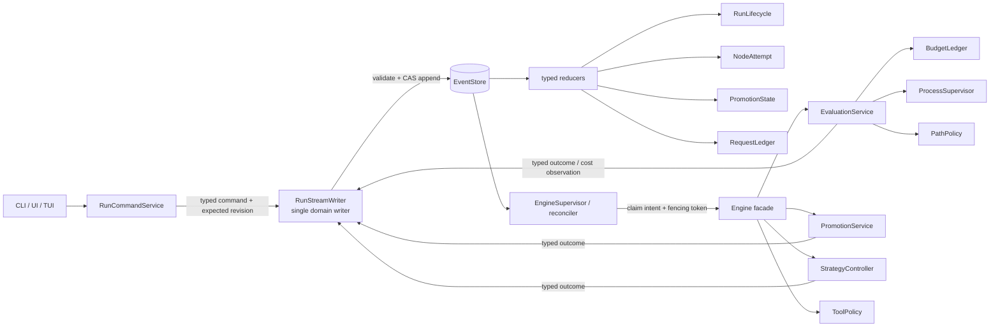
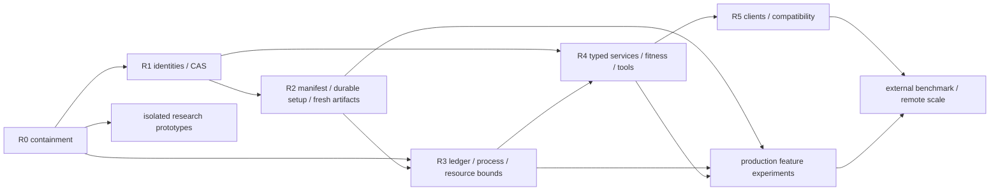
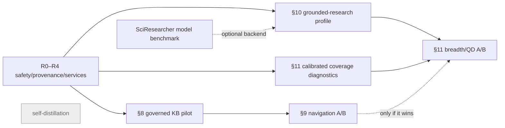

# LoopLab — Project Review, Architecture & Development Directions (2026-07-11, reconciled 2026-07-12)

> Current-state strategic synthesis for executable revision
> `369d6a6c6fe0ccf0f921051ffba71c742879bfdb`; documentation/UI reconciliation is included through
> `89af408`. [Doc 16](16-architecture-code-review-2026-07-11.md) (`41f9345`) remains the original
> finding/reproduction ledger. This revision adds the implementation disposition of the subsequent
> fix series and supersedes the first version of doc 17 in `32dc6c0`.

| Metadata | Value |
|---|---|
| **Status** | current / canonical plan |
| **As of executable commit** | `369d6a6c6fe0ccf0f921051ffba71c742879bfdb` |
| **Post-audit increment** | `931c28b` (P0-2 open→partial; census 66/12; see §13.6). Quantitative figures are pinned per statement; unpinned counts are as of `369d6a6`. |
| **Documentation reconciliation** | `89af408` (doc 18 and post-fix UI disposition) |
| **Normative for** | priority, dependencies, release gates, feature promotion criteria |
| **Finding/reproduction authority** | [doc 16](16-architecture-code-review-2026-07-11.md) |
| **Current implementation disposition** | §6.3 and §13.2 of this document |
| **Supersedes** | doc-17 verdict in `32dc6c0`; current-order claims in docs 06/10/11/12, ROADMAP, BACKLOG where they conflict |
| **Superseded by** | — |
| **Last verified** | 2026-07-12 |

**Companion docs:** [01-product-design.md](01-product-design.md) ·
[02-architecture.md](02-architecture.md) · [03-decisions.md](03-decisions.md) (ADR-6, ADR-9,
ADR-10) · [16-architecture-code-review-2026-07-11.md](16-architecture-code-review-2026-07-11.md)
(authoritative tactical findings and reproductions) ·
[18-ui-ux-review-2026-07-11.md](18-ui-ux-review-2026-07-11.md) (UI/UX observations and acceptance
criteria, subordinate to this plan) ·
[13-external-works-analysis-2026-07.md](13-external-works-analysis-2026-07.md) ·
[ROADMAP.md](ROADMAP.md) · [BACKLOG.md](BACKLOG.md) · [guide/memory.md](guide/memory.md).

**What this is.** One structural document in three parts. **Part I** gives the strategic verdict on
functionality, code, and architecture without duplicating doc 16's line-level issue ledger. **Part II**
turns that verdict into a dependency-ordered delivery plan with migration rules, release gates, metrics,
and decision criteria. **Part III** re-evaluates four candidate feature directions — a curated
Frameworks/Libs knowledge base, NapMem, SciResearcher, and research-exploration breadth — against the
stabilization plan rather than treating them as immediately shippable flags.

**Method and evidence discipline.** The revision combines a fresh code/doc cross-check, direct inspection
of the current state/event/security/execution seams, commit-by-commit review of the 23-commit remediation
series from
`37f5304..369d6a6`, current CI evidence, local documentation/UI verification, and primary-source research.
Statements are classified implicitly as:

- **code-confirmed** — traced to the current repository and, where meaningful, reproduced or covered by a
  named test;
- **externally evidenced** — supported by a linked primary paper, specification, or official platform
  documentation;
- **recommendation/inference** — a proposed LoopLab design, not a result claimed by the external source.

All four Part III papers and their arXiv identifiers were verified from their official pages on
2026-07-11. Paper results remain author-reported and domain-specific; they justify experiments, not an
automatic production rollout.

**Contents.** Part I — §1 executive summary · §2 snapshot · §3 functionality · §4 code & tests · §5
architecture. Part II — §6 development directions and target architecture · §7 dependency-ordered delivery
plan. Part III — §8 Frameworks/Libs KB · §9 NapMem · §10 SciResearcher · §11 exploration breadth · §12
composition and recommendation · §13 verification and sources.

---

## PART I — PROJECT & ARCHITECTURE REVIEW

### 1. Executive summary — where LoopLab stands

**LoopLab has a strong experimental foundation, and the post-audit fix series materially reduced its
immediate risk, but the remaining frontier is still not small feature work.** Doc 16 originally confirmed
**7 P0 and 12 P1 findings**. At `369d6a6`, the exact reproductions behind many of them are contained and
covered by regression tests. P1-1 and P1-12 remain wholly open (P0-2 advanced open→partial at `931c28b` —
the reopen-epoch + subject-bound approval increment; see §13.6); the rest range from a closed original
reproduction to a partial architectural contract, depending on the residual stated in §13.2. Commit titles
are therefore not counted automatically as architectural closure.

The first doc-17 verdict — “the load-bearing invariants hold; zero reproducible replay/data-corruption
defects; risks are maintainability, not correctness” — is refuted by executable counterexamples in
[doc 16 §§3–4](16-architecture-code-review-2026-07-11.md). The event log remains a good projection and
audit substrate. Setup re-entry, corrupt-middle refusal/repair, task-alias conflict, and late terminal
containment are now stronger; replay-complete continuation still lacks full attempt, epoch, request,
run-instance, and manifest boundaries.

**The verdict on each axis:**

| Axis | Verdict |
|---|---|
| **Architecture** | **Strong substrate, partially contained lifecycle model.** Setup completion, terminal-attempt generation, the reopen-search-epoch + subject-bound approval, several permission/path boundaries, and event-log repair landed. Full search-epoch stamping (promotion/finalization and per-epoch hidden holdout), complete attempt/request identity, immutable run manifests, hard budget reservation, and one control writer remain missing. |
| **Code & tests** | **Substantial, disciplined, and green in validation CI.** The remediation series added focused regressions and the full suite passes for validation commit `89af408`; green examples do not prove the remaining interleavings, fail-open-lock behavior, object authorization, unpolled deadlines, or workspace identity. |
| **Functionality** | **Broad, unevenly production-ready.** The default trust posture is mostly audit/off, temporal CV has no shipped caller, six adapters are synthetic/harness-oriented, and the isolated real-task path is under-validated. |
| **Directions** | **Finish residual stabilization, then promote features through gates.** Offline discovery may continue, but live production activation still waits for the relevant identity, policy, budget, and provenance contracts. |

Four incomplete identity families explain much of the residual defect cluster:

1. **`NodeAttemptId`** — reset now increments a node `attempt`, and stamped `node_evaluated`/`node_failed`
   terminals from an older attempt are rejected (`47f786a`). Confirmation, holdout, trust, abort, repair,
   forced-operation, artifact, and cost effects are not all scoped to that generation, so P0-1 is partial.
2. **`SearchEpoch`** — reopening a *finished* run now bumps `search_epoch` and re-opens confirmation and
   subject-bound approval for the new candidate set (`931c28b`), so an older champion no longer locks
   selection. The residual is partial: holdout is not re-hidden per epoch, and promotion/finalization outputs
   are not yet epoch-stamped, so a reopened run still scores against an already-disclosed holdout — P0-2
   partial (§13.6).
3. **`RequestId` + `SubjectHash`** — permission resolution now uses pending→resolved CAS and centrally gates
   MCP/background kill (`87dfc7e`), but approvals, aborts, forced operations, and promotion/finalization
   decisions are not all bound to the exact request and subject revision.
4. **`RunInstanceId` + `RunManifest`/`InputSnapshot`** — `run` now rejects a different task ID and conflicting
   repo aliases before overwriting an existing run (`4c6c59f`), and setup completion is folded (`5f5ce46`).
   Config, dirty tracked input bytes, environment, materialized inputs, mutable attempt workdirs, and their
   artifacts still lack one immutable instance/manifest boundary, so P0-5/R2 remain partial.

Two earlier product findings remain valid, but they are **post-stabilization credibility work**, not the
top engineering priority:

1. **Many trust mechanisms exist but the default posture is mostly dormant/audit-only.** Confirmation,
   reward-hack detection, code-leakage detection, critic, and redaction are off; `trust_gate="audit"`.
   `--profile thorough` enables confirmation/reward-hack/code-leakage/critic and flips the gate, but leaves
   output redaction off (`core/config.py:46-63,339-370`). This is a *deliberate*
   cheap-toy-default design (the config comment says so), but it means the default `looplab run` performs
   host-side scoring and held-out selection while **most optional confirmation, detector, and enforcement
   mechanisms remain disabled** — a narrower posture than the product and the UI's own
   "Trust & rigor — the point of LoopLab" panel
   (`ui/src/panels.jsx:132`) — advertises. The reproduced false-clean workdir states and leakage-regex
   precision/recall defects are fixed (`d8d240c`, `4d0f362`, `13f087c`); **do not enable hard gating by
   default until a labelled calibration corpus establishes precision, recall, abstention, and missing-input
   behavior beyond those examples.**
2. **The temporal/target-leakage differentiator (ADR-6's stated edge) has no live caller.** `trust/cv.py`'s
   own docstring says `purged_walk_forward` / `consistent_cv` / the `Evaluator` Protocol are "complete and
   tested, but not yet consumed by a shipped adapter"; the `timeseries` adapter runs its own embedded
   backtest instead. **The claimed moat needs one adapter that exercises it end-to-end.**

**Roadmap decision:** finish state identity and the remaining fail-closed boundaries first; then prove real-task trust
and evaluation; only then broaden networked research, memory navigation, and quality-diversity search.
This is not a rewrite: keep the event-log spine and flat public read model, restore append-only domain
semantics (tombstones plus explicit compaction generations), and add a versioned envelope and explicit
services/value objects behind the existing `Engine` facade.

### 2. Current-state snapshot

| Package | Files | LoC | Role |
|---|---|---|---|
| `engine/` | 27 | 7,192 | orchestrator + 12 mixins + cross-run memory |
| `serve/` | 30 | 6,756 | FastAPI server, routers, TUI, assistant |
| `tools/` | 24 | 4,959 | agent-facing tools, memora/vectorstore, env_inspect |
| `adapters/` | 15 | 4,604 | 9 task kinds + composable front-end |
| `core/` | 19 | 4,598 | domain models, Settings, LLM client, parse/trace |
| `agents/` | 10 | 3,292 | roles, tool-loop, cli-agent, unified agent, strategist |
| `events/` | 9 | 2,623 | event store, replay/fold, projections, exporters |
| `search/` | 9 | 1,901 | policies, operators, foresight, hybrid-merge, coverage |
| `runtime/` | 8 | 1,763 | sandbox tiers, command-eval, deps |
| `cli/` | 6 | 1,225 | run/export/inspect/ui command groups |
| `trust/` | 10 | 918 | leakage, reward-hack, CV, redaction, confirm, harden |
| **Total** | **170** | **40,242** | 167 package files + 3 root modules; 157 Python test files / 27,170 physical test lines |

Hotspots (LoC): `engine/orchestrator.py` 1497 · `events/replay.py` 1008 ·
`adapters/repo_developer.py` 962 · `core/llm.py` 865 · `core/config.py` 780 · `agents/roles.py` 748.

### 3. Functionality review

#### Capability matrix (✅ stable core · 🟡 partial/unsafe edge · ⛔ blocks a supported path · ⬜ missing)

| Area | Status | Notes (code-anchored) |
|---|---|---|
| **Task adapters** (9 kinds) | 🟡 | The registry is real, but only **`repo`, `mlebench_real`, `dataset`** are real-work paths; six are synthetic/demo/trust harnesses. `mlebench_real` offline baselines cover three competitions. Exact input/environment identity is not yet canonicalized into a run manifest. |
| **Composable task front-end** | 🟡 | Capability inference and ambiguity checks are useful; conflicting `{repo, editable_path}` aliases are now rejected (`4c6c59f`). Relative sources can still resolve in different parent/child contexts, and aliases are not a substitute for a canonical InputSnapshot. |
| **Roles & backends (ADR-7)** | 🟡 | Role routing is broad. BestOfN/Validating wrappers now forward parent-aware hooks (`65221f6`), closing the reproduced baseline-regeneration bug. RepoDeveloper step outcomes remain stringly and wrappers still lack a typed `DevelopmentResult` contract. |
| **"Evaluator" role** | ⬜ | There is **no first-class Evaluator**; verification is a distributed subsystem (sandbox + host grader + trust gates + critic + memo-verifier), and `trust/cv.py`'s `Evaluator` Protocol is **unused**. A naming/architecture gap. |
| **Search policies** | 🟡 | Greedy is the static default and alternatives are opt-in/under-benchmarked. Reopen now bumps `search_epoch` and re-opens confirmation/approval (P0-2 partial, `931c28b`); the residual disagreement about raw vs promoted fitness is driven by holdout reuse and unstamped promotion/finalization, not confirmation. |
| **Operators** | 🟡 | The operator set is rich. Reset now bumps an attempt generation and rejects stale eval/fail terminals, and ablation wall time is charged (`47f786a`, `a5f74b1`). Other attempt-scoped effects, forced-operation request identity, and reserve-before-spawn accounting remain open. |
| **Trust layer** | 🟡 for audit; gated promotion uncalibrated | Defaults are mostly disabled/`trust_gate="audit"`; held-out selection is on. Missing/unreadable protected files now fail closed and the reproduced leakage-regex defects are fixed (`d8d240c`, `4d0f362`, `13f087c`). A labelled detector corpus, epoch-bound evidence, and abstention policy are still required before global hard gating. Temporal CV remains unwired. |
| **Sandbox / command evaluation** | 🟡 | Stage/adapter/prediction path escapes, non-finite timeouts, post-spawn NUL cleanup, and Windows bind grammar were fixed (`cdc5423`, `c4a2113`). Full CPU/RAM/disk enforcement, an unpolled deadline watcher, bounded readers/regex, and a validated real-adapter image/data contract remain. |
| **Memory / knowledge** | 🟡 | Seven useful stores and retrieval primitives exist, but they are not a provenance-linked pyramid; shared content and vector indices are outside the run manifest, and the dormant `CaseLibrary` is only one retrieval primitive, not “80% of NapMem.” |
| **Serve / UI** | ⛔ for shared deployment | Permission CAS/MCP/background-kill gates are centralized, sensitive routes were gated, public state was redacted, and TUI/JS needs-engine registries now match (`87dfc7e`, `eee59c3`, `c4fbf70`, `3170d85`). Auth remains a blacklist rather than default-deny, object ownership is absent, and direct AssistantBar/Dock control postconditions still diverge (doc 18 CTRL-01). |
| **CLI / run control** | 🟡 | A different task ID or conflicting repo alias is now rejected before reusing a run directory (`4c6c59f`). Full config/source/environment identity and atomic resume/finalization ownership remain absent; P1-1 can still leave a zombie run. |
| **Genesis / Strategist / deep research** | 🟡 | The strategy name/params governance asymmetry is fixed (`ca3c9fe`). Spec approval remains not subject-bound, and web/literature are correctly opt-in until network permission, budget, and provenance controls exist. |

#### The functionality gaps worth prioritizing

Release-safety work comes first:

1. **Complete identity-safe reset/reopen/approval/finalization** — extend the landed terminal-attempt guard to
   confirmation/trust/holdout/abort/cost/artifacts; add epoch, request, subject, and expected-revision semantics.
2. **Reproducible run continuation** — build on folded setup completion and task-ID refusal with an immutable
   task/config/InputSnapshot/environment manifest; `run` creates and `resume` continues, never a hybrid.
3. **Finish central effects and authorization** — invert route auth to default-deny, add principal/object checks,
   put every tool behind host-owned `ToolSpec`, and converge clients on one RunCommandService. Permission CAS
   and the reproduced MCP/background bypasses are already fixed.
4. **Finish bounded execution** — replace partial cost accounting/tree kill/path containment with one durable
   `BudgetLedger`, one deadline-owning `ProcessSupervisor`, bounded output/input/regex, and physical quotas.
5. **Calibrate trust evidence** — the known workdir/leakage defects are fixed; now measure structured evidence
   on a labelled corpus before changing the default from audit.

After those gates, the credibility/feature gaps are: a live temporal-CV adapter; a real adapter with a private
grader; one real adapter validated in an isolated tier; one proven external Developer wrapper; a first-class
evaluation/promotion service; and controlled benchmarks for alternative policies. Do not claim a self-editing
assistant or production remote execution until its permission and process boundaries satisfy the same gates.

### 4. Code & test health

The codebase is substantial and often disciplined; the previous conclusion failed by equating a large green
suite with coverage of the system's hardest state and effect boundaries. Current size (as of the pinned
`369d6a6`) is 170 production Python modules / 40,242 physical lines and 157 Python test files / 27,170
physical lines; the `931c28b` increment adds ~128 production and ~248 test lines with no new modules (§13.6).
Doc 16's historical
baseline records two Linux runs (Python 3.11 and 3.12) at **1,711 passed, 33 skipped, 1 stale-test failure**
each. More importantly for this revision, the complete GitHub `python -m pytest` workflow and strict docs
workflow both pass for validation commit `89af408` (code tree `369d6a6`; §13.2). This is strong regression
evidence, not proof of the remaining epoch/CAS/concurrency/resource guarantees.

#### What the tests establish — and what they do not

| Area | Established strength | Missing/adversarial coverage now required |
|---|---|---|
| Fold/event log | Pure fixed-log fold; torn-tail handling; invalid JSON/**Event envelope** refusal+repair; explicit folded/diagnostic partition; stale eval/fail terminal rejection by node attempt | Full attempt/epoch/request identity; corruption-after-open/append-lock TOCTOU; unsupported locks; expected-revision CAS; duplicate complete lifecycle |
| Engine | Real crash/resume path; setup completion folds and re-enters after crash; broad phase/operator coverage | Content-addressed crash points for every setup step/effect; reset during parallel eval; finish→resume wakeup; stale finalization; reserve-before-spawn budget |
| Trust/evaluation | Host-side held-out scoring; missing/unreadable protected inputs fail closed; named leakage FP/FN/NaN regressions pass | Labelled detector calibration and abstention; disclosed-holdout epoch; evidence/decision versioning; path/symlink fuzzing beyond known cases |
| Serve/tools | Permission resolution CAS; gated MCP/background kill; named sensitive GET and public-state regressions; TUI/JS registry parity | Default-deny route/tool census; lazy MCP authorization; direct AssistantBar/Dock postconditions; principal/object authorization |
| Runtime/platform | Contained stage/adapter/prediction paths; finite timeouts; robust explicit background tree kill; Windows mount-unit regressions | Unpolled deadline watcher; bounded output/JSON/regex; physical CPU/RAM/disk quotas; Windows Docker/Job Object integration matrix |
| Contracts | Exact event partition and several two-way source scans; parent-aware wrapper regression | Generated ControlSpec; typed DevelopmentResult/ToolSpec/TrustEvidence; wrapper failure semantics; one policy/fitness owner |

The central test upgrade is **model-based state-machine testing**, not more isolated examples. Hypothesis's
[`RuleBasedStateMachine`](https://hypothesis.readthedocs.io/en/latest/stateful.html) generates action
sequences and shrinks a failure to a minimal replayable program. Model `create/reset/evaluate/confirm/reopen/
approve/finalize/resume`, inject old-attempt and old-epoch events, and compare the real fold/command service
to a small reference model after every step. Pair that with deterministic crash injection at every durable
append boundary and platform process-tree tests.

#### Structural debt — sequence it behind the state model

- **The mixin Engine is a shared-state god object.** The 12 mixins improve navigation but share an implicit
  `self` with roughly 111 initialized attributes. This is real debt, but a broad extraction before the event
  identities are fixed would merely redistribute ambiguous state.
- **Domain contracts are stringly/duck-typed.** Untyped policy actions, provider strings, optional Developer
  methods, and flat lifecycle fields let wrappers and clients silently lose semantics.
- **The middle layer is conceptually cyclic.** `adapters <-> agents <-> search <-> tools` is hidden partly by
  lazy imports; composition should move above those packages.
- **Configuration has multiple sources of truth.** `369d6a6` aligns the known incremental-construction
  fallbacks with Settings, but the architectural duplication remains. Flat env-compatible Settings can stay
  public while validated internal option groups and one schema source prevent the next drift.
- **Compatibility is hand-maintained.** The `_LAYOUT` alias map and monkeypatch behavior need an immutable
  compatibility manifest and an explicit retirement policy, not incidental edits.

Extract `RunLifecycle`, `NodeLifecycleService`, `EvaluationService`, `PromotionService`,
`RunCommandService`, and `StrategyController` behind the current `Engine` facade only after their identity
and transition contracts exist. This produces real ownership boundaries and keeps compatibility; another
mechanical file split does not.

### 5. Architecture review

#### What holds, narrowly

- The intended lower dependency direction (`core <- events <- engine <- composition`) holds, and there is no
  direct `engine -> serve` import.
- `fold` is pure and deterministic for one fixed ordered log. Unknown **diagnostic** events can be ignored,
  and first-terminal-wins is correct within one lifecycle attempt.
- EventStore handles ordinary local serialization and a torn final line; it now refuses a corrupt middle or
  invalid Event envelope detected at construction and exposes a repair command. Host-side scoring keeps
  private labels outside a candidate workspace.

Those properties do **not** imply order tolerance, exactly-once effects, or replay-complete continuation.
State-sensitive UI/CLI commands still validate and append in separate steps; reset/reopen reuse incomplete
logical identities; setup has only a folded completion boolean rather than content-addressed step/manifest
identity; continuation also depends on mutable snapshots/workdirs/source/environment. Corruption detected at
construction now blocks append, but corruption-after-open is not rechecked under the writer lock. Unknown
authoritative/security event types must not be ignored by a writer that does not understand them — doing so
could replay a revoke or gate fail-open.

#### Target shape: additive identities and explicit owners

Keep `Engine` as the compatibility facade and `RunState` as a flat public projection. Put **one
`RunStreamWriter`** behind every state-changing client command and runtime outcome; neither a client nor an
Engine service appends directly. The writer canonicalizes payloads, validates the transition against the
current projection, checks the expected revision, and appends in one critical section:



`append_and_ensure_engine()` is not literally atomic across an OS process spawn. The atomic operation is
**recording the validated intent at an expected stream revision**; a startup scan and continuously monitored
supervisor then reconcile until an engine owns the pending epoch. This controller/outbox shape makes a lost
resume *recoverable* without pretending a filesystem append and process creation share a transaction. It
does not provide liveness by itself: if the reconciler is unavailable the intent stays pending, so startup,
watchdog, alerting, retry, and fencing behavior are part of the contract.

Arbitrary subprocess/file/network effects remain at-least-once: model them as
`scheduled -> started -> completed|failed|unknown`, give each a stable operation ID and fencing token, and
reconcile/probe after uncertainty. “Exactly once” is defensible only where the effect and durable outcome
share a real transaction. A downstream idempotency key gives only provider-scoped, effectively-once behavior
within that API's retention and parameter-matching contract; duplicate delivery remains possible and the
consumer/effect handler must be idempotent.

The v2 event envelope should carry stable `event_id`, schema version, sequence, causation/correlation IDs,
and only the scope keys relevant to that event:

```text
RunRef(run_id, run_instance_id, manifest_digest, stream_generation)
NodeAttemptRef(run_instance_id, search_epoch, node_id, attempt_id, code_hash)
EvaluationRef(run_instance_id, search_epoch, node_id, attempt_id,
              evaluation_id, kind, seed, fidelity)
RequestRef(run_instance_id, request_id, request_revision, subject_hash)
DecisionRef(run_instance_id, request_id, subject_hash, based_on_seq)
```

`run_id` remains the user-facing logical name. `run_instance_id` is immutable and globally unique for one
execution identity: `resume` preserves it, while whole-run `reset` creates a new one even when it reuses the
directory and logical name. `stream_generation` changes only for explicit compaction/repair and is not an
attempt or reset counter. Attempts, evaluations, requests, decisions, leases, effects, and artifact events
all carry the instance boundary.

`expected_seq` is an **append precondition**, checked in the same critical section as validation+append; it
is not trusted merely because it appears inside event data. Kurrent/EventStore's documented
[expected-revision](https://docs.kurrent.io/clients/python/v1.3/appending-events) behavior is the relevant
pattern: an exact consistency check plus the same event IDs makes the same retry idempotent within that
stream; IDs are not a global uniqueness guarantee. On local filesystems LoopLab should require the lock and
fail startup when it cannot enforce it. Shared/FUSE multi-writer deployment remains unsupported until a
server-owned writer/control journal exists.

`subject_hash` is computed by the host over a versioned canonical schema, not accepted from a client/model.
One request ID replayed with different canonical tool arguments, manifest, node attempt, evaluator, or
promotion result is a conflict. `ToolSpec.effects` is a host-owned set drawn from
`read|write|process|network|run_control`; “read” can still expose secrets. Authorization, one-shot user
consent, and sandbox containment are separate checks and all run again immediately before the effect.

#### Migration and reproducibility contract

- New writers emit v2; readers use explicit typed upcasters and preserve the old flat JSON projection.
- A v1 log with no reset/reopen ambiguity may project legacy instance/attempt/epoch zero. A v1 log containing
  reset, reopen, or pending decisions cannot recover the true origin of late events: open it read-only, or
  resume by creating an explicit new instance boundary. That boundary invalidates confirmations, trust
  completions, approvals, forced-evaluation and abort/control intents, leases, promotion/finalization
  requests, and unfinished effects. Blanket zero IDs would preserve the old bug or create false
  deduplication.
- `setup_completed(manifest_digest)` means every idempotent content-addressed setup step completed for those
  inputs; resume still verifies current material digests rather than trusting the historical event alone.
- `RunManifest` records canonical task and Engine options (secrets redacted) and references an immutable
  `InputSnapshot`: exact source/input file-set and content digests, code revision plus dirty **input** bytes,
  dependency lock/environment identity, container image digest, data/reference digests, and relevant
  tool/model versions. Attempt workdirs are mutable execution state, never part of that input snapshot;
  every evaluation emits a separate digest-bound `ArtifactManifest` for outputs. Git's
  [content-addressed tree/blob model](https://git-scm.com/book/en/v2/Git-Internals-Git-Objects) and SLSA's
  [Build Provenance model](https://slsa.dev/spec/v1.2/build-provenance) — especially external/internal
  parameters, resolved dependencies, and run details — are patterns. Exact dirty-workspace bytes, full
  environment identity, and secret-reference handling are LoopLab extensions, not guarantees supplied by
  SLSA itself.
- Event-log frames/checksums detect torn writes and accidental corruption covered by their framing. A hash
  chain without a trusted external anchor is not proof against an attacker rewriting the whole log;
  transparency/Merkle infrastructure is unnecessary for the current single-host threat model.

**Net verdict:** preserve the architecture's event-log projection spine, but treat identity, transition
validation, durability, and centralized effects as release work. Remote workers, broader network tools, and
mechanical Engine decomposition come after those contracts, not before them.

---

## PART II — DEVELOPMENT DIRECTIONS

### 6. Development directions

The older planning corpus (docs 06, 10–13, ROADMAP, BACKLOG) mixes historical aspirations, shipped code,
partially safe implementations, and still-open work under several incompatible ID schemes. For current
ordering, **doc 16 is the finding ledger and doc 17 is the canonical delivery plan**. Older status boards
remain useful research/history but are not authoritative when they disagree with these two documents.

#### 6.1 Canonical status model

“Implemented” is not the same as “safe on every advertised path.” Track five states:

| State | Current examples | Planning meaning |
|---|---|---|
| **Shipped / stable foundation** | lower dependency direction, fixed-log fold, host-side held-out scoring, core operators, memory stores, error taxonomy, broad UI surfaces | Preserve; regression-gate while changing adjacent contracts |
| **Shipped / unsafe or partial** | reset/reopen and holdout promotion, terminal-only attempt generation, blacklist auth, hard trust gating, post-hoc budget checks, shared run controls | Do not count a bounded containment fix as completion; map residuals to R0–R5 below |
| **Open product work** | live temporal-CV adapter, private real-task grader, isolated real-adapter image/data contract, validated external Developer | Schedule only after prerequisites |
| **Research hypothesis** | KB schema, NapMem navigation, proactive breadth/QD, SciResearcher backend/self-distillation | Prototype and measure; no production promise |
| **External/infra gated** | published real MLE-bench, remote worker fleet, AgentDS-style adapter | Requires the release-safety gates and external resources |

The LLM response cache is already implemented (`llm_cache`) but off by default; it is not a missing scale
subsystem. Direct RepoDeveloper already has a parent-aware path, and BestOfN/Validating wrappers now preserve
it; the remaining gap is typed failure/deletion semantics and validation against a real external backend.
`operator_yields` also reaches StrategyContext/Strategist prompts, but its cost denominator is incomplete
until confirmation and parallel reservations share one ledger (ablation is now charged post-hoc).

#### 6.2 Temporary safe operating envelope

Until R0–R3 close, the defensible operating mode is intentionally narrower than the full feature surface:

- create a **fresh empty run directory**; use `resume` only for that exact task/config/workspace;
- one local writer on a filesystem with a working mandatory lock; no FUSE/shared multi-writer deployment;
- bind the server to loopback for one trusted operator; shared/JupyterHub or other multi-user deployment is
  unsupported until upstream principal identity, per-object authorization, and session isolation pass R5;
- `max_parallel=1`, trusted inputs, and trusted-local execution only; do not treat Docker/hostile tiers as
  validated for real adapters yet;
- setup now re-enters after a crash before folded `setup_finished`; resume only with the same task/config/input
  bytes because a full manifest does not yet prove that identity. If EventStore reports corruption, stop and
  use `repair-log` with its backup/provenance rather than appending past the boundary;
- do not reset or reopen an actively evaluating/finalized unattended run; start a new run when a hidden
  holdout has already been disclosed;
- keep heuristic trust signals in audit mode; review them manually rather than hard-gating;
- keep web/literature and MCP off by default. In loopback single-user operation, mutating assistant/MCP tools
  may be used only through explicit ask-mode approval; `87dfc7e` closes the known bypasses, but the absence of
  a complete host-owned ToolSpec/effect inventory still rules out unattended use;
- treat node/run code, stdout, jobs, and provenance as authenticated data, not public projections.

This is a containment policy, not the desired product endpoint. R0 should encode the highest-risk parts as
fail-closed behavior so safety does not depend on an operator remembering this list.

#### 6.3 Canonical engineering workstreams

| Workstream | Primary finding IDs | Status | Scope | Depends on | Exit gate |
|---|---|---|---|---|---|
| **R0 — fail-closed containment** | P0-4, P0-6, P0-7; P1-3, P1-6, P1-7, P1-11, P1-12 | **in progress · release blocker** | **Landed:** known corrupt-tail refusal/repair, permission CAS and MCP/kill gates, stage/path/timeout containment, tri-state workdir audit, named leakage fixes, strategy-param guard, event partition, aggregate-context fix. **Remaining:** recheck divergence under writer coordination, fail on unsupported locks, default-deny route/object scopes, one ToolSpec/effect inventory, global PathPolicy/fresh artifacts, calibrated advisory policy, durable wakeup | none | every known and newly identified bypass is red before and green after; unambiguous v1 logs still read; no unsupported shared mode starts |
| **R1 — event/state identity** | P0-1, P0-2; P1-12 | **in progress · release blocker** | **Landed:** node attempt generation for eval/fail terminals; reopen-of-finished `search_epoch` bump with confirmation/approval re-open and subject-bound (existence-checked) approval (P0-2 partial, `931c28b`). **Remaining:** run instances, event/evaluation IDs, attempt scope for all effects, full search-epoch stamping of promotion/finalization plus a per-epoch hidden holdout, request/subject revisions on all forced/control requests, transition validator, append CAS, typed payload/upcaster registry | R0 | model-based stale-event/reset/reopen/approval tests; exactly one terminal per attempt; no old instance/attempt/epoch can mutate, promote, or finalize |
| **R2 — durability/reproducibility** | P0-3, P0-5; replay extensions in §13.2 | **in progress · release blocker** | **Landed:** folded setup completion/re-entry, different-task and alias refusal, corrupt-log repair. **Remaining:** content-addressed setup steps; RunManifest/InputSnapshot; attempt-scoped clean workdirs and ArtifactManifests; strict `run` vs `resume`; repair generation/digest provenance | R1 | crash at every setup/effect boundary converges or fails closed; dirty inputs and stale outputs cannot masquerade as current |
| **R3 — execution infrastructure** | P1-2, P1-4, P1-5, P1-8 | **in progress · stabilization blocker** | **Landed:** ablation cost accounting, explicit background tree kill/wait, finite timeout/path fixes, `--mount` Windows grammar. **Remaining:** multidimensional reserve-before-spawn BudgetLedger; session-owned deadline watcher; bounded logs/readers/regex; stable cross-platform input mapping; physical token/deadline/OS quotas | R0–R2 | no over-admission; incurred stale-worker cost is settled once; no orphan tree after kill; memory/disk bounds; real Windows/Linux matrix green |
| **R4 — typed domain services** | P0-2; P1-7, P1-9, P1-11 | **in progress · stabilization blocker** | **Landed:** parent-aware wrapper forwarding and the concrete strategy-param bypass fix. **Remaining:** TaskSpec/capabilities; DevelopmentRequest/Result; ToolSpec/Result/ExecutionContext; SearchFitness/PromotionFitness; versioned TrustEvidence/Decision; lifecycle/evaluation/promotion/strategy services | R1–R3 | wrappers preserve typed capabilities/failures; one policy gate and one fitness owner; Engine remains a compatible facade |
| **R5 — clients/compatibility** | P1-1, P1-3, P1-10 | **in progress · stabilization blocker** | **Landed:** named sensitive-route gates/state redaction and TUI/JS needs-engine parity. **Remaining:** RunCommandService/EngineSupervisor; generated ControlSpec; direct-client postconditions; upstream principal/run-owner/session isolation; UI e2e; Settings schema source; legacy alias manifest | R0–R4 | every client has identical transition semantics; no zombie run; route/object/control/schema census is exact; shared mode either passes its auth matrix or refuses startup |

Two P0 details belong explicitly in R1/R2 rather than being hidden under “event sourcing”:

- a duplicated complete `node_created + terminal` lifecycle can reinitialize the node and charge cost again;
  event ID, strict revision, and attempt identity must jointly prevent it;
- workdirs are keyed too coarsely and not cleaned, so a successful command that produces no new metric can
  consume a stale prior output. Use `nodes/<node>/attempts/<attempt>/evals/<eval>/`, require outputs created
  by the current evaluation, and record deliberate stage reuse as a digest-bound event.

Normal delete should become a tombstone event. Physical removal rewrites the append-only log today and can
leave parent/chosen/archive references stale; irreversible purge belongs to an explicit compaction/new-stream
generation with provenance, never an ordinary domain command.

#### 6.4 Research-derived architecture patterns (adopt the pattern, not the platform)

| Problem | Useful primary precedent | LoopLab application |
|---|---|---|
| Logical execution vs retry attempt | [Temporal Workflow/Run IDs](https://docs.temporal.io/workflow-execution/workflowid-runid), [GitHub run attempt context](https://docs.github.com/en/actions/reference/workflows-and-actions/contexts) | Separate run, epoch, node, attempt, eval, and request identity; never infer one from another |
| Concurrent/idempotent append | [Kurrent expected revision](https://docs.kurrent.io/clients/python/v1.3/appending-events) | `append(expected_last_seq, events)` validates and appends in one critical section; the same IDs plus the same consistency check make an identical stream retry idempotent |
| Durable external effects | [Kubernetes controller reconciliation](https://kubernetes.io/docs/concepts/architecture/controller/), [AWS transactional outbox](https://docs.aws.amazon.com/prescriptive-guidance/latest/cloud-design-patterns/transactional-outbox.html) | Persist intent, then reconcile at-least-once with operation IDs/fencing; do not promise general exactly-once |
| Subject-bound approval | [AWS API idempotency](https://docs.aws.amazon.com/ec2/latest/devguide/ec2-api-idempotency.html), [Stripe idempotent requests](https://docs.stripe.com/api/idempotent_requests) | Same request ID with different canonical parameters/subject is a conflict; approval is one-shot and revision-bound |
| Run provenance | [SLSA Build Provenance](https://slsa.dev/spec/v1.2/build-provenance), [Git content objects](https://git-scm.com/docs/gitdatamodel.html) | Digest canonical parameters, resolved inputs/dependencies, and run details; add LoopLab-specific dirty-input/environment identity without putting secrets in identifiers |
| Central authorization | [NIST reference monitor](https://csrc.nist.gov/glossary/term/reference_monitor), [OPA PDP/PEP model](https://www.openpolicyagent.org/docs/deploy) | Small always-invoked host policy around all tools/routes; user consent and sandbox remain separate layers |
| Process-tree ownership | [Windows Job Objects](https://learn.microsoft.com/en-us/windows/win32/procthread/job-objects), [Python process groups](https://docs.python.org/3/library/subprocess.html) | Session-owned supervisor, deadline watcher, TERM→wait→tree KILL→verified reap, bounded/rotated output |
| Transition verification | [Hypothesis stateful testing](https://hypothesis.readthedocs.io/en/latest/stateful.html) | Generate/shrink reset/reopen/approve/finalize/crash sequences against a reference model |

Temporal/Restate migration, a Merkle transparency service, Zanzibar/Cedar-scale authorization, and a full
SQLite event-store rewrite are unnecessary now. If SQLite is evaluated later, keep it local-disk only. The
official [WAL documentation](https://sqlite.org/wal.html) states that WAL does not work over a network
filesystem and records the WAL-reset fix in 3.51.3 with backports 3.44.6 and 3.50.7; pin a fixed build rather
than saying “current.” Shared object storage still needs a single writer or ETag/CAS design.

#### 6.5 Feature lanes and prerequisite gates

| Feature lane | Must exist first | First safe experiment | Promotion / stop condition |
|---|---|---|---|
| Web/literature grounding | R0 ToolPolicy+network approval; R2 source snapshot; R3 token/time budget; R4 ToolSpec | explicit `research_grounding=literature` profile, read-only, cached evidence | promote if grounded-claim precision and useful-direction yield improve within cost; stop on injection/data-egress bypass |
| Trust-by-default | R1 attempt/subject binding; R2 provenance/fresh artifacts; R3 bounded evaluator; R4 versioned TrustEvidence/Decision and promotion owner | shadow/audit on a labelled leakage/reward-hack corpus | enable gate only at a predeclared precision/recall and zero false-clean protected-input target |
| Temporal-CV adapter | R1 epoch/promotion model; R2 dataset/split manifest | one real adapter with immutable split IDs and private grader | promote if leakage/generalization gap improves without hidden-set reuse |
| External Developer validation | R4 capability protocol and DevelopmentResult | run one real external backend through the landed parent-aware wrappers and failure/deletion contract tests | promote only if wrapper/backend never loses parent/failure/deletion semantics |
| Cost-aware search reward | R3 durable ledger across eval/confirm/ablate/holdout/LLM; R4 SearchFitness owner | shadow compute-efficiency score | promote on better valid improvement per budget, not incomplete wall time |
| KB / NapMem | R2 provenance IDs; R4 typed memory/tool contract | offline corpus + retrieval benchmark before live steering | build hierarchy only after flat retrieval measurably fails at corpus scale (§8–§9) |
| Proactive breadth / QD | R1 epoch identity; R4 SearchFitness/PromotionFitness and EvaluationService; trustworthy evaluator; explicit open-ended capability | frozen A/B benchmark against greedy/reactive baseline | promote only if novelty/diversity improves without unacceptable quality, trust, or cost regression (§11) |
| Remote workers | R1 EvaluationRef/CAS; R2 manifests/artifacts; R3 ledger/supervisor; R4 EvaluationService contract | one idempotent remote evaluation worker | no fleet until duplicate/late delivery, cost settlement, and fencing tests pass |
| Real MLE-bench publication | R1–R4 plus real isolated adapter | preregistered limited pilot | publish confidence intervals, cost, failures, and holdout discipline; do not benchmark around known safety gaps |

### 7. Recommendation — dependency-ordered delivery, gates, and rollout

#### 7.1 Critical path



Documentation-only work, offline corpora, and benchmark harness design may run in parallel. Any prototype
that writes domain state, launches processes, calls the network, changes promotion, or consumes hidden data
must pass through the prerequisite gates above.

#### 7.2 Delivery horizons

**Horizon 0 — finish containment after the landed fix series.** Preserve the shipped envelope-aware
corrupt-tail refusal/repair, permission CAS/MCP/kill gates, StageName/contained eval paths, finite timeouts,
strategy-param fix, aggregate-context postcondition, explicit event partition, and tri-state trust audit.
Now move corruption validation under append/writer coordination, fail startup on unsupported locks, invert
route/tool policy to default-deny, finish object authorization and ToolSpec coverage, keep uncalibrated
heuristics advisory, and add durable resume intent plus reconciler liveness. Temporarily reject ambiguous
reset/reopen/run-dir reuse. Add a tombstone event before further physical `events.jsonl` deletion work.

**Horizon 1 — complete identity and reproducibility.** Extend the landed terminal-attempt generation and the
landed reopen-`SearchEpoch`/subject-bound approval (`931c28b`) to
every node effect; land `RunInstanceId`, the v2 envelope/upcaster registry, and append CAS; then
`NodeAttemptRef`/`EvaluationRef` with clean attempt workdirs, ArtifactManifests, and fresh-output checks;
then complete `SearchEpoch`/PromotionState/RequestLedger — epoch-stamped promotion/finalization and a
per-epoch hidden holdout on top of the landed reopen partial, with subject-bound approvals; finally evolve the landed
setup-completion boolean into content-addressed setup plus `RunManifest`/`InputSnapshot`. Every PR must keep
old unambiguous logs readable. Legacy reset/reopen
logs are marked identity-ambiguous and continue only through an explicit new boundary or legacy read-only
mode — never through a guessed global zero ID.

**Horizon 2 — bounded execution, trustworthy evaluation, and real ownership.** Build on post-hoc ablation
accounting and explicit background tree kill by introducing a durable ledger
with `reserve(worst_case) -> commit(actual) | release`, fencing tokens, integer/Decimal units, and separate
resource buckets where the product contract requires them. Route normal eval, confirmation, forced confirm,
ablation, holdout, and LLM spend through it. Separate **result authorization** from **cost settlement**: an
expired/fenced result cannot mutate domain state, but CPU/token/API cost already incurred is still settled
idempotently exactly once. Physical token/deadline/process limits should make `actual <= reserved`; any
unexpected overage is recorded, closes further admission, and is never hidden by rejecting the commit. One
ProcessSupervisor owns POSIX groups/cgroups and Windows Job Objects, deadlines, tree termination, and bounded
logs. Split immutable `TrustEvidence` from versioned
`TrustDecision`; bind evidence to node attempt/code/manifest, evaluator+grader version, split/seed, score and
confidence interval, safety findings, cost, and trace/artifact digests. Hard gates accept only
calibrated/high-confidence evidence. Extract typed domain services
behind Engine, then finish server/client convergence.

**Horizon 3 — gated product experiments.** Run, in order of dependency and reversibility: private-grader/
temporal-CV credibility pilot; validated external Developer through the parent-aware wrapper; curated KB retrieval baseline;
explicit literature-grounded research profile; NapMem-style navigation A/B; proactive breadth/QD A/B;
single remote evaluator; then a preregistered real MLE-bench proof. “Enable by default” is a result of these
experiments, not their starting assumption.

#### 7.3 Definition of done

| Guarantee | Required evidence |
|---|---|
| Instance/attempt isolation | whole-run reset creates a new immutable instance; resume preserves it; zero state changes from late old-instance/attempt eval/repair/confirm/holdout/trust/abort events; one immutable terminal per attempt |
| Evaluation/epoch isolation | every normal/confirm/ablate/holdout execution has an EvaluationRef; reopen creates a new candidate/promotion epoch; old holdout/approval/finalization cannot authorize it; same request ID + changed subject conflicts |
| Event durability | invalid JSON **or invalid Event envelope** in the middle blocks append; repair preserves original and records byte offsets/digests; duplicate event ID cannot charge twice |
| Setup/resume | crash after every setup append either resumes to the same RunManifest/InputSnapshot or fails closed; `run` refuses non-empty dirs; source/task/config drift requires explicit fork/rebase; mutable attempt outputs never cause input drift |
| Artifact freshness | every declared metric/prediction/submission is a regular contained file in the current EvaluationRef's ArtifactManifest and created by that evaluation, unless a digest-bound reuse event exists |
| Authorization | 100% of `/api` routes declare deny-by-default public/auth scope and enforce principal/run/artifact/session ownership; unauthenticated health triggers zero model calls; plan/ask/auto tests cover every provider including MCP |
| Permission decisions | stale allow after cancel/new turn returns conflict and performs zero effects; grants are subject/args/session/revision bound and consumed once |
| Budget | admission atomically preserves `spent + reserved <= hard_limit`; no eval class bypasses the ledger; physical limits enforce the reservation; fenced results are rejected while incurred cost is settled once, and any overage stops new admission |
| Process/resources | kill returns only after the owned tree is gone or an explicit failure is reported; stubborn/unpolled/exception-after-spawn cases pass on Windows and POSIX; logs/readers stay bounded |
| Trust gating | missing/unreadable protected inputs are never “clean”; hard-gated detector class meets a predeclared labelled-corpus threshold (target precision ≥99%, with recall and abstention reported) |
| Shared deployment | server refuses non-loopback/shared mode until upstream authenticated principals, object-level authorization, private-origin/session isolation, CSRF/session controls, and per-user run/artifact tests pass |
| Compatibility | Python 3.11/3.12, supported Windows/Linux, UI build/e2e, golden v1 replay, and v2 migration matrices are green; old public RunState shape remains compatible |

Product outcome metrics should be reported alongside safety gates: successful-resume rate, projection
divergence, time and cost to best **valid** result, improvement per eval/token budget, confirmation/holdout
gap, trust-review rate, and p50/p95 process cleanup latency. Raw best metric alone rewards the exact shortcuts
the trust layer is supposed to prevent.

#### 7.4 Migration, canary, and rollback

1. Add readers/upcasters and shadow validation before enabling a v2 writer.
2. Enable v2 only for new canary runs; keep v1 read-only projection tests. Once a stream contains an
   authoritative v2 event, an older writer must refuse it — downgrade-resume is not a safe rollback.
3. Route scopes, permission CAS, path containment, and the loopback/shared-mode guard enforce fail-closed in
   the R0 canary; they are not shadow-only security boundaries. Manifests, ledger accounting, and trust
   decisions may begin in audit/shadow mode to compare identity, resource, and decision outputs before their
   respective enforcement gates.
4. Roll out by task capability and execution tier, not globally. Keep remote, hostile, web, MCP, and hard
   trust gates off until their own matrices pass.
5. Roll back by stopping new v2/effectful work and using the compatible new reader; never rewrite the stream
   to make an old binary accept it. Preserve failed canary logs and manifests as regression fixtures.

#### 7.5 Risk register and decisions still required

- **Legacy ambiguity:** old reset/reopen logs cannot be perfectly attributed; choose read-only vs explicit
  fork behavior and document it in CLI/UI.
- **Holdout disclosure:** once a final signal reaches state/UI, continuing adaptive search needs a new hidden
  split or new run. No event-schema fix makes disclosed data unseen again.
- **Manifest cost/privacy:** exact bytes can be large and secrets must not be stored or hashed naively; define
  exclusions, content-addressed storage, secret version references/HMAC, symlink/case/Unicode semantics.
- **Budget semantics:** decide whether `max_eval_seconds` means sum of task elapsed time, CPU time, or admission
  wall time, and whether promotion/holdout/LLM use separate hard buckets.
- **Platform boundary:** Windows Job Objects and Linux process groups/cgroups are different implementations of
  one supervisor contract; neither should be advertised before descendant/breakaway tests pass.
- **Network research:** external text is untrusted and may carry prompt injection, licensing/privacy issues,
  and nondeterminism. Cache source bytes/digests, restrict effects, and require explicit egress policy.
- **Feature creep:** reserve capacity for docs/offline prototypes, but do not merge live-path feature work that
  expands the P0/P1 surface before its prerequisite gate.

**Strategy read:** LoopLab's differentiated pieces are worth preserving, but the next milestone is not
“turn everything on.” It is a demonstrably identity-safe, reproducible, fail-closed local research loop.
That baseline makes the later trust, memory, exploration, real-benchmark, and scale claims credible.

---

## PART III — RESEARCH HYPOTHESES & GATED FEATURE OPTIONS

> A code-level integration study of a curated Frameworks/Libs KB and four 2026 papers. Their official arXiv
> records and available full text were checked on 2026-07-11; code claims were rechecked against the current
> repository and doc 16. Each item below is a hypothesis with prerequisites and evaluation criteria, not a
> commitment to enable a flag or import a framework.

**TL;DR verdict.**

| Item | Verdict | Synergy | Effort | Mode |
|---|---|---|---|---|
| **§8 · Frameworks/Libs KB** | **Prototype a governed corpus** after note identity/provenance exist. Storage and retrieval primitives exist; a trusted schema, lifecycle, invalidation, and retrieval benchmark do not. | Potentially high substrate value; poisoning/staleness risk is equally high. | **M** | read-only/all; live steering gated |
| **§9 · NapMem** | **Benchmark structured navigation before building a pyramid.** Reuse CaseLibrary/Memora primitives, but do not call them “80% built”; NapMem's result couples structure with a learned navigation policy. | Conceptually promising; corpus-size sensitivity and a flat-retrieval failure threshold are LoopLab hypotheses to measure, not paper findings. | **M–L** | retrieval-intensive/open-ended |
| **§10 · SciResearcher** | **Treat as an optional model/data-pipeline precedent.** A safe grounded-research profile requires network policy, source snapshots, and budgets; self-training is a separate governed project. | Modest/domain-specific until LoopLab benchmarks show transfer. | **M integration / L training** | explicit opt-in |
| **§11 · Narrow exploration / Heuresis** | **Measure first, A/B second.** Current concentration is a monitoring signal, not validated scientific novelty. In Heuresis's six-strategy, three-domain study, search steered distributions but did not expand the measured frontier. | High relevance for open-ended mode; harmful if applied globally to fixed-metric tasks. | **M–L** | explicit open-ended capability |

Nothing here replaces the core or outranks R0–R4. Offline corpus design and evaluation harnesses may proceed
early; production steering waits for identity, provenance, tool policy, budget, and trustworthy promotion.

### 8. Frameworks/Libs knowledge base (shared KB)

#### What we have vs what's missing (code-verified)

The **storage + retrieval** exist; the **curated corpus** and the **rich note schema** do not.

- **`knowledge/*.md`** — free-form notes, canonical on disk (`~/.looplab/knowledge`, `LOOPLAB_KNOWLEDGE_DIR`).
  Read via `kb_search`/`grep`/`list_notes`/`read_note` (`KnowledgeTools`, `knowledge_tools.py:192-319`);
  written by the assistant's `remember` tool (`KnowledgeWriteTools`, `knowledge_tools.py:137-189`). Sample
  notes are ML *concepts* (`examples/knowledge/polynomial_model_selection.md`).
- **Skills** — the **procedural** tier (`SkillTools`, `skills.py:56-89`; `examples/skills/cross_validation.md`):
  a recipe + code, read via `list_skills`/`use_skill`. **Skills already carry YAML frontmatter**
  (`name/description/status/provenance/source_task/fingerprints`, written by `write_auto_skill`,
  `memory.py:411-446`). Note the reader is minimal: `_parse_skill` (`skills.py:22-35`) parses the block but
  extracts only `name`+`description`; the other fields are consumed by `write_auto_skill`'s own regex
  (`memory.py:423,429`), not by `_parse_skill` — so the frontmatter *machinery* to copy exists, even if the
  reader would need extending.
- **`tools/env_inspect.py`** — the repo Developer's **environment-bound** introspector: an installed package's
  *version/source*, a class/function *signature*, an Enum's valid members, grep over installed source. Its
  `py_api` path imports package code and can therefore execute import-time behavior; it is not intrinsically
  read-only. It was built
  to kill the #1 repo-experiment failure — the Developer **guessing** an API and being wrong (`precision='16-mixed'`
  vs `'16'`, a nonexistent `--gradient_clip_val`, an import that moved between versions; `env_inspect.py:1-9`).

**Three gaps, all real:**

1. **No curated framework/library corpus.** The idioms, gotchas, version-sensitive APIs, and "reach for X
   when Y" wisdom for the ML stack the agents actually write against (PyTorch/Lightning, JAX/Flax,
   scikit-learn, XGBoost/LightGBM/CatBoost, HF Transformers/`timm`, Optuna, pandas/Polars, …) live only in the
   base model's weights (stale, version-blind) plus whatever `env_inspect` observes in one installed package
   environment. It gives **environment-specific API evidence but no wisdom** ("what this inspected API is"
   — not "this optimizer diverges without
   LR-warmup", "this splitter leaks on grouped data", "on this GPU prefer bf16").
2. **The rich note schema is docs-only.** ADR-10/ADR-16 describe notes as `{content, frontmatter(provenance,
   type, task_fingerprint, confidence, status), embedding, tags, [[links]]}` (`02-architecture.md:213`,
   `03-decisions.md:280-283`) — but **no code produces it.** `KnowledgeWriteTools.execute`
   (`knowledge_tools.py:163-189`) writes plain markdown + a trailing `_tags:_` line: **no frontmatter, no
   provenance/type/confidence/status, no on-disk embedding** (embeddings are ephemeral, rebuilt in-memory by
   `KnowledgeTools._build_index`, `knowledge_tools.py:233-265`), **no `[[links]]`** (wikilink-graph is
   unimplemented — see §9). The structured fields (`fingerprint/confidence/outcome`) live in the
   **JSONL** stores (`lessons.jsonl`/`cases.jsonl`) — and `fingerprints` additionally in auto-skill
   frontmatter, `outcome` in the event log — but **not** in the plain-markdown knowledge notes written by
   `remember`. *(The `_tags:` line is emitted only when tags are non-empty.)*
3. **There is no governed lifecycle or retrieval evaluation.** The system cannot currently distinguish a
   maintainer-reviewed note from web-derived candidate content at the policy boundary; there is no stable
   note ID/schema version/source digest/invalidation rule, and no benchmark showing that retrieving the new
   corpus improves implementation correctness rather than adding stale distractors.

#### Design — the KB is the ADR-10 *semantic* tier, split by facet

```
knowledge/
  frameworks/<name>.md   # pytorch-lightning.md, jax.md, xgboost.md — capabilities, idioms, when-to-use
  libs/<name>.md         # optuna.md, polars.md, timm.md          — version-sensitive APIs, gotchas, pins
  seed/<topic>.md        # existing ML-concept notes (unchanged)
  index/                 # DERIVED (vector), rebuildable          (ADR-10)
```

Two facets on purpose:
- **Frameworks** (torch/lightning/jax/sklearn/xgboost/hf/…): capability map, idiomatic usage, failure modes,
  and a `[[link]]` (once links exist) to the matching **Skill** where one exists.
- **Libs** (optuna/polars/timm/`accelerate`/…): the version-sensitive surface — API shapes that changed
  across versions, dtype/device gotchas, pins that matter. This is exactly what pairs with `env_inspect`:
  the **note says what to watch for; an evaluation-environment-bound `env_inspect` records what is installed.**

Minimum canonical metadata (illustrative, schema-versioned) should include:

```yaml
schema_version: knowledge/v1
id: framework/pytorch-lightning/precision
kind: framework
status: candidate        # candidate | reviewed | invalid
source_uri: https://...
source_digest: sha256:...
source_license: ...
version_range: ">=2.3,<2.6"
retrieved_at: 2026-07-11T00:00:00Z
last_reviewed_at: null
confidence: 0.7
supersedes: []
```

Typed provenance edges (`derived_from`, `supports`, `contradicts`, `supersedes`, `applies_to`) belong in a
validated sidecar/index or frontmatter field. `[[wikilinks]]` may be a human-friendly view, but must not be
the sole source of truth.

#### Code seams (storage is small; governance and evaluation make the feature medium-sized)

| Concern | Seam | Change |
|---|---|---|
| Storage/format | `knowledge/{frameworks,libs}/*.md` | Add dirs plus stable IDs, schema validation, canonical serialization, content/source digests, and atomic lifecycle updates |
| **Note metadata** | `KnowledgeWriteTools`/`KnowledgeTools` (`knowledge_tools.py:163-189, 211-265`) | Borrow parsing ideas from Skills, but implement one shared schema rather than copying its reader/writer regex divergence |
| Trust lifecycle | central ToolPolicy + candidate/reviewed/invalid ledger | Web/agent writes always enter `candidate`; only an authorized review transition reaches the trusted index; invalidation is append-only/auditable |
| Indexing/retrieval | `KnowledgeTools._build_index`/`_records` (`knowledge_tools.py:211-265`) | Separate trusted curated and untrusted/ingested facets; index schema/model/version and rebuild from canonical notes; add type/version filters |
| Environment observation | `tools/env_inspect.py` | Run inside the same pinned evaluation environment/image, bind results to its digest, enforce a timeout, and prefer non-import source/metadata inspection where possible; document the pairing (curated note ↔ observed API) |
| Agent access | `kb_search`/`read_note` (+ `use_skill`) | Expose provenance/status/version in results and keep external text data-only; do not auto-promote retrieved instructions into tool authority |
| Persistence | `InMemoryVectorStore` (`vectorstore.py:165-201`) | Fine for the pilot; measure rebuild latency/corpus threshold before selecting a persistent index. Persisted index is derived, never canonical |

#### Complications

- **Staleness & version-sensitivity.** A note about torch 2.3 is wrong on 2.7. Add a `version_range`
  frontmatter field and down-weight notes that conflict with evidence captured from the **same pinned
  environment used for evaluation**. Host inspection may differ from the worker/container, and import-based
  inspection can have side effects; record environment/image digest, method, timeout, and errors rather than
  calling any observation universal truth.
- **Context-rot / distractors.** ADR-10 point 2: *do not merge curated knowledge with distractor-rich
  ingested RAG in one index.* Today everything flattens into one "kb" index (`knowledge_tools.py:233-265`) —
  keep `frameworks/`/`libs/` curated-tagged and separable.
- **Curation cost, poisoning, and prompt injection.** A wrong framework note *confidently* misleads the
  Developer — worse than none. Network/RAG content is untrusted data and can contain instructions aimed at
  the agent. Reuse `candidate→reviewed→invalid` lifecycle, keep least-privilege tools, and never let note text
  grant permissions. OWASP classifies indirect external-content injection and excessive tool agency as
  separate risks ([prompt injection](https://genai.owasp.org/llmrisk/llm01-prompt-injection/),
  [excessive agency](https://genai.owasp.org/llmrisk/llm062025-excessive-agency/)).
- **Licensing and provenance.** Store source URI, digest, retrieval date, and license/usage constraints;
  derived summaries must link to the exact source bytes. Do not copy whole vendor documentation into a
  distributable corpus by default.
- **Scope creep.** This is *curated guidance*, not a docs mirror. Keep notes short (guidance lives in the
  note, code in the Skill, environment-specific API evidence in `env_inspect`); past ~200k tokens the ADR-3
  "skip RAG, load in-context"
  heuristic flips.

#### Evaluation gate

Build a small frozen benchmark of version-sensitive implementation questions and real repository edits.
Compare: no KB, flat curated retrieval, curated+`env_inspect`, and (later) navigable retrieval. Report task
success, incorrect-API rate, evidence precision/recall, distractor rate, added tokens/tool calls, latency, and
source-version mismatch. Promote live steering only if correctness improves at a declared cost ceiling and no
unreviewed source enters the trusted index; otherwise keep the corpus as human documentation.

#### Synergy

Potentially the substrate the other three read from: curated wisdom × live introspection × executable Skills.
That synergy is contingent on the retrieval benchmark; a larger ungoverned corpus would worsen context rot
and attack surface rather than improve research breadth.

### 9. NapMem — navigable memory pyramid (arXiv 2607.05794, Jul 2026)

**What it is** ([official paper](https://arxiv.org/abs/2607.05794)). *From Passive Retrieval to Active
Memory Navigation: Learning to Use Memory as a Structured Action Space* reframes long-term memory from **flat top-k
retrieval** into a **linked multi-granularity pyramid**: **raw conversations** (evidence) → **typed memory
records** (compact facts/preferences) → **topic tracks** (cross-session aggregation) → **user profiles**
(stable summaries), connected by **provenance relations** (each level links *down* to the evidence it was
distilled from). Each level is a **granularity-specific tool**; the agent is **RL-trained (GRPO)** to choose
which tool given the query + evidence so far. The paper evaluates the combined pyramid + tool-navigation +
RL system on PersonaMem-v2, LongMemEval, and LoCoMo and reports ablations over navigation, granularity, and
RL. Its domain is personalized conversational memory, not ML experiment memory; transfer is an inference.

#### Relation to LoopLab — retrieval is flat top-k almost everywhere (code-verified)

Code inspection is unambiguous: **there is no linked coarse→fine navigation or pyramid today.** The
only two non-flat behaviors are (a) Memora's *single lateral anchor hop* and (b) Skills' manifest→body
disclosure:

- **`kb_search`** — flat **top-k=3** vector hits, **plus** one anchor-expansion hop *only when a harmonic
  abstractor is wired* (`self.abstract` set); on a legacy/no-abstract index — e.g. the deep-research path
  (`deep_research.py:227`) — it is **pure flat top-k, no hop** (`knowledge_tools.py:282-300`). `k` defaults to
  3 at both production call sites (tests set `k=1`). *(The conditional hop actually **strengthens** "flat
  top-k almost everywhere" on the harmonic-off path.)*
- **`search_lessons` / `recall_notes`** — **pure token-overlap set intersection, no embeddings at all**,
  top-`limit` (`memory_tools.py:68-100`).
- **Memora** (`tools/memora.py`) — indexes an `Abstraction` = `primary` (essence) + `anchors` (cue tags);
  `expand_by_anchors` (`memora.py:241-269`) is **one extra retrieval hop** to "different-primary, shared-cue"
  entries — *lateral cross-links, not a hierarchy* (`Abstraction` has no level field).
- **`retrieve_lessons_harmonic`** (`memory.py:229-278`) builds a *fresh flat index per call*, top-k + one
  anchor hop; `_render_role_prior` then Jaccard-gates (`lessons_priors.py:137`), splices in harmonic recall,
  applies D2 hygiene/ranking, and picks **top-5** (`lessons_priors.py:160-173`).
- **`VectorStore`**: only `InMemoryVectorStore` ships (brute-force cosine, `vectorstore.py:165-201`); **no
  BM25/hybrid here** (RRF lives in `hybrid_merge.py`, and is a *write-path hygiene* tool, not read retrieval).
- **`[[wikilinks]]→graph`: confirmed NOT implemented** — no `[[`-parsing, no `networkx` in the memory code
  (`networkx` appears only as a dep string in `runtime/deps.py:67`). GraphRAG is a deferred ADR-16 seam.

LoopLab has stores that are **analogous**, not equivalent, to multiple granularities:
**cases** (winning config, verbatim = evidence) → **meta-notes** (*why* it won, per task) → **lessons**
(generalizable claims) → **skills** (promoted recipe). They have different retention keys, trust policies,
and lossiness; no code proves a case→note→lesson→skill chain. ADR-10's progressive-disclosure principle is a
good fit, but the provenance graph and navigation policy are new work.

#### The ready-made seam — a dormant `CaseLibrary`

There is a **`CaseLibrary`** class (`memory.py:514-609`) — VectorStore-backed, with anchor-expanding
`retrieve` (`:578-585`), build-time near-duplicate consolidation on `add` (`:545-556`) via `_consolidate` (`:559-576`), and `retain_if_improved`
(`:587-609`) — **defined but never instantiated in production** (the wired one is `JsonlCaseLibrary`, a flat
keyword top-k, `:449-511`). It is a reusable retrieval/consolidation primitive, not “80% of a pyramid”: it has
no level model, typed provenance, persistent tier indices, navigation state, principal scope, or evaluation.

#### Integration seams

| NapMem piece | LoopLab seam | Change |
|---|---|---|
| Multi-granularity model | cases/meta-notes/lessons/skills + §8 notes | Define typed records and explicit lossiness/trust rules per level; do not assume every artifact has a parent at the next level |
| Provenance-linked navigation | `tools/memora.py::expand_by_anchors` | Add identity-bound typed edges to exact source/run/attempt/evidence digests; anchors remain semantic cues, not proof of derivation |
| Level-aware index | `CaseLibrary` + `VectorStore` protocol | Reuse primitives behind one level-aware interface; canonical content stays on disk, indices carry schema/embedder versions and are rebuildable |
| Granularity-specific tools | `KnowledgeTools`/`MemoryTools` | Add `search_topics -> open_record -> evidence_for`; ToolSpec marks read scope and the result includes provenance/trust status |
| Appropriate use under budget | R3 BudgetLedger + context/tool caps | Reserve turns/tokens/tool calls and record stop reason; today's per-role caps are not a durable shared budget |

#### The policy question — prototype without training, do not erase the paper's learned-policy contribution

Persona-memory GRPO is not a drop-in policy for ML research, and LoopLab is backend-agnostic. The sensible
first experiment is therefore prompt-guided tool navigation over a small typed hierarchy. But this is an
engineering baseline, not evidence that “structure without RL” captures NapMem's gains: compare it against
flat retrieval and a deterministic retrieval planner. Consider training only if navigation traces show a
stable, valuable decision problem that prompts/rules cannot solve.

#### Complications

- **No learned policy** means navigation quality rides on the base model or deterministic planner; it may
  make more calls and retrieve worse evidence than flat top-k.
- **Provenance-graph construction cost.** Building typed edges at run-end distillation adds work to
  `engine/memory.py`'s reflection; evidence edges must be bound to R2 manifests/attempts. Derived semantic
  edges can be rebuilt; human validation/trust transitions cannot be silently regenerated.
- **More tool-calls = more latency/cost.** Drill-down is several round-trips vs one top-k. It may pay when a
  corpus is heterogeneous enough that flat retrieval pulls distractors, but NapMem does not establish a
  corpus-size threshold; that is a LoopLab hypothesis. Gate it and retain flat top-k as the low-cost arm.
- **No persistent *vector* store yet.** Only the **vector index** is ephemeral: with `InMemoryVectorStore` a
  large pyramid re-embeds each run — the LanceDB seam (`vectorstore.py:1-9`) becomes worth building *before* a
  big pyramid, not after. *(To be precise: the **JSONL stores + cross-run reflection priors are ON by
  default** — `memory_dir=~/.looplab/memory` (`config.py:411`), `reflection_priors=True` (`config.py:318`),
  `comparative_lessons=True`; clear `LOOPLAB_MEMORY_DIR` to disable. So the pyramid's *content* persists; only
  its *index* is rebuilt in-memory.)*

#### Evaluation gate

Do not start with a production pyramid. Construct a corpus-size sweep and compare flat top-k, harmonic hop,
deterministic coarse→fine, and model-selected navigation. Measure answer/edit success, evidence coverage,
provenance correctness, unsupported-claim rate, tool calls, tokens, latency, and storage/index rebuild cost.
Use the sweep to decide whether a LoopLab-specific corpus threshold exists; retain flat retrieval wherever
navigation adds cost without a statistically/practically meaningful correctness or evidence-coverage gain.

#### Synergy — plausible and conditional

NapMem is a useful ADR-10 research direction because it turns progressive disclosure into an explicit tool
decision. Adopt the evaluation vocabulary and provenance/navigation interface as a design hypothesis; reuse
CaseLibrary/Memora primitives in the pilot; revise ADR-10 only after the benchmark demonstrates that a linked
hierarchy beats flat/harmonic retrieval for LoopLab's corpus.

### 10. SciResearcher — scaling deep-research agents (arXiv 2605.01489, May 2026)

**What it is** ([official paper, v2](https://arxiv.org/abs/2605.01489)). A fully automated agentic
*data-construction* framework for frontier science: it synthesizes conceptual and computational tasks grounded
in academic evidence and targets information acquisition, tool-integrated reasoning, and long-horizon work.
The authors use the curated data for supervised fine-tuning and agentic RL to produce SciResearcher-8B and
report **19.46% on HLE-Bio/Chem-Gold** plus **13–15 percentage-point gains** on two biology/literature
benchmarks. The latter are the authors' 13.04- and 14.54-point absolute gains over a Qwen3-8B baseline in
their Cognitive Kernel-Pro scaffold, not a general gain over the state of the art. This is an
author-reported, bio/chem-domain result and a training/data paradigm — not a drop-in LoopLab orchestration
framework.

#### Relation to LoopLab — a model + a data pipeline, not a framework

Three reasons it's **not** a drop-in: it yields a **trained 8B model + a data-synthesis pipeline**, not an
orchestrator (we're backend-agnostic, ADR-7 — we don't ship/train a model); its **domain is bio/chem
reasoning**, not ML-engineering on a metric harness; and its "scaling" is **training-data scaling**, not
test-time search scaling (which for us is ADR-6's throughput lever).

#### Integration angles, safest first

- **(A) Backend/model benchmark — S to configure, M to validate.** *If* SciResearcher-8B ships under a usable
  license, wire it
  as a **local** backend candidate for the deep-research pass via LiteLLM (`roles.*.model`, ADR-7); no cost
  advantage should be assumed without a LoopLab benchmark. Caveat:
  bio/chem tuning may not transfer to ML ideation — validate before trusting; likely a *deep-research/grounding*
  backend, not the MLE Researcher.
- **(B) Add an explicit grounded-research profile — M for a safe implementation.** `deep_research`
  **defaults `web_search=False` and `literature_search=False`**
  (`config.py:691,695`); `LiteratureTools`/`WebTools` are only wired when on (`deep_research.py:214-256`), and
  the foresight ranker's tools never include web at all (`cli/__init__.py:169-178`). So **by default the
  research memo is grounded in the run's own experiments + local knowledge — not external literature.** Do
  not solve this by globally flipping two booleans. Introduce `research_grounding=off|literature|web` (or
  equivalent profile) after R0/R2/R3/R4: host-classified read/network effects, explicit egress approval,
  allow/deny rules, bounded tool/token/time budget, cached source bytes+digest+retrieval time, and untrusted-
  content separation. The
  plumbing to *act* on the output already exists — when `track_hypotheses` is on (default True) up to the
  first 5 `recommended_directions` (blank entries skipped) become OPEN hypotheses (`research_cadence.py:130-136`), and all top-5
  also surface as a standing operator hint (`research_cadence.py:122-126`). Seam: `make_deep_researcher`
  (`deep_research.py:214`) plus the policy/provenance/budget services. Start explicit opt-in; consider a
  task-scoped default only after the security and usefulness benchmark.
- **(C) Governed self-distillation study — L, external to core, deferred.** Current events are not a ready
  trajectory/reward dataset: attempt/epoch linkage is ambiguous, trust decisions are not reliably subject-
  bound, and patches/prompts/tool observations may be incomplete or sensitive. After v2 identity, conduct a
  dataset audit covering consent/privacy, secret and personal-data redaction, source/code licenses, lineage,
  deduplication, train/eval isolation, reward calibration, and recursive self-contamination. Only then decide
  whether a separate training project is justified.

#### Complications

- **Availability/licensing unknown** (angle A). **Domain transfer** may hurt, not help — A/B on our tasks.
- **Training is out of scope** (angle C): needs a training stack, GPU budget, curation/reward pipeline.
- **Don't delegate the loop** (ADR-7 rule 1): even a strong SciResearcher-8B backs a *step* (the deep-research
  pass), never the research loop.
- **External content is adversarial and nondeterministic.** Browser-agent research explicitly treats every
  page as a possible indirect-prompt-injection source; capability limits and user confirmation constrain the
  blast radius even when detection fails ([OpenAI](https://openai.com/index/designing-agents-to-resist-prompt-injection/),
  [Anthropic](https://www.anthropic.com/research/prompt-injection-defenses)).

#### Evaluation gate

On a frozen set of LoopLab research questions, compare local-only, literature-only, and general-web profiles
with the same model/budget. Score cited-claim precision, source/evidence coverage, useful and non-duplicate
directions that survive later experiments, injection-policy violations, tokens, latency, and cost. A backend
candidate must be compared pairwise to the existing model on the same inputs; bio/chem headline scores do not
serve as a proxy for ML-engineering transfer.

#### Synergy — modest, concentrated at the deep-research stage

Bounded but real: the ADR-7 backend seam and `agents/deep_research.py` keep model/profile experiments
relatively contained
once the shared safety services exist. **Recommend:** build the evaluation harness now; ship an explicit
literature profile after its prerequisites; benchmark SciResearcher-8B if available/licensed; keep general web
and self-distillation gated by measured benefit and their larger security/data-governance burden.

### 11. AI Research Agents Narrow Scientific Exploration (arXiv 2605.27905, May 2026)

**What it is** ([official paper](https://arxiv.org/abs/2605.27905)). Tang & Yang run an **empirical
diagnostic**: 4 AI research-agent
frameworks × 6 LLMs generate **37,802 ideas** from shared seed literature across citation-defined AI/ML areas,
vs human papers from the same areas. **Four consistent patterns:** (1) AI ideas are **substantially more
concentrated** than human papers; (2) they stay **much closer to the seed literature** than human follow-on
work; (3) papers most similar to AI ideas get **lower subsequent citations**; (4) when AI ideas differ, the
difference is mostly **recombining existing methods**, not **new research questions**. **Conclusion: current
agents are better at *local elaboration* than *broadening exploration*.** (Diagnostic — supplies *metrics*,
not a fix.)

#### LoopLab has narrowing risk factors and a local proxy — not proof of the paper's pathology

Code contains two relevant signals:

- **The narrowing is (partly) baked into prompts.** `ToolUsingResearcher`'s system prompt literally says
  *"Work FOCUSED, not scattered: pick the most promising direction... and RESEARCH THAT"* (`agent.py:103-117`),
  and `_state_brief` opens with the goal + optimize-direction, then **foregrounds the current best + parent
  *when they exist*** (`roles.py:307-311`; both are absent in the first-seed phase, so it doesn't *always*
  lead with them). It leans toward the leader — finding #4 as a design choice — but it *does* also carry an
  always-on **sibling-diversity digest** (`roles.py:320`), so the narrowing is a tendency, not absolute.
- **`search/coverage.py` already cites arXiv 2605.27905** in its docstring (`coverage.py:16-19`) and computes
  a concentration signal — `themes`, `niches`, `theme_entropy`, `dominant_theme_frac`, `recent_dominant_frac`
  (`coverage_signal`, `coverage.py:50-100`). This is a useful **within-run structural proxy**, not the paper's
  citation/semantic distance metric: themes are agent-generated labels, entropy is normalized only over
  observed themes, and untitled ideas dilute concentration. It
  never drives **node selection** (no policy reads it — confirmed) — but it is *not* inert: the recorded
  snapshot is read by `proposal_cues.py:104-111` to inject an EXPLORE "broaden the space" directive into the
  researcher's **proposal prompt**, *once the Strategist stance has flipped to `explore`*. So it already
  shapes proposal content — **reactively, post-collapse** (see below), which is exactly the gap: the fix is to
  test whether an earlier trigger helps, not evidence that it necessarily will.

Fresh related evidence makes the recommendation more conservative. [Heuresis](https://arxiv.org/abs/2606.25198)
compares greedy, MAP-Elites, Go-Explore, Islands, Curiosity, and Omni over 3,222 scored runs. The authors report
that, across their six strategies and three domains, these strategies can steer
quality/diversity/novelty distributions but do not expand the measured
quality–novelty frontier; none of their ideas was rated “Original,” only one relatively novel idea reached a
top-10 quality position, and executor agents fabricated outputs that the audit path had to reject or
re-evaluate. Within that scope, quality-diversity is an experimental control, not a demonstrated cure for
scientific narrowing; the paper does not show that the search policy itself caused the fabrications.

#### The honest tension with ADR-6 — and its resolution

ADR-6 **demoted** the diversity archive + fancy policies as *"unproven on MLE-bench; greedy + good operators
wins."* This paper says agents *systematically narrow*. **Not a conflict — different objectives:**

- **Fixed-metric mode (MLE-bench).** The metric *is* the goal; local elaboration *is* the win. ADR-6 correct.
- **Open-ended mode (Genesis, `deep_research.recommended_directions`, open dataset tasks, cross-run research).**
  No fixed metric; value = genuinely novel directions. **Here the Narrow-Exploration finding bites**, and the
  parked diversity/novelty machinery becomes potentially relevant and experiment-worthy again.

So the paper **justifies measuring and testing** the demoted machinery in explicitly open-ended tasks; it
does not re-validate a particular policy. “Open-ended” must become a declared TaskCapability/objective mode,
not a heuristic inferred from adapter name.

#### What's built vs missing (code-verified)

| Lever | Status today | Gap |
|---|---|---|
| Concentration proxy | **Built** — `coverage_signal` (`coverage.py:50-100`), recorded every cadence | Within-run theme-label concentration only; not calibrated against semantic/citation distance or human judgements; drives proposal content reactively, never selection |
| Novelty gate | `_llm_novelty_gate` default (`novelty.py:70-131`) — **within-run dedup** ("already tried in THIS run"), prefers NOVEL only vs repeats; doesn't hard-reject (worst case keeps the original) | No notion of "too close to the seed literature"; the embedding/semantic duplicate check is off by default (`novelty_semantic`, `config.py:298`), while the broader deterministic novelty gate separately *fires* whenever the Strategist flips stance to `explore` |
| Diversity archive | `DiversityArchive` (`archive.py:12-46`) — **audit-only** (`core/models.py:363` stores its run-end summary); build() feeds only the `niches` count into `coverage_signal` | No MAP-Elites "expand an empty niche" operator |
| Selection diversity | Only `GreedyTree`'s **IMPROVE** arm targets `state.best()` (`policy.py:286`); parent-selection diversity lives in `weighted_parent` (`policy.py:133`, used by `EvolutionaryPolicy`), `MCTSPolicy` (`policy.py:369`), ASHA/BOHB (`policy.py:450`) — **all off by default** (`policy=greedy`) | Default is exploitation on the IMPROVE arm; **the agentic Strategist *can* switch policy at runtime** (`agent_control`) — reactively |
| Broaden lever | Strategist `novelty_stance=explore\|balanced\|exploit` (`strategist.py:50-68`) — **the main dial**; the default `strategist_backend='agent'` (`config.py:377`) governs it live | **Reactive**: `_rule_novelty_stance` flips to `explore` only *after* concentration ≥0.6–0.75 (`strategist.py:145-160`), i.e. after collapse; stall logic keys on metric stagnation, blind to coverage collapse (`strategist.py:305-324`) |
| Diverse seeding | Genesis authors *what to solve*, not an idea portfolio (`genesis.py:161-238`); seeds = 3 blind drafts (`policy.py:225-227`) | No "generate N orthogonal seed directions" step |

#### Integration seams

| Finding → lever | Seam | Change |
|---|---|---|
| Calibrate concentration | `coverage_signal` | Surface as diagnostic first; compare against embedding/citation/human clusters before using it as a trigger |
| Distance-from-seed | `engine/novelty.py` + Genesis/ingestion sources | Compute offline/shadow first; record seed corpus digest, embedder/model/version and score event so replay does not call a mutable model; no silent fallback to a different metric |
| Question vs method novelty | `idea.hypothesis` + structured idea schema | Add explicit `research_question`/`method` fields before separate evaluation; an embedding split alone does not establish scientific novelty |
| Controlled selection diversity | Greedy/Evolutionary/MCTS/ASHA/BOHB + archive | A/B breadth quota, niche expansion, and existing policies under one SearchFitness/epoch and explicit open-ended capability |
| Ranker breadth | `search/foresight.py::_novelty_rank_directive` | Treat always-on divergence as an experiment arm, not a default; compare to current explore-only tie-break |
| Trigger timing | `_rule_novelty_stance` / Strategist prompt | Learn/calibrate thresholds on frozen runs; “lower/invert” without data can oscillate or waste budget |
| Entry portfolio | Genesis + hypothesis board | Compare orthogonal seed portfolio vs independent drafts with fixed total budget |
| Literature breadth | grounded-research profile (§10) | Diversify cited sources under network/tool policy and measure which directions survive execution |

#### Complications

- **Mode-gating is mandatory.** Diversity pressure is experimental in fixed-metric mode and may trade score
  for breadth. Gate on an explicit objective capability, not task kind/name.
- **"Novel" ≠ "good."** Naively maximizing distance-from-seed surfaces low-quality far-out ideas. Pair with the
  foresight quality estimate / trust layer — **quality-diversity** (why MAP-Elites, not random jitter), not
  diversity-at-any-cost. (Finding #3 is about AI ideas being *derivative*, not novelty causing low quality.)
- **Question-vs-method novelty** needs a representation we only *partly* have; the `idea.hypothesis`/method
  split is a feasible first cut, imperfect.
- **Seed anchor and replay.** Distance-from-seed needs a canonical source set and versioned representation;
  absence is “metric unavailable,” not permission to substitute distance-from-archive under the same name.
- **Reward hacking and evaluator error.** Heuresis found fabricated executor outputs that required an
  auditor to reject or re-evaluate them; it did not establish the search strategy as the exploiting actor.
  Breadth experiments still depend on R1 promotion identity and calibrated trust evidence, not just a
  novelty score.

#### Evaluation gate

Pre-register a frozen open-ended benchmark, seed corpus, total token/eval budget, and independent evaluator.
Compare current greedy/reactive behavior with: early diagnostic cue, orthogonal seeding, breadth quota, and one
QD policy. Report quality, semantic/citation diversity, distance from seed, research-question novelty, trust
violations, execution success, cost, and confidence intervals. Promote only if breadth/novelty improves by a
practical threshold without an unacceptable quality/trust/cost regression; stop an arm early on reward-hack
increase, collapse, or budget overrun.

#### Synergy — high relevance, uncertain intervention value

This is conceptually aligned with LoopLab's autonomous-research ambition and supplies a valuable evaluation
question. The current signal is a starting proxy, not a validated KPI, while Heuresis warns that steering
diversity does not by itself create high-quality novelty. **Recommend:** instrument and calibrate first, run
the gated A/B second, and adopt only the intervention that moves the measured quality–novelty frontier for
LoopLab's tasks.

### 12. How the four compose — only after individual evidence

The directions can compose, but they should not be delivered as one speculative stack:



- A governed KB can supply trusted, version-aware material to flat retrieval before any pyramid exists.
- Navigation becomes worth a LoopLab A/B when the governed corpus creates a measurable retrieval problem;
  corpus size is one proposed moderator, not a conclusion imported from NapMem.
- Grounded research may broaden inputs, but untrusted web text must not automatically enter the reviewed KB.
- Coverage diagnostics decide whether there is a narrowing problem on LoopLab tasks; they do not grant a
  search policy authority by themselves.
- A SciResearcher backend and a self-trained model are independent model/data decisions, not required parts
  of the retrieval or exploration architecture.

#### Consolidated experiment order

| Order | Experiment | Prerequisite | Promote when | Stop/defer when |
|---|---|---|---|---|
| 0 | R0–R4 stabilization | — | §7 DoD gates pass | never bypassed by feature urgency |
| 1 | Coverage + retrieval baselines | R1 identity; frozen corpora/evaluators | diagnostics are reproducible and correlate with independent judgement | proxies are unstable/uninformative |
| 2 | Governed Frameworks/Libs pilot | R2 provenance + R4 tool policy/schema | edit correctness improves within token/latency ceiling | stale/distractor/poisoning rate offsets benefit |
| 3 | Literature-only grounded profile | R0 policy + R2 source snapshots + R3 budget + R4 ToolSpec | cited-claim precision and useful executed directions improve | injection/egress violation or cost ceiling breach |
| 4 | NapMem-style navigation A/B | winning §8 pilot plus a reproducible retrieval gap | beats flat/harmonic retrieval on evidence and task success | extra calls add no practical gain |
| 5 | Proactive breadth/QD A/B | calibrated §11 metrics + R1 epoch/promotion identity + R4 SearchFitness/EvaluationService + trustworthy eval | improves quality–novelty frontier under fixed budget | quality/trust/cost regression or reward hacking rises |
| 6 | SciResearcher-8B backend A/B | available model/license + §10 harness | pairwise transfer gain on LoopLab tasks | domain mismatch/no gain |
| 7 | Self-distillation | v2 trajectory audit + data governance + isolated training budget | separate approved research proposal | default: deferred |

The recommended near-term output of Part III is therefore **evaluation harnesses and governed schemas**, not
default-on web, a production pyramid, or a global diversity policy.

### 13. Verification, corrections, and evidence status (reconciled 2026-07-12)

#### 13.1 Disposition of the first doc-17 verdict

| Earlier claim | Current disposition |
|---|---|
| Architecture is sound; correctness/replay are not concerns | **Refuted as a baseline claim.** Doc 16's seven P0 and twelve P1 reproductions were real. The post-audit series contains fixes for many of them; the current tally is **2 fixed / 15 partial / 2 open** (§13.2, P0-2 advanced open→partial at `931c28b`). |
| The remaining frontier is small and mostly flags | **Refuted.** R0–R5 are prerequisite engineering programs; feature flags expand unsafe surfaces if enabled first. |
| `resume = replay` | **Refuted as a continuation guarantee.** Projection comes from the log; continuation also depends on task/config/source/environment/workdirs/processes/shared memory. |
| Event log is universally append-only/idempotent | **Narrowed.** First-terminal-wins holds within one matching node-attempt generation. Full lifecycle duplication can re-charge cost, and ordinary node delete currently rewrites the log. |
| Trust defaults are “advisory” and can simply be enabled | **Corrected.** The spelling is `audit`; the named workdir/regex failures are fixed, but blanket hard gating still lacks calibrated structured evidence. |
| Parent-aware improve is absent | **Resolved.** Direct RepoDeveloper had it; BestOfN/Validating wrappers now forward it (`65221f6`). Typed failure/deletion semantics and real external-backend validation remain. |
| LLM response cache is missing | **Corrected.** It exists and is off by default. |
| CaseLibrary is 80% of a memory pyramid | **Refuted.** It is a useful flat retrieval/consolidation primitive without hierarchy/provenance/navigation/evaluation. |
| Proactive/QD exploration is the clear next feature | **Downgraded to A/B hypothesis.** Current coverage is an uncalibrated proxy; Heuresis's six-strategy, three-domain study shows steering without measured quality–novelty frontier expansion. |
| Papers/IDs were unavailable and snippet-only | **Resolved.** The official arXiv records/full text available on 2026-07-11 were checked; results remain author-reported. |

#### 13.2 Code and test evidence

Post-audit implementation disposition at executable revision `369d6a6` (P0-2 advanced from **open**
to **partial** in the follow-on increment at `931c28b` — see §13.6):

| Finding | Status | Landed containment | Residual exit gate |
|---|---|---|---|
| P0-1 attempt identity | **partial** | `47f786a`: attempt generation rejects stale eval/fail terminals | bind confirm/holdout/trust/abort/repair/forced/cost/artifact effects |
| P0-2 epoch/subject identity | **partial** | `a23ca92`+`daf585d` (increment tip `931c28b`): reopen-of-finished bumps `search_epoch` and re-opens confirmation + approval for the new candidate set; subject-bound (existence-checked) approval; `spec_approved` requires a proposal (§13.6) | stamp `search_epoch` on promotion/finalization outputs; subject/`expected_seq` on all forced/control requests; epoch-specific still-hidden holdout |
| P0-3 setup crash window | **partial** | `5f5ce46`: folded completion and crash re-entry | content-addressed step state and manifest digest |
| P0-4 invisible event tail | **partial** | `57e6312`, `13f087c`: JSON/Event-envelope refusal and repair | recheck under writer coordination; serialize repair; collision-safe digest provenance |
| P0-5 run/task/workspace mixing | **partial** | `4c6c59f`: different-task and conflicting-alias refusal | canonical config/source/dirty-bytes/environment InputSnapshot |
| P0-6 permission enforcement | **partial** | `87dfc7e`: resolve CAS, gated MCP and background kill | one ToolSpec/effect inventory; authorize before lazy MCP connection |
| P0-7 workspace boundary | **partial** | `cdc5423`: stage slug, contained adapter/prediction paths, finite timeout | global PathPolicy, fresh attempt artifacts, remaining paths and hard deadline semantics |
| P1-1 zombie run | **open** | — | atomic durable command intent plus EngineSupervisor/reconciler |
| P1-2 cumulative budget | **partial** | `a5f74b1`: ablation cost enters fold | reserve-before-spawn ledger for parallel, confirm, holdout, LLM and stale settlement |
| P1-3 GET authorization | **partial** | `eee59c3`, `c4fbf70`: named routes gated and public state redacted | default-deny route scopes, principal/object ownership, zero-call public health |
| P1-4 process termination | **partial** | `34efd95`: explicit kill waits/escalates over the tree | session ownership, always-on deadline watcher, bounded logs |
| P1-5 resource bypasses | **partial** | `cdc5423`: pathological timeouts and post-spawn ValueError fixed | bounded pipe/JSON/log/regex/stage count and physical CPU/RAM/disk limits |
| P1-6 workdir audit | **fixed** | `d8d240c`: missing/unreadable/unavailable are no longer clean | typed evidence is R4 evolution, not a residual of this finding |
| P1-7 leakage hard gate | **partial** | `4d0f362`, `13f087c`: named FP/FN/NaN regressions fixed | calibrated AST/token evidence, confidence, abstention/corroboration |
| P1-8 Windows Docker mounts | **partial** | `c4a2113`: colon grammar replaced with `--mount` | stable Linux container destinations and real Docker Desktop integration test |
| P1-9 Developer wrappers | **partial** | `65221f6`: parent hooks forwarded | typed DevelopmentResult and failure/deletion propagation |
| P1-10 client controls | **partial** | `3170d85`: TUI/JS registry entries and parity guard | generated ControlSpec and one server command/postcondition path |
| P1-11 strategy params | **fixed** | `ca3c9fe`: asymmetric policy-param bypass closed | typed StrategyDelta is R4 evolution, not a residual of this finding |
| P1-12 fail-open locks/CAS | **open** | — | mandatory lock or startup refusal plus expected-revision append CAS |

- Current census was reproduced (as of the pinned `369d6a6`): 170 production Python files / 40,242 physical
  lines; 157 Python test files / 27,170 physical lines; 78 event types, 65 fold handlers, 13 explicit
  diagnostic types, and zero unclassified registered types. At `931c28b` this is 66 fold handlers / 12
  diagnostic (78 registered, zero unclassified) after `run_setup_finished` moved diagnostic→folded — see §13.6.
- Doc 16 records full Linux Python 3.11 and 3.12 runs of **1,711 passed, 33 skipped, 1 failed** each. The one
  repeated failure came from a stale test patch targeting the old `urllib` seam, while the implementation had
  moved to OpenAI SDK/httpx; current watchdog/raw-httpx tests pass. This is historical evidence for the
  pre-fix baseline, not the verdict for `369d6a6`.
- Validation commit `89af408` has a successful complete
  [`python -m pytest` workflow](https://github.com/ArtyomZemlyak/looplab/actions/runs/29174130154)
  and successful [strict documentation workflow](https://github.com/ArtyomZemlyak/looplab/actions/runs/29174130166).
  These validate the repository suite after the fix series; they do not prove the residual gates above.
- Local integration verification on 2026-07-12: strict MkDocs passes; the Vite production build passes at
  224 modules / 636.04 kB JavaScript (201.22 kB gzip) with only the known >500 kB chunk warning. A 13-suite
  focused pytest command produced no progress output and exceeded its 180-second harness timeout, so it is
  **not** counted as a local test pass; its processes were terminated. The successful `89af408` full CI
  run above remains the completed test verdict. All 55 local links across the reconciled index/docs 17–18
  resolve (12 in this document); conflict-marker, fence, and whitespace checks pass.
- The revalidation inspected/reproduced more than the original P0/P1 list: structurally valid JSON with an
  invalid Event envelope and malformed/non-finite persisted eval cost are now fixed (`13f087c`, `94dddc0`).
  A duplicated complete lifecycle can still charge twice; stale workdir outputs can still become a new metric;
  physical node deletion still violates the additive-log model. These residuals remain in R0–R2 and the DoD.
- This reconciliation distinguishes **fixed**, **partial**, and **open** findings. It does not infer full
  architectural closure from a passing regression or a commit title.

#### 13.3 Retained code-level corner cases

- `default`/`fast` profiles are empty; `thorough` enables confirmation and several trust/quality controls but
  leaves web/literature, novelty policy, and diversity policy off. The Strategist can still mutate several
  exploration knobs at runtime, subject to the governance matrix; the asymmetric policy-param bypass is fixed.
- `kb_search` is top-k plus a conditional harmonic anchor hop; the deep-research no-abstract path is flat.
  Cross-run JSONL content persists by default; the vector index is rebuilt in memory.
- `coverage_signal` already influences proposal text after `novelty_stance=explore`; it never selects a node.
  `_state_brief` foregrounds best/parent only when present and also includes sibling diversity.
- Greedy has draft/debug/ablate/merge arms; only IMPROVE targets the current best. Alternative policies exist
  but are not validated substitutes for an explicit SearchFitness/PromotionFitness split.
- Deep-research directions become hypotheses only when tracking is enabled (default true), for the first five
  non-empty items; this is useful plumbing but also why untrusted web output needs policy/provenance controls.

---

#### 13.4 Selected primary sources and official documentation

**State, durability, and provenance**

- [KurrentDB append / expected revision / idempotence](https://docs.kurrent.io/clients/python/v1.3/appending-events)
- [Temporal Workflow ID and Run ID](https://docs.temporal.io/workflow-execution/workflowid-runid)
- [Kubernetes controller reconciliation](https://kubernetes.io/docs/concepts/architecture/controller/)
- [AWS transactional outbox](https://docs.aws.amazon.com/prescriptive-guidance/latest/cloud-design-patterns/transactional-outbox.html)
- [SLSA Build Provenance v1.2](https://slsa.dev/spec/v1.2/build-provenance) and
  [Git's content-addressed data model](https://git-scm.com/docs/gitdatamodel.html)
- [SQLite write-ahead logging](https://sqlite.org/wal.html)
- [Hypothesis stateful testing](https://hypothesis.readthedocs.io/en/latest/stateful.html)

**Authorization, agent safety, and execution**

- [NIST reference monitor](https://csrc.nist.gov/glossary/term/reference_monitor) and
  [OPA policy decision/enforcement model](https://www.openpolicyagent.org/docs/deploy)
- [OWASP Broken Access Control](https://owasp.org/Top10/2025/A01_2025-Broken_Access_Control/),
  [Prompt Injection](https://genai.owasp.org/llmrisk/llm01-prompt-injection/), and
  [Excessive Agency](https://genai.owasp.org/llmrisk/llm062025-excessive-agency/)
- [Microsoft Windows Job Objects](https://learn.microsoft.com/en-us/windows/win32/procthread/job-objects),
  [Python subprocess semantics](https://docs.python.org/3/library/subprocess.html), and
  [Docker bind-mount syntax](https://docs.docker.com/engine/storage/bind-mounts/)

**Part III papers (official primary pages)**

- [NapMem — arXiv:2607.05794](https://arxiv.org/abs/2607.05794)
- [SciResearcher — arXiv:2605.01489](https://arxiv.org/abs/2605.01489)
- [AI Research Agents Narrow Scientific Exploration — arXiv:2605.27905](https://arxiv.org/abs/2605.27905)
- [Heuresis — arXiv:2606.25198](https://arxiv.org/abs/2606.25198)

#### 13.5 Scope limits and documentation authority

- Current-state dispositions and code anchors are current for the executable revision named at the top;
  doc 16 preserves the original reproduction anchors. Re-run the census, suite, and
  source verification after material code or paper revisions.
- External papers establish results in their own tasks/models; LoopLab applicability is explicitly an
  inference and requires the experiments defined above.
- Doc 16 is authoritative for original finding-level evidence; doc 17 is authoritative for current
  disposition, ordering, gates, and feature dependencies; doc 18 is authoritative for UI/UX observations and
  UI-specific acceptance criteria. Docs 06/10/11/12, ROADMAP, and BACKLOG contain useful history but stale
  status claims.
- Future planning documents should carry `Status`, `As of commit`, `Normative for`, `Supersedes`,
  `Superseded by`, and `Last verified` metadata. The documentation index/nav surfaces docs 16–18 and labels
  older plans as historical; future authority changes must update those surfaces
  in the same PR.

#### 13.6 Stabilization increment landed since `369d6a6`, and the deferred carryover

*As of commit: `931c28b` · Normative for: post-`369d6a6` P0-2 disposition · Supersedes: the P0-2 row of §13.2*

A follow-on stabilization increment (six commits, `a23ca92..931c28b`) landed the largest safely-additive
piece of the identity program and closed a small durability gap, keeping the full suite green
(**1,776 passed / 23 skipped**) and every v1 log folding byte-identically apart from additive default fields
(golden regenerated for those fields only):

- **P0-2 (open → partial).** Reopening a *finished* run now begins a new `search_epoch` and re-opens the
  promotion-completion gates, so a better candidate found with the added budget is re-confirmed
  (already-confirmed nodes reuse their memoized mean — no wasted seeds) and, under HITL, re-approved —
  instead of the prior epoch's confirmed champion permanently locking selection. Approval became
  **subject-bound**: a grant is honored only for a node that exists in the run, closing
  `approval_granted(node_id=999)` global approval; `spec_approved` requires a folded proposal.
- **Fold robustness (adversarial-review hardening).** Two rounds of adversarial review of the above caught
  a regression class where a forged control event (`approval_granted`/`annotation`) carrying a non-int
  `node_id` (`[999]`, `{}`, bool, non-finite) would raise inside a fold key/membership op and brick every
  replay — the same forged-control DoS class P0-2 exists to neutralize. Both handlers now coerce/guard the
  id totally before any hash; every other `CONTROL_EVENTS` handler was audited (list-append/membership or
  engine-only, hence safe).
- **run_setup exactly-once (P2).** A successful run-level `run_setup` (dep install) is now folded (keyed by
  command) into `run_setup_done`, so a resume skips it instead of re-installing every time — crash-safe
  exactly-once. Census delta at `931c28b`: `run_setup_finished` moved diagnostic → folded, giving **66 fold
  handlers / 12 explicit diagnostic types** (still 78 registered types, zero unclassified — partition test
  green).
- **Docs.** `docs/guide/concepts.md` reconciled with the reopen-epoch, node-attempt, and subject-bound
  approval semantics; the process infographic's spot-values and best-selection-order box were re-verified
  against code (unchanged — the change re-opens the confirmation *gate*, not the selection order or any
  default). `mkdocs build --strict` passes.

**Deferred carryover — the interdependent foundation programs, still to be done whole.** Each remains open
because it is a change to a load-bearing invariant (log/replay identity, cross-process coordination, storage
locking, or ownership); a partial version risks breaking the replay/single-writer guarantees the whole system
rests on, so they are sequenced as dedicated workstreams with their own verification rather than shipped as
risky slices:

1. **P0-2 residual — full epoch stamping + epoch-specific hidden holdout.** The increment re-opens the
   confirmation/approval gates but does not yet stamp `search_epoch` onto promotion/finalization outputs, nor
   give a reopened epoch a *freshly hidden* holdout partition. A reopened run re-scores new candidates on the
   *same* holdout that was already disclosed at the first finish — comparable and non-crashing, but no longer a
   truly unseen signal (an "already-seen exam"). Fix: reserve a still-hidden per-epoch partition (or start a
   fresh run) and carry the epoch on every promotion/finalization record. (§13.2 P0-2 residual.)
2. **P1-1 zombie run (open).** The resume/finalize handoff on the server has a race that can leave a run
   marked live with no engine driving it. Fix: an atomic durable command intent plus an
   `EngineSupervisor`/reconciler that owns lock acquisition and pending wakeup, so clients never assemble the
   two-step transaction. Hard to make correct *and* to verify deterministically — belongs in its own program.
   (§13.2 P1-1; primary sources: Temporal run-id, Kubernetes reconciliation, transactional outbox in §13.4.)
3. **P1-12 fail-open locks / append CAS (open).** The single-writer file lock silently degrades to a no-op on
   some FUSE/S3 mounts, where two writers can mint duplicate sequence numbers. Fix: a mandatory lock (or
   startup refusal when locking is unavailable) plus an `expected_seq` optimistic-concurrency check on
   state-sensitive appends. This is a platform-dependent storage-layer change, not a local patch. (§13.2 P1-12;
   KurrentDB expected-revision, SQLite WAL in §13.4.)
4. **Engine decomposition (structural debt).** `Engine` remains a distributed god-object (12 mixins, ~120
   methods, ~111 constructor fields sharing one mutable projection), which is *why* a reset invalidates local
   node fields but can miss run-level collections. Fix: split into typed services (`NodeLifecycleService`,
   `EvaluationService`, `PromotionService`, `StrategyController`) behind the Engine compatibility facade, only
   after service tests exist — a pure refactor with no immediate correctness payoff, so it is sequenced after
   the identity/durability programs, not interleaved with bug fixes. (§4 structural debt; §6.3 workstreams.)

**Final verdict:** prioritize identity-safe state transitions, fail-closed durability, centralized effects,
and bounded execution. Preserve the existing event-log projection and Engine compatibility surface. Treat
KB, grounded web research, memory navigation, SciResearcher, and quality-diversity as gated experiments whose
promotion depends on measured correctness, trust, reproducibility, and cost.
