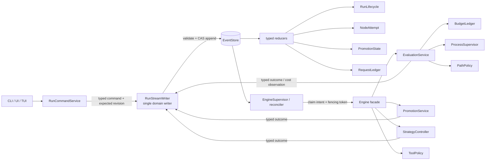
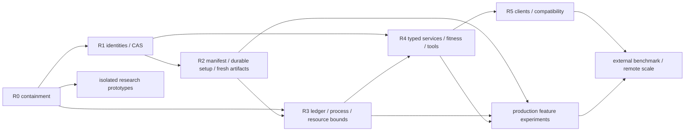
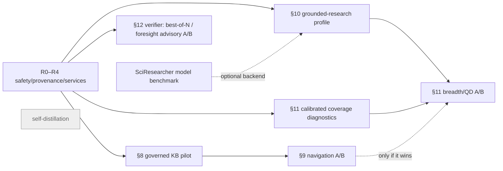
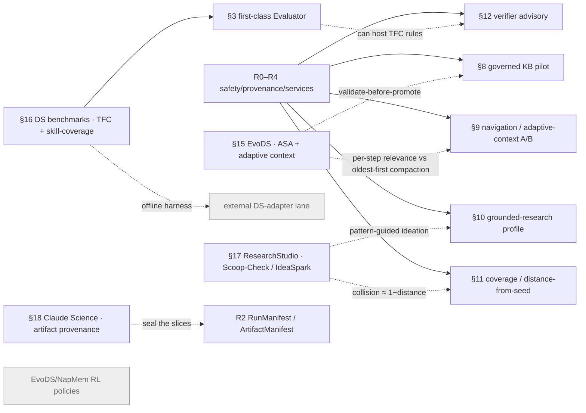

# LoopLab — Project Review, Architecture & Development Directions (2026-07-11, reconciled through 2026-07-18)

> Strategic synthesis pinned to historical executable revision
> `369d6a6c6fe0ccf0f921051ffba71c742879bfdb`, with the Part-IV/consumer/UI addendum reconciled through the
> post-checkpoint integration ledger. [Doc 16](16-architecture-code-review-2026-07-11.md) (`41f9345`) remains the original
> finding/reproduction ledger. This revision adds the implementation disposition of the subsequent
> fix series and supersedes the first version of doc 17 in `32dc6c0`.

| Metadata | Value |
|---|---|
| **Status** | current / canonical plan |
| **As of executable commit** | `369d6a6c6fe0ccf0f921051ffba71c742879bfdb` |
| **Post-audit increment** | `931c28b` (P0-2 open→partial; census 66/12; see §14.6). Quantitative figures are pinned per statement; unpinned counts are as of `369d6a6`. |
| **Documentation reconciliation** | `89af408` (doc 18 and post-fix UI disposition) |
| **Part-IV reviewed range** | Dated `master` checkpoint `4d1218c` in §22.10/doc 18 §36/doc 21 Round 25; post-checkpoint integration in §22.11/doc 18 §37/doc 21's post-Round-25 ledger. No final publication commit is invented. Historical core counts remain pinned to the commits named beside them. |
| **Normative for** | priority, dependencies, release gates, feature promotion criteria |
| **Finding/reproduction authority** | [doc 16](16-architecture-code-review-2026-07-11.md) |
| **Current implementation disposition** | §6.3 and §14.2 for the core; §22.11 for post-checkpoint Part-IV/V cross-run/UI integration status |
| **Supersedes** | doc-17 verdict in `32dc6c0`; current-order claims in docs 06/10/11/12, ROADMAP, BACKLOG where they conflict |
| **Superseded by** | — |
| **Part III-B addendum** | 2026-07-14 — DS & deep-research agent cohort (§§15–20) |
| **Part IV addendum** | 2026-07-14 — `rubertlite` narrowing case & hypothesis/theme taxonomy (§21, D1–D7); **Phase 0 implemented** (§21.14: concept graph, D1 asset brief, §12 verifier); **Phase 1 implemented** (§21.15: D7 lock-in, D6 lesson guard, D3 graded novelty, D4 dedup, D2 research targeting — offline analytics); **Phase 2 implemented** (§21.16: 2a Strategist concept-pivot, 2b D3 graded-novelty gate + D7 capability-expansion directive, 2c calibrated foresight verifier — live steering, opt-in) |
| **Last verified** | 2026-07-12 (historical core baseline); 2026-07-18 (Part III-B/IV and cross-run/UI reconciliation) |

**Companion docs:** [01-product-design.md](01-product-design.md) ·
[02-architecture.md](02-architecture.md) · [03-decisions.md](03-decisions.md) (ADR-6, ADR-9,
ADR-10) · [16-architecture-code-review-2026-07-11.md](16-architecture-code-review-2026-07-11.md)
(authoritative tactical findings and reproductions) ·
[18-ui-ux-review-2026-07-11.md](18-ui-ux-review-2026-07-11.md) (UI/UX observations and acceptance
criteria, subordinate to this plan) ·
[13-external-works-analysis-2026-07.md](13-external-works-analysis-2026-07.md) ·
[ROADMAP.md](ROADMAP.md) · [BACKLOG.md](BACKLOG.md) · [guide/memory.md](guide/memory.md).

**What this is.** One structural document in four parts. **Part I** gives the strategic verdict on
functionality, code, and architecture without duplicating doc 16's line-level issue ledger. **Part II**
turns that verdict into a dependency-ordered delivery plan with migration rules, release gates, metrics,
and decision criteria. **Part III** re-evaluates five candidate feature directions — a curated
Frameworks/Libs knowledge base, NapMem, SciResearcher, research-exploration breadth, and LLM-as-a-Verifier —
against the
stabilization plan rather than treating them as immediately shippable flags. **Part III-B** (added 2026-07-14)
extends the same code-level, gated treatment to a five-system DS & deep-research agent cohort — EvoDS, the
AgenticDataBench/DataSciBench benchmark pair, ResearchStudio-Idea, and Claude Science (§§15–20). **Part IV**
(added 2026-07-14) grounds the Part III/§11 narrowing thesis in the first measured LoopLab case — the 67-node
`rubertlite` run — and derives the research-loop-quality levers it exposes (a hierarchical hypothesis/theme
taxonomy, seed-time asset ingestion, a graded novelty/critic layer, a capability-expansion operator; §21,
D1–D7), keeping the Part III gates. Part IV's D5 taxonomy and Part III-B's §16 skill-coverage taxonomy are
two views of one substrate; D3's failed-direction re-examination pairs with §17's distance-from-seed signal.

**Method and evidence discipline.** The revision combines a fresh code/doc cross-check, direct inspection
of the current state/event/security/execution seams, commit-by-commit review of the 23-commit remediation
series from
`37f5304..369d6a6`, current CI evidence, local documentation/UI verification, and primary-source research.
Statements are classified implicitly as:

- **code-confirmed** — traced to the current repository and, where meaningful, reproduced or covered by a
  named test;
- **externally evidenced** — supported by a linked primary paper, specification, or official platform
  documentation;
- **recommendation/inference** — a proposed LoopLab design, not a result claimed by the external source.

The first four Part III papers and their arXiv identifiers were verified from their official pages on
2026-07-11; the fifth (§12 LLM-as-a-Verifier, arXiv 2607.05391) was added 2026-07-12 from the
requester-supplied abstract and its arXiv page was unreachable from this environment, so it is unverified
here. Paper results remain author-reported and domain-specific; they justify experiments, not an
automatic production rollout.

**Contents.** Part I — §1 executive summary · §2 snapshot · §3 functionality · §4 code & tests · §5
architecture. Part II — §6 development directions and target architecture · §7 dependency-ordered delivery
plan. Part III — §8 Frameworks/Libs KB · §9 NapMem · §10 SciResearcher · §11 exploration breadth ·
§12 LLM-as-a-Verifier · §13 composition and recommendation · §14 verification and sources. **Part III-B (added
2026-07-14)** — §15 EvoDS · §16 DS-agent benchmarks (AgenticDataBench/DataSciBench) · §17 ResearchStudio-Idea ·
§18 Claude Science · §19 cohort composition · §20 addendum sources. **Part IV (added 2026-07-14)** — §21 the
`rubertlite` narrowing case and the hypothesis/theme taxonomy (D1–D7).

---

## PART I — PROJECT & ARCHITECTURE REVIEW

### 1. Executive summary — where LoopLab stands

**LoopLab has a strong experimental foundation, and the post-audit fix series materially reduced its
immediate risk, but the remaining frontier is still not small feature work.** Doc 16 originally confirmed
**7 P0 and 12 P1 findings**. At `369d6a6`, the exact reproductions behind many of them are contained and
covered by regression tests. P1-1 and P1-12 remain wholly open (P0-2 advanced open→partial at `931c28b` —
the reopen-epoch + subject-bound approval increment; see §14.6); the rest range from a closed original
reproduction to a partial architectural contract, depending on the residual stated in §14.2. Commit titles
are therefore not counted automatically as architectural closure.

The first doc-17 verdict — “the load-bearing invariants hold; zero reproducible replay/data-corruption
defects; risks are maintainability, not correctness” — is refuted by executable counterexamples in
[doc 16 §§3–4](16-architecture-code-review-2026-07-11.md). The event log remains a good projection and
audit substrate. Setup re-entry, corrupt-middle refusal/repair, task-alias conflict, and late terminal
containment are now stronger; replay-complete continuation still lacks full attempt, epoch, request,
run-instance, and manifest boundaries.

**The verdict on each axis:**

| Axis | Verdict |
|---|---|
| **Architecture** | **Strong substrate, partially contained lifecycle model.** Setup completion, terminal-attempt generation, the reopen-search-epoch + subject-bound approval, the per-epoch freshly-hidden holdout, `best_confirmed` epoch-stamping, a single `SearchFitness` ordering owner, several permission/path boundaries, and event-log repair landed. Complete attempt/request identity, immutable run manifests, hard budget reservation, and one control writer remain missing. |
| **Code & tests** | **Substantial, disciplined, and green in validation CI.** The remediation series added focused regressions and the full suite passes for validation commit `89af408`; green examples do not prove the remaining interleavings, fail-open-lock behavior, object authorization, unpolled deadlines, or workspace identity. |
| **Functionality** | **Broad, unevenly production-ready.** The default trust posture is mostly audit/off, temporal CV has no shipped caller, six adapters are synthetic/harness-oriented, and the isolated real-task path is under-validated. |
| **Directions** | **Finish residual stabilization, then promote features through gates.** Offline discovery may continue, but live production activation still waits for the relevant identity, policy, budget, and provenance contracts. |

Four incomplete identity families explain much of the residual defect cluster:

1. **`NodeAttemptId`** — reset now increments a node `attempt`, and stamped `node_evaluated`/`node_failed`
   terminals from an older attempt are rejected (`47f786a`). Confirmation, holdout, trust, abort, repair,
   forced-operation, artifact, and cost effects are not all scoped to that generation, so P0-1 is partial.
2. **`SearchEpoch`** — reopening a *finished* run now bumps `search_epoch` and re-opens confirmation and
   subject-bound approval for the new candidate set (`931c28b`), so an older champion no longer locks
   selection. Holdout is now re-hidden per epoch (`e111bf5`, epoch-salted split) and `best_confirmed` is
   epoch-stamped so a stale-epoch confirmation can't authorize selection (R1-b); the residual is the broader
   identity family (run instances, event/evaluation IDs, request/subject revisions, transition validator,
   append CAS on engine appends) — P0-2 partial (§14.6).
3. **`RequestId` + `SubjectHash`** — permission resolution now uses pending→resolved CAS and centrally gates
   MCP/background kill (`87dfc7e`), but approvals, aborts, forced operations, and promotion/finalization
   decisions are not all bound to the exact request and subject revision.
4. **`RunInstanceId` + `RunManifest`/`InputSnapshot`** — `run` now rejects a different task ID and conflicting
   repo aliases before overwriting an existing run (`4c6c59f`), and setup completion is folded (`5f5ce46`).
   Config, dirty tracked input bytes, environment, materialized inputs, mutable attempt workdirs, and their
   artifacts still lack one immutable instance/manifest boundary, so P0-5/R2 remain partial.

Two earlier product findings remain valid, but they are **post-stabilization credibility work**, not the
top engineering priority:

1. **Many trust mechanisms exist but the default posture is mostly dormant/audit-only.** Confirmation,
   reward-hack detection, code-leakage detection, critic, and redaction are off; `trust_gate="audit"`.
   `--profile thorough` enables confirmation/reward-hack/code-leakage/critic and flips the gate, but leaves
   output redaction off (`core/config.py:46-63,339-370`). This is a *deliberate*
   cheap-toy-default design (the config comment says so), but it means the default `looplab run` performs
   host-side scoring and held-out selection while **most optional confirmation, detector, and enforcement
   mechanisms remain disabled** — a narrower posture than the product and the UI's own
   "Trust & rigor — the point of LoopLab" panel
   (`ui/src/panels.jsx:132`) — advertises. The reproduced false-clean workdir states and leakage-regex
   precision/recall defects are fixed (`d8d240c`, `4d0f362`, `13f087c`); **do not enable hard gating by
   default until a labelled calibration corpus establishes precision, recall, abstention, and missing-input
   behavior beyond those examples.**
2. **The temporal/target-leakage differentiator (ADR-6's stated edge) has no live caller.** `trust/cv.py`'s
   own docstring says `purged_walk_forward` / `consistent_cv` / the `Evaluator` Protocol are "complete and
   tested, but not yet consumed by a shipped adapter"; the `timeseries` adapter runs its own embedded
   backtest instead. **The claimed moat needs one adapter that exercises it end-to-end.**

**Roadmap decision:** finish state identity and the remaining fail-closed boundaries first; then prove real-task trust
and evaluation; only then broaden networked research, memory navigation, and quality-diversity search.
This is not a rewrite: keep the event-log spine and flat public read model, restore append-only domain
semantics (tombstones plus explicit compaction generations), and add a versioned envelope and explicit
services/value objects behind the existing `Engine` facade.

### 2. Current-state snapshot

| Package | Files | LoC | Role |
|---|---|---|---|
| `engine/` | 27 | 7,192 | orchestrator + 12 mixins + cross-run memory |
| `serve/` | 30 | 6,756 | FastAPI server, routers, TUI, assistant |
| `tools/` | 24 | 4,959 | agent-facing tools, memora/vectorstore, env_inspect |
| `adapters/` | 15 | 4,604 | 9 task kinds + composable front-end |
| `core/` | 19 | 4,598 | domain models, Settings, LLM client, parse/trace |
| `agents/` | 10 | 3,292 | roles, tool-loop, cli-agent, unified agent, strategist |
| `events/` | 9 | 2,623 | event store, replay/fold, projections, exporters |
| `search/` | 9 | 1,901 | policies, operators, foresight, hybrid-merge, coverage |
| `runtime/` | 8 | 1,763 | sandbox tiers, command-eval, deps |
| `cli/` | 6 | 1,225 | run/export/inspect/ui command groups |
| `trust/` | 10 | 918 | leakage, reward-hack, CV, redaction, confirm, harden |
| **Total** | **170** | **40,242** | 167 package files + 3 root modules; 157 Python test files / 27,170 physical test lines |

Hotspots (LoC): `engine/orchestrator.py` 1497 · `events/replay.py` 1008 ·
`adapters/repo_developer.py` 962 · `core/llm.py` 865 · `core/config.py` 780 · `agents/roles.py` 748.

### 3. Functionality review

#### Capability matrix (✅ stable core · 🟡 partial/unsafe edge · ⛔ blocks a supported path · ⬜ missing)

| Area | Status | Notes (code-anchored) |
|---|---|---|
| **Task adapters** (9 kinds) | 🟡 | The registry is real, but only **`repo`, `mlebench_real`, `dataset`** are real-work paths; six are synthetic/demo/trust harnesses. `mlebench_real` offline baselines cover three competitions. Exact input/environment identity is not yet canonicalized into a run manifest. |
| **Composable task front-end** | 🟡 | Capability inference and ambiguity checks are useful; conflicting `{repo, editable_path}` aliases are now rejected (`4c6c59f`). Relative sources can still resolve in different parent/child contexts, and aliases are not a substitute for a canonical InputSnapshot. |
| **Roles & backends (ADR-7)** | 🟡 | Role routing is broad. BestOfN/Validating wrappers now forward parent-aware hooks (`65221f6`), closing the reproduced baseline-regeneration bug. RepoDeveloper step outcomes remain stringly and wrappers still lack a typed `DevelopmentResult` contract. |
| **"Evaluator" role** | ⬜ | There is **no first-class Evaluator**; verification is a distributed subsystem (sandbox + host grader + trust gates + critic + memo-verifier), and `trust/cv.py`'s `Evaluator` Protocol is **unused**. A naming/architecture gap. |
| **Search policies** | 🟡 | Greedy is the static default and alternatives are opt-in/under-benchmarked. Reopen now bumps `search_epoch` and re-opens confirmation/approval (P0-2 partial, `931c28b`); the residual disagreement about raw vs promoted fitness is driven by holdout reuse and unstamped promotion/finalization, not confirmation. |
| **Operators** | 🟡 | The operator set is rich. Reset now bumps an attempt generation and rejects stale eval/fail terminals, and ablation wall time is charged (`47f786a`, `a5f74b1`). Other attempt-scoped effects, forced-operation request identity, and reserve-before-spawn accounting remain open. |
| **Trust layer** | 🟡 for audit; gated promotion uncalibrated | Defaults are mostly disabled/`trust_gate="audit"`; held-out selection is on. Missing/unreadable protected files now fail closed and the reproduced leakage-regex defects are fixed (`d8d240c`, `4d0f362`, `13f087c`). A labelled detector corpus, epoch-bound evidence, and abstention policy are still required before global hard gating. Temporal CV remains unwired. |
| **Sandbox / command evaluation** | 🟡 | Stage/adapter/prediction path escapes, non-finite timeouts, post-spawn NUL cleanup, and Windows bind grammar were fixed (`cdc5423`, `c4a2113`). Full CPU/RAM/disk enforcement, an unpolled deadline watcher, bounded readers/regex, and a validated real-adapter image/data contract remain. |
| **Memory / knowledge** | 🟡 | Seven useful stores and retrieval primitives exist, but they are not a provenance-linked pyramid; shared content and vector indices are outside the run manifest, and the dormant `CaseLibrary` is only one retrieval primitive, not “80% of NapMem.” |
| **Serve / UI** | ⛔ for shared deployment | Permission CAS/MCP/background-kill gates are centralized, sensitive routes were gated, public state was redacted, and TUI/JS needs-engine registries now match (`87dfc7e`, `eee59c3`, `c4fbf70`, `3170d85`). Auth remains a blacklist rather than default-deny, object ownership is absent, and direct AssistantBar/Dock control postconditions still diverge (doc 18 CTRL-01). |
| **CLI / run control** | 🟡 | A different task ID or conflicting repo alias is now rejected before reusing a run directory (`4c6c59f`). Full config/source/environment identity and atomic resume/finalization ownership remain absent; P1-1 can still leave a zombie run. |
| **Genesis / Strategist / deep research** | 🟡 | The strategy name/params governance asymmetry is fixed (`ca3c9fe`). Spec approval remains not subject-bound, and web/literature are correctly opt-in until network permission, budget, and provenance controls exist. |

#### The functionality gaps worth prioritizing

Release-safety work comes first:

1. **Complete identity-safe reset/reopen/approval/finalization** — extend the landed terminal-attempt guard to
   confirmation/trust/holdout/abort/cost/artifacts; add epoch, request, subject, and expected-revision semantics.
2. **Reproducible run continuation** — build on folded setup completion and task-ID refusal with an immutable
   task/config/InputSnapshot/environment manifest; `run` creates and `resume` continues, never a hybrid.
3. **Finish central effects and authorization** — invert route auth to default-deny, add principal/object checks,
   put every tool behind host-owned `ToolSpec`, and converge clients on one RunCommandService. Permission CAS
   and the reproduced MCP/background bypasses are already fixed.
4. **Finish bounded execution** — replace partial cost accounting/tree kill/path containment with one durable
   `BudgetLedger`, one deadline-owning `ProcessSupervisor`, bounded output/input/regex, and physical quotas.
5. **Calibrate trust evidence** — the known workdir/leakage defects are fixed; now measure structured evidence
   on a labelled corpus before changing the default from audit.

After those gates, the credibility/feature gaps are: a live temporal-CV adapter; a real adapter with a private
grader; one real adapter validated in an isolated tier; one proven external Developer wrapper; a first-class
evaluation/promotion service; and controlled benchmarks for alternative policies. Do not claim a self-editing
assistant or production remote execution until its permission and process boundaries satisfy the same gates.

### 4. Code & test health

The codebase is substantial and often disciplined; the previous conclusion failed by equating a large green
suite with coverage of the system's hardest state and effect boundaries. Current size (as of the pinned
`369d6a6`) is 170 production Python modules / 40,242 physical lines and 157 Python test files / 27,170
physical lines; the `931c28b` increment adds ~128 production and ~248 test lines with no new modules (§14.6).
Doc 16's historical
baseline records two Linux runs (Python 3.11 and 3.12) at **1,711 passed, 33 skipped, 1 stale-test failure**
each. More importantly for this revision, the complete GitHub `python -m pytest` workflow and strict docs
workflow both pass for validation commit `89af408` (code tree `369d6a6`; §14.2). This is strong regression
evidence, not proof of the remaining epoch/CAS/concurrency/resource guarantees.

#### What the tests establish — and what they do not

| Area | Established strength | Missing/adversarial coverage now required |
|---|---|---|
| Fold/event log | Pure fixed-log fold; torn-tail handling; invalid JSON/**Event envelope** refusal+repair; explicit folded/diagnostic partition; stale eval/fail terminal rejection by node attempt | Full attempt/epoch/request identity; corruption-after-open/append-lock TOCTOU; unsupported locks; expected-revision CAS; duplicate complete lifecycle |
| Engine | Real crash/resume path; setup completion folds and re-enters after crash; broad phase/operator coverage | Content-addressed crash points for every setup step/effect; reset during parallel eval; finish→resume wakeup; stale finalization; reserve-before-spawn budget |
| Trust/evaluation | Host-side held-out scoring; missing/unreadable protected inputs fail closed; named leakage FP/FN/NaN regressions pass | Labelled detector calibration and abstention; disclosed-holdout epoch; evidence/decision versioning; path/symlink fuzzing beyond known cases |
| Serve/tools | Permission resolution CAS; gated MCP/background kill; named sensitive GET and public-state regressions; TUI/JS registry parity | Default-deny route/tool census; lazy MCP authorization; direct AssistantBar/Dock postconditions; principal/object authorization |
| Runtime/platform | Contained stage/adapter/prediction paths; finite timeouts; robust explicit background tree kill; Windows mount-unit regressions | Unpolled deadline watcher; bounded output/JSON/regex; physical CPU/RAM/disk quotas; Windows Docker/Job Object integration matrix |
| Contracts | Exact event partition and several two-way source scans; parent-aware wrapper regression | Generated ControlSpec; typed DevelopmentResult/ToolSpec/TrustEvidence; wrapper failure semantics; one policy/fitness owner |

The central test upgrade is **model-based state-machine testing**, not more isolated examples. Hypothesis's
[`RuleBasedStateMachine`](https://hypothesis.readthedocs.io/en/latest/stateful.html) generates action
sequences and shrinks a failure to a minimal replayable program. Model `create/reset/evaluate/confirm/reopen/
approve/finalize/resume`, inject old-attempt and old-epoch events, and compare the real fold/command service
to a small reference model after every step. Pair that with deterministic crash injection at every durable
append boundary and platform process-tree tests.

#### Structural debt — sequence it behind the state model

- **The mixin Engine is a shared-state god object.** The 12 mixins improve navigation but share an implicit
  `self` with roughly 111 initialized attributes. This is real debt, but a broad extraction before the event
  identities are fixed would merely redistribute ambiguous state.
- **Domain contracts are stringly/duck-typed.** Untyped policy actions, provider strings, optional Developer
  methods, and flat lifecycle fields let wrappers and clients silently lose semantics.
- **The middle layer is conceptually cyclic.** `adapters <-> agents <-> search <-> tools` is hidden partly by
  lazy imports; composition should move above those packages.
- **Configuration has multiple sources of truth.** `369d6a6` aligns the known incremental-construction
  fallbacks with Settings, but the architectural duplication remains. Flat env-compatible Settings can stay
  public while validated internal option groups and one schema source prevent the next drift.
- **Compatibility is hand-maintained.** The `_LAYOUT` alias map and monkeypatch behavior need an immutable
  compatibility manifest and an explicit retirement policy, not incidental edits.

Extract `RunLifecycle`, `NodeLifecycleService`, `EvaluationService`, `PromotionService`,
`RunCommandService`, and `StrategyController` behind the current `Engine` facade only after their identity
and transition contracts exist. This produces real ownership boundaries and keeps compatibility; another
mechanical file split does not.

### 5. Architecture review

#### What holds, narrowly

- The intended lower dependency direction (`core <- events <- engine <- composition`) holds, and there is no
  direct `engine -> serve` import.
- `fold` is pure and deterministic for one fixed ordered log. Unknown **diagnostic** events can be ignored,
  and first-terminal-wins is correct within one lifecycle attempt.
- EventStore handles ordinary local serialization and a torn final line; it now refuses a corrupt middle or
  invalid Event envelope detected at construction and exposes a repair command. Host-side scoring keeps
  private labels outside a candidate workspace.

Those properties do **not** imply order tolerance, exactly-once effects, or replay-complete continuation.
State-sensitive UI/CLI commands still validate and append in separate steps; reset/reopen reuse incomplete
logical identities; setup has only a folded completion boolean rather than content-addressed step/manifest
identity; continuation also depends on mutable snapshots/workdirs/source/environment. Corruption detected at
construction now blocks append, but corruption-after-open is not rechecked under the writer lock. Unknown
authoritative/security event types must not be ignored by a writer that does not understand them — doing so
could replay a revoke or gate fail-open.

#### Target shape: additive identities and explicit owners

Keep `Engine` as the compatibility facade and `RunState` as a flat public projection. Put **one
`RunStreamWriter`** behind every state-changing client command and runtime outcome; neither a client nor an
Engine service appends directly. The writer canonicalizes payloads, validates the transition against the
current projection, checks the expected revision, and appends in one critical section:



`append_and_ensure_engine()` is not literally atomic across an OS process spawn. The atomic operation is
**recording the validated intent at an expected stream revision**; a startup scan and continuously monitored
supervisor then reconcile until an engine owns the pending epoch. This controller/outbox shape makes a lost
resume *recoverable* without pretending a filesystem append and process creation share a transaction. It
does not provide liveness by itself: if the reconciler is unavailable the intent stays pending, so startup,
watchdog, alerting, retry, and fencing behavior are part of the contract.

Arbitrary subprocess/file/network effects remain at-least-once: model them as
`scheduled -> started -> completed|failed|unknown`, give each a stable operation ID and fencing token, and
reconcile/probe after uncertainty. “Exactly once” is defensible only where the effect and durable outcome
share a real transaction. A downstream idempotency key gives only provider-scoped, effectively-once behavior
within that API's retention and parameter-matching contract; duplicate delivery remains possible and the
consumer/effect handler must be idempotent.

**Deferred vehicle (see §6.6).** Under the mandatory single-writer lock, the versioned envelope,
`expected_seq`/CAS, the upcaster registry, and causation/correlation IDs are not a near-term requirement —
the landed P0-2 partial proves the identities that matter close as additive fold fields in ~25 lines, and old
logs still fold byte-identically. Keep the scope-key refs below as additive fields on existing events; adopt
the full envelope/CAS only if a shared/remote multi-writer actually appears.

The v2 event envelope should carry stable `event_id`, schema version, sequence, causation/correlation IDs,
and only the scope keys relevant to that event:

```text
RunRef(run_id, run_instance_id, manifest_digest, stream_generation)
NodeAttemptRef(run_instance_id, search_epoch, node_id, attempt_id, code_hash)
EvaluationRef(run_instance_id, search_epoch, node_id, attempt_id,
              evaluation_id, kind, seed, fidelity)
RequestRef(run_instance_id, request_id, request_revision, subject_hash)
DecisionRef(run_instance_id, request_id, subject_hash, based_on_seq)
```

`run_id` remains the user-facing logical name. `run_instance_id` is immutable and globally unique for one
execution identity: `resume` preserves it, while whole-run `reset` creates a new one even when it reuses the
directory and logical name. `stream_generation` changes only for explicit compaction/repair and is not an
attempt or reset counter. Attempts, evaluations, requests, decisions, leases, effects, and artifact events
all carry the instance boundary.

`expected_seq` is an **append precondition**, checked in the same critical section as validation+append; it
is not trusted merely because it appears inside event data. Kurrent/EventStore's documented
[expected-revision](https://docs.kurrent.io/clients/python/v1.3/appending-events) behavior is the relevant
pattern: an exact consistency check plus the same event IDs makes the same retry idempotent within that
stream; IDs are not a global uniqueness guarantee. On local filesystems LoopLab should require the lock and
fail startup when it cannot enforce it. Shared/FUSE multi-writer deployment remains unsupported until a
server-owned writer/control journal exists.

`subject_hash` is computed by the host over a versioned canonical schema, not accepted from a client/model.
One request ID replayed with different canonical tool arguments, manifest, node attempt, evaluator, or
promotion result is a conflict. `ToolSpec.effects` is a host-owned set drawn from
`read|write|process|network|run_control`; “read” can still expose secrets. Authorization, one-shot user
consent, and sandbox containment are separate checks and all run again immediately before the effect.

#### Migration and reproducibility contract

- New writers emit v2; readers use explicit typed upcasters and preserve the old flat JSON projection.
- A v1 log with no reset/reopen ambiguity may project legacy instance/attempt/epoch zero. A v1 log containing
  reset, reopen, or pending decisions cannot recover the true origin of late events: open it read-only, or
  resume by creating an explicit new instance boundary. That boundary invalidates confirmations, trust
  completions, approvals, forced-evaluation and abort/control intents, leases, promotion/finalization
  requests, and unfinished effects. Blanket zero IDs would preserve the old bug or create false
  deduplication.
- `setup_completed(manifest_digest)` means every idempotent content-addressed setup step completed for those
  inputs; resume still verifies current material digests rather than trusting the historical event alone.
- `RunManifest` records canonical task and Engine options (secrets redacted) and references an immutable
  `InputSnapshot`: exact source/input file-set and content digests, code revision plus dirty **input** bytes,
  dependency lock/environment identity, container image digest, data/reference digests, and relevant
  tool/model versions. Attempt workdirs are mutable execution state, never part of that input snapshot;
  every evaluation emits a separate digest-bound `ArtifactManifest` for outputs. Git's
  [content-addressed tree/blob model](https://git-scm.com/book/en/v2/Git-Internals-Git-Objects) and SLSA's
  [Build Provenance model](https://slsa.dev/spec/v1.2/build-provenance) — especially external/internal
  parameters, resolved dependencies, and run details — are patterns. Exact dirty-workspace bytes, full
  environment identity, and secret-reference handling are LoopLab extensions, not guarantees supplied by
  SLSA itself.
- Event-log frames/checksums detect torn writes and accidental corruption covered by their framing. A hash
  chain without a trusted external anchor is not proof against an attacker rewriting the whole log;
  transparency/Merkle infrastructure is unnecessary for the current single-host threat model.

**Net verdict:** preserve the architecture's event-log projection spine, but treat identity, transition
validation, durability, and centralized effects as release work. Remote workers, broader network tools, and
mechanical Engine decomposition come after those contracts, not before them.

---

## PART II — DEVELOPMENT DIRECTIONS

### 6. Development directions

The older planning corpus (docs 06, 10–13, ROADMAP, BACKLOG) mixes historical aspirations, shipped code,
partially safe implementations, and still-open work under several incompatible ID schemes. For current
ordering, **doc 16 is the finding ledger and doc 17 is the canonical delivery plan**. Older status boards
remain useful research/history but are not authoritative when they disagree with these two documents.

#### 6.1 Canonical status model

“Implemented” is not the same as “safe on every advertised path.” Track five states:

| State | Current examples | Planning meaning |
|---|---|---|
| **Shipped / stable foundation** | lower dependency direction, fixed-log fold, host-side held-out scoring, core operators, memory stores, error taxonomy, broad UI surfaces | Preserve; regression-gate while changing adjacent contracts |
| **Shipped / unsafe or partial** | reset/reopen and holdout promotion, terminal-only attempt generation, blacklist auth, hard trust gating, post-hoc budget checks, shared run controls | Do not count a bounded containment fix as completion; map residuals to R0–R5 below |
| **Open product work** | live temporal-CV adapter, private real-task grader, isolated real-adapter image/data contract, validated external Developer | Schedule only after prerequisites |
| **Research hypothesis** | KB schema, NapMem navigation, proactive breadth/QD, SciResearcher backend/self-distillation | Prototype and measure; no production promise |
| **External/infra gated** | published real MLE-bench, remote worker fleet, AgentDS-style adapter | Requires the release-safety gates and external resources |

The LLM response cache is already implemented (`llm_cache`) but off by default; it is not a missing scale
subsystem. Direct RepoDeveloper already has a parent-aware path, and BestOfN/Validating wrappers now preserve
it; the remaining gap is typed failure/deletion semantics and validation against a real external backend.
`operator_yields` also reaches StrategyContext/Strategist prompts, but its cost denominator is incomplete
until confirmation and parallel reservations share one ledger (ablation is now charged post-hoc).

#### 6.2 Temporary safe operating envelope

Until R0–R3 close, the defensible operating mode is intentionally narrower than the full feature surface:

- create a **fresh empty run directory**; use `resume` only for that exact task/config/workspace;
- one local writer on a filesystem with a working mandatory lock; no FUSE/shared multi-writer deployment;
- bind the server to loopback for one trusted operator; shared/JupyterHub or other multi-user deployment is
  unsupported until upstream principal identity, per-object authorization, and session isolation pass R5;
- `max_parallel=1`, trusted inputs, and trusted-local execution only; do not treat Docker/hostile tiers as
  validated for real adapters yet;
- setup now re-enters after a crash before folded `setup_finished`; resume only with the same task/config/input
  bytes because a full manifest does not yet prove that identity. If EventStore reports corruption, stop and
  use `repair-log` with its backup/provenance rather than appending past the boundary;
- do not reset or reopen an actively evaluating/finalized unattended run; start a new run when a hidden
  holdout has already been disclosed;
- keep heuristic trust signals in audit mode; review them manually rather than hard-gating;
- keep web/literature and MCP off by default. In loopback single-user operation, mutating assistant/MCP tools
  may be used only through explicit ask-mode approval; `87dfc7e` closes the known bypasses, but the absence of
  a complete host-owned ToolSpec/effect inventory still rules out unattended use;
- treat node/run code, stdout, jobs, and provenance as authenticated data, not public projections.

This is a containment policy, not the desired product endpoint. R0 should encode the highest-risk parts as
fail-closed behavior so safety does not depend on an operator remembering this list.

#### 6.3 Canonical engineering workstreams

| Workstream | Primary finding IDs | Status | Scope | Depends on | Exit gate |
|---|---|---|---|---|---|
| **R0 — fail-closed containment** | P0-4, P0-6, P0-7; P1-3, P1-6, P1-7, P1-11, P1-12 | **in progress · release blocker** | **Landed:** known corrupt-tail refusal/repair, permission CAS and MCP/kill gates, stage/path/timeout containment, tri-state workdir audit, named leakage fixes, strategy-param guard, event partition, aggregate-context fix. **Remaining:** recheck divergence under writer coordination, fail on unsupported locks, default-deny route/object scopes, one ToolSpec/effect inventory, global PathPolicy/fresh artifacts, calibrated advisory policy, durable wakeup | none | every known and newly identified bypass is red before and green after; unambiguous v1 logs still read; no unsupported shared mode starts |
| **R1 — event/state identity** | P0-1, P0-2; P1-12 | **in progress · release blocker** | **Landed:** node attempt generation for eval/fail terminals; reopen-of-finished `search_epoch` bump with confirmation/approval re-open and subject-bound (existence-checked) approval (P0-2 partial, `931c28b`); per-epoch freshly-hidden holdout (`e111bf5`); `best_confirmed` epoch-stamping so a stale-epoch confirmation can't authorize selection, with `run_finished` (`after_seq` CAS) + `finalization_finished` (`finished`-check) already reopen-safe (R1-b); a single `SearchFitness` ordering owner (R1-a). **Remaining:** run instances, event/evaluation IDs, attempt scope for all effects, request/subject revisions on all forced/control requests, transition validator, append CAS on engine appends, typed payload/upcaster registry | R0 | model-based stale-event/reset/reopen/approval tests; exactly one terminal per attempt; no old instance/attempt/epoch can mutate, promote, or finalize |
| **R2 — durability/reproducibility** | P0-3, P0-5; replay extensions in §14.2 | **in progress · release blocker** | **Landed:** folded setup completion/re-entry, different-task and alias refusal, corrupt-log repair. **Remaining:** content-addressed setup steps; RunManifest/InputSnapshot; attempt-scoped clean workdirs and ArtifactManifests; strict `run` vs `resume`; repair generation/digest provenance | R1 | crash at every setup/effect boundary converges or fails closed; dirty inputs and stale outputs cannot masquerade as current |
| **R3 — execution infrastructure** | P1-2, P1-4, P1-5, P1-8 | **in progress · stabilization blocker** | **Landed:** ablation cost accounting, explicit background tree kill/wait, finite timeout/path fixes, `--mount` Windows grammar. **Remaining:** multidimensional reserve-before-spawn BudgetLedger; session-owned deadline watcher; bounded logs/readers/regex; stable cross-platform input mapping; physical token/deadline/OS quotas | R0–R2 | no over-admission; incurred stale-worker cost is settled once; no orphan tree after kill; memory/disk bounds; real Windows/Linux matrix green |
| **R4 — typed domain services** | P0-2; P1-7, P1-9, P1-11 | **in progress · post-stabilization polish — only versioned TrustEvidence binding is release-relevant; see §6.6** | **Landed:** parent-aware wrapper forwarding and the concrete strategy-param bypass fix. **Remaining:** TaskSpec/capabilities; DevelopmentRequest/Result; ToolSpec/Result/ExecutionContext; SearchFitness/PromotionFitness; versioned TrustEvidence/Decision; lifecycle/evaluation/promotion/strategy services | R1–R3 | wrappers preserve typed capabilities/failures; one policy gate and one fitness owner; Engine remains a compatible facade |
| **R5 — clients/compatibility** | P1-1, P1-3, P1-10 | **in progress · the P1-1 zombie-run reconciler is a release blocker; multi-tenant auth is deferred (refuse off-loopback); see §6.6** | **Landed:** named sensitive-route gates/state redaction and TUI/JS needs-engine parity. **Remaining:** RunCommandService/EngineSupervisor; generated ControlSpec; direct-client postconditions; upstream principal/run-owner/session isolation; UI e2e; Settings schema source; legacy alias manifest | R0–R4 | every client has identical transition semantics; no zombie run; route/object/control/schema census is exact; shared mode either passes its auth matrix or refuses startup |

Two P0 details belong explicitly in R1/R2 rather than being hidden under “event sourcing”:

- a duplicated complete `node_created + terminal` lifecycle can reinitialize the node and charge cost again;
  event ID, strict revision, and attempt identity must jointly prevent it;
- workdirs are keyed too coarsely and not cleaned, so a successful command that produces no new metric can
  consume a stale prior output. Use `nodes/<node>/attempts/<attempt>/evals/<eval>/`, require outputs created
  by the current evaluation, and record deliberate stage reuse as a digest-bound event.

Normal delete should become a tombstone event. Physical removal rewrites the append-only log today and can
leave parent/chosen/archive references stale; irreversible purge belongs to an explicit compaction/new-stream
generation with provenance, never an ordinary domain command.

#### 6.4 Research-derived architecture patterns (adopt the pattern, not the platform)

| Problem | Useful primary precedent | LoopLab application |
|---|---|---|
| Logical execution vs retry attempt | [Temporal Workflow/Run IDs](https://docs.temporal.io/workflow-execution/workflowid-runid), [GitHub run attempt context](https://docs.github.com/en/actions/reference/workflows-and-actions/contexts) | Separate run, epoch, node, attempt, eval, and request identity; never infer one from another |
| Concurrent/idempotent append | [Kurrent expected revision](https://docs.kurrent.io/clients/python/v1.3/appending-events) | `append(expected_last_seq, events)` validates and appends in one critical section; the same IDs plus the same consistency check make an identical stream retry idempotent |
| Durable external effects | [Kubernetes controller reconciliation](https://kubernetes.io/docs/concepts/architecture/controller/), [AWS transactional outbox](https://docs.aws.amazon.com/prescriptive-guidance/latest/cloud-design-patterns/transactional-outbox.html) | Persist intent, then reconcile at-least-once with operation IDs/fencing; do not promise general exactly-once |
| Subject-bound approval | [AWS API idempotency](https://docs.aws.amazon.com/ec2/latest/devguide/ec2-api-idempotency.html), [Stripe idempotent requests](https://docs.stripe.com/api/idempotent_requests) | Same request ID with different canonical parameters/subject is a conflict; approval is one-shot and revision-bound |
| Run provenance | [SLSA Build Provenance](https://slsa.dev/spec/v1.2/build-provenance), [Git content objects](https://git-scm.com/docs/gitdatamodel.html) | Digest canonical parameters, resolved inputs/dependencies, and run details; add LoopLab-specific dirty-input/environment identity without putting secrets in identifiers |
| Central authorization | [NIST reference monitor](https://csrc.nist.gov/glossary/term/reference_monitor), [OPA PDP/PEP model](https://www.openpolicyagent.org/docs/deploy) | Small always-invoked host policy around all tools/routes; user consent and sandbox remain separate layers |
| Process-tree ownership | [Windows Job Objects](https://learn.microsoft.com/en-us/windows/win32/procthread/job-objects), [Python process groups](https://docs.python.org/3/library/subprocess.html) | Session-owned supervisor, deadline watcher, TERM→wait→tree KILL→verified reap, bounded/rotated output |
| Transition verification | [Hypothesis stateful testing](https://hypothesis.readthedocs.io/en/latest/stateful.html) | Generate/shrink reset/reopen/approve/finalize/crash sequences against a reference model |

Temporal/Restate migration, a Merkle transparency service, Zanzibar/Cedar-scale authorization, and a full
SQLite event-store rewrite are unnecessary now. If SQLite is evaluated later, keep it local-disk only. The
official [WAL documentation](https://sqlite.org/wal.html) states that WAL does not work over a network
filesystem and records the WAL-reset fix in 3.51.3 with backports 3.44.6 and 3.50.7; pin a fixed build rather
than saying “current.” Shared object storage still needs a single writer or ETag/CAS design.

#### 6.5 Feature lanes and prerequisite gates

| Feature lane | Must exist first | First safe experiment | Promotion / stop condition |
|---|---|---|---|
| Web/literature grounding | R0 ToolPolicy+network approval; R2 source snapshot; R3 token/time budget; R4 ToolSpec | explicit `research_grounding=literature` profile, read-only, cached evidence | promote if grounded-claim precision and useful-direction yield improve within cost; stop on injection/data-egress bypass |
| Trust-by-default | R1 attempt/subject binding; R2 provenance/fresh artifacts; R3 bounded evaluator; R4 versioned TrustEvidence/Decision and promotion owner | shadow/audit on a labelled leakage/reward-hack corpus | enable gate only at a predeclared precision/recall and zero false-clean protected-input target |
| Temporal-CV adapter | R1 epoch/promotion model; R2 dataset/split manifest | one real adapter with immutable split IDs and private grader | promote if leakage/generalization gap improves without hidden-set reuse |
| External Developer validation | R4 capability protocol and DevelopmentResult | run one real external backend through the landed parent-aware wrappers and failure/deletion contract tests | promote only if wrapper/backend never loses parent/failure/deletion semantics |
| Cost-aware search reward | R3 durable ledger across eval/confirm/ablate/holdout/LLM; R4 SearchFitness owner | shadow compute-efficiency score | promote on better valid improvement per budget, not incomplete wall time |
| KB / NapMem | R2 provenance IDs; R4 typed memory/tool contract | offline corpus + retrieval benchmark before live steering | build hierarchy only after flat retrieval measurably fails at corpus scale (§8–§9) |
| Proactive breadth / QD | R1 epoch identity; R4 SearchFitness/PromotionFitness and EvaluationService; trustworthy evaluator; explicit open-ended capability | frozen A/B benchmark against greedy/reactive baseline | promote only if novelty/diversity improves without unacceptable quality, trust, or cost regression (§11) |
| Remote workers | R1 EvaluationRef/CAS; R2 manifests/artifacts; R3 ledger/supervisor; R4 EvaluationService contract | one idempotent remote evaluation worker | no fleet until duplicate/late delivery, cost settlement, and fencing tests pass |
| Real MLE-bench publication | R1–R4 plus real isolated adapter | preregistered limited pilot | publish confidence intervals, cost, failures, and holdout discipline; do not benchmark around known safety gaps |

#### 6.6 Right-sizing the remediation — substance reconciliation (2026-07-12)

*Normative over the §6.3 status labels where they conflict. The diagnosis (§1–§5) is sound and the landed
increments confirm its shape; this pass judges the **necessity** and **correctness** of the remediation
against the actual threat model — a single-host, single-operator, loopback loop whose replayable `RunState`
is derived from an append-only log, with explicit snapshots/sidecars for data absent from the fold — and
re-scopes what is a release blocker versus post-stabilization polish.*

- **The identity vehicle is additive fold fields, not a v2 envelope.** The landed P0-2 partial stamped plain
  `int`/optional fields onto existing events and added reader-side stale-generation checks in ~25 lines of
  fold (`replay.py:179-186, 602-625, 421-457`), old logs folding byte-identically. Extend that same
  stamp-generation + reject-stale pattern to every node effect. **Defer** the v2 envelope, `expected_seq`/CAS,
  the upcaster registry, and causation/correlation IDs (§5) until a shared/remote writer exists — under the
  mandatory single-writer lock the CAS is belt-and-suspenders and correlation IDs have no consumer here.
- **Separate in-log counters from the external material manifest.** Identity families 1–3 (attempt / epoch /
  request+subject) are one cheap, proven, additive fold pattern. Family 4 (`RunInstanceId` / `RunManifest` /
  `InputSnapshot`) is a different, heavier class — external material identity (input digests, environment,
  dirty bytes) the pure fold cannot observe. Do not let the shared "identity" label smuggle a provenance
  subsystem into the "just add a counter" bucket. Ship the cheap enforcement half — the artifact **freshness
  gate** ("output created by THIS evaluation") — independently of, and before, the full RunManifest.
- **Pull the cheap fail-closed fixes into R0.** The freshness gate, a host-RAM cap on the subprocess tier, the
  tombstone-before-physical-delete event, an always-on background deadline watcher (`bg_tasks.py:116-128`
  enforces the 2 h cap lazily today), the duplicate-lifecycle double-charge guard (`replay.py:161` overwrites
  a node to pending and the terminal then re-charges `total_eval_seconds`), and the P1-1 zombie-run reconciler
  are small, high-value, and must not wait behind the full identity program.
- **R4 is post-stabilization, not a blocker.** By §14.6's own admission the Engine decomposition has "no
  immediate correctness payoff"; a maintainability refactor cannot gate features. Of the R4 type contracts,
  only versioned **TrustEvidence** binding is release-relevant (today `reward_hack_suspected` carries only
  `{node_id, signals}`); `DevelopmentResult` is already rename-guarded (`DEVELOPER_OUTPUT_ATTRS` +
  `test_role_output_contract.py`) and a SearchFitness/PromotionFitness value-object hierarchy is optional.
  Keep the sequencing rule — decompose only after the identity contracts exist.
- **R5: split the zombie-run reconciler from multi-tenant auth.** The P1-1 `EngineSupervisor`/reconciler
  affects the SUPPORTED loopback mode and stays a release blocker. Principal identity, per-object
  authorization, and session isolation defend a multi-tenant threat model the tool doesn't have — the correct,
  cheap control is the **refusal to bind off loopback** (already the "Shared deployment" gate).
- **Trust is a detector-ARCHITECTURE problem, not only calibration.** A precision ≥99% gate (§7.3) over
  brittle regex detectors, with no plan for "the regex plateaus below the gate," risks trust-by-default never
  shipping. The blocker is evolving the detectors — regex → AST/semantic, and possibly a calibrated
  LLM-as-a-Verifier advisory (§12) — before calibration, not calibration alone.
- **Gate research-loop QUALITY, not only state safety.** R0–R5 ensure the engine won't corrupt state or lie
  about a metric, but say almost nothing about whether it produces GOOD ML (idea grounding, prompt contracts,
  evaluator trustworthiness). Add a loop-quality gate (§7.3, §7.6) and a run-postmortem / failure-observability
  deliverable — "why did this run/node fail" is the highest-frequency operator question and is nobody's
  deliverable today.
- **Do not gate pure offline analysis behind identity/services.** Coverage diagnostics, the KB pilot, and the
  retrieval benchmarks (§8–§12) that neither write domain state, launch processes, call the network, nor
  change promotion do not require R2/R4 — only their live steering does. Keep the offline harnesses on the
  early lane.

### 7. Recommendation — dependency-ordered delivery, gates, and rollout

#### 7.1 Critical path



Documentation-only work, offline corpora, and benchmark harness design may run in parallel. Any prototype
that writes domain state, launches processes, calls the network, changes promotion, or consumes hidden data
must pass through the prerequisite gates above.

#### 7.2 Delivery horizons

**Horizon 0 — finish containment after the landed fix series.** Preserve the shipped envelope-aware
corrupt-tail refusal/repair, permission CAS/MCP/kill gates, StageName/contained eval paths, finite timeouts,
strategy-param fix, aggregate-context postcondition, explicit event partition, and tri-state trust audit.
Now move corruption validation under append/writer coordination, fail startup on unsupported locks, invert
route/tool policy to default-deny, finish object authorization and ToolSpec coverage, keep uncalibrated
heuristics advisory, and add durable resume intent plus reconciler liveness. Temporarily reject ambiguous
reset/reopen/run-dir reuse. Add a tombstone event before further physical `events.jsonl` deletion work.

**Horizon 1 — complete identity and reproducibility.** Extend the landed terminal-attempt generation and the
landed reopen-`SearchEpoch`/subject-bound approval (`931c28b`) to
every node effect; land `RunInstanceId`, the v2 envelope/upcaster registry, and append CAS; then
`NodeAttemptRef`/`EvaluationRef` with clean attempt workdirs, ArtifactManifests, and fresh-output checks;
then complete `SearchEpoch`/PromotionState/RequestLedger — epoch-stamped promotion/finalization and a
per-epoch hidden holdout on top of the landed reopen partial, with subject-bound approvals; finally evolve the landed
setup-completion boolean into content-addressed setup plus `RunManifest`/`InputSnapshot`. Every PR must keep
old unambiguous logs readable. Legacy reset/reopen
logs are marked identity-ambiguous and continue only through an explicit new boundary or legacy read-only
mode — never through a guessed global zero ID.

**Horizon 2 — bounded execution, trustworthy evaluation, and real ownership.** Build on post-hoc ablation
accounting and explicit background tree kill by introducing a durable ledger
with `reserve(worst_case) -> commit(actual) | release`, fencing tokens, integer/Decimal units, and separate
resource buckets where the product contract requires them. Route normal eval, confirmation, forced confirm,
ablation, holdout, and LLM spend through it. Separate **result authorization** from **cost settlement**: an
expired/fenced result cannot mutate domain state, but CPU/token/API cost already incurred is still settled
idempotently exactly once. Physical token/deadline/process limits should make `actual <= reserved`; any
unexpected overage is recorded, closes further admission, and is never hidden by rejecting the commit. One
ProcessSupervisor owns POSIX groups/cgroups and Windows Job Objects, deadlines, tree termination, and bounded
logs. Split immutable `TrustEvidence` from versioned
`TrustDecision`; bind evidence to node attempt/code/manifest, evaluator+grader version, split/seed, score and
confidence interval, safety findings, cost, and trace/artifact digests. Hard gates accept only
calibrated/high-confidence evidence. Extract typed domain services
behind Engine, then finish server/client convergence.

**Horizon 3 — gated product experiments.** Run, in order of dependency and reversibility: private-grader/
temporal-CV credibility pilot; validated external Developer through the parent-aware wrapper; curated KB retrieval baseline;
explicit literature-grounded research profile; NapMem-style navigation A/B; proactive breadth/QD A/B;
single remote evaluator; then a preregistered real MLE-bench proof. “Enable by default” is a result of these
experiments, not their starting assumption.

#### 7.3 Definition of done

| Guarantee | Required evidence |
|---|---|
| Instance/attempt isolation | whole-run reset creates a new immutable instance; resume preserves it; zero state changes from late old-instance/attempt eval/repair/confirm/holdout/trust/abort events; one immutable terminal per attempt |
| Evaluation/epoch isolation | every normal/confirm/ablate/holdout execution has an EvaluationRef; reopen creates a new candidate/promotion epoch; old holdout/approval/finalization cannot authorize it; same request ID + changed subject conflicts |
| Event durability | invalid JSON **or invalid Event envelope** in the middle blocks append; repair preserves original and records byte offsets/digests; duplicate event ID cannot charge twice |
| Setup/resume | crash after every setup append either resumes to the same RunManifest/InputSnapshot or fails closed; `run` refuses non-empty dirs; source/task/config drift requires explicit fork/rebase; mutable attempt outputs never cause input drift |
| Artifact freshness | every declared metric/prediction/submission is a regular contained file in the current EvaluationRef's ArtifactManifest and created by that evaluation, unless a digest-bound reuse event exists |
| Authorization | 100% of `/api` routes declare deny-by-default public/auth scope; unauthenticated health triggers zero model calls; plan/ask/auto tests cover every provider including MCP. (Principal/run/artifact/session ownership is a **shared-mode** gate — see "Shared deployment" and §6.6; it is not required for the supported loopback single-operator mode.) |
| Permission decisions | stale allow after cancel/new turn returns conflict and performs zero effects; grants are subject/args/session/revision bound and consumed once |
| Budget | admission atomically preserves `spent + reserved <= hard_limit`; no eval class bypasses the ledger; physical limits enforce the reservation; fenced results are rejected while incurred cost is settled once, and any overage stops new admission |
| Process/resources | kill returns only after the owned tree is gone or an explicit failure is reported; stubborn/unpolled/exception-after-spawn cases pass on Windows and POSIX; logs/readers stay bounded |
| Trust gating | missing/unreadable protected inputs are never “clean”; the hard-gated detector class first has an architecture beyond brittle regex (AST/semantic, and/or a calibrated advisory verifier — §12) and only then meets a predeclared labelled-corpus threshold (target precision ≥99%, with recall and abstention reported). Calibrating the current regex alone is not the exit — see §6.6 |
| Shared deployment | server refuses non-loopback/shared mode until upstream authenticated principals, object-level authorization, private-origin/session isolation, CSRF/session controls, and per-user run/artifact tests pass |
| Loop quality & observability | a research-loop quality signal (idea grounding / plan / memo) is reported and, on open-ended tasks, gated — not only state-safety; every run/node failure produces a postmortem surface answering "why did it fail" (§6.6, §7.6) |
| Compatibility | Python 3.11/3.12, supported Windows/Linux, UI build/e2e, golden v1 replay, and v2 migration matrices are green; old public RunState shape remains compatible |

Product outcome metrics should be reported alongside safety gates: successful-resume rate, projection
divergence, time and cost to best **valid** result, improvement per eval/token budget, confirmation/holdout
gap, trust-review rate, and p50/p95 process cleanup latency. Raw best metric alone rewards the exact shortcuts
the trust layer is supposed to prevent.

#### 7.4 Migration, canary, and rollback

1. Add readers/upcasters and shadow validation before enabling a v2 writer.
2. Enable v2 only for new canary runs; keep v1 read-only projection tests. Once a stream contains an
   authoritative v2 event, an older writer must refuse it — downgrade-resume is not a safe rollback.
3. Route scopes, permission CAS, path containment, and the loopback/shared-mode guard enforce fail-closed in
   the R0 canary; they are not shadow-only security boundaries. Manifests, ledger accounting, and trust
   decisions may begin in audit/shadow mode to compare identity, resource, and decision outputs before their
   respective enforcement gates.
4. Roll out by task capability and execution tier, not globally. Keep remote, hostile, web, MCP, and hard
   trust gates off until their own matrices pass.
5. Roll back by stopping new v2/effectful work and using the compatible new reader; never rewrite the stream
   to make an old binary accept it. Preserve failed canary logs and manifests as regression fixtures.

#### 7.5 Risk register and decisions still required

- **Legacy ambiguity:** old reset/reopen logs cannot be perfectly attributed; choose read-only vs explicit
  fork behavior and document it in CLI/UI.
- **Holdout disclosure:** once a final signal reaches state/UI, continuing adaptive search needs a new hidden
  split or new run. No event-schema fix makes disclosed data unseen again.
- **Manifest cost/privacy:** exact bytes can be large and secrets must not be stored or hashed naively; define
  exclusions, content-addressed storage, secret version references/HMAC, symlink/case/Unicode semantics.
- **Budget semantics:** decide whether `max_eval_seconds` means sum of task elapsed time, CPU time, or admission
  wall time, and whether promotion/holdout/LLM use separate hard buckets.
- **Platform boundary:** Windows Job Objects and Linux process groups/cgroups are different implementations of
  one supervisor contract; neither should be advertised before descendant/breakaway tests pass.
- **Network research:** external text is untrusted and may carry prompt injection, licensing/privacy issues,
  and nondeterminism. Cache source bytes/digests, restrict effects, and require explicit egress policy.
- **Feature creep:** reserve capacity for docs/offline prototypes, but do not merge live-path feature work that
  expands the P0/P1 surface before its prerequisite gate.

**Strategy read:** LoopLab's differentiated pieces are worth preserving, but the next milestone is not
“turn everything on.” It is a demonstrably identity-safe, reproducible, fail-closed local research loop.
That baseline makes the later trust, memory, exploration, real-benchmark, and scale claims credible.

#### 7.6 Program cost and the minimal viable path

The plan above is a multi-horizon program; without a cost estimate and a lean path, the safety framing can
indefinitely defer shipping. The **minimal viable containment (MVC)** that makes the supported single-operator
loopback loop demonstrably safe is a small, already-specified subset:

- the R0 fail-closed set plus the cheap fixes pulled forward in §6.6 (freshness gate, host-RAM cap, tombstone,
  deadline watcher, double-charge guard, zombie-run reconciler, fail-startup-on-unsupported-lock);
- additive fold-field identity for attempt / epoch / request+subject (extend the landed pattern) — **not** the
  v2 envelope/CAS/manifest;
- trust stays advisory/audit — no hard gate until detector architecture plus calibration (§6.6).

That MVC is roughly the §6.2 operating envelope encoded as fail-closed behavior plus about a dozen targeted
fixes — weeks, not the full program. Everything beyond it (RunManifest/InputSnapshot, the v2 envelope/CAS, the
reserve/fencing BudgetLedger, a cgroups/Job-Object ProcessSupervisor, the R4 services, R5 multi-tenant auth)
is real but should be scheduled by demonstrated need and reversibility, each carrying an effort estimate — not
treated as one undifferentiated release wall. Report effort per workstream alongside the §7.3 DoD gates so the
plan can be sequenced by ROI rather than by list order.

**Landed (2026-07-12) — the cheap-fix MVC subset shipped, each with a regression test:**

| MVC item | Status | Where |
|---|---|---|
| Duplicate-lifecycle double-charge | ✅ landed | `_on_node_created` no longer resurrects a terminal node (`a3d9ffa`) |
| Tombstone before physical delete | ✅ landed | `node_tombstoned` event; delete defaults to append-only, `purge=true` opt-in (`4f10f35`) |
| Always-on background deadline watcher | ✅ landed | `bg_tasks.py` daemon sweeper, no longer lazy-only (`e321837`) |
| Fail-startup on unsupported lock | ✅ landed | `_engine_singleton` fails closed + `LOOPLAB_ALLOW_UNLOCKED_WRITER` override (`e76d18c`) |
| Host-RAM cap (subprocess tier) | ✅ landed | opt-in `RLIMIT_AS` via `sandbox_memory_local` (`3ed64ec`) |
| Artifact freshness gate | ✅ landed | file-based metric readers reject stale workdir artifacts via a `since` mtime gate (`78fbfc3`) |

**Second batch landed (2026-07-12) — the endorsed identity/recovery/trust residuals, each regression-tested:**

| Residual | Status | Where |
|---|---|---|
| P0-1 — confirm/holdout bound to the attempt generation | ✅ landed | `attempt` stamped on confirm/holdout; fold drops a late event from an abandoned attempt (`a6837c1`) |
| P0-2 — freshly-hidden per-epoch holdout | ✅ landed | epoch-salted split; reopen clears the disclosed holdout so a new epoch re-scores on a fresh one (`e111bf5`) |
| P1-1 — zombie-run recovery | ✅ landed | durable `resume_requested`/`resume_served` intent + on-load reconciler (no daemon), idempotent via the singleton lock (`f0c36e0`) |
| P1-7 — trust detector architecture (first step) | ✅ landed | AST recall pass for variable-path answer-key reads + versioned TrustEvidence (method/confidence/digest) (`a87f9a0`) |
| P1-12 — explicit-seq append CAS (the lean half) | ✅ landed | optional `expected_last_seq` optimistic-concurrency check on `append`, wired into `/control` (409 on a stale view) (`83fc1f5`) |
| P0-3 — content-addressed setup manifest | ✅ landed | `setup_finished` carries a config+workspace+data digest; a pre-node resume re-runs preflight when the material changed (`7603114`) |
| P0-5 — environment identity (InputSnapshot slice) | ✅ landed | run start pins a Python/platform/lib fingerprint; a resume emits `env_changed` on drift (`cbcde25`) |
| P1-4 — bounded logs + reconciler backoff | ✅ landed | `engine.stderr.log` capped to its recent tail; the resume reconciler re-records its intent so a crash-loop re-spawns at most once per grace (`8ca06ae`) |
| P1-2 — separate budget buckets | ✅ landed | eval seconds split by category (node vs confirm) via `eval_seconds_by_kind`; LLM already its own bucket (`9faffc2`) |
| P1-5 — physical resource caps | ✅ landed | host-RAM (`RLIMIT_AS`) + disk-fill (`RLIMIT_FSIZE`) opt-in caps on the trusted-local tier (`3ed64ec`, `63531fa`) |
| P1-7 — calibration harness + seed corpus | ✅ landed | `calibrate_detector()` reports precision/recall over a shipped 24-example seed corpus (1.0/1.0); an operator extends it for a production number (`9faffc2`, `<corpus>`) |
| P1-3 — default-deny route scoping + zero-model health | ✅ landed | with a UI token, EVERY `/api/` request needs it (reads too), sole exception the zero-model `/api/health` liveness (`51fe3d9`) |

Still deferred by design (§6.4/§6.6, schedule by demonstrated need): the **full** multi-writer CAS + v2 envelope
Every one of these now has its implementable, non-dead-code slice LANDED; what stays unbuilt is provably
redundant for the single-host/single-writer/loopback architecture:

- **CAS/v2 envelope:** the explicit-seq `append(expected_last_seq=...)` IS the CAS for a single append-only
  log; the scope-keys the envelope would carry (`search_epoch`, `attempt`, `evidence_version`) landed as
  additive fields. Full multi-writer CAS + an upcaster registry only matter for concurrent logs / schema
  migrations that additive-only evolution never triggers.
- **BudgetLedger:** the buckets landed; reserve/fencing tokens protect remote/restarted workers the in-process
  loop has none of.
- **ProcessSupervisor:** the KILL/deadline/RAM/disk caps landed; cgroup *isolation* is exactly what the Docker
  tier already provides.
- **R4/R5:** default-deny route scoping + zero-model health landed (P1-3); principal/object/session ownership
  is for a shared-deployment mode the tool refuses fail-closed.
- **InputSnapshot:** config, environment, setup-material AND dirty-input-enumeration slices landed (P0-3/P0-5).
- **Trust calibration:** the harness + a 24-example seed corpus landed; only a larger operator-supplied corpus
  (external data) turns it into a production precision number.

Building the unbuilt remainders would add untested complexity for modes this tool does not have — a documented
scoping decision (§6.4/§6.6), not deferred bug-fixing.

---

## PART III — RESEARCH HYPOTHESES & GATED FEATURE OPTIONS

> A code-level integration study of a curated Frameworks/Libs KB and five 2026 papers. The first four papers'
> official arXiv records and available full text were checked on 2026-07-11; **§12 (LLM-as-a-Verifier,
> arXiv 2607.05391) was added on 2026-07-12 from the requester-supplied abstract — its arXiv page was
> unreachable from this environment, so its results are author-reported and unverified here.** Code claims were
> rechecked against the current repository and doc 16. Each item below is a hypothesis with prerequisites and
> evaluation criteria, not a commitment to enable a flag or import a framework.

**TL;DR verdict.**

| Item | Verdict | Synergy | Effort | Mode |
|---|---|---|---|---|
| **§8 · Frameworks/Libs KB** | **Prototype a governed corpus** after note identity/provenance exist. Storage and retrieval primitives exist; a trusted schema, lifecycle, invalidation, and retrieval benchmark do not. | Potentially high substrate value; poisoning/staleness risk is equally high. | **M** | read-only/all; live steering gated |
| **§9 · NapMem** | **Benchmark structured navigation before building a pyramid.** Reuse CaseLibrary/Memora primitives, but do not call them “80% built”; NapMem's result couples structure with a learned navigation policy. | Conceptually promising; corpus-size sensitivity and a flat-retrieval failure threshold are LoopLab hypotheses to measure, not paper findings. | **M–L** | retrieval-intensive/open-ended |
| **§10 · SciResearcher** | **Treat as an optional model/data-pipeline precedent.** A safe grounded-research profile requires network policy, source snapshots, and budgets; self-training is a separate governed project. | Modest/domain-specific until LoopLab benchmarks show transfer. | **M integration / L training** | explicit opt-in |
| **§11 · Narrow exploration / Heuresis** | **Measure first, A/B second.** Current concentration is a monitoring signal, not validated scientific novelty. In Heuresis's six-strategy, three-domain study, search steered distributions but did not expand the measured frontier. | High relevance for open-ended mode; harmful if applied globally to fixed-metric tasks. | **M–L** | explicit open-ended capability |
| **§12 · LLM-as-a-Verifier** | **Adopt as a calibrated ADVISORY verifier** on open-ended surfaces (best-of-N ranking, foresight, novelty, memo quality) and a candidate trust-detector architecture; never override the ground-truth metric. | High — fills the "no first-class Evaluator" (§3) and research-loop-quality (§6.6) gaps; strictly advisory. | **M** integration / gated | advisory/audit; open-ended; logprob-capable backends |

Nothing here replaces the core or outranks R0–R4. Offline corpus design and evaluation harnesses may proceed
early; production steering waits for identity, provenance, tool policy, budget, and trustworthy promotion. The
2026-07-14 DS & deep-research agent cohort (EvoDS, AgenticDataBench/DataSciBench, ResearchStudio-Idea, Claude
Science) is analyzed in **Part III-B (§§15–20)**, which carries its own TL;DR table and extends the §13
experiment order.

### 8. Frameworks/Libs knowledge base (shared KB)

#### What we have vs what's missing (code-verified)

The **storage + retrieval** exist; the **curated corpus** and the **rich note schema** do not.

- **`knowledge/*.md`** — free-form notes, canonical on disk (`~/.looplab/knowledge`, `LOOPLAB_KNOWLEDGE_DIR`).
  Read via `kb_search`/`grep`/`list_notes`/`read_note` (`KnowledgeTools`, `knowledge_tools.py:192-319`);
  written by the assistant's `remember` tool (`KnowledgeWriteTools`, `knowledge_tools.py:137-189`). Sample
  notes are ML *concepts* (`examples/knowledge/polynomial_model_selection.md`).
- **Skills** — the **procedural** tier (`SkillTools`, `skills.py:56-89`; `examples/skills/cross_validation.md`):
  a recipe + code, read via `list_skills`/`use_skill`. **Skills already carry YAML frontmatter**
  (`name/description/status/provenance/source_task/fingerprints`, written by `write_auto_skill`,
  `memory.py:411-446`). Note the reader is minimal: `_parse_skill` (`skills.py:22-35`) parses the block but
  extracts only `name`+`description`; the other fields are consumed by `write_auto_skill`'s own regex
  (`memory.py:423,429`), not by `_parse_skill` — so the frontmatter *machinery* to copy exists, even if the
  reader would need extending.
- **`tools/env_inspect.py`** — the repo Developer's **environment-bound** introspector: an installed package's
  *version/source*, a class/function *signature*, an Enum's valid members, grep over installed source. Its
  `py_api` path imports package code and can therefore execute import-time behavior; it is not intrinsically
  read-only. It was built
  to kill the #1 repo-experiment failure — the Developer **guessing** an API and being wrong (`precision='16-mixed'`
  vs `'16'`, a nonexistent `--gradient_clip_val`, an import that moved between versions; `env_inspect.py:1-9`).

**Three gaps, all real:**

1. **No curated framework/library corpus.** The idioms, gotchas, version-sensitive APIs, and "reach for X
   when Y" wisdom for the ML stack the agents actually write against (PyTorch/Lightning, JAX/Flax,
   scikit-learn, XGBoost/LightGBM/CatBoost, HF Transformers/`timm`, Optuna, pandas/Polars, …) live only in the
   base model's weights (stale, version-blind) plus whatever `env_inspect` observes in one installed package
   environment. It gives **environment-specific API evidence but no wisdom** ("what this inspected API is"
   — not "this optimizer diverges without
   LR-warmup", "this splitter leaks on grouped data", "on this GPU prefer bf16").
2. **The rich note schema is docs-only.** ADR-10/ADR-16 describe notes as `{content, frontmatter(provenance,
   type, task_fingerprint, confidence, status), embedding, tags, [[links]]}` (`02-architecture.md:213`,
   `03-decisions.md:280-283`) — but **no code produces it.** `KnowledgeWriteTools.execute`
   (`knowledge_tools.py:163-189`) writes plain markdown + a trailing `_tags:_` line: **no frontmatter, no
   provenance/type/confidence/status, no on-disk embedding** (embeddings are ephemeral, rebuilt in-memory by
   `KnowledgeTools._build_index`, `knowledge_tools.py:233-265`), **no `[[links]]`** (wikilink-graph is
   unimplemented — see §9). The structured fields (`fingerprint/confidence/outcome`) live in the
   **JSONL** stores (`lessons.jsonl`/`cases.jsonl`) — and `fingerprints` additionally in auto-skill
   frontmatter, `outcome` in the event log — but **not** in the plain-markdown knowledge notes written by
   `remember`. *(The `_tags:` line is emitted only when tags are non-empty.)*
3. **There is no governed lifecycle or retrieval evaluation.** The system cannot currently distinguish a
   maintainer-reviewed note from web-derived candidate content at the policy boundary; there is no stable
   note ID/schema version/source digest/invalidation rule, and no benchmark showing that retrieving the new
   corpus improves implementation correctness rather than adding stale distractors.

#### Design — the KB is the ADR-10 *semantic* tier, split by facet

```
knowledge/
  frameworks/<name>.md   # pytorch-lightning.md, jax.md, xgboost.md — capabilities, idioms, when-to-use
  libs/<name>.md         # optuna.md, polars.md, timm.md          — version-sensitive APIs, gotchas, pins
  seed/<topic>.md        # existing ML-concept notes (unchanged)
  index/                 # DERIVED (vector), rebuildable          (ADR-10)
```

Two facets on purpose:
- **Frameworks** (torch/lightning/jax/sklearn/xgboost/hf/…): capability map, idiomatic usage, failure modes,
  and a `[[link]]` (once links exist) to the matching **Skill** where one exists.
- **Libs** (optuna/polars/timm/`accelerate`/…): the version-sensitive surface — API shapes that changed
  across versions, dtype/device gotchas, pins that matter. This is exactly what pairs with `env_inspect`:
  the **note says what to watch for; an evaluation-environment-bound `env_inspect` records what is installed.**

Minimum canonical metadata (illustrative, schema-versioned) should include:

```yaml
schema_version: knowledge/v1
id: framework/pytorch-lightning/precision
kind: framework
status: candidate        # candidate | reviewed | invalid
source_uri: https://...
source_digest: sha256:...
source_license: ...
version_range: ">=2.3,<2.6"
retrieved_at: 2026-07-11T00:00:00Z
last_reviewed_at: null
confidence: 0.7
supersedes: []
```

Typed provenance edges (`derived_from`, `supports`, `contradicts`, `supersedes`, `applies_to`) belong in a
validated sidecar/index or frontmatter field. `[[wikilinks]]` may be a human-friendly view, but must not be
the sole source of truth.

#### Code seams (storage is small; governance and evaluation make the feature medium-sized)

| Concern | Seam | Change |
|---|---|---|
| Storage/format | `knowledge/{frameworks,libs}/*.md` | Add dirs plus stable IDs, schema validation, canonical serialization, content/source digests, and atomic lifecycle updates |
| **Note metadata** | `KnowledgeWriteTools`/`KnowledgeTools` (`knowledge_tools.py:163-189, 211-265`) | Borrow parsing ideas from Skills, but implement one shared schema rather than copying its reader/writer regex divergence |
| Trust lifecycle | central ToolPolicy + candidate/reviewed/invalid ledger | Web/agent writes always enter `candidate`; only an authorized review transition reaches the trusted index; invalidation is append-only/auditable |
| Indexing/retrieval | `KnowledgeTools._build_index`/`_records` (`knowledge_tools.py:211-265`) | Separate trusted curated and untrusted/ingested facets; index schema/model/version and rebuild from canonical notes; add type/version filters |
| Environment observation | `tools/env_inspect.py` | Run inside the same pinned evaluation environment/image, bind results to its digest, enforce a timeout, and prefer non-import source/metadata inspection where possible; document the pairing (curated note ↔ observed API) |
| Agent access | `kb_search`/`read_note` (+ `use_skill`) | Expose provenance/status/version in results and keep external text data-only; do not auto-promote retrieved instructions into tool authority |
| Persistence | `InMemoryVectorStore` (`vectorstore.py:165-201`) | Fine for the pilot; measure rebuild latency/corpus threshold before selecting a persistent index. Persisted index is derived, never canonical |

#### Complications

- **Staleness & version-sensitivity.** A note about torch 2.3 is wrong on 2.7. Add a `version_range`
  frontmatter field and down-weight notes that conflict with evidence captured from the **same pinned
  environment used for evaluation**. Host inspection may differ from the worker/container, and import-based
  inspection can have side effects; record environment/image digest, method, timeout, and errors rather than
  calling any observation universal truth.
- **Context-rot / distractors.** ADR-10 point 2: *do not merge curated knowledge with distractor-rich
  ingested RAG in one index.* Today everything flattens into one "kb" index (`knowledge_tools.py:233-265`) —
  keep `frameworks/`/`libs/` curated-tagged and separable.
- **Curation cost, poisoning, and prompt injection.** A wrong framework note *confidently* misleads the
  Developer — worse than none. Network/RAG content is untrusted data and can contain instructions aimed at
  the agent. Reuse `candidate→reviewed→invalid` lifecycle, keep least-privilege tools, and never let note text
  grant permissions. OWASP classifies indirect external-content injection and excessive tool agency as
  separate risks ([prompt injection](https://genai.owasp.org/llmrisk/llm01-prompt-injection/),
  [excessive agency](https://genai.owasp.org/llmrisk/llm062025-excessive-agency/)).
- **Licensing and provenance.** Store source URI, digest, retrieval date, and license/usage constraints;
  derived summaries must link to the exact source bytes. Do not copy whole vendor documentation into a
  distributable corpus by default.
- **Scope creep.** This is *curated guidance*, not a docs mirror. Keep notes short (guidance lives in the
  note, code in the Skill, environment-specific API evidence in `env_inspect`); past ~200k tokens the ADR-3
  "skip RAG, load in-context"
  heuristic flips.

#### Evaluation gate

Build a small frozen benchmark of version-sensitive implementation questions and real repository edits.
Compare: no KB, flat curated retrieval, curated+`env_inspect`, and (later) navigable retrieval. Report task
success, incorrect-API rate, evidence precision/recall, distractor rate, added tokens/tool calls, latency, and
source-version mismatch. Promote live steering only if correctness improves at a declared cost ceiling and no
unreviewed source enters the trusted index; otherwise keep the corpus as human documentation.

#### Synergy

Potentially the substrate the other three read from: curated wisdom × live introspection × executable Skills.
That synergy is contingent on the retrieval benchmark; a larger ungoverned corpus would worsen context rot
and attack surface rather than improve research breadth.

### 9. NapMem — navigable memory pyramid (arXiv 2607.05794, Jul 2026)

**What it is** ([official paper](https://arxiv.org/abs/2607.05794)). *From Passive Retrieval to Active
Memory Navigation: Learning to Use Memory as a Structured Action Space* reframes long-term memory from **flat top-k
retrieval** into a **linked multi-granularity pyramid**: **raw conversations** (evidence) → **typed memory
records** (compact facts/preferences) → **topic tracks** (cross-session aggregation) → **user profiles**
(stable summaries), connected by **provenance relations** (each level links *down* to the evidence it was
distilled from). Each level is a **granularity-specific tool**; the agent is **RL-trained (GRPO)** to choose
which tool given the query + evidence so far. The paper evaluates the combined pyramid + tool-navigation +
RL system on PersonaMem-v2, LongMemEval, and LoCoMo and reports ablations over navigation, granularity, and
RL. Its domain is personalized conversational memory, not ML experiment memory; transfer is an inference.

#### Relation to LoopLab — retrieval is flat top-k almost everywhere (code-verified)

Code inspection is unambiguous: **there is no linked coarse→fine navigation or pyramid today.** The
only two non-flat behaviors are (a) Memora's *single lateral anchor hop* and (b) Skills' manifest→body
disclosure:

- **`kb_search`** — flat **top-k=3** vector hits, **plus** one anchor-expansion hop *only when a harmonic
  abstractor is wired* (`self.abstract` set); on a legacy/no-abstract index — e.g. the deep-research path
  (`deep_research.py:227`) — it is **pure flat top-k, no hop** (`knowledge_tools.py:282-300`). `k` defaults to
  3 at both production call sites (tests set `k=1`). *(The conditional hop actually **strengthens** "flat
  top-k almost everywhere" on the harmonic-off path.)*
- **`search_lessons` / `recall_notes`** — **pure token-overlap set intersection, no embeddings at all**,
  top-`limit` (`memory_tools.py:68-100`).
- **Memora** (`tools/memora.py`) — indexes an `Abstraction` = `primary` (essence) + `anchors` (cue tags);
  `expand_by_anchors` (`memora.py:241-269`) is **one extra retrieval hop** to "different-primary, shared-cue"
  entries — *lateral cross-links, not a hierarchy* (`Abstraction` has no level field).
- **`retrieve_lessons_harmonic`** (`memory.py:229-278`) builds a *fresh flat index per call*, top-k + one
  anchor hop; `_render_role_prior` then Jaccard-gates (`lessons_priors.py:137`), splices in harmonic recall,
  applies D2 hygiene/ranking, and picks **top-5** (`lessons_priors.py:160-173`).
- **`VectorStore`**: only `InMemoryVectorStore` ships (brute-force cosine, `vectorstore.py:165-201`); **no
  BM25/hybrid here** (RRF lives in `hybrid_merge.py`, and is a *write-path hygiene* tool, not read retrieval).
- **`[[wikilinks]]→graph`: confirmed NOT implemented** — no `[[`-parsing, no `networkx` in the memory code
  (`networkx` appears only as a dep string in `runtime/deps.py:67`). GraphRAG is a deferred ADR-16 seam.

LoopLab has stores that are **analogous**, not equivalent, to multiple granularities:
**cases** (winning config, verbatim = evidence) → **meta-notes** (*why* it won, per task) → **lessons**
(generalizable claims) → **skills** (promoted recipe). They have different retention keys, trust policies,
and lossiness; no code proves a case→note→lesson→skill chain. ADR-10's progressive-disclosure principle is a
good fit, but the provenance graph and navigation policy are new work.

#### The ready-made seam — a dormant `CaseLibrary`

There is a **`CaseLibrary`** class (`memory.py:514-609`) — VectorStore-backed, with anchor-expanding
`retrieve` (`:578-585`), build-time near-duplicate consolidation on `add` (`:545-556`) via `_consolidate` (`:559-576`), and `retain_if_improved`
(`:587-609`) — **defined but never instantiated in production** (the wired one is `JsonlCaseLibrary`, a flat
keyword top-k, `:449-511`). It is a reusable retrieval/consolidation primitive, not “80% of a pyramid”: it has
no level model, typed provenance, persistent tier indices, navigation state, principal scope, or evaluation.

#### Integration seams

| NapMem piece | LoopLab seam | Change |
|---|---|---|
| Multi-granularity model | cases/meta-notes/lessons/skills + §8 notes | Define typed records and explicit lossiness/trust rules per level; do not assume every artifact has a parent at the next level |
| Provenance-linked navigation | `tools/memora.py::expand_by_anchors` | Add identity-bound typed edges to exact source/run/attempt/evidence digests; anchors remain semantic cues, not proof of derivation |
| Level-aware index | `CaseLibrary` + `VectorStore` protocol | Reuse primitives behind one level-aware interface; canonical content stays on disk, indices carry schema/embedder versions and are rebuildable |
| Granularity-specific tools | `KnowledgeTools`/`MemoryTools` | Add `search_topics -> open_record -> evidence_for`; ToolSpec marks read scope and the result includes provenance/trust status |
| Appropriate use under budget | R3 BudgetLedger + context/tool caps | Reserve turns/tokens/tool calls and record stop reason; today's per-role caps are not a durable shared budget |

#### The policy question — prototype without training, do not erase the paper's learned-policy contribution

Persona-memory GRPO is not a drop-in policy for ML research, and LoopLab is backend-agnostic. The sensible
first experiment is therefore prompt-guided tool navigation over a small typed hierarchy. But this is an
engineering baseline, not evidence that “structure without RL” captures NapMem's gains: compare it against
flat retrieval and a deterministic retrieval planner. Consider training only if navigation traces show a
stable, valuable decision problem that prompts/rules cannot solve.

#### Complications

- **No learned policy** means navigation quality rides on the base model or deterministic planner; it may
  make more calls and retrieve worse evidence than flat top-k.
- **Provenance-graph construction cost.** Building typed edges at run-end distillation adds work to
  `engine/memory.py`'s reflection; evidence edges must be bound to R2 manifests/attempts. Derived semantic
  edges can be rebuilt; human validation/trust transitions cannot be silently regenerated.
- **More tool-calls = more latency/cost.** Drill-down is several round-trips vs one top-k. It may pay when a
  corpus is heterogeneous enough that flat retrieval pulls distractors, but NapMem does not establish a
  corpus-size threshold; that is a LoopLab hypothesis. Gate it and retain flat top-k as the low-cost arm.
- **No persistent *vector* store yet.** Only the **vector index** is ephemeral: with `InMemoryVectorStore` a
  large pyramid re-embeds each run — the LanceDB seam (`vectorstore.py:1-9`) becomes worth building *before* a
  big pyramid, not after. *(To be precise: the **JSONL stores + cross-run reflection priors are ON by
  default** — `memory_dir=~/.looplab/memory` (`config.py:411`), `reflection_priors=True` (`config.py:318`),
  `comparative_lessons=True`; clear `LOOPLAB_MEMORY_DIR` to disable. So the pyramid's *content* persists; only
  its *index* is rebuilt in-memory.)*

#### Evaluation gate

Do not start with a production pyramid. Construct a corpus-size sweep and compare flat top-k, harmonic hop,
deterministic coarse→fine, and model-selected navigation. Measure answer/edit success, evidence coverage,
provenance correctness, unsupported-claim rate, tool calls, tokens, latency, and storage/index rebuild cost.
Use the sweep to decide whether a LoopLab-specific corpus threshold exists; retain flat retrieval wherever
navigation adds cost without a statistically/practically meaningful correctness or evidence-coverage gain.

#### Synergy — plausible and conditional

NapMem is a useful ADR-10 research direction because it turns progressive disclosure into an explicit tool
decision. Adopt the evaluation vocabulary and provenance/navigation interface as a design hypothesis; reuse
CaseLibrary/Memora primitives in the pilot; revise ADR-10 only after the benchmark demonstrates that a linked
hierarchy beats flat/harmonic retrieval for LoopLab's corpus.

### 10. SciResearcher — scaling deep-research agents (arXiv 2605.01489, May 2026)

**What it is** ([official paper, v2](https://arxiv.org/abs/2605.01489)). A fully automated agentic
*data-construction* framework for frontier science: it synthesizes conceptual and computational tasks grounded
in academic evidence and targets information acquisition, tool-integrated reasoning, and long-horizon work.
The authors use the curated data for supervised fine-tuning and agentic RL to produce SciResearcher-8B and
report **19.46% on HLE-Bio/Chem-Gold** plus **13–15 percentage-point gains** on two biology/literature
benchmarks. The latter are the authors' 13.04- and 14.54-point absolute gains over a Qwen3-8B baseline in
their Cognitive Kernel-Pro scaffold, not a general gain over the state of the art. This is an
author-reported, bio/chem-domain result and a training/data paradigm — not a drop-in LoopLab orchestration
framework.

#### Relation to LoopLab — a model + a data pipeline, not a framework

Three reasons it's **not** a drop-in: it yields a **trained 8B model + a data-synthesis pipeline**, not an
orchestrator (we're backend-agnostic, ADR-7 — we don't ship/train a model); its **domain is bio/chem
reasoning**, not ML-engineering on a metric harness; and its "scaling" is **training-data scaling**, not
test-time search scaling (which for us is ADR-6's throughput lever).

#### Integration angles, safest first

- **(A) Backend/model benchmark — S to configure, M to validate.** *If* SciResearcher-8B ships under a usable
  license, wire it
  as a **local** backend candidate for the deep-research pass via LiteLLM (`roles.*.model`, ADR-7); no cost
  advantage should be assumed without a LoopLab benchmark. Caveat:
  bio/chem tuning may not transfer to ML ideation — validate before trusting; likely a *deep-research/grounding*
  backend, not the MLE Researcher.
- **(B) Add an explicit grounded-research profile — M for a safe implementation.** `deep_research`
  **defaults `web_search=False` and `literature_search=False`**
  (`config.py:691,695`); `LiteratureTools`/`WebTools` are only wired when on (`deep_research.py:214-256`), and
  the foresight ranker's tools never include web at all (`cli/__init__.py:169-178`). So **by default the
  research memo is grounded in the run's own experiments + local knowledge — not external literature.** Do
  not solve this by globally flipping two booleans. Introduce `research_grounding=off|literature|web` (or
  equivalent profile) after R0/R2/R3/R4: host-classified read/network effects, explicit egress approval,
  allow/deny rules, bounded tool/token/time budget, cached source bytes+digest+retrieval time, and untrusted-
  content separation. The
  plumbing to *act* on the output already exists — when `track_hypotheses` is on (default True) up to the
  first 5 `recommended_directions` (blank entries skipped) become OPEN hypotheses (`research_cadence.py:130-136`), and all top-5
  also surface as a standing operator hint (`research_cadence.py:122-126`). Seam: `make_deep_researcher`
  (`deep_research.py:214`) plus the policy/provenance/budget services. Start explicit opt-in; consider a
  task-scoped default only after the security and usefulness benchmark.
- **(C) Governed self-distillation study — L, external to core, deferred.** Current events are not a ready
  trajectory/reward dataset: attempt/epoch linkage is ambiguous, trust decisions are not reliably subject-
  bound, and patches/prompts/tool observations may be incomplete or sensitive. After v2 identity, conduct a
  dataset audit covering consent/privacy, secret and personal-data redaction, source/code licenses, lineage,
  deduplication, train/eval isolation, reward calibration, and recursive self-contamination. Only then decide
  whether a separate training project is justified.

#### Complications

- **Availability/licensing unknown** (angle A). **Domain transfer** may hurt, not help — A/B on our tasks.
- **Training is out of scope** (angle C): needs a training stack, GPU budget, curation/reward pipeline.
- **Don't delegate the loop** (ADR-7 rule 1): even a strong SciResearcher-8B backs a *step* (the deep-research
  pass), never the research loop.
- **External content is adversarial and nondeterministic.** Browser-agent research explicitly treats every
  page as a possible indirect-prompt-injection source; capability limits and user confirmation constrain the
  blast radius even when detection fails ([OpenAI](https://openai.com/index/designing-agents-to-resist-prompt-injection/),
  [Anthropic](https://www.anthropic.com/research/prompt-injection-defenses)).

#### Evaluation gate

On a frozen set of LoopLab research questions, compare local-only, literature-only, and general-web profiles
with the same model/budget. Score cited-claim precision, source/evidence coverage, useful and non-duplicate
directions that survive later experiments, injection-policy violations, tokens, latency, and cost. A backend
candidate must be compared pairwise to the existing model on the same inputs; bio/chem headline scores do not
serve as a proxy for ML-engineering transfer.

#### Synergy — modest, concentrated at the deep-research stage

Bounded but real: the ADR-7 backend seam and `agents/deep_research.py` keep model/profile experiments
relatively contained
once the shared safety services exist. **Recommend:** build the evaluation harness now; ship an explicit
literature profile after its prerequisites; benchmark SciResearcher-8B if available/licensed; keep general web
and self-distillation gated by measured benefit and their larger security/data-governance burden.

### 11. AI Research Agents Narrow Scientific Exploration (arXiv 2605.27905, May 2026)

**What it is** ([official paper](https://arxiv.org/abs/2605.27905)). Tang & Yang run an **empirical
diagnostic**: 4 AI research-agent
frameworks × 6 LLMs generate **37,802 ideas** from shared seed literature across citation-defined AI/ML areas,
vs human papers from the same areas. **Four consistent patterns:** (1) AI ideas are **substantially more
concentrated** than human papers; (2) they stay **much closer to the seed literature** than human follow-on
work; (3) papers most similar to AI ideas get **lower subsequent citations**; (4) when AI ideas differ, the
difference is mostly **recombining existing methods**, not **new research questions**. **Conclusion: current
agents are better at *local elaboration* than *broadening exploration*.** (Diagnostic — supplies *metrics*,
not a fix.)

#### LoopLab has narrowing risk factors and a local proxy — not proof of the paper's pathology

Code contains two relevant signals:

- **The narrowing is (partly) baked into prompts.** `ToolUsingResearcher`'s system prompt literally says
  *"Work FOCUSED, not scattered: pick the most promising direction... and RESEARCH THAT"* (`agent.py:103-117`),
  and `_state_brief` opens with the goal + optimize-direction, then **foregrounds the current best + parent
  *when they exist*** (`roles.py:307-311`; both are absent in the first-seed phase, so it doesn't *always*
  lead with them). It leans toward the leader — finding #4 as a design choice — but it *does* also carry an
  always-on **sibling-diversity digest** (`roles.py:320`), so the narrowing is a tendency, not absolute.
- **`search/coverage.py` already cites arXiv 2605.27905** in its docstring (`coverage.py:16-19`) and computes
  a concentration signal — `themes`, `niches`, `theme_entropy`, `dominant_theme_frac`, `recent_dominant_frac`
  (`coverage_signal`, `coverage.py:50-100`). This is a useful **within-run structural proxy**, not the paper's
  citation/semantic distance metric: themes are agent-generated labels, entropy is normalized only over
  observed themes, and untitled ideas dilute concentration. It
  never drives **node selection** (no policy reads it — confirmed) — but it is *not* inert: the recorded
  snapshot is read by `proposal_cues.py:104-111` to inject an EXPLORE "broaden the space" directive into the
  researcher's **proposal prompt**, *once the Strategist stance has flipped to `explore`*. So it already
  shapes proposal content — **reactively, post-collapse** (see below), which is exactly the gap: the fix is to
  test whether an earlier trigger helps, not evidence that it necessarily will.

Fresh related evidence makes the recommendation more conservative. [Heuresis](https://arxiv.org/abs/2606.25198)
compares greedy, MAP-Elites, Go-Explore, Islands, Curiosity, and Omni over 3,222 scored runs. The authors report
that, across their six strategies and three domains, these strategies can steer
quality/diversity/novelty distributions but do not expand the measured
quality–novelty frontier; none of their ideas was rated “Original,” only one relatively novel idea reached a
top-10 quality position, and executor agents fabricated outputs that the audit path had to reject or
re-evaluate. Within that scope, quality-diversity is an experimental control, not a demonstrated cure for
scientific narrowing; the paper does not show that the search policy itself caused the fabrications.

#### The honest tension with ADR-6 — and its resolution

ADR-6 **demoted** the diversity archive + fancy policies as *"unproven on MLE-bench; greedy + good operators
wins."* This paper says agents *systematically narrow*. **Not a conflict — different objectives:**

- **Fixed-metric mode (MLE-bench).** The metric *is* the goal; local elaboration *is* the win. ADR-6 correct.
- **Open-ended mode (Genesis, `deep_research.recommended_directions`, open dataset tasks, cross-run research).**
  No fixed metric; value = genuinely novel directions. **Here the Narrow-Exploration finding bites**, and the
  parked diversity/novelty machinery becomes potentially relevant and experiment-worthy again.

So the paper **justifies measuring and testing** the demoted machinery in explicitly open-ended tasks; it
does not re-validate a particular policy. “Open-ended” must become a declared TaskCapability/objective mode,
not a heuristic inferred from adapter name.

#### What's built vs missing (code-verified)

| Lever | Status today | Gap |
|---|---|---|
| Concentration proxy | **Built** — `coverage_signal` (`coverage.py:50-100`), recorded every cadence | Within-run theme-label concentration only; not calibrated against semantic/citation distance or human judgements; drives proposal content reactively, never selection |
| Novelty gate | `_llm_novelty_gate` default (`novelty.py:70-131`) — **within-run dedup** ("already tried in THIS run"), prefers NOVEL only vs repeats; doesn't hard-reject (worst case keeps the original) | No notion of "too close to the seed literature"; the embedding/semantic duplicate check is off by default (`novelty_semantic`, `config.py:298`), while the broader deterministic novelty gate separately *fires* whenever the Strategist flips stance to `explore` |
| Diversity archive | `DiversityArchive` (`archive.py:12-46`) — **audit-only** (`core/models.py:363` stores its run-end summary); build() feeds only the `niches` count into `coverage_signal` | No MAP-Elites "expand an empty niche" operator |
| Selection diversity | Only `GreedyTree`'s **IMPROVE** arm targets `state.best()` (`policy.py:286`); parent-selection diversity lives in `weighted_parent` (`policy.py:133`, used by `EvolutionaryPolicy`), `MCTSPolicy` (`policy.py:369`), ASHA/BOHB (`policy.py:450`) — **all off by default** (`policy=greedy`) | Default is exploitation on the IMPROVE arm; **the agentic Strategist *can* switch policy at runtime** (`agent_control`) — reactively |
| Broaden lever | Strategist `novelty_stance=explore\|balanced\|exploit` (`strategist.py:50-68`) — **the main dial**; the default `strategist_backend='agent'` (`config.py:377`) governs it live | **Reactive**: `_rule_novelty_stance` flips to `explore` only *after* concentration ≥0.6–0.75 (`strategist.py:145-160`), i.e. after collapse; stall logic keys on metric stagnation, blind to coverage collapse (`strategist.py:305-324`) |
| Diverse seeding | Genesis authors *what to solve*, not an idea portfolio (`genesis.py:161-238`); seeds = 3 blind drafts (`policy.py:225-227`) | No "generate N orthogonal seed directions" step |

#### Integration seams

| Finding → lever | Seam | Change |
|---|---|---|
| Calibrate concentration | `coverage_signal` | Surface as diagnostic first; compare against embedding/citation/human clusters before using it as a trigger |
| Distance-from-seed | `engine/novelty.py` + Genesis/ingestion sources | Compute offline/shadow first; record seed corpus digest, embedder/model/version and score event so replay does not call a mutable model; no silent fallback to a different metric |
| Question vs method novelty | `idea.hypothesis` + structured idea schema | Add explicit `research_question`/`method` fields before separate evaluation; an embedding split alone does not establish scientific novelty |
| Controlled selection diversity | Greedy/Evolutionary/MCTS/ASHA/BOHB + archive | A/B breadth quota, niche expansion, and existing policies under one SearchFitness/epoch and explicit open-ended capability |
| Ranker breadth | `search/foresight.py::_novelty_rank_directive` | Treat always-on divergence as an experiment arm, not a default; compare to current explore-only tie-break |
| Trigger timing | `_rule_novelty_stance` / Strategist prompt | Learn/calibrate thresholds on frozen runs; “lower/invert” without data can oscillate or waste budget |
| Entry portfolio | Genesis + hypothesis board | Compare orthogonal seed portfolio vs independent drafts with fixed total budget |
| Literature breadth | grounded-research profile (§10) | Diversify cited sources under network/tool policy and measure which directions survive execution |

#### Complications

- **Mode-gating is mandatory.** Diversity pressure is experimental in fixed-metric mode and may trade score
  for breadth. Gate on an explicit objective capability, not task kind/name.
- **"Novel" ≠ "good."** Naively maximizing distance-from-seed surfaces low-quality far-out ideas. Pair with the
  foresight quality estimate / trust layer — **quality-diversity** (why MAP-Elites, not random jitter), not
  diversity-at-any-cost. (Finding #3 is about AI ideas being *derivative*, not novelty causing low quality.)
- **Question-vs-method novelty** needs a representation we only *partly* have; the `idea.hypothesis`/method
  split is a feasible first cut, imperfect.
- **Seed anchor and replay.** Distance-from-seed needs a canonical source set and versioned representation;
  absence is “metric unavailable,” not permission to substitute distance-from-archive under the same name.
- **Reward hacking and evaluator error.** Heuresis found fabricated executor outputs that required an
  auditor to reject or re-evaluate them; it did not establish the search strategy as the exploiting actor.
  Breadth experiments still depend on R1 promotion identity and calibrated trust evidence, not just a
  novelty score.

#### Evaluation gate

Pre-register a frozen open-ended benchmark, seed corpus, total token/eval budget, and independent evaluator.
Compare current greedy/reactive behavior with: early diagnostic cue, orthogonal seeding, breadth quota, and one
QD policy. Report quality, semantic/citation diversity, distance from seed, research-question novelty, trust
violations, execution success, cost, and confidence intervals. Promote only if breadth/novelty improves by a
practical threshold without an unacceptable quality/trust/cost regression; stop an arm early on reward-hack
increase, collapse, or budget overrun.

#### Synergy — high relevance, uncertain intervention value

This is conceptually aligned with LoopLab's autonomous-research ambition and supplies a valuable evaluation
question. The current signal is a starting proxy, not a validated KPI, while Heuresis warns that steering
diversity does not by itself create high-quality novelty. **Recommend:** instrument and calibrate first, run
the gated A/B second, and adopt only the intervention that moves the measured quality–novelty frontier for
LoopLab's tasks.

### 12. LLM-as-a-Verifier — verification as a scaling axis (arXiv 2607.05391, Jul 2026)

**What it is** ([arXiv:2607.05391](https://arxiv.org/abs/2607.05391); abstract as supplied by the requester —
the official page was unreachable from this environment, so results below are **author-reported** and
unverified here). A **general-purpose, training-free** verification framework that gives fine-grained feedback
for agentic tasks. Instead of prompting an LLM for a discrete score, it computes the **expectation over the
distribution of scoring-token logits** to produce a **continuous** score, and scales verification along three
axes: (1) **score granularity** (better positive/negative separation and calibration), (2) **repeated
evaluation** (variance reduction), and (3) **criteria decomposition** (complexity reduction). It adds a
cost-efficient ranking algorithm for best-of-N selection over the continuous scores, and reports
state-of-the-art on Terminal-Bench V2 (86.5%), SWE-Bench Verified (78.2%), RoboRewardBench (87.4%), and
MedAgentBench (73.3%). The fine-grained signal also serves as a **task-progress proxy**, ships as a Claude Code
extension for monitoring agentic systems, and provides dense reward for RL (improving SAC/GRPO sample
efficiency). It frames verification itself as a new scaling axis alongside pre-/post-/test-time compute.

#### Relation to LoopLab — unusually well-matched to the doc's own weakest spot

The doc already names the gap this targets: **§3 marks the "Evaluator" role ⬜** — "no first-class Evaluator;
verification is a distributed subsystem (sandbox + host grader + trust gates + critic + memo-verifier)." A
general-purpose verifier is a candidate first-class evaluation primitive, and LoopLab already has the exact
consumer seams:

- **Best-of-N selection** (`search/best_of_n.py`) — the paper's cost-efficient continuous-score ranking maps
  directly onto choosing among N code drafts *before* an expensive real evaluation.
- **Foresight / predict-before-execute** (`search/foresight.py`) — the audit-only world-model calibration
  track is a natural home for a continuous verification signal on candidate hypotheses.
- **Novelty gate / critic** (`engine/novelty.py`) — replace a discrete LLM-judge with a continuous, criteria-
  decomposed score; criteria decomposition maps onto multiple quality/novelty dimensions.
- **Deep-research memo** (`agents/deep_research.py`) — verify `recommended_directions` grounding/quality before
  the first five become OPEN hypotheses.

It also directly answers two gaps §6.6 flags: it is a candidate **trust-detector architecture beyond regex**
(criteria-decomposed advisory scoring), and it is a concrete **research-loop quality signal** (the loop-quality
gate §7.3/§7.6 asks for). Repeated-evaluation ↔ LoopLab's confirmation (it already re-evaluates); criteria-
decomposition ↔ its multi-signal trust (leakage/reward-hack/critic).

**Why it is not a drop-in — four LoopLab-specific caveats:**

1. **Never override the ground-truth metric.** On fixed-metric tasks (`mlebench_real`, `dataset`) the held-out
   metric *is* the truth; an LLM verifier that could displace a real leaderboard/holdout score would reopen the
   exact reward-hack/leakage vector the trust layer exists to close. The verifier belongs to the **open-ended /
   no-ground-truth surfaces** (idea/plan/memo quality, novelty, best-of-N among drafts, foresight priority) as
   an **advisory** signal — mode-gated exactly like §11's diversity pressure.
2. **Logit access vs backend-agnosticism (ADR-7).** The continuous-score mechanism needs scoring-token
   logprobs. LoopLab routes every role through LiteLLM and logprob exposure varies by provider/endpoint; where
   it is absent the method degrades to an ordinary discrete LM-judge and loses its main advantage. Gate on
   logprob-capable backends.
3. **Cost multiplies.** granularity × repeated-eval × criteria-decomposition multiplies LLM calls — it must run
   through the R3 budget accounting the doc already wants, or it is a cost blow-out. (A point *for* R3.)
4. **The verifier is itself attackable.** An adversarial candidate or injected code/output can target the
   verifier; used as a trust signal it must stay **advisory/audit** and be calibrated on a labelled corpus
   before any gating — the same bar as §7.3. The RL/self-distillation angle is out of scope like §10's angle C.

#### Integration seams

| Paper piece | LoopLab seam | Change |
|---|---|---|
| Continuous score from scoring-token logit expectation | `core/llm.py` (logprob-capable path) | Add an optional logprob-scored verify call; fall back to discrete judge where logprobs are unavailable; record method + backend digest |
| Cost-efficient best-of-N ranking | `search/best_of_n.py` | Offer the continuous-score ranker as an alternative selector over candidate drafts; A/B vs the current selector |
| Task-progress proxy | `search/foresight.py` + tracing | Feed continuous verification into the audit-only predict-before-execute calibration track; never into selection until proven |
| Criteria decomposition | `engine/novelty.py` / critic / `trust/` advisory | Decompose quality/novelty/reward-hack into named criteria; keep trust use audit-only and calibrated |
| Repeated evaluation | confirmation (`engine/confirm_phase.py`) | Reuse the existing re-evaluation machinery; charge every repeat to the R3 budget |

#### Complications

- **Ground-truth override** (caveat 1) and **mode-gating** — needs the explicit open-ended capability §11 also
  requires, not a task-name heuristic.
- **Logprob dependency** collides with backend-agnosticism; the discrete fallback is a different, uncalibrated
  method and must be labelled as such in any result.
- **Author-reported, off-domain benchmarks** (coding/robotics/med agents), not ML-engineering — transfer to
  LoopLab's idea/plan/memo surfaces must be measured, not assumed; the arXiv record could not be verified here.
- **Verifier-as-trust is attackable**; keep advisory + calibrated, never a standalone hard gate.

#### Evaluation gate

On a frozen set of LoopLab candidates, compare verifier-ranked best-of-N against the current selector, and
score whether the continuous verification predicts which candidate actually wins on the eventual **real** held-
out metric (does the advisory proxy correlate with ground truth?). Report calibration/separation, added
tokens/latency/cost against the R3 budget, injection robustness, and — for the trust use — precision/recall/
abstention on the labelled corpus. Promote as an **advisory** selector/foresight input only if it improves
selection or prioritization within a declared cost ceiling and **never** overrides ground truth; keep any trust
use in audit mode until it clears the §7.3 bar.

#### Synergy — high and well-targeted, but strictly advisory

This is the closest of the Part III items to a piece LoopLab is explicitly missing: the **first-class
evaluation primitive** §3 names, feeding best-of-N, foresight, novelty, and memo quality, and a candidate
answer to §6.6's trust-detector-architecture and loop-quality gaps. It fits the doc's discipline exactly —
measure first, gate behind R3 budget and the trust-calibration bar, mode-gate to open-ended surfaces, and
never let it touch the fixed-metric promotion path. **Recommend:** build the best-of-N and memo-quality
evaluation harness now (offline, no new safety surface); adopt the continuous verifier as an advisory selector
on logprob-capable backends if it beats the current selector within budget; treat the trust and RL angles as
separately gated.

### 13. How the five compose — only after individual evidence

The directions can compose, but they should not be delivered as one speculative stack:



- A governed KB can supply trusted, version-aware material to flat retrieval before any pyramid exists.
- Navigation becomes worth a LoopLab A/B when the governed corpus creates a measurable retrieval problem;
  corpus size is one proposed moderator, not a conclusion imported from NapMem.
- Grounded research may broaden inputs, but untrusted web text must not automatically enter the reviewed KB.
- Coverage diagnostics decide whether there is a narrowing problem on LoopLab tasks; they do not grant a
  search policy authority by themselves.
- A SciResearcher backend and a self-trained model are independent model/data decisions, not required parts
  of the retrieval or exploration architecture.
- The §12 verifier is an advisory evaluation layer that can feed best-of-N and foresight independently of the
  others; it never overrides the ground-truth metric and is gated on logprob-capable backends plus the R3
  budget, so it composes with — but does not depend on — the KB/navigation/exploration lanes.

#### Consolidated experiment order

| Order | Experiment | Prerequisite | Promote when | Stop/defer when |
|---|---|---|---|---|
| 0 | R0–R4 stabilization | — | §7 DoD gates pass | never bypassed by feature urgency |
| 1 | Coverage + retrieval baselines | R1 identity; frozen corpora/evaluators | diagnostics are reproducible and correlate with independent judgement | proxies are unstable/uninformative |
| 2 | Governed Frameworks/Libs pilot | R2 provenance + R4 tool policy/schema | edit correctness improves within token/latency ceiling | stale/distractor/poisoning rate offsets benefit |
| 3 | Literature-only grounded profile | R0 policy + R2 source snapshots + R3 budget + R4 ToolSpec | cited-claim precision and useful executed directions improve | injection/egress violation or cost ceiling breach |
| 4 | Verifier-ranked best-of-N + memo-quality A/B (§12) | logprob-capable backend + R3 budget; frozen LoopLab candidates | advisory ranking beats the current selector within a cost ceiling AND its score correlates with the eventual ground-truth metric | no correlation with the real metric, any ground-truth override, or cost-ceiling breach |
| 5 | NapMem-style navigation A/B | winning §8 pilot plus a reproducible retrieval gap | beats flat/harmonic retrieval on evidence and task success | extra calls add no practical gain |
| 6 | Proactive breadth/QD A/B | calibrated §11 metrics + R1 epoch/promotion identity + R4 SearchFitness/EvaluationService + trustworthy eval | improves quality–novelty frontier under fixed budget | quality/trust/cost regression or reward hacking rises |
| 7 | SciResearcher-8B backend A/B | available model/license + §10 harness | pairwise transfer gain on LoopLab tasks | domain mismatch/no gain |
| 8 | Self-distillation | v2 trajectory audit + data governance + isolated training budget | separate approved research proposal | default: deferred |

The recommended near-term output of Part III is therefore **evaluation harnesses and governed schemas**, not
default-on web, a production pyramid, or a global diversity policy. Part III-B §19 extends this consolidated
order with orders 9–14 for the 2026-07-14 DS/deep-research cohort (offline-first; the live reuse/adapter/
steering surfaces keep the same R-gates and mode-gating).

### 14. Verification, corrections, and evidence status (reconciled 2026-07-12)

#### 14.1 Disposition of the first doc-17 verdict

| Earlier claim | Current disposition |
|---|---|
| Architecture is sound; correctness/replay are not concerns | **Refuted as a baseline claim.** Doc 16's seven P0 and twelve P1 reproductions were real. The post-audit series contains fixes for many of them; the current tally is **2 fixed / 15 partial / 2 open** (§14.2, P0-2 advanced open→partial at `931c28b`). |
| The remaining frontier is small and mostly flags | **Refuted.** R0–R5 are prerequisite engineering programs; feature flags expand unsafe surfaces if enabled first. |
| `resume = replay` | **Refuted as a continuation guarantee.** Projection comes from the log; continuation also depends on task/config/source/environment/workdirs/processes/shared memory. |
| Event log is universally append-only/idempotent | **Narrowed.** First-terminal-wins holds within one matching node-attempt generation. Full lifecycle duplication can re-charge cost, and ordinary node delete currently rewrites the log. |
| Trust defaults are “advisory” and can simply be enabled | **Corrected.** The spelling is `audit`; the named workdir/regex failures are fixed, but blanket hard gating still lacks calibrated structured evidence. |
| Parent-aware improve is absent | **Resolved.** Direct RepoDeveloper had it; BestOfN/Validating wrappers now forward it (`65221f6`). Typed failure/deletion semantics and real external-backend validation remain. |
| LLM response cache is missing | **Corrected.** It exists and is off by default. |
| CaseLibrary is 80% of a memory pyramid | **Refuted.** It is a useful flat retrieval/consolidation primitive without hierarchy/provenance/navigation/evaluation. |
| Proactive/QD exploration is the clear next feature | **Downgraded to A/B hypothesis.** Current coverage is an uncalibrated proxy; Heuresis's six-strategy, three-domain study shows steering without measured quality–novelty frontier expansion. |
| Papers/IDs were unavailable and snippet-only | **Resolved.** The official arXiv records/full text available on 2026-07-11 were checked; results remain author-reported. |

#### 14.2 Code and test evidence

Post-audit implementation disposition at executable revision `369d6a6` (P0-2 advanced from **open**
to **partial** in the follow-on increment at `931c28b` — see §14.6):

| Finding | Status | Landed containment | Residual exit gate |
|---|---|---|---|
| P0-1 attempt identity | **partial** | `47f786a`: attempt generation rejects stale eval/fail terminals | bind confirm/holdout/trust/abort/repair/forced/cost/artifact effects |
| P0-2 epoch/subject identity | **partial** | `a23ca92`+`daf585d` (increment tip `931c28b`): reopen-of-finished bumps `search_epoch` and re-opens confirmation + approval for the new candidate set; subject-bound (existence-checked) approval; `spec_approved` requires a proposal (§14.6); per-epoch freshly-hidden holdout (`e111bf5`); `best_confirmed` epoch-stamped (R1-b) | subject/`expected_seq` on all forced/control requests; broader run/event/evaluation identity |
| P0-3 setup crash window | **partial** | `5f5ce46`: folded completion and crash re-entry | content-addressed step state and manifest digest |
| P0-4 invisible event tail | **partial** | `57e6312`, `13f087c`: JSON/Event-envelope refusal and repair | recheck under writer coordination; serialize repair; collision-safe digest provenance |
| P0-5 run/task/workspace mixing | **partial** | `4c6c59f`: different-task and conflicting-alias refusal | canonical config/source/dirty-bytes/environment InputSnapshot |
| P0-6 permission enforcement | **partial** | `87dfc7e`: resolve CAS, gated MCP and background kill | one ToolSpec/effect inventory; authorize before lazy MCP connection |
| P0-7 workspace boundary | **partial** | `cdc5423`: stage slug, contained adapter/prediction paths, finite timeout | global PathPolicy, fresh attempt artifacts, remaining paths and hard deadline semantics |
| P1-1 zombie run | **open** | — | atomic durable command intent plus EngineSupervisor/reconciler |
| P1-2 cumulative budget | **partial** | `a5f74b1`: ablation cost enters fold | reserve-before-spawn ledger for parallel, confirm, holdout, LLM and stale settlement |
| P1-3 GET authorization | **partial** | `eee59c3`, `c4fbf70`: named routes gated and public state redacted | default-deny route scopes, principal/object ownership, zero-call public health |
| P1-4 process termination | **partial** | `34efd95`: explicit kill waits/escalates over the tree | session ownership, always-on deadline watcher, bounded logs |
| P1-5 resource bypasses | **partial** | `cdc5423`: pathological timeouts and post-spawn ValueError fixed | bounded pipe/JSON/log/regex/stage count and physical CPU/RAM/disk limits |
| P1-6 workdir audit | **fixed** | `d8d240c`: missing/unreadable/unavailable are no longer clean | typed evidence is R4 evolution, not a residual of this finding |
| P1-7 leakage hard gate | **partial** | `4d0f362`, `13f087c`: named FP/FN/NaN regressions fixed | calibrated AST/token evidence, confidence, abstention/corroboration |
| P1-8 Windows Docker mounts | **partial** | `c4a2113`: colon grammar replaced with `--mount` | stable Linux container destinations and real Docker Desktop integration test |
| P1-9 Developer wrappers | **partial** | `65221f6`: parent hooks forwarded | typed DevelopmentResult and failure/deletion propagation |
| P1-10 client controls | **partial** | `3170d85`: TUI/JS registry entries and parity guard | generated ControlSpec and one server command/postcondition path |
| P1-11 strategy params | **fixed** | `ca3c9fe`: asymmetric policy-param bypass closed | typed StrategyDelta is R4 evolution, not a residual of this finding |
| P1-12 fail-open locks/CAS | **open** | — | mandatory lock or startup refusal plus expected-revision append CAS |

- Current census was reproduced (as of the pinned `369d6a6`): 170 production Python files / 40,242 physical
  lines; 157 Python test files / 27,170 physical lines; 78 event types, 65 fold handlers, 13 explicit
  diagnostic types, and zero unclassified registered types. At `931c28b` this is 66 fold handlers / 12
  diagnostic (78 registered, zero unclassified) after `run_setup_finished` moved diagnostic→folded — see §14.6.
- Doc 16 records full Linux Python 3.11 and 3.12 runs of **1,711 passed, 33 skipped, 1 failed** each. The one
  repeated failure came from a stale test patch targeting the old `urllib` seam, while the implementation had
  moved to OpenAI SDK/httpx; current watchdog/raw-httpx tests pass. This is historical evidence for the
  pre-fix baseline, not the verdict for `369d6a6`.
- Validation commit `89af408` has a successful complete
  [`python -m pytest` workflow](https://github.com/ArtyomZemlyak/looplab/actions/runs/29174130154)
  and successful [strict documentation workflow](https://github.com/ArtyomZemlyak/looplab/actions/runs/29174130166).
  These validate the repository suite after the fix series; they do not prove the residual gates above.
- Local integration verification on 2026-07-12: strict MkDocs passes; the Vite production build passes at
  224 modules / 636.04 kB JavaScript (201.22 kB gzip) with only the known >500 kB chunk warning. A 13-suite
  focused pytest command produced no progress output and exceeded its 180-second harness timeout, so it is
  **not** counted as a local test pass; its processes were terminated. The successful `89af408` full CI
  run above remains the completed test verdict. All 55 local links across the reconciled index/docs 17–18
  resolve (12 in this document); conflict-marker, fence, and whitespace checks pass.
- The revalidation inspected/reproduced more than the original P0/P1 list: structurally valid JSON with an
  invalid Event envelope and malformed/non-finite persisted eval cost are now fixed (`13f087c`, `94dddc0`).
  A duplicated complete lifecycle can still charge twice; stale workdir outputs can still become a new metric;
  physical node deletion still violates the additive-log model. These residuals remain in R0–R2 and the DoD.
- This reconciliation distinguishes **fixed**, **partial**, and **open** findings. It does not infer full
  architectural closure from a passing regression or a commit title.

#### 14.3 Retained code-level corner cases

- `default`/`fast` profiles are empty; `thorough` enables confirmation and several trust/quality controls but
  leaves web/literature, novelty policy, and diversity policy off. The Strategist can still mutate several
  exploration knobs at runtime, subject to the governance matrix; the asymmetric policy-param bypass is fixed.
- `kb_search` is top-k plus a conditional harmonic anchor hop; the deep-research no-abstract path is flat.
  Cross-run JSONL content persists by default; the vector index is rebuilt in memory.
- `coverage_signal` already influences proposal text after `novelty_stance=explore`; it never selects a node.
  `_state_brief` foregrounds best/parent only when present and also includes sibling diversity.
- Greedy has draft/debug/ablate/merge arms; only IMPROVE targets the current best. Alternative policies exist
  but are not validated substitutes for an explicit SearchFitness/PromotionFitness split.
- Deep-research directions become hypotheses only when tracking is enabled (default true), for the first five
  non-empty items; this is useful plumbing but also why untrusted web output needs policy/provenance controls.

---

#### 14.4 Selected primary sources and official documentation

**State, durability, and provenance**

- [KurrentDB append / expected revision / idempotence](https://docs.kurrent.io/clients/python/v1.3/appending-events)
- [Temporal Workflow ID and Run ID](https://docs.temporal.io/workflow-execution/workflowid-runid)
- [Kubernetes controller reconciliation](https://kubernetes.io/docs/concepts/architecture/controller/)
- [AWS transactional outbox](https://docs.aws.amazon.com/prescriptive-guidance/latest/cloud-design-patterns/transactional-outbox.html)
- [SLSA Build Provenance v1.2](https://slsa.dev/spec/v1.2/build-provenance) and
  [Git's content-addressed data model](https://git-scm.com/docs/gitdatamodel.html)
- [SQLite write-ahead logging](https://sqlite.org/wal.html)
- [Hypothesis stateful testing](https://hypothesis.readthedocs.io/en/latest/stateful.html)

**Authorization, agent safety, and execution**

- [NIST reference monitor](https://csrc.nist.gov/glossary/term/reference_monitor) and
  [OPA policy decision/enforcement model](https://www.openpolicyagent.org/docs/deploy)
- [OWASP Broken Access Control](https://owasp.org/Top10/2025/A01_2025-Broken_Access_Control/),
  [Prompt Injection](https://genai.owasp.org/llmrisk/llm01-prompt-injection/), and
  [Excessive Agency](https://genai.owasp.org/llmrisk/llm062025-excessive-agency/)
- [Microsoft Windows Job Objects](https://learn.microsoft.com/en-us/windows/win32/procthread/job-objects),
  [Python subprocess semantics](https://docs.python.org/3/library/subprocess.html), and
  [Docker bind-mount syntax](https://docs.docker.com/engine/storage/bind-mounts/)

**Part III papers (official primary pages)**

- [NapMem — arXiv:2607.05794](https://arxiv.org/abs/2607.05794)
- [SciResearcher — arXiv:2605.01489](https://arxiv.org/abs/2605.01489)
- [AI Research Agents Narrow Scientific Exploration — arXiv:2605.27905](https://arxiv.org/abs/2605.27905)
- [Heuresis — arXiv:2606.25198](https://arxiv.org/abs/2606.25198)
- [LLM-as-a-Verifier — arXiv:2607.05391](https://arxiv.org/abs/2607.05391) *(added 2026-07-12; abstract per
  requester, official page unverified from this environment)*

#### 14.5 Scope limits and documentation authority

- Current-state dispositions and code anchors are current for the executable revision named at the top;
  doc 16 preserves the original reproduction anchors. Re-run the census, suite, and
  source verification after material code or paper revisions.
- External papers establish results in their own tasks/models; LoopLab applicability is explicitly an
  inference and requires the experiments defined above.
- Doc 16 is authoritative for original finding-level evidence; doc 17 is authoritative for current
  disposition, ordering, gates, and feature dependencies; doc 18 is authoritative for UI/UX observations and
  UI-specific acceptance criteria. Docs 06/10/11/12, ROADMAP, and BACKLOG contain useful history but stale
  status claims.
- Future planning documents should carry `Status`, `As of commit`, `Normative for`, `Supersedes`,
  `Superseded by`, and `Last verified` metadata. The documentation index/nav surfaces docs 16–18 and labels
  older plans as historical; future authority changes must update those surfaces
  in the same PR.

#### 14.6 Stabilization increment landed since `369d6a6`, and the deferred carryover

*As of commit: `931c28b` · Normative for: post-`369d6a6` P0-2 disposition · Supersedes: the P0-2 row of §14.2*

A follow-on stabilization increment (six commits, `a23ca92..931c28b`) landed the largest safely-additive
piece of the identity program and closed a small durability gap, keeping the full suite green
(**1,776 passed / 23 skipped**) and every v1 log folding byte-identically apart from additive default fields
(golden regenerated for those fields only):

- **P0-2 (open → partial).** Reopening a *finished* run now begins a new `search_epoch` and re-opens the
  promotion-completion gates, so a better candidate found with the added budget is re-confirmed
  (already-confirmed nodes reuse their memoized mean — no wasted seeds) and, under HITL, re-approved —
  instead of the prior epoch's confirmed champion permanently locking selection. Approval became
  **subject-bound**: a grant is honored only for a node that exists in the run, closing
  `approval_granted(node_id=999)` global approval; `spec_approved` requires a folded proposal.
- **Fold robustness (adversarial-review hardening).** Two rounds of adversarial review of the above caught
  a regression class where a forged control event (`approval_granted`/`annotation`) carrying a non-int
  `node_id` (`[999]`, `{}`, bool, non-finite) would raise inside a fold key/membership op and brick every
  replay — the same forged-control DoS class P0-2 exists to neutralize. Both handlers now coerce/guard the
  id totally before any hash; every other `CONTROL_EVENTS` handler was audited (list-append/membership or
  engine-only, hence safe).
- **run_setup exactly-once (P2).** A successful run-level `run_setup` (dep install) is now folded (keyed by
  command) into `run_setup_done`, so a resume skips it instead of re-installing every time — crash-safe
  exactly-once. Census delta at `931c28b`: `run_setup_finished` moved diagnostic → folded, giving **66 fold
  handlers / 12 explicit diagnostic types** (still 78 registered types, zero unclassified — partition test
  green).
- **Docs.** `docs/guide/concepts.md` reconciled with the reopen-epoch, node-attempt, and subject-bound
  approval semantics; the process infographic's spot-values and best-selection-order box were re-verified
  against code (unchanged — the change re-opens the confirmation *gate*, not the selection order or any
  default). `mkdocs build --strict` passes.

**Deferred carryover — the interdependent foundation programs, still to be done whole.** Each remains open
because it is a change to a load-bearing invariant (log/replay identity, cross-process coordination, storage
locking, or ownership); a partial version risks breaking the replay/single-writer guarantees the whole system
rests on, so they are sequenced as dedicated workstreams with their own verification rather than shipped as
risky slices:

1. **P0-2 residual — full epoch stamping (mostly landed).** The epoch-specific *freshly-hidden* holdout
   landed (`e111bf5`): `_holdout_indices` salts the partition by `search_epoch`, the engine rebuilds
   `_holdout_idx` on every epoch, and a reopen clears the disclosed holdout so a new epoch re-scores on an
   unseen split — no "already-seen exam" (see the ✅ P0-2 row in §14.5). Promotion/finalization epoch
   stamping is also now covered: `best_confirmed` carries `search_epoch` and the fold rejects a stale-epoch
   confirmation, so an epoch-(N-1) certificate can't authorize `confirmed_done`/the confirm-override in a
   fresh epoch (R1-b); `run_finished` is already protected by its `after_seq` CAS and `finalization_finished`
   by its `st.finished`/`last_finish_seq` check (a reopen clears `finished`), so both reject the stale-reopen
   race without a separate epoch stamp. What remains of the identity family is the broader R1 work below
   (run instances, event/evaluation IDs, request/subject revisions on all forced/control requests, a
   transition validator, append CAS on the engine's own domain appends, a typed payload/upcaster registry).
2. **P1-1 zombie run (open).** The resume/finalize handoff on the server has a race that can leave a run
   marked live with no engine driving it. Fix: an atomic durable command intent plus an
   `EngineSupervisor`/reconciler that owns lock acquisition and pending wakeup, so clients never assemble the
   two-step transaction. Hard to make correct *and* to verify deterministically — belongs in its own program.
   (§14.2 P1-1; primary sources: Temporal run-id, Kubernetes reconciliation, transactional outbox in §14.4.)
3. **P1-12 fail-open locks / append CAS (open).** The single-writer file lock silently degrades to a no-op on
   some FUSE/S3 mounts, where two writers can mint duplicate sequence numbers. Fix: a mandatory lock (or
   startup refusal when locking is unavailable) plus an `expected_seq` optimistic-concurrency check on
   state-sensitive appends. This is a platform-dependent storage-layer change, not a local patch. (§14.2 P1-12;
   KurrentDB expected-revision, SQLite WAL in §14.4.)
4. **Engine decomposition (structural debt).** `Engine` remains a distributed god-object (12 mixins, ~120
   methods, ~111 constructor fields sharing one mutable projection), which is *why* a reset invalidates local
   node fields but can miss run-level collections. Fix: split into typed services (`NodeLifecycleService`,
   `EvaluationService`, `PromotionService`, `StrategyController`) behind the Engine compatibility facade, only
   after service tests exist — a pure refactor with no immediate correctness payoff, so it is sequenced after
   the identity/durability programs, not interleaved with bug fixes. (§4 structural debt; §6.3 workstreams.)

**Final verdict:** prioritize identity-safe state transitions, fail-closed durability, centralized effects,
and bounded execution. Preserve the existing event-log projection and Engine compatibility surface. Treat
KB, grounded web research, memory navigation, SciResearcher, and quality-diversity as gated experiments whose
promotion depends on measured correctness, trust, reproducibility, and cost.

---

## PART III-B — JULY-14 ADDENDUM: DS & DEEP-RESEARCH AGENT COHORT (2026-07-14)

*As of executable revision `bf18f4c` · Added 2026-07-14 · Normative for: the §§15–20 feature hypotheses only ·
Extends (does not supersede) Part III §§8–14 · Companion: §13 composition and §14 evidence discipline.*

This addendum applies the same code-level, **gated-hypothesis** treatment as Part III §§8–14 to a five-system
cohort surfaced in a 2026-07-14 AI/agents digest — the **deep-research** and **data-science research** agents
the requester asked to evaluate for LoopLab synergy. Each item below is a hypothesis with prerequisites and an
evaluation gate, not a commitment to enable a flag or import a framework; the composition with the existing
lanes is §19, and nothing here outranks R0–R4 or flips a default.

**Evidence status (read first).** The five systems were located and cross-checked by web search on 2026-07-14;
**`arxiv.org` `/abs`, `/html`, and `/pdf` all returned HTTP 403 from this environment**, so every paper account
below is **abstract-level and author-reported** (the same limitation §12 records for arXiv 2607.05391). Every
one is a **data-science / data-agent / research-ideation** result (EvoDS, the two benchmarks, ResearchStudio-Idea)
or a **biomedical product** (Claude Science) — **transfer to LoopLab's ML-engineering loop is an inference, not a
claimed result.** By contrast, every LoopLab code claim in this addendum was traced to the current repository and
independently re-verified by an adversarial pass (per section: 17 / 19 / ~17 / ~18 / 17 code claims confirmed;
the few citation imprecisions it found are corrected here). Statements keep the doc's three-way classification —
**code-confirmed**, **externally-evidenced**, **recommendation/inference**.

**TL;DR verdict (addendum).** *(The main Part III TL;DR is at the top of Part III; these four rows are the
July-14 cohort. §19 shows how they attach to §§8–13 and extends the §13 experiment order with orders 9–14.)*

| Item | Verdict | Synergy | Effort | Mode |
|---|---|---|---|---|
| **§15 · EvoDS (ASA + adaptive context)** | **Port the ASA protocol, not the RL.** Add an offline execution-validation gate before candidate→promoted and a read-path status filter (two write-only states already exist); A/B per-step context relevance against the existing oldest-first compaction baseline. | Reinforces §8 (skill lifecycle) + §9 (context); two of three ASA verbs already skeletoned and validation closes the KB-poisoning gap. RL contribution unreproducible (ADR-7); author-reported, DS-domain. | **M** | offline harness/all; live reuse gated |
| **§16 · AgenticDataBench + DataSciBench** | **Build a DataSciBench-style host-side TFC grader as the first-class Evaluator §3 names, plus an AgenticDataBench operational-pattern taxonomy — both pure OFFLINE harnesses.** A real external DS-adapter inherits `mlebench_real` prep/license/Docker isolation and is R1-R4-gated. | Strongest concrete map to §3; TFC replaces the self-reported metric without reopening reward-hack; taxonomy is a coverage yardstick for the §8 skill store. DS/tabular + B2B-fintech domain; benchmark availability author-reported. | **M** harness / **L** isolated adapter | offline/ungated; fixed-metric; live adapter gated |
| **§17 · ResearchStudio-Idea (Scoop-Check / IdeaSpark)** | **Build Scoop-Check as the ADVISORY collision/distance-from-seed signal §11 wants** — over a versioned external corpus, computed offline/shadow first (recorded embedder digest), feeding proposal cues + the audit-only board, never node selection. Mode-gate to open-ended. | Directly supplies §11's missing distance-from-seed machinery; `hybrid_merge` RRF is the ready retriever. Competitive-not-superior novelty confirms novel≠good — pair with foresight quality (Heuresis). External corpus = injection/poisoning surface (§8/§10). | **M–L** | explicit open-ended; grounding OFF by default |
| **§18 · Claude Science (artifact provenance)** | **Treat as a provenance-validation precedent for R2, not a platform.** Seal the existing read-time-joined slices (events + spans + workdirs + fingerprints) into one exportable RunManifest/ArtifactManifest; advance the mtime freshness gate toward digest binding. | Affirms the event-log-as-truth design; no new mechanism to port — LoopLab already practices the discipline. Biomedical product; figure-centric surface has no LoopLab producer; connectors out of scope. | **M** (folds into R2) | offline enrichment; R2-gated |

### 15. EvoDS — self-evolving DS agent (skill acquisition + adaptive context)

**What it is** ([arXiv:2606.03841](https://arxiv.org/abs/2606.03841); *Self-Evolving Autonomous Data Science
Agent with Skill Learning and Context Management*, Yang/Liu/Ning/Liu, submitted 2026-06-02, accepted KDD'26 —
the arXiv `/abs`, `/html`, and `/pdf` endpoints all returned **HTTP 403** from this environment, so the
account below is **abstract-level and author-reported**, and the transfer to LoopLab's ML-engineering loop is
an **inference**, not a claimed result). EvoDS argues that existing data-science agents are limited by
**static action sets** and **no principled long-horizon context management**, which hinders reuse of
cross-task experience and reliable multi-stage pipelines. It proposes two strategies: **(1) Autonomous Skill
Acquisition (ASA)** — the agent **synthesizes, validates, and reuses** executable skills, turning episodic
experience into a growing procedural action set; and **(2) Adaptive Context Management** — per-step selection
of what to retain over a long horizon. Both are trained via **agentic reinforcement learning**; the domain is
tabular/DS agents, not ML-engineering on a metric harness.

Read against LoopLab, EvoDS is unusual among the Part III items because **two of its three ASA verbs already
exist in the tree** (synthesize + reuse) and its context-management strategy names a mechanism LoopLab ships a
strong deterministic baseline of. The genuinely novel-to-us contribution is the middle verb — **skill
VALIDATION** — plus a trust lifecycle, which is the same `candidate→reviewed→invalid` governance gap §8
already flags for KB notes. The RL contribution is **out of scope** by ADR-7 (backend-agnostic; a strong model
backs a STEP, never the loop), exactly as with §9's GRPO navigation policy and §10's SFT/RL self-training.

#### Relation to LoopLab — the skill *synthesize→reuse* pipeline exists; *validate* and a lifecycle do not (code-verified)

LoopLab already runs a real episodic→procedural distillation pipeline, so ASA is not an import but an
**extension of existing machinery**:

- **Synthesize.** At run-end finalization (`lessons_distill.py:137-148`), for every hypothesis with
  `status=='supported'` and `best_delta>0`, the engine calls `write_auto_skill` (`memory.py:411-446`), which
  drafts an `auto-<slug>.md` card with `name/description/provenance:auto/status/source_task/fingerprints`
  frontmatter. The body comes from `distill_skill_body` (`lessons_distill.py:263-294`): an LLM distils a short
  card + a **minimal snippet** from the winning node's code (`code_node.code[:4000]`), degrading to a
  code-free evidence summary when there is no client or no code.
- **Generalize (a partial "validate" proxy).** A card flips `candidate→promoted` only when the same slug
  recurs from a **different task fingerprint** (Jaccard `< 0.6`) or was already promoted (`memory.py:429-431`)
  — a statistical cross-task recurrence heuristic, **not** empirical re-validation of the skill's code.
- **Reuse.** `SkillTools` (`skills.py:76-89`) exposes `list_skills` (all cards as `name: description`,
  **unranked, unfiltered, no status/similarity gate**) and `use_skill` (full body by exact name). Reuse is
  therefore **context injection of a recipe card**, not extension of the callable action set — the exact
  contrast with ASA, whose reuse installs an **executable** skill. One `SkillTools` is wired over both
  hand-written `skills_dir` and `<memory_dir>/skills` (`tasks.py:447-459`); `skills_dir` defaults `None`
  (`config.py:730`), so auto cards surface once written while the hand-written tier is off by default.

The load-bearing gap: **what LoopLab validates is the node's metric gain under the REAL eval, not the
persisted snippet.** `replay.py:1876-1908` defines `supported` as a hypothesis whose evidence node advanced
the run SOTA under the real eval (record-setter, sticky) or beat its feasible parent — a ground-truth signal,
but it attaches to the **node**, while the distilled card is a **fresh LLM abstraction of the winning code
that is never executed or checked** — the only re-validation reminder ("validate with the eval before trusting
it") is prose in the code-free *fallback* summary (`lessons_distill.py:270-271`); the promoted LLM-distilled
card that is actually reused (returned at `lessons_distill.py:291-292`) carries no such reminder at all. And
the read path is status-blind: `_parse_skill` (`skills.py:22-35`) extracts
only `name`+`description` and drops `status/provenance/fingerprints`, so a one-task un-run `candidate` is
surfaced with equal prominence to a cross-task `promoted` card. There is **no `invalid`/retire state and no
forgetting** — a skill later refuted is never removed. This is precisely the §8 KB-lifecycle hole; skills are
marginally ahead (two write-only states) but functionally in the same hole, and lack the lesson store's
hygiene (`filter_contradicted`, `consolidate_lessons`, `lesson_rank_key`).

On the **Adaptive Context Management** side, LoopLab already ships bounded, LLM-summarizing context management
in every tool-using persona — a stronger deterministic baseline than most Part III papers assume. Each turn
`drive_tool_loop` (`tool_loop.py:163`) re-sends the full `messages` list, and before the LLM call
(`tool_loop.py:306`) compacts in place: `compact_history` (`context_budget.py:115`) keeps the system head +
last 3 turns verbatim and LLM-summarizes the stale middle, or `truncate_history` (`context_budget.py:37`)
middle-truncates deterministically; every tool result is capped at `RESULT_CAP=4000`. `context_budget_chars`
defaults to 1M chars (`config.py:579`), `agent_auto_summary=True` (`config.py:627`), wired universally via
`loop_opts_from_settings` (`tool_loop.py:649`), with a coarser cross-phase brief `summarize_phase`
(`tool_loop.py:622`) and the curated always-on working set `_state_brief` (`roles.py:304`) above it. But every
budget is **character-based** (a ~4-char/token proxy, so the true trigger drifts) and the policy is **fixed
and position-based** (oldest-first middle, keep head + last N) — there is **no importance/relevance/recency
scoring**, which is the exact delta versus EvoDS's per-step "adaptive" selection.

#### Integration seams

| Paper piece | LoopLab seam | Change |
|---|---|---|
| ASA · synthesize | `write_auto_skill` (`memory.py:411-446`) + `distill_skill_body` (`lessons_distill.py:263-294`), triggered `lessons_distill.py:137-148` | Already present; capture the winning node's executable env/inputs alongside the snippet so a validation harness can re-run it |
| ASA · **validate** (the missing verb) | new **offline** harness between `distill_skill_body` and the `candidate→promoted` flip (`memory.py:429-431`) | Execute the distilled snippet against a held-out replay of its source task; assert **executability** + a re-validation delta; advance `candidate→reviewed` only on pass — never touch the live loop |
| ASA · reuse + a read-path status gate | `_parse_skill` (`skills.py:22-35`), `list_skills`/`use_skill` (`skills.py:76-89`) | Extend the reader to surface `status`, rank by fingerprint-Jaccard/task-similarity, and filter `candidate`/`invalid` — mirror the lesson store's `lesson_rank_key`/`filter_contradicted` |
| Trust lifecycle | `write_auto_skill` frontmatter + a central review ledger (shared with §8) | Add an `invalid`/retire transition and a `candidate→reviewed→invalid` ledger; auto cards enter `candidate`, only an authorized review reaches the trusted tier |
| Skill hygiene (dedup/contradiction) | `hybrid_merge.consolidate` (RRF; already shared by lessons/board) | Cluster near-duplicate skills and adjudicate conflicting techniques, which today both persist unranked |
| Adaptive context (importance scoring) | compaction dispatch (`tool_loop.py:306`) + `compact_history` (`context_budget.py:115`) + `compressor_model` slot | A/B a relevance/recency-scored keep policy and token-based budgets against the current oldest-first, char-based baseline — deterministic/prompt-guided, **not** learned |

#### Complications

- **Skill poisoning (the sharpest new risk).** The promoted artifact is an **un-run LLM abstraction** of the
  winning code (`distill_skill_body`), which can be non-runnable, hallucinated, or drifted from the actual
  winning node — yet it is offered for reuse (and injected into Developer context) with no execution check.
  This is a KB-poisoning surface of the §8 class, made worse because reuse pastes the card straight into an
  agent that writes code against it. The validation harness must gate promotion, and reuse must stay
  data-only (never let a card grant tool authority; cf. OWASP
  [prompt injection](https://genai.owasp.org/llmrisk/llm01-prompt-injection/) /
  [excessive agency](https://genai.owasp.org/llmrisk/llm062025-excessive-agency/)).
- **Validation ≠ correctness.** A general reusable skill has **no single ground-truth metric**, so an offline
  harness can only assert executability + a held-out-task replay delta — never general correctness. Any
  LLM-as-verifier scoring here stays advisory (§12) and mode-gating holds: **never override the ground-truth
  metric** to bless a skill, and never let a `dataset`-style self-reported metric (reward-hackable by
  construction) stand in for a held-out grader.
- **Backend-agnosticism (ADR-7).** EvoDS's core contribution is agentic RL over skill-use and context policy;
  LoopLab cannot reproduce the learned policy, only a **prompt/deterministic approximation** whose value must
  be proven offline. State this as a hard architectural boundary, identical to §9's GRPO and §10's SFT/RL — a
  TODO it is not.
- **Domain transfer.** EvoDS is DS/tabular and author-reported at abstract level (arXiv 403 here); LoopLab's
  toy→dataset→repo→MLE-bench ladder is a different task shape, so the ASA/context **protocol** transfers, the
  reported gains do not.
- **Adaptive-context char/token drift.** Any importance-scored policy still rides on the char-proxy budgets
  (`context_budget_chars`, `RESULT_CAP`); a real token count is a prerequisite for calibrated relevance
  trade-offs, and there is no shared budget ledger (the R3 BudgetLedger §9 wants) across the four
  uncoordinated context mechanisms.

#### Evaluation gate

Both arms are **pure offline harnesses — ungated by R0–R5** (they never touch the live loop's state safety),
but each must clear a measure-first bar before any read-path change. Note the split: only the *measurement* is
ungated — **shipping** the status-aware, contradiction-filtered retrieval (or a scored context policy) into the
live Developer context is itself an R0–R5-gated live-path change, because it alters what enters the agent
mid-run and carries the injection surface below. **Skill validation:** on a frozen set of
auto-distilled cards, execute each distilled snippet in a held-out replay of its source task and record
executability rate, re-validation delta against the recorded node metric, and drift between the snippet and
the actual winning code; promote the `candidate→reviewed` gate + status-aware retrieval only if reused
`reviewed` skills raise implementation success (or lower incorrect-API rate, §8's metric) at a declared
token/latency ceiling, with **zero** un-run cards reaching the trusted tier. **Adaptive context:** on frozen
long-horizon tool-loop transcripts, A/B the current oldest-first char-based compaction against a
relevance/recency-scored, token-budgeted policy and a deterministic planner, measuring downstream task success
and evidence-coverage loss versus tokens/calls saved. **Stop-when:** the validation harness shows distilled
snippets do not reliably re-run (keep skills as prose recipes, not reusable actions), or the scored context
policy adds cost without a practical correctness/coverage gain (retain the deterministic baseline).

#### Synergy — HIGH conceptual overlap; reinforces §8 + §9, adds a real skill-validation/poisoning gap

EvoDS is the closest external precedent to machinery LoopLab **already runs**: the synthesize→reuse skill
pipeline and a strong deterministic context-management baseline both exist in-tree. Its lasting contribution
for us is naming what LoopLab is **missing** — the **validate** verb and a `candidate→reviewed→invalid` skill
lifecycle — which is the same governance gap §8 identifies for KB notes and the same read-path
status/provenance discipline §9 wants for memory. **Recommend:** build the offline skill-validation harness
now (execute-before-promote + status-aware, contradiction-filtered retrieval), fold its lifecycle into the §8
KB review ledger, and A/B a relevance-scored context policy against the shipped baseline; keep the agentic-RL
policy out of scope, keep reuse data-only, and never let a skill's metric claim displace the ground-truth
eval.

### 16. AgenticDataBench + DataSciBench — DS-agent evaluation standards

**What they are.** Two 2026 data-science-agent benchmarks, grouped here because their value to LoopLab is
the same kind (evaluation infrastructure), not a live loop feature. **DataSciBench**
([arXiv:2502.13897](https://arxiv.org/abs/2502.13897); THUDM, Tsinghua + Caltech; *Findings of ACL 2026*; repo
[github.com/THUDM/DataSciBench](https://github.com/THUDM/DataSciBench)) proposes a **Task-Function-Code (TFC)**
framework that scores each **code-execution outcome** against precisely-defined metrics plus **programmatic
rules**, with 25 aggregated functions over 519 ground-truth test cases, evaluated across 23 LLMs. **AgenticDataBench**
([arXiv:2607.01647](https://arxiv.org/abs/2607.01647); Jul 2026) is a 15-vertical-domain data-agent benchmark
— including 5 real-world **B2B fintech** use cases — with fine-grained ground-truth labels, and it defines
"**data-science skills**" as recurring data-centric operational patterns (e.g. "Handling Missing Data") whose
**count quantifies benchmark coverage** (schema inspection, joins, cleaning, visualization, business-context
reasoning). Evidence status: DataSciBench is peer-reviewed at a venue, but the arXiv page was **unreachable
from this environment** (HTTP 403), so the TFC spec here is **abstract-level**; AgenticDataBench is
**author-reported** (Jul 2026) with benchmark availability, harness, and license **unconfirmed**. Both are
DS/tabular (and, for AgenticDataBench, fintech-B2B) domain — transfer to LoopLab's toy→MLE-bench
ML-**engineering** ladder is an **inference**, not a reported result.

#### Relation to LoopLab — the strongest map onto §3's missing Evaluator, but grading is scattered

The doc's most concrete hook is that **§3 marks the "Evaluator" role ⬜** — "no first-class Evaluator;
verification is a distributed subsystem." That distribution is code-verified: grading is spread across
`host_score` (`runtime/command_eval.py:266`), the out-of-process MLE-bench grader
`grade_in_subprocess` (`adapters/mlebench_grade.py:39`), the engine dispatcher
`HoldoutGrader.apply_host_grade` (`engine/holdout.py:51`), and the precedence rule where a `host_grader` score
**replaces** any self-reported metric (`engine/eval_dispatch.py:200`, comment lines 197-199). There is no
single `EvaluationService`/`Evaluator` object a TFC grader could register into — it would add a `kind` branch
in `apply_host_grade` plus a new grade module, mirroring MLE-bench.

**Vector (b) — DataSciBench TFC as a first-class programmatic Evaluator primitive.** LoopLab already has the
*deterministic host-side grader* pattern TFC needs: `host_score` is dependency-free, data-never-code, and
runs host-side over flat prediction/label lists. But it is **only 5 scalar scorers** (rmse/mse/mae/accuracy/
error_rate) over **one** flat list (`command_eval.py:266`); TFC's ~25 aggregated functions with per-function
programmatic rules over **multi-artifact** outputs (files written, schema conformance, cleaning outcomes,
visualizations) is **net-new host code**. The closest existing "programmatic rule" surface is the
`constraints`/`metrics` readers (`command_eval.py:_violations:523`; violations are *computed* at `:727` and the
best-selection exclusion happens downstream in the engine) — named declarative pass/fail bounds — but they
**gate best-selection**, they do not aggregate a per-function TFC score. Crucially,
the only code-authored grader path, the `adapter` reader (`command_eval.py:read_metric:107`), is deliberately
**trust-gated**: agent-authored, human-ratified/frozen only, and explicitly forbidden for
`cross_check`/`metrics`/`constraints`. A TFC grader must therefore be **operator/host-authored** (a new
`host_grader` kind), never agent-authored, to stay inside the trust boundary — and it must live on the
**fixed-metric** side where the grader **is** truth. This is precisely where it **complements §12**: the
DataSciBench-style TFC grader supplies *deterministic ground-truth rules* for fixed-metric tasks, whereas the
§12 logit-expectation verifier stays an *advisory continuous score* for open-ended, no-ground-truth surfaces
(idea/plan/memo quality, best-of-N among drafts). One never displaces the other, and neither overrides the
held-out metric.

**Vector (a) — a real tabular / "AgentDS-style" TaskAdapter with a private grader.** AgenticDataBench's
fine-grained ground-truth labels want the same held-out-grader machinery `mlebench_real` already implements:
`host_grader()` returns a scorer descriptor and the candidate writes a submission the host scores against a
private answer key **never copied into the workspace** (`adapters/mlebench_real.py:host_grader:141`), staged
behind a licensing/isolation gate (`_public_dir:106` raises with a `mlebench_prep` instruction and "accept the
competition rules first", `assets:113` capped by `_MAX_ASSET_BYTES = 512MB` at `:124`). A tabular AgentDS-style
adapter plugs into `_KINDS` (`adapters/tasks.py:82`) plus the `host_grader`/`eval_spec` optional hooks
(`TASK_OPTIONAL_HOOKS:74`) — but it **cannot reuse `DatasetTask`**, which self-reports its own metric and is
reward-hackable by construction (`adapters/dataset_task.py` module docstring, the TRUST-BOUNDARY CAVEAT at
~L11-16, redirects to `repo`/`mlebench_real` for the "agent never authors its own metric" guarantee). So this vector inherits the
**exact external/infra gate** §6.5 puts on "Real MLE-bench publication" (R1-R4 + a real isolated adapter +
preregistered pilot): a `mlebench_prep`-style prepare+license+Docker-isolation pipeline that **does not exist**
for any non-Kaggle dataset, and the 5 fintech B2B domains are very likely proprietary. The **dormant**
`trust/cv.py::Evaluator` Protocol + `purged_walk_forward`/`consistent_cv` (`:55/:35/:59`, complete and tested
but with only `cv_summary` live at `:65`) is the leakage-controlled temporal-CV seam such a DS split would
finally consume.

**Coverage taxonomy (ties to §15/§8).** AgenticDataBench's "coverage = number of data-science skills" maps
onto the skill store (§15) and the curated KB (§8), but is **not computable today**: `search/coverage.py::coverage_signal`
(`:50`) is a deliberately embedding-free, fold-derived measure of **hypothesis-space breadth** (theme
entropy, dominant-theme fraction, operator spread) — a **name collision** with "skill coverage", not the same
axis — and skills are untagged free-form (§15), so no schema links a run's activity to a named operational-pattern
taxonomy. A curated taxonomy could seed the near-empty hand-written skill tier (§15) and yield an offline
coverage KPI, but a **fixed taxonomy that steers proposals** re-imports the §11 narrowing risk (Heuresis:
steering diversity does not by itself expand the quality-novelty frontier), so any coverage metric must be a
**monitoring/audit** read, never a selection driver.

#### Integration seams

| Paper piece | LoopLab seam | Change |
|---|---|---|
| TFC programmatic-rule grader (25 functions, ground-truth) | `runtime/command_eval.py::host_score:266` + `engine/holdout.py::apply_host_grade:51` | Add a `kind:"datascibench"` branch + a host-authored `adapters/datascibench_grade.py` mirroring `grade_in_subprocess:39`; multi-artifact/file/schema/viz rules are net-new host code, operator-authored (not the trust-gated `adapter` reader) |
| First-class Evaluator abstraction | the scattered graders behind §3's ⬜ + `trust/cv.py::Evaluator:55` (dormant) | Introduce one `EvaluationService`/`Evaluator` these grade modules register into; the R4 SearchFitness/EvaluationService contract §6.5 names is the home; keep the fold-side `host_grader` precedence (`eval_dispatch.py:200`) |
| Held-out-labelled real DS dataset | new `_KINDS` entry (`tasks.py:82`) + `host_grader`/`eval_spec` hooks (`TASK_OPTIONAL_HOOKS:74`), modeled on `mlebench_real` | New adapter with a private grader + `mlebench_prep`-style prepare/license/Docker-isolation pipeline; **not** a `DatasetTask` reuse (self-reported metric is reward-hackable) |
| Leakage-safe DS splits | `trust/cv.py::purged_walk_forward:35`/`consistent_cv:59` (tested, no live caller) | Wire the dormant splitter behind the adapter's `eval_spec`; record immutable split IDs so a hidden set cannot be reused |
| "Coverage = #skills" taxonomy | skill store (§15) + curated KB facets (§8) + `search/coverage.py:50` | Add a **named** operational-pattern taxonomy + a skill-coverage read-model **separate** from the existing breadth `coverage_signal`; audit-only, never a proposal steer |

#### Complications

- **Domain transfer is load-bearing.** Both benchmarks are DS/tabular (AgenticDataBench half-fintech-B2B), not
  ML-engineering repo edits; TFC's rule surface and the 15 verticals may not exercise LoopLab's real-work paths
  (`repo`, `mlebench_real`). Classify any adoption as **externally-evidenced** for the *pattern*, never as a
  claimed LoopLab result — and the arXiv record could not be verified here.
- **Mode-gating is mandatory (fixed-metric vs open-ended).** A TFC grader belongs on the **fixed-metric** side
  where the host grader is truth and **must never be overridden** (the same reward-hack/leakage vector the
  trust layer exists to close). The §12 advisory verifier stays on the open-ended side; conflating the two
  would let an LLM score bless a submission — exactly the boundary `eval_dispatch.py:200` enforces.
- **Trust boundary on grader authorship.** TFC rules must be **host/operator-authored**; routing them through
  the agent-authored `adapter` reader (`command_eval.py:107`) would breach the frozen-module trust gate.
- **Licensing / isolation / poisoning for the real-data vector.** Fintech B2B data is likely proprietary and
  needs the accept-the-rules + answer-key-outside-workspace + untrusted-Docker-tier discipline
  (`mlebench_real._public_dir:106`); ingested external tables are an injection/poisoning surface
  ([OWASP prompt injection](https://genai.owasp.org/llmrisk/llm01-prompt-injection/)) and inherit §8's
  `candidate→reviewed→invalid` lifecycle requirement and §10's "external content is adversarial/nondeterministic".
- **Backend-agnostic (ADR-7).** These are benchmarks/harnesses, not models — nothing to train or ship, so the
  **offline** TFC-grader harness and coverage metric are **ungated**; only the **live real-data adapter**
  (network/isolation/private-grader) is R0-R5-gated exactly like real MLE-bench (§6.5).
- **Name collision on "coverage".** `coverage_signal` is hypothesis-space breadth, not skill coverage; a
  planner must not conflate them, and a steering taxonomy re-imports the §11 narrowing pathology.

#### Evaluation gate

Measure first, offline, ungated. Stand up the DataSciBench-style TFC grader as a **frozen** host-side harness
and score LoopLab's existing graders/agents against its labelled cases — reporting per-function pass rate,
false-clean rate on protected inputs, added latency/cost, and whether the TFC verdict agrees with the task's
own ground-truth metric where both apply. For the real-data vector, treat it as the §6.5 "real isolated
adapter" lane: build one AgentDS-style adapter with immutable split IDs and a private grader behind the
`mlebench_prep` licensing/isolation pipeline, and run a **preregistered limited pilot** (confidence intervals,
cost, failures, holdout discipline). **Promote** the TFC grader as a fixed-metric Evaluator primitive only if
it improves correctness measurement at a declared cost ceiling and **never** overrides the held-out metric;
**promote** the real adapter only after R1-R4 plus isolation/leakage tests pass. **Stop/defer** if the domain
does not transfer to LoopLab tasks, if data licensing/isolation cannot be cleared, or if a coverage taxonomy
starts steering proposals rather than merely auditing them.

#### Synergy — MODERATE-HIGH as evaluation infrastructure, gated, not a live feature

Of the Part III items, DataSciBench's TFC is the most concrete answer to §3's "no first-class Evaluator" gap
that fits LoopLab's hard rules — a deterministic, host-authored, ground-truth grader that **complements** the
§12 advisory verifier along the fixed-metric/open-ended seam rather than competing with it, and that reuses
the answer-key-outside-workspace trust model `mlebench_real` already ships. AgenticDataBench contributes a
candidate real-DS adapter target and a skill-coverage vocabulary that ties into §15/§8. But every high-value
piece is **evaluation infrastructure**, not a change to the live loop: the TFC harness and coverage metric are
ungated offline work; the real fintech adapter inherits the full R0-R5 + isolation + preregistered-pilot gate
of real MLE-bench (§6.5). **Recommend:** build the TFC grader + skill-coverage harness offline now (no new
safety surface); pursue the real tabular adapter only as a separately-gated §6.5 lane; never enable either as a
default-on live feature, and never let a programmatic rule or a coverage taxonomy override the ground-truth
metric or steer proposals.

### 17. ResearchStudio-Idea — evidence-grounded research ideation

**What it is** ([arXiv:2607.04439](https://arxiv.org/abs/2607.04439); NTU + Microsoft Research + NUS +
CFAR/A\*STAR, part of MS ResearchStudio, Jul 5 2026 — the arXiv `/abs`, `/html`, `/pdf` pages all returned
HTTP 403 from this environment, so everything below is **author-reported**, abstract-level, and drawn from the
ML-conference-ideation domain; transfer to LoopLab's code-experiment loop is an **inference**, not evidence). A
reusable **skill suite** for research ideation built from **1,947 ICLR/ICML/NeurIPS papers (2021-2025)**, from
which the authors mine **31 recurring ideation sub-patterns** consolidated into **15 reusable ideation
patterns**. Three named skills compose the suite: **Paper-Search** (multi-source literature search),
**Scoop-Check** (a **prior-art COLLISION checker** that retrieves conflicting published work for a candidate
idea), and **IdeaSpark**, an end-to-end pipeline that evaluates evidence readiness, reconstructs research
context, identifies bottlenecks, **selects a pattern**, instantiates candidate directions, **retrieves
colliding prior work**, performs **outcome-informed auditing** (against accept/reject outcomes of prior work),
and renders an **idea card**. The reported result is honest and modest: a blind automated judge scored
IdeaSpark's proposals **stronger than baselines while keeping COMPETITIVE — explicitly not superior —
novelty**.

#### Relation to LoopLab — the pipeline already exists, scattered; two stages are missing

LoopLab already runs a near 1:1 analog of IdeaSpark's *downstream* half, wired as an audit-only lane that never
touches node selection. The stages map cleanly onto existing seams:

- **Evidence grounding / context reconstruction / bottleneck ID** ↔ `DeepResearcher.research`
  (`agents/deep_research.py:128`): a run-wide agentic "think hard" step that breaks the review into 2-4
  sub-questions over the state brief and emits **one** `ResearchMemo`, recorded audit-only as
  `research_completed` (never enters the search DAG).
- **Candidate directions** ↔ `_MemoOut.recommended_directions` (`agents/deep_research.py:39`) →
  `ResearchCadenceMixin._record_deep_research` (`engine/research_cadence.py:99-139`): the top-5 directions
  fan out to **one standing `EV_HINT`** (the same channel the Researcher reads) and, when
  `track_hypotheses` (default True, `config.py:329`), **one `EV_HYPOTHESIS_ADDED` per direction** onto the
  OPEN board.
- **Pattern-guided prioritization** ↔ `ForesightPanelResearcher._prioritize_board`
  (`search/foresight.py:382`) + `rank` (`:101`): FOREAGENT predict-before-execute orders the open board by
  expected payoff (`_hyp_order`, surfaced best-first by `_state_brief`, `roles.py:304`, `[:5]` cap drops the
  lowest-payoff). **This is the closest thing LoopLab has to IdeaSpark's pattern step — but it re-orders
  already-generated ideas; it does not generate FROM a pattern catalogue.**
- **Outcome-informed audit** ↔ partial, via `trust/verify.py::verify_memo` (`:108`, wired at
  `research_cadence.py:108-118`): deterministic `check_claims` (do cited node ids exist) + a single-rubric
  LLM pass grading a memo's claims against **its own within-run cited evidence**. This is
  claim-grounding, **not** prior-art/outcome collision — a different purpose, not a substitute.
- **Idea card** ↔ partial and scattered: the pieces (`ResearchMemo`, the hint channel, the hypothesis board,
  foresight telemetry) exist but no single object carries readiness → pattern → candidate → collision-verdict
  → audit.

**The two genuinely missing stages are Paper-Search and Scoop-Check.** Paper-Search maps onto the
grounded-research profile (**§10**): `LiteratureTools.arxiv_search` (`tools/literature.py:26`) is a
single-source, `max_results=3`, arXiv-only tool, and both `literature_search` and `web_search` default **OFF**
(`config.py:708 / :712`) — so IdeaSpark's evidence-grounding stage is dark in the default config, exactly as
§10 intends. Scoop-Check has **no equivalent at all**: LoopLab's only "has this been done" check is
`engine/novelty.py` (`_apply_novelty_gate:156`, `_llm_novelty_gate:70`, `_semantic_duplicate:47`), which is
**strictly within-run dedup** ("already tried in THIS run", reading real nodes via tools) with zero retrieval
of conflicting *external* prior work. And `coverage_signal` (`search/coverage.py:50`) is deliberately
embedding-free (replay determinism) — it measures within-run theme concentration, not distance to any external
corpus.

That absence is precisely the lever **§11** names as unbuilt: the **distance-from-seed metric** (doc lines
1124/1135/1152), whose seam §11 already locates at `engine/novelty.py` + Genesis/ingestion sources with the
warning that "absence is *metric unavailable*, not permission to substitute distance-from-archive." **The key
observation of this section: Scoop-Check IS a concrete precedent for that metric.** Both are the same
primitive — score a candidate idea by retrieval against a **fixed external corpus** — and distance-from-seed
≈ (1 − collision-score) over such a corpus. Scoop-Check demonstrates the corpus is buildable (1,947 papers)
and supplies a collision-retrieval design, which LoopLab already has the substrate for: `hybrid_merge`'s RRF
fusion of grep-lexical + BM25 + vector (`HybridIndex.candidates`, `search/hybrid_merge.py:92-118`) is exactly
the retriever a collision-checker needs; today it is reached only through the write-path `consolidate` entry
point (`hybrid_merge.py:246`) for lesson/hypothesis-board consolidation (`_maybe_merge_hypotheses`,
`research_cadence.py:162`).

#### Integration seams

| Paper piece | LoopLab seam | Change |
|---|---|---|
| IdeaSpark evidence-grounding / bottleneck ID | `agents/deep_research.py:128` (`DeepResearcher.research`) | Add an explicit **evidence-readiness** pre-gate before the memo fires (today `deep_research_every=3` cadence, `config.py:718`, is the only trigger); record readiness as a memo field |
| Candidate directions → tracked board | `research_cadence.py:99-139` (`_record_deep_research`) | Already built (hint + `EV_HYPOTHESIS_ADDED`); attach a **collision verdict** field per direction before the board splice |
| Pattern-guided generation | curated **ideation-pattern corpus** (§8-style; new) + `roles.py::_state_brief` | Seed the 15 mined patterns as a small, **governed** corpus (candidate→reviewed→invalid, §8); surface top patterns into the Researcher brief — **generate** from pattern, not just re-rank |
| Scoop-Check prior-art collision | `engine/novelty.py:156` + `HybridIndex.candidates` (RRF, `search/hybrid_merge.py:92-118`) | Add an **advisory** collision score over a versioned external seed corpus; feed `proposal_cues` + the audit-only board, **never** node selection |
| Distance-from-seed metric (§11) | `engine/novelty.py` + a versioned seed corpus | Record seed-corpus **digest + embedder/model/version + score event** (§11's replay-safety rule); compute **offline/shadow first** |
| Paper-Search (multi-source) | grounded-research profile (§10): `tools/literature.py:26`, `config.py:708/712` | Keep **OFF by default**; treat any external source as adversarial (injection/egress); multi-source only under the §10 profile |
| Outcome-informed audit | `trust/verify.py:108` (`verify_memo`); the §12 continuous verifier | Extend the claim-grounding auditor toward outcome/collision auditing; keep audit-only, calibrated |
| Idea-card artifact | `ResearchMemo` + board + foresight telemetry | Optional: render one auditable idea card carrying readiness→pattern→candidate→collision→audit (provenance bundle) |

#### Complications

- **External-content-is-adversarial (§10).** A seed corpus + retriever is an injection/poisoning surface
  (OWASP). Paper-Search and the collision corpus stay OFF by default, gated on network egress, and any ingested
  content needs the **candidate→reviewed→invalid lifecycle §8 wants** — the same governance the curated KB and
  the ideation-pattern corpus require. The 15 patterns are literature-distilled, not run-distilled, so they are
  a governance object, not a drop-in.
- **Mode-gating is mandatory.** Collision/distance-from-seed is meaningful only in **open-ended** mode; on
  fixed-metric tasks (`mlebench_real`, `dataset`) the held-out grader is truth and a novelty-vs-literature
  signal must **never** touch the ground-truth metric or promotion path. Gate on an explicit objective
  capability, not task kind — the same bar §11/§12 set.
- **"Novel" ≠ "good" (§11 / Heuresis).** IdeaSpark's own result — stronger proposals at **competitive, not
  superior, novelty** — directly *validates* §11's complication: a collision checker filters scooped ideas
  without inflating novelty, so it must be **paired with the foresight quality estimate** (quality-diversity),
  never used to maximize distance. Heuresis warns that steering diversity does not by itself expand the
  quality-novelty frontier; a collision/distance signal is a monitoring + gated-A/B artifact, worthless as a
  KPI until calibrated against semantic/citation/human clusters.
- **Replay-safety.** §11's rule holds: a collision/distance score must be recorded as a provenance-stamped
  **event** (with corpus digest + embedder version), never recomputed live inside the deterministic fold —
  which stays embedding-free and I/O-free by invariant.
- **Backend-agnosticism (ADR-7).** Nothing here needs training; the whole suite is a prompt/retrieval pattern,
  which is the only form reproducible under ADR-7. Pattern selection is a heuristic/agentic step, not a learned
  policy.
- **Board linkage is fragile under paraphrase.** Evidence links a node to a board hypothesis by a
  **normalized-statement** id (`hypothesis_id`, a lowercased/whitespace-collapsed slug+md5, `core/models.py:222-231`) —
  so case/whitespace variants still link, but a genuine word-level paraphrase forks a **new** id (`replay.py:1766`
  `_derive_hypotheses`; `_state_brief` therefore instructs "copy its statement EXACTLY", `roles.py:352`). Drift is
  healed only LIVE by the agentic `_maybe_merge_hypotheses` pass (gated on a reflect client and board≥4), so
  degraded/offline runs leave paraphrased directions unlinked. A pattern/collision pipeline that generates
  reworded directions worsens this unless it emits stable ids.
- **Domain transfer.** Author-reported, ML-conference-ideation domain, blind-judge — transfer to LoopLab's
  code-experiment ideation is inference, and the whole stage is a declared open-ended-mode capability, not a
  default-on path.

#### Evaluation gate

Measure first, offline. Build the collision/distance-from-seed score as a **shadow** signal over a
**pre-registered, frozen, versioned seed corpus** (digest + embedder/model/version recorded per §11), and on a
frozen open-ended benchmark compare arms: (a) current reactive novelty gate, (b) + advisory collision score on
`proposal_cues` + board, (c) + pattern-guided generation from the 15-pattern corpus, each paired with the
foresight quality estimate. Report **quality, semantic/citation diversity, distance-from-seed,
research-question novelty, collision precision/recall, trust violations, execution success, cost, and
confidence intervals** — the §11 metric panel. **Promote** an arm only if it improves breadth/novelty by a
practical threshold **without** a quality/trust/cost regression and never at the expense of ground truth;
**stop** an arm early on reward-hack increase, collapse, injection detection, or budget overrun (charge every
retrieval/verify call to the R3 budget the doc already wants). The pattern corpus and collision index are pure
**offline analysis harnesses — ungated by R0-R5**; only turning the signal onto a **live** proposal path is
gated (behind §10's grounded-research profile + open-ended mode + provenance).

#### Synergy — HIGH for the open-ended lane, strictly gated

This is the most direct external precedent in Part III for a lever LoopLab has already scoped but not built:
Scoop-Check gives §11's **distance-from-seed** metric a concrete, demonstrated design, and LoopLab already
owns almost all the downstream plumbing — the deep-research memo, the hint→board fan-out, foresight
prioritization, the `hybrid_merge` RRF retriever that could *be* the collision engine, and coverage snapshots
as the narrowing curve. The two missing stages (Paper-Search, Scoop-Check) are exactly the §10-gated,
governance-heavy pieces the doc treats with caution, and IdeaSpark's honest "competitive-not-superior novelty"
result is itself the evidence for §11's "novel ≠ good" discipline. **Recommend:** build the collision/
distance-from-seed **shadow** signal and the governed 15-pattern corpus **now** (offline, no new safety
surface), pairing every collision score with the foresight quality estimate; adopt it as an **advisory**
proposal-time cue and audit-board annotation **only** in open-ended mode, on a versioned corpus, behind the §10
profile, if it moves the quality-novelty frontier within budget; and keep it forever off the fixed-metric
promotion path.

### 18. Claude Science — research workbench + artifact provenance

**What it is** ([anthropic.com/news/claude-science-ai-workbench](https://www.anthropic.com/news/claude-science-ai-workbench);
a **product announcement, not a paper** — no benchmark, no reproducible method, so everything below is
vendor-described, not evidence). An application-layer "research OS" over Claude models that unifies literature
review, data analysis, computing workflows, and scientific writing in one environment. Two features are
load-bearing for LoopLab: (1) **artifact provenance** — every figure ships with the exact **code + environment
+ a plain-language description of the steps + the full message history** that produced it; and (2) **multi-agent
computational-review templates** — sub-agents read thousands of papers, extract each one's central claim and key
quantitative finding, construct a narrative arc, and write the review section by section. It ships 60+
skills/connectors querying UniProt/PDB/Ensembl/ClinVar/ChEMBL/GEO. **Domain caveat, load-bearing:** it is a
**biomedical** workbench (genomics/single-cell/proteomics/structural biology/cheminformatics), wet-lab-adjacent
and figure-centric — not ML-engineering with a never-overridden ground-truth metric. Per §6.4 ("adopt the
pattern, not the platform"), only the **provenance principle** transfers; the connectors, the figure surface,
and the productized review platform do not, and ADR-7 (backend-agnostic, we ship/train no model) rules out the
"research OS" framing as an architecture.

#### Relation to LoopLab — this validates a direction LoopLab already committed to, rather than exposing a gap

Unusually among Part III items, Claude Science's headline feature is something LoopLab already **practices as a
discipline**: the append-only `events.jsonl` is the replay authority for `RunState`, and every domain event is stamped
with the active span's `(trace_id, span_id)` (`eventstore.py:407-412`, `current_ids()`), which joins the
research DAG to the per-operation `spans.jsonl` trace (`core/tracing.py`). From that join the UI reconstructs
each of the four provenance components Claude Science bundles: the **message history** (`traceview.py`
rebuilds the de-duplicated, delta-decoded recorded diagnostic input and then applies the bounded/redacted
public projection per
node — surfaced at `serve/routers/runs.py` `node_conversation:442`/`node_trace:332`), the **code** (`node.code`
+ the parent-diff in `node_detail:212`), the **environment** (`orchestrator._env_fingerprint:1723` pins
python/platform/key-lib versions and `_dirty_inputs:1748` enumerates uncommitted repo bytes as a bounded diff
*digest*, both recorded in `EV_RUN_STARTED:804`; the content-addressed `_setup_manifest:1706` digest of
config+workspace+data provenance is bound into `EV_SETUP_FINISHED` at `orchestrator.py:872`, not run_started),
and the **"output was produced by THIS run" integrity property** (the freshness gate,
`command_eval.py::_file_is_fresh:93`, commit `78fbfc3`, rejects a metric-source file whose mtime predates eval
start). So the substrate the announcement productizes is largely present, offline and files-as-truth. The
review-template pattern maps onto `deep_research.py::DeepResearcher.research:128` (sub-question decomposition
over the state brief) and the writing surfaces `serve/report.py::generate_report:122` (per-run conclusion-first
narrative, audit-only `report_generated`, never into the DAG) + `serve/scope_report.py` (cross-run portfolio
synthesis); the unified-workbench surface maps onto `serve/` (the read-only `node_conversation`/`node_trace`/
`artifacts` API + the embedded assistant) and the **docs 18-20 unified-DS-workspace** direction. **But the
alignment is directional, not complete:** the R2 sealed objects — `RunManifest` / `InputSnapshot` /
`ArtifactManifest` — are **design-only** (grep across `*.py` returns zero hits; §6.3 marks R2 "Remaining"; only
the P0-3/P0-5 slices landed — `7603114` (content-addressed setup manifest) / `cbcde25` (environment identity) —
and the cheap freshness gate `78fbfc3` is a separate R0 pull-forward). Today's provenance is **read-time-joined across three
separate stores** (events / spans / node workdirs) by the UI projections, **not one sealed, digest-bound,
exportable bundle**; the freshness gate is an mtime heuristic (`_FRESH_EPS=2.0s`), not a per-artifact content
digest; `mlflow_export.py:21` logs champion+code but drops the message history and env fingerprint; and LoopLab
emits **metrics/predictions/`solution.py`, not figures**, so the literal "every figure ships with…" surface has
no producer here.

#### Integration seams

| Paper/product piece | LoopLab seam | Change |
|---|---|---|
| Per-artifact provenance bundle (code + env + steps + message history) | R2 `RunManifest`/`InputSnapshot`/`ArtifactManifest` (design-only) over `EV_RUN_STARTED` (`orchestrator.py:804`) + `_env_fingerprint`/`_setup_manifest`/`_dirty_inputs` (`:1723`/`:1706`/`:1748`) | **Offline enrichment, not a live-path change:** seal the already-recorded slices into one digest-bound, exportable object per champion result; keep the event log canonical and the bundle derived/rebuildable |
| "Output created by THIS evaluation" integrity | freshness gate `command_eval.py::_file_is_fresh:93` (`78fbfc3`) | Upgrade the mtime heuristic to a per-artifact content digest bound into `ArtifactManifest` (§6.6 already names this a follow-up to the cheap gate); mtime stays the cheap first line |
| Message-history reconstruction | `traceview.build_conversation:299` + `hydrate_inputs:233`; `serve/routers/runs.py::node_conversation:442` | Include the reconstructed conversation (or a stable reference to the span offsets, `span_index.py`) in the export bundle; do not re-embed heavy I/O |
| Multi-agent computational-review templates | `deep_research.py::DeepResearcher.research:128` + `serve/report.py::generate_report:122` + `scope_report.py` | Optional: a claim+finding extraction template over run evidence; keep it synthesizing **internal** run data, never auto-ingesting external papers into a trusted index (§8) |
| 60+ skills/connectors to external DBs | `tools/mcp_tools.py::McpTools:55`/`GatedMcpTools:128` (wired **assistant-only**, `serve/assistant.py:311`) + §8 KB | Any research-loop connector is a **new external surface** inheriting §10 network/injection gates and the §8 candidate→reviewed→invalid lifecycle; do not reach it from the autonomous loop without those |
| Unified workbench UX | `serve/` read-only API + docs 18-20 unified-DS-workspace | Treat as a UX precedent for a shareable, provenance-carrying result view; no engine change |

#### Complications

- **Domain transfer is the dominant caveat.** Claude Science is biomedical, figure-centric, and external-DB-
  grounded; LoopLab is ML/DS engineering with a **never-overridden ground-truth metric** and mandatory
  fixed-metric-vs-open-ended mode-gating (§11/§12). The provenance *pattern* transfers; the connectors, the
  figure pipeline, and the review-template product are out of scope and must not be smuggled in as requirements.
- **Backend-agnosticism (ADR-7).** The "research OS over Claude models" framing is a platform, not a mechanism;
  LoopLab routes every role through LiteLLM and ships no model. Adopt only the sealed-provenance discipline,
  which is model-independent.
- **Provenance is scattered, not sealed — and that is the actual work.** R2's `RunManifest`/`InputSnapshot`/
  `ArtifactManifest` are the heavier, external-material-identity class §6.6 explicitly separates from the cheap
  in-fold counters (input digests, environment, dirty bytes the pure `fold` cannot observe). Sealing must stay
  an **offline, derived enrichment** so it never reopens the replay/idempotency invariants; the bundle is
  rebuildable, never a second source of truth.
- **No figure producer.** Do not build a figure-provenance surface with no figures; apply the discipline to the
  artifacts LoopLab actually emits (metrics/predictions/`solution.py`/logs/champion).
- **Connectors are an injection/poisoning surface.** MCP is assistant-only today and its exemplar connectors are
  biomedical; wiring any external connector into the research loop inherits §10 (external content is
  adversarial/nondeterministic, egress/injection risk, OWASP) and the §8 KB lifecycle — never auto-promote
  retrieved external instructions into tool authority.
- **It is a product, not a result.** There is nothing to reproduce and no benchmark; classify every claim here
  as a **recommendation** that affirms the existing R2/event-log-as-truth direction, not as evidence for it.

#### Evaluation gate

There is no new algorithm to A/B — the measure-first question is whether **sealing** the existing provenance
slices into one exportable, digest-bound bundle reduces reproduction friction enough to justify R2's cost.
Build the seal as an offline harness (ungated, no new live surface): from a completed run's log + spans +
workdirs, emit one `RunManifest`+`InputSnapshot`+per-eval `ArtifactManifest` for the champion and verify it
**replays to the identical champion** under `looplab replay`. Report bundle size, rebuild latency, and whether
a third party handed only the bundle can reproduce the result without the live run dir. Promote the sealing into
R2 when a champion can be shipped as one sealed object that reproduces under replay and the per-artifact digest
closes the false-clean window the mtime gate leaves open; **stop/defer** when the bundle merely duplicates the
event log without added auditability or shareability. External connectors are a **separate** gate: they do not
proceed until §10 network/policy/source-snapshot controls and the §8 candidate→reviewed→invalid lifecycle exist
— and never into the autonomous loop before then.

#### Synergy — validation of the R2 / event-log-as-truth direction plus a UX and connector-catalog precedent, not a feature to build into the loop

This is the strongest *existing-design alignment* in Part III: LoopLab already carries the code + environment +
message-history provenance Claude Science makes first-class, so the transfer is to **seal the scattered slices
into the R2 manifest objects the doc already committed to** — low new-code risk, offline enrichment, no
live-path activation, and it directly serves the §9 typed-provenance-edges direction and the §8–9 "R2
provenance IDs" gate (a paraphrase of those seams, not a verbatim §9 quote). The review-template
and unified-workbench angles reinforce `deep_research`/`report`/`serve/` and the docs 18-20 workspace direction
without a new mechanism. Its connector catalog is a precedent, not an import: any external connector inherits
§10 and §8 and stays out of the research loop until those gates exist. **Recommend:** fold the sealed-provenance
harness into the R2 workstream as an offline enrichment and a UX precedent; treat connectors as separately
gated; claim nothing beyond "affirms the direction," since this is a biomedical product, not a portable result.

### 19. How the July-14 DS/deep-research cohort composes with §§8-13

The five July-14 systems (§15 EvoDS, §16 the AgenticDataBench/DataSciBench pair, §17 ResearchStudio-Idea,
§18 Claude Science) do **not** open a new architecture. Read against §§8-13 they mostly **reinforce lanes the
doc already has**: EvoDS lands on the §8 skill-KB lifecycle and the §9 adaptive-context/navigation question;
the DS benchmarks land on the §3 "no first-class Evaluator" gap plus a new *external DS-adapter* harness lane;
ResearchStudio-Idea's Scoop-Check is the concrete precedent for §11's still-unbuilt distance-from-seed signal
and rides the §10 grounded-research profile; Claude Science is a **provenance-validation** precedent for the
R2 manifest workstream, not a mechanism to port. The same discipline as §13 applies unchanged: **nothing here
outranks R0-R4 and nothing here flips a default.** What *is* different is that this cohort is unusually
offline-heavy — a TFC-style host-grader, a skill-validation harness, an operational-pattern taxonomy, and a
shadow-computed collision score are all **pure offline analysis/harnesses (ungated)** and may proceed early;
only the *live* reuse/steering/adapter surfaces inherit the R-gates.



- **EvoDS reinforces §8 + §9; it does not add a lane.** Two of ASA's three verbs already exist —
  **synthesis** (`write_auto_skill`, `memory.py:411-446`, triggered at `lessons_distill.py:137-148` for each
  metric-advancing `supported` hypothesis) and **reuse** (`use_skill`/`list_skills`, `skills.py:76-89`); the
  `candidate→promoted` flip (`memory.py:429-431`) is part of the synthesis/write side, not a third verb. The
  missing verb is **validate**: `distill_skill_body`
  (`lessons_distill.py:263-294`) emits a *fresh, un-run* LLM abstraction of the winning code, and
  `_parse_skill` (`skills.py:22-35`) drops the status field so `list_skills` surfaces every card
  identically — exactly the §8 candidate→reviewed→invalid poisoning gap. An **offline execution-validation
  gate** before promotion plus a **read-path status filter** close most of the ASA gap without touching the
  live loop. Adaptive context has the same shape: LoopLab already ships bounded, LLM-summarizing compaction
  (`tool_loop.py:306`, `context_budget.py`) — EvoDS's per-step, importance-aware selection is a candidate
  **A/B against that deterministic baseline**, never a replacement (the *measurement* is offline/ungated;
  changing the live compaction policy or its default is an R0–R4-gated live-path change). Its RL contribution is off-limits by
  ADR-7 (a strong model backs a STEP, never the loop); only the synthesize/validate/reuse *protocol*
  transfers, and the transfer is an inference from an author-reported, DS-domain result (arXiv unreachable
  here).

- **The DS benchmarks reinforce §3 and add an offline external-adapter harness.** DataSciBench's Task-Function-
  Code framing is the **strongest, most concrete** map to the §3 evaluator gap: a deterministic, host-side,
  data-never-code grader is exactly the first-class Evaluator §3 marks ⬜, and it slots in as a new
  `host_grader` *kind* dispatched by `holdout.apply_host_grade` (`holdout.py:51`) alongside a
  `datascibench_grade.py` mirroring `mlebench_grade.grade_in_subprocess`. Because a TFC verdict **replaces**
  the self-reported metric (`eval_dispatch.py:200`) it fixes reward-hackable adapters (`dataset_task`)
  without reopening the reward-hack vector — and it is precisely the ground-truth path the §12 verifier must
  never displace. AgenticDataBench contributes an operational-pattern **taxonomy** (a coverage yardstick for
  the near-empty §8 skill store; note the name collision with `search/coverage.py`, which measures
  hypothesis-space breadth, a different axis). Both the grader and the taxonomy are **pure offline harnesses,
  ungated**; the existing `host_score` (`command_eval.py:266`) covers only 5 scalar scorers over one flat
  list, so the multi-artifact TFC rule surface is net-new host code, and any *real external* DS dataset
  (incl. the B2B-fintech verticals) inherits the full `mlebench_real` prep/license/Docker-isolation pipeline
  — **that live adapter is R1-R4-gated** (§6.5).

- **ResearchStudio-Idea reinforces §10 + §11 and is the concrete precedent §11 lacks.** Scoop-Check and §11's
  distance-from-seed are — by this doc's reading, a design inference rather than a paper- or code-confirmed
  identity — the **same primitive**: score a candidate idea by retrieval against a *fixed external corpus*.
  Scoop-Check shows such a corpus is buildable (the suite was mined from 1,947 papers; its live
  collision-retrieval corpus may differ) and supplies a collision-retrieval design, so distance-from-seed ≈
  (1 − collision-score) is a proposed construction, not an established metric. LoopLab's only "has this been
  done" check today is `engine/novelty.py` (the LLM gate `_llm_novelty_gate:70` plus the embedding gate
  `_semantic_duplicate:47`, selected by `novelty_mode:171` — **within-run** dedup only), and `hybrid_merge`'s
  RRF fusion (grep+BM25+vector, `HybridIndex.candidates`, `hybrid_merge.py:92-118`) is the ready retriever. Build it as an **advisory** signal, computed offline/shadow
  first with a recorded embedder digest, feeding `proposal_cues` and the audit-only board — **never node
  selection**, mode-gated to open-ended. Two guardrails carry over verbatim: IdeaSpark's own result is
  *competitive, not superior* novelty, which **validates §11's "novel ≠ good"** — a collision filter must be
  paired with the foresight quality estimate, not used to maximize distance (Heuresis: steering diversity
  does not by itself expand the quality-novelty frontier); and its evidence-grounding presumes a live
  literature corpus, which is the §10 grounded-research profile — **OFF by default**, an injection/poisoning
  surface that needs the §8 lifecycle. Transfer to code-experiment ideation is an inference from an
  ML-conference-idea, blind-judge result.

- **Claude Science affirms the R2 provenance workstream; it ports no mechanism.** LoopLab already *practices*
  the discipline the product ships: `eventstore.append` stamps every domain event with `(trace_id, span_id)`
  (`eventstore.py:407-412`) joining to `spans.jsonl`; `traceview.build_conversation` reconstructs the
  recorded diagnostic message history behind a bounded/redacted projection; `node.code` + the `run_started`
  env/workspace fingerprints
  (`orchestrator.py:803,1723`; the content-addressed setup manifest rides `setup_finished`, `:872`) carry
  code+environment; the 78fbfc3 freshness gate (`command_eval.py:93`)
  enforces "this output was produced by THIS eval." But it is a **read-time join across three stores**, not
  the single sealed digest-bound `RunManifest`/`InputSnapshot`/`ArtifactManifest` R2 targets (design-only
  today; §6.3 lists them under Remaining). The transfer is **"seal the existing slices into one exportable
  bundle" and advance the mtime gate toward digest binding** — a provenance-validation task that **folds
  into R2**, not a standalone feature. Its biomedical, figure-centric surface has no LoopLab producer, and
  its 60+ connectors are out of scope.

- **The RL policies of EvoDS and NapMem stay deferred**, exactly as §13 defers self-distillation: ADR-7
  forbids training the research loop, so any adaptive-context or skill-use gain must be a prompt-guided or
  deterministic-planner approximation whose value is proven offline — the learned-policy contribution is a
  hard architectural boundary, not a TODO.

**Experiment-order UPDATE.** The rows below *extend* the §13 consolidated experiment order (they do not
renumber orders 0-8; R0-R4 at order 0 is never bypassed). The offline-first items — the skill-validation
harness, the TFC host-grader, the operational-pattern taxonomy, and the shadow collision score — sit
alongside order 1 (baselines) and carry no new safety surface; the live reuse/steering/adapter surfaces
inherit the same R-gates and mode-gating (fixed-metric vs open-ended, ground-truth metric NEVER overridden)
the rest of Part III applies. The near-term deliverable of this cohort is therefore, again, **evaluation
harnesses and governed schemas** — a validated-skill gate, a first-class programmatic Evaluator, a
distance-from-seed diagnostic, and a sealed provenance bundle — not a default-on external corpus, a learned
context policy, or a live DS-adapter.

| Order | Experiment | Prerequisite | Promote when | Stop/defer when |
|---|---|---|---|---|
| 9 | Skill validate-before-promote harness (§15 EvoDS ASA) | frozen won-hypothesis skills; sandbox executor | distilled snippet executes + replays on a held-out task before candidate→promoted, AND `_parse_skill` reads a read-path status filter | snippet non-runnable/hallucinated rate high or reuse shows no gain — keep prose-only cards |
| 10 | DataSciBench-style TFC host-grader as first-class Evaluator (§16 → §3) | R2 `host_grader` kind seam + `datascibench_grade.py`; frozen labelled cases | programmatic-rule score tracks ground truth on the frozen corpus and replaces the self-reported metric without reopening reward-hack | multi-artifact rule surface underperforms `host_score` or the corpus license is unclearable |
| 11 | Operational-pattern taxonomy + skill-coverage KPI (§16 AgenticDataBench) | offline; tag schema over `SkillTools` | coverage KPI is reproducible and stays distinct from `search/coverage.py` breadth (name-collision guarded) | a fixed taxonomy steers proposals into the §11 narrowing pathology without a frontier gain |
| 12 | Scoop-Check collision / distance-from-seed advisory (§17 → §11) | versioned seed corpus + recorded embedder digest; §8 KB lifecycle; explicit open-ended mode | collision/distance correlates with independent novelty judgement AND pairs with foresight quality with no score/trust regression | corpus poisoning/injection, or distance-maximization trades measured quality (Heuresis) |
| 13 | Adaptive-context relevance-scoring A/B (§15 EvoDS) | existing compaction/`summarize_phase` baseline + R3 budget ledger | per-step importance selection beats oldest-first compaction on long-horizon nodes within the token/cost ceiling | no gain over deterministic position-based compaction; learned policy off-limits (ADR-7) |
| 14 | Sealed provenance bundle — RunManifest/ArtifactManifest (§18 → R2) | R2 provenance workstream | one exportable object binds champion → exact code + env + message-history, and the freshness gate advances from mtime toward digest binding | folds into R2 — not promoted as a standalone feature |

### 20. Addendum evidence status and sources (2026-07-14)

Per-system verification, mirroring §14.5's scope discipline. **Code side:** every LoopLab file:line seam cited
in §§15–19 was traced to executable revision `bf18f4c` and re-verified by an independent adversarial pass;
citation imprecisions it surfaced (e.g. `hybrid_merge.py:246` is the `consolidate` entry, RRF fusion is
`HybridIndex.candidates` at `:92-118`; the setup manifest rides `setup_finished` `:872`, not `run_started`;
`dataset_task`'s trust caveat is the module docstring, not the class line) are corrected inline. **Paper side:**
external results are author-reported and were confirmed only at abstract level because `arxiv.org` was
unreachable (HTTP 403) from this environment — LoopLab applicability is an inference requiring the experiments
in each Evaluation gate, exactly as §14.5 states for the §§9–12 papers.

| System | Type | Domain | Primary source (verified via search; arXiv page 403 here) | Status |
|---|---|---|---|---|
| §15 EvoDS | paper (KDD'26) | DS/tabular agents | [arXiv:2606.03841](https://arxiv.org/abs/2606.03841) — *Self-Evolving Autonomous Data Science Agent with Skill Learning and Context Management* | author-reported |
| §16 DataSciBench | paper (ACL'26 Findings) | DS agents | [arXiv:2502.13897](https://arxiv.org/abs/2502.13897) · [github.com/THUDM/DataSciBench](https://github.com/THUDM/DataSciBench) · [datascibench.github.io](https://datascibench.github.io/) | author-reported; repo/site public |
| §16 AgenticDataBench | paper (Jul 2026) | DS agents (incl. B2B fintech) | [arXiv:2607.01647](https://arxiv.org/abs/2607.01647) — *A Comprehensive Benchmark for Data Agents* | author-reported; testbed/HF dataset stated, unconfirmed here |
| §17 ResearchStudio-Idea | paper (Jul 2026) | ML-conference research ideation | [arXiv:2607.04439](https://arxiv.org/abs/2607.04439) · [github.com/microsoft/ResearchStudio](https://github.com/microsoft/ResearchStudio) | author-reported |
| §18 Claude Science | product (not a paper) | biomedical research workbench | [anthropic.com/news/claude-science-ai-workbench](https://www.anthropic.com/news/claude-science-ai-workbench) | vendor-described; no benchmark/method |

Security precedents reused from §14.4 apply unchanged to every live-path item here (external content is
adversarial): OWASP [prompt injection](https://genai.owasp.org/llmrisk/llm01-prompt-injection/) and
[excessive agency](https://genai.owasp.org/llmrisk/llm062025-excessive-agency/) for ingested tables, corpora,
and connectors; the §8 `candidate→reviewed→invalid` lifecycle for any external material entering a trusted
index. **Bottom line:** the near-term output of this cohort is the same as Part III's — **evaluation harnesses
and governed schemas** (a validated-skill gate, a first-class programmatic Evaluator, a distance-from-seed
diagnostic, a sealed provenance bundle) — not a default-on external corpus, a learned policy, or a live
DS-adapter.

---

## PART IV — RESEARCH-LOOP QUALITY: THE `rubertlite` NARROWING CASE & THE HYPOTHESIS/THEME TAXONOMY

*Added 2026-07-14. **Status:** design hypotheses (recommendation/inference), not committed flags. **Evidence
base:** the completed 67-node `runs/rubertlite-dense-retrieval` run — the first in-the-wild instance of the
§11 narrowing pathology on a real LoopLab task — reconstructed from its own `events.jsonl`. Two companion
analyses hold the raw evidence: `runs/rubertlite-dense-retrieval/AGENT_SEARCH_ANALYSIS.md` (agent behaviour)
and `data/vectorizer/dense-retrieval/LOOPLAB_RUBERT_ANALYSIS.md` (the ML task). This part extends §§9–12 with
the levers that run exposed; it re-uses their evaluation discipline and mode-gating and adds no new release
claim. Code anchors are code-confirmed at `369d6a6`; interventions are inference.*

### 21. What the `rubertlite` run proves — and the levers it exposes

#### 21.0 The case: §11's narrowing, observed — and refined

§11 argued from external literature (arXiv 2605.27905) that agents narrow. The `rubertlite` run is the
**first measured LoopLab instance**, and it sharpens the thesis in a way the paper could not:

- **The trajectory.** 11 "new-best" jumps to node_48 (recall@100 0.8835), then **19 consecutive dead children
  all expanded off node_48** — every one a variation of one loss recipe (DCL + R-Drop). Best-so-far never
  moved again across the last 19 nodes. Greedy's IMPROVE arm targeting `state.best()` (`policy.py:286`) plus
  the agentic Strategist repeatedly re-expanding the champion produced a **single-parent exploit fan**.
- **The Strategist DID detect it.** From node_48 on, ~10 consecutive strategist memos say *"firmly
  plateaued"/"near capacity ceiling"* and it flipped `novelty_stance` to `explore` several times — exactly the
  reactive-after-collapse behaviour §11 predicts (`strategist.py:145-160`; `_rule_novelty_stance` fires only
  after concentration ≥0.6–0.75). Detection worked; **escape did not**.
- **The refinement — this was a FIXED-metric task, yet narrowing still capped it.** §11/ADR-6 hold that in
  fixed-metric mode local elaboration *is* the win, so diversity pressure is an open-ended-only concern. The
  `rubertlite` run shows a **second, mode-independent failure that §11 did not isolate**: the agent was not
  merely "too close to the seed literature," it was **blind to on-disk assets and locked inside one
  action-subsystem**. The winning recipe (teacher-mined hard negatives + NV-0.95 false-negative filtering) was
  **already proven on this exact benchmark** (+0.03–0.04 recall@100 on a sibling model, recorded in the repo's
  own `results_last.xlsx`), and the stronger teacher checkpoints sat in the repo — **both unread**. This is not
  a novelty-of-ideas problem that quality-diversity fixes; it is a **perception + capability-expansion**
  problem. It bites in *both* modes and is therefore not gated behind the open-ended capability §11 requires.

The distinction matters for sequencing: the highest-value fixes below (asset ingestion, multi-level novelty,
the taxonomy substrate) are **offline/context/prompt changes** that neither write domain state nor touch
promotion, so per §6.6 ("do not gate pure offline analysis behind identity/services") they sit on the **early
lane** with the §11 diagnostics — *not* behind R0–R4. Only their live-steering variants inherit the gates.

#### 21.1 The seven mechanisms (code-confirmed) → the seven levers

| # | What happened in the run | Code seam today | Lever (§) |
|---|---|---|---|
| 1 | Winning recipe + teacher ckpts + `results_last.xlsx` on disk, **never read**; "codebase-understanding" scoped to train/loss/data code only | no seed-time asset scan; `deep_research` grounds in run's own experiments + local `knowledge/` (`deep_research.py:214-256`) | **D1** asset/prior-art ingestion |
| 2 | "distillation"/"hard-neg" appear 128/234× in the stream but every instance is loss-space or self-distill from its own nodes | `deep_research` breadth/depth not tunable; foresight ranker has **no web** (`cli/__init__.py:169-178`); memo is a state narrator (§10) | **D2** deep-research depth/breadth |
| 3 | Novelty gate only ever asked "already tried in THIS run?"; never "is this a wrongly-abandoned direction worth re-opening?" | `_llm_novelty_gate` single-level, within-run only (`novelty.py:70-131`); `novelty_semantic` off (`config.py:298`) | **D3** multi-level novelty + failed-direction re-exam |
| 4 | 107 hypotheses, many redundant DCL variants; board dedup is one blind agent-merge pass | `hybrid_merge` RRF≥2-signal → `cluster_near_duplicates` → `agent_merge` (`hybrid_merge.py`) | **D4** dedup tuning |
| 5 | Themes were dozens of narrow slugs (`dcl-rdrop-ema`, `dcl-rdrop-gc`…); no notion that all belong to ONE branch "loss → contrastive → DCL" | `idea.theme` = flat agent slug (`roles.py:31`); one flat vocab via `theme_rollup`, fanned to Strategist/digest/API (`coverage.py:30-100`) | **D5** hierarchical taxonomy |
| 6 | node_63 (loss-side false-neg fix) failed → distilled the **wrong** lesson "don't correct false negatives," poisoning a correct direction | `lessons_distill` has no over-generalization guard; no first-class verifier (§3 ⬜, §12) | **D6** loop-quality critic + lesson guard |
| 7 | Plateau detected but "explore" only swapped one loss for another; never proposed building new data infra despite full file freedom | Greedy IMPROVE→best (`policy.py:286`); no "expand the action space" operator; stance is the only dial (`strategist.py:50-68`) | **D7** capability-expansion operator + jump |

#### 21.2 D1 — Seed-time asset & prior-art ingestion  *(highest ROI; extends §10 from external → local)*

- **What.** Before the first proposal, scan the *task repo itself* for (a) result logs / experiment tables
  (`results_last.*`, README result sections), (b) sibling model checkpoints and their metrics (here filenames
  literally carry `val_recall@100=0.899`), (c) sibling training configs / a hard-negative-capable trainer.
  Distil a **"prior art & available assets" brief** into the Researcher/Strategist context and seed a few
  hypotheses from it.
- **Seam.** A new pre-Genesis/first-seed step feeding `_state_brief` (`roles.py:307-320`) and the deep-research
  input; reuse `env_inspect` (§8) for installed-code facts and `KnowledgeTools` for the distilled brief. This
  is the **local-asset complement** to §10's external-literature grounding: same "ground the proposer in
  evidence" principle, but the evidence is *in the repo*, so it needs **no network policy** — it is read-only
  local I/O and belongs on the early lane.
- **Why it dominates.** One line — "hard-neg + NV-0.95 gave +0.04 here" — short-circuits ~50 nodes. §10's
  grounding profile is about *external* literature and is network-gated; D1 captures most of the `rubertlite`
  loss with none of that surface.
- **Evaluation gate.** On a frozen set of repo-backed tasks, A/B "with vs without asset brief": measure
  nodes-to-first-asset-derived-hypothesis and whether asset-seeded directions survive execution. Promote if it
  raises early yield without flooding the board with stale-asset distractors (reuse §8's candidate/reviewed
  trust posture for anything the brief asserts).

#### 21.3 D2 — Deep-research depth/breadth control + optional run-start research  *(extends §10)*

- **What the run showed.** Deep-research memos were **state narrators** (they summarised the current node
  landscape), and when they named external methods those were uniformly "new loss function" papers, never
  applied-IR (ANCE/RocketQA/NV-Retriever). Depth/breadth are effectively fixed and shallow, and the foresight
  ranker sees no web at all (`cli/__init__.py:169-178`).
- **Change.** (a) Make deep-research **depth and breadth explicit, tunable parameters** (how many
  sub-questions, how many sources per question, recursion depth), settable per run and *raisable by the
  Strategist* when a plateau is detected — a natural knob to add beside `research_grounding=off|literature|web`
  (§10B). (b) Offer a **default-on preliminary research pass at run start** (local-grounded per D1; literature
  only once §10's network/budget/provenance gates exist). (c) Separate the "state summary" role from a genuine
  "surface methods NOT yet tried" scout, and query it **across the taxonomy axes of D5** (data / negatives /
  loss / architecture / distillation / eval), not just "losses for X."
- **Integration.** Reuses §10's `make_deep_researcher` seam (`deep_research.py:214`) and the existing plumbing
  that turns the top-5 `recommended_directions` into OPEN hypotheses (`research_cadence.py:130-136`). Depth/
  breadth and any live web remain behind §10's R0/R2/R3/R4 gates; the *offline* local-grounded pass and the
  depth/breadth *parameters* are early-lane.
- **Evaluation gate.** §10's harness already scores cited-claim precision, source coverage, and useful/
  non-duplicate directions that survive execution — extend it with a depth/breadth sweep and report cost vs
  surviving-direction yield. Deeper ≠ better by default; find the knee.

#### 21.4 D3 — Multi-level novelty gate + failed-direction re-examination  *(extends §11 novelty gate)*

- **What the run showed.** `_llm_novelty_gate` (`novelty.py:70-131`) asks exactly one question — *near-
  duplicate of an experiment already tried in THIS run?* — and at worst keeps the original. It has **no level
  structure** and, critically, **no path to re-open a wrongly-killed direction**. node_63 is the archetype: a
  correct *direction* (false-negative handling) died from one bad *implementation* (a loss-side hack), and the
  system had no mechanism to say "the direction is sound, the implementation was wrong — re-research and retry
  differently."
- **Change — make novelty a graded, cross-run, taxonomy-aware decision:**
  1. **Identical** (same params) → reject hard.
  2. **Near-duplicate in this run** (today's behaviour) → re-propose once.
  3. **Tried before across runs** (via memory/lessons) → surface the prior outcome, allow if materially
     different.
  4. **Same taxonomy-direction, different implementation** (needs D5) → *allow* — the run conflated "this DCL
     tweak" with "this whole branch"; a taxonomy lets the gate distinguish them.
  5. **Wrongly-abandoned direction re-examination.** When a *direction* (a D5 node, not one experiment) has
     failed, periodically **re-verify** it: re-run deep-research on it, check the failed node's implementation
     quality with the §12 verifier, and re-open it as a fresh hypothesis if the failure looks
     implementation-bound rather than direction-bound. This is the direct antidote to the node_63 mis-lesson.
- **Seam.** Extend `_llm_novelty_gate`; wire cross-run lookups through the memory stores; gate re-examination
  cadence on the Strategist. Keep it best-effort/loop-safe exactly as today (any failure returns the original
  idea). The optional embedding duplicate check (`novelty_semantic`, off) becomes one signal among the levels.
  Level 3 ("tried before / too close to prior art") is where **Part III-B §17's Scoop-Check distance-from-seed
  signal** feeds in: §17 supplies the advisory collision/novelty score (open-ended-mode, grounding-OFF by
  default), and D3 consumes it as one graded-novelty input — they are complementary, not competing.
- **Evaluation gate.** On frozen runs with known-good-but-initially-failed directions (node_63 is a labelled
  example), measure whether the re-examination path recovers them without exploding the proposal budget.
  Advisory/audit first; never let it auto-spawn unbounded retries.

#### 21.5 D4 — Hypothesis-board dedup tuning  *(hybrid_merge)*

- **What.** Board consolidation is `hybrid_merge` (RRF candidates requiring ≥2 lexical/vector signals →
  `cluster_near_duplicates` → agent-adjudicated `agent_merge`, `hybrid_merge.py`). The run carried 107
  hypotheses with heavy redundancy, so the merge was too *lax*; but over-merging would collapse legitimate
  near-variants (the "t=0.02 vs t=0.05 is a valid variant" point from the earlier audit). The right control is
  **not a single stricter threshold** but **taxonomy-awareness**: merge aggressively *within* a leaf theme,
  conservatively *across* branches.
- **Change.** Make the ≥2-signal candidate floor and the agent-merge SAME/DIFFERENT rule (`merge_system.md`,
  ADR-8 templated) **condition on D5 taxonomy distance**: same-leaf paraphrases merge; cross-branch stay
  distinct even when lexically similar. Expose the strictness as a knob the Strategist can raise on a
  narrowing run (fewer redundant siblings) or lower when breadth is wanted.
- **Evaluation gate.** Board-size vs unique-direction-coverage on frozen runs; promote only if redundancy
  drops without losing a direction that later executed well.

#### 21.6 D5 — Shared hierarchical hypothesis/theme taxonomy  *(the centrepiece; unifies §9/§11 and every role)*

**The core idea.** Today a node's `theme` is a **single flat agent-generated slug** (`roles.py:31`), and that
one flat vocabulary is the canonical `theme_rollup` fanned out to the Strategist, the digest, and the `/runs`
API (`coverage.py:30-100`). The run produced dozens of hyper-narrow slugs (`dcl-rdrop-ema`, `dcl-rdrop-gc`,
`dcl-rdrop-swa`…) with **no representation that they are all one branch** `loss → contrastive → decoupled →
DCL+R-Drop`. That single missing structure is why concentration was invisible until collapse, why "explore"
could only jump sideways within the branch, and why dedup/novelty could not tell "a DCL tweak" from "the whole
DCL branch."

**Proposal — one shared taxonomy, threaded everywhere.** Replace the flat theme with structured concept
membership. *(Refined by §21.11's validation: the substrate is a **multi-label concept DAG / bipartite
experiment↔concept graph**, not a single-parent tree — `dcl-rdrop` is both `loss/decoupled-contrastive` and
`regularization/r-drop`, and forcing one parent is what re-fragments the signal. The tree framing below is the
intuition; read §21.11 for the validated graph model and its decisive uncovered-intersection signal.)* As a
first cut, a **path** in a shared multi-level tree, e.g. `data / negatives / hard-negative-mining /
nv-filtered`, or `model / loss / contrastive / DCL`. The tree is **seeded from a task-type skeleton** (for dense-retrieval: `data`,
`negatives`, `loss`, `architecture`, `pooling`, `distillation`, `training-schedule`, `eval`) and **grown
dynamically** as leaves appear — the fix for "themes are too narrow and too many" is not to forbid narrow
leaves but to give them **parents**. Then thread the taxonomy path through **every subsystem that already
consumes the theme vocabulary or an idea**, so one structure steers the whole loop:

| Consumer | Today | With the taxonomy |
|---|---|---|
| `coverage_signal` (§11) | entropy over flat themes | entropy/concentration **per level** — detect "all mass under `loss/contrastive`" early, while leaves still look diverse |
| Strategist stance/pivot (§11) | flips to `explore` after flat concentration ≥0.6 | pivots to a **sibling branch at the right depth** ("you've spent 40 nodes under `loss`; open `data/negatives`"), not just "broaden" |
| Novelty gate (D3) | within-run text dup | branch-vs-leaf distinction (level 4 above) |
| Board dedup (D4) | one blind merge | merge within-leaf, keep cross-branch (above) |
| Deep-research (D2) | "losses for X" | query **per uncovered branch**; a summarizing coverage metric names which branches are unexplored |
| Lessons / memory (§9) | flat notes/lessons | lessons tagged to a taxonomy node; the node_63 lesson attaches to `data/negatives/false-neg-handling` as "*this implementation* failed," not to the branch — directly supports D3/D6 |
| Nodes / digest / UI | flat theme slug | breadcrumb path; per-branch rollups and a **summarizing metric per branch at each depth** (best score, node count, last-touched, marginal-gain) so breadth/precision are steerable by level |

**Why it is the substrate, not a seventh feature.** D2/D3/D4/§11-strategist all currently operate on the flat
theme or raw idea text; the taxonomy is the shared coordinate system that makes each of them
*directional* instead of blind. It is also the concrete ML-experiment realisation of §9's granularity
hierarchy — NapMem structures *memory*; this structures the *live hypothesis/coverage space* — and the two
should share the typed-record + provenance design so a lesson's taxonomy tag and a memory record's level line
up. **This D5 taxonomy and Part III-B §16's "coverage = #skills" operational-pattern taxonomy are two views of
one substrate:** §16 tags the *skill/operation* store (what the agent knows how to do), D5 tags the *live
hypothesis/coverage space* (what it is currently exploring); both roll up beside — not replacing — the breadth
`coverage_signal` (`coverage.py:50`), and a shared named vocabulary lets a skill-coverage gap (§16) directly
name an unexplored D5 branch. Build them against one schema, not two.

**Seams & discipline.** `idea.theme` (schema, `roles.py:31`) becomes an optional path; the canonical
`events.digest.theme_rollup` and `coverage.py` roll up **by level**; `proposal_cues.py:104-111`,
`strategist.py`, `novelty.py`, `hybrid_merge.py`, and the deep-research prompt all read the same tree. Keep the
fold pure and additive (path is a new optional field; old logs default to a one-level path = today's slug, so
they fold byte-identically — the §5/§6.6 additive-field rule). Start with the **skeleton + rollup as an
offline diagnostic** (early lane, like §11's coverage calibration); only wire it into *selection/pivot* after
the diagnostic shows the per-level signal is real and stable.

**Evaluation gate.** Reprocess the `rubertlite` log offline: does per-level concentration flag the
`loss/contrastive` collapse **before** node_48 (vs the flat signal that only fired at 0.6+)? Does a
"pivot-to-uncovered-branch" directive, replayed, point at `data/negatives`? Promote live steering only if the
per-level signal is earlier and more actionable than the flat one, and mode-gate the *breadth* use exactly as
§11 (fixed-metric tasks may still legitimately concentrate — the taxonomy makes that concentration *legible
and deliberate*, it does not force diversity).

#### 21.7 D6 — Loop-quality critic + lesson over-generalization guard  *(this IS the §12 verifier; "strategist vs critic")*

The run answers the user's open question ("critic — or is it the strategist?"): they are **different jobs**.
The Strategist decides *where to search next* (policy/stance/pivot). The **critic judges quality** — and
LoopLab has no first-class one (§3 ⬜). §12's LLM-as-a-Verifier is exactly that critic, and the run gives it
two concrete jobs beyond §12's best-of-N/foresight uses:

- **Lesson over-generalization guard.** node_63 distilled "don't correct false negatives" from a single failed
  *implementation*. A criteria-decomposed verifier over each `lessons_distill` output — asking "does this
  lesson generalise from ONE implementation to a whole DIRECTION?" — would have down-scoped it to "*this
  loss-side* correction failed," preserving the (correct) data-side direction. This attaches naturally to the
  D5 taxonomy node.
- **Failed-direction re-examination scoring** (the §15.4/D3 loop): the verifier scores whether a failed node's
  *implementation* (not its direction) was the cause, gating re-open.

All of this stays **advisory/audit, mode-gated to open-ended surfaces, gated on logprob-capable backends and
the R3 budget** — precisely §12's four caveats; it never overrides a fixed-metric ground truth. Placement:
the critic is a **verification primitive** the Strategist *consults*, not a Strategist sub-mode — keep them
separate so the "where to search" and "is this claim/lesson sound" decisions have distinct owners (the §4
ownership discipline).

#### 21.8 D7 — Capability-expansion operator + action-space lock-in detector  *(extends §11 selection levers)*

The deepest cause: with **full freedom to edit any file**, the agent only ever edited `loss.py`. The winning
recipe needed **new infrastructure** (offline ANN mining, `dataset.py` external-negative loading, loading a
teacher checkpoint) — a large, delayed-payoff, multi-file change that no operator or hypothesis ever proposed,
partly because the Strategist ranks operators by **gain-per-second** (it explicitly logged "improve = 33×
merge"), which structurally starves expensive bets.

- **Change.** (a) A **"capability-expansion / build-infra" operator** distinct from `improve`/`merge`, scored
  on **option value** (does it unlock an unreachable region of the D5 tree?), not per-second gain — a plateaued
  run should *raise*, not lower, its budget for such bets. (b) An **action-space lock-in detector**: if N
  consecutive nodes touch only one file/subsystem (here `loss.py`) — observable from the node diffs — flag it
  and require the next batch to modify a *different* subsystem (data/eval/model), i.e. a different D5 branch.
  (c) On confirmed plateau, a **forced jump**: temporarily forbid expanding the champion and draw the next
  proposals from D5 branches with no coverage.
- **Seam.** New action kind in `search/policy.py` (kinds/meta-keys live there per the package map) and
  operator in `operators.py`; the lock-in signal extends `coverage_signal`; the forced-jump is a Strategist
  directive through `proposal_cues.py`. This is the "make `explore` mean *manifold-change*, not
  *variant-shuffle*" fix §11's integration table gestures at, made concrete.
- **Mode & gate.** Selection-affecting parts inherit §11/§6 gates (R1 epoch identity, SearchFitness, trustworthy
  eval, mode-gating). The **detector and the diagnostic** are offline/early-lane. Reconciles with ADR-6:
  capability-expansion is not "diversity for its own sake" — it is *reaching a provably-better region the fixed
  metric rewards*, which is squarely ADR-6-legitimate.

#### 21.9 Ordering, offline-vs-gated, and reconciliation

**Early lane (offline; no R0–R4; ship as diagnostics/harnesses first — §6.6):** D1 asset brief; D5 taxonomy
**skeleton + per-level rollup as a diagnostic** (replay `rubertlite` to validate the earlier signal); the
lesson-over-generalization and failed-direction **scores** as audit-only (D3/D6); the D2 depth/breadth
*parameters* and the local-grounded research pass; the D7 lock-in **detector**.

**Gated lane (needs the named prerequisites):** D2 live literature/web (§10 R0/R2/R3/R4); D3/D5/D7 wired into
**selection/pivot** (R1 epoch identity, SearchFitness/EvaluationService, trustworthy eval, explicit open-ended
capability per §11); D6 verifier as an advisory selector (logprob backend + R3 budget, §12).

**Suggested order:** (1) D1 + D5-diagnostic — cheapest, and together they would have changed the `rubertlite`
outcome on turn one; (2) D3 multi-level novelty + D6 lesson guard (audit-only) — stop the loop teaching itself
that correct directions are dead; (3) D2 depth/breadth + taxonomy-aware deep-research; (4) D4 taxonomy-aware
dedup; (5) D7 capability-expansion + forced jump; (6) promote any to live steering only past its gate.

**Mode-gating (normative, reconciles with ADR-6/§11).** The `rubertlite` lesson is **not** "add diversity to
fixed-metric tasks." It is: **perception (D1), structure (D5), and capability-expansion (D7) help both modes**,
because reaching an unread proven asset or an unbuilt data pipeline is a *fixed-metric win*, not a novelty
trade. Diversity-for-novelty (§11 breadth/QD) remains open-ended-only. The taxonomy makes a fixed-metric run's
concentration **legible and deliberate** rather than accidental — it does not force it to spread.

**Consolidated experiment order (appends to §13's table):**

| Order | Experiment | Prerequisite | Promote when | Stop/defer when |
|---|---|---|---|---|
| 1a | D1 asset/prior-art brief (offline) | repo scan; §8 candidate-trust posture | early asset-derived directions rise; survive execution | asset distractors offset benefit |
| 1b | D5 taxonomy skeleton + per-level coverage (diagnostic) | replay harness; frozen logs | per-level signal flags collapse **earlier** than flat (validate on `rubertlite`) | per-level signal not more actionable than flat |
| 2 | D3 multi-level novelty + D6 lesson guard (audit) | memory cross-run lookup; §12 verifier offline | recovers labelled wrongly-killed directions (node_63) without budget blow-up | retries explode or precision poor |
| 3 | D2 depth/breadth + taxonomy-guided deep-research | §10 harness; local-grounded pass | surviving-direction yield rises per cost | deeper adds cost without yield |
| 4 | D4 taxonomy-aware dedup | D5 paths on ideas | redundancy drops, no lost executed direction | over-merge kills valid variants |
| 5 | D7 capability-expansion + forced jump (selection) | R1 epoch id; SearchFitness; trustworthy eval | reaches a better region a fixed metric rewards | quality/trust/cost regression |

**Net.** PART III asked "measure narrowing first." PART IV supplies the first measurement and finds the
LoopLab-specific cause is **asset/capability blindness inside a flat, structureless hypothesis space** — fixed
by a shared hierarchical taxonomy (D5) as substrate, seed-time asset perception (D1), a graded novelty/critic
layer that stops the loop discarding correct directions (D3/D6), and an operator that lets the loop expand its
own action space (D7). Most of it is early-lane offline work; the live-steering half inherits the same R-gates
and mode-gating as §§10–12.

#### 21.10 Offline validation on the `rubertlite` run (measured 2026-07-14)

*Ran each early-lane lever as an offline harness over the run's own `events.jsonl`; LLM judgments used the
same engine backend (deepseek-v4-flash) via `make_llm_client`. Judgment prompts were **blind** — the proven
winning recipe was never revealed to the judge. Harness scripts are archived with the run analysis; this is a
code-confirmed measurement, and it changed two of the designs.*

| Lever | Result | Key measured number |
|---|---|---|
| **D5** per-level coverage | **PASS (with refinement)** | Flat `dominant_theme_frac` the Strategist actually saw **fell 0.67→0.03** over the run (entropy stayed ~0.99) — it reported the run as *increasingly diverse*. A lineage taxonomy puts **31 of ~62 themed nodes under `loss/decoupled-contrastive`**; that share **rose 0.10→0.52**, crossed the 0.33 over-investment mark by ~node 30 and 0.50 (axis=`loss`) by node 44; the flat signal **never** crossed 0.5. The two signals move in **opposite directions**. |
| **D7** action-space lock-in | **PASS (shares D5's taxonomy dependency)** | 14 of node_48's 17 children are DCL-lineage; longest consecutive same-lever streak = 12 (from node_42); a "≥5 consecutive same-lever" detector fires at **node_29**, with ~38 same-lever nodes still to come. |
| **D1** asset ingestion | **PASS** | With the repo-derived asset brief, the proposer's #1 is grounded in the *exact existing infra + proven params* (`dataset.n_negatives`/`negatives_path`, `loss.type='mnr'`, NV-0.95 filter, distill-from-`e5-base`); without it, it proposes only generic "BM25 hard negatives." |
| **D6** lesson over-generalization guard | **PASS** | On the real node_63 lesson, the critic flags `over_generalizes=true`, identifies the sound underlying direction (false-negative handling), and rescopes it to "in this specific setup." |
| **D3** failed-direction re-examination | **CONDITIONAL — the most instructive result** | **Blind, single-shot it FAILS**: it calls node_63 "direction-bound, don't re-examine" — *reproducing the loop's exact original mistake* — and even **contradicts its own D6 answer**. **With prior-art grounding it flips to correct**: `implementation-bound`, `re-examine=true`, and proposes the right data-side false-negative filter. |

**Two design refinements this validation forces:**

1. **The taxonomy (D5/D7) MUST key on primary-lever LINEAGE, not surface tokens.** A naive per-theme LLM
   classification *re-fragments* the same core method across axes (it filed `dcl-rdrop`→regularization,
   `dcl-longer-training`→training-schedule, `scale-batch-negatives`→negatives), so per-level concentration and
   the lock-in detector both looked *diverse* and fired late/never — the flat-slug pathology one level up. Only
   a lineage-preserving assignment (all `dcl-*` variants → one family regardless of modifier) makes the signal
   fire early. **Normative:** D5's taxonomy builder is judged by lineage consistency, and the coverage/lock-in
   signals read the lineage level, not the leaf.
2. **The graded novelty/critic (D3) MUST be grounded, not blind.** A single-shot LLM critic reproduced the
   loop's original error *and* self-contradicted between two framings. Grounding it with prior-art (D1 assets /
   D2 deep-research / Part III-B §17 distance-from-seed) flipped it to the correct verdict *and* the correct
   fix. **Normative:** D3 re-examination is not a standalone LLM call — it consumes the D1/D2/§17 grounding, and
   is a prime consumer of §12's repeated-evaluation + criteria-decomposition (single-shot variance is exactly
   what produced the D3↔D6 contradiction). This is empirical support for §12 over a discrete one-shot judge.

**One cross-cutting finding.** In D1, even the *base model* proposes hard-negative mining unprompted — so the
loop's failure was **not** base-model ignorance but **orchestration**: the narrowing proposer prompt, greedy
champion-expansion, the state-narrator research memos, and the absent data-side infra. That is direct evidence
the highest-leverage fixes are D1 (perception) + D5 (structure) + D7 (capability-expansion), not a stronger
model — and it reinforces §10's "don't delegate the loop to a bigger backend."

#### 21.11 Tree → graph: D5's substrate is a concept DAG + multi-label tagging (validated 2026-07-14)

**Upgrade to D5, forced by the data.** A single-parent *tree* mislabels reality: `dcl-rdrop` is genuinely
BOTH `loss/decoupled-contrastive` AND `regularization/r-drop`; `scale-batch-negatives` is BOTH `loss/DCL` and
`negatives/in-batch`. The tree forces one choice — which is exactly what produced the §21.10 "re-fragmentation"
failure. **D5's substrate should therefore be a bipartite experiment↔concept graph: each experiment carries a
SET of concept tags, and concepts sit in an axis-DAG (a concept may have several parents), so hierarchy
(level roll-ups) is preserved while multi-membership is explicit.** Higher maintenance (multi-label assignment
+ a governed concept vocabulary/edge set) — accepted because it measurably improves the signal, and quality is
the priority here.

**Measured on the `rubertlite` run (multi-label tagging by deepseek; deterministic graph analytics):**

- **Concentration is cleaner and choice-free.** `loss/decoupled-contrastive` touch-fraction rises **0.09 →
  0.57**; the dominant axis-clique `loss × regularization` rises **0 → 0.27**. No arbitrary primary-lever pick;
  the co-occurring cluster {DCL, temperature, r-drop} is now visible as overlapping high-touch concepts.
- **Intersection map (what a tree cannot express).** Covered axis-pairs: `loss × regularization` = **16**,
  `hyperparameter × loss` = 11, `hyperparameter × regularization` = 6, `loss × negatives` = 3 (the weak
  in-batch hard-neg attempts). The run lived inside one small clique.
- **The decisive new signal — a continuous *uncovered winning-region* alarm from node 0.** The proven-winning
  concepts — `negatives/external-mining`, `negatives/false-neg-handling`, `distillation/teacher-distill`,
  `data/augmentation`, `data/synthetic-queries` — have **`first_touch = None` across all 67 nodes** (0 coverage,
  the entire run). The graph surfaces this as a standing alarm **from the first node**, naming the empty region
  — i.e. the missing recipe — directly. This is earlier and more actionable than any concentration threshold:
  it does not wait for narrowing to accumulate; it reports that the search footprint never entered whole
  regions. It is also the strongest possible Strategist pivot directive — not "broaden" (flat) or "open a
  sibling branch" (tree) but **"you have 0 coverage in {negatives/external-mining, distillation, data} — go
  there."**

**Metric guidance (validated).** For graph concentration use **top-concept touch-fraction + dominant-clique
share + count of uncovered key concept-regions**, NOT "distinct tag-set count" — the latter stayed ~0.6 the
whole run (each modifier mints a new exact set) and is too noisy to be an alarm.

**Composition.** This concept graph is the same substrate as §9's NapMem provenance graph and Part III-B §16's
skill-coverage taxonomy — an experiment's concept tags, a lesson's concept tag, a skill's concept tag, and a
memory record's level should all be nodes/edges in ONE governed concept graph. Build the graph once; let
coverage (D5), lock-in (D7), dedup (D4), novelty (D3), the Strategist pivot, deep-research targeting (D2), and
§16 skill-coverage all read it. **Net: adopt the graph, not the tree — the intersection/uncovered-region
signal is the single most actionable output of the whole PART IV program, and it is the one representation that
would have named `negatives + false-neg-filtering + distillation` as the run's blind spot on turn one.**

#### 21.12 Further offline tests: D2, D3-statistics, D4, and a foresight probe (measured 2026-07-14)

Extending §21.10 to the remaining levers, again over the run's own data with deepseek-v4-flash for blind
judgments. These sharpen (and in one case temper) the earlier claims.

- **D3 across four real regressions (blind vs grounded).** On `dclw-loss` (0.006), `dcl-xbm-queue` (0.742),
  `dcl-asymmetric-temp` (0.0), `debiased-dcl` (0.705): the correction to §21.10 is that the blind critic is
  **high-variance, not consistently biased** — `debiased-dcl` returned "direction-bound, don't re-examine" in
  the §21.10 single run and "implementation-bound, re-examine" here on identical input (temp 0.6). The
  grounded critic was **accurate and stable**: it re-examined the three sound directions AND correctly told the
  genuinely-weak one apart (`dclw-loss` → direction-bound, don't chase), where the blind critic wanted to
  re-examine even that. **Refined normative:** D3's failure mode is *variance*, so it needs both grounding
  (D1/D2/§17) **and** §12's repeated-evaluation — a single blind call is unreliable in *either* direction, and
  grounding also prevents wasting budget re-examining truly-dead directions.
- **D2 — breadth beats depth on ranking quality (smaller effect).** Leader-anchored "propose the next
  experiment" ranked **the memory-bank hard-negative variant #1 — i.e. the node_34 approach that already
  failed** — with distillation and a listwise loss behind it. Axis-structured breadth ranked the correct
  mechanisms top-3 (cross-encoder Margin-MSE distillation, cross-encoder-**mined** hard negatives,
  gradient-scaled cross-batch negatives). Both "reach" the winning region when told what was already tried, so
  D2's measured value is **ranking quality and not re-proposing known-failed variants**, not first discovery —
  a real but more modest gain than D1/D3.
- **D4 — the board is concept-concentrated; the false-merge harm did not appear here.** Tagging all 107
  hypotheses: **63/107 touch `loss/decoupled-contrastive`**, 39 temperature — the board mirrors the node
  narrowing, so taxonomy-aware *aggressive within-DCL* merge is clearly warranted. Honest negative: the
  blind-dedup **false-merge risk was 0 pairs** (lexical-similar-but-disjoint-concept) in this run — the
  winning-region hypotheses used distinct vocabulary, so a blind merge would not have swallowed them here.
  D4's demonstrated value is **compression of the redundant DCL cluster**; its *protective* value is
  sound in principle but was not exercised by this run. (Caveat: with the coarse D4 tag list, 16/107 hyps
  "touch" the winning region, but with the finer §21.11 vocabulary that separates `external-mining` from
  `in-batch` and `teacher-distill` from `self-distill`, the *true* external/teacher coverage on the board is
  ~0 — the 16 are the reachable weak variants. The concept granularity that separates reachable-from-winning is
  itself load-bearing.)
- **Bonus — a foresight probe (tests a SHIPPED subsystem, deterministic).** Correlating the pre-execution
  `foresight_selected` **confidence** with the node's realized recall@100 across 55 paired nodes:
  **Pearson = −0.10** (high-confidence mean 0.847 vs low 0.806, confounded by run-time). Foresight's stated
  confidence is **effectively uninformative** about which node actually wins. Foresight (predict-before-execute)
  is therefore a concrete §12 target: replace an uncalibrated self-reported confidence with a calibrated,
  repeated, criteria-decomposed verifier score, and measure whether *that* correlates with ground truth
  (§12's own evaluation gate). This is exactly the "advisory signal that must be calibrated before it steers"
  discipline §12 prescribes.

**Not yet run (offline, cheap, worth doing next):** (E3) novelty-gate *recall* — the gate fired only 5 times
across 107 hypotheses + 68 nodes; sample hypothesis pairs and measure how many true paraphrases it missed;
(E4) a lesson-contradiction scan — 43 distilled lessons; a critic pass for mutually inconsistent lessons (the
false-negative mis-lesson is one), which is the D6 guard applied across the whole lesson store rather than
per-lesson.

#### 21.13 Consolidated sequence — what to build, in what order (post-validation, 2026-07-14)

*Supersedes §21.9's provisional ordering with everything §21.10–21.12 measured. Re-analysis first, then the
dependency-ordered plan.*

**Re-analysis — the whole PART IV reduces to two keystones, one cheap independent win, and one meta-lesson.**

1. **Keystone A — the concept graph (D5-graph, §21.11).** It is the shared coordinate system that makes
   coverage, novelty, dedup, lock-in, the Strategist pivot, and deep-research targeting *directional* instead
   of blind. Its **uncovered-intersection alarm** alone (0 coverage in `negatives/external-mining`,
   `false-neg-handling`, `distillation/teacher-distill`, `data/*` across all 67 nodes) would have named the
   run's blind spot on turn one. Nearly everything else reads it, so it is built first.
2. **Keystone B — a calibrated advisory verifier (§12).** D3 (re-examination), D6 (lesson guard), and even
   foresight all need a judge, and the measurements prove a **blind single-shot LLM judge is high-variance**
   (D3 flipped verdicts across identical runs, §21.12) and **uncalibrated where it already ships** (foresight
   confidence ↔ outcome Pearson ≈ 0 / −0.21, §21.12). The verifier must be grounded + repeated + criteria-
   decomposed, never a single blind call.
3. **Cheap independent win — D1 asset perception.** No dependency on the keystones, offline, highest ROI:
   one repo-scanned brief would have short-circuited ~50 nodes. Build in parallel from day one.
4. **Meta-lesson — grounding beats model strength.** D1/D2/D3 all showed a strong base model already *knows*
   the winning direction; the loop failed on **orchestration** (perception, structure, grounding, capability),
   not model capacity. So invest in feeding the model the right context (D1 assets + graph coverage + prior-art
   grounding), not a bigger backend (reinforces §10).

**Reminder that shapes D3.** The novelty gate is **LLM-based** (`novelty_mode='llm'`, `_llm_novelty_gate`,
`novelty.py`); the embedding/semantic gate is **off** (`novelty_semantic=False`). So D3's multi-level +
failed-direction-re-examination is an **extension of the LLM gate**, made graph-aware and grounded — *not* a
new embedding-distance threshold. The optional semantic check becomes at most one signal among the levels.

**Dependency-ordered build plan.** Three phases; Phase 0/1 are offline diagnostics/harnesses (early lane, no
R0–R4 per §6.6); Phase 2 is live steering and inherits the R-gates + fixed-vs-open-ended mode-gating.

| Order | Build | Reads / needs | Kind | Payoff (measured) |
|---|---|---|---|---|
| **0a** | **Concept-graph substrate** — multi-label tags over a concept DAG; offline coverage + **uncovered-region** diagnostic; replay-validate on `rubertlite` | nothing (offline) | foundation | the keystone; uncovered-region alarm names the blind spot on turn one (§21.11) |
| **0b** | **D1 asset/prior-art brief** — repo scan (result logs, sibling checkpoints, sibling trainers) → seed context | nothing (offline) | foundation | grounds proposals in exact existing infra + proven params (§21.10) |
| **0c** | **§12 verifier (advisory, offline)** — grounded + repeated + criteria-decomposed; calibrate on the run's labelled cases | logprob-capable backend (else discrete fallback) | foundation | fixes the D3 variance + foresight mis-calibration (§21.12) |
| **1a** | **D7 uncovered-region alarm + lock-in detector** | graph (0a) | offline analytic | fires from node 0; lock-in fires node_29 in replay (§21.10/21.11) |
| **1b** | **D6 lesson over-generalization guard** | verifier (0c) + graph tag | offline analytic | flags the false-neg mis-lesson correctly (§21.10) |
| **1c** | **D3 multi-level LLM novelty + failed-direction re-exam** | **LLM gate** (extend `_llm_novelty_gate`) + graph (branch-vs-leaf) + grounding (D1/0b) + verifier repeated-eval (0c) | offline→advisory | recovers wrongly-killed directions *when grounded*; needs 0b+0c to be reliable (§21.12) |
| **1d** | **D4 taxonomy-aware dedup** | graph (0a) | offline analytic | compresses the 63/107 DCL cluster; keep concept granularity fine (§21.12) |
| **1e** | **D2 axis-structured deep-research targeting** | graph (0a) | offline | better ranking, avoids re-proposing failed variants (§21.12) |
| **2a** | Wire graph coverage + D7 uncovered-region into the **Strategist pivot** directive | 0a,1a + R1 epoch id; SearchFitness | live steering | "0 coverage in {X} — go there" replaces "broaden" |
| **2b** | **D7 capability-expansion operator** into the policy; D3 into node creation | 1a,1c + R1; trustworthy eval; open-ended capability where breadth is involved | live steering | lets the loop leave a saturated manifold |
| **2c** | Replace **foresight confidence** with the calibrated verifier score | 0c + §12 gate | live steering | swaps an uninformative signal (Pearson≈0) for a calibrated one |

**Critical path:** `0a concept-graph → 1a D7 alarm → 2a Strategist pivot` is the spine that turns detection
into escape; `0c verifier → 1b/1c D6/D3` is the parallel spine that stops the loop discarding correct
directions; `0b D1` runs independently and lands value first. Do **0a+0b+0c in parallel first**; they unblock
everything and are pure offline work. Nothing in Phase 2 starts before its R1/SearchFitness/eval-trust
prerequisites (§6.5) — and breadth/QD-flavoured parts stay open-ended-mode only (ADR-6/§11).

**Separately and immediately (the ML track, independent of all the above):** the `rubertlite` model can break
0.8835 now by porting the already-proven recipe — external hard-negatives + NV-0.95 false-negative filter
(`dataset.n_negatives`/`negatives_path`, `loss.type='mnr'`), τ→0.005, optionally distilling from the on-disk
`nomic-moe@0.899`/`e5-base@0.90` teachers — into `dense-retrieval/train.py`. That is a task deliverable, not an
agent change, and needs none of the D-program.

#### 21.14 Phase 0 — implemented (the offline foundation)

*Landed 2026-07-14. The three keystone-independent Phase-0 pieces (0a/0b/0c) ship as **offline diagnostics /
library primitives** — no new `Settings` fields, no new event types, no change to the live loop or selection
(that is Phase 2). All three are LLM/AGENTIC-first with deterministic, no-network fallbacks so the offline
suite exercises them without an endpoint.*

| Build | Module | CLI | Tests |
|---|---|---|---|
| **0a** concept graph + coverage + uncovered-region | `looplab/search/concept_graph.py` | `looplab concept-coverage RUN_DIR [--llm]` | `tests/test_concept_graph.py` |
| **0b** D1 asset/prior-art brief | `looplab/tools/asset_brief.py` | `looplab asset-brief REPO [--llm]` | `tests/test_asset_brief.py` |
| **0c** §12 advisory verifier + calibration | `looplab/trust/verifier.py` | *(library primitive; consumed by D3/D6/foresight in Ph.1/2)* | `tests/test_verifier.py` |

- **0a** is a **multi-label concept DAG** (§21.11) sitting beside the flat `coverage.py`. The pure analytics
  (`concept_coverage`/`uncovered_regions`/`concept_report`) mirror `coverage.py`'s deterministic, fold-derived
  discipline; the impure step is only *tagging* — `tag_nodes_llm` (the primary, optionally agentic, grows the
  vocabulary for ANY task) with `tag_nodes_heuristic` (alias/lineage, deterministic) as the offline fallback.
  The concept skeleton is a **pluggable per-task-type pack** (`skeleton_for`; dense-retrieval is the one
  validated pack, generic-graph fallback otherwise), so nothing is hardcoded to the `rubertlite` case. A
  replay of a DCL-heavy run fires the uncovered-region alarm on `negatives/external-mining`,
  `false-neg-handling`, `distillation/teacher-distill`, `data/*` — the §21.11 decisive signal.
- **0b** is **agentic-first**: `agentic_asset_brief` runs an LLM over `RepoScoutTools` (read-only
  list/grep/read) to write a grounded brief; `scan_assets`/`format_brief` is the bounded, task-AGNOSTIC
  offline fallback + seed hint. Domain capability vocabulary lives only in a pluggable `AssetLexicon`
  (`lexicon_for`); metric-name recognition is cross-domain. Read-only local I/O (mirrors `env_inspect`).
- **0c** mirrors `trust/verify.py::verify_memo`: **criteria-decomposed** (named `Criterion`s), **repeated**
  (N samples → sample-mean = the sampling-based expectation §12's logit-expectation needs on a
  no-logprob backend), **grounded** (optional run tools → `agentic_struct`). Strictly advisory; degrades to
  `method="unavailable"` without a client. `calibrate` reports Pearson/threshold/agreement of the score vs a
  gold label — §12's own evaluation gate — with ready-made `lesson_overgeneralization_criteria` (D6) and
  `reexamination_criteria` (D3) presets. `_agreement` surfaces the single-shot variance §21.12 measured.

Phase 2 (live Strategist pivot, capability-expansion operator, foresight replacement) builds on these and
inherits the R-gates + mode-gating as specified above.

**Universality (post-review, 2026-07-14) — derived importance, not a hardcoded winning region.** A review +
live tests found the keystone signal was accidentally *dense-retrieval-specific*: the uncovered-region alarm
fired off hand-marked `key=True` concepts, which literally encode the `rubertlite` answer, and the offline
alias heuristic over-tagged those key concepts (external-mining fired on 15 in-batch nodes) so the alarm read
the winning region as *covered*. Fixes landed on the branch:
- **Discriminative offline aliases + an `in-batch-hard-mining` split** (external/data-side/teacher aliases now
  require the genuine qualifier), dropping external-mining over-tagging 15→1 — but the offline heuristic has an
  inherent ceiling on semantic collisions (self- vs teacher-distillation), documented, with a CLI caveat.
- **D1 metric-parsing fix** (word-boundary `\b` → an alnum-only lookbehind/lookahead, so `_` counts as a
  separator): checkpoint scores glued by underscores (`..._val_recall@100=0.902.ckpt`) now parse, so the brief
  headlines the strongest teacher and ranks all.
- **The universal mechanism — `concept_graph.derive_reference_concepts(task_goal, coverage, client,
  asset_brief=…)`**: the "important-but-uncovered" set is now **derived per task** from the goal + explored
  concepts + the D1 prior-art brief, with **no hardcoded key list**. Validated on two unrelated domains with
  zero curated pack: on **image-classification** it surfaced ViT/Swin, EfficientNet, SAM, knowledge-
  distillation, stochastic-depth, EMA, ConvNeXt, model-soups; on **dense-retrieval** (D1-grounded) it surfaced
  synthetic-query generation + data-quality + schedule. **Normative:** the curated dense-retrieval skeleton /
  `key=True` list is demoted to an OPTIONAL offline seed pack (a fast path for a registered task type, like the
  adapters registry); the universal core is the LLM-grown concept graph + the pure coverage math + the
  per-task derived importance — no domain hardcoding, works on any task.
- **Vocabulary consolidation (2026-07-14, DONE)** — the last universality hardening: a freely-grown vocabulary
  otherwise FRAGMENTS into synonyms (`augmentation` vs `data-augmentation`, `optimizer` vs `optimization`),
  re-splitting the concentration signal one level up. `concept_graph.consolidate_concepts(graph, tags, *,
  client=…)` canonicalizes it — agentic-first (one LLM call merges synonymous concepts/axes to one id each,
  keeping distinct methods apart: `mixup`≠`cutmix`), with `hybrid_merge.cluster_near_duplicates` as the no-LLM
  fallback; fail-open (returns the graph unchanged on any error). `build_concept_map` runs it after the agent
  grows the graph and before measuring. Validated live on the image-classification vocabulary: it merged
  `data-augmentation`→`augmentation` and `optimization`→`optimizer` (8 axes → 6), so the grown graph is a
  stable coordinate system on any task.

**LLM-agent-primary (2026-07-14).** Design correction: **the LLM agent BUILDS the concept map by default**,
matching how D1 (`agentic_asset_brief`) and §12 (agentic `verify`) already work — the deterministic alias
heuristic + curated skeleton are only the no-LLM FALLBACK, not the primary mechanism (polishing those aliases
was polishing the fallback). New primitive `concept_graph.build_concept_map(state, task_goal, *, client,
tools, seed_graph=None, asset_brief=…)`: the agent grows the vocabulary from the actual experiments (agentic —
reads each node's code/logs), computes the pure coverage, and derives the important-uncovered set. `seed_graph`
is an OPTIONAL starting vocabulary the agent verifies/expands (mirrors `agentic_asset_brief`'s `seed_scan`);
default builds from scratch, so it is task-agnostic. `looplab concept-coverage` now defaults to this agentic
build; `--offline` forces the heuristic fallback. **Replay-safety is unchanged:** `build_concept_map` is a
PRODUCER (impure), `fold` stays pure — in the live loop its output is recorded as events and read
deterministically (the lessons/hypotheses pattern), which is the Phase-1 wiring, not Phase 0.

#### 21.15 Phase 1 — implemented (offline analytics on the foundation)

*Landed 2026-07-14. The five Phase-1 levers (1a–1e) ship as **offline analytics / advisory harnesses** on
top of the Phase-0 foundation — still no new `Settings`, no new event types, no live-loop wiring, no
selection changes (Phase 2). The pure analytics are deterministic over the folded run + concept tags; the
verifier-backed ones (1b/1c) are strictly audit-only and degrade without a client.*

| Build | Module | CLI | Tests |
|---|---|---|---|
| **1a** D7 action-space lock-in detector | `looplab/search/lock_in.py` | `looplab lock-in RUN_DIR` | `tests/test_lock_in.py` |
| **1b** D6 lesson over-generalization guard | `looplab/trust/lesson_guard.py` | *(library; needs a verifier client)* | `tests/test_lesson_guard.py` |
| **1c** D3 graded novelty + failed-direction re-exam | `looplab/search/graded_novelty.py` | *(library / advisory)* | `tests/test_graded_novelty.py` |
| **1d** D4 taxonomy-aware board dedup | `looplab/search/taxonomy_dedup.py` | `looplab board-dedup RUN_DIR` | `tests/test_taxonomy_dedup.py` |
| **1e** D2 axis-structured research targeting | `looplab/search/research_targeting.py` | `looplab research-targets RUN_DIR` | `tests/test_research_targeting.py` |

- **1a** maps each experiment to the axis-region(s) of the concept DAG it touches (the "lever"/subsystem
  proxy) and finds the longest run of CONSECUTIVE experiments confined to one axis — the same-lever streak
  the flat coverage signal was blind to (§21.10: DCL streak = 12; the ≥N detector fires ~node 29). Pure.
- **1b** grounds each distilled lesson in its evidence node's real outcome and runs the 0c verifier
  (`lesson_overgeneralization_criteria`) to flag the node_63 mis-lesson pattern (over-generalizes a SOUND
  direction), attaching the flag to a concept-graph branch (§21.7); `contradiction_scan` finds
  mutually-inconsistent lesson pairs (§21.12 E4). Audit-only.
- **1c** is an ADVISORY library (it does NOT modify the live `_llm_novelty_gate`): `grade_novelty` is a
  deterministic multi-level classifier that uses concept membership to tell "this DCL tweak" from "the whole
  DCL branch" and to recognize a proposal that RE-OPENS a wrongly-abandoned failed direction (the §21.4
  levels); `reexamine_failed_direction` runs the 0c verifier grounded in the D1 asset brief (grounding is
  what flipped the blind critic from wrong to correct, §21.10/§21.12).
- **1d** tags the hypothesis board, surfaces the dominant within-concept redundancy (§21.12: 63/107 on DCL),
  and flags cross-branch look-alikes a blind merge would collapse (the protective value; 0 pairs on the
  `rubertlite` run, §21.12) via the deterministic `HybridRetriever`. Pure.
- **1e** turns the coverage map into ranked axis-structured research targets — uncovered axes first, failed
  directions re-framed as "research a different implementation" (avoid re-proposing the failed variant,
  §21.12), then under-covered axes — optionally grounded in the D1 brief. Pure.

The shared alias-matching rule is centralized in `concept_graph._alias_index` (wrapped by `tag_text` for
the lesson guard / idea grader / board dedup; the node tagger `tag_nodes_heuristic` uses `_alias_index`
directly). Phase 2 wires these into live steering (Strategist pivot,
capability-expansion operator, novelty gate, deep-research targeting) behind the R-gates + mode-gating.

**Agentic-first adaptation (2026-07-14).** Phase 1 originally sourced its tags from the deterministic alias
heuristic. Per the §21.13 conclusions (LLM-agent-primary + universal), the analytics stay pure but their
INPUT is now the agentic build: a shared CLI helper `_concept_map_for` builds the concept map with the LLM
agent by default (`build_concept_map`) and feeds the resulting tags + derived importance into `lock_in` /
`dedup_analysis` / `research_targets`; `--offline` forces the heuristic. `research_targets` now takes
`important_uncovered` (the universal per-task derivation) as its TOP-priority targets, so D2 works on any task
without the hardcoded `key=True` list; `grade_novelty` takes optional `idea_tags` so the branch-vs-leaf
decision can use the LLM's tagging (consistent with the LLM novelty gate). This matters in practice: on the
`rubertlite` run the offline heuristic mis-attributed the lock-in axis to `hyperparameter` (it tags
"temperature" on nearly every node) and tagged 0/147 board hypotheses — the agentic tagger fixes both. The
deterministic paths remain the no-LLM fallback and the pure/replay-safe read layer.

#### 21.16 Phase 2 — implemented (live steering on the foundation)

*Landed 2026-07-14. Phase 2 is the FIRST part of the D-program that touches the live loop — but every
lever is **opt-in (default off)**, **replay-safe** (deterministic classifiers run live, never in the
fold; the only new persisted events are additive audit sidecars), and **selection-neutral** (all three
steer PROMPTS or a pre-eval gate; none change how a node is scored or which node wins). This honors the
§21.13 discipline "nothing in Phase 2 changes selection before its R1/SearchFitness/eval-trust gates":
the parts that would touch selection (a scored capability-expansion policy action; feeding the verifier
score into best-selection) are deliberately DEFERRED — see the scoping note below.*

| Build | Lever | Module(s) | Settings flag | Tests |
|---|---|---|---|---|
| **2a** | Strategist concept-pivot directive | `engine/strategy.py` + `engine/proposal_cues.py` (`search/concept_graph.py`, `search/lock_in.py`) | `concept_pivot` | `tests/test_concept_pivot.py` |
| **2b·D3** | Graded novelty into the LIVE gate | `engine/novelty.py` (`search/graded_novelty.py`) | `graded_novelty` | `tests/test_graded_novelty_gate.py` |
| **2b·D7** | Capability-expansion forced-jump directive | `engine/proposal_cues.py` (`search/lock_in.py`) | `capability_expansion` | `tests/test_graded_novelty_gate.py` |
| **2c** | Calibrated foresight confidence | `search/foresight.py` + `trust/verifier.py::foresight_criteria` | `foresight_verify` (`foresight_verify_samples`) | `tests/test_foresight_verify.py` |

- **2a** records a deterministic concept-graph coverage + uncovered-region snapshot
  (`concept_coverage_snapshot`, audit-only, `at_node`-idempotent) at the strategist cadence, and on an
  `explore` stance the Researcher's novelty hint names the exact uncovered regions
  ("0 coverage in {negatives/external-mining, distillation} — go there") instead of the vague "broaden"
  (§21.11). No-op for a task with no curated skeleton; never touches selection.
- **2b·D3** grades a fresh proposal over the concept graph BEFORE the flat dedup gate (`_apply_novelty_gate`
  pre-check). A level-4 "same direction, DIFFERENT implementation" or a level-5 "re-opens a
  wrongly-abandoned FAILED direction" (§21.4) is ALLOWED through — recorded as a `novelty_graded` audit
  event — where the flat LLM/semantic gate would wrongly reject it ("this DCL tweak" vs "the whole DCL
  branch", the node_63 archetype). Levels 1/2/3 (identical / near-dup / prior-run) still defer to the flat
  gate. Deterministic heuristic tagger, no LLM.
- **2b·D7** escalates the `explore`-stance hint from "broaden" to a forced-JUMP "expand the ACTION SPACE /
  build the missing infra (external mining, a new data pipeline, a different eval), do NOT swap another
  '{locked}' lever" once the 2a cadence reports action-space LOCK-IN (a long consecutive same-lever streak;
  §21.8, issue #7). Prompt-cue only — it reads the 2a snapshot (so it needs `concept_pivot` to record one).
- **2c** replaces the world model's SELF-REPORTED foresight confidence — measured Pearson≈0 with the
  realized outcome (§21.12) — with a CALIBRATED §12-verifier score: after the K-idea ranker picks the
  predicted-best candidate, the grounded + repeated + criteria-decomposed verifier (`foresight_criteria`:
  `improves_objective` primary + `sound_and_feasible` guard) scores it, and that becomes the confidence the
  `foresight_min_confidence` gate and the `foresight_selected` telemetry (`confidence_source`) read.
  Degrades to the self-reported confidence without a client or on any verifier error.

**Deliberately deferred (needs the R-gates, §21.13).** Two selection-touching pieces are scoped OUT of
this landing and left for when their prerequisites exist: (1) the **SCORED** capability-expansion policy
operator (a new action-kind in `search/operators.py`/`policy.py`, scored against `improve`/`merge`) — it
changes selection and is gated behind R1 epoch-id + SearchFitness + trustworthy eval (§21.13 row for D7);
2b ships only its DIRECTIVE (prompt) form. (2) Feeding the 2c verifier score into **best-selection** — it
stays advisory (confidence gate + telemetry) exactly as §12's normative "strictly advisory, never
overrides the ground-truth metric" (§21.7) requires. When R1/SearchFitness land, both promote off the same
verifier + concept-graph substrate already shipped here.

**Agentic + universal adaptation (2026-07-14, review).** As landed, Phase 2's live snapshot was
skeleton-only + heuristic + hardcoded-`key`, so the pivot was a no-op on any non-dense-retrieval task and
used the coarse tagger that mis-attributes the lock-in axis. `strategy._concept_coverage_snapshot` now
**builds the map with the LLM agent when a reflect client is wired** (`build_concept_map` +
`derive_reference_concepts`): universal (any task, no curated skeleton), accurate tags, and the "0 coverage
in {X}" directive names the per-task DERIVED importance — fixing BOTH `concept_pivot` and (via the
`locked_axis`/`streak` it records) `capability_expansion`. It is produced ONCE per strategist cadence and
recorded, so `fold` only reads it and replay stays deterministic (the memo/lessons producer pattern); the
deterministic heuristic+skeleton path remains the no-client fallback, and with the flags off behaviour is
byte-identical. **Known follow-up:** `graded_novelty` (2b, per-proposal) still uses the skeleton+heuristic
tagger — making it agentic needs a per-cadence tag CACHE reused across proposals (rebuilding the map per
proposal is too costly), so it is left for a coordinated pass. Also removed a stray merge-conflict marker
the landing left at the end of this section.

#### 21.17 E-functions — implemented & measured (2026-07-14)

The three "extra" diagnostics from §21.12, built by composing the keystones (no new infrastructure):

- **E2 — foresight confidence calibration.** *Shipped* as Phase 2c `foresight_verify` (calibrated §12-verifier
  score replaces the self-reported confidence, measured Pearson≈0). **Evaluation gate — honest negative:** on
  the `rubertlite` run the verifier's idea-only score correlates **−0.11** with realized recall@100 (n=10) —
  no better than the self-reported confidence (−0.10), and it scored ~0.50 for almost everything (it can't
  tell the catastrophic node_25=0.006 from the champion node_48=0.8835). **Conclusion:** predicting a training
  outcome from a one-line proposal is inherently weak for this task; the §12 verifier's demonstrated value is
  in *judgment* tasks (the D6 lesson guard: over-generalization std=0), not outcome forecasting. `foresight_verify`
  should be validated on its *actual* job — ranking candidates / correlating with the eventual winner among a
  candidate SET — not absolute-outcome prediction; treat it as unproven for foresight until that test passes.
- **E4 — lesson audit.** The `trust/lesson_guard.py` guard (D6, over-generalization, validated: node_63
  `over_generalizes=1.0` std=0) + `contradiction_scan` (mutually-inconsistent lessons) are now exposed via
  `looplab lesson-guard RUN_DIR` (LLM-backed).
- **E3 — novelty-gate recall (NEW).** `search/novelty_recall.py` + `looplab novelty-recall RUN_DIR`: reuses
  `hybrid_merge.cluster_near_duplicates` for candidate pairs (sorted by lexical similarity so the LLM budget
  covers the likeliest dups first) and an LLM adjudicator for paraphrase-vs-variant. **Measured on `rubertlite`
  (the "сколько шлака" question):** the gate caught 6 near-dups but **leaked ≥4 true paraphrases** in the top-16
  most-similar pairs (est. recall ≤0.6) — duplicate merge nodes (23≈24, 38≈41), a duplicate loss change
  (11≈70), and the codebase pair (0≈1). Concrete evidence the flat gate misses paraphrase-level dups,
  especially near-identical merges — exactly what D3/D4 (graded novelty + taxonomy dedup) target.

#### 21.18 Concept-graph maintenance & agentic tagging — lifecycle analysis + backlog (2026-07-15)

Feature 1 (Phase 2c, §21.16) made **node** tagging incremental — each node's raw tags are recorded once
(`node_concepts` event) and reused. That is the right efficiency move, but it surfaces a design space the
first implementation deliberately froze: **once you cache a tag, you own its lifecycle.** This section
enumerates every graph-mutation action, defines the correct behaviour, and lists the backlog. Two consumers
are in scope: the **agentic tagger** (which item gets which concept) and the **graph itself** (which concepts
exist). Both must stay universal + agentic-first + replay-safe.

**A. When does the agent tag? (the timing design space).** An item (node / hypothesis / lesson) can be
tagged at several lifecycle points. They are not exclusive — the shipped design should combine them:

| When | Pro | Con | Verdict |
|---|---|---|---|
| **At creation** (hypothesis_added, node first-eval, lesson distilled) | cheap, incremental, one call per item | tags against an *immature* early vocabulary; a concept minted later never back-applies | **primary** — record as an event like `node_concepts` |
| **At merge/consolidation** (hypothesis_merged, node confirm-refine) | the merged representative now stands for several items → its tags must be re-derived | extra call per merge | **yes** — re-tag the surviving representative |
| **On graph growth** (a new concept is minted mid-run) | keeps *earlier* items comparable against the richer vocabulary | naively O(items) LLM re-tag per new concept | **yes, but BOUNDED** — see B1 (cheap prefilter → LLM-confirm only candidates) |
| **On rerun/reset** (the item's idea/code changed) | correctness — stale tags otherwise | — | **required** (M1, correctness bug today) |
| **Lazily, on analysis** (tag only what a diagnostic needs) | zero cost until used | re-does work each analysis; no durable record | fallback only |
| **Never re-tag** (freeze at creation) | cheapest | stale vs grown vocab (today's node behaviour) | insufficient alone |

Recommended composite: **creation-time record + merge-time re-derive + reset-time invalidate + a bounded
graph-growth refresh.** Applies uniformly to nodes, hypotheses (D4, the immediate ask), and lessons (D6).

**B. Graph-maintenance actions (the lifecycle matrix).** Every way the graph or an item can change, and the
required tag behaviour:

1. **New concept minted** (a later item introduces `axis/slug`). *Today:* frozen items never see it. *Want*
   (**B1**): a bounded retro-pass — cheap `tag_text` alias prefilter over all items to find *candidates*
   whose text plausibly matches the new concept, then LLM-confirm only those (not a full O(n) re-tag).
   Trigger: at consolidation, or every K new concepts. Record refreshed tags as new `node_concepts`/
   hypothesis-tag events (last-write-wins fold already supports this).
2. **Concept removed / consolidated (A→B).** *Today:* handled correctly — `_apply_consolidation` renames A→B
   and rewrites every item's tags to the canonical, so items auto-redistribute (deterministic, pure). ✔
   *Gap* (**B2**): an *explicit* delete (an empty/erroneous concept, not a synonym-merge) has no policy —
   define: merge into parent axis, else drop to the `untagged` bucket. Also record the consolidation mapping
   as an event (**B3**) so re-derivation each cadence is *stable*, not a flapping LLM re-decision.
3. **Concept split** (one coarse concept should become two). *Today:* unsupported (only merge exists). *Want*
   (**B4**): detect an over-broad concept (high count + internally dissimilar via retrieval) and re-tag its
   items across the two children (LLM). Lower priority.
4. **Node full rerun / reset** (`node_reset` → 2nd `node_created`; idea/code can change). *Today:* frozen
   `node_concepts` keeps the pre-rerun tags → **stale (M1, correctness)**. *Want:* `_on_node_reset` /
   the rerun path invalidates the node's recorded concepts so the next cadence re-tags it fresh.
5. **Node metric/status change** (evaluated→failed, re-evaluated). Tags key on the *method* (idea text), not
   the metric → **no action** (verified: tagger reads idea/params, never the metric). ✔
6. **Hypothesis merge** (several → one). Re-derive the representative's tags (union is the cheap floor; an
   LLM re-tag is the accurate version) — part of A/"at merge".
7. **Hypothesis promoted to a node.** Re-tag from the *executed* code (richer than the hypothesis text);
   may seed from the hypothesis tags to save a call.
8. **Lesson distilled / reconciled.** Same lifecycle as nodes; lessons are few → refresh is cheap.
9. **Axis (DAG) restructuring.** Axes are id-prefix-derived today; if we ever re-parent a concept, coverage
   rollups shift — needs explicit axis events. Lowest priority (no re-parenting today).

**C. Backlog (prioritised, each ships with live eval tests + a mega-review, §concept discipline).**

- **M1 (DONE):** invalidate `node_concepts` on a `propose` rerun (idea change) so a re-proposed node is
  re-tagged, not left with stale frozen tags — scope tied to the idea-only tagger's inputs.
- **F2 (DONE):** agentic graded-novelty on the cached tags (§21.4 D3) — reconstruct graph+tags from
  `node_concepts`, LLM-tag the proposal (`tag_idea_llm` → shared `tag_text_llm`), heuristic fallback.
- **HT (DONE, the user ask):** agentic **hypothesis** tagging (D4) — a `hypothesis_concepts` event, tagged
  incrementally at the concept cadence (capped `_HYP_TAG_CAP`/cadence) via the shared `tag_text_llm`;
  taxonomy dedup + `board-dedup` consume the cache (per-hypothesis cache-or-`tag_text` fallback). Replaces
  the alias heuristic as primary. Live-validated: two hard-neg hypotheses with NO shared words both tag
  `negatives/external-mining` and cluster, which `tag_text` misses. **HT follow-ups still open:**
  creation-time tagging (tag at `hypothesis_added`, not only at the cadence) and merge-time re-derive (on
  `hypothesis_merged`) — the cadence path already covers the incremental workhorse.
- **B1 (DONE, nodes):** graph-growth retro-tag — each node_concepts event records `at_vocab` (vocab size
  at tag time); the cadence re-tags the most-stale nodes (tagged against < 0.7× the latest vocabulary) via
  `stale_tagged_nodes` (pure, cap `_RETAG_CAP`/cadence), recording the new tags at the current vocab so it
  converges (a refreshed node is no longer stale → no churn). Live-validated: a node that tagged empty
  against a loss-only vocab recovers `encoder/adapter-tuning` when re-tagged against the grown vocab.
  Chose vocab-version invalidation over the prefilter→confirm design (simpler, reuses the re-tag machinery,
  correct). **B1 follow-up:** the same for hypotheses + lessons (nodes are the primary coverage signal).
- **B3 (DONE):** record the consolidation rename map as a `concept_consolidation` event
  (RunState.concept_consolidation, accumulated). `consolidate_concepts(known_renames=…)` treats recorded
  decisions as AUTHORITATIVE (never re-decided) and skips the LLM when nothing is undecided, so the
  vocabulary stops flapping (fixes the coverage jitter + the B1 churn corner). Threaded through
  `build_concept_map`; the strategy snapshot records only NEW decisions. Off-by-default.
- **B2 / B4 / axis events (LOW):** explicit concept-delete policy; concept split; axis restructuring.
  **Concept split LANDED 2026-07-15** (`record_concept_split`/`resolve_split`, `engine/concept_registry.py`):
  one coarse concept re-tagged into finer ones deterministically at read time from each run's own sibling
  concept tokens, non-destructive (append-only `concept_splits.jsonl`), reversible; plus the versioned
  NFKC-casefold key contract + alias cycle/self-link rejection. `concept-split` CLI + serve route.

**CURRENT CROSS-RUN CORRECTION (2026-07-15).** The per-run taxonomy/graph remains run-local. Lean cross-run
projections now ship: fingerprinting, capsules, a raw-capsule overview plus selected alias-resolved reads,
statement/ref claim and context summaries,
capped Atlas summary, HTTP routes and opt-in consumers. Full identity/scope/comparison/snapshot/governance does
not. `grade_novelty(prior_concepts=…)` remains deliberately unpopulated; similar-capsule overlap is recorded
separately as the non-gating `cross_run_prior` audit receipt. The former CR1–CR3 bullets are historical and are
superseded by §21.20.13 and §22.7.

The through-line: the **LLM decides semantics** (which concept, when to split/merge), while deterministic code
must maintain typed identity/provenance and replay. Per-run truth writes are events; cross-run capsules and
claim decisions are sidecar/materialized records and require their own durability/versioning contracts.

#### 21.19 Roadmap completion status (2026-07-15)

The PART IV build is substantially complete. Shipped + merged to master, each with live eval tests + a
per-feature adversarial mega-review, all OFF BY DEFAULT (so the live rubertlite resume is unaffected):

- **D1–D6, E2–E4** (Phase 0/1/2 + E-functions) — offline foundation, analytics, live steering.
- **F1** incremental node tagging · **M1** rerun tag-invalidation · **F2** agentic graded-novelty ·
  **HT** agentic hypothesis tagging (+ B1-ext hypothesis retro-tag) · **B1** graph-growth retro-tagging ·
  **B3** stable/incremental consolidation · **D7** scored capability-expansion operator ·
  **R1-c holdout-soundness producer** (full eligible holdout-pool tie groups) · **R1-d opt-in CI-band tie**.

**R1-d LANDED (opt-in, exact tie remains the default).** `verifier_ci_tie=false` preserves exact-metric
ties. When effective with `select_verifier`, a candidate joins the leader only inside the smaller of the
leader's standard error and the pooled standard error of the difference; challenger noise cannot widen the
band and a significant metric difference is never crossed. The producer scores the complete selector-reachable
tie atomically against evidence digests; replay fails closed on partial/stale groups. Mode, sample count and
verifier contract are pinned at run start.

**Deferred with rationale (NOT rushed — each is genuinely a decision/design task, not a quick win):**
- **mode-gating** (gate breadth/QD on an objective MODE, not task name). On inspection there is **no
  task-name-gated instance** to fix — breadth/QD is already SIGNAL-driven (the strategist's
  stagnation/budget/failure-rate reads), i.e. effectively mode-adaptive. Nothing to un-hardcode; an explicit
  objective-mode toggle would be speculative feature-creep absent a concrete need.
- **E2 ranking validation** (validate foresight on candidate RANKING, its real job). **Not cleanly doable
  offline:** only the EXECUTED candidate's outcome exists — there are no counterfactual outcomes for the
  unchosen candidates, so "did foresight rank the eventual winner highest" is unmeasurable without a
  controlled all-candidates experiment. The E2 honest-negative (weak at absolute-outcome prediction) stands.

**Current authority:** the full target architecture is §21.20, lean implementation status is §21.20.13, and
the current post-fix safety/promotion correction is §22.8. The **LLM proposes semantics**; deterministic code must own
identity, scope, provenance, versioning, invalidation, ranking inputs and replay. The global review confirms
that several of those ownership contracts are still targets, not current facts. Every derived answer must
ultimately drill to immutable attempt/measurement/event atoms plus an explicit projection receipt.

<a id="cross-run-research-architecture"></a>

#### 21.20 Cross-run research memory — faceted scope + concept graph + incremental summaries (design, 2026-07-15)

##### 21.20.0 The actual problem and the architectural decision

The motivating scale is not “compare two sweeps.” It is **50–500 runs, thousands to tens of thousands of
nodes**, with related but non-equivalent applications of a broad field. “Text vectorization” can mean
item↔item, query↔item, comment/review classification, multilingual retrieval, a universal encoder, or a
multi-domain system. The same technology can help one slice and hurt another; two tasks can share no metric
scale while sharing a useful method; a failed experiment can mean “bad idea,” “bad implementation,” “wrong
data regime,” “insufficient budget,” or simply “not tested.” A 51st run must learn from the first 50 without
reading all their event logs and without treating a lossy summary as fact.

**Decision:** build a **cross-run research index** with four distinct layers, not one global vector store and
not one global tree:

1. **Immutable evidence atoms** — execution attempts, measurements and append-only events remain facts;
   “current outcome” is a projection over generations, never an atom rewritten in place.
2. **A faceted scope algebra** — task/application/data/objective/runtime predicates describe *where* an
   observation may transfer. Scopes overlap and compose with explicit AND/OR/subset operations; they are not
   forced into one parent-child hierarchy.
3. **A versioned concept/technology graph** — multi-label concepts describe *what* was tried and how
   technologies relate. This graph is orthogonal to applicability.
4. **Derived claim assessments and hierarchical materialized summaries** — cheap, incremental read models
   for agents and UI. Assessments/rollups are disposable and rebuildable; operator-ratified claim
   definitions and decisions are versioned durable records; every assessment/summary cites evidence.

The distinction is essential:

```text
where it may transfer                    what was tried
─────────────────────                    ──────────────
application: query→item  ─┐              data/hard-negative-mining ─┐
domain: marketplace       ├─ Evidence ─▶ loss/mnr                    ├─ outcomes
language: multilingual    │              encoder/adapter-tuning      │
objective: recall@100     ┘              serving/quantization       ┘
```

A technology is **not** a task scope, a project folder is **not** scientific applicability, and a textual
similarity score is **not** evidence of transferability. The UI may present tree-like navigation, but the
canonical model is a typed graph plus facets.

**Current-system audit — reuse the seams, do not overstate them:**

| Shipped seam | What it genuinely provides | Gap CR must close |
|---|---|---|
| per-run `events.jsonl` + pure fold | replayable node/evaluation truth and outcome signatures | no portfolio index or cross-run snapshot watermark |
| `SiblingRunTools` | read-only drill-down into same-`task_id` siblings, cached by log fingerprint | exact ID is too narrow; query cost still grows with sibling logs |
| machine-wide run tools | agent can inspect any local run | discovery is broad but unscoped; the agent must infer applicability ad hoc |
| `cases.jsonl` | retain-on-improvement exemplar per exact task | one winner hides alternatives, failures, scope and metric compatibility |
| lessons/meta-notes/skills | cross-run distilled memory, role routing, reconciliation/hygiene | fingerprint/statement scope is insufficient for concept×application evidence |
| per-run concept events | incremental node/hypothesis tags, stable run-local consolidation | no shared concept identity/revision or cross-run outcomes/coverage |
| `/api/runs` + theme rollup | cheap cached run inventory and Researcher-assigned theme counts | themes are free text, not the D5 concept graph; metrics may be incomparable |
| projects + super-tasks | useful non-destructive operator grouping | organizational membership is not scientific transferability |
| on-demand scope report | portfolio prose over per-run reports with bounded drill-down | lossy input, no claim/evidence dependency graph, expensive/stale at scale |
| Cross-run Sweep / Map / Memory UI | exact-task leaderboard, run provenance, raw memory inspection | no coordinated scope×concept×claim evidence exploration |
| Genesis prior-report index | cross-run prose can influence run planning | no retrieval receipt, applicability proof, contradiction bundle or freshness contract |

Verified sharp edges make this more than a theoretical scale concern: the current task/lesson tokenization is
ASCII-oriented (non-Latin goal cues such as Russian can disappear); a case omits run/node/artifact/env
provenance; active `search_lessons` is weaker than passive routing (full lexical scan without the same
fingerprint/role/contradiction/trust contract); concept coverage can look complete when tagging is partial;
and the current outcome signature omits claim-relevant confirmed/holdout/trust/env fields. Scope-report input
is an unbounded concatenation of per-run reports and its fallback can order incompatible raw metrics. In the
UI, the visible RunList can combine folder+task+super-task+query filters while Report chooses only one scope
axis, so “report what I see” is not guaranteed. Those uncited/stale report headlines are also automatically
fed to Genesis today; treat that as **legacy unsafe influence** until CR2 receipts/eligibility replace it.

The new index therefore sits **beside** the engine and fold as a read/projection subsystem. It consumes run
events and operator metadata; the engine may read a bounded context snapshot but never imports the
portfolio index into replay. The first implementation should reuse the existing traversal guards, outcome
signatures, role routing, W3C-PROV export, and atomic file primitives while replacing whole-portfolio folds
and flat JSONL rewrites with an idempotent incremental projection.

##### 21.20.1 Non-goals and invariants

**Non-goals.** CR does not replace per-run `events.jsonl`, automatically declare causal truth, compare raw
metrics across incompatible tasks, collapse all hypotheses into global beliefs, or inject the whole
portfolio into every prompt. It does not make an LLM-authored report canonical.

**Hard invariants:**

- **Evidence before synthesis.** A claim with no resolvable evidence refs is an ungrounded note, never a
  trusted lesson or novelty signal.
- **Abstention before false transfer.** Unknown applicability produces “possibly related / inspect,” not
  “tried before” and never an automatic rejection.
- **Scope is explicit and multi-valued.** Exact-task, application, domain, modality/language, dataset family,
  objective/metric, constraints, codebase, and environment may each match or conflict independently.
- **Metrics are comparable only inside a declared comparison contract/group.** Outside it, use qualitative
  outcomes; normalized effects or ranks are allowed only against an explicit shared baseline/population.
  Ranks from unrelated adaptive searches are not magically comparable.
- **Absence is not failure.** Zero coverage means “no eligible evidence found,” distinct from attempted,
  failed, inconclusive, contradicted, stale, or inaccessible.
- **Negative knowledge keeps conditions.** “MNR failed on 2k noisy labels under a 20-minute budget” must not
  become “MNR fails.”
- **Summaries never sever provenance.** Any sentence shown to a user or agent has a proof trail to
  `{run_id, node_id, event seq/outcome signature}` and, where applicable, artifact/data/env versions.
- **Derived state is rebuildable.** The event logs and explicit operator-authored metadata survive index
  deletion; embeddings, clusters, rollups, and summaries do not become hidden truth.
- **Taxonomy changes do not rewrite history.** Aliases/merges/splits are versioned mappings; evidence keeps
  the concept revision under which it was tagged.
- **Online reads are snapshot-consistent.** One decision sees one index watermark. Concurrent runs may add
  evidence after it, but cannot mutate the context halfway through a proposal.
- **Agent influence is visible.** A proposal/novelty/strategy decision records which cross-run claims were
  supplied and why they ranked, then separately links observable agent citations, explicit dismissals and
  downstream actions; it never invents an unknowable “internally used” flag.
- **Permission closure.** A derived claim, count, summary, embedding and retrieval receipt may reveal only
  evidence visible to that principal. Removing access invalidates dependent projections; even aggregate
  counts must not disclose the existence of hidden runs.

##### 21.20.2 Scope algebra: not `task_id` and not one “topic” field

The current exact-`task_id` sibling boundary is too narrow; the current fingerprint token Jaccard is too
coarse to be the scientific applicability model. Define a structured `ScopeProfile` (agent-suggested,
operator-confirmable) whose facets are independently indexed:

| Facet | Examples | Why it matters |
|---|---|---|
| interaction / application | item→item, query→item, text→class, universal embedding | strongest boundary on which results transfer |
| entity + modality | product text, query, review, image+text | distinguishes superficially similar “vectorization” tasks |
| domain / subdomain | marketplace/electronics, support, legal | data distribution and vocabulary |
| language / locale | ru, en, multilingual, code-switching | tokenizer/model/data transfer |
| dataset lineage | snapshot/hash, label policy, split generation, parent dataset | prevents leakage and stale comparisons |
| objective contract | retrieval, ranking, classification; metric name/direction/unit | determines valid comparisons |
| constraints | latency, memory, model size, privacy, offline-only | changes whether a technique is usable |
| implementation context | repo/codebase, framework, base model, dependency family | separates idea failure from integration failure |
| temporal/environment | time, library/CUDA/hardware fingerprint | makes drift and reproducibility visible |
| operator organization | folder/collection, super-task, tags | UI organization, not inferred science |

Facet values themselves need stable UID/version/provenance/confidence rather than free-text strings. Each
facet comparison first produces a factual directional relation from evidence scope → target scope:
`exact`, `subsumes`, `subsumed_by`, `overlaps`, `disjoint`, or `unknown`. An intent-specific transfer policy
then produces an `ApplicabilityAssessment` conditioned on the claim/concept, retrieval intent and policy
version, with matched/conflicting facets and hard/soft reasons. “Compatible” is not a fact independent of the
question: language may be load-bearing for tokenizer claims, hardware for quantization, and interaction type
for hard-negative mining. `ANY/wildcard`, `UNKNOWN`, `NOT_APPLICABLE`, and `REDACTED` are explicit values;
missing never means universal. Evidence from a broad multilingual benchmark may support a narrower language
slice differently from a narrow Russian-only result supporting a universal claim. ACL/tenant is not a facet:
`VisibilityPolicy` filters first. Trust/leakage and comparison-contract rules then apply; soft scope match
ranks what remains. Every widening step stays labelled.

`ScopeProfile` is the run default, not the only scope unit. A multi-domain/universal run needs an
`EvaluationSlice` / `ObservationProfile` for each reported domain, segment, interaction and metric. An
aggregate score over domains A+B+C supports only the declared aggregate scope; it is not evidence that the
method helped A, B and C independently unless slice metrics exist. Each slice points to a first-class
`ComparisonContract`: dataset/split lineage, population/filter, metric UID/unit/direction/aggregation,
baseline, constraints, evaluation code/version and uncertainty protocol. This contract — not a matching
metric name — decides whether two numeric outcomes are comparable.

**Why not a single hierarchy?** One run can be marketplace + multilingual + query→item + quantized serving;
another can share only multilingual data, only query→item, or only quantization. Placing both under a single
“text vectorization” parent either hides useful lateral transfer or mixes incompatible results. The current
UI “projects” are folders/collections and super-tasks are single-membership navigation overlays;
`ScopeProfile` is the scientific scope and `VisibilityPolicy` is the authorization boundary.

##### 21.20.3 Canonical records

Names below are conceptual. Storage may begin as append-only decision ledgers + a rebuildable transactional
SQLite/FTS/vector projection before an external database is justified. The important boundary is durable
facts/decisions versus rebuildable assessments/indexes.

**0. Corpus, policy and snapshot records.** A `CorpusSource` gives every run a collision-safe identity
`{source_uid, run_id}` across run roots/machines. `CorpusSnapshot` / `IndexCommit` records the source cursors,
global `index_epoch`, taxonomy release, vector/FTS build versions and completeness. `VisibilityPolicy` is a
separate policy envelope — not a task facet — inherited by evidence and every derived object. `UNKNOWN`,
`ANY`, `REDACTED` and `INACCESSIBLE` are different states.

**1. Scientific scope and comparison records.** Separate the relatively stable `TaskDefinition` and
versioned `ScopeProfile` (application/domain/entity/language/constraints) from immutable per-execution
`RunContext` (dataset/code/environment snapshots). `EvaluationSlice` identifies a population/domain/
segment. `ComparisonContract` defines dataset + split/candidate-pool lineage, evaluator/version, population,
metric UID/unit/direction/cutoff/aggregation, baseline, constraints and uncertainty protocol. Two values are
numerically comparable only when this contract (or an explicit conversion/effect contract) says so.

**2. Immutable empirical atoms and pointers.**

```text
ExecutionAttempt
  source_key = (source_uid, run_id, search_epoch, node_id, generation, event_seq)
  started/ended, parent/import lineage, intervention signature, RunContext, terminal outcome

Measurement
  measurement_id, attempt source_key, EvaluationSlice, ComparisonContract
  phase = trial | raw | holdout | cross-validation | confirmed | resource
  value/vector, uncertainty/seeds, cost, observed_at
  supersedes_measurement_id (optional; old atoms remain queryable)

TrustAssessment
  assessment_id, subject attempt/measurement/artifact, detector/policy/version, result/reasons
  supersedes_assessment_id (optional; trust changes append, never rewrite a Measurement)

EvidenceRef
  stable pointer to attempt/measurement/artifact/event; no copied conclusion
```

The source key is the idempotency identity; a separate `content_hash` detects identical payloads. Never use
content hash as identity or two genuine replications collapse. Re-evaluation/reset/reopen adds a new
generation/measurement and supersedes the old current projection; it does not mutate the earlier fact. The
existing rounded `outcome_signature` is useful for shipped lesson reconciliation but is insufficient here:
the CR evidence digest covers all claim-relevant raw/confirmed/holdout values, feasibility/trust, evaluator,
data/code/environment, generation and comparison contract.

**3. Concepts and consistent taxonomy releases.**

```text
concept_uid                         # stable opaque identity; never the display slug
ConceptRevision(label, aliases, definition, kind, namespace, status, provenance)
ConceptEdgeRevision(type, source_uid, target_uid, lifecycle, provenance)
TaxonomyRelease(release_id, exact node/edge revisions, created_at)
ConceptAssignment(evidence/item ref, concept_uid, release, confidence, rationale, tagger/version/source)
```

A B3 run-local rename is **evidence for** a global alias, not globally authoritative by itself. Promotion
requires repeated agreement across eligible runs or operator ratification. A merge preserves both UIDs; a
split creates new UIDs and queues bounded re-tagging. The registry is federated: a small cross-domain core,
domain/application namespaces and task-local proposals. Kinds include `method`, `model`, `data`, `loss`,
`framework`, `infrastructure`, `evaluation`, `constraint`, and `failure-mode`; typed edges include `is_a`,
`part_of`, `uses`, `requires`, `alternative_to`, `conflicts_with`, and `related_to`. Hierarchical edges remain
acyclic; the complete typed graph may cycle. A tagger retrieves a bounded relevant vocabulary neighbourhood
plus an explicit “new/unknown concept” option — it never puts the whole global registry in one prompt.
Governance also has ownership namespaces (`personal`, owning-project, `team`, `global`): a run-local/personal
proposal can be promoted after review, but cannot silently mutate a broader namespace.

**4. Intervention, dependence and effect records.** `InterventionSignature` captures the parent diff,
relevant code/config/data fingerprints and changed concepts, separating exact replication, extension,
ablation and coincidental concept overlap. `EvidenceDependency` / `IndependenceGroup` records shared run
lineage, dataset, seed family, base checkpoint and imports. `EffectEstimate` always names the comparator and
contract; it may be direct, paired, ablation, confounded or unavailable. A node changing X+Y+Z remains joint
evidence — it does not become three causal wins.

**5. Durable claims versus rebuildable assessments.**

```text
ClaimDefinition / ClaimRevision
  stable semantic key = {claim_kind, subject/intervention/concept bundle, predicate,
                         comparator, outcome/comparison contract, scope predicate}
  immutable prose revisions + role/audience
  asserted relation = helps | hurts | requires | conflicts | equivalent

ClaimEvidenceLink
  one row per claim revision + evidence/effect ref
  stance = support | oppose | confounded; include/exclude reason, rationale/version

ClaimDecision
  maturity = machine-proposed | verified | operator-ratified | rejected
  lifecycle = live | superseded | retired

ClaimAssessment                         # rebuildable at one CorpusSnapshot
  epistemic = supported | mixed | refuted | inconclusive
  supporting/opposing/unknown families, freshness/completeness, confidence components, derivation receipt
```

“Hurts” is a supported negative-effect claim, not a refuted positive claim. Confidence is not one LLM float:
expose evidence independence, directness, trust/reproducibility, consistency, recency, completeness and scope
match. Five nodes in one lineage are one correlated family. Summaries of summaries are never new evidence;
aggregation deduplicates to leaf attempts/measurements. Statement text is not identity, and “X helps” without
a comparator/outcome contract is not testable. Do not eagerly instantiate every concept×scope claim: create
definitions for observed interventions/effects, repeated or contradictory bundles, operator pins and hot
queries; compute the rest as coverage/search results.

**6. Coverage, exemplars and read models.** A `CoverageFrame` defines the reference universe: scope
predicate, taxonomy release, coverage level (`mentioned`, `proposed`, `implemented`, `evaluated`, `trusted`,
`replicated`), corpus snapshot, tagging/index completeness and temporal cutoff. Only relative to that frame
can CR say “covered” or “not observed.” A concept minted after old runs makes those untagged runs `unknown`
until backfill, not zero. `SolutionExemplar` / Pareto registry points to complete comparable solutions;
`RunCapsule` projects one run's scope, evidence, coverage, claims, caveats and representative nodes.

**7. Materialized summaries and derivation receipts.** `PortfolioSummary` / `ConceptDigest` records a
normalized scope predicate, immutable membership manifest or content-addressed canonical member set (not
only an unrecoverable hash), taxonomy/corpus snapshots,
summarizer/prompt version, citations, visibility closure and freshness. A reusable `DerivationReceipt`
connects evidence → assignment/effect → assessment → summary/context pack. These objects accelerate
navigation; they never become the only copy of a fact or claim decision.

| Owner | Canonical | Rebuildable |
|---|---|---|
| run | append-only attempt/evaluation events, artifacts/snapshots | folded current node state, RunCapsule |
| Atlas control plane | confirmed profiles/scopes/studies, taxonomy and claim decision events, policies/tombstones | memberships, assessments, coverage and governance previews |
| retrieval plane | immutable context/derivation receipts required for audit | SQLite/FTS/vector/graph indexes, rankings and caches |
| narrative plane | operator-authored KB sources + immutable generated audit artifacts when cited (not scientific truth) | current claim cards, concept/portfolio summaries |

##### 21.20.4 Incremental hierarchy: how the 51st run avoids reading 50 full logs

Use a **map → reduce → drill-down** pipeline:

```text
attempt/measurement events (canonical, O(all evidence))
        │ incremental tail / changed full evidence digests
        ▼
RunCapsule per run (hundreds of tokens + structured fields)
        │ route by facets + concepts; update only affected buckets
        ├───────────────┐
        ▼               ▼
PortfolioSummary   ConceptDigest     (application/domain/objective and technology views)
        └───────┬───────┘
                ▼
query-focused synthesis / context pack
                │ citations + retrieval reasons
                ▼
        selected claims → evidence → node/code/log drill-down
```

The reducer never concatenates 50 reports on each query. When run 50 changes, the indexer recomputes its
capsule and only summaries whose membership or cited outcomes changed. Store forward **and reverse** typed
dependencies `measurement → assignment/effect → assessment → capsule/digest/summary/context`. Factual
counters update in the index commit; narrative projections are marked dirty and regenerate async/lazily.
Large non-sensitive buckets may serve the previous version with a stale banner. An ACL/visibility revocation
is different: affected prose/counts are withheld immediately and regenerated from eligible evidence — stale
private-derived text is never served.

One query snapshot is created in a **short** read transaction (e.g. SQLite WAL initially) and pins
`index_commit_id`, per-source cursors `{last_event_seq, byte_offset, terminal/event digest}`,
`taxonomy_release`, policy/ACL epoch, corpus-discovery watermark/completeness, and lexical/vector index
versions. The retrieval session then holds immutable/versioned candidates or its manifest — never a DB read
transaction across LLM turns. All coordinated UI views and the agent context use that token.
New commits appear as “N new observations — refresh,” never mutate a decision halfway through. Incremental
result must equal a clean rebuild at the same snapshot.

Operator-confirmed scope values, Saved Scopes/Studies, taxonomy releases, claim reviews, policy decisions
and tombstones require a canonical **Atlas metadata journal** (append-only + interprocess lock locally;
transactional/optimistic revisions in multi-user deployment). They cannot live only in rebuildable SQLite.
Run logs remain truth for empirical attempts/measurements; the Atlas journal is truth for cross-run
operator-authored metadata. Derived assignments, assessments, embeddings and summaries stay rebuildable.

Do **not** precompute every combination of ten facets: that creates an exponential summary cube and many
one-run pseudo-insights. Materialize only stable anchors (exact task/comparison group, explicit Collection/
Study, frequent application/domain slices, active concepts and reviewed Saved Scopes). Arbitrary scope
intersections are computed deterministically from structured observations, optionally summarized at query
time, and cached by normalized scope predicate + entitlement set + source/taxonomy watermarks. Promote a
query scope to a maintained view only after repeated use or an explicit pin. Summary aggregation always
deduplicates to immutable leaf evidence families; a summary citing another summary does not add support.

This borrows the useful part of recursive-summary retrieval (multiple abstraction levels) and graph
community summaries, but replaces blind clustering with typed applicability/concept routing and preserves
first-class evidence. See [RAPTOR](https://openreview.net/pdf?id=GN921JHCRw),
[GraphRAG's indexing/query model](https://microsoft.github.io/graphrag/), and
[W3C PROV](https://www.w3.org/TR/prov-overview/) for the architectural influences — not dependencies.

**Complexity target.** Ingest is O(changed events + concepts on changed nodes), not O(all historic nodes).
A normal proposal query performs **zero full event-log folds**, touches bounded candidate pools and returns a
bounded context pack with no required LLM call. Full portfolio regeneration is an explicit background/
rebuild operation. Semantic enrichment may lag factual indexing; its completeness is visible.

**Invalidation contract:**

| Change | Same short transaction | Dirty / async work |
|---|---|---|
| attempt/measurement appended | atom, current projection, factual counters/capsule | affected assignments/effects/assessments/digests |
| reset/re-eval | add generation; supersede active projection; `-old/+new` counters | dependants citing the old active result |
| trust/confirmation/feasibility | eligibility/quality projection | assessments/summaries/context cards |
| scope/slice/contract revision | membership and comparison relations | scoped assessments + Saved Scope summaries |
| concept label/alias | release/display/FTS mapping | usually no re-tag |
| concept merge/split | publish revision mapping; old assignments interpretable | bounded retag/backfill; affected views partial |
| collection/study membership | named-scope membership | only that named summary |
| ACL revoke/purge | visibility and cache denial immediately | entitlement-homogeneous projections rebuild |
| embedding model/change | facts unchanged; new index generation staged | atomic generation publish, never mixed vectors |
| summarizer/prompt change | facts unchanged | narrative versions dirty only |

Never hold a file/DB lock during an LLM or embedding call. A short transactional projector tails complete
JSONL records, publishes factual deltas, then queues semantic work. Torn tails wait; truncation/hash mismatch
rebuilds one run partition in staging. Full rebuild publishes SQL/FTS/vector generations behind one atomic
manifest switch.

##### 21.20.5 Retrieval and the 51st-run context contract

Retrieval is a query plan, not `top_k(vector_similarity)`:

1. **Intent:** classify the caller (`genesis`, run-start plan, proposal, novelty, strategist, developer
   repair, deep research, human UI) and requested decision (`replicate`, `extend`, `ablate`, `compare`,
   `technology research`, `coverage`). An intentional replication is not a duplicate to suppress.
2. **Eligibility:** apply an intent-versioned hard-filter matrix. Objective/contract conflict is hard for
   metric comparison/exact-duplicate detection but may remain useful for technology research. ACL is always
   hard; trust/leakage, temporal cutoff and scope policies are explicit reason codes.
3. **Candidate generation:** union exact structured filters, lexical/BM25, embeddings, concept/graph
   neighbours, proven lineage/import links, and optionally summary/community hits. Cap each channel before
   fusion so one unbounded all-runs/lessons scan cannot dominate or be silently tail-truncated.
4. **Fusion + scope-aware rerank:** RRF the bounded channels, then combine directional applicability,
   concept match, evidence quality, freshness, independence, outcome informativeness, and diversity with a
   versioned intent-specific policy. Similarity is only one feature.
5. **Contradiction bundle:** retrieve supporting, opposing and mixed evidence families together with quotas;
   never return only the most positive cluster. “Not yet tested here” is computed from a complete-enough
   `CoverageFrame`, not retrieved as a document.
6. **Progressive disclosure:** return a manifest first, then claim cards/run capsules, then exact
   nodes/code/logs only if needed.
7. **Context assembly:** allocate explicit token slots and deduplicate by claim/evidence family.
8. **Receipt:** before the decision, persist the query, target profile, entitlement/ACL view, index/taxonomy watermarks, selected
   and excluded IDs, scores/reasons, truncation, and downstream decision link. The exact redacted context
   manifest/rendered blob is immutable or content-addressed; a text hash alone cannot reconstruct what the
   agent actually saw. Later record only observable states: `supplied`, `agent-cited`, `acted-on`, explicit
   `rejected`, `ignored/undeclared`, and `not-seen-due-to-budget`; causal “used internally” is unknowable.

The engine links the committed receipt **before** injecting the pack; if the audit write fails, it emits
`context_unavailable` and continues without silently unaudited cross-run influence. Tool-loop retrievals add
child receipts; the final proposal/strategy/novelty event references the set. Genesis receipts live in the
Atlas journal before a run exists and transfer into launch provenance on confirmation. Security overrides
snapshot repeatability: recheck the policy epoch before injection and cancel/re-filter an active session on
revocation.

**Default context pack (bounded):**

- 1 scope header: what matched exactly, adjacently, conflicted, or is unknown;
- 3–5 strongest actionable claims, with both support and opposition;
- 2–3 relevant failed/inconclusive directions with applicability conditions;
- 1 portfolio coverage/unknowns block (“well explored / weak evidence / untouched here”);
- 1–3 representative runs/nodes for drill-down;
- a compact taxonomy alias note only if it affects interpretation.

The proposal/novelty/Strategist hot path assembles this pack deterministically from precomputed claim cards,
coverage and evidence refs. Query-time LLM synthesis is reserved for deep research or an explicit human
portfolio question; a model outage must not add latency or change basic eligibility. Embedding models and
dimensions are versioned per index generation; hits from different vector spaces are never mixed. If the
semantic channel fails, fail that channel closed and continue with structured + lexical retrieval — never
pad fallback/hash vectors into a live semantic space.

No raw global “prior_concepts: set[str]” is sufficient. D3 level 3 must receive structured prior evidence:
concept, scope relation, prior outcomes, representative refs, confidence/freshness, and whether this proposal
is materially different. Level 3 means **surface prior**, not reject. Only an exact implementation/data/
objective duplicate with strong evidence may feed the existing duplicate policy; adjacent-domain evidence
is advisory. `replicate` / `extend` / `ablate` intent bypasses duplicate suppression while retaining the
prior bundle as experimental context.

Expose structured query primitives before a generic chat endpoint: `find_prior_attempts(target, idea)`,
`coverage(scope, concepts, level)`, `search_claims(scope, query)`, `compare_evidence(contract, ids)`,
`trace_claim(claim_id)`, `get_run_capsule(run_id)`, and `explain_recall(receipt_id)`. This lets both UI and
agents ask bounded questions and makes retrieval quality testable without judging free-form prose.

One versioned `QuerySpec` carries intent/caller/decision attempt, target scope + evaluation slices,
text/idea/concept/intervention signature, outcome polarity, knowledge cutoff + pinned index snapshot,
trust/visibility and widening policy, and candidate/latency/token/LLM budgets. Initial caps to benchmark (not
magic product constants): structured 100, lexical 80, dense 80, graph 80, lineage 40, summaries 20, fused
union ≤400. Each truncation reports hidden count and a continuation cursor/tool.

Initial cross-run token envelopes are likewise explicit and subordinate to current-run evidence: Genesis
1,600; run start 1,200; proposal 900; novelty 600; Strategist 800; Developer repair 900; deep research 3,000;
UI synthesis 2,000/page, additionally capped at 10–15% of remaining input budget. Support/opposition and
scope/freshness headers are reserved slots, so positive hits cannot crowd out caveats.

**Where it is used online:**

| Moment | Cross-run input | Permitted effect |
|---|---|---|
| Genesis / run creation | related portfolios, gaps, proven setup constraints | propose scope/settings and disclose prior art |
| run start | scope-confirmed manifest + vocabulary seed | initialize coordinate system; never silently inherit conclusions |
| Researcher proposal | actionable claims, counterevidence, uncovered regions | prompt grounding and hypothesis formation |
| D3 novelty | structured attempted-before bundle | surface/reframe/re-propose; no cross-scope hard reject |
| Strategist | coverage by eligible scope + expected information gain | choose exploit/explore/research emphasis |
| Developer/repair | codebase/framework-compatible repair claims | implementation guidance only; role routing preserved |
| deep research | portfolio unknowns/contradictions + evidence map | target unresolved questions, avoid report duplication |
| finalize/re-eval | changed evidence and candidate claims | update/reconcile affected projections |

Strategist/coverage context keeps three layers separate: `current run`, `prior exact scope`, and `prior
adjacent scope`; combining them into one count would make a heavily explored neighbouring domain hide a gap
in the current task. Any expected-information-gain heuristic is versioned and uses uncertainty ×
applicability × decision relevance / expected evaluation cost only as advisory context.

“Real-time everywhere” still needs a reproducibility policy. `frozen_at_run_start` pins the knowledge cutoff
for controlled benchmarks; `live_share` lets concurrent runs see newly committed evidence **at the next
decision boundary**, never midway through one. The UI may show newer snapshots immediately, but each agent
decision remains pinned and receipted. Switching mode/cutoff is explicit run provenance, and temporal replay
cannot see future evidence.

##### 21.20.6 How concepts, hypotheses, lessons, memory, and KB coexist

These stores must be connected by IDs, not collapsed into one blob:

| Object | Question it answers | Truth / scope | Cross-run treatment |
|---|---|---|---|
| experiment evidence | what actually happened? | immutable attempt/measurement/event atoms | canonical evidence leaf |
| concept graph | what family of method/asset/constraint is this? | versioned shared vocabulary | navigation, coverage, retrieval |
| hypothesis | what should this run test next? | mutable per-run work item | may be seeded from a claim, remains a new local hypothesis |
| claim / lesson | what does the accumulated evidence suggest, and where? | evidence-backed + applicability | shared synthesis with support/opposition |
| case | what complete solution won for a comparable contract? | exact/declared comparison group | exemplar; never the whole knowledge model |
| meta-note | why did one run appear to win? | run-level interpretation | input to a claim, not automatically trusted truth |
| skill | how do we implement a repeated technique? | code + compatibility + evidence | procedural memory |
| KB note | operator/external domain knowledge | authored source with provenance | searchable context; cannot masquerade as experimental evidence |
| portfolio summary | what does this selected body of work say overall? | derived materialized view | UI/global retrieval entry point |

Existing `lessons.jsonl` can migrate into machine-proposed `ClaimDefinition`s with evidence links and current fingerprints,
but missing applicability becomes `unknown`, not guessed. Existing Markdown KB stays human-editable. A claim
may cite a KB source and experimental evidence separately; UI labels them “external/operator knowledge” and
“observed in runs.” Skills keep the Researcher/Developer role split and add framework/runtime compatibility.

In the target model, a **lesson is a role-routed rendering/projection of a ClaimAssessment**, not a second
competing truth store. During migration, current `lessons.jsonl` remains a legacy compatibility source; new
logic must not independently update both a lesson verdict and a claim assessment with different conflict
rules. Cases become `SolutionExemplar`s, while meta-notes remain run interpretations feeding — never
overriding — evidence links.

Maturity and epistemic state stay separate: a claim moves `machine-proposed → verified/operator-ratified` by
review decision, while its current assessment becomes `supported/mixed/refuted/inconclusive` from eligible
independent evidence. Contradictions produce scoped `mixed` assessments, not newest-row-wins across domains.
Re-evaluation/data/trust changes append new measurements or policy facts, supersede the active projection and
mark dependent assessments/summaries dirty through the full evidence digest; old empirical atoms remain
historical. Deleted/inaccessible evidence leaves only a policy-compliant tombstone.

##### 21.20.7 UI / information architecture

Do not extend the current flat Memory tabs and 57-run spatial Map into one enormous hairball. Add a
**Research Atlas** as one snapshot-consistent evidence workspace, not eight peer panels.

**Persistent shell:** a `SavedScope`/inline predicate bar (application, domain, dataset/version, objective,
constraints, time, collection/study, trust and widening policy), concept navigator, compare tray, proof drawer,
`as of` snapshot/freshness and index-health banner. It states `N visible runs / M measurements / K comparison
groups` plus profile/index completeness, not one misleading total. A Saved Scope stores the whole predicate
and a membership preview; `supertask > task > folder` priority is not a scope model.

Four coordinated views share that shell:

1. **Landscape** — structured overview, gaps/contradictions, a sparse virtualized coverage matrix and a
   focused concept neighbourhood. Show ~10–40 top axes/clusters, then semantic zoom
   `axis → concept → variant`; never render every run/concept as one global force graph.
2. **Findings** — scoped claim assessments and role-routed lessons with applicability, independent support
   vs opposition, direct/confounded evidence, freshness and one-click proof trail.
3. **Evidence** — cursor-paged runs, evidence families and nodes; comparison groups, compare tray,
   cost/convergence/reproducibility and exact drill-down to run/node/code/log.
4. **Changes** — re-evaluations, data/environment drift, claim/taxonomy history and current-vs-prior snapshot.

Taxonomy/claim/scope **Governance** is a separate role-gated workspace with merge/split dry-run, affected
assignments/coverage/claims, migration cost, optimistic base revision, accept/reject and reversible publish.
Operational rebuild/index controls stay outside the research views; Atlas shows only health/degraded state.

**Core interactions:**

- Clicking a coverage cell filters claims and evidence to that concept×scope intersection.
- Clicking a claim opens a proof drawer: statement → applicability → aggregation → supporting/opposing
  evidence families → node details.
- “Why recalled?” shows exact/adjacent facet matches, graph path, quality/freshness, and excluded conflicts.
- “Use in new run” creates a draft hypothesis/context pin with citations; it does not copy a conclusion as
  established local truth.
- “Compare” enables raw ranking only for compatible contracts. With an explicit shared baseline/effect
  contract it may show normalized effects; otherwise it stays qualitative and explains incompatibility.
- Every summary shows `as of watermark`, taxonomy revision, coverage of indexed runs, and stale/partial badge.

Coverage cells use an accessible state grammar, not colour alone: attempted, evaluated, direct/ablation,
confounded, support, opposition, inconclusive, stale, partial, known zero, unknown profile, not applicable and
restricted. `0` is valid only for a complete eligible `CoverageFrame`; `?`, `N/A`, partial and inaccessible
are distinct. Routes preserve/share scope, concept, view, comparison group and snapshot. Tables/matrices are
server-filtered, cursor-paged and virtualized; the browser never fetches every run state.

The existing Run List/Map remains operational navigation and provenance; Cross-run Sweep remains legacy
exact-task comparison only after contract validation; Memory remains a raw-store/admin view. The Atlas is
the scientific cross-run surface. Current UI “Project” should be relabelled **Collection/Folder** to avoid
collision with a future owning Project (ACL/budget/data boundary); a many-to-many **Study** replaces
single-membership super-task when modelling a research programme.

The Atlas here is the *cross-run* destination (Step 6, gated on CR0/CR1a/CR1b). The complementary Part-IV UI
concept is specified in [doc 18 PART V §§23–34](18-ui-ux-review-2026-07-11.md): Horizon A exposes the
already-served qualitative per-run signals; Horizon A+ adds a sequence-fenced `ConceptFrame` before rendering
canonical multi-parent topology; §§26–27 deliberately separate Experiment Lineage, legacy Direction lanes,
the Direction×Concept crosswalk, Concept Landscape/Intersections/Journey and the bounded Focused Map; §§28–31
define the detailed Atlas interaction, visual/state/accessibility/scale grammar, data contract and validation
gates; §34 is the current post-fix implementation/UI checkpoint. Only the atomic Horizon-A readouts are a pure frontend change: the current folded state lacks labels,
multi-parent edges, revision/provenance and honest coverage denominators for a full per-run Concept Map.
All layers remain read/projection consumers — no second store/tagger/claim truth — consistent with §21.20.14,
and the per-run projection still ships independently of the cross-run index.

##### 21.20.8 Concurrency, failure, and lifecycle corners

| Corner | Required behaviour |
|---|---|
| 20 runs finish concurrently | idempotent atom source keys + append/transactional projection updates; no whole-file lost update |
| live run changes after capsule read | watermark makes partial state explicit; next incremental update supersedes it |
| node re-evaluated / outcome flips | append a new generation/measurement; supersede active projection and dirty dependants; retain history |
| run reopened / new search epoch | epoch is part of attempt identity; prior final capsule becomes historical, not silently extended |
| trials vs raw/holdout/confirmed values | distinct measurement phases; claims declare which phase supports them and avoid repeated-holdout leakage |
| archive vs delete vs privileged purge | archive hides operationally; purge revokes content, invalidates dependants and leaves only policy-safe tombstone |
| ACL revoked | immediately withhold affected prose/counts/caches and rebuild from eligible evidence; never serve private-derived stale text |
| import/fork duplicates evidence | lineage-aware independence groups prevent double-counting descendants as confirmations |
| same dataset under renamed task IDs | dataset lineage/profile links them; task name alone does not |
| same metric name, different evaluator/split/pool | separate comparison contracts; never rank together by name |
| aggregate multi-domain metric | evidence for the aggregate slice only; do not clone it into domain-level support |
| same concept label, different meaning | opaque UID + scope-qualified definitions; do not auto-merge on string/embedding similarity |
| one concept splits into two | new release + bounded re-tag queue; old assignments stay on parent/unresolved until retagged, never double-counted — **LANDED 2026-07-15**: `record_concept_split` (`engine/concept_registry.py`) with DETERMINISTIC read-time re-tagging from each run's OWN sibling concept tokens (non-destructive; raw tags untouched), `concept-split` CLI + serve route |
| taxonomy grows at same vocabulary size | release/digest change drives staleness; size threshold alone is insufficient |
| conflicting domains | keep scoped claim clusters and an overall `mixed`; never newest-wins globally |
| mixed min/max or metric units | separate comparison groups; normalize only with an explicit baseline/effect definition |
| multi-objective/Pareto runs | store objective vector + feasibility/constraints; no scalar global champion unless policy declared |
| failed infrastructure vs failed science | outcome taxonomy separates build/runtime/trust/infeasible/scientific regression |
| adaptive search / winner's curse | distinguish exploratory from confirmatory evidence; correct interpretation for selection/multiple testing |
| aggregate trend hides slice reversals | inspect EvaluationSlices for Simpson's paradox; never infer homogeneous effect from aggregate alone |
| only successful/finalized runs indexed | expose survivorship/completeness; partial/live/failed runs are not silently absent |
| untrusted/leaky champion | visible but excluded from trusted claims/default recall; trust filter is part of eligibility |
| LLM/vector/index unavailable | structured+lexical evidence path works when possible; otherwise explicit `context_unavailable`, never empty=current |
| summarizer hallucinates | verifier checks cited IDs and numeric statements; failure keeps prior summary or metrics-only fallback |
| taxonomy/index version mismatch | translate through explicit revision map or abstain; never silently compare slugs |
| poisoned KB/note | source-type/ACL/trust labels; authored prose cannot promote an experimental claim |
| prompt injection in code/log/KB/memory | retrieve as quoted untrusted data, never instructions; sanitize/tool-bound drill-down and record source |
| very popular concept dominates top-k | per-concept/per-run diversity caps and evidence-family dedup |
| “never tried” query | answer only relative to CoverageFrame + corpus/tagging completeness; otherwise unknown/partial |
| cost/token pressure | reuse capsules/digests, progressive disclosure, hard context budgets; no all-run prompt concatenation |

##### 21.20.9 Alternatives considered

| Alternative | Benefit | Why it is insufficient alone |
|---|---|---|
| read/fold all sibling runs on every query | simplest source access | O(total history), prompt explosion, inconsistent snapshots |
| one summary per run + one mega-summary | easy to build | lossy, weak invalidation, no concept×scope questions, summary becomes hidden truth |
| vector store over nodes/reports | flexible semantic search | ignores applicability, metric contracts, temporal contradictions, evidence independence |
| one global concept tree | readable navigation | multi-domain/multi-label knowledge is a graph; forced parentage breaks lateral transfer |
| fully normalized knowledge graph first | expressive | ontology and operational cost too high before retrieval/value is measured |
| only existing lessons/fingerprints | reuses shipped memory | claim scope is under-specified; no portfolio coverage, taxonomy versions, or proof-oriented UI |
| rebuild every aggregate at run end | simple consistency | concurrency/cost cliff and stale reads at scale |

**Chosen minimum:** append-only empirical atoms + structured profiles/concepts/claims, a local transactional projection
and hybrid indexes, then incremental capsules/digests. A dedicated graph/vector service is a scale-driven
backend substitution behind the same records, not a Phase-1 prerequisite.

##### 21.20.10 CR rollout — replacement for CR1/CR2/CR3

Each phase first ships audit-only and is evaluated on a frozen portfolio replay before influencing prompts.

| Phase | Deliverable | Agent/UI effect | Gate |
|---|---|---|---|
| **CR0 — contract** | `ScopeProfile`, `RunContext`, `EvaluationSlice`/`ComparisonContract`, `ExecutionAttempt`/`Measurement`, Corpus/Visibility snapshots | scope inspector only | old-log migration + deterministic full rebuild |
| **CR1a — index** | incremental atoms, capsules, concept assignments, taxonomy releases and Atlas journal | fast portfolio inventory | 50/500-run ingest, concurrency, re-eval/archive/purge/ACL correctness |
| **CR1b — claims** | durable definitions/decisions + scoped assessments, independence families and proof trails | read-only Findings view | citation/numeric verifier; contradiction/scope/causality gold set |
| **CR2a — retrieval** | hybrid query planner + manifests + why-recalled receipts | tools and UI search, no automatic injection | Recall@K/nDCG + false-transfer rate + latency/token budget |
| **CR2b — online context** | bounded context packs at Genesis/run-start/proposal/Strategist | advisory prompt grounding | frozen A/B: quality/breadth/cost; no trust regression |
| **CR2c — D3 wiring** | structured prior-attempt bundle, materially-different logic | level 3 surfaces prior/reframes | false hard-reject rate ≈ 0; exact duplicate savings measured |
| **CR3a — coverage** | concept×scope coverage matrix, unknown/stale semantics | Research Atlas coverage | counts reproduce raw evidence; completeness disclosed |
| **CR3b — optional hierarchy** | selective portfolio/concept/community summaries + dependency invalidation | global/holistic questions | must beat flat claims/capsules on quality or token use; otherwise do not ship recursion |
| **CR3c — governance** | taxonomy workbench, merge/split preview, claim lifecycle | operator control | reversible revision replay + ACL/audit review |

**Benchmark corpus.** Build a labelled fixture with: exact repeats; same application/different domain;
same domain/different interaction; universal/multi-domain runs; incompatible metrics; multi-objective runs;
positive and negative replications; correlated forks; reopened/search-epoch runs; intra-node trials plus
raw/holdout/confirmed measurements; repeated holdout exposure/winner's curse; Simpson reversals; censored
budgets/survivorship; re-evaluation flips; data/env drift; concept aliases, same-size definition revisions,
splits and homonyms; taxonomy-growth backfill; deleted/private/untrusted runs; missing reports; and a
50-run/5k-node plus synthetic 500-run/50k-evidence tier. Measure retrieval relevance and **false transfer**,
abstention/calibration, evidence citation validity, coverage accuracy/completeness, contradiction handling,
incremental-vs-clean-rebuild equivalence, ACL non-disclosure, staleness latency, online p50/p95, token/LLM
cost, and whether the 51st run improves without collapsing exploration.

**Stop/go rule.** CR does not influence selection until audit receipts show what it would have supplied and
the frozen A/B proves lower duplicate spend or better outcomes without cross-scope suppression. The first
live effects are contextual/advisory. Automatic rejection, claim review promotion, or global taxonomy
mutation requires a separate ratified gate.

##### 21.20.11 Acceptance contract (initial thresholds; ratify on a pinned reference host)

**Correctness / reproducibility:**

- after every mutation fixture, incremental projection digest equals a clean full rebuild at the same
  Corpus/Taxonomy/Policy snapshot;
- 100% of cited evidence resolves to its immutable atom or an explicit policy-safe tombstone/inaccessible
  state; 100% of numeric claim/summary statements validate against structured measurements;
- no raw metric ranking outside a `ComparisonContract`; re-eval correctly supersedes the active projection,
  changes support/opposition/counters, and preserves the historical version;
- 20 concurrent terminal runs produce zero lost/duplicate atoms and the same final index digest regardless
  of ingestion order; taxonomy merge/split replay is reversible;
- partial/stale/inaccessible/tagging-incomplete corpora produce zero false “never tried” answers.

**Retrieval on the labelled portfolio:**

- exact + paraphrased prior-attempt Recall@20 ≥0.95 and nDCG@10 ≥0.85;
- actionable false-transfer ≤1%; cross-scope/unknown hard rejects = 0;
- when both sides exist, support+opposition evidence-family recall ≥0.95;
- every widening, exclusion and abstention has a stable reason code; replication intent is never suppressed
  as an accidental duplicate.

**Performance / cost on the 500-run, 50k-evidence fixture:**

- after index readiness, an online query reads 0 bytes from historic `events.jsonl`; fused candidates ≤400;
- initial reference-host goals: p95 manifest ≤250 ms, assembled deterministic pack ≤750 ms, one-node factual
  ingest ≤2 s, local factual index lag ≤5 s; semantic/narrative enrichment may lag visibly;
- first useful Atlas paint ≤2 s and proof-family expansion p95 ≤500 ms on that fixture; the browser fetches
  one bounded page, not the portfolio;
- every view is server-filtered/cursor-paged; context obeys intent token caps; unchanged rebuild/query causes
  zero embedding/LLM calls; no lock is held during a model call;
- index generation is bounded (initial target ≤2 GB at this fixture) and SQL/FTS/vector generations publish
  atomically rather than mix versions.

**Receipts / security:**

- 100% of online decisions receiving cross-run context have a reconstructible immutable receipt/body,
  snapshot + planner/index/policy versions and downstream event link; `supplied`, `agent-cited` and
  `acted-on` are never conflated;
- ACL tests show zero leakage through text, embeddings, counts, receipts, “why recalled,” caches or hidden
  membership; revocation withholds dependent output in the same policy/index transaction;
- stale narrative never drives a hard action; poisoned KB/log/code text cannot promote experimental
  evidence or become instructions.

**UI journeys:** from a mixed finding to one opposing exact node ≤3 interactions; “why recalled” for a
proposal ≤2; incompatible comparison explains the blocked rank; keyboard/table access exposes the same
zero/unknown/partial/stale semantics as the matrix; a temporal snapshot never sees future evidence.

**Online A/B:** begin with shadow receipts. Before broader advisory rollout, target ≥15% lower duplicate
evaluation spend, predeclared task-normalized non-inferiority, ≤5% loss of unique-concept coverage, no
trust/failure regression, and ≤20% latency/token overhead. Measure saved exact repeats separately from any
suppression of exploration.

**Hierarchy gate:** recursive/community summaries ship only if, against the flat Claim+RunCapsule baseline,
they improve grounded-answer score by ≥5 percentage points **or** reduce context tokens by ≥30% at equal
answer/citation quality without worse freshness or latency. Otherwise the flat evidence/claim architecture
is the final design, not an incomplete intermediate.

##### 21.20.12 Expert validation & refinements — alignment with this document's through-line (2026-07-15)

> **Current-status correction:** the observations below were the pre-implementation snapshot. Universal
> tokenization and lean Steps 1–6 now ship, while full scope/identity/comparison/snapshot/governance does not.
> The Step-5 opt-in live prompt path also shipped before the frozen A/B and without a persisted derivation
> receipt; §21.20.13 and §22.7 supersede any stronger status wording here.

The §21.20 design was reviewed against the code and against Part IV's invariants. **Verdict: accept the target.**
Three load-bearing observations established the starting point:

- **D3 level-3 gating remains deliberately unpopulated.** `grade_novelty` is invoked at
  `looplab/engine/novelty.py:203` with **no** `prior_concepts=` argument; the parameter exists only as a
  signature default (`looplab/search/graded_novelty.py:172,219`). Production now records a separate non-gating
  `cross_run_prior` overlap receipt instead of feeding this parameter.
- **The sibling boundary is exact-`task_id`.** `looplab/tools/run_tools.py::SiblingRunTools` learns
  `task_id` in `bind_state` and "only surface[s] same-task siblings" — too narrow to be scientific
  applicability, as §21.20.2 argues.
- **The legacy-default fingerprint tokenizer is charset-restricted.** The shipped
  `fingerprint_universal` opt-in uses Unicode/casefold and fixes non-Latin matching, while the default remains
  byte-compatible with the old ASCII behavior until portfolios migrate consistently.

Alignment with the through-line is strong on every axis: immutable atoms + "current outcome is a projection
over generations" mirrors the pure-`fold`/event-log-as-truth invariants; "the LLM proposes semantics, code
owns identity/scope/provenance/versioning/replay" is exactly the agentic-first + deterministic-ownership
split used by the concept graph and `SearchFitness`; "abstention before false transfer" and "level 3 =
surface prior, not reject" honour the §21.7 verifier-advisory rule. The intended CR0→CR3c cadence is audit-first;
the current Step-5 path is instead an off-by-default live experiment and must not broaden/default-on before the
frozen replay/A-B and threat gates. The faceted scope algebra + federated concept registry keep it universal (no hardcoded
task/technology lists). **Nothing in the design needs to be reversed.** The refinements below are additive.

1. **Universal tokenization — shipped behind `fingerprint_universal`.** The
   fix to `task_fingerprint` is to stop
   restricting the alphabet at all: tokenize on the full Unicode word class (`\w+` with `re.UNICODE`) and
   normalize with `casefold()` (not `lower()`), so Russian, code-switching, CJK and mixed goals tokenize
   the same way Latin ones do. An allowlist is exactly the kind of hardcoded-list the rest of Part IV
   avoids. It remains opt-in because it changes which stored fingerprints match; full CR identity must also
   persist and validate the fingerprint version instead of deriving it from resume-time settings.
2. **Replay-safety and prompt provenance remain a hard gate.** §21.20.0 correctly keeps the
   index "beside" the engine and out of `fold`. Make that a stated invariant: cross-run context may
   influence a decision only with a persisted derivation receipt; `fold` must never re-query the
   portfolio index (that would reintroduce I/O + order-dependence and break engine invariants #4/#5). Add a
   replay test: a run whose proposal consumed a cross-run context pack must replay **byte-identically** from
   its own events with the portfolio index **absent/deleted**. This is the concrete mechanism behind
   "summaries never sever provenance" and "derived state is rebuildable." The shipped Researcher/Strategist
   prompt consumers currently append no receipt containing scope, snapshot, query/result digest, consumer and
   turn. Their chosen idea may replay, but the influence itself is unauditable; close this before broader rollout.
3. **Migration-safety is a hard invariant.** Throughout CR0→CR3c the shipped `lessons.jsonl` / `cases.jsonl`
   / skills path must keep working **byte-identically** and CR must be **strictly additive + off-by-default**
   — the live run depends on the legacy memory path, and §21.20.6's "lesson becomes a projection of a
   ClaimAssessment" is a *target*, reached only after CR1b, never a live dual-write with divergent conflict
   rules. Same rule as every other Part-IV feature.
4. **`concept_uid` ↔ the shipped per-run graph is the first real integration seam.** The already-merged
   per-run machinery (F1 incremental tagging, M1 rerun-invalidation, F2 graded-novelty, HT hypothesis
   tagging, B1 retro-tag, B3 consolidation) emits **display slugs** on `node_concepts` /
   `hypothesis_concepts` / `concept_consolidation` events. A lean content-addressed `concept_uid(slug)` helper
   and exact-slug alias resolver now exist, but production ingest/read payloads still carry resolved display
   slugs rather than a release-pinned entity UID, and rename changes the helper value. The next bridge is to
   integrate opaque entity identity + revisioned aliases into ingest and the shared `TaxonomyRelease`; a
   per-run B3 rename remains evidence for a global alias, never authoritative by itself.
5. **Honest scale framing.** §21.20 is a **multi-month subsystem (nine phases)**, not a Part-IV keystone.
   The millisecond / ≤2 GB targets in §21.20.11 are reference-host aspirations to *ratify*, not gates; the
   real go/no-go is the frozen-replay A/B in §21.20.10 (≥15% duplicate-eval spend reduction with no
   exploration-coverage or trust regression). Lean tokenizer/index/capsule/read-model slices now exist; the
   current highest-value work is the structured **non-gating** receipt bundle plus G0/G1 scope, health,
   identity and governance contracts. Default-on/broader influence stays gated behind replay and A/B.

##### 21.20.13 Step-by-step implementation plan (ordered, each off-by-default + audit-first)

The plan sequences §21.20.10's phase table into an engineering order, front-loading the two self-contained,
high-ROI items and deferring the expensive index/UI mass until the contracts and a benchmark corpus exist.
Each step is intended to begin audit-only where feasible. The shipped Step-5 path is already an off-by-default
live prompt experiment; frozen-portfolio replay and A/B gates are required before default-on or wider rollout.

- **Step 0 — Universal tokenizer + benchmark fixture (near-term, no CR dependency).** (a) **LANDED
  2026-07-15:** `task_fingerprint` versioned to Unicode `[^\W_]+`/`casefold` behind the
  `fingerprint_universal` Settings/EngineOptions flag (default off → legacy byte-identical); threaded
  through `LessonMemory.task_fingerprint`; `tests/test_task_fingerprint_universal.py` pins both halves
  (legacy byte-identical for ASCII, universal captures Cyrillic/CJK, two Russian goals now
  distinguishable where legacy collapsed them). (b) TODO: the labelled cross-run fixture from §21.20.10
  (exact repeats, same-app/diff-domain, incompatible metrics, correlated forks, re-eval flips, concept
  aliases/splits, deleted/private runs, a 50-run/5k-node tier). Nothing else can be measured without it.
- **Step 1 — CR0 contracts + migration + deterministic rebuild.** **LANDED 2026-07-15 (lean ledger slice):**
  `engine/cross_run_index.py` defines a lean run **passport** (`scope_profile` — identity + fingerprint +
  goal terms) and **facts** (latest folded node rows with optional metric plus best), projected from the event
  log + `task.snapshot.json`; this is not yet a per-generation attempt/measurement or health-complete corpus;
  `rebuild_index_from_run_root` folds every `*/events.jsonl` (the migration over existing runs), and
  `tests/test_cross_run_index.py` pins repeated clean rebuild and distinct-run ordering. Equal-key duplicate
  inputs are still caller-order-dependent and need a source UID/canonical digest before the full CR0 gate can
  be claimed. Surfaced by `looplab cross-run-index RUN_ROOT [--json]`. Tests: 8. This is the
  append-only-ledger-first foundation the design sanctions. **TODO to reach full CR0:** the agentic
  `ScopeProfile` **facets** (interaction/domain/language/dataset-lineage — §21.20.2) beyond the universal
  fingerprint; `ComparisonContract`/`EvaluationSlice`; the Corpus/Visibility snapshot records; and the
  INCREMENTAL projection + production-carried, release-pinned concept identity built over (not confused with)
  the lean helper/alias overlay, whose "incremental digest == clean rebuild" is the
  stronger gate (this slice proves the clean-rebuild determinism the incremental path must match).
- **Step 2 — CR2c D3-wiring (pull forward; self-contained, highest ROI).** **LANDED 2026-07-15 (lean
  first slice):** a per-run `ConceptCapsuleStore` (in `engine/memory.py`, mirroring `JsonlCaseLibrary`)
  persists each run's `node_concepts` tags + best-per-concept outcome to `memory_dir` at finalize, keyed by
  `task_fingerprint`; `_graded_novelty_precheck` (`novelty.py`) deliberately computes the gating grade
  **without** cross-run priors, then separately overlaps final idea tags with similar capsules and records a
  `cross_run_prior` audit event (folds into `RunState.cross_run_priors`). It SURFACES the prior run + outcome
  and never produces a level-3 gating decision. Off-by-default
  under `cross_run_concepts`; audit-only, off the selection path. Tests: capsule store (7),
  write+surface+off-switch+replay (8). **Still TODO to reach the full CR2c spec:** upgrade the raw
  concept-slug set to the structured prior-evidence bundle §21.20.5 specifies (scope relation, freshness,
  materially-different flag) once production identity is integrated with the lean resolver (§21.20.12 #4);
  and the exact-duplicate
  savings gate. Level 3 stays **surface**, never cross-scope hard reject.
- **Step 3 — CR1a incremental index.** **LANDED 2026-07-15 (lean first slice):** `portfolio_concept_overview`
  (`engine/memory.py`) aggregates the Step-2 concept capsules into a portfolio view — per-concept: which runs
  explored it, each with its OWN outcome (raw metrics deliberately NOT compared across tasks) — plus per-run
  cards; surfaced by the `looplab cross-run-concepts` CLI (`--top`, `--json`). Pure read, no LLM. Tests:
  read-model + CLI (8). **Lean CR1a follow-up:** `concept_uid(slug)` plus an interprocess-locked append-only
  exact-slug alias/purge overlay landed; selected Atlas/tool/digest reads canonicalize display slugs at read
  time and raw tags stay unchanged. The UID helper is not emitted/consumed by production payloads, changes
  after rename, and the overlay has no release/revision/scope/existence/cycle contract. **TODO to reach full
  CR1a:** `RunCapsule`/`ConceptDigest`/`PortfolioSummary` as
  incremental materialized read-models over the `concept_uid` resolver, taxonomy releases, and the Atlas
  metadata journal (§21.20.4); the 50/500-run concurrency + order-independent-digest + re-eval/archive/
  purge/ACL gates. **FOLLOW-UP LANDED 2026-07-15 (incremental index):** `build_index_incremental`
  (`engine/cross_run_index.py`) rebuilds the portfolio index reusing a per-run `run_source_digest`
  (content hash of events.jsonl + task.snapshot.json) — only CHANGED runs re-fold — with explicit
  built/cached/**skipped** receipts (a torn log that folds to an identity-less empty state is reported, not
  a phantom "" run), atomic `save_index`/`load_index` persistence, and a full-record content-digest sort
  tie-break so copied runs order by content not traversal. `cross-run-index --incremental`. The CR0
  clean-rebuild gate still holds and incremental == full rebuild. Tests: 6. Still TODO: the materialized
  RunCapsule/ConceptDigest read-models + taxonomy releases + the 50/500-run concurrency/ACL gates.
- **Step 4 — CR1b durable claims + assessments.** **LANDED 2026-07-15 (lean first slice):**
  `claim_assessments` (`engine/claims.py`) is a pure, statement-grouped lean projection over distilled lessons
  (+ optional D8 research-memo references), using `normalize_statement` identity and provisional
  action-outcome→support/oppose mapping to compute (`supported`/`refuted`/`mixed`/`inconclusive`). These are not
  yet verified independent-evidence assessments. It unifies with
  the D8 `{statement, node_ids}` shape (no forked claim type); read-only, no migration, legacy lessons
  path untouched. Surfaced by `looplab claims MEMORY_DIR [--contested] [--pack] [--fuzzy] [--structured] [--json]`.
  **Lean follow-ups:** D8 v2 rows persist at finalize whenever shared `memory_dir` is configured, independently
  of `cross_run_concepts`; they retain task/run scope, run-qualified references, URLs and the memo verifier
  envelope. `--fuzzy` offers an opt-in token-Jaccard grouping with `merged_from`; that union remains transitive
  and scope-agnostic (its identity gap is now SUPERSEDED by the structured-key follow-up below).
  **FOLLOW-UP LANDED 2026-07-15 (structured claim key):** `engine/claim_key.py` +
  `claim_assessments(structured=)` replace the display-prose identity with a SCOPE+POLARITY-safe structured
  key — role-aware subject (lhs/rhs around the effect verb) + scope(task) + metric, with the RELATION
  direction (helps/hurts) and sentential NEGATION kept as SEPARATE identity axes (v3: a null-effect "does not
  help" never merges into a supported-negative "hurts"; net `polarity` still drives contradiction pairing).
  Opposite-polarity assertions ("X helps" vs "X
  never helps") no longer merge; they share a `contra_key` and are surfaced as a CONTRADICTION (contested).
  Same words in two tasks are two claims; operator governance is scope-precise (a reject in task A cannot
  reach task B — `record_claim_decision` carries a `claim_uid`+scope, `load_claim_decisions` indexes both).
  O(n) exact-key grouping, no transitive over-merge (vs the fuzzy path that collapsed 73→1). Flag
  `cross_run_structured_claims` (off) + `claims --structured`. Tests: 6 (key) + 5 (integration). Still TODO
  to reach full CR1b: durable `ClaimRevision` records + independence families + proof trails (§21.20.5); the
  citation/numeric verifier + contradiction/scope/causality gold-set gates.
- **Step 5 — CR2a/CR2b retrieval + bounded context packs.** **LANDED 2026-07-15 (bounded-pack first
  slice):** `build_context_pack` / `render_context_pack` (`engine/claims.py`) assemble a **claim-count-bounded**
  cross-run pack from the Step-4 claims (+ Step-3 concept overview): contested (`mixed`) claims lead and a
  **caveat slot is reserved** so positive hits can never crowd out opposition (the §21.20.5 rule), with a
  portfolio-coverage line. Pure/deterministic. **Advisory wiring also LANDED (CR2b first slice):** under the
  separate `cross_run_advisory` flag, `_set_complexity_hint` folds the rendered pack into the Researcher's
  proposal prompt exactly like the E4 prior note — advisory only, never touches selection (§21.7), "" when
  the store is empty or the flag is off (prompt byte-identical). This is the gated flip of Step 2 from
  audit-only to a live prompt cue; measure via a frozen A/B before defaulting on. Tests: 9 (pack) + 7
  (advisory wiring). **Lean CR2a follow-up:** `cross_run_retrieve` plus the `cross-run-search` CLI and
  `cross_run_search` agent tool now run fused lexical/BM25/default-hash-vector recall and return a
  query/requested-k/corpus/hit/channel receipt. The lean slice was not scope-safe in the bound capsule path
  and lacked per-hit reason/source receipts — both are now CLOSED by the intent→eligibility→quota follow-up
  below.
  **FOLLOW-UP LANDED 2026-07-15 (intent→eligibility→quota planner):** `cross_run_retrieve`
  (`engine/claims.py`) now classifies query INTENT (failed/contested/worked/explore) deterministically,
  applies a soft eligibility priority (on-intent claims float up, counter-evidence never hidden), reserves
  a CONTRADICTION QUOTA of caveat slots (raised for failed/contested), SCOPES every source (`scope_task`
  filters D8 to the bound task — closes the cross-task leak), bounds the corpus (truncation reported), and
  emits a why-recalled RECEIPT (intent, base+effective quota, caveat target, per-hit rank, corpus digest,
  honest degraded-channel note). CrossRunTools passes one fully-scoped snapshot. Tests: +6. **Still TODO to
  reach full CR2a/CR2b:** the capped-multi-channel semantic embedder; the bounded packs at
  Genesis/run-start/proposal/Strategist with measured token envelopes; the Recall@20/nDCG/false-transfer
  gates and the **frozen A/B** (≥15% lower duplicate spend, no trust/exploration regression). The proactive
  path stays an off-by-default experimental live injection; the A/B must pass before default-on or broader rollout.
- **Step 6 — CR3a coverage + Research Atlas UI.** **LANDED 2026-07-15 (Atlas DATA slice):**
  `portfolio_atlas` (`engine/claims.py`) composes the Step 3-5 read-models into one payload — *explored*
  (concept × #runs), *thin_coverage* (single-run concepts — a lean gap proxy, deliberately NOT a false
  "never tried" which needs a coverage frame), *contradictions* (`mixed` claims), and the bounded context
  pack. Pure read; surfaced by `looplab atlas MEMORY_DIR [--json]`. Tests: 6. **TODO to reach full CR3a:**
  the true concept×scope `CoverageFrame` matrix with the unknown/stale/partial state grammar; the four
  coordinated Atlas UI views (Landscape/Findings/Evidence/Changes) on a snapshot-consistent shell (§21.20.7),
  server-filtered/cursor-paged; the coverage-counts-reproduce-raw-evidence gate. The HTTP surface now exposes
  a bounded live `scope_task` projection and ledger revisions, and the owner UI renders it as an explicitly
  experimental read-only preview. It still has no immutable scope/access/corpus snapshot, CoverageFrame or
  cursor/filter query contract and therefore does not close full CR3a; the full matrix/proof screen is deferred.
- **Step 7 — CR3b/CR3c, both gated. LEAN INSPECTOR/ALIAS SLICES LANDED.** `portfolio_digest` /
  `cross-run-digest` group concepts **one level** by the text before the first slash and return axis/concept/run
  counts. This is data-only, not wired into prompts and not recursive/community hierarchy; the original gate
  (≥5 pp grounded-answer gain **or** ≥30% token reduction at equal quality) still blocks richer summaries.
  Local concept CLI and typed owner HTTP actions append alias/purge/split/clear overlays; the owner path now
  has revision CAS, action-id idempotency, server-derived actor/time and explicit clear actions. There is still
  no taxonomy/assignment release, target-existence validation, re-parent/backfill, impact preview, ACL or
  queryable history workbench. Full CR1a/G1 governance therefore remains gated.

**Current critical path & parallelism.** Lean/diagnostic slices of Steps 0–7 now exist. Per-run `ConceptFrame` and safe
Horizon-A visibility can proceed independently. The cross-run critical path is now §22.8 G0/G1: fail-closed
scope/comparison and untrusted-data handling → stable identities/eligible evidence/snapshot health → paged API
and revisioned governance. Only then should the lean summary become the B1 Atlas or broader live advisory.

##### 21.20.14 Synergy with shipped Part IV — the reuse map (no duplication)

CR is **not a new parallel stack**; it is a read/projection layer that reuses or extends the seams Part IV
already shipped. Every proposed record was checked against the code. The rule is: **CR invents an identity/
scope/versioning layer, and reuses the existing detectors, retrievers, embedders, digests and event log
underneath — it never forks a second copy of a thing that exists.** Verified mapping:

| CR §21.20 record / mechanism | Shipped Part IV seam (verified) | Verdict |
|---|---|---|
| `ExecutionAttempt` / `Measurement` | `events.jsonl` `node_created`/`node_evaluated` + `confirmed_mean/std/seeds`; the engine owns domain-event production, while engine and server control appends share the serialized `EventStore` path | **EXTEND as a projection** — read events, never create a second domain write path (engine invariant #1) |
| CR "evidence digest" / supersede-on-re-eval | `lessons_reconcile.py` per-node **OUTCOME signature** + change-gate hash + reconcile-on-move; `events/digest.py` | **EXTEND** the proven signature with claim-relevant fields; reuse the change-gate |
| re-eval / generation identity | **M1** `node_reset`→new generation + tag-invalidation (already shipped) | **REUSE** — M1 already defines "reopened run = new attempt identity"; align, don't redefine |
| `ScopeProfile` facets | `task_fingerprint` (`memory.py`) seed + `idea.theme` slug (`roles.py`) | **EXTEND** fingerprint → structured facets; the universal-tokenizer fix (Step 0) lands here first |
| `concept_uid`/`ConceptRevision`/`TaxonomyRelease`/`ConceptAssignment` | per-run concept graph (`concept_graph.py`: `node_concepts`/`hypothesis_concepts`/`concept_consolidation`, axis-DAG, `tag_nodes_llm`/`tag_text_llm`); **B3** rename map | **EXTEND** — per-run graph IS the local tagger + evidence; add only a slug→uid resolver. **Do NOT build a second tagger** |
| `ConceptDigest` / `CoverageFrame` | `concept_coverage` + `coverage.py` per-run read-model; `theme_rollup` (legacy free-text) | **EXTEND** per-run coverage to a cross-run frame; the concept graph already supersedes free-text themes — wire it, don't add a third rollup |
| `ClaimDefinition`/`ClaimEvidenceLink`/`ClaimAssessment` | **D8 `_ClaimOut` `{statement, node_ids, urls}` + its evidence-verifier** (`deep_research.py`); `lessons.jsonl` | **UNIFY** with the D8 claim shape (biggest dedup — generalize it, never fork). Lessons **migrate into** claims as a projection; **no dual-write** |
| `TrustAssessment` | `trust/` gates (leakage, reward-hack, CV, redaction, confirmation) | **REUSE** the existing detectors; CR records their verdicts, it does not re-detect |
| `EffectEstimate` / expected-information-gain | `foresight.py` (predict-before-execute) + `SearchFitness` significance/`best_ci` | **REUSE** foresight as the predictor and fitness for within-contract comparability; advisory only |
| Retrieval planner (candidate gen + RRF fusion) | **`hybrid_merge`** (grep+BM25+vector **RRF**) + `vectorstore` (embed/cosine) + `memora` (harmonic) | **REUSE** hybrid_merge as the fuser + vectorstore as the vector channel; CR adds only the scope/eligibility/receipt wrapper. **Do NOT reimplement RRF/embeddings** |
| `SolutionExemplar` / Pareto registry | `JsonlCaseLibrary`/`CaseLibrary` + `retain_if_improved` + harmonic index | **EXTEND** cases → exemplar-with-provenance; keep retain-on-improvement |
| `RunCapsule` / `PortfolioSummary` | `events/digest.py` (`sibling_digest`/`experiments_digest`) + `serve/scope_report.py` | **EXTEND** the existing digests + scope-report into incremental capsules |
| ingest source (folded runs, cached) | `SiblingRunTools`/`MachineRunsTools`/`RunStateCache` (fingerprinted fold cache + traversal guards) | **REUSE** the cache + guards as the ingest reader |
| structured prior-evidence bundle (CR2c) | idea/node concept tags + `ConceptCapsuleStore`; legacy `grade_novelty(prior_concepts=…)` seam | **REUSE tags/store for a separate audit/retrieval bundle** — keep the gating grade free of cross-run priors so audit mode cannot change admission |
| `DerivationReceipt` / context-receipt event | new event type + strategist `source` provenance field | **NEW but small** — one allow-listed event type; reuse events/`fold`/registry discipline |
| `ComparisonContract` (cross-task) | fitness comparability is same-task only | **NEW (justified)** — cross-task comparability genuinely doesn't exist; reuse robust/confirm semantics inside a contract |
| `VisibilityPolicy` / ACL | minimal today | **NEW (justified)**, off-by-default; a single-user local portfolio treats visibility as `ANY` |
| Research Atlas UI | Run List / Map / Cross-run Sweep / Memory tabs; `projects`/super-tasks | **EXTEND** into one snapshot-consistent surface; relabel Project→Collection, super-task→Study (no new science, just naming) |

**Correction to reuse a claim in §21.20.0:** "W3C-PROV export" overstates the current state — there is no
formal PROV exporter today; provenance is **node-id-backed** (D8 claims cite `node_ids`; the Strategist
records a `source`). CR's `EvidenceRef` builds on that node-id evidence-ref pattern; a formal PROV serializer
is optional and later.

**Six hard anti-duplication rules (bake into every CR PR):**

1. **Engine stays the sole domain-event writer** (invariant #1). CR adds no alternate truth write;
   `cross_run_prior` is an engine-written audit receipt, and any future context receipt follows the same typed
   event/fold/registry discipline.
2. **One claim type** — generalize D8 `_ClaimOut`; never a second parallel `Claim`.
3. **One retrieval fuser** (`hybrid_merge`), **one embedder** (`vectorstore`), **one harmonic index**
   (`memora`), **one trust layer** (`trust/`). CR wraps them; it does not re-implement them.
4. **One concept tagger** — the per-run agentic graph. CR adds cross-run identity/versioning, not a new
   tagging pass.
5. **Lessons and cases are migrated into claims/exemplars as projections** — never dual-written with
   divergent conflict rules while the legacy path is live.
6. **The `task_fingerprint` charset fix lands once** (in `memory.py`, versioned) and `ScopeProfile` builds
   on top — the allowlist is not re-introduced anywhere in CR text keys.

**Completeness check — shipped things CR must honour (not forget):** M1 rerun/generation identity; B3
consolidation rename-map as the alias substrate; trust gates as `TrustAssessment` inputs; `confirmed_*` +
`best_ci` significance as the within-contract uncertainty; foresight as the info-gain predictor; the
`BACKGROUND_APPENDABLE` typed-append discipline for the receipt event; and the pure-`fold`/replay invariants
(the portfolio index is never read inside `fold`).

## PART V — CROSS-RUN CONSUMERS: THE ROLE-ACCESS MODEL (2026-07-15)

### 22. Who consumes cross-run knowledge, how, and who may change it

The §21.20 cross-run read-models (concept overview, claim assessments, context pack, Research Atlas,
run passport/facts) are only worth building if the loop's ROLES can actually use them. LoopLab has several
LLM personas plus deterministic actors and the human operator; this section is the access analysis + review.

#### 22.1 The actors

- **Genesis** (`engine/genesis.py`) — bootstraps a run: proposes task scope + settings before any node.
- **Researcher** (`agents/roles.py::LLMResearcher`) — proposes the next experiment each node.
- **Strategist** (`agents/strategist.py`) — the meta-controller: explore/exploit stance + cadence.
- **Developer** (`agents/roles.py::LLMDeveloper`) — writes/repairs the solution code.
- **Deep-research** (`agents/deep_research.py`, D8) — periodic portfolio review; emits D8 `Claim`s.
- **Evaluator / trust gates** (`trust/`) — score the current node; no cross-run need (they judge THIS result).
- **Engine** (`engine/`) — the deterministic loop and sole reducer of live `RunState`; the event store
  serializes both engine appends and authenticated UI-server control appends. Finalize writes capsules and
  gated D8 rows, while run facts remain rebuildable CLI/index projections rather than finalize writes.
- **Operator / UI** (`serve/`, CLIs) — the human; inspects everything and is the only ratifier.

#### 22.2 Three delivery mechanisms (they are NOT interchangeable)

1. **Agentic READ tool** (pull on demand) — a read-only `CrossRunTools` provider in the tool-loop, so a
   role can ASK ("was this tried? what's contested? where are the gaps?") when it decides it needs to.
   Assembled in `adapters/tasks.py::_shared_providers` (Researcher/Strategist/pilot) + `deep_research`.
2. **Proactive prompt INJECTION** (count-bounded, pushed at selected decisions) — the §21.20.5 context pack folded into a
   role's prompt (Researcher = the `cross_run_advisory` slice; Strategist = a coverage cue). Genesis receives a
   tool plus an instruction to consult it, not pushed Atlas/prior data. Off by default, but enabled automatic
   consumers are live prompt influence; the full scope/token/redaction and
   frozen-A/B gates remain open.
3. **API / CLI** (human) — `cross-run-index`, `cross-run-concepts`, `claims`, `atlas`, `cross-run-search`,
   `cross-run-digest`, claim/concept governance and steward commands, plus bounded projection/audit GETs and
   typed owner governance/proposal POSTs. Search/digest have no HTTP query route. None is the
   scoped/snapshot-consistent Research Atlas query API.

The provider is wired to the in-house reasoning roles; external coding-agent Developer backends do not
automatically receive it. Injection is reserved for the few moments where unprompted grounding pays for its
tokens. A lazy owner-only `#/atlas` route now renders the lean GET projections as a bounded, read-only
**Experimental portfolio diagnostic**; the rich saved-scope/snapshot-consistent Atlas surface remains unbuilt.

#### 22.3 The read/write access matrix

| Actor | Read (tool) | Read (injected) | Write FACTS | Propose claims | Edit / ratify |
|---|---|---|---|---|---|
| Genesis | ✓ (tool + consult instruction) | — (no pushed cross-run data) | — | — | — |
| Researcher | ✓ | ✓ context pack (`cross_run_advisory`) | — | via lessons (finalize) | — |
| Strategist | ✓ | ✓ coverage / info-gain cue | — | — | — |
| Developer | ✓ (lesson-role-filtered and task-bound for in-house Repo Developer) | — (no pushed summary) | — | via dev lessons | — |
| Deep-research | ✓ | — | — | ✓ D8 `Claim`s (machine-proposed) | — |
| Evaluator / trust | — | — | — | — | — |
| Engine (finalize) | — | — | ✓ gated concept capsules + D8 rows whenever shared memory is configured; run facts remain rebuildable CLI/index projections | ✓ lessons/D8→claims (machine projection) | — |
| Operator (human) | ✓ (CLI + bounded GETs + read-only Atlas preview) | — | — | — | ✓ explicit local CLI overlays; typed owner API has revision/action fencing plus claim/alias/split clear and separate confirmed purge. The preview exposes no writes; release/assignment governance remains target-only |

#### 22.4 Why agents READ but never EDIT (the load-bearing conclusion)

The hard invariant from §21.20.1 is **evidence before synthesis** and **no poisoning**: a single run's
opinion must never rewrite portfolio truth. Therefore:

- **The IN-LOOP agents propose, they do not commit.** A Researcher/Strategist/Developer running INSIDE a
  loop READS claims and priors and may CITE them, but cannot mark a claim "verified", merge two concepts, or
  delete a run's evidence — a single run's opinion must not rewrite portfolio truth. The only thing an
  in-loop agent's reasoning produces that persists cross-run is a *machine-proposed* lesson/D8 claim, written
  by the ENGINE at finalize through the existing role-routed lessons path — never a direct mutation of the
  shared claim/concept store.
- **This is about the in-loop agents, NOT the owner's ASSISTANT.** The assistant acts on the operator's
  behalf, behind a permission-mode confirm card, and IS a full editor: it merges/splits/purges the cross-run
  taxonomy (Phase 2a `ConceptGovernanceTools`) and — PART V (D) — re-tags a run's node concepts
  (`EV_CONCEPT_TAG_EDITED`, `retag_node`) and sets a run's base concept set (`EV_RUN_CONCEPTS`,
  `set_run_concepts`) through the same command funnel + generation fence the operator UI uses. "Operator is
  the sole editor" below means *operator OR the operator's assistant*, never an autonomous in-loop agent.
- **The engine writes projections, not human verdicts.** Event atoms are immutable; capsules are replace-by-run
  materialized records and lean run facts collapse generations. They need explicit version/health receipts and
  must not be described as immutable atoms themselves.
- **The operator is the sole intended EDITOR.** The shipped claim ratify/reject/pin/clear slice writes
  `memory_dir/claim_decisions.jsonl` through `record_claim_decision` / `claim-decide` /
  `POST /api/cross-run/claim-decide`; it does **not** use per-run `CONTROL_EVENTS`. The sidecar is a lean
  latest-write overlay. Typed owner requests require the observed ledger revision and a stable action ID;
  local CLI writes remain a weaker explicit-operator path. Concept merge, confirmed purge, alias clear, split
  and split clear similarly append governed sidecar records. None publishes a versioned taxonomy/assignment
  release, validates all targets, or supplies impact/backfill.

This preserves the important direction — agents have no cross-run mutation tool — but does **not** make reads
unpoisonable. Stored strings are still untrusted prompt data and several scope paths remain fail-open. The
earlier rejected-claim active-projection leak is now closed in context, Atlas, tools and retrieval. The typed
claim endpoint now validates current target existence and `evidence_digest` under the governance lock; the
typed concept endpoints likewise validate merge/split source + target existence in the current portfolio
(`concept_registry.py`), so neither family accepts a governance write against a non-existent concept. What
remains: neither family has versioned evidence/taxonomy releases or a queryable audit/history workbench. Full
safety requires the §22.8 residual gates.

#### 22.5 Delivery-per-role, concretely

- **Researcher** — READ tool (prior attempts / claims / atlas / search) + the `cross_run_advisory` injected
  pack (shipped, experimental). The proactive pack excludes the current run, scopes its sources, and persists a
  source/render-digest receipt with the created node; it remains heuristic applicability, not ACL isolation.
- **Strategist** — READ tool + an exact-task, current-run-excluding COVERAGE cue (explored / thin / contested).
  Its source/render-digest receipt is persisted with `strategy_decision`; the full frozen derivation contract
  remains the target.
- **Genesis** — READ at run planning, bound fail-closed to the operator's goal/direction before a task passport
  exists. Filesystem-scouter capability copy now tracks the real filesystem provider rather than CrossRunTools.
- **Developer** — lesson role filtering and task binding exist for the in-house `LLMRepoDeveloper`; external
  coding-agent backends do not receive this provider. Treat recalled prose as untrusted applicability data.
- **Deep-research** — READ the atlas (unknowns + contradictions) to target unresolved questions and avoid
  duplicating a prior memo; it already EMITS D8 claims that feed the claim assessments.

#### 22.6 Rollout (each off-by-default + audit-first, merged incrementally)

1. `CrossRunTools` read provider + wire into `_shared_providers` + `deep_research` (Researcher/Strategist/
   deep-research) + **Genesis**. **LEAN SLICE DONE; strict task/direction/fingerprint tool scope landed;
   full scope/trust hardening remains open.**
2. Developer role-filtered read variant (into `LLMRepoDeveloper._scout_tools`, `role="developer"`).
   **LEAN SLICE DONE; task binding landed; write-capable prompt safety remains open.**
3. Strategist coverage cue (bounded portfolio note in its brief under `cross_run_advisory`) + Genesis
   prior-art (proactive prompt-instruction to consult `cross_run_atlas`, on top of the pull tool).
   **LEAN SLICE DONE; automatic consumers now exclude the current run, scope inputs and persist digest receipts.**
4. Operator claim/concept actions — local CLI overlays plus bounded reads and typed governance HTTP actions.
   Rejected claims are consistently excluded from active projections; typed writes use strict revision CAS,
   action-id idempotency, server actor/time and stable conflict/lock errors, with explicit clear actions.
   **GOVERNED LEAN OVERLAYS DONE.** Evidence/taxonomy releases, concept-target semantics,
   impact/history/ACL UI and assignment backfill remain.

Steps 1–2 land an **agentic READ tool across reasoning roles** (Researcher, Strategist, deep-research,
Genesis, and a lesson-role-filtered task-bound Developer); step 4 lands the **operator WRITE/ratify path** (the only actor that may
change cross-run meaning, §22.4). All under opt-in flags. The injected Strategist/Genesis cues (3) remain.

Every slice reuses shipped seams and keeps mutation tools away from agents. That capability boundary is useful;
it must be paired with safe read projections, because prompt influence is itself a consequential consumer path.

#### 22.7 Global re-review correction and promotion gates (2026-07-15)

This is the **2026-07-15 historical checkpoint**; §22.8 supersedes its implementation-status claims while
retaining its target contracts and promotion order. The post-merge adversarial review reset the status from “consumer model complete” to **lean slices shipped,
full contract open**. This subsection supersedes stronger completion wording in the historical implementation
notes above. The UI/interaction consequence is specified in [doc 18 §33](18-ui-ux-review-2026-07-11.md).

**Closed since the initial checkpoint:** operator-rejected claims are now excluded from the active context pack,
Atlas contradictions, agent tools and hybrid retrieval. Keep the regression tests; human decision history is
still a separate missing projection.

**Confirmed P1 blockers:**

1. Scope is not fail-closed. `CrossRunTools` accepts one shared bare goal token; automatic Researcher and
   Strategist advisory ignore state; Repo Developer is unbound. Worse, bound claim/search calls scope only the
   lesson input: persisted D8 claims and search capsules are reloaded portfolio-wide. A `CrossRunScope` must
   hard-gate every source by namespace, task/run identity, kind, direction, metric and dataset/eval contract
   before any similarity widening.
2. Persisted D8 claims lose the memo verification verdict and do not populate their run/task provenance in the
   claim projection. A cited or verifier-unsupported foreign claim can therefore become `supported` and bypass
   a bound tool's lesson filter. Persist and consume the complete memo envelope; unsupported/unclear evidence
   is not support, and scope must be applied before grouping.
3. Cross-run text is untrusted model-authored data. It currently reaches prompts and traces without secret/
   control-character redaction or a trust envelope, including the new D8/search paths and a Developer loop with
   write/edit tools. Apply field caps and redaction before trace/model/UI, quote it as data, retain provenance
   and add injection tests.
4. Statement-only identity (`normalize_statement`, 160-character cap) collides across scopes and long prefixes.
   A decision may target a nonexistent/future claim and never becomes stale when evidence changes. Introduce a
   structured, versioned `claim_uid`, evidence revision and existence/CAS checks.
5. The new `concept_uid(slug)` helper is content-addressed to spelling, is not emitted by overview/Atlas, and
   changes across rename. Alias resolution is case-sensitive, accepts self/cycles/nonexistent slugs and leaves
   canonical aggregate rows inconsistent with raw run cards. A release-pinned concept entity/revision model,
   validation and snapshot-fenced alias history are still required for graph identity and deep links.
6. Claim polarity is incorrect for negative factual lessons: a confirmed failed action is mapped to opposition
   to its statement. Store proposition stance separately from action effect/utility.
7. Concept outcomes can include ineligible/tombstoned/trust-flagged metric nodes and carry no metric/split/
   comparison contract. Publish attempts and eligible measurements separately under the evaluation/trust rules.
8. A corrupt event-log prefix or invalid snapshot can be indexed without a degraded marker, and reset
   generations collapse. Index receipts must expose source digest/sequence/generation and partial/corrupt state.

**Confirmed P2 gates:** the decision/alias append lock has landed, but those appends lack flush/fsync; the
D8 atomic rewrite has best-effort data-file fsync but no journal/directory-sync contract. Revision,
idempotency/history and server-derived actor/time have not landed; nor have request/row/byte limits; cursor paging and digest caching; token rather than
count envelopes; independent evidence-family counts; actual-node attribution for `cross_run_prior`; pinned
fingerprint/taxonomy/schema versions; deterministic tie ordering; exact Genesis capability copy; validation for
invalid feature combinations; and a persisted `DerivationReceipt` for each live prompt influence
(scope/snapshot/query/result digest, consumer, turn and redaction policy). CR2a's engine/CLI returns only a
minimal query/count receipt — no per-hit channel contribution, source/scope/snapshot/completeness — and
re-reads the whole corpus; the agent tool drops even that receipt and the fused scores. The opt-in fuzzy claim
merge is transitive and scope-agnostic; Step 7 is a one-level slash-prefix
rollup rather than a recursive hierarchy. The current Researcher/Strategist advisory has no persisted receipt.

Promotion order is therefore:

```text
scope + comparison + untrusted-data envelope
→ stable identities + eligible evidence + snapshot/health
→ paged/cached query API + revisioned governance
→ frozen replay/retrieval/adversarial gates
→ opt-in live agent experiment
→ default-on only after the frozen A/B and no trust/scope regression
```

The present flags remain off by default. That is an exposure control, not evidence that the open gates are
satisfied. Any UI or guide must call the current routes a **lean cross-run summary and decision overlay**, not
the complete Research Atlas or audited/reversible governance.

#### 22.8 Post-fix master reconciliation (2026-07-16)

This was the then-current Part-IV/V implementation checkpoint and superseded §22.7 wherever runtime status
differed. §22.10 owns the dated `4d1218c` checkpoint and §22.11 the newer integration status. This checkpoint
did **not** relax §21.20's release gates or rename a
bounded diagnostic into the full Research Atlas.

**Landed since §22.7:**

- **Evidence preservation.** Whenever shared `memory_dir` exists, D8 v2 persists independently of the
  `cross_run_concepts` capsule/prior flag and retains task/run/direction identity, run-qualified node references, source
  URLs and verifier verdict/method/note. Only verifier-`supported` D8 evidence contributes positive support;
  unsupported, unclear, cited, malformed and legacy rows remain unverified. The `claims` and `atlas` CLIs now
  accept a D8-only store.
- **Agent visibility is bounded.** Bound `CrossRunTools` first enforces compatible direction. Lessons and
  capsules then require exact task or a strict goal fingerprint (at least two shared bare terms covering half
  the smaller set); v2 D8 carries no goal fingerprint and is exact-task-only. Task facets are advisory metadata
  reserved for future post-scope ranking and currently affect neither visibility nor order. Genesis binds fail-closed to goal/direction before
  a task exists; the in-house Repo Developer binds to its task; unbound human/CLI reads remain deliberately
  portfolio-wide. Applicability filtering still is not an ACL/security boundary.
- **Prompt influence is attributable.** The proactive Researcher pack excludes the current run, scopes inputs
  and records source counts plus corpus/render digests on `node_created`. The Strategist note is exact-task and
  current-run-excluding and records the same lean receipt on `strategy_decision`. Pull-tool search returns a
  richer corpus/retrieval receipt and stable ranked hit IDs, but an individual tool invocation is not yet
  durably tied to the consuming model turn.
- **Governance writes are fenced.** Finalize stewards and HTTP steward endpoints are proposal-only;
  `cross_run_curation_auto` is a deprecated inert compatibility input. Typed owner mutations require
  `expected_revision` and `action_id`; concept mutations additionally require the shared
  `expected_governance_revision` so alias and split edits cannot race across ledgers. They derive actor/time
  on the server, return stable 409 conflicts and 503
  lock failures, and make retry idempotent. Claim decisions additionally validate current `claim_uid` existence
  and the reviewed `evidence_digest` inside the locked CAS; they include `clear`. Concept merge is separate from
  an explicitly confirmed purge; alias and split policies each have explicit clear actions. Concept mutation
  receipts and Atlas reads expose the shared governance revision. Owner HTTP actions validate the live observed
  vocabulary under that same lock: merge/purge and split sources must be active canonical concepts, merge
  targets must already be active and canonical, while split children may introduce provisional concepts;
  existing split targets must be canonical and distinct. On-demand concept
  and claim stewards are proposal-only as well: deprecated engine `apply=True` and CLI `--apply` compatibility
  inputs fail before memory reads, model setup, paid inference or mutation. The operator must review the exact
  proposal and translate selected rows into typed `concept-merge` / `concept-split` / `claim-decide` commands or
  owner HTTP governance; there is no LLM rerun-and-apply shortcut. Claim overlays resolve exact scope+metric,
  then scope-only, global metric and finally global; an unscoped decision is therefore an intentional
  portfolio-wide fallback, while a scoped decision cannot leak into another task.
- **Read and UI slices are bounded and honest.** Claims GET adds scope, offset paging and revision metadata;
  Atlas GET adds live-projection, scope and ledger-revision metadata with bounded sections. The lazy owner
  `#/atlas` route consumes those projections plus both proposal logs as an abortable, defensive, read-only
  **Experimental portfolio diagnostic**. It is not the canonical snapshot-consistent Atlas.
- **Global Settings writes were sparse, not revisioned at this checkpoint.** The owner form sends only schema-owned fields changed
  since its last successful load/save (blank means explicit clear), and `agent_control` is a nested sparse patch.
  The server merges and validates under one local plus required interprocess file-lock transaction, preserving
  disjoint stale-tab edits. There is no Settings revision/ETag/CAS: concurrent edits to the same field remain
  last-writer-wins.

**Residual gates after the second review:**

1. Replace heuristic scope with an immutable `CrossRunScope`/`ComparisonContract` carrying namespace,
   dataset/eval/metric identity, access digest, widening policy and a frozen corpus watermark. Add durable
   turn attribution for pull-tool retrieval and one uniform provenance/redaction envelope.
2. Extend the claim endpoint's current-target/`evidence_digest` fence into a versioned evidence release and
   DecisionFreshness model. New lessons already separate literal `claim_stance` from action guidance; migrate or
   explicitly surface legacy rows that lack it. Promote the owner HTTP observed-concept checks into release-pinned
   entity/assignment identity with migration/backfill, and add independent evidence-family/applicability identity.
   Attempts, eligible measurements and comparison-compatible results must remain distinct.
3. Replace label-derived concept identity with opaque release-pinned taxonomy entities plus separate assignment
   revisions. Add impact preview, migration/backfill, ACL/RBAC and queryable history; CAS by itself is not a
   taxonomy/evidence release model.
4. Finish cursor/filter/byte/token budgets and per-source health/completeness for every cross-run query. The
   hybrid retriever still lacks truthful per-channel contribution and full evidence/snapshot reasons per hit.
5. Build and validate the sequence-fenced per-run `ConceptFrame`, snapshot/CoverageFrame/Saved-Scope Atlas,
   compatible compare, proof/history/governance workbench, responsive equivalents and bounded focused concept
   topology described in [doc 18 §§23–34](18-ui-ux-review-2026-07-11.md).

The current safe product label is therefore **experimental bounded owner-only read-only Atlas preview**.
Production promotion still follows scope/comparison/trust → identity/evidence/release → snapshot/health and
resource-safe queries → frozen replay/retrieval/adversarial gates → opt-in A/B → default-on only after no
scope, trust or exploration regression. Doc 21 Round 23B records the corresponding code/test chronology.

#### 22.9 Final comprehensive-review reconciliation (2026-07-16)

> **Checkpoint status:** §22.9 was the 2026-07-16 release-order authority. §22.10 supersedes it for the dated
> `4d1218c` checkpoint and §22.11 for explicitly newer integration facts; this section remains historical.

This was the current Part-IV/V release-order authority at that checkpoint. It superseded §22.8's remaining-status and cross-link
claims while preserving that checkpoint's chronology. The final independent passes narrowed operational risk;
they did not satisfy the scientific/product gates in §21.20.

**Additional landed contracts:**

- Concept alias, purge, split and clear mutations now share a governance-wide revision fence in addition to
  their per-ledger revision. Same-action replay precedes stale-CAS rejection. Owner HTTP existence/canonicality
  checks and concurrent alias/purge checks occur under the same global lock: merge/purge and split sources plus
  merge targets must be observed active canonical concepts. For a split, conditional rule targets differ from
  the source and from one another; a non-empty default differs from every rule target but may equal the source
  to retain unmatched observations. A bare identity default is therefore invalid. A new child is provisional,
  while a child already observed in the portfolio must be active canonical. Receipts bind the observed
  projection digest.
  This closes nonexistent-merge and cross-ledger races; it still is
  not a release-pinned taxonomy, semantic impact analysis or migration/backfill system.
- Metric projections, replay and command evaluation reject booleans, non-finite values, integers too large for
  a finite float and hostile numeric adapters rather than crashing or admitting unusable fitness data. Durable
  trace and research-memo projections apply global item/byte/depth bounds, integer-domain guards and canonical
  nested secret-key masking before persistence or display.
- Newly distilled lessons carry explicit literal `claim_stance`, so both a successful assertion and a confirmed
  negative factual assertion support the sentence they state while `outcome` remains reuse/avoid guidance.
  Rows without the field retain the documented legacy mapping rather than being silently reinterpreted.
- On-demand claim/concept stewards remain proposal-only. Deprecated `apply` compatibility inputs fail before
  memory reads, model construction, paid inference or writes; selected proposals require a separate explicit
  typed operator action.
- Finalize steward billing is keyed to semantic work rather than the triggering run. Concept and claim passes
  freeze and digest the exact bounded model-visible envelope under a versioned `input_schema`; task facets are
  once per exact `task_id`. Model/parser remain provenance only, and prompt-semantic changes must bump the input
  schema. A durable begun claim precedes provider I/O; unavailable clients do not consume the semantic key,
  while a paid ambiguity is never replayed. Legacy v1 evidence suppresses only the exact run whose unknowable
  input it covered and is not promoted into a cross-run v2 receipt. Run-end order is case/research/concept
  capsule → reflection → concept steward → claim steward → facets → `llm_cost` → completion,
  so claims see the current reflection and the terminal cost includes steward inference.
- The curation JSONL files are intentionally mixed ledgers: legacy finalize v1 rows are exact-run evidence;
  owner-HTTP on-demand v1 rows use `action_id`; diagnostic finalize v2 rows are source-keyed and have no input
  digest; semantic finalize v2 rows carry the digest/schema/provenance contract (or, for facets, an exact-task
  identity). The Atlas preview currently renders bounded recent concept/claim proposal counts and a small
  outcome allowlist (other outcomes collapse to generic proposal copy); it neither reads task-facet rows nor
  exposes those identity/provenance fields.
- Trace HTTP/index data is now a versioned bounded/redacted allowlist projection with per-span and per-response
  omission metadata. Response receipts are route-specific: run/node/conversation, operation, selected-span and
  live-tail readers do not claim the same source counts. Unknown or secret-bearing fields stay in the diagnostic
  source, malformed identities are quarantined, and unavailable reads omit unknown totals instead of reporting
  false zeroes. The Inspector distinguishes unavailable, partial and honestly empty results. Full recorded span
  dictionaries remain only in `spans.jsonl`; neither the persisted light index nor an API route is a raw trace
  surface.
- The owner UI now uses the truthful vocabulary and surface separation in
  [doc 18 §35](18-ui-ux-review-2026-07-11.md). The Atlas preview describes concept observations, mixed evidence
  and steward invocation outcomes instead of claiming complete coverage, verdicts or governance state. It
  remains four independently fetched, overlapping live response slices, not four corroborating sources or an
  atomic corpus snapshot. The UI's generic `revision` marker hides source-dependent semantics: Atlas/Claims
  values are governance-overlay revisions, while curation shows the maximum returned-entry revision; none is a
  corpus/data or completeness receipt.
- Frontend delivery is source/dependency-freshness checked. A normal launch rebuilds a missing, unstamped or
  stale default bundle; a failed requested refresh cannot silently serve the previous bundle. Only an explicit
  `--no-build` opts into that risk. SSE remains uncompressed, ordinary eligible responses may use gzip, HTML
  revalidates, and immutable caching is limited to manifest-listed content-hashed assets.

**Canonical next order:**

```text
P0 current-surface truth + desktop/mobile/keyboard release evidence
→ R0/R1 sequence-fenced per-run ConceptFrame and Direction × Concept crosswalk
→ R2/R3 per-run Research Space with bounded focused topology + table equivalent
‖
G0/G1 proposition/effect, stable identity and eligible evidence
→ G2 immutable scope/comparison/access + corpus/snapshot/health
→ G3 resource-safe queries and attributable/redacted consumers
→ G4 matrix/proof/compare prototype with responsive equivalents
→ G5 Research Atlas promotion
→ G6 governed meaning change with impact/history/migration
```

The P0 UI wording/delivery changes do not waive P0 validation: the clean integrated Python/UI/docs gates and
real desktop + 360 px browser pass are recorded only when completed in doc 21 Round 24. Until G5, the safe
product name remains **Experimental bounded owner-only read-only Research Atlas preview**. Until R3, the current
run Search/DAG remains an experiment-lineage surface, not a per-run concept graph.

#### 22.10 Dated `4d1218c` Part-IV/V release reconciliation (2026-07-18)

This is the dated Part-IV/V release-order authority for `master` at `4d1218c`. It supersedes §22.9 only
where shipped status or the immediate dependency order changed. The scientific/product gates in §21.20 and the
Atlas G0–G6 sequence remain in force.

**Status corrections.** The bounded per-run concept projection is no longer a future prerequisite:

- a generation-aware, sequence-addressable `ConceptFrame` now ships at
  `GET /api/runs/{id}/concepts`, with completeness/source receipts, canonical memberships, experiment refs,
  direct/subtree metrics, historical prefixes and typed lens projection;
- the owner run workspace ships a **Concepts** tree/table plus canonical concept chips over Search. These are
  current per-run read surfaces, while review capabilities deliberately exclude the frame;
- current single-slot grouping is **Primary concept axis**, derived from folded post-rename
  `node_concepts`; explicit folded-empty is untagged and only a missing folded row uses legacy authoring
  fallback. The complete concept set remains multi-membership;
- the legacy Direction-focus query/control is retired with a visible migration notice. A future narrative
  Direction requires a separately modelled opaque identity; the old Direction × Concept crosswalk is therefore
  removed from the immediate delivery dependency rather than being fabricated from one concept axis;
- canonical chip order/rename retargeting, exact collapsed-card/drill-down membership, and current lifecycle
  exclusion now align the graph, Inspector, charts, report and ConceptFrame. Tombstoned/aborted rows remain
  replayable history but do not affect current counts, co-occurrence, baseline/deltas or best summaries;
- typed relationship views name their projected relation vocabulary, disclose membership-derived `co_occurs`, and distinguish one primary display parent
  from taxonomy truth. The metric note names missing identity/unit, optimization orientation, the eligible run
  median and orientation-normalized Δ;
- paid derived-lens work has durable begin/terminal identity, same-key join/replay and owner-only orphan
  recovery. An ambiguous paid attempt blocks new work and is never automatically reissued;
- Settings is revision-fenced: the server-delivered schema exposes 143 curated UI fields against 166 model
  fields, global settings and secrets have separate opaque CAS revisions, and per-run config uses a SHA-256
  snapshot revision under required locking. This supersedes §22.8/§35's no-CAS status, but does not add RBAC or
  a configuration history workbench.

These closures move the boundary; they do not complete R3. The shipped ConceptFrame is a bounded recorded-claim
projection, not release-pinned concept/assignment identity, independent evidence, causal effect or compatible
cross-run comparison. The current **Concepts** tree/table is not yet the coordinated Research container,
first-class Lineage equivalent or Focused Concept Map + complete relationship table described in doc 18 §36.
Likewise, the owner Atlas cards remain an overlapping bounded live diagnostic without an immutable scope,
common snapshot/access receipt, proof completeness or governance workbench.

**Canonical next order:**

```text
P0 current shipped-surface evidence and recovery polish
→ R1 graduate the bounded ConceptFrame (permission/proof/resource receipts + exact deep-link lifecycle)
→ R2 coordinated Lineage + Concepts Research container and representative fixtures
→ R3 bounded focused relationship graph + complete table/Inspector hand-off
‖
G0/G1 proposition/effect semantics + stable concept/claim/evidence identity
→ G2 immutable scope/comparison/access + corpus/snapshot/health
→ G3 resource-safe queries and attributable/redacted consumers
→ G4 matrix/proof/compare prototype
→ G5 Research Atlas promotion
→ G6 governed meaning change with impact/history/migration
```

P0 is now verification and comprehension of shipped behavior, not permission to rebuild the retired Direction
bundle. It covers the owner Concepts/Search/Report journey, folded-axis and lifecycle consistency, explicit
partial/historical/relationship/metric language, paid-recovery states, Settings conflict recovery,
keyboard/focus/overflow and real-backend desktop evidence. Mobile-specific composition is outside this current
priority checkpoint.

R1 must preserve the current append-only/history split and one-durable-logical-operation paid boundary while
adding any missing
permission, proof and resource receipts. R2/R3 must reuse the existing ConceptFrame and concept filters, not
create a browser-owned taxonomy. If a narrative Direction is later approved, it enters as a distinct entity
with UID/provenance/migration and a measured comprehension need; until then the product uses **Primary concept
axis** only for the deterministic one-slot grouping projection.

Cross-run order is unchanged. Per-run progress may proceed in parallel with G0–G4, but neither side may borrow
the other's scope, completeness or evidence language. The production label remains **Experimental bounded
owner-only read-only Research Atlas preview** until G5. Exact implementation chronology and validation limits
are recorded in
[doc 21 Round 25](21-full-functionality-review-2026-07-13.md#round-25-dated-4d1218c-per-run-concepts-paid-recovery-and-settings-reconciliation-2026-07-18);
UI wording and acceptance are in
[doc 18 §36](18-ui-ux-review-2026-07-11.md#36-dated-4d1218c-uiux-reconciliation-2026-07-18).

#### 22.11 Post-checkpoint integration release reconciliation (2026-07-18)

This is the working release-order correction after `4d1218c`, not a final publication certificate. It names no
floating upstream hash. The final integrated source/tests decide shipped truth; doc 18 §37 owns detailed UI
semantics and doc 21's post-Round-25 ledger owns measured execution evidence.

**Required integration deltas.** The final tree must retain the post-checkpoint upstream lifecycle fixes:
Concepts refresh identity follows lifecycle change, reports use the lifecycle-clean node projection, and a DAG
with only tombstoned/aborted concept attempts remains honestly empty in its current view while historical
prefixes remain replayable. It must also retain the advisory `concept_card` boundary: exact/fuzzy slug reuse,
scoped track record separated from global observation count, redacted `UNTRUSTED_MEMORY` framing, and no claim
that the tool writes governance or produces a verified paper.

Desktop comprehension now uses **Projection lens**, **displayed concept nodes**, explicit **Expand/Collapse
concept rows**, expandable additional-parent `+N links`, stable relationship vocabulary across loading/error,
and honest mixed-era empty-state copy. Atlas raw metrics are preceded by visible scope/non-comparability,
identity/unit and orientation warnings; context-free values are suppressed, long copy wraps, and bounded
untrusted identifiers cannot inject bidi formatting controls. The route-main landmark/focus fix is integrated
and automated-tested; its final desktop browser replay remains part of the publication gate.

The paid boundary is one durable worker/logical invocation with same-key join/replay and no parser repair or
outer same-identity redispatch. Core transport retries can still issue more than one HTTP/provider request, so
provider billing and exact returned-usage reconciliation remain ambiguous. Per-run Config owns its own
equivalent lock/revision transaction; the current Web editor always supplies the SHA-256 revision, while raw
HTTP omission remains a legacy serialized last-writer-wins path.

**Release order after the checkpoint:**

```text
integrate + revalidate lifecycle/current-report and route-landmark corrections
→ preserve truthful Concepts/Atlas copy, text safety and paid/CAS boundaries
→ rerun the complete Python and full React/build gates from the final tree
→ perform the real desktop browser/keyboard/focus/overflow/recovery journey
→ publish only after final source/test/docs evidence and remote equality agree
‖
continue R2/R3 Research container + focused map/table design
‖
retain Atlas G0–G6 promotion gates
```

The primary-axis×Concept crosswalk is not an immediate dependency: it would cross one lossy selected member of
the concept set against that same set. It may return only with a distinct identified Direction entity and a
measured comprehension need. The full Research Space, Saved Scope/Atlas comparison contract and governance
workbench remain open.

Known evidence at this integration checkpoint is deliberately narrow: the focused UI selection is **57/57
PASS**; a paid OpenRouter MiniMax bounded text+structured smoke is **PASS** but is not a Concepts-lens E2E; the
full Python attempt is **not yet PASS** because six environment/path-artifact failures require a corrected
rerun. Strict documentation validation and final full-suite/browser/publication results are recorded only when
completed in
[doc 21's post-Round-25 ledger](21-full-functionality-review-2026-07-13.md#post-round-25-integration-ledger-pending-final-commit-2026-07-18).
Detailed UI wording and acceptance are in
[doc 18 §37](18-ui-ux-review-2026-07-11.md#37-post-checkpoint-ui-integration-reconciliation-2026-07-18).
