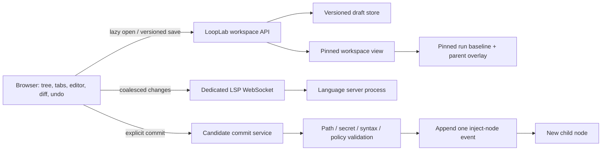
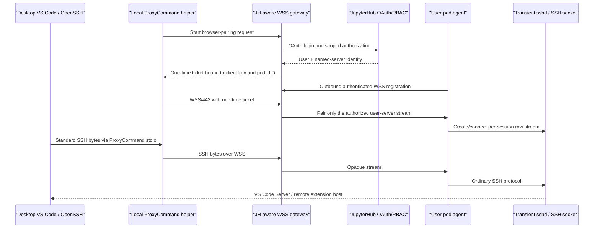
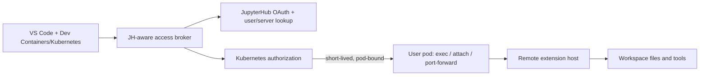

# LoopLab — IDE Integration & Remote Development Architecture (2026-07-12)

> A code-grounded options analysis for fast editing inside LoopLab and for secure, high-functionality
> desktop access to a JupyterHub-managed workspace. This is a decision and acceptance-gate document;
> it does **not** claim that an IDE or remote-access path is already implemented.

| Metadata | Value |
|---|---|
| Status | Validated architecture/options analysis; documentation only |
| Executable code baseline | `369d6a6c6fe0ccf0f921051ffba71c742879bfdb` |
| Documentation baseline | `e5ca709778322b9b819e1969bc9bd8d5d4916ad6` |
| Normative for | IDE-integration criteria, JupyterHub performance/security constraints, PoC matrix, and acceptance gates |
| Authority boundary | [Doc 16](16-architecture-code-review-2026-07-11.md) remains the defect ledger; [doc 17](17-project-review-and-directions-2026-07-11.md) retains overall delivery order; [doc 18](18-ui-ux-review-2026-07-11.md) retains UI/UX authority |
| Supersedes | — |
| Superseded by | — |
| Last verified | 2026-07-12 |

**Companion material:** [current delivery plan](17-project-review-and-directions-2026-07-11.md) ·
[UI/UX audit](18-ui-ux-review-2026-07-11.md) ·
[architecture](02-architecture.md) · [file contract](04-file-layout.md) ·
[Web UI guide](guide/ui.md) · [deployment guide](guide/deployment.md)

## Evidence vocabulary

- **Code-confirmed** — established directly from the baseline repository.
- **User-observed** — reported from the real deployment, but not yet reproduced by a controlled
  benchmark.
- **Upstream-confirmed** — documented by the named project's primary documentation or repository.
- **Inference** — the most plausible explanation consistent with the evidence, not a measured fact.
- **Recommendation** — a product or architecture choice.
- **PoC-required** — compatibility, performance, or policy must be demonstrated in the real
  JupyterHub environment before adoption.

Version-sensitive upstream facts and links were checked on 2026-07-12. Security policy interpretation,
vendor licensing, and actual deployment versions remain deployment-owner decisions.

---

# PART I — DECISION

## 1. Executive verdict

The request contains **two different products**. Treating them as one is the main architecture trap.

1. **A fast editor embedded in LoopLab** should cover the primary candidate-editing journey without
   inheriting JupyterLab or a complete browser IDE. The browser owns text buffers, typing, selection,
   undo, diff, and keybindings; the network is used only for file/workspace operations and optional
   language intelligence.
2. **A maximum-functionality remote workspace** should be a separate “Open in Desktop IDE” path.
   When SSH protocol is approved, stock VS Code Remote-SSH through a brokered access plane is the
   closest possible equivalent to normal Remote-SSH—because it actually *is* normal SSH. The access
   transport may be a custom WSS/443 relay or Teleport's separate TLS/ALPN proxy path; these are not
   the same protocol implementation. If SSH protocol is prohibited, Kubernetes/Dev Containers
   Attach is the closest practical VS Code alternative, but it intentionally loses generic
   SSH/SFTP/rsync and third-party SSH-client compatibility.

**Recommended product combination:**

- **Primary, fast path:** LoopLab workspace shell + **CodeMirror 6**. Choose **Monaco Core** instead
  if VS Code familiarity, its diff editor, and future VS Code-service reuse matter more than bundle
  size and implementation simplicity.
- **Maximum desktop path, where SSH is allowed:** “Open in Desktop VS Code” using
  either a small JupyterHub-aware **OpenSSH-over-WSS/443 gateway** or, after a separate pod-privilege
  and lifecycle feasibility gate, **Teleport's SSH/TLS access plane**. Teleport is not automatically
  JupyterHub-aware and its in-pod SSH Service is not compatible with the Restricted pod baseline
  assumed here. Evaluate **Coder** when the organization is willing to introduce a full
  developer-workspace control plane rather than extend JupyterHub.
- **Maximum desktop path under a strict no-SSH rule:** a JupyterHub-aware, short-lived
  **Kubernetes Attach broker** for VS Code Dev Containers.
- **Browser fallback:** code-server/OpenVSCode only as an explicitly optional full-IDE surface, not
  the embedded default and not the expected low-latency path during training.

There is no honest solution that simultaneously promises unrestricted Remote-SSH compatibility,
forbids the SSH protocol and forwarding, forbids arbitrary shell execution, and retains all SSH
clients. Every security restriction removes a corresponding capability. The useful question is
therefore not “what is called SSH?” but “what authority and protocol features may a user receive
inside one isolated workspace?”

## 2. Decision summary by scenario

| Need | Best starting option | Why | Principal limit |
|---|---|---|---|
| Fast embedded candidate editing | CodeMirror 6, local-first | Small, modular, controlled; no synchronous request per key | Not a complete IDE by itself |
| Embedded UI closest to VS Code | Monaco Core, local-first | VS Code's editor core and familiar diff/model APIs | No VS Code workbench, extension host, or Marketplace |
| Maximum standard desktop functionality | OpenSSH/Remote-SSH through a custom WSS gateway; Teleport after feasibility gates | Preserves real OpenSSH and VS Code Remote-SSH | Remains SSH; Teleport uses TLS/ALPN rather than the custom WSS path |
| Full ready-made workspace platform | Coder | Desktop IDEs, SSH, apps, ports, lifecycle, agents | Overlaps/replaces JupyterHub's control plane; SSH remains involved |
| Quick exact VS Code experiment | Remote Tunnels | Outbound connection; no exposed inbound listener | Uses a Microsoft relay/identity and SSH internally; not generic SSH |
| Strictly no SSH protocol | Scoped Kubernetes Attach | Remote files, extensions, tasks, debug, terminal in desktop VS Code | No generic SSH/SCP/rsync; powerful `pods/exec` authorization |
| Full browser IDE | code-server/OpenVSCode | Fastest route to broad browser functionality | Same heavy browser/workspace class that is already laggy; extension gaps |
| Strategic custom IDE platform | Eclipse Theia | Extensible IDE framework and remote architecture | Replatform, not a React editor component |

## 3. The policy question that must be answered first

“SSH is forbidden” is not sufficiently precise for an architecture decision. Security owners must
select the actual prohibited capability:

| Policy interpretation | Brokered Remote-SSH | Appropriate response |
|---|---:|---|
| Public/inbound `22/tcp` is forbidden | **Possible** | Keep port 22 closed; use an authenticated custom WSS gateway/outbound agent or an approved Teleport proxy topology |
| Any inbound listener in the user pod is forbidden | **Possible with design work** | Pod agent dials outbound WSS; create a transient per-session SSH endpoint behind the agent |
| Static SSH keys are forbidden | **Possible** | Browser pairing, one-time tickets, short-lived user certificates, host CA |
| SSH protocol is forbidden anywhere | **Not possible** | Use Kubernetes Attach or a purpose-built HTTPS/WSS workspace protocol |
| Arbitrary shell is forbidden | **Not maximum-functionality** | Expose bounded edit/test actions; neither SSH nor Attach can be unrestricted |
| Port forwarding is forbidden | **Remote-SSH may break or be reduced** | Validate Unix-socket/server forwarding; do not promise port features |
| External SaaS relay/identity is forbidden | Remote Tunnels is out | Use a self-hosted gateway, Teleport, or Kubernetes broker |
| Product may expose the service to external customers | Legal review required | Do not assume Microsoft VS Code Server/Remote components may be hosted as a service |

**Go/no-go rule:** neither SSH-over-WSS nor Teleport's TLS/ALPN routing is a loophole around a
protocol ban. Both ultimately carry SSH and must be reviewed and approved as such.

---

# PART II — CURRENT LOOPLAB AND THE LAG DIAGNOSIS

## 4. Current implementation surface

### 4.1 What LoopLab already has

The following is **code-confirmed** at the executable baseline:

- The UI is a React 18/Vite SPA (`ui/package.json`) with a comparatively small runtime surface. It
  does not currently depend on Monaco, CodeMirror, an LSP client, a terminal, a file watcher, or an
  extension host.
- Candidate code, diffs, and file contents are rendered mostly as `<pre>` blocks
  (`ui/src/Inspector.jsx`, `ui/src/panels.jsx`). Textareas serve other prompt/knowledge/chat flows;
  there is no direct candidate-code editor in the current UI.
- The `CONTROL.inject` client helper accepts `idea`, `parent_id`, and `code`, but has no current UI
  caller (`ui/src/api.js`). The backend model is already richer: a node can carry `files`, `deleted`,
  and `code` (`looplab/core/models.py`), and the orchestrator can append an injected child with
  multi-file overlays (`looplab/engine/orchestrator.py`). This is a **v1 UTF-8 text overlay**:
  `files` is `dict[str, str]`, `deleted` is a path list, and materialization writes UTF-8 text. It
  cannot represent original encoding/BOM/newline metadata, file kind/mode, symlinks, or an atomic
  rename as first-class event data.
- The UI uses a proxy-aware HTTP API and SSE for live run events (`ui/src/hooks.js`,
  `looplab/serve/routers/runs.py`). Live state is cached and trimmed; the payload cache is bounded to
  256 entries, while collection growth is not globally hard-capped (`looplab/serve/appstate.py`).
- The shared `usePoll` hook uses `setInterval` without a single-flight guard or abort. If a configured
  2–6-second poll takes longer than its interval, calls can overlap and amplify an already slow
  endpoint (`ui/src/hooks.js`). This is a current risk even though the main run-state path uses SSE.
- The Jupyter integration launches `looplab ui --no-build` through `jupyter-server-proxy`; it uses a
  proxy-aware URL and opens in the existing browser tab (`looplab/runtime/jupyter.py`). The
  documented JH image supplies a prebuilt SPA; another installation can fall back to a placeholder
  when no bundle is present.
- The artifact API is useful for inspection, but not an IDE filesystem protocol. It synchronously
  walks pruned roots until it has returned 1,500 regular files, caps inline content at 2,000,000
  bytes (2 MB), and applies root/path-traversal guards. It does **not** secret-filter allowed files,
  so artifact content is sensitive (`looplab/serve/artifacts.py`).
- Path safety, secret detection, and surface policy primitives already exist and should be reused
  (`looplab/core/_pathsafe.py`, `looplab/tools/patch.py`, `looplab/adapters/repo_write_tools.py`, and
  `looplab/tools/write_tools.py`).
- LoopLab's own UI token is optional; its server code explicitly warns that on a shared
  path-based JupyterHub origin the token is a deployment secret, **not** per-user isolation
  (`looplab/serve/server.py`). A writable IDE API therefore needs a private per-user origin or
  explicit Hub-backed authorization in addition to path safety.

### 4.2 The important source-baseline hazard

LoopLab materializes workspaces from source plus node overlays. In a Git repository, the current
directory fingerprint can collapse to the current `HEAD`, while materialization copies current file
bytes. A dirty source edit can therefore change later materializations without changing the recorded
Git fingerprint (`looplab/engine/triage.py`, `looplab/engine/workspace.py`).

**Consequence:** the first editable product should be **candidate-overlay editing**, not unconstrained
live source mutation. Direct “edit source” mode should remain a separate, explicit action until the
run baseline captures dirty content deterministically or live source editing forces a new run.

## 5. Why LoopLab can stay responsive while JupyterLab and web VS Code lag

### 5.1 What the observation changes

**User-observed:** during model training, LoopLab remains noticeably responsive, while JupyterLab and
web VS Code can take several seconds per action.

If these surfaces were tested against the same user pod, proxy route, storage, and training interval,
this observation makes “JupyterHub or `jupyter-server-proxy` is intrinsically slow” a weak primary
diagnosis. The proxy may add hops and amplify backpressure, but it does not explain why one proxied
SPA remains smooth while two much heavier applications do not.

It also does **not** prove that the pod or storage never starves. LoopLab can keep local navigation and
cached state smooth while a delayed API request is still in flight. The conclusion is narrower:
application workload and resource interaction deserve measurement before replacing the proxy.

### 5.2 Different workload shapes

| Surface | Work done during training | Likely pressure mechanism |
|---|---|---|
| LoopLab | Local React interactions; trimmed/cached state; proxy-aware HTTP, SSE, and some polling | Lighter DOM/workspace machinery; interval polls can overlap when an endpoint is already slow |
| JupyterLab | Kernel messages, IOPub/stdout, progress bars, rich outputs, plots, notebook document updates | Message/render backlog and browser main-thread work; kernel/server pressure |
| web VS Code | Workbench rendering, extension host, language servers, Git status, search/indexing, file watchers, terminal output | CPU/memory competition plus file-event storms from logs, data, checkpoints, caches |
| Training process | CPU/GPU feeders, memory, data reads, checkpoint/log writes, process creation | cgroup CPU throttling, memory pressure/OOM, disk or network-filesystem latency |

The most plausible combined explanation is therefore:

1. LoopLab's interaction loop is mostly local and deliberately narrow.
2. JupyterLab receives and renders training output.
3. web VS Code continuously observes a workspace that training modifies.
4. Shared CPU, memory, process, and I/O pressure magnifies both heavy applications.
5. Proxy buffering, WebSocket backpressure, ingress timeouts, or extra RTT can amplify the result,
   but must be isolated by an A/B path test.

### 5.3 Know which JupyterHub layer is slow

JupyterHub's URL topology separates concerns:

- `/hub/...` — central Hub pages and control plane;
- `/user/<name>/lab...` — the user's Jupyter server/JupyterLab;
- `/user/<name>/proxy/...` — a user-local app through `jupyter-server-proxy`;
- named-server forms add the server name under the user route.

The [JupyterHub URL reference](https://jupyterhub.readthedocs.io/en/stable/reference/urls.html)
documents these routes. A slow `/hub/...` action implicates a different path from a smooth LoopLab
route and slow JupyterLab route. Measurements must label the exact URL, user server, pod UID, browser
tab, and time interval.

### 5.4 If the central JupyterHub UI itself is slow

If the delayed action really is under `/hub/...`, the user training process normally is not serving
that response. Investigate the central Hub path:

- Hub process/DB/auth latency and synchronous server-status/spawn calls;
- Kubernetes API/spawner latency and user-server health/activity checks;
- ConfigurableHTTPProxy/ingress connection, queue, event-loop, and upstream timing;
- CPU throttling, memory pressure, or noisy-neighbour effects on the **Hub/proxy nodes or pods**, not
  only the user pod;
- browser-side main-thread delay versus a response that is actually waiting on the server.

Training may correlate indirectly: a user-server status call can wait on a saturated pod; many
checkpoint/output connections can load shared ingress/proxy resources; or Hub and training workloads
can share an undersized node. But a responsive LoopLab request through the same ingress/proxy is
evidence that the common path can still carry small interactive traffic. It argues for tracing the
specific slow Hub endpoint rather than labelling all JupyterHub proxying slow.

Split every slow click into:

1. **input → first browser paint** (client/main-thread);
2. **request queued → request sent** (browser connection pool);
3. **ingress → configurable proxy → Hub/user server** timings;
4. **upstream compute/DB/Kubernetes API**;
5. **response → final paint**.

This identifies whether “several seconds per action” is browser work, network/queueing, or an
upstream dependency.

### 5.5 Immediate diagnostics before any replatform

Run the same scenario in four modes: idle, compute-heavy with quiet output, IOPub-heavy, and
checkpoint/file-churn-heavy. Collect:

- browser key/input event to next paint, long tasks, DOM node count, heap, and WS message rate;
- per-path HTTP/WS p50/p95/p99, concurrent in-flight/overlapping polls, reconnects, bytes/messages
  per second, and proxy/upstream timing;
- pod/container CPU use **and throttled time**, memory working set/OOM events, process count;
- disk/network filesystem latency, throughput, queueing, and Linux PSI for CPU/memory/I/O where
  available;
- Jupyter kernel/IOPub rates;
- extension host, LSP, Git, search, and file-watcher CPU/event counts;
- an A/B with generated artifacts excluded from the IDE workspace;
- only if still ambiguous, an A/B of direct localhost, Jupyter Server extension, JSP, Hub proxy, and
  ingress paths.

Kubernetes documents that CPU limits are enforced by throttling and memory limits reactively through
cgroups; see [resource management](https://kubernetes.io/docs/concepts/configuration/manage-resources-containers/).
Do not interpret average CPU below the limit as proof that short interactive bursts are not
throttled.

---

# PART III — FUNCTIONAL MODEL AND OPTIONS

## 6. What “as close as possible to SSH” actually means

SSH combines several independent capabilities:

1. authenticated remote byte transport;
2. arbitrary process execution as a particular OS user;
3. PTY/terminal;
4. whole visible filesystem access;
5. stdin/stdout/stderr streams and exit codes;
6. local, remote, and dynamic forwarding;
7. file-copy protocols and tools (SFTP/SCP/rsync);
8. a standard ecosystem used by VS Code, JetBrains, Git, shells, automation, and mount tools;
9. reconnect and long-lived workspace semantics;
10. optional agent, X11, and tunnel channels.

A custom HTTPS API plus terminal can approximate the **authority** of a shell inside a pod, but it
does not provide the standard SSH ecosystem. Conversely, a polished editor can provide excellent
code UX without granting arbitrary shell or network forwarding. These axes must not be collapsed
into one “IDE completeness” score.

## 7. Functional comparison

Legend: **Full** = native/intended path; **Partial** = selectable or requires integration;
**No** = outside the solution's natural scope. “Shell” always means the authority of the workspace
OS user, not host root or cluster admin.

| Option | Editor/diff | Remote extensions | Whole workspace + shell | Tasks/tests/debug | Ports + file-copy | Other IDE/CLI ecosystem | Functional ceiling |
|---|---|---|---|---|---|---|---|
| CodeMirror 6 shell | Full editor; custom UX | No | Partial, only APIs exposed | Partial/custom | Partial/custom | No | Best bounded embedded workflow |
| Monaco Core shell | Full editor/diff | No | Partial, only APIs exposed | Partial/custom | Partial/custom | No | VS Code-like editor, not VS Code |
| Monaco + selective `monaco-vscode-api` | Full | Partial services, not automatic Marketplace parity | Partial | Partial–high with substantial work | Partial | No | Rich custom browser IDE |
| JupyterLab extension | Full with editor integration | Jupyter extension ecosystem | Full through existing terminal/kernel | Partial–high | Partial | Jupyter clients | Strong Jupyter coupling |
| code-server/OpenVSCode | High browser workbench | Partial; distribution/runtime compatibility varies | Full | High | High through app/terminal | Mostly browser-specific | Broad browser IDE |
| Eclipse Theia | High | Open VSX/Theia/VS Code extension compatibility with limits | Full | High | High if built | Theia ecosystem | Full custom IDE platform |
| Custom no-SSH workspace agent | Depends on LoopLab/custom client | Partial; no automatic remote extension host | Full if an unrestricted process API is built | Partial–high/custom | Partial–high/custom | Custom clients only | High authority, low standard compatibility |
| Custom Remote-SSH over WSS | Full desktop VS Code | Full Remote-SSH model; extension compatibility still platform-dependent | Full | Full | Full when policy allows | **Full OpenSSH ecosystem** | Highest generic compatibility; custom access plane |
| Teleport SSH via TLS/ALPN proxy | Full desktop VS Code | Full Remote-SSH model; extension compatibility still platform-dependent | Full | Full | Full when roles allow | **Full OpenSSH ecosystem** | Highest generic compatibility; privilege/JH integration gates |
| Coder | Full desktop/web/JetBrains paths | High | Full | Full | High, including workspace apps | High | Full workspace platform |
| VS Code Remote Tunnels | Full desktop/web VS Code | High | Full inside that VS Code session | Full | VS Code port features | **Not** a generic SSH host | Fast VS Code-specific pilot |
| Kubernetes Attach broker | Full desktop VS Code | High in attached container | Full via exec/attach | Full | VS Code/Kubernetes paths | No generic SSH/SFTP/rsync | Best strict-no-SSH desktop path |

“Full extensions” is never literally every extension: native binaries, architecture, operating
system, proposed APIs, licensing, and extension assumptions can still exclude individual packages.

## 8. Security, performance, and operational comparison

| Option | Typing path | Training sensitivity | Added authority/surface | JupyterHub fit | Build/operate cost |
|---|---|---|---|---|---|
| CodeMirror 6 | Entirely local | Low if watchers/LSP are bounded | Only explicit LoopLab APIs | Excellent | Low–medium |
| Monaco Core | Entirely local | Low–medium; larger workers/models | Only explicit LoopLab APIs | Excellent | Medium |
| `monaco-vscode-api` | Local typing; more services/workers | Medium | Grows with each emulated service | Good | High/version-coupled |
| JupyterLab extension | Local editor, Jupyter host | High when JupyterLab is already pressured | Existing Jupyter terminal/kernel authority | Native | Medium |
| code-server/OpenVSCode | Local keystroke rendering but heavy remote services | High without resource/watch isolation | Arbitrary shell, extensions, ports | Easy through JSP | Medium–high |
| Theia | Configurable | Medium–high | Usually arbitrary workspace authority | Possible through JSP | Very high |
| Custom no-SSH agent | Configurable/local-first | Low–medium if channels are prioritized | Exactly the implemented FS/process/PTY/port APIs | Excellent with Hub OAuth | **Very high** to approach SSH breadth |
| Custom WSS-brokered SSH | Desktop-local UI; remote extension traffic | Low browser load; server still needs resources | SSH auth, shell, forwarding, copy | Good after custom Hub OAuth/lifecycle work | High custom |
| Teleport SSH/TLS proxy | Desktop-local UI; remote extension traffic | Low browser load; server still needs resources | Teleport identity/RBAC plus shell/forwarding/copy | **No automatic JH binding** | Medium–high plus privilege/topology integration |
| Coder | Desktop-local UI | Usually better isolated, topology-dependent | Separate agent/control plane and workspace access | Poor as drop-in; strategic alternative | High platform adoption |
| Remote Tunnels | Desktop-local UI | Lower browser pressure; server still shared | Outbound relay, remote shell/ports | Lifecycle integration is custom | Low pilot, policy-dependent |
| Kubernetes Attach | Desktop-local UI | Lower browser pressure; `exec`/LSP still shared | Short-lived Kubernetes exec/attach/port-forward power | Good with a custom broker | High security integration |

## 9. Embedded editor options in detail

### 9.1 CodeMirror 6 — recommended default

[CodeMirror 6](https://codemirror.net/docs/guide/) is modular, keeps editor state explicitly, and
renders the visible viewport. Its reference includes merge/diff and an official LSP client surface.

**Advantages**

- Small, composable foundation for precisely the candidate-editing experience LoopLab needs.
- Easy to keep typing, selection, undo, keymaps, and diff independent of the network.
- Less temptation to reproduce an entire VS Code workbench.
- Good fit with the current React/Vite application and incremental delivery.

**Disadvantages**

- File tree, tabs, command palette, workspace search, save/conflict UI, diagnostics, test actions,
  and terminal integration are LoopLab product work.
- It does not run VS Code extensions.
- A polished IDE-like shell still requires accessibility and keyboard design.

**Use when:** speed, product control, and a narrow candidate workflow are the priorities.

### 9.2 Monaco Core — recommended when VS Code familiarity wins

[Monaco](https://github.com/microsoft/monaco-editor) is the editor core used by VS Code. It offers
models, workers, rich language services, and a mature diff editor.

**Advantages**

- Closest embedded editing feel to VS Code.
- Strong multi-model and diff primitives; familiar commands and decorations.
- Better strategic base if selective VS Code-like services are clearly required later.

**Disadvantages**

- Monaco explicitly is **not** the VS Code workbench and does not itself run VS Code extensions.
- Larger bundle/worker and integration surface than CodeMirror; mobile is not an upstream target.
- The same file tree, persistence, terminal, Git, debug, and remote filesystem work remains.

**Use when:** “feels like VS Code” is a hard embedded requirement and the measured cost is acceptable.

### 9.3 Monaco plus `monaco-vscode-api`

The third-party [monaco-vscode-api](https://github.com/CodinGame/monaco-vscode-api) can expose
selected VS Code services around Monaco.

**Advantages:** command/service reuse and a path toward a more VS Code-like custom workbench.

**Disadvantages:** initialization and global service assumptions, CSS/workbench coupling, tight
version synchronization, and much larger testing scope. It does not automatically create a secure
remote filesystem, extension host, Marketplace compatibility, Remote-SSH, or JupyterHub lifecycle.

**Decision:** not MVP. Add only a named service after proving that implementing that service directly
is worse.

### 9.4 JupyterLab extension

A JupyterLab extension could reuse Jupyter contents, terminals, kernels, and
[Jupyter Server extension points](https://jupyter-server.readthedocs.io/en/stable/developers/extensions.html).

**Advantages:** native Jupyter identity, workspace access, kernels, and existing language-server
integrations such as [jupyterlab-lsp](https://jupyterlab-lsp.readthedocs.io/en/latest/Installation.html).

**Disadvantages:** LoopLab becomes coupled to the surface users already report as laggy; extension and
Jupyter version compatibility become release concerns; the LoopLab product shell loses independence.

**Decision:** useful for a small “open selected candidate in JupyterLab” bridge, not the primary
LoopLab IDE.

### 9.5 code-server and OpenVSCode Server

[code-server](https://github.com/coder/code-server) and
[OpenVSCode Server](https://github.com/gitpod-io/openvscode-server) provide broad browser workbenches.

**Advantages:** quickest browser route to terminal, source control, search, language servers, debug,
and many extensions.

**Disadvantages:** browser constraints and Marketplace/extension differences; resource-heavy
workbench, extension host, language servers, Git, and watchers; shared-pod sensitivity; the observed
web VS Code performance problem is likely to remain unless resources and workspace observation are
fixed. code-server's own requirements call for WebSocket connectivity and meaningful CPU/RAM.

**Decision:** optional external full-IDE fallback behind its own route/resources. Do not iframe it as
the default editor and do not use it as evidence that Monaco itself would be slow.

### 9.6 Eclipse Theia

[Theia](https://theia-ide.org/docs/architecture/) is a frontend/backend IDE framework rather than a
React editor component.

**Advantages:** explicit remote architecture, extension model, terminal, filesystem, debug, and a
full platform to customize.

**Disadvantages:** highest replatform and maintenance cost; Open VSX/extension compatibility is not
identical to Microsoft VS Code; embeds a second product architecture beside LoopLab.

**Decision:** consider only if LoopLab deliberately becomes a general developer-workspace product.

### 9.7 Hosting path is a separate decision from editor core

Replacing the editor and replacing the proxy are independent experiments:

| Hosting path | Advantage | Cost/risk | Recommendation |
|---|---|---|---|
| Current JSP server process | Already integrated, proxy-aware user route, separate LoopLab app process | Hub/Jupyter authentication depends on deployment; shared-origin and LoopLab-token caveats remain; request traverses Jupyter Server/JSP | **MVP default** only with an approved per-user auth/origin model and passing p95/p99 |
| Jupyter Server extension | Direct contents/auth/event-loop integration | More Jupyter coupling; shares the Jupyter Server process and does not guarantee lower latency | Use only for a small bridge or measured hop |
| JSP 4.5 standalone / named JH app | Hub OAuth without a running Jupyter Server; can receive separate resources | Deployment/version/lifecycle work; still needs the LoopLab API and security model | Good production A/B if Jupyter Server is proven hot |
| Dedicated Hub service/per-user-domain route | Clean resource/origin/HA boundary and independent scaling | Most ingress, OAuth, named-server, and lifecycle integration | Use when isolation or scale—not intuition—justifies it |

An iframe does not solve performance or integration: it preserves the heavy child application and
adds focus, keyboard, origin, resizing, and accessibility problems. Open a full IDE as a separate
surface; embed only the purpose-built editor in LoopLab.

## 10. Full remote-workspace options in detail

### 10.1 OpenSSH through a JupyterHub-aware WSS gateway

OpenSSH supports a
[`ProxyCommand`](https://man.openbsd.org/ssh_config#ProxyCommand) whose stdin/stdout become the SSH
transport. A local helper can therefore translate stdio to an authenticated WSS stream on port 443.
Above that stream the client runs ordinary SSH and VS Code runs ordinary
[Remote-SSH](https://code.visualstudio.com/docs/remote/ssh).

**Functional result:** this is the closest possible analogue to direct Remote-SSH. Terminal, remote
extension host, tasks, tests, debug, Git, SFTP/SCP/rsync, and other SSH clients can work to the extent
allowed by `sshd_config` and the workspace image.

**Critical qualification:** `jupyter-server-proxy` is not by itself a desktop SSH client adapter.
Its current `raw_socket_proxy` mode can relay a WebSocket to a raw TCP or Unix stream, but a local
WS↔stdio helper, JupyterHub authentication flow, target authorization, lifecycle binding, host
verification, and reconnect testing are still required. Upstream added `raw_socket_proxy` in the
4.3 line and a JupyterHub-authenticated standalone proxy in 4.5; LoopLab currently declares
`jupyter-server-proxy>=4.1`, so production must pin and validate an actual supported version. See the
[server-process options](https://jupyter-server-proxy.readthedocs.io/en/latest/server-process.html),
[standalone mode](https://jupyter-server-proxy.readthedocs.io/en/latest/standalone.html), and
[changelog](https://jupyter-server-proxy.readthedocs.io/en/latest/changelog.html).

**Advantages**

- Maximum compatibility without exposing public port 22.
- Reuses desktop rendering and key handling, avoiding a heavy browser workbench.
- Can bind access to the same JupyterHub user, named server, pod, and lifecycle.
- A reverse pod agent can remove all inbound pod listeners.

**Disadvantages**

- It remains SSH and cannot satisfy a protocol-level ban.
- Correct browser-to-CLI OAuth pairing, certificates, host identity, revocation, forwarding policy,
  audit, and failure handling are security-sensitive custom code.
- VS Code Remote-SSH requires server bootstrap and some forwarding behavior; disabling every
  forwarding channel can remove functionality or break the connection.
- The gateway normally sees connection metadata, not semantic IDE file edits inside end-to-end SSH.

### 10.2 Teleport

[Teleport's VS Code integration](https://goteleport.com/docs/connect-your-client/third-party/vscode/)
uses OpenSSH certificates and Remote-SSH. Desktop OpenSSH normally reaches the Teleport proxy through
`tsh proxy ssh`; single-port routing uses TLS/ALPN and Teleport reverse tunnels—not the custom WSS
relay in §10.1. Roles can constrain users, certificate TTL, forwarding, file transfer, MFA, and
sessions.

**Advantages:** ready identity-aware access plane, short-lived credentials, host identity, RBAC/MFA,
reverse connectivity in supported SSH-Service topologies, and stronger audit/operations than a new
custom gateway.

**JupyterHub integration gap:** Teleport does not automatically consume JupyterHub OAuth/scopes or
bind a Teleport identity to a named server, immutable pod UID, Hub logout, cull, or pod replacement.
An integration must map identities (directly or through a common IdP), enrol/disenrol every ephemeral
target, attach trustworthy labels, revoke access, and prove race-free lifecycle handling.

**Pod privilege/topology gap:** Teleport documents that its
[SSH Service requires root](https://goteleport.com/docs/enroll-resources/server-access/guides/ssh-pam/),
and the upstream `teleport-kube-agent` chart explicitly does not provide the SSH Service. Running it
inside the user pod therefore conflicts with the Restricted-PSS baseline in §15.1 unless security
approves a separate exception. An external Teleport Proxy can instead reach an agentless OpenSSH
target, but that requires a reachable and separately hardened pod SSH endpoint; an unprivileged
single-UID target is **PoC-required**, not assumed. See
[agent services](https://goteleport.com/docs/installation/agents/add-service-to-agent/) and
[agentless OpenSSH](https://goteleport.com/docs/enroll-resources/server-access/openssh/openssh-agentless/).

Other disadvantages are platform/licensing cost and the fact that standard session recording does
not guarantee a semantic record of every IDE edit. Enhanced recording has kernel/deployment
requirements and documented limits.

**Decision:** evaluate Teleport when it is already an organizational access standard or when its
identity/audit value justifies the integration. It is not the default JupyterHub answer until the
Restricted-pod and JH-lifecycle gates pass.

### 10.3 Coder

[Coder](https://coder.com/docs/admin/infrastructure/architecture) is a developer-workspace platform
with agents, desktop VS Code/JetBrains paths, web apps, SSH integration, and port forwarding.
Generated SSH configuration uses a `ProxyCommand`; Coder's documentation directs users to this path
for full OpenSSH compatibility.

**Advantages:** broadest ready-made workspace product, multiple IDEs, lifecycle, applications, and
networking. It can use direct peer paths when possible and relay otherwise.

**Disadvantages:** its identity, workspace lifecycle, templates, agents, and control plane overlap
substantially with JupyterHub. It is not a small JH plugin. It also does not solve a strict SSH
protocol ban.

**Decision:** evaluate as a strategic control-plane choice, not as the default LoopLab embed.

### 10.4 VS Code Remote Tunnels

[Remote Tunnels](https://code.visualstudio.com/docs/remote/tunnels) creates outbound connectivity and
can open the remote workspace in desktop or web VS Code without an inbound listener or installed
`sshd`.

**Advantages:** fastest way to test desktop VS Code UX through an outbound tunnel; rich Remote
Development behavior; little custom transport code.

**Disadvantages:** Microsoft relay and GitHub/Microsoft identity policy, outbound egress, one-user
workspace lifecycle matching, service availability/limits, and product licensing. The official
security description says an SSH connection is created over the tunnel, so this is not suitable
when the protocol itself is banned. It is not a generic SSH host for arbitrary clients.

**Decision:** useful disposable/internal pilot only if relay, identity, egress, and license are
approved.

### 10.5 Kubernetes/Dev Containers Attach

VS Code documents attaching to an existing
[Docker or Kubernetes container](https://code.visualstudio.com/docs/devcontainers/attach-container).
The remote extension host, editing, terminal, tasks, debug, and port features then run against the
attached container without presenting an SSH endpoint.

**Advantages:** closest full desktop VS Code workflow under a literal no-SSH rule; naturally targets
the existing user pod and filesystem.

**Disadvantages:** `pods/exec`, `attach`, and `portforward` are powerful. Kubernetes RBAC can bind a
subresource permission to a named pod, but once exec is authorized it does not constrain which
commands or visible files the workspace user accesses. Dynamic pod names, credential expiry,
discovery, revocation, JH user/server mapping, and client setup require a broker. A normal broad
kubeconfig is unacceptable.

**Decision:** best strict-no-SSH PoC. Issue a short-lived, user/pod-bound credential or proxy session,
not raw cluster access.

### 10.6 A fully custom no-SSH workspace agent

A self-written agent can multiplex versioned filesystem RPC, process execution, PTY, watch events,
LSP/debug streams, port access, and bulk transfer over authenticated HTTPS/WSS. It can be bound
directly to JupyterHub identity and prioritize small interactive frames over terminal/bulk traffic.

**What it can achieve**

- If it exposes unrestricted process/PTY and the full mounted filesystem, its *authority inside the
  pod* can approach an SSH shell.
- The protocol can enforce LoopLab-specific path, command, bandwidth, audit, and lifecycle policy.
- The same agent can back the embedded CodeMirror/Monaco editor and a dedicated LoopLab desktop
  client.
- A browser editor avoids an extra SSH daemon and can make candidate commits first-class operations.

**What it does not achieve automatically**

- It is not a standard target for Remote-SSH, SFTP/SCP/rsync, JetBrains, Git transports, or ordinary
  CLI automation.
- A VS Code filesystem extension can expose a virtual workspace, but that is not the same as the
  normal remote extension-host model; extensions that assume local/native workspace access can be
  limited.
- Full desktop VS Code parity would require a supported remote resolver/client integration or a
  maintained Code-OSS/Theia fork, multiplying compatibility and release risk.

**Engineering burden:** protocol framing and flow control, resumable binary transfer, PTY correctness,
process trees/signals, environment and exit semantics, filesystem races/symlinks/modes, watcher
overflow, port policy, client updates, reconnection/idempotency, authorization, revocation, audit,
and cross-platform clients. This is effectively rebuilding much of an SSH/workspace platform.

**Decision:** write the bounded agent/API needed by the LoopLab embedded experience. Do **not** build
a general SSH replacement merely to avoid the SSH name; use Kubernetes Attach for standard desktop
VS Code under a strict no-SSH policy.

### 10.7 Boundary and similar connection brokers

Connection brokers can establish authenticated sessions without exposing target networks. For
example, [Boundary](https://developer.hashicorp.com/boundary/docs/commands/connect/ssh) can broker an
SSH target, but it does not itself replace the remote IDE/workspace lifecycle. Treat it as an access
layer to compare with Teleport, not an embedded editor.

---

# PART IV — RECOMMENDED ARCHITECTURE

## 11. Embedded local-first LoopLab editor

### 11.1 Browser responsibilities

- Hold file models, dirty state, selection, scroll, undo/redo, diff, decorations, and keybindings.
- Make **zero synchronous or one-request-per-keystroke network calls**. Optional LSP changes are
  asynchronous, coalesced, versioned, and never on the paint/input critical path.
- Keep edits usable during transient proxy loss; optionally persist encrypted/approved drafts in
  IndexedDB if data policy allows it.
- Cancel stale open/search/LSP requests and ignore out-of-order responses.
- Virtualize large trees/results and load directories/files lazily.

### 11.2 Workspace API

Create a purpose-built API rather than stretching the artifact listing:

- `GET tree?path=&cursor=` — lazy, paginated directory entries with type, size, mode, and version;
- `GET file?path=` — bytes/text plus encoding, newline, BOM, mode, and version;
- `PUT draft/file` — compare-and-swap using `If-Match`/version; atomic temp-write + replace;
- `DELETE draft/file` — versioned tombstone;
- `POST search` — server-side `rg`, bounded/cancelable/streamed;
- `POST validate` — path, policy, syntax, size/count, and secret checks;
- `POST commit` — append one validated child node;
- optional command/job API, followed later by a separate PTY WebSocket.

Never use a full recursive `os.walk` response as the IDE tree. Return a conflict instead of
last-write-wins. Choose one explicit persistence tier:

1. **Constrained v1 MVP:** UTF-8 regular text only; no symlink editing; rename is delete+create; do
   not promise preservation of encoding/BOM/newline/mode that the event schema does not carry.
2. **Required before general source editing:** a versioned `FileOverlay` event schema with operation,
   content/blob reference, encoding/newline/BOM, mode/type, and rename/tombstone semantics. Replay
   and materialization must accept both legacy `files`/`deleted` and the new representation.

### 11.3 Language intelligence

- Start with syntax highlighting, bracket/indent support, file-local search, and real diff.
- Add Python LSP only after the core save/commit contract is correct.
- Keep one language-server process per active workspace/language, not per tab.
- Coalesce incremental changes over roughly 25–50 ms; debounce diagnostics more heavily
  (roughly 150–300 ms), attach document versions, and cancel stale requests.
- Separate the latency-sensitive LSP channel from terminal output and bulk file transfer.
- Do not make autocomplete correctness depend on a request synchronously completing for every key.

These intervals are starting hypotheses for the PoC, not production SLOs.

### 11.4 File watching and storage

- One bounded watcher per active workspace, with server-side batching.
- Exclude `.git`, `.venv`, `node_modules`, datasets, run outputs, checkpoints, logs, caches, model
  weights, and artifact stores by default.
- Let users opt individual source roots in; never watch the whole mounted home directory.
- Prefer a hot local worktree for editor/LSP metadata when the canonical source is on slow
  NFS/FUSE/object-backed storage; synchronize explicitly and preserve provenance.
- Use server-side indexed/`rg` search and lazy reads instead of mirroring every file into the browser.

### 11.5 Candidate editing semantics

The safe primary flow is:

1. Open a selected parent node as a deterministic view of **run-start baseline + parent
   `files`/`deleted`/`code` overlay**.
2. Edits create a private draft. **Save draft does not mutate source and does not change lineage.**
3. Validate all changed paths, count/byte limits, protected surfaces, secrets, syntax, delete/rename
   operations, and optimistic versions.
4. “Commit candidate” appends exactly one new child `inject_node` event containing the complete
   supported v1 overlay/tombstones—or the versioned `FileOverlay` after it exists—and records the
   draft/base identity.
5. The engine remains the sole event-log writer; the new child enters the existing evaluation flow.
6. “Apply to source” is a separate action with a complete diff, explicit confirmation, and audit.

Reference inputs, datasets, evaluated artifacts, and historical node snapshots are read-only.

### 11.6 CodeMirror versus Monaco gate

Build the same thin vertical slice in both editors:

- two files and tabs;
- 1,000-line and 20,000-line source;
- side-by-side candidate diff;
- diagnostics/decorations;
- keyboard navigation and accessibility;
- reconnect with an unsaved draft;
- the real JH/JSP base path.

Choose CodeMirror unless Monaco materially improves the tested product journey enough to justify
its bundle, worker, accessibility, and maintenance cost. Do not choose by synthetic editor startup
alone.

## 12. Desktop Remote-SSH through WSS/443

### 12.1 Why a separate gateway

The gateway should be a dedicated JupyterHub OAuth service or access-plane component with its own
resources, origin, logs, and rate limits—not work inside the Jupyter kernel or share the busy
JupyterLab event loop. [JupyterHub services](https://jupyterhub.readthedocs.io/en/latest/reference/services.html)
and [scopes](https://jupyterhub.readthedocs.io/en/stable/rbac/scopes.html) provide the identity and
object-filter model; a deployment still needs a precise user/named-server/pod binding.

JSP 4.5 standalone mode could reduce Jupyter Server coupling for a custom experiment. It does not
remove the need for the access protocol and security controls above.

The target-side SSH endpoint is itself a feasibility gate. Under the baseline in §15.1 it must run
as the workspace's fixed non-root UID on an unprivileged private socket/port, without PAM, OS-user
switching, sudo, low-port binding, or extra capabilities. The exact OpenSSH build and Remote-SSH
channel set must pass a Restricted-PSS PoC. If they cannot, the custom WSS design requires an explicit
security exception or becomes a no-go; the gateway must not quietly introduce a privileged `sshd`.

### 12.2 Authentication and lifecycle

The desktop client does not automatically possess a browser's JupyterHub cookie. Use an explicit
browser/device pairing:

1. the helper opens a browser to a gateway nonce;
2. JupyterHub authenticates the user and authorizes the specific named server;
3. the gateway resolves and pins the current pod UID/workspace identity;
4. it issues a single-use ticket valid for roughly 30–60 seconds and bound to the helper's public
   key, user, server, pod UID, and requested capability set;
5. SSH authentication then uses a short-lived user certificate (for example 5–10 minutes) and a
   trusted host CA; renewal remains tied to an active Hub session;
6. the gateway maintains an active-session registry and forcibly closes both relay legs on
   certificate expiry, Hub logout, stop/cull/restart, user lock, or pod-UID change.

Times are proposed defaults, to be set by the security owner.

Certificate expiry prevents a **new** authentication but does not by itself terminate an already
established SSH connection. Forced relay/session closure and tested event propagation are therefore
part of the authorization contract. A Teleport implementation must explicitly require the
`disconnect_expired_cert` role option and verify lock/cull propagation; it must not assume certificate
TTL alone provides active-session revocation. See the
[Teleport role reference](https://goteleport.com/docs/reference/access-controls/roles/).

### 12.3 Forwarding and Remote-SSH compatibility

Remote-SSH normally installs/starts VS Code Server and connects to it through SSH forwarding.
Prefer `"remote.SSH.remoteServerListenOnSocket": true` where supported and allow only the required
stream-local channel; VS Code documents the corresponding OpenSSH
[`AllowStreamLocalForwarding`](https://code.visualstudio.com/docs/remote/troubleshooting#_improving-security-on-multi-user-servers)
requirement. If the tested client requires local TCP forwarding, permit it only to a server-chosen
loopback endpoint. Disable by default:

- remote forwarding (`-R`);
- dynamic SOCKS forwarding (`-D`);
- agent forwarding;
- X11 forwarding;
- TUN/TAP devices;
- arbitrary `PermitOpen` destinations.

These restrictions must be tested with the exact VS Code client/server versions. “No forwarding at
all” and “full Remote-SSH functionality” may be mutually exclusive.

They are **defense in depth and reduction of accidental exposure**, not the primary network
containment boundary. A user with arbitrary shell and allowed egress can run another proxy even when
standard SSH forwarding channels are disabled. Enforce actual reachable destinations with
default-deny egress NetworkPolicy (and an L7/egress gateway where needed). If policy forbids all
tunnelling behavior, an unrestricted shell may itself be incompatible with that policy.

## 13. Strict no-SSH desktop architecture

The broker should expose only the authenticated user's current pod/named server, with short expiry,
audience binding, revocation, and an explicit capability set. Do not give the desktop a standing
cluster-wide kubeconfig. Kubernetes authorization/RBAC and `resourceNames` can help scope a
`pods/exec` subresource to a specific pod, but lifecycle races and other subresources still require
careful design.

This path delivers most *VS Code workspace* functionality but not OpenSSH ecosystem compatibility.
That difference is structural and should be visible in product copy.

---

# PART V — SECURITY BOUNDARY

## 14. Compare effective authority, not protocol names

If a Jupyter user already has a terminal or a Python kernel that can invoke subprocesses, that user
already has nearly arbitrary command execution as the pod's OS identity. Adding SSH to the **same**
UID, mounts, namespaces, network policy, service account, and cgroup does not inherently grant host
root or new files.

It does add meaningful attack surface:

- a new authentication and persistent-entry endpoint;
- credential/certificate and host-key lifecycle;
- generic client automation;
- convenient built-in forwarding that can turn the pod into a network pivot (while recognizing that
  an unrestricted shell can build an equivalent proxy over any allowed egress);
- agent/X11/TUN channels;
- standardized bulk file copy;
- durable tooling and potentially weaker culling/revocation behavior.

Therefore the real containment boundary is:

- UID/GID, sudo and Linux capabilities;
- mounts/PVCs, secrets, host paths, and container sockets;
- service-account token and Kubernetes RBAC;
- ingress/egress NetworkPolicy and reachable internal services;
- seccomp/AppArmor/SELinux and kernel namespaces;
- CPU/memory/PID/ephemeral-storage/GPU limits;
- pod lifetime and audit.

Jupyter Server's own [security guidance](https://jupyter-server.readthedocs.io/en/stable/operators/security.html)
correctly treats terminal execution as equivalent to arbitrary code with the server user's
permissions. Renaming the transport does not make that authority disappear.

## 15. Required controls for either SSH or Attach

### 15.1 Pod/workspace baseline

- `runAsNonRoot: true`; fixed per-user UID/GID where feasible.
- `allowPrivilegeEscalation: false`; drop all Linux capabilities.
- `seccompProfile: RuntimeDefault`; no privileged container, host PID/network/IPC, hostPath, Docker or
  container-runtime socket.
- A user-scoped PVC/workspace; no cross-user mounts or writable shared secrets.
- `automountServiceAccountToken: false` unless a tightly scoped token is essential.
- Default-deny ingress and egress with explicit destinations; verify that the CNI enforces policy.
- CPU/memory/PID/ephemeral-storage limits plus reserved interactive capacity.
- Separate or prioritized interactive sidecar/process; ideally run heavy training as a distinct Job
  or pod with the workspace contract made explicit.

The Kubernetes
[Restricted Pod Security Standard](https://kubernetes.io/docs/concepts/security/pod-security-standards/),
[RBAC guidance](https://kubernetes.io/docs/concepts/security/rbac-good-practices/), and
[NetworkPolicy model](https://kubernetes.io/docs/concepts/services-networking/network-policies/)
are the baseline, not a complete application threat model.

### 15.2 Access-plane controls

- Hub OAuth/scoped authorization; user + named server + immutable pod UID binding.
- Server-side target selection only: the client cannot submit an arbitrary host or port.
- Single-use tickets and short-lived certificates/credentials; no bearer token in URL, shell config,
  command line, or long-lived environment variable.
- Host CA and strict host verification; reject pod/server identity changes.
- No passwords, root login, static shared keys, or unrestricted authorized-key files.
- Capability-specific policy for shell, SFTP/SCP, local/remote/dynamic forwarding, and ports.
- An active-session registry plus forced transport closure on certificate expiry, Hub logout, cull,
  server stop, user disable/lock, or pod replacement; issuing short credentials alone is insufficient.
- Idle, absolute-session, connection, bandwidth, and concurrency limits.
- Default-deny origin/CORS and WebSocket checks; per-user domains where the JH threat model requires
  them. See [JupyterHub web security](https://jupyterhub.readthedocs.io/en/stable/explanation/websecurity.html).
- Rate limits, replay prevention, nonce binding, dependency patching, and gateway isolation.
- Default-deny egress is the containment control; disabling built-in SSH forwarding is only
  defense-in-depth when the user still has arbitrary shell execution.

### 15.3 Audit boundary

Record authentication, user/server/pod mapping, ticket/certificate ID, requested capabilities,
session start/end, bytes, disconnect reason, and policy decisions. Terminal recording can capture PTY
input/output, and privileged kernel instrumentation may capture more, but neither a generic encrypted
SSH proxy nor ordinary PTY recording guarantees a semantic record of every IDE filesystem edit.

If complete file-change provenance is required, enforce it at the workspace/filesystem/commit layer
and in LoopLab's candidate event log. Do not claim that gateway logs provide it.

## 16. Licensing and distribution gate

The official
[VS Code Remote Development FAQ](https://code.visualstudio.com/docs/remote/faq) distinguishes
private/internal use from building public or commercial services around these components, and the
[VS Code Server documentation](https://code.visualstudio.com/docs/remote/vscode-server) describes a
single-user design and hosting restrictions. Before productizing Remote-SSH, Remote Tunnels, or VS
Code Server for customers, obtain a legal/licensing review for the exact distribution and service
model.

Monaco is separately distributed under its repository license, but it still does not confer VS Code
workbench, extension, or Marketplace rights. code-server/OpenVSCode and Open VSX have their own
compatibility and licensing model.

---

# PART VI — PERFORMANCE CONTRACT AND VALIDATION

## 17. Design rules for responsiveness during training

1. **Typing and basic editing never wait for the network.**
2. **No global recursive watcher.** Generated data, checkpoints, logs, runs, environments, and caches
   are excluded.
3. **Interactive work receives reserved CPU/memory/process capacity.** Do not place an LSP, gateway,
   and training loop behind one saturated scheduling budget without priorities.
4. **Bulk and interactive channels are separated.** LSP/control messages cannot queue behind terminal
   megabytes, checkpoint transfer, or artifact listings.
5. **Outputs are bounded and virtualized.** Backpressure/drop/coalescing rules exist for logs and
   diagnostics.
6. **Every poll is single-flight and cancelable.** Use recursive completion-aware scheduling or an
   in-flight guard, `AbortController`, jitter, and failure backoff.
7. **One logical workspace has one bounded service set.** Avoid extension/LSP/watcher duplication per
   browser tab.
8. **The browser does not render unbounded training output.**
9. **Proxy replacement is evidence-driven.** Keep JSP for MVP if the real p95 is good; move to a
   standalone/direct service only when path A/B identifies material benefit.

## 18. PoC benchmark matrix

### 18.1 Workloads

- idle workspace;
- CPU-heavy/GPU-heavy training with quiet output;
- IOPub-heavy progress/log output;
- checkpoint-heavy and many-small-file churn;
- source trees of roughly 1k, 10k, and 50k files;
- local filesystem and the real mounted/FUSE/network storage, cold and warm cache;
- reconnect, pod restart, Hub cull, and brief network loss.

### 18.2 Products to compare

1. LoopLab + CodeMirror vertical slice through current JSP.
2. LoopLab + Monaco vertical slice through the same route and API.
3. Existing JupyterLab.
4. Existing web VS Code with default and corrected watcher exclusions.
5. Desktop VS Code via the custom WSS gateway PoC and, separately, an approved Teleport or Tunnel
   PoC.
6. Kubernetes Attach if no-SSH is a live policy.

### 18.3 Measurements

- keydown/input to paint p50/p95/p99; dropped frames and >50 ms browser long tasks;
- cold/warm bundle and workspace load, memory, worker count;
- file-tree page, open, save, search, diff, and commit latency/error rate;
- LSP completion/hover/diagnostic latency and stale-response rate;
- synchronous/key-coupled calls and HTTP requests per key—target **zero**; separately measure and
  bound coalesced asynchronous LSP frames/bytes per typed character;
- WebSocket/SSE queue depth, message size/rate, reconnect time, proxy/upstream timing;
- server CPU, throttled CPU, memory/OOM, PIDs, I/O throughput/latency/PSI;
- watcher events, extension-host/LSP/Git CPU, files indexed;
- draft survival, optimistic conflict behavior, and cross-user isolation;
- certificate/credential revocation and stale-pod rejection.

### 18.4 Preliminary acceptance gates

These are initial product budgets to validate against the real user network, not claims about the
current system:

- editing makes zero synchronous/key-coupled HTTP requests, coalesces any LSP traffic, and remains
  fully usable during a 5-second API interruption;
- key-to-paint p95 ≤ 50 ms and p99 ≤ 100 ms on the supported client under each training workload;
- no sustained main-thread long-task or message backlog caused by training output;
- a warm ≤1 MiB source file opens and saves in one application RTT, with p95 ≤ 500 ms on the target
  deployment;
- stale versions return an explicit conflict; no silent overwrite or draft loss;
- a disconnected client reconnects without duplicate commit and rejects a replaced pod identity;
- generated-output churn does not increase watched source events;
- LoopLab/JupyterHub user A cannot enumerate, attach to, route to, or reuse credentials for user B;
- stop/cull/revoke blocks new access immediately and terminates active access within the approved
  revocation budget;
- the embedded editor is no slower through JSP than a direct route by more than the measured,
  agreed path budget. If it is, isolate the hop before redesigning the editor.

## 19. Experiment interpretation

- If quiet compute is fine but IOPub-heavy mode is slow, fix output rate/rendering/backpressure.
- If checkpoint mode is slow and watcher events spike, fix workspace roots/exclusions and storage.
- If every app/API is slow and CPU throttling or PSI rises, separate/reserve resources.
- If LoopLab editor stays smooth but open/save is slow, local-first UX is masking server/storage
  latency; optimize the file path without replacing the editor.
- If direct and proxied paths differ materially with the same app/load, optimize or replace the
  identified proxy/ingress layer.
- If Monaco and CodeMirror both type smoothly but Monaco improves real diff/navigation enough, choose
  Monaco; otherwise prefer the smaller surface.
- If desktop Remote-SSH is smooth while browser IDE is not, the win comes mainly from desktop-local
  workbench rendering and reduced browser-server chatter—not from the word “SSH.”

---

# PART VII — DELIVERY PLAN

## 20. Phased implementation

### Phase IDE-0 — measure and fix pathological workspace observation

- Capture the benchmark baseline across quiet/IOPub/checkpoint training.
- Exclude generated paths from web VS Code/Jupyter tooling where possible.
- Replace overlapping interval polling with single-flight/cancelable scheduling and record concurrent
  in-flight requests before/after.
- Record resource throttling and storage latency.
- Confirm the security policy interpretation of SSH, forwarding, SaaS relay, and arbitrary shell.

**Exit:** reproducible lag modes, exact bottleneck hypotheses, and signed policy branches.

### Phase IDE-1 — read-only embedded slice

- Lazy workspace tree; tabs; syntax editor; real candidate diff; keyboard/accessibility baseline.
- CodeMirror and Monaco behind the same small adapter.
- No writes, LSP, terminal, Git, or recursive watcher.

**Exit:** A/B results under real training and an editor-core decision.

### Phase IDE-2 — safe candidate drafts

- Pinned parent/baseline view; versioned private draft; atomic save; conflict UI.
- Either enforce the UTF-8 regular-text v1 scope or introduce the versioned `FileOverlay` schema,
  replay compatibility, and materializer before promising mode/encoding/symlink/rename preservation.
- Multi-file create/update/delete representation; rename is delete+create in v1.
- Reuse surface/secret/path policy and enforce size/count limits.
- Offline/reconnect draft behavior.

**Exit:** no silent overwrites; source/event log remain unchanged by draft saves.

### Phase IDE-3 — lineage commit

- Validate and append one child `inject_node` event.
- Complete diff, provenance, idempotency, audit, and evaluation handoff.
- Read-only historical/artifact views.

**Exit:** deterministic replay reproduces the edited child and duplicate submits cannot create
unintended children.

### Phase IDE-4 — intelligence and bounded tooling

- Server-side search; Python LSP; diagnostics; command runner/background jobs.
- Separate channels and watcher exclusions.
- Add terminal, Git, debug, or selective VS Code services only from measured user demand.

**Exit:** performance gates remain green during all training modes.

### Phase IDE-5 — direct source mode

- Fix/pin dirty-source baseline semantics.
- Explicit “Apply to source” diff and confirmation.
- Define behavior for a live run: block, snapshot/new run, or explicit invalidation.

**Exit:** source bytes used for every materialization are content-addressed/auditable.

### Phase REMOTE-0 — access-plane PoCs in parallel

- If SSH is approved: build a minimal JH OAuth + browser pairing + custom WSS `ProxyCommand`
  vertical slice; optionally test JSP `raw_socket_proxy`, but keep the gateway design independent of
  it.
- Evaluate Teleport as a **separate TLS/ALPN topology** only after choosing agentless OpenSSH versus
  an approved SSH-Service privilege exception; add explicit JH identity, pod-UID, enrol/disenrol,
  active-session termination, and cull lifecycle integration.
- If strictly no SSH: build the short-lived pod-bound Kubernetes Attach broker.
- Remote Tunnels may be used only as an approved UX experiment.

**Exit:** VS Code attach, reconnect, cull/revoke, stale-pod rejection, forwarding policy, load, and
cross-user isolation pass.

### Phase REMOTE-1 — production decision

- Threat model and penetration review.
- Legal/licensing decision.
- HA, upgrades, observability, incident response, and support model.
- Choose Teleport/custom gateway/Coder/Attach—or intentionally ship none.

**Exit:** production owner accepts both the functional limits and effective authority.

## 21. Go/no-go gates

| Gate | Go | No-go |
|---|---|---|
| Embedded architecture | Zero request/key; candidate semantics deterministic; real-JH SLOs pass | Direct source mutation, recursive tree/watch, or editor depends on network per key |
| JSP retention | Path overhead is immaterial at p95/p99 | Controlled A/B proves material latency/backpressure attributable to JSP |
| SSH over WSS | Security explicitly allows SSH protocol and required channels | “SSH forbidden” is being reinterpreted as a transport trick |
| Custom gateway | Identity, host verification, lifecycle, revocation, isolation, HA, and ownership pass | Only a byte relay works; auth/lifecycle/audit remain hand-waved |
| Teleport | Restricted-pod topology, JH identity/pod lifecycle, forced session expiry/revocation, operations, and license pass | In-pod SSH Service needs an unapproved privilege exception or JH lifecycle remains unbound |
| Coder | Organization accepts a workspace control-plane change | Expected to behave as a tiny JupyterHub plugin |
| Remote Tunnels | Relay, identity, egress, privacy, and license approved | Strict no-SaaS or no-SSH policy |
| Kubernetes Attach | Broker issues pod-bound short credentials; RBAC and revocation pass | Desktop receives standing/broad kubeconfig or cross-user discovery |
| Full browser IDE | Resource-isolated benchmark meets SLOs | It reproduces current multi-second lag or becomes the embedded critical path |

## 22. Risks and open decisions

1. Exact meaning of the organization's SSH restriction.
2. Whether users already have arbitrary Jupyter terminal/kernel authority; this changes the security
   delta but not the need to protect the access plane.
3. Actual JupyterHub/JSP/ingress versions and whether per-user domains are enabled.
4. Storage type and paths producing file churn.
5. Whether training can move to a separate Job/pod or at least a separate resource budget.
6. Candidate draft retention, encryption, quota, and browser persistence policy.
7. Supported file sizes, encodings, symlinks, submodules, and generated notebooks.
8. LSP languages and workspace initialization cost.
9. Need for generic SFTP/rsync/JetBrains/CLI versus desktop VS Code only.
10. Forwarding and file-copy channels security will allow.
11. Required audit granularity for IDE file edits and terminal commands.
12. Internal-only versus customer-facing distribution and resulting legal constraints.
13. Production owner for a gateway/Teleport/Coder/Kubernetes broker.

---

# PART VIII — FINAL RECOMMENDATION

## 23. Best options, briefly

1. **Best LoopLab-native option:** a local-first workspace shell with **CodeMirror 6**. Use
   **Monaco Core** if the A/B proves its VS Code-like diff/navigation is worth the extra weight. This
   should be the default because it preserves the responsiveness LoopLab already demonstrates during
   training.
2. **Best maximum-functionality option:** desktop **VS Code Remote-SSH through an approved
   identity-aware access plane**. A small JupyterHub-aware reverse-agent gateway carries OpenSSH over
   WSS/443 and best matches JH pod lifecycle. Teleport carries SSH through its own TLS/ALPN proxy and
   is attractive only if its Restricted-pod topology and explicit JH identity/lifecycle integration
   pass. Either gives the closest result to direct SSH because it preserves real SSH without exposing
   public port 22.
3. **Best strict no-SSH option:** a short-lived, pod-bound **Kubernetes Attach broker** for VS Code
   Dev Containers. It preserves most VS Code remote development but intentionally cannot provide
   generic SSH/SCP/rsync compatibility.
4. **Best self-written option:** a bounded JupyterHub-aware workspace API/agent for the embedded
   editor, plus a small WSS `ProxyCommand` gateway only if real SSH is approved. Reimplementing a
   general no-SSH remote-development protocol has poor cost/compatibility compared with Attach.
5. **Best full workspace platform if JupyterHub can be reconsidered:** **Coder**. It is functionally
   broad but is a control-plane decision, not an editor component.
6. **Do not make web VS Code the primary embedded path.** Keep code-server/OpenVSCode as an optional
   external fallback only after watcher/resource isolation and a real training benchmark.

The recommended end state is deliberately hybrid:

> **LoopLab editor for the fast, provenance-safe daily path + “Open in Desktop IDE” for unrestricted
> workspace work within the approved pod security boundary.**

That combination maximizes both responsiveness and functionality without pretending that a large
browser IDE, a custom editor, and standard SSH are interchangeable.

## 24. Primary upstream references

### Editors and IDE frameworks

- [CodeMirror guide](https://codemirror.net/docs/guide/) ·
  [reference](https://codemirror.net/docs/ref/) ·
  [changelog](https://codemirror.net/docs/changelog/)
- [Monaco repository](https://github.com/microsoft/monaco-editor) ·
  [API](https://microsoft.github.io/monaco-editor/typedoc/index.html) ·
  [changelog](https://github.com/microsoft/monaco-editor/blob/main/CHANGELOG.md)
- [monaco-vscode-api](https://github.com/CodinGame/monaco-vscode-api)
- [Theia architecture](https://theia-ide.org/docs/architecture/) ·
  [extensions](https://theia-ide.org/docs/extensions/)
- [code-server requirements](https://coder.com/docs/code-server/requirements) ·
  [FAQ](https://github.com/coder/code-server/blob/main/docs/FAQ.md)
- [OpenVSCode Server](https://github.com/gitpod-io/openvscode-server)

### Jupyter

- [JupyterHub URLs](https://jupyterhub.readthedocs.io/en/stable/reference/urls.html) ·
  [web security](https://jupyterhub.readthedocs.io/en/stable/explanation/websecurity.html) ·
  [services](https://jupyterhub.readthedocs.io/en/latest/reference/services.html) ·
  [scopes](https://jupyterhub.readthedocs.io/en/stable/rbac/scopes.html)
- [Jupyter Server Proxy overview](https://jupyter-server-proxy.readthedocs.io/en/latest/) ·
  [process/raw-socket options](https://jupyter-server-proxy.readthedocs.io/en/latest/server-process.html) ·
  [standalone mode](https://jupyter-server-proxy.readthedocs.io/en/latest/standalone.html) ·
  [changelog](https://jupyter-server-proxy.readthedocs.io/en/latest/changelog.html)
- [Jupyter Server extensions](https://jupyter-server.readthedocs.io/en/stable/developers/extensions.html) ·
  [REST API](https://jupyter-server.readthedocs.io/en/stable/developers/rest-api.html) ·
  [security](https://jupyter-server.readthedocs.io/en/stable/operators/security.html)

### Remote development and access planes

- [VS Code Remote-SSH](https://code.visualstudio.com/docs/remote/ssh) ·
  [Remote-SSH troubleshooting](https://code.visualstudio.com/docs/remote/troubleshooting) ·
  [remote extension architecture](https://code.visualstudio.com/api/advanced-topics/remote-extensions) ·
  [Remote Tunnels](https://code.visualstudio.com/docs/remote/tunnels) ·
  [Attach to a container](https://code.visualstudio.com/docs/devcontainers/attach-container) ·
  [Remote FAQ](https://code.visualstudio.com/docs/remote/faq)
- [OpenSSH ProxyCommand](https://man.openbsd.org/ssh_config#ProxyCommand) ·
  [`sshd_config`](https://man.openbsd.org/sshd_config)
- [Coder workspace access](https://coder.com/docs/user-guides/workspace-access) ·
  [SSH configuration](https://coder.com/docs/reference/cli/config-ssh) ·
  [networking](https://coder.com/docs/admin/networking)
- [Teleport with VS Code](https://goteleport.com/docs/connect-your-client/third-party/vscode/) ·
  [proxy architecture](https://goteleport.com/docs/reference/architecture/proxy/) ·
  [TLS routing](https://goteleport.com/docs/reference/architecture/tls-routing/) ·
  [SSH Service privilege requirement](https://goteleport.com/docs/enroll-resources/server-access/guides/ssh-pam/) ·
  [agent services](https://goteleport.com/docs/installation/agents/add-service-to-agent/) ·
  [agentless OpenSSH](https://goteleport.com/docs/enroll-resources/server-access/openssh/openssh-agentless/) ·
  [roles](https://goteleport.com/docs/reference/access-controls/roles/) ·
  [session recording](https://goteleport.com/docs/reference/architecture/session-recording/)
- [Boundary SSH connect](https://developer.hashicorp.com/boundary/docs/commands/connect/ssh)

### Kubernetes containment

- [Pod Security Standards](https://kubernetes.io/docs/concepts/security/pod-security-standards/)
- [RBAC reference](https://kubernetes.io/docs/reference/access-authn-authz/rbac/) ·
  [RBAC good practices](https://kubernetes.io/docs/concepts/security/rbac-good-practices/)
- [NetworkPolicy](https://kubernetes.io/docs/concepts/services-networking/network-policies/)
- [Container resource management](https://kubernetes.io/docs/concepts/configuration/manage-resources-containers/)
