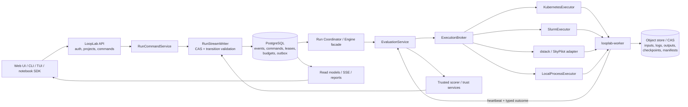
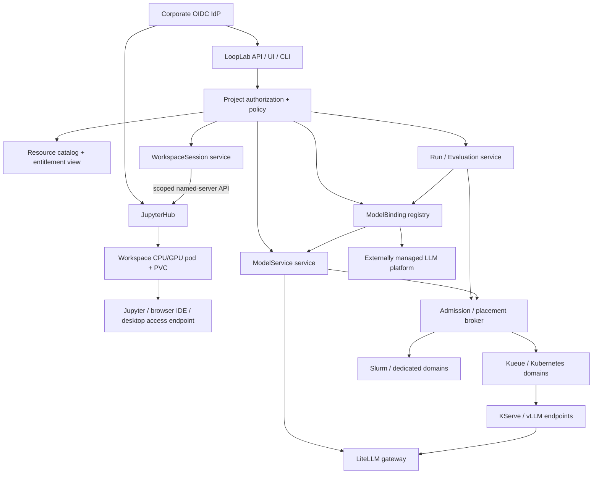
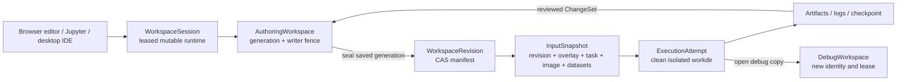
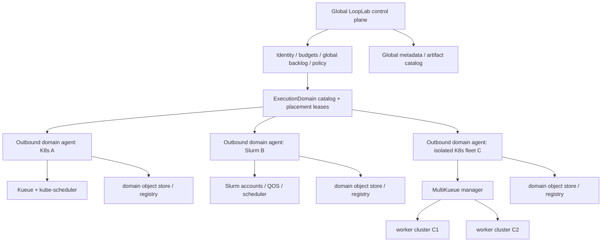

# LoopLab as a Unified DS Workspace and Distributed Execution Plane (2026-07-12)

> Architecture research and proposed target for taking LoopLab from a local research engine to one
> user-facing workspace that can execute locally, on Kubernetes GPU nodes, and on dedicated GPU
> servers, consume managed or externally operated LLMs, and open experiment-linked IDE sessions.

| Metadata | Value |
|---|---|
| **Status** | current research / proposed distributed-execution direction |
| **As of code commit** | `13579ca9b0c2a7fd5c1f6d94fbe9414ef9aa235a` |
| **Normative for** | terminology, option analysis, proposed target architecture, multi-user resource operating model, external-model boundary, experiment-workspace linkage, and promotion gates for distributed execution |
| **Not normative for** | shipped behavior or permission to bypass doc 17's stabilization order |
| **Depends on** | [doc 17](17-project-review-and-directions-2026-07-11.md), especially its remote-worker prerequisite row |
| **Supersedes** | nothing |
| **Superseded by** | — |
| **Research verified** | 2026-07-12 |

**Companion documents:** [doc 16](16-architecture-code-review-2026-07-11.md) is the current
finding ledger; [doc 17](17-project-review-and-directions-2026-07-11.md) remains the canonical
priority and release-gate plan; [doc 19](19-ide-integration-and-remote-development-2026-07-12.md)
covers IDE and remote-workspace access; [architecture](02-architecture.md) and
[file layout](04-file-layout.md) describe the original design; [deployment](guide/deployment.md)
describes the shipped local, Compose, and JupyterHub modes.

**Evidence discipline.** Statements about LoopLab are code-confirmed against the commit above.
Statements about external systems use official project, vendor, or upstream documentation. Proposed
LoopLab interfaces, stack choices, and sequencing are recommendations, not capabilities claimed by
those sources. Versions and feature maturity are time-sensitive; the architecture deliberately hides
backend CRDs and scheduler details behind stable LoopLab contracts.

---

## 1. Executive decision

LoopLab should become the **user-facing control plane and system of record**, not another thin UI
over Kubernetes, Slurm, Ray, or a workflow product. A data scientist should create a project, select
a named compute profile, start or steer a run, inspect logs and metrics, compare candidates, and
retrieve artifacts through the same LoopLab API/UI/CLI regardless of where execution happens.

The recommended target is:

1. **One logical multi-user LoopLab service and domain model.** Local CLI, web UI, TUI, notebooks,
   JupyterHub, and a future Python SDK call the same versioned APIs. “One server” means one logical
   authority and URL, not one fragile process: production may run several stateless API replicas over
   one authoritative database/outbox. Kubernetes objects and Slurm job IDs remain backend details.
2. **Evaluation-level remote execution.** Keep the search coordinator and authoritative writer
   separate from GPU workers. Dispatch an immutable `EvaluationRequest` and accept a typed,
   manifest-bound `EvaluationOutcome`. Do not move the mutable run directory between machines.
3. **PostgreSQL plus object storage in distributed mode.** A server-owned writer commits commands,
   events, leases, budget reservations, and an outbox transactionally. S3-compatible storage holds
   immutable input snapshots, log chunks, checkpoints, predictions, and artifact manifests.
   Local mode retains the current file implementation behind the same interfaces.
4. **Kubernetes default:** NVIDIA GPU Operator + full-GPU device-plugin resources, Kubernetes Jobs,
   Kueue for admission/quotas/fair sharing, and the normal kube-scheduler for placement. Add
   Kubeflow TrainJob/JobSet for true multi-node training and RayJob only for Ray-native workloads.
5. **Dedicated-server default:** use existing Slurm where it exists or where multi-user governance,
   accounting, topology, and serious multi-node training are required. For a small trusted fleet,
   dstack is a faster first backend than building a private Slurm-like scheduler. Raw SSH is a
   prototype transport only.
6. **Exclusive GPU by default.** Use MIG on separately managed node pools when smaller hardware-
   isolated slices are valuable. Restrict time-slicing/MPS to explicitly named trusted development
   profiles after measurement; neither is the safe default for generated training code.
7. **Scale search breadth before training width.** LoopLab normally gains more from several
   independent one-GPU candidate evaluations than from making one candidate span several GPUs.
   Add same-node multi-GPU next, then multi-node only for workloads that demonstrably need it.
8. **Do not start with a remote fleet.** Doc 17's prerequisite remains binding: first ship
   `EvaluationRef`/CAS, manifests, artifact freshness, a budget ledger, supervisor/process-resource-
   log bounds, fencing, and the `EvaluationService` slice of R4; then prove one remote worker under
   duplicate and late delivery. This does not make all post-stabilization R4 refactoring a release
   gate.
9. **One admission plane, not necessarily one submission UI.** LoopLab, JupyterHub, direct Slurm
   users, communal model services, and other tools may all be front doors, but every physical GPU
   allocation must enter a scheduler/accounting plane that sees the whole pool. If unmanaged jobs
   bypass it, LoopLab cannot promise global fairness, priority, availability, or utilization.
10. **Separate interactive, autonomous, and serving resources.** A `WorkspaceSession`, a durable
    `Run`/`Evaluation`, and a long-lived `ModelService` share identity, policy, and accounting, but
    have different lifecycle, latency SLO, preemption, and scale-down semantics.
11. **Use entitlements with borrowing, not static partitioning by default.** Teams receive nominal
    guaranteed quota and may borrow idle quota from a cohort; dedicated GPUs/nodes remain an explicit
    exception for isolation, contractual guarantees, or non-preemptible services.
12. **Optimize useful GPU work under SLO and fairness constraints, not a literal 100% gauge.** Keep a
    bounded backlog of ready autonomous evaluations and a low-priority checkpointable filler class,
    while measuring service headroom, fragmentation, staging, failures, and accelerator work.
13. **Distinguish managed and external LLMs.** `ModelService` is desired state only when LoopLab can
    control serving lifecycle. An externally operated LLM is an `ExternalModelEndpoint` consumed
    through a versioned `ModelBinding`; its replicas and GPUs are not LoopLab capacity, and LoopLab
    cannot scale, drain, preempt, or repair it.
14. **Attach IDEs to authoring state, not canonical execution.** A browser or desktop IDE opens a
    leased `WorkspaceSession` derived from a Project, Run, Node, or failed attempt. A detached Run
    starts only from a sealed content-addressed `WorkspaceRevision`; later edits and interactive
    debugging cannot silently change an accepted `ExecutionAttempt`.

The fastest credible product route is therefore **not** “replace `SubprocessSandbox` with a K8s
Job.” It is “make evaluation a portable, durable domain operation; keep local execution as its first
backend; then add schedulers.”

---

## 2. What “distributed” means

Four execution shapes are often conflated. LoopLab must name them separately because their
scheduling and failure semantics differ.

| Mode | Example | Scheduler unit | Coordination needed | Recommended order |
|---|---|---|---|---|
| **Local** | one candidate on the DS laptop/server | process or local container | local timeout/cancel | preserve first |
| **Distributed search breadth** | eight independent candidates on eight GPUs | one Evaluation per GPU allocation | queue, budget, result ordering | **first scale target** |
| **Single-node multi-GPU** | one candidate uses 4 GPUs in one server | one allocation requesting 4 GPUs | local launcher such as `torchrun` | second |
| **Multi-node training** | one candidate uses 2 nodes × 8 GPUs | gang/workload allocation | rendezvous, peer network, coordinated cancel/retry/checkpoint | last |

An allocation does not make arbitrary training code distributed. The candidate must support DDP,
DeepSpeed, MPI, Ray, or another launcher. LoopLab can provide the topology and launcher environment,
but it must never silently turn an ordinary Python command into correct distributed training.

For search breadth, asynchronous completion also changes the search algorithm. The engine must
either evaluate in explicit waves and commit in deterministic node order, or record the completion
order as authoritative decisions so replay reproduces the observed run. “The cluster happened to
finish B before A” must not become invisible state.

### 2.1 Unified workspace is broader than a run launcher

A useful DS entry point has three distinct managed compute types plus an external dependency type.
The names below are proposed doc-20 terms, not currently shipped domain objects:

- a **WorkspaceSession**: an interactive Jupyter/VS Code/shell environment with a bounded lifetime;
- a **Run**: durable autonomous work that survives browser, notebook, and submitter disconnects;
- a **ModelService**: a long-lived shared inference endpoint with an availability/latency objective,
  minimum and maximum replicas, routing identity, and separately accounted request usage;
- an **ExternalModelEndpoint** plus project-scoped **ModelBinding**: a contract for calling an LLM
  whose deployment, GPU allocation, autoscaling, routing, rollout, and incident response belong to
  another system. It consumes no LoopLab compute profile.

The first distributed milestone only needs durable Runs. Existing JupyterHub integration can remain
a delivery shell and later link to the remote-development providers evaluated in
[doc 19](19-ide-integration-and-remote-development-2026-07-12.md), which remains authoritative for
editor/transport, performance, security, and licensing choices. In a shared distributed deployment,
a notebook pod must call the central LoopLab API; it must not own the central event log or retain a
GPU merely because the UI is open. Local/single-user mode may remain in-pod and file-backed behind
the same client API.

The normal DS flow becomes: explore in a CPU notebook or IDE, seal the saved workspace generation,
detach durable training/evaluation to a Run, release the notebook GPU lease, and consume managed or
external models through a stable binding. A notebook may still request one or more GPUs for
genuinely interactive work, but it is not the durable owner of an overnight campaign.

The target project page should eventually unify:

- task and immutable input revision;
- environment/image revision;
- datasets and secret references;
- compute profile and queue;
- live and historical runs;
- candidate lineage, metrics, logs, cost, and artifacts;
- notebook/IDE links, workspace generation, last sealed revision, and debug-copy actions where a
  session provider exists;
- authorized model targets with explicit `managed` or `external` ownership and observed health.

### 2.2 Workload classes are products, not just Pod shapes

The shared platform must classify intent before mapping it to infrastructure:

| Product object | Typical duration | User expectation | Scheduler concern | Correct owner |
|---|---:|---|---|---|
| CPU `WorkspaceSession` | minutes–days | starts quickly; files persist | packing, culling, CPU/RAM quota | JupyterHub/provider lifecycle, LoopLab authorization/catalog |
| GPU `WorkspaceSession` | minutes–hours | bounded interactive latency | scarce lease, idle/absolute TTL, possible preemption | workspace provider plus shared admission |
| `Evaluation` | minutes–hours | durable, retryable, no browser dependency | queue, budget, fair share, artifact/result fencing | LoopLab plus batch scheduler |
| multi-node `Evaluation` | hours–days | coordinated allocation | topology, all-pods readiness/gang, checkpoint | LoopLab plus distributed-job scheduler |
| communal `ModelService` | days–months | stable endpoint and SLO | protected floor, elastic burst, model cold start | LoopLab serving intent plus serving controller |
| external model binding | per-call dependency | authorized route and provider contract | RPM/TPM/concurrency, outage, model drift; no LoopLab GPU admission | external model platform plus LoopLab invocation policy |
| opportunistic filler | bounded by checkpoint interval | no start-time promise | reclaim idle capacity safely | LoopLab backlog plus lowest-priority queue |

Resource selection therefore uses admin-defined profiles such as `notebook-cpu-small`,
`notebook-1xl40s-interactive`, `eval-2xa100`, or `service-4xh100-slo`, not arbitrary raw scheduler
flags. The same “two GPUs” request means different things for an interactive lease, one same-node
evaluation, and a two-replica inference service; the API must retain that intent.

---

## 3. Current LoopLab: strong entry surface, local execution plane

LoopLab already has most of the user-facing shell:

- the `looplab` console entry points lead to one Typer application (`pyproject.toml:45-53`);
- the FastAPI server exposes the web control/read plane and launches Engine subprocesses
  (`looplab/serve/server.py:1-7`, `looplab/serve/engine_proc.py:121-151`);
- the TUI can be a thin client of a remote server (`looplab/cli/ui_cmds.py:67-84`);
- run state, SSE, reports, artifacts, projects, controls, and assistant surfaces already exist.

The execution and state assumptions are nevertheless single-machine:

| Current behavior | Evidence | Distributed consequence |
|---|---|---|
| `max_parallel > 1` uses an AnyIO task group and local `CapacityLimiter` | `looplab/engine/orchestrator.py:963-998` | this is local concurrency, not a worker pool |
| `_evaluate` calls synchronous evaluation in a worker thread | `looplab/engine/evaluate.py:42-142` | cancellation and result delivery are process-local |
| classic evaluation calls local `Sandbox.run(code, workdir, …)` | `looplab/runtime/sandbox.py:120-123`, `looplab/engine/eval_dispatch.py:113-200` | the contract has no manifest, resources, image digest, lease, or artifact identity |
| repo evaluation is a separate local command-eval path | `looplab/engine/eval_dispatch.py:127-176` | a remote `Sandbox` alone would miss a major execution path |
| host grading reads the local workdir after either path | `looplab/engine/eval_dispatch.py:195-201` | trusted scoring and candidate execution must be separated explicitly |
| workspace construction copies/symlinks host paths | `looplab/engine/workspace.py:125-230` | another host cannot reproduce it without a portable input snapshot |
| Docker sandbox is local and does not allocate GPU/CDI resources | `looplab/runtime/sandbox.py:408-471` | untrusted/container mode is not a distributed GPU backend |
| GPU support is best-effort `nvidia-smi` inventory and prompt context | `looplab/core/hardware.py:20-104` | there is no reservation, device pinning, queue, or admission |
| UI liveness probes a local `engine.lock` | `looplab/serve/engine_proc.py:28-72`, `looplab/serve/appstate.py` | remote liveness needs durable leases and scheduler reconciliation |
| state is read from a local `events.jsonl` | `looplab/serve/appstate.py:81-110` | workers cannot safely share or append this file |
| deployment warns against S3/geesefs FUSE for the run root | `docs/guide/deployment.md:90` | a shared mutable filesystem is not the migration path |

There is also a semantic mismatch worth fixing before a shared cluster: current prompt guidance says
to use all available GPUs. In distributed mode the correct rule is **use all GPUs allocated to the
attempt**. Kubernetes, Slurm, dstack, and Ray normally express that allocation through visible-device
environment or device mounts; candidate code must not discover and seize devices outside it.

### 3.1 Current data-model vocabulary

The product already uses “experiment” for more than one thing. The distributed API should use these
precise names:

| Name | Meaning |
|---|---|
| `Run` | a logical user-visible search/run name |
| `RunInstance` | the immutable globally unique execution identity; preserved by resume and replaced by whole-run reset |
| `Node` | a candidate in the search DAG; the UI often calls this an experiment |
| `Trial` | one point inside a node's intra-process sweep; not automatically a scheduler job |
| `NodeAttempt` | one incarnation of a node across reset/repair semantics |
| `Evaluation` | a logical measurement request for a node, seed, fidelity, and evaluator |
| `ExecutionAttempt` | one physical try on an execution backend; retries get distinct identities |
| backend job | a Kubernetes/Slurm/dstack/Ray handle, never the LoopLab identity |

Doc 17 already proposes `RunInstanceId`, `SearchEpoch`, `NodeAttemptRef`,
`EvaluationRef`, `RequestRef`, and `ArtifactManifest`. Distributed execution should consume those
contracts rather than inventing parallel IDs.

---

## 4. Target architecture

### 4.1 Control, orchestration, execution, and data are separate planes



Responsibilities:

- **LoopLab API/control plane** owns identity, authorization, project policy, user-visible status,
  and the public contract.
- **Run coordinator** owns adaptive search and proposal ordering. It asks for evaluation; it does
  not choose a physical GPU.
- **EvaluationService** owns evaluation state, trusted scoring, retry classification, cancellation,
  result acceptance, and settlement.
- **ExecutionBackend** translates a portable request into a backend job and reconciles external
  state. It is a port, not a source of truth.
- **Backend scheduler** owns physical resource admission and placement.
- **Worker** executes one immutable attempt and uploads results. It never appends authoritative run
  events or receives database credentials.
- **Object store** carries bytes. The event store carries identities, decisions, small outcomes, and
  immutable references—not model weights or complete logs.

### 4.2 Why evaluation-level dispatch is the target

Three placement shapes were considered:

| Shape | Benefits | Costs | Use |
|---|---|---|---|
| **Whole Run as one remote job** | easiest lift-and-shift; preserves current Engine internals; warm local cache | GPU stays reserved during LLM/research/control work; weak steering and failover; coarse retries; hard to mix resource shapes | disposable discovery prototype only |
| **One remote job per Evaluation** | high GPU utilization; queue/fairness per attempt; supports heterogeneous and multi-node evaluations; clear failure accounting | requires manifests, artifact transport, durable attempts, and evaluator extraction | **product target** |
| **Warm per-run execution session** | lower startup latency and cache reuse | idle resource retention, leases, stateful recovery, fairness complexity | later optimization after measurements |

A whole-run prototype can validate container images and cluster access, but importing its remote
`events.jsonl` after completion is not a basis for live, shared operation. The production seam is
`EvaluationService`, not `RemoteSandbox`.

### 4.3 Portable contracts

The public request should be backend-neutral. Backend-specific escape hatches remain admin-owned and
versioned.

```yaml
evaluation:
  ref:
    run_instance_id: 01J...
    search_epoch: 3
    node_id: 17
    node_attempt_id: 2
    evaluation_id: 01J...
  idempotency_key: sha256:...
  evaluator: primary
  seed: 42
  fidelity: full

input:
  snapshot_uri: s3://looplab-cas/sha256/...
  snapshot_digest: sha256:...
  dataset_refs:
    - uri: s3://datasets/customer-v4/
      digest: sha256:...
      access: read
  image: registry.example/looplab-worker@sha256:...
  secret_refs: [hf-read-token]

resources:
  cpu: "8"
  memory: 64Gi
  ephemeral_storage: 100Gi
  accelerator:
    class: h100-80gb
    count_per_node: 1
    sharing: exclusive
  nodes: 1
  topology: single-node
  preemptible: false

launcher:
  kind: process        # process | torchrun | deepspeed | mpi | ray
  command: [python, train.py]
  processes_per_node: 1

policy:
  queue: research
  deadline_seconds: 7200
  network: denied
  output_allowlist: [predictions.parquet, metrics.json, checkpoints/**]
```

The result carries:

- the exact `EvaluationRef`, physical attempt ID, lease/fencing token, and backend job identity;
- terminal status and a classified failure (`candidate`, `infrastructure`, `preempted`,
  `cancelled`, `policy`, `unknown`);
- exit, timing, resource usage, and backend-observed GPU seconds;
- bounded live-log cursor plus final log object references;
- output and artifact manifest with path, digest, size, media/role, and producer identity;
- environment/image/driver/runtime identity;
- candidate-reported metrics as untrusted evidence;
- trusted score/trust evidence only when produced by the corresponding trusted service.

`ResourceRequest` should express constraints and capabilities, not Kubernetes field names:
`accelerator.class=h100-80gb` may map to a Kueue `ResourceFlavor` and
`nvidia.com/gpu`, a Slurm GRES type, or a dstack GPU selector. The profile registry rejects a
request when a backend cannot provide a required capability; it must not silently weaken
`exclusive` to `shared` or `required topology` to “best effort.”

### 4.4 Server-owned state and object storage

Distributed mode should use PostgreSQL for the authoritative command/event stream, expected-revision
append, leases, budget reservation/settlement, and a transactional outbox. A new message broker is
not required for the first scale target; a reconciler can claim outbox rows and call schedulers
at-least-once. Redis/NATS/Kafka may later carry notifications, but none should become a second source
of truth.

Local mode can keep JSONL and local artifacts behind `RunStore` and `ArtifactStore` interfaces.
JSONL can remain a human-readable export/projection of a distributed run. A remote worker must never
mount and append a shared `events.jsonl` on NFS, FUSE, or object storage.

The control-plane substrate options are deliberately separated:

| Substrate | Benefit | Decision / trade-off |
|---|---|---|
| PostgreSQL + transactional outbox/reconciler | one transaction for command, event, lease, budget, and pending effect; works across every backend | **recommended initial distributed spine** |
| LoopLabRun Kubernetes CRD/operator | native Kubernetes reconciliation and `kubectl` visibility | makes Kubernetes the domain database and does not cover local/Slurm/dstack uniformly |
| Temporal/another durable workflow engine | durable timers, retries, and signals | large deterministic-workflow migration; still needs GPU schedulers and would duplicate/migrate the current event spine |
| Celery/Redis or another task queue | simple work delivery | no GPU admission, gang semantics, domain CAS, or sufficient source-of-truth guarantees |
| Argo/Kubeflow Pipelines | strong declared DAG execution | the adaptive search graph is discovered at runtime and already owned by LoopLab |

A Kubernetes CRD may still be a backend-owned projection/handle, but it must not become the only
representation of a LoopLab Run.

Artifact publication is two-phase:

1. upload into an attempt-scoped temporary prefix;
2. upload an immutable manifest last;
3. verify digests and the active fence;
4. atomically accept the manifest reference in the domain stream.

A callback lost after upload is recoverable by reconciliation. A stale result may be retained for
diagnostics and its incurred compute must be settled, but it cannot mutate fitness, promotion, or
current attempt state.

### 4.5 Keep private scoring outside candidate workers

The current host grader deliberately overrides self-reported metrics. Remote execution must preserve
that trust boundary:

1. candidate worker receives only allowed train/public-eval inputs;
2. it uploads predictions and declared artifacts;
3. a trusted scoring service with separate identity reads private labels;
4. only the scorer emits authoritative metric/trust evidence.

Use scoped workload identity or short-lived signed URLs. Candidate pods receive neither object-store
list/delete rights nor private-label credentials. A metric printed by the job remains untrusted input.

### 4.6 Add identity, tenancy, and resource policy before shared mode

The distributed control plane needs a canonical principal `(issuer, subject)` from OIDC; username
and email are display attributes, not durable identity. The containment hierarchy is
`Organization -> Team -> Project -> Run/WorkspaceSession/ModelService/ModelBinding`. Every mutable
or readable object has one owning project, and cross-project access is an explicit grant. Shared
`ExternalModelEndpoint` registrations may be platform-owned, but every consuming Project receives
an explicit ModelBinding rather than ambient access.

LoopLab authorizes the human action and records `submitted_by`, effective project, policy revision,
and any administrator override. A worker receives a workload identity and attempt-scoped
credentials, never the human bearer token. JupyterHub RBAC, Kubernetes RBAC/ResourceQuota, Kueue,
and Slurm associations remain defense-in-depth and capacity enforcement; none replaces LoopLab's
object authorization. This shared mode remains blocked on doc 17's R5 gate.

### 4.7 Normalize every capacity request

`EvaluationRequest`, `WorkspaceSession`, and `ModelService` should embed or reference one versioned
`ComputeRequest`:

```yaml
subject:
  team: vision
  project: anomaly-research
workload_class: batch        # interactive | batch | service
compute_profile: h100-80gb-1
priority_class: normal
preemptible: true
max_duration: 4h
expected_duration: 25m
checkpoint:
  supported: true
  interval: 5m
service_slo: null
```

Keep four dimensions independent: long-term team entitlement, this workload's urgency, whether it
can be preempted safely, and physical Pod/job priority. A high-priority team usually needs a larger
fair-share weight or nominal quota; it does not automatically need permission for every job to evict
other users.

An `ExternalModelEndpoint` and `ModelBinding` do **not** contain a `ComputeRequest`: they describe an
authorized external API dependency. Their rate/token budgets and health observations belong to a
model-access plane, not the GPU admission queue.

---

## 5. Kubernetes with GPU nodes

### 5.1 Recommended baseline stack

| Layer | Baseline | Reason |
|---|---|---|
| GPU node lifecycle | NVIDIA GPU Operator | coordinates driver, container toolkit, device plugin, GPU labels, DCGM exporter, and MIG manager |
| GPU allocation | NVIDIA Device Plugin extended resources | mature, integer, exclusive-by-default path across a broad Kubernetes range |
| Admission and tenancy | Kueue | queues, quotas, flavors, cohorts, fair sharing, priority/preemption, topology-aware admission |
| Pod placement | normal kube-scheduler | Kueue intentionally does not replace node placement |
| One-node work | Kubernetes Job | smallest durable workload primitive |
| Generic multi-pod work | JobSet, behind an adapter | coordinated Jobs, stable coordinator endpoint, policies |
| Framework training | Kubeflow TrainJob v2, preview adapter | managed `torchrun`/DeepSpeed/MPI/JAX runtime templates |
| Ray-native work | KubeRay RayJob, optional | cluster lifecycle plus Ray job submission/cleanup |
| Data/ETL | SparkApplication, optional | only where a task is genuinely Spark-native |

This is an **NVIDIA-first operational baseline**, not a vendor lock in the LoopLab contract. It
matches the current `nvidia-smi` inventory path and the stated cluster scenario. An AMD pool can map
the same vendor-neutral compute profile to AMD GPU Operator/device-plugin resources after a separate
conformance run. As of AMD GPU Operator 1.5.0, its Device Plugin and DRA paths are alternative
install modes; do not enable both for the same managed devices
([AMD GPU Operator 1.5.0](https://github.com/ROCm/gpu-operator/releases/tag/gpu-operator-charts-v1.5.0)).

The [GPU Operator 26.3](https://docs.nvidia.com/datacenter/cloud-native/gpu-operator/26.3/)
automates the NVIDIA software stack, including GPU Feature Discovery and DCGM monitoring.
Kubernetes device plugins advertise devices as extended resources such as
`nvidia.com/gpu`; extended resources are integer and cannot be overcommitted
([Kubernetes device plugins](https://kubernetes.io/docs/concepts/extend-kubernetes/compute-storage-net/device-plugins/),
[GPU scheduling](https://kubernetes.io/docs/tasks/manage-gpus/scheduling-gpus/)).

The first LoopLab Kubernetes executor should create **one Job per Evaluation**, set a stable
evaluation/attempt label, request a full GPU in limits, use an immutable image digest, stage inputs
into ephemeral scratch, upload through the worker, and set an owner/TTL cleanup policy. Adaptive
search should not use one giant Indexed Job; Indexed Jobs are useful for a fixed seed/rung batch,
but LoopLab normally discovers the next candidate from preceding results.

### 5.2 Mapping the four compute modes

| LoopLab mode | Kubernetes representation |
|---|---|
| independent one-GPU evaluations | N separate Jobs, each requesting one GPU and independently admitted |
| one evaluation on N GPUs of one node | one Job/Pod requesting N GPUs; `torchrun --standalone --nproc-per-node=N` when supported |
| one evaluation on N nodes | TrainJob or JobSet, with topology-aware admission and a bounded all-pods-ready policy; strict scheduler-level gang only in a supporting profile |
| Ray-native evaluation | one RayJob; Kueue owns admission, Ray owns tasks inside admitted pods |

For single-node multi-GPU, a Pod asking for four GPUs necessarily gets them from one node. For
multi-node work, multiple Pods need an operator/controller, rendezvous, and all-or-nothing readiness.
PyTorch's `torchrun` starts one process per GPU for both single-node and multi-node execution
([official `torchrun` documentation](https://docs.pytorch.org/docs/stable/elastic/run.html)).

The default scheduling policy should prefer independent one-GPU evaluations when the workload can
fit. Multi-GPU profiles require measured speedup or model-memory need; otherwise they reduce search
breadth and increase queue fragmentation.

Kueue topology handles admission across nodes/domains; strict NUMA/CPU/device alignment inside one
node remains a kubelet [Topology Manager](https://kubernetes.io/docs/tasks/administer-cluster/topology-manager/)
concern. A strict node policy can still reject a Pod after the scheduler selected that node, so this
failure must be surfaced as infrastructure placement, not as a candidate-code failure. Kueue
admission plus `WaitForPodsReady` is not atomic scheduler-level gang placement; use a validated
Volcano profile when that stronger property is required. Native Kubernetes gang scheduling is
still an alpha, disabled-by-default option in Kubernetes 1.36
([Kubernetes gang scheduling](https://kubernetes.io/docs/concepts/scheduling-eviction/gang-scheduling/)).

### 5.3 Full GPU, MIG, time-slicing, MPS, and DRA

| Mode | Isolation and semantics | LoopLab policy |
|---|---|---|
| **Full GPU** | exclusive device allocation with the clearest accounting and failure boundary | default for training and generated code |
| **MIG** | hardware partitions with memory and fault isolation on supported GPUs | fixed-profile node pools; production-capable after workload benchmarks |
| **Time-slicing** | oversubscribed access; no memory or fault isolation; replica count is not a proportional compute guarantee | named trusted-dev profile only; never silently substitute |
| **MPS** | experimental concurrent CUDA-process sharing in the NVIDIA device plugin; incompatible with MIG in that implementation | trusted opt-in benchmark only, not baseline |
| **NVIDIA DRA** | richer claim/attribute model and future device sharing/configuration | isolated canary pool; capability-detect, do not require initially |

NVIDIA documents the distinction directly: MIG partitions provide hardware-level memory/fault
isolation, whereas time-sliced replicas share memory and fault domain; requesting multiple
time-sliced replicas does not guarantee more compute
([MIG](https://docs.nvidia.com/datacenter/cloud-native/gpu-operator/26.3/gpu-operator-mig.html),
[GPU sharing](https://docs.nvidia.com/datacenter/cloud-native/gpu-operator/26.3/gpu-sharing.html)).
Changing MIG geometry disrupts workloads and can require node drain or reboot, so do not repartition
per run. Maintain pools such as `gpu-exclusive`, `gpu-mig-1g`, and `gpu-shared-dev` with
taints, immutable labels, and separate Kueue flavors.

Core Dynamic Resource Allocation has been GA since Kubernetes 1.34; partitionable devices and
consumable capacity are beta/default in 1.36. That does not make it the baseline GPU allocator:
the kube-scheduler does not preempt DRA resources, and Kueue has important DRA limitations
([Kubernetes DRA](https://kubernetes.io/docs/concepts/scheduling-eviction/dynamic-resource-allocation/)).
More decisively, NVIDIA DRA Driver 0.4.1 officially supports `ComputeDomain`, while ordinary GPU
allocation is not yet officially supported and its GPU kubelet plugin is disabled by default
([NVIDIA DRA driver](https://github.com/kubernetes-sigs/dra-driver-nvidia-gpu)). DRA allocation of a
GPU replaces the traditional device-plugin allocation for that GPU; a ComputeDomain-only install
can coexist with the standard Device Plugin
([NVIDIA 26.3 DRA installation](https://docs.nvidia.com/datacenter/cloud-native/gpu-operator/26.3/dra-intro-install.html)).
Therefore LoopLab should keep a vendor-neutral resource contract, use full-GPU extended resources
initially, and map an admin profile to DRA only in a version-pinned canary.

### 5.4 Kueue versus Volcano

[Kueue](https://kueue.sigs.k8s.io/docs/overview/) is the recommended default. It is an admission
and quota system placed over existing Jobs/controllers, not a replacement for the kube-scheduler.
Its `ClusterQueue`, `LocalQueue`, `ResourceFlavor`, cohorts, fair sharing, and preemption model map
well to LoopLab projects and named GPU profiles
([ClusterQueue](https://kueue.sigs.k8s.io/docs/concepts/cluster_queue/),
[ResourceFlavor](https://kueue.sigs.k8s.io/docs/concepts/resource_flavor/),
[admission fair sharing](https://kueue.sigs.k8s.io/docs/concepts/admission_fair_sharing/)).
Topology-Aware Scheduling can keep a multi-pod workload inside a required rack/zone/host domain
([Kueue TAS](https://kueue.sigs.k8s.io/docs/concepts/topology_aware_scheduling/)).
Quota admission is not proof that every Pod has started. Use `WaitForPodsReady`, bounded admission/
startup timeouts, and explicit requeue diagnostics for the admission-to-placement gap.

The verified snapshot is Kueue 0.18.3: Admission Fair Sharing, TAS, and MultiKueue are beta. Its DRA
`ResourceClaimTemplate` path is beta, while extended-resource discovery and counter quota are alpha;
DRA cannot currently be combined safely with TAS accounting, and Kueue does not support DRA-based
GPU time-slicing or MPS
([Kueue 0.18.3](https://github.com/kubernetes-sigs/kueue/releases/tag/v0.18.3),
[Kueue DRA limitations](https://kueue.sigs.k8s.io/docs/concepts/dynamic_resource_allocation/)).

[Volcano](https://volcano.sh/docs/scheduler/plugins/gang/) is a full batch scheduler with explicit
gang semantics, DRF/capacity queues, binpacking, reclaim, and scheduler-level policy. Choose it when
the platform already operates Volcano or when strict gang/device/topology policy is a proven
requirement that the Kueue + normal scheduler configuration cannot satisfy.
The verified Volcano 1.15.0 release advertises Kubernetes 1.35 compatibility; any Kubernetes 1.36
deployment needs a separate compatibility gate rather than assuming support
([Volcano 1.15.0](https://github.com/volcano-sh/volcano/releases/tag/v1.15.0)).

Do not place one workload under competing Kueue and Volcano queue/preemption owners. Similarly, do
not mix NVIDIA sharing and another vGPU manager on the same physical GPUs without separately owned
node pools. The stable LoopLab API should make a Kueue-to-Volcano change an admin profile change,
not a task rewrite.

### 5.5 Job, JobSet, Trainer, Ray, and workflow engines

| Tool | Correct role | Why it is not the universal LoopLab backend |
|---|---|---|
| Kubernetes Job | one finite process/pod | no native multi-node training topology |
| JobSet | generic coordinated set of Jobs | v0.12.0 still exposes `v1alpha2`; API maturity must be hidden and the launcher remains LoopLab/site responsibility |
| Kubeflow Trainer v2 | framework-aware multi-node training | v2.2.1 is officially alpha; extra operator is unnecessary for one-node jobs |
| RayJob/KubeRay | Ray applications and elastic Python work | creates a second internal scheduler/accounting layer |
| SparkApplication | static distributed ETL/SQL | Kueue integration is alpha and does not support Spark dynamic allocation; irrelevant for ordinary candidate training |
| Argo Workflows/Kubeflow Pipelines | outer DAG/pipeline integration | LoopLab's search is adaptive and event-driven, not a precompiled DAG |

[JobSet](https://jobset.sigs.k8s.io/docs/concepts/) supplies replicated Jobs, a coordinator
endpoint, startup and success/failure policies. [Kubeflow Trainer](https://www.kubeflow.org/docs/components/trainer/overview/)
adds TrainJob and admin-managed runtime templates for PyTorch, DeepSpeed, MPI, JAX, and other
frameworks. It is the preferred preview adapter for true distributed training rather than
hand-generating framework-specific Pods.

The as-of implementation snapshot is JobSet 0.12.0, Trainer 2.2.1, and KubeRay 1.6.2. Pin and test
those APIs in an adapter; do not expose their CRD versions in LoopLab's public Run model. Treat the
Kueue SparkApplication integration as an alpha connector with static executors
([Kueue SparkApplication](https://kueue.sigs.k8s.io/docs/tasks/run/kubeflow/sparkapplications/)).

[KubeRay](https://docs.ray.io/en/latest/cluster/kubernetes/getting-started.html) should be selected
only when candidate code is Ray-native. RayJob can create a temporary RayCluster and submit/clean
the job; Kueue integrates with RayJob admission. Kubernetes schedules the pods and Ray schedules
tasks inside them, so LoopLab must reconcile both status layers and avoid double-counting resources.

Argo/Kubeflow Pipelines can invoke a LoopLab Run or consume its artifacts as an outer organizational
pipeline. They should not replace the adaptive Engine or become a second experiment truth store.
Argo is a container/DAG engine
([Argo](https://argo-workflows.readthedocs.io/en/latest/)); Kubeflow Pipelines compiles a declared
component graph into container executions
([KFP pipeline model](https://www.kubeflow.org/docs/components/pipelines/concepts/pipeline/)).

### 5.6 Kubernetes operational requirements

**Storage**

- object storage is canonical for snapshots, logs, predictions, checkpoints, and artifacts;
- `emptyDir` or ephemeral/local NVMe is attempt scratch;
- CSI/PVC is appropriate for large read caches or framework checkpoints where required;
- never place the mutable LoopLab event log on RWX/FUSE and let pods append it;
- dataset identity is a version/digest and access contract, not merely a mutable mount path.

**Networking**

- single-node workloads need no distributed control network;
- multi-node workers need peer reachability, deterministic rendezvous, coordinated firewall policy,
  and adequate MTU;
- high-performance NCCL needs validated topology, RDMA/RoCE or InfiniBand where applicable, and
  `nccl-tests` before claiming speedup;
- GPU Operator can work with NVIDIA Network Operator for GPUDirect RDMA
  ([NVIDIA GPUDirect](https://docs.nvidia.com/datacenter/cloud-native/gpu-operator/26.3/gpu-operator-rdma.html));
- one synchronous job should stay inside one low-latency cluster/domain. MultiKueue selects a worker
  cluster; it is not cross-cluster synchronous training
  ([MultiKueue](https://kueue.sigs.k8s.io/docs/concepts/multikueue/)).

**Security**

- only the LoopLab controller service account creates workload objects;
- user choices resolve through allowlisted compute profiles and image/runtime templates;
- worker service accounts get least-privilege, prefix-scoped object access and no Kubernetes create
  permission;
- generated code runs non-root with read-only base image, seccomp/AppArmor where supported, resource
  limits, output quotas, and deny-by-default egress;
- namespaces, quotas, policies, and GPU reservation are not a hostile-code security boundary.
  Shared-kernel GPU drivers materially enlarge the boundary; untrusted tenants may require dedicated
  nodes or VM-level isolation after a separate security review.

**Observability**

- export scheduler state, queue wait, image/input staging, startup, run, upload, and scoring as
  separate spans;
- map DCGM GPU metrics to LoopLab attempt labels where the allocation model supports it;
- track GPU-seconds, utilization, OOM/ECC/Xid signals, queue wait, preemption, and retry;
- time-sliced GPU attribution is weaker and must not be presented as exact per-attempt accounting.

---

## 6. Dedicated GPU servers

### 6.1 First choose whether they should become a cluster

If the servers share a reliable low-latency network and the platform team can operate Kubernetes,
adding them as GPU worker nodes gives LoopLab one Kubernetes backend. If they are an established HPC
estate, preserve Slurm. If they are a small static set owned by one trusted team, use a lightweight
GPU broker such as dstack before considering custom scheduling.

| Option | Best fit | Multi-node | Governance/isolation | Verdict |
|---|---|---|---|---|
| raw SSH/systemd | 1–2 host proof of concept | hand-built rendezvous/cleanup | no durable queue/fairness; credential and orphan risk | prototype only |
| custom LoopLab pull-agent | air-gapped or highly specialized small fleet | requires custom gang leases and rank assignment | exact product fit, but recreates scheduler correctness | do not build first |
| **dstack SSH fleets** | small/medium trusted on-prem fleet | cluster placement, rank env, whole-group retry | useful priority/blocks; limited quotas/fairness/topology | **best quick bare-metal backend** |
| **Slurm** | shared production/HPC fleet | native allocation, GRES, topology, launchers | mature accounts/QOS/fairshare/accounting/cgroups | **production default** |
| SkyPilot | multi-cloud / several Slurm, K8s, and cloud pools | portable multi-node jobs | another control plane; Slurm support evolving | strategic optional broker |
| Ray cluster | Ray-native application on trusted allocation | placement groups / Ray Train | logical scheduler, not host security or fleet governance | runtime, not core |
| Nomad | organization already operates Nomad | needs extra rendezvous/gang coordination | capable general scheduler/device plugin | integrate only if incumbent |
| ClearML/Determined | organization already standardizes on that ML platform | platform-specific | overlaps LoopLab experiment UI/control and some advanced features are commercial | connector, not default core |

### 6.2 Slurm adapter

Slurm is the strongest choice when multiple users/teams share expensive hardware. Its
[GRES model](https://slurm.schedmd.com/gres.html) allocates GPUs and sets visible devices; QOS,
accounts, fair share, quotas, preemption, accounting, topology, and cgroup device constraints solve
problems LoopLab should not reimplement.

The first adapter can use `sbatch`/`squeue`/`sacct`/`scancel` through a site-controlled submit
boundary. To preserve Slurm accounts, QOS, fair share, and accounting, submissions must carry the
authenticated user's Unix/Slurm identity or pass through a trusted site gateway that maps the
LoopLab principal under explicit policy. A shared LoopLab service account is acceptable only for a
trusted single-team pool; Slurm then sees one service identity, so its per-user governance is lost.
[`slurmrestd`](https://slurm.schedmd.com/rest.html) is a stateless REST option where the site operates
it: `rest_auth/local` is limited to a local Unix socket, while remote clients require a supported
remote authentication setup such as JWT. The backend records Slurm job ID, array task ID, restart/
requeue count, submit principal/account/QOS, and exit state as physical-attempt metadata.

Use:

- one `sbatch` per adaptive Evaluation for clear scheduling and accounting;
- a Slurm job array only for a static seed/rung batch known in advance;
- one allocation requesting all nodes/GPUs for synchronous training;
- site-standard rootless OCI, Apptainer, or Enroot/Pyxis for portability. Slurm has native
  unprivileged OCI integration, but its own guide documents runtime and networking limitations
  ([Slurm containers](https://slurm.schedmd.com/containers.html)).

A warm pilot allocation containing several LoopLab workers can reduce latency for short evaluations,
but it holds idle GPUs and can weaken fair sharing. Add it only after Job-per-Evaluation startup and
utilization measurements.

### 6.3 dstack as the small trusted-fleet shortcut

[dstack fleets](https://dstack.ai/docs/concepts/fleets/) can enroll existing Linux/Docker GPU hosts
through SSH, divide host resources into blocks, and create cluster-placed fleets.
[dstack tasks](https://dstack.ai/docs/concepts/tasks/) support GPU model/VRAM requests, multiple
nodes, rank/master environment for `torchrun`, priority, retries, logs, and an HTTP API.

That requires far less bespoke scheduler code than LoopLab writing GPU discovery, per-device
reservation, queueing, multi-node bootstrap, and retries itself. It is recommended as the first
bare-metal adapter when:

- the fleet is trusted and relatively small;
- strong Slurm-like tenancy/accounting is not required;
- Docker plus the NVIDIA runtime are acceptable;
- LoopLab remains the user-facing system and calls dstack through a backend service identity.

The limitations are important. dstack's own
[Slurm comparison](https://dstack.ai/docs/guides/migration/slurm/) documents no usage quotas,
backfill, preemption, or topology-aware scheduling; distributed tasks take exclusive blocks on
selected hosts and retry the group. dstack's security model assumes mutual trust within a project;
attach access can provide unrestricted host SSH, and privileged/Docker modes or arbitrary instance
volumes can cross a container boundary. For any shared deployment, enforce the SSH proxy with
`DSTACK_SERVER_SSHPROXY_ENFORCED=1`, apply a server policy that rejects privileged/Docker modes and
unapproved instance volumes, and use forced bridge networking for single-node untrusted jobs. Even
then, do not claim full hostile multi-tenant isolation
([dstack tenant isolation](https://dstack.ai/docs/guides/tenant-isolation/)). Use PostgreSQL for a
production dstack server
([server deployment](https://dstack.ai/docs/guides/server-deployment/)) and treat containers as a
workload packaging boundary, not a VM security boundary.

LoopLab should pass a small bootstrap plus object-store snapshot URI, not make dstack's small direct
file upload the canonical artifact protocol.

### 6.4 SkyPilot, Ray, Nomad, and direct agents

[SkyPilot](https://docs.skypilot.co/en/latest/overview.html) offers one compute interface across
Kubernetes, Slurm, cloud VMs, and existing machines, plus managed-job recovery and cost/capacity
selection. It is attractive if cloud bursting or many infrastructure pools are a product objective.
Its Slurm support is explicitly under active development and operates through
`sbatch`/`squeue`/`scancel`
([SkyPilot on Slurm](https://docs.skypilot.co/en/latest/reference/slurm/slurm-getting-started.html)).
SSH node pools require `kubectl` on the API-server host, peer access to port 6443, and machines that
are not already members of another Kubernetes cluster, so they are not the simplest “plain servers
only” path
([existing machines](https://docs.skypilot.co/en/latest/reservations/existing-machines.html)).

SkyPilot should therefore be an optional `ExecutionBackend` when cross-infrastructure optimization
is valuable, not the LoopLab domain model. Its controller retries must be surfaced as physical
attempts and charged; opaque auto-recovery cannot silently duplicate compute.

[Ray Jobs](https://docs.ray.io/en/latest/cluster/running-applications/job-submission/index.html)
provide convenient remote application submission, while
[placement groups](https://docs.ray.io/en/latest/ray-core/scheduling/placement-group.html) reserve
gang resource bundles. Use Ray inside a Slurm/Kubernetes/dstack allocation for Ray Train, Tune,
actors, or elastic data work. Do not use a permanent bare-metal Ray cluster as LoopLab's universal
queue: Ray resources are primarily logical scheduling resources, jobs depend on cluster lifetime,
and Ray introduces a second task/event/retry system.

Nomad has an NVIDIA device plugin and expressive GPU constraints
([Nomad devices](https://developer.hashicorp.com/nomad/docs/job-specification/device)), but
multi-node synchronous training still needs rendezvous and coordinated allocation semantics. Add a
Nomad backend only for an organization that already runs it.

A custom outbound-polling LoopLab agent is justified only when the fleet is air-gapped or external
control planes are prohibited. Even then it needs mTLS identity, inventory attestation, whole-GPU
leases, atomic multi-node lease, heartbeat/fencing, drain/upgrade, container lifecycle, queue
fairness, and reconciliation. That is a scheduler product, not a small transport wrapper.

---

## 7. External “single platform” alternatives

The landscape contains useful products, but replacing LoopLab with them would discard the adaptive
search/trust/event semantics that distinguish it.

| Candidate | What it can provide | Why it should integrate rather than replace LoopLab |
|---|---|---|
| JupyterHub | authenticated interactive notebook/session shell | current per-user app/process/run-root model is not a durable shared run control plane |
| full Kubeflow | notebooks, pipelines, trainer, metadata, central dashboard | heavy platform; pipeline DAG and experiment model duplicate rather than express LoopLab search |
| dstack | dev environments, GPU tasks/services across K8s/cloud/SSH fleets | valuable compute backend, but limited quotas/topology/full tenancy |
| SkyPilot | portable jobs and cloud/capacity optimization | valuable broker, but another control plane and evolving Slurm path |
| Metaflow/Flyte/Argo/KFP/Prefect | remote task/DAG orchestration | LoopLab's loop is adaptive, interactive, and event-driven; these are useful outer workflows |
| Temporal | durable workflows, retries, signals | would require a major deterministic-workflow migration and still needs a GPU scheduler |
| ClearML | experiment management plus queues/agents | useful connector or incumbent backend; overlaps LoopLab project/run/tracking ownership |
| Determined | full ML platform with its own resource manager, fair sharing/priority/preemption, and distributed training | credible incumbent/replacement decision, but adopting it transfers substantial LoopLab control-plane ownership |
| MLflow | experiment tracking and artifacts | exporter/integration, not a capacity scheduler or LoopLab control plane |
| W&B Launch | tracking plus queues, agents, and compute targets | can orchestrate launches, but still relies on underlying compute capacity/schedulers and overlaps LoopLab run ownership |

The recommended ownership boundary is:

- LoopLab owns DS intent, adaptive run state, candidate lineage, trust, budget, and user experience;
- an execution broker or scheduler owns physical capacity;
- tracking systems remain exporters/integrations;
- notebook and workflow platforms link to or invoke LoopLab through its API.

This also amends the scope of ADR-18/earlier “no external workers” reasoning. A daemon or task queue is
still unnecessary for local mode and must not become domain truth. Distributed execution, however,
requires an external effect adapter after the durable state contracts exist. A new ADR should record
that narrower change rather than silently contradicting [build decisions](05-build-decisions.md).

---

## 8. One multi-user LoopLab with JupyterHub

The intended product is one logical LoopLab service for all authorized users, teams, and service
principals. It owns projects, Runs, policy decisions, budgets, lineage, and the resource view. It may
run as several stateless API/UI replicas for availability; PostgreSQL, the transactional outbox, and
immutable object storage define the singleton authority.

JupyterHub remains a workspace provider, not a second experiment database. Existing per-user
LoopLab/Jupyter processes become clients of the central service. A notebook can disappear while its
detached Runs continue.

### 8.1 One SSO, bounded control planes



Preferred authentication uses LoopLab and JupyterHub as separate OIDC clients of the same IdP. The
browser still gets SSO, while CLI and service-to-service access do not depend on a JupyterHub cookie.
The canonical principal is `(iss, sub)`; email and username are mutable display fields. Corporate
groups can bootstrap/synchronize Team membership, but LoopLab remains authoritative for project
roles, grants, quota ownership, and policy audit.

If JupyterHub must be the only browser entry point initially, LoopLab can be registered as an
externally managed JupyterHub Service and use Hub OAuth. JupyterHub returns user, group, and scope
information to the service, and its scoped REST API can create/stop named servers
([JupyterHub services](https://jupyterhub.readthedocs.io/en/latest/reference/services.html),
[REST API](https://jupyterhub.readthedocs.io/en/stable/reference/rest-api.html)). This is a valid
deployment adapter, not a reason to reuse Hub cookies as LoopLab authorization or make the Hub
username a global identity.

Human access tokens never enter candidate workers or domain agents. LoopLab authorizes the command;
the backend uses an attempt-scoped workload identity. For Slurm, a trusted submission gateway should
preserve the mapped Unix/Slurm user when native per-user account/QOS/fair-share is required.

### 8.2 Tenant and role model

The minimum hierarchy is:

```text
Organization
  Team
    Project
      AuthoringWorkspace / WorkspaceSession / Run / ModelService / ModelBinding
      DatasetRef / SecretRef / WorkspaceRevision / Artifact
```

A Project belongs to exactly one Team and is the mandatory authorization, budget, and chargeback
scope. Cross-Team sharing is an explicit object grant. Useful roles are:

| Role | Representative authority |
|---|---|
| Platform admin | IdP integration, global policy, domain registration, break-glass controls |
| Resource/quota admin | compute profiles, queue weights/quotas, reservations, priority bands, drain |
| Team admin | membership and projects; allocate inside the Team's platform ceiling |
| Project owner | project members, budgets, datasets, service intents, ordinary priorities |
| Experimenter | create/steer Runs, request workspaces, read project artifacts |
| Run operator | cancel/retry/reprioritize within the granted ceiling; no membership or secret administration |
| Viewer | read explicitly granted project/run/report surfaces |
| Service principal | narrowly scoped automation with no interactive login |

RBAC supplies the coarse role; ABAC evaluates membership, project, compute profile, data
classification/residency, budget, priority ceiling, preemptibility, and execution domain. Priority
override is a separate permission and must carry an actor, reason, expiry, old/new value, and policy
revision. Platform administration should not silently imply permission to read private artifacts;
break-glass access is explicit and audited.

JupyterHub RBAC governs Hub users, groups, services, and servers. Kubernetes RBAC and ResourceQuota
protect namespaces. Neither replaces LoopLab's project/object decision. Doc 17's default-deny and
cross-user R5 tests are a hard shared-deployment prerequisite.

### 8.3 Workspace request and release flow

KubeSpawner can offer admin-defined `profile_list` choices and translate a profile into CPU, memory,
GPU extended-resource requests, labels, node selectors, and a `priority_class_name`
([KubeSpawner profiles](https://jupyterhub-kubespawner.readthedocs.io/en/latest/spawner.html)). The
profile list alone does not know whether the user is entitled to the profile or whether capacity is
currently admissible.

Recommended flow:

1. the user chooses a LoopLab `WorkspaceProfile`, for example CPU-small or one L40S;
2. LoopLab resolves canonical principal, Team/Project, profile permission, concurrent-session limit,
   budget, lease TTL, and priority ceiling;
3. one durable `WorkspaceSession` intent and scheduler handoff are committed;
4. the physical scheduler atomically admits the Pod; do not count a separate LoopLab “reservation”
   as physical capacity;
5. a narrowly scoped Hub service identity starts the user's named server with allowlisted
   `user_options`; raw image, node selector, toleration, queue, and priority are never user supplied;
6. LoopLab records Hub server name, immutable Pod UID, allocation, lease, and activity state;
7. idle timeout, absolute maximum age, explicit stop, budget exhaustion, or authorized preemption
   releases the allocation; persistent files survive, kernel RAM does not;
8. long-running work is converted/detached into a Run before the workspace lease ends.

Kueue's Plain Pod integration can gate an individual Jupyter Pod and account it against a queue; on
preemption that Pod is terminated and deleted
([Kueue Plain Pods](https://kueue.sigs.k8s.io/docs/tasks/run/plain_pods/)). Pilot this in dedicated
managed namespaces because a webhook scope mistake can affect unrelated Pods. A lower-risk first
deployment keeps Jupyter GPU sessions in a bounded interactive ClusterQueue/node pool, adds
KubeSpawner labels and hard ResourceQuota, and moves only detached Runs into the broad batch pool.

JupyterHub's idle culler and maximum-age controls are necessary but not a kernel checkpoint
([JupyterHub culling](https://z2jh.jupyter.org/en/4.2.0/jupyterhub/customizing/user-management.html)).
Use browser/kernel activity as the primary signal and CPU/GPU telemetry as supporting evidence;
low GPU utilization alone may mean data loading, CPU preprocessing, or checkpoint I/O. Always apply
an absolute TTL to scarce GPU sessions, even if a browser keeps reporting activity.

### 8.4 What “available resources” means in the UI

Do not display one unqualified “27 GPUs available” number. It becomes stale immediately and says
nothing about model, memory, MIG shape, GPUs per node, interconnect, quota, or eight-GPU contiguity.
Separate two records:

**ResourceCatalog** — comparatively static, admin-owned capability:

- vendor/model/memory and full-GPU/MIG profile;
- GPUs per node, NVLink/NVSwitch island, RDMA and architecture;
- runtime/driver, trust tier, region, residency, price/rate version;
- eligible Teams, workload classes, images/runtimes, and maximum request shapes.

**CapacitySnapshot** — expiring observation:

- `generation`, `observed_at`, `expires_at`, source, and health;
- physical total, allocatable/healthy, maintenance/drain, allocated, quota-reserved, and observed free;
- physically excluded reservations and expiring external/unmanaged pressure, always marked
  non-reclaimable unless an authoritative shared scheduler says otherwise;
- the user's nominal entitlement, current usage, borrowed/lent amount, and borrowable upper bound;
- pending demand and queue position by profile/class;
- requestable contiguous shapes and a start-time interval with confidence, never a promise;
- data/image/model-cache hints and reason codes when a request is currently infeasible.

Kueue exposes LocalQueue/ClusterQueue usage, pending counts, queue position and wait-time metrics
([visibility API](https://kueue.sigs.k8s.io/docs/tasks/manage/monitor_pending_workloads/pending_workloads_on_demand/),
[metrics](https://kueue.sigs.k8s.io/docs/reference/metrics/)). Slurm exposes reason codes and, with
backfill, estimated start. LoopLab normalizes and authorization-filters these views; users do not see
other tenants' identities or cluster-private node inventory.

The scheduler remains the admission oracle. A fresh “observed free: 2” snapshot can race another
request; the UI must show `requested -> queued -> quota reserved -> admitted -> running`, not turn
an estimate into a guarantee.

### 8.5 Dedicated, guaranteed, shared, and opportunistic capacity

| Product policy | User promise | Kubernetes mapping | Slurm mapping | Utilization trade-off |
|---|---|---|---|---|
| shared best effort | fair access, no minimum | shared ClusterQueue/cohort | shared partition/account | highest sharing, weakest guarantee |
| guaranteed share with borrowing | nominal Team share; burst when idle quota exists | `nominalQuota`, cohort, borrowing/lending limits, fair-share weight | account shares/QOS with fair-share | **recommended default** |
| protected logical quota | quota is not lent during a stated window/SLO | restricted `lendingLimit` | reservation/QOS/association limit | predictable, may reserve idle capacity |
| physically dedicated pool | named nodes/devices only for eligible tenant | ResourceFlavor + labels/taints, isolated root cohort/queue | dedicated partition/reservation | strongest isolation, lowest fungibility |
| opportunistic | runs only on borrowed slack; reclaimable | zero nominal quota, lowest priority | low-QOS/preemptible partition | fills holes; requires safe retry/checkpoint |

For Kueue, a root Cohort represents a physical sharing pool, hierarchical Cohorts can represent
organization/Team allocation, a ClusterQueue represents an entitlement/preemption boundary
(usually a Team), and LocalQueues represent Projects. Create a separate project ClusterQueue only
when that project truly needs a hard quota boundary. Per-user concurrent-session/run limits belong
in LoopLab admission and namespace safeguards, not thousands of ClusterQueues.

`nominalQuota` is the guarantee, `borrowingLimit` caps burst, `lendingLimit` caps how much guarantee
others may use, and fair-share weight expresses long-term relative entitlement
([ClusterQueue](https://kueue.sigs.k8s.io/docs/concepts/cluster_queue/),
[Cohort](https://kueue.sigs.k8s.io/docs/concepts/cohort/)). Setting lending to zero protects a
reservation but should be exceptional: unused protected quota is intentionally idle.

Kubernetes ResourceQuota remains a hard namespace guardrail, including extended resources and
allowed PriorityClasses; it is not a queue, fair-share algorithm, or borrowing system. Keep it
consistent with and slightly outside the Kueue policy envelope so Kueue does not admit a workload
that the API quota then rejects. Slurm maps the same product concepts to account/subaccount,
association, QOS, partition, reservation, fair-share, and TRES limits.

### 8.6 IDEs attach to authoring workspaces, not canonical execution attempts

Doc 19 remains authoritative for the editor and transport choice—embedded CodeMirror/Monaco,
JupyterLab, browser IDE, brokered Remote-SSH, Teleport, Coder, or Kubernetes Attach—and for the
associated performance, protocol-policy, licensing, and access-plane gates. This section defines the
missing domain seam: what those clients open and how edits become reproducible experiments.

A browser IDE and a desktop IDE are access surfaces over one mutable authoring context. Neither
changes the execution boundary from §4:

- an **AuthoringWorkspace** is a durable, Project-owned mutable source context and may exist with no
  running compute;
- a **WorkspaceSession** is one leased runtime incarnation of that workspace, supplied by
  JupyterHub or another authorized WorkspaceProvider;
- a **WorkspaceAccessGrant** is short-lived capability to reach that exact session/provider
  allocation;
- a **WorkspaceRevision** is a sealed, content-addressed manifest of saved source/configuration
  bytes;
- an **InputSnapshot** composes one WorkspaceRevision with the candidate overlay, immutable task and
  evaluator configuration, image/environment digest, DatasetRefs, and SecretRefs;
- an **ExecutionAttempt** materializes that snapshot into a clean attempt-scoped workdir;
- a **DebugWorkspace** is a new TTL authoring context derived from attempt evidence, never a mutation
  of the original attempt.



The association is provenance, not a shared mutable filesystem. A WorkspaceSession may disappear
without affecting a sealed revision or detached Run. Editing generation 43 after a Run captured
generation 42 cannot change that Run. A worker never mounts the writable AuthoringWorkspace as its
execution directory.

#### 8.6.1 Opening an experiment in an IDE

The Project, Run, candidate/Node, and failed-attempt pages may all offer “Open workspace”, but they
create different explicit modes:

| Mode | Materialized view | Writable target | Canonical result |
|---|---|---|---|
| workspace authoring | current Project workspace generation | private AuthoringWorkspace draft | new WorkspaceRevision and optionally a new Run baseline |
| candidate editing | sealed Run InputSnapshot plus selected parent overlays | private candidate overlay | one new child-lineage event; Project source is unchanged |
| result inspection | exact attempt manifests, logs, metrics, artifacts | read-only | no mutation |
| debug copy | exact InputSnapshot plus selected checkpoint and sanitized artifacts | new DebugWorkspace | reviewed ChangeSet or new Run; original attempt unchanged |
| live interactive process | process already launched inside the user's WorkspaceSession | that workspace only | exploratory/non-canonical until snapshotted and rerun |

“Save”, “Commit candidate”, “Snapshot workspace”, “Snapshot & Run”, and “Apply ChangeSet to
workspace” are therefore distinct actions. Concurrent clients use generation/CAS checks; a silent
last-write-wins merge is not acceptable. One active writer session per AuthoringWorkspace is the
default. Explicit collaborative editing needs its own conflict/CRDT and authorization contract.

Recommended launch flow:

1. resolve the source reference—Project generation, Run/Node, or failed attempt—and authorize all
   referenced code, data, artifact, secret, and compute scopes;
2. choose a WorkspaceProvider/domain/profile; CPU is the default, while a GPU IDE is the same scarce
   interactive lease described in §8.3;
3. materialize a private workspace and record provider allocation, immutable Pod UID or equivalent,
   writer fence, base revision, generation, and lease;
4. issue an access grant for one surface: embedded editor, JupyterLab, browser IDE, desktop IDE,
   terminal, or an allowlisted preview;
5. save changes into the versioned workspace/draft; an IDE surface is not a second GPU allocation;
6. use “Snapshot & Run” to seal the saved generation and create a detached Run;
7. release any GPU workspace lease that is no longer needed; the Run continues independently.

#### 8.6.2 Snapshot and promote are explicit state transitions

“Snapshot & Run” is idempotent and generation-bound, not a `tar` of a directory while tools are
writing it:

1. flush and version-check browser-managed dirty buffers; a desktop IDE must warn that unsaved local
   editor buffers cannot be observed and are not included;
2. obtain a short generation write barrier or fail with a conflict if a stable generation cannot be
   proven;
3. enumerate allowlisted source roots and reject path escape, unsafe symlinks, devices, sockets, and
   FIFOs;
4. exclude datasets, model weights, outputs, checkpoints, logs, caches, environments, credentials,
   mounted secrets, and ServiceAccount tokens;
5. upload file blobs to CAS and seal a normalized path/type/mode/size/digest manifest; mtime is not
   identity, and Git `HEAD` does not substitute for dirty/untracked bytes;
6. validate secrets, limits, required files, policy, and an approved EnvironmentRevision/OCI image
   digest;
7. compose the InputSnapshot and create the Run only from the sealed digest, then release the
   barrier.

A CSI VolumeSnapshot may optimize a provider-specific capture, but it does not by itself prove an
application-consistent or portable LoopLab input. The CAS manifest remains canonical across local,
Kubernetes, Slurm, and multiple domains.

Results return only through a reviewed **ChangeSet** pinned to its base WorkspaceRevision: show the
complete diff, detect current-generation drift, apply atomically or explicitly three-way merge, and
increment the workspace generation. Candidate output or a debug fix never overwrites live Project
source automatically.

#### 8.6.3 Debug by reproduction, not mutation

The normal attempt surface is logs, metrics, events, manifests, profiler output, checkpoints, and
downloadable artifacts. “Open debug copy” creates a new DebugWorkspace with the exact InputSnapshot
and image digest, selected checkpoint, sanitized artifacts, a new workload identity/allocation,
budget charge, TTL, audit record, and explicit trust/egress profile. It receives neither private
scorer labels nor the original attempt credentials. Its edits create a new WorkspaceRevision and a
new ExecutionAttempt.

Direct SSH, `exec`, Dev Containers Attach, or an ephemeral debug container inside a running
canonical attempt is disabled by default. Such access can modify code/processes/timing, reveal
attempt-scoped credentials, and make the score non-reproducible. If a separately authorized incident
workflow permits a live attach, the attempt becomes `TAINTED_BY_INTERACTIVE_DEBUG`; it cannot supply
a canonical scientific score or promotion result without a clean rerun. Kubernetes RBAC can allow
`pods/exec`, but it cannot make an arbitrary shell command semantically read-only.

#### 8.6.4 Access, resource, lifecycle, and multi-domain rules

A `WorkspaceAccessGrant` binds principal, Project, AuthoringWorkspace, session, provider/domain,
immutable Pod UID or allocation, writer fence, audience, nonce, expiry, optional client public key,
and an allowlisted capability set such as `files.read`, `files.write`, `pty`, `lsp`, `preview.port`,
`desktop.ssh`, or `desktop.attach`.

- browser surfaces use LoopLab/JupyterHub OAuth behind an identity-aware route;
- a desktop helper exchanges a one-time grant for the doc-19-approved WSS/SSH or Attach path;
- host, namespace, Pod, container, and preview port are resolved server-side; no standing kubeconfig,
  direct Pod address, unrestricted Hub token, or long-lived bearer is returned;
- credential expiry alone is insufficient: active streams close on stop/cull, user disable, grant
  revocation, Pod UID or fence change, domain drain, and absolute session expiry;
- extension hosts, LSPs, Git/indexers, watchers, access agents, and IDE sidecars receive explicit
  CPU/RAM/PID/storage-IO requests and limits; detached training should not contend in the same
  process budget;
- GPU workspaces use normal admission, Team entitlement, chargeback, idle TTL, and absolute TTL. A
  terminal command inside them consumes the workspace lease but is not a canonical Evaluation;
- preview ports are authenticated, TTL-bound, allowlisted routes—not generic access to the cluster
  network.

In a multi-domain deployment, one mutable workspace stays in one domain for the duration of its
writer lease and is never transparently live-migrated. Execution elsewhere transfers the sealed
InputSnapshot through policy-approved object storage; it does not mount the workspace PVC across a
WAN. A domain-link failure stops new grants and marks the session `REMOTE_UNKNOWN`. A second writer
can start elsewhere only after the old writer fence is conclusively expired/revoked. Hibernation
means snapshot, stop, and later recreation; it does not preserve kernel or process memory.

---

## 9. Shared GPU policy: notebooks, autonomous experiments, and communal LLMs

The target property is **work-conserving scheduling under policy constraints**: if compatible,
authorized, execution-ready demand exists, an unreserved healthy GPU should not remain idle. This is
stronger and more useful than “users can submit jobs”, but deliberately weaker than promising a
literal 100% utilization number.

There must be one physical admission owner for a pool. With the recommended Kubernetes stack,
LoopLab supplies intent and policy, Kueue owns quota/admission/preemption, and kube-scheduler owns
node placement. If strict Volcano scheduling is selected, Volcano owns those functions instead; do
not make both controllers compete over the same workloads.

### 9.1 Multiple front doors still require one admission/accounting plane

Not every workload has to be created through the LoopLab UI. A direct Slurm user, JupyterHub,
another automation system, and a service operator can coexist if they all consume accounts/queues
known to the same local scheduler. LoopLab can import their aggregate use as `external` or `system`
tenants and include it in availability and chargeback.

If 30–70% of jobs bypass both LoopLab and the shared scheduler/accounting policy, LoopLab can only
observe whatever telemetry is exposed. It cannot safely reclaim those GPUs, enforce a global Team
weight, or guarantee an ETA. Therefore the governance requirement is **one admission plane**, not
“100% of humans must click LoopLab”.

LoopLab's `BudgetLedger` and scheduler quota answer different questions:

- the scheduler decides whether physical capacity may start now;
- LoopLab decides whether the project/run may spend more GPU-seconds, money, attempts, or LLM tokens;
- observed usage is charged to project, principal, domain, flavor, workload class, and immutable
  rate/policy revision even when an outcome is stale or rejected.

### 9.2 Priority, entitlement, and preemptibility policy

Priority is not quota. A Team with greater organizational importance normally receives a larger
nominal entitlement or fair-share weight. A temporary urgent job receives a higher admission band.
A job is reclaimable only when its workload contract says how much work may be lost.

Recommended initial bands:

| Logical class | Default behavior | Who can assign it | Reclaim policy |
|---|---|---|---|
| `service-base` | protected minimum replicas for an approved communal endpoint | resource admin | non-preemptible except emergency/drain |
| `admin-urgent` | time-bounded incident/deadline override | resource admin with reason + expiry | may preempt only policy-eligible lower bands |
| `interactive-active` | bounded GPU workspace lease | entitled user via profile | idle/absolute cull; no blind kernel preemption |
| `service-burst` | elastic replicas above the protected floor | serving controller | drain/scale down before reclaim |
| `batch-normal` | equal default for ordinary Evaluations | all entitled experimenters | retry only by its declared contract |
| `agent-opportunistic` | borrow-only autonomous filler | LoopLab policy | checkpoint/restart; first victim |
| `short-backfill` | small bounded job fitting a temporary hole | LoopLab policy | restart from zero within lost-work budget |

All Teams begin with equal weights and `batch-normal`. Within the same admissible band, fair sharing
across Teams/Projects prevents one user from monopolizing the system by submitting thousands of jobs;
age/creation time breaks comparable ties. `BestEffortFIFO` is preferable to strict FIFO for the
shared GPU queue because an old incompatible or large request should not block a later one-GPU job
that can run without delaying it. Reserve separate capacity/windows or promote aged gang jobs so
continuous one-GPU backfill does not starve an eight-GPU shape.

Kueue `WorkloadPriorityClass` controls workload ordering and Kueue preemption independently from
Kubernetes `PriorityClass`, which controls Pod placement/preemption
([Kueue priority](https://kueue.sigs.k8s.io/docs/concepts/workload_priority_class/),
[Kubernetes priority](https://kubernetes.io/docs/concepts/scheduling-eviction/pod-priority-preemption/)).
LoopLab maps admin-owned logical bands to both only where necessary. Users never submit raw priority
values or `system-cluster-critical`-like classes.

An example policy intent, not a public Kubernetes schema:

```yaml
team: vision
entitlement:
  h100-80gb:
    nominal: 4
    borrow_limit: 6
    lend_limit: 2
  fair_share_weight: 1
defaults:
  priority: batch-normal
  max_inflight_evaluations: 12
admin_override:
  max_priority: admin-urgent
  requires_reason: true
  max_ttl: 8h
```

Kueue cohorts and preemption can reclaim borrowed quota or lower-priority workloads; start with
`LowerPriority` victims and the opportunistic queue, then enable more disruptive policies only after
checkpoint and lost-work tests
([Kueue preemption](https://kueue.sigs.k8s.io/docs/concepts/preemption/)). Admission Fair Sharing
uses historical LocalQueue consumption and is beta in Kueue 0.18.3; pilot it rather than making it
the only first-release guarantee.

### 9.3 Autonomous experiments form a bounded ready reservoir

LoopLab's advantage is that agents can keep scientifically useful work ready while humans sleep or
disconnect. This requires a durable backlog above physical workers:

1. a Run controller derives the next valid Evaluations from immutable state;
2. data, image, environment, and policy checks complete in CPU-side `PREPARING` before GPU admission;
3. only execution-ready requests enter the global/local queue;
4. each Run has bounded `desired_parallelism`, `max_inflight`, `ready_buffer`, budget, stopping rule,
   and speculative-width policy;
5. scheduler completion immediately exposes capacity to the next eligible Evaluation;
6. results feed the adaptive algorithm; synchronized algorithms retain explicit wave barriers, while
   asynchronous policies record decision/completion order for replay;
7. low-priority filler is preempted or allowed to finish according to checkpoint age and lost-work
   budget when an owner, interactive lease, or service needs the capacity.

Do not generate an unbounded stale queue merely to make a utilization graph green. A later result may
invalidate queued candidates, speculative work consumes budget, and a large dispatch window pins a
job to the wrong cluster. Maintain a small horizon per Run and enough aggregate ready work across
many Runs to cover normal scheduling latency.

Release the GPU before CPU-heavy scoring, report generation, compression, or cross-domain artifact
replication where the trust boundary permits. Conversely, do not admit a GPU while a large dataset,
image, or model is still waiting to stage.

### 9.4 Communal LLM is a service object, not an Evaluation

The “Light LLM” component in the scenario is most likely **LiteLLM**. LiteLLM is useful as the common
OpenAI-compatible L7 gateway: authentication, virtual keys, per-user/Team budgets and rate limits,
cost tracking, routing, retry/fallback, and endpoint health. It does not allocate GPUs or deploy
model replicas ([LiteLLM](https://docs.litellm.ai/)).

```text
Users / agents / notebooks
            |
      LiteLLM gateway
            |
   healthy endpoint registry
            |
  KServe/Deployment + vLLM
            |
      admitted GPU Pods
```

LoopLab owns a `ModelService` desired state:

- model and tokenizer digest, runtime/image digest, trust/visibility and owner Project;
- serving engine and tensor/pipeline/data-parallel shape;
- base and burst compute profiles, min/max replicas, service priority and preemptibility;
- availability, time-to-first-token (TTFT), inter-token latency, queue, and error SLO;
- request/token budget policy and LiteLLM route/virtual-key registration;
- rollout, drain, endpoint readiness, model-cache, and audit lineage.

Once ready, a managed service also publishes a ModelBinding target, so Runs consume managed and
external routes through one invocation/provenance contract even though their lifecycle authority is
different.

The serving backend owns the actual Deployment/InferenceService. vLLM is the default runtime to
benchmark for new OpenAI-compatible serving; KServe Standard mode plus KEDA can scale on vLLM waiting
requests or KV-cache/request metrics
([KServe autoscaling](https://kserve.github.io/website/docs/model-serving/generative-inference/autoscaling),
[vLLM metrics](https://docs.vllm.ai/en/latest/usage/metrics/)). KServe
`LLMInferenceService` adds advanced routing, distributed inference, and prefill/decode patterns but
still exposes a rapidly evolving API; keep it behind a preview adapter.

Kueue can account Deployment Pods independently. Scale-out may be partially admitted, so the serving
controller must distinguish desired, admitted, ready, and routed replicas. Kueue recommends a
restricted `lendingLimit` when serving quota must remain available for rapid expansion
([Kueue Deployment](https://kueue.sigs.k8s.io/docs/tasks/run/deployment/)). A multi-GPU model replica
is one topology-aware group; do not admit its GPUs as unrelated replicas.

### 9.5 An externally managed LLM is an endpoint contract, not a ModelService

The organization may operate communal LLMs in a completely separate platform, or LoopLab may call
a SaaS/private endpoint whose owners will never grant deployment or GPU control. This is a normal
target mode, not a degraded `ModelService`.

A Run depends on a versioned **ModelBinding**, not directly on a Deployment:

```text
                                +-> ManagedModelServiceRef -> LoopLab-managed route
Run role -> ModelBinding target |
                                +-> ExternalModelEndpointRef -> external AI platform
```

Use four separate records:

| Record | Authority and purpose |
|---|---|
| `ModelService` | LoopLab desired state only when its serving controller can create/scale/drain the service |
| `ExternalModelEndpoint` | platform-admin-curated, read-only contract for another system's route/capabilities/governance |
| `ModelBinding` | Project/Run authorization, role mapping, credential reference, concurrency and invocation budget for either target type |
| `ModelInvocationRecord` | immutable record of every physical call, retry/fallback, resolved model, usage, latency, cost, and output provenance |

Creating, updating, or deleting an ExternalModelEndpoint in LoopLab never creates, scales, drains,
preempts, upgrades, or repairs an external replica. The external AI platform owns deployment,
internal routing, GPU allocation, autoscaling, global tenant limits, model rollout, SLO, and incident
response. LoopLab owns which Project/role may call it, its own concurrency/token/cost ceiling, data
policy checks, request lineage, scientific fallback policy, and user-visible dependency state.

#### 9.5.1 Keep model calls out of the experiment GPU queue

```text
Run DAG
  +-- CPU preparation -> ModelCallQueue -> ModelBinding -> external LLM
  +-- ready Evaluation -> ComputeQueue -> Kueue/Slurm -> experiment GPU
```

Candidate generation and other model calls should finish before GPU admission whenever possible. A
Run waiting on `429`, external quota, or endpoint recovery must be `WAITING_MODEL_QUOTA` or
`WAITING_MODEL_SERVICE`, not `WAITING_COMPUTE`, and must not retain an experiment GPU. A benchmark
whose subject is the external model may request zero local GPUs. If a model call is unavoidably
inside a GPU stage, its profile needs bounded deadline, concurrency, retry count, and lost-GPU-time
budget.

Tokens, requests, and provider currency remain a model-usage ledger; they are not converted into
fictional GPU-seconds. Conversely, LoopLab does not know whether one response consumed one GPU or
sixteen unless the external owner publishes authoritative infrastructure accounting.

#### 9.5.2 Physical-capacity cases

| External LLM placement | LoopLab treatment | Honest guarantee |
|---|---|---|
| separate servers/cluster or SaaS | exclude all external GPUs from ResourceCatalog; track only endpoint access/usage | endpoint authorization and observed L7 health, subject to external SLO |
| same Kubernetes, dedicated LLM node pool | mark the pool as external/non-lendable or exclude it entirely | guarantees only inside the remaining LoopLab pool |
| common pool and one platform scheduler/accounting envelope | external controller owns its Deployment; infrastructure admin owns service queue/quota/priority | LoopLab can rely on scheduler-level relative policy, but still cannot manage LLM replicas |
| common pool, external Pods bypass Kueue but use kube-scheduler | ingest Pod requests as volatile external pressure; Kueue admission may still lead to Pending Pods | no firm ETA, reclaim, fair-share, or residual-capacity promise |
| external bare-metal processes invisible to kubelet/Slurm | statically exclude/reserve those devices or install one real device allocator | no reliable shared-pool guarantee |

Observed external idle is not borrowable capacity unless the external owner/common scheduler offers
a revocable lease contract. Otherwise an autoscaler may take it immediately after the snapshot. If
the LLM SLO matters and no common admission authority exists, prefer a tainted node-pool carve-out or
a conservative static reservation for contracted peak load. A platform-owned high Pod priority can
reclaim checkpointable LoopLab filler in an emergency, but priority is not quota/fair-share and does
not make the external workload controllable by LoopLab.

Capacity UI keeps two surfaces separate:

```text
Compute capacity
  H100 x 1: queueing; Team entitlement 2/4; historical wait p95 31m

External model access
  communal-reasoner: authorized; externally managed
  health: degraded, observed 18s ago; rate quota: 72% used, external source
  TTFT p95: 3.1s; GPU count: not exposed / not applicable
```

For an opaque shared pool, an optional `external_pressure` observation includes source, observed
requests/devices, freshness, low confidence, and `reclaimable_by_looplab: false`. It never increases
the requestable-now number or becomes a reservation.

#### 9.5.3 Endpoint, invocation, budget, and failure contract

An ExternalModelEndpoint records logical models and protocol/adapter revision; supported streaming,
tools/structured-output/context capabilities; identity/connection SecretRef; allowed data classes,
regions, retention/provider-training policy; declared SLO and owner; health/usage source and expiry;
and explicit lifecycle/capacity/budget authorities. Raw credentials and master provider keys are
never stored in the object.

A ModelBinding adds Project/Team attribution, allowed roles/models, scoped credential reference,
`max_inflight`, RPM/TPM when known, maximum output per call, Run token/cost budget, deadline, and an
explicit fallback policy. If the external platform is itself LiteLLM, its virtual key can enforce
the hard Team/model/RPM/TPM budget while LoopLab applies a narrower Run reservation and reconciles by
provider request ID. If callers can bypass LoopLab, only the external platform can enforce a global
Team cap.

Each ModelInvocationRecord preserves:

- ModelBinding and endpoint-observation revision;
- requested alias and returned provider/model/revision or fingerprint;
- LoopLab invocation ID, provider request ID, trace ID, and physical retry/fallback chain;
- prompt/template/tool-definition/InputSnapshot hashes and sampling parameters;
- response artifact/hash, finish reason, token usage, latency/TTFT, and provisional/reconciled cost;
- retention/redaction mode, error taxonomy, and scientific reproducibility level.

Only one layer owns automatic retries. Layering SDK, LoopLab, LiteLLM, and external-gateway retries
can multiply cost and return an unrecorded fallback. An HTTP timeout after POST is an ambiguous
physical call: unless the provider supports a tested idempotency key, a retry may spend twice and
produce a different answer. Record it as another invocation attempt rather than pretending it is
the same execution.

| External event | LoopLab behavior |
|---|---|
| `401/403` | terminal configuration/policy failure; no retry loop |
| `429` | honor `Retry-After`, jitter/backoff, release experiment GPU, expose external quota blocker |
| retryable `5xx` | bounded retry/circuit breaker within Run deadline |
| timeout after request acceptance | mark invocation ambiguous; reconcile provider request ID if possible |
| broken stream | retain partial diagnostic attempt; do not accept it as complete output |
| stale health/quota observation | show `UNKNOWN`, not `AVAILABLE` |
| mutable alias changes model | record drift; do not claim exact regeneration |
| delayed/missing usage export | provisional settlement, then reconcile; otherwise mark accounting incomplete |
| endpoint outage | block only dependent DAG nodes; LoopLab and unrelated Runs continue |
| cross-model fallback | allow only by scientific policy and record the actual resolved target |

Use explicit reproducibility levels: `traceable` (binding, IDs, hashes), `resolved` (actual model or
deployment revision), `downstream-replayable` (immutable response artifact), and `regeneratable`
(external provider guarantees immutable weights/runtime and deterministic parameter semantics).
Opaque external endpoints normally provide only the first one or two. A response hash proves
identity but cannot replay the downstream Run; a stored response can replay downstream processing
but does not prove the provider will generate it again.

Before sending any prompt, enforce data classification, residency/egress, retention, DLP/redaction,
and provider-training policy. Use Project/Team service identities with audience/scope-bound
short-lived credentials; never send a human bearer or master provider key to a worker. Prompt,
output, tool arguments, and telemetry may contain source, secrets, or PII and are not logged by
default. External model output is untrusted input. A tool call is only a proposal—the actual tool
authorization and execution remain inside LoopLab Project/Run policy.

### 9.6 Managed model capacity: protected floor, elastic burst, and scale-to-zero

This subsection applies when LoopLab and the platform scheduler can actually influence serving
capacity. It is not a promise made for an ExternalModelEndpoint.

Use three service tiers:

| Tier | Capacity policy | User-visible consequence |
|---|---|---|
| hot/SLO | at least one protected base replica; bounded non-lent headroom or fast reclaim | stable endpoint and measured latency |
| warm/cold | zero minimum allowed; external activation signal and fallback | explicit cold-start/queue contract |
| research lease | fixed TTL, owner/project scope | endpoint disappears at lease end |

Batch experiments may borrow idle service-burst quota and, if policy allows, part of the base
entitlement. Borrowed work must be the first reclaim target. A service scale-up is not instantaneous:
preemption grace, GPU scheduling, image/model loading, and readiness all add latency. Protect enough
base/headroom for the declared SLO instead of lending everything and hoping priority repairs it.

Scale-to-zero is valid only when callers accept cold start. KEDA handles zero-to-one using an external
trigger and HPA handles one-to-N; Pod-local vLLM metrics disappear at zero, so a gateway/request queue
or Knative activator must supply the wake-up signal
([KEDA scaling](https://keda.sh/docs/2.20/concepts/scaling-deployments/)). LiteLLM should register a
route only after readiness and stop routing before drain. Do not let gateway retries, autoscaler
requests, Kueue Pending, and client retries amplify into a storm.

### 9.7 Reclamation and checkpoint contracts

| Workload | Reclaim action | Durable recovery boundary |
|---|---|---|
| Jupyter workspace | warn, cull/stop, delete Pod | PVC/files; not kernel RAM |
| short Evaluation | cancel and new physical attempt | immutable input; restart from zero |
| long training | checkpoint signal where supported, grace, kill, retry | model/optimizer/RNG/data-progress manifest |
| LLM base replica | connection drain then planned replacement only | reload model; preserve service route/SLO |
| LLM burst replica | drain and scale down after cooldown | outstanding request completes or is rerouted |

The scheduler cannot manufacture an application checkpoint. A preemptible profile declares URI,
interval, last successful checkpoint, code/data/image fingerprint, world-size compatibility,
signal/grace capability, maximum retries, and maximum lost work. Add minimum runtime before eviction,
per-workload preemption rate, post-reclaim cooldown, and checkpoint-freshness checks to prevent
preemption storms.

Fragmentation also needs policy: bin-pack one-GPU fillers so whole GPU nodes remain available; keep
fixed MIG geometries; track same-node and topology shapes; give aged large jobs a capacity window or
protected quota. Slurm's walltime-aware backfill can run a lower-priority job without delaying a
higher-priority reservation when durations are credible
([Slurm scheduling](https://slurm.schedmd.com/sched_config.html)); Kueue `BestEffortFIFO` is useful
spatial fit, not the same advance-reservation promise.

### 9.8 Measure useful work, not one utilization percentage

Literal 100% is neither achievable nor always desirable. There can be no compatible demand, an
eight-GPU job may wait while GPUs are fragmented, a service needs latency headroom, a node may drain,
or data/model staging may dominate. As utilization approaches saturation, interactive and service
queue latency also becomes unstable.

Measure per flavor and workload class:

- healthy allocatable, quota-reserved, allocated, and actually running GPU-seconds;
- DCGM SM/Tensor/DRAM activity and vLLM request/KV-cache activity;
- valid scientific-result GPU-hours, not only time with any CUDA kernel;
- idle reason: no eligible demand, policy/quota, fragmentation/topology, protected headroom,
  staging/cold start, drain/health, or stale inventory;
- p50/p95/p99 queue wait by Team/class/flavor and weighted-share deviation;
- interactive idle GPU-hours and cull/reclaim latency;
- service TTFT, inter-token latency, request backlog, errors, cold-start tax, and SLO violations;
- external-endpoint authorization/health age, `429`/outage time, ambiguous calls, fallback/drift,
  provider-usage reconciliation lag, and incomplete cost attribution—without inventing GPU metrics;
- preemptions, lost GPU-minutes, checkpoint freshness/recovery success, duplicate attempt cost;
- oldest waiting compatible and gang workloads to detect starvation.

The product SLO should read: **when compatible execution-ready demand exists and policy permits it,
unexplained idle capacity converges to zero within the scheduler/startup window**. Every residual idle
GPU must have a reason code; administrators then decide whether the cure is more backlog, different
quota, bin-packing, cache/staging, a smaller protected floor, or hardware repair.

---

## 10. Multiple clusters and administrative domains

Several clusters do not turn into one safe GPU pool merely because their counts can be summed. A
placement boundary also carries trust, identity, data residency, network, scheduler policy,
accelerator topology, and failure ownership. Represent that boundary explicitly as an
`ExecutionDomain`.



LoopLab chooses a domain or fleet. The local scheduler is the final authority for actual quota,
topology, preemption, and devices. One workload has exactly one placement owner at each layer:

- independent Kubernetes: LoopLab chooses cluster; Kueue/kube-scheduler choose admission/node;
- `KubernetesFleet`: LoopLab chooses the fleet; MultiKueue chooses one worker cluster;
- `SlurmFederation`: LoopLab chooses the federation; Slurm selects one sibling cluster;
- SkyPilot may choose infrastructure only when it is the backend; it must not race LoopLab and
  MultiKueue for the same decision.

### 10.1 Compare multi-cluster mechanisms

| Mechanism | Correct role | Important limits | LoopLab decision |
|---|---|---|---|
| independent outbound domain agents | heterogeneous Kubernetes, Slurm, dedicated, or restricted sites | LoopLab must own placement lease, inventory freshness, reconciliation | **recommended general foundation** |
| MultiKueue | dispatch supported Kubernetes workloads to one worker cluster in one fleet | beta; manager/worker configuration and quota must be reconciled; powerful worker access | preferred homogeneous Kubernetes-fleet backend |
| Slurm federation/multi-cluster | one administrative Slurm estate with shared identities/accounting | SlurmDBD, identity/network trust, site constraints; one job runs in one cluster | expose as one SlurmFleet backend where incumbent |
| Karmada | propagate/place/fail over long-lived Kubernetes applications across clusters | not the batch fair-share/admission source; stale capacity and duplicate/failover semantics remain | optional for replicated communal services/DR |
| SkyPilot | choose Kubernetes/Slurm/cloud capacity and recover managed jobs | overlapping control plane and hidden retry/cost unless adapted | optional cloud-burst/cost backend |
| Liqo | virtual-node resource/network peering between trusted clusters | hides GPU flavor/topology detail and deepens network/trust coupling | specialized peering only |
| Admiralty | Pod-level election across clusters | no global experiment budget/fair-share/accounting; maintenance risk | not a new baseline |

MultiKueue 0.18.3 uses a manager and worker clusters. The manager reserves its own quota, creates
Workload candidates in nominated workers, selects the one that becomes admitted, records immutable
`clusterName`, deletes losing copies, and then creates/monitors the real Job in the selected worker
([MultiKueue](https://kueue.sigs.k8s.io/docs/concepts/multikueue/)). `AllAtOnce` finds capacity quickly
but creates candidate Workloads/provisioning requests broadly; `Incremental` reduces churn; an
external dispatcher can add data/cost policy but becomes another controller to test.

The manager quota is an approximation that should match aggregate worker quota. Namespaces,
LocalQueues, ResourceFlavors, runtime CRDs, policy, images, and data access must exist compatibly in
each worker. The manager cannot simultaneously be its own worker in the documented configuration,
and worker loss has a reconciliation timeout. Restrict direct kubeconfig/ClusterProfile access to a
single administrative trust domain
([MultiKueue setup](https://kueue.sigs.k8s.io/docs/tasks/manage/setup_multikueue/)).

Karmada is more natural for replicated Deployments and service failover: it propagates resources,
supports cluster affinity/primary-backup groups, and can redistribute replicas. It does not replace
Kueue's Team quota/fair-share admission, and its capacity model still races real Pod scheduling.
Use it only when the organization already wants a multi-cluster application control plane—for
example, regional communal LLM endpoints—and keep local Kueue accounting. Karmada and MultiKueue
must not both own the same object
([Karmada resource propagation](https://karmada.io/docs/v1.16/userguide/scheduling/resource-propagating/),
[failover](https://karmada.io/docs/userguide/failover/cluster-failover/)).

### 10.2 Global catalog, local admission, shallow dispatch

Each `ExecutionDomain` publishes a signed/correlated `CapacitySnapshot` and static capability
catalog, never a lease merely because capacity was observed. Hard placement filters run first:

1. principal/Team is authorized for the domain and local account mapping exists;
2. data classification/residency, network egress, secrets, and trust tier permit execution;
3. accelerator flavor, memory, count, same-node shape, topology/RDMA, architecture, and runtime fit;
4. immutable input and image are local or can be staged before GPU admission;
5. checkpoint/preemption/deadline semantics match the domain;
6. agent, scheduler, object store, and registry are healthy and inventory is not stale.

Soft scoring can then consider queue/start interval, data/model/image locality, cost, fragmentation,
reliability/preemption probability, and an admin site preference. The decision and inputs are stored
with the attempt.

Recommended cross-domain handoff:

1. a domain agent reports capacity/queue generation and eligible shapes;
2. LoopLab transactionally creates one short placement lease and current fence;
3. the agent idempotently submits to its local queue and returns the backend handle;
4. the local scheduler remains the final admission oracle;
5. only a shallow window of jobs is pinned to a domain; the global backlog retains the rest;
6. before local start, policy may cancel an expired placement and return it globally; after start,
   migration is a new physical attempt from a checkpoint, never a live ownership rewrite.

MultiKueue and Slurm federation already perform their internal cluster competition, so LoopLab sees
each as one domain/fleet rather than repeating worker selection.

### 10.3 Data, registry, secrets, identity, and network

**Data and artifacts**

- every input is an immutable `InputSnapshot` with digest, size, residency class, and known locations;
- each domain has an object-store endpoint/cache; CPU-side staging reaches `READY_FOR_COMPUTE`
  before GPU admission;
- an output can be `LOCAL_DURABLE` before it becomes `GLOBALLY_DURABLE` after verified replication;
- the global catalog stores references/checksums, not a writable cross-domain POSIX filesystem.

**Images and models**

- pin all images/models by digest and verify signature/provenance under local trust policy;
- mirror/cache registries and common model weights per domain;
- fail preflight before GPU admission if the required digest cannot be fetched.

**Secrets and workload identity**

- the global database stores `SecretRef`, not secret value;
- the domain agent materializes a reference from local Vault/cloud secret manager/workload identity;
- use audience-bound, short-lived credentials; Kubernetes recommends TokenRequest/projected tokens
  over permanent ServiceAccount-token Secrets
  ([Kubernetes ServiceAccounts](https://kubernetes.io/docs/concepts/security/service-accounts/));
- map the original user/Team/project into immutable audit metadata, while the worker runs under a
  least-privilege service identity; preserve site-approved user identity for Slurm when required.

**Connectivity**

An isolated site should run an outbound-only domain agent over mTLS HTTPS/gRPC/WebSocket. The central
LoopLab does not need inbound access to a worker network and should not accumulate broad kubeconfigs,
SSH keys, or Slurm login credentials. The agent locally spools status/log chunks and posts signed,
deduplicated `(attempt_id, sequence)` events. A flat cross-cluster Pod network is unnecessary for
independent Evaluations and often violates the domain boundary.

One JupyterHub can remain in the primary workspace domain while notebooks submit Runs elsewhere.
If interactive workspaces must exist in several clusters, register multiple workspace providers (or
Hubs) behind the same IdP and LoopLab catalog; do not imply that one KubeSpawner trivially spans
arbitrary security domains.

### 10.4 Synchronous multi-node stays inside one execution cluster

Cross-cluster means “choose the execution site”, not “stretch NCCL/MPI ranks over a WAN”. MultiKueue
selects one worker, Slurm federation starts one sibling, and Karmada's multi-component scheduling
currently keeps components in one cluster
([Karmada multi-component scheduling](https://karmada.io/docs/next/userguide/scheduling/multi-component-scheduling/)).
All ranks of one synchronous attempt share one low-latency topology and one local scheduler.

After cluster loss, a restartable job may create a new attempt in another domain from a globally
durable checkpoint. The old fence is invalid. Model-service replicas, unlike one training attempt,
may be deployed in several domains and routed through LiteLLM/global DNS independently.

### 10.5 Failure and partition semantics

| Failure | Required behavior |
|---|---|
| central API temporarily unavailable | admitted/running jobs continue; agents spool events; no unleased new global assignment |
| domain agent link lost | snapshot expires and new placements stop; running attempts become `REMOTE_UNKNOWN`, not automatically duplicated |
| submit response lost | agent queries deterministic name/idempotency record before any retry; ambiguity remains explicit |
| local admission exceeds deadline | before start, cancel/reconcile and optionally return globally; after start, treat as a real charged attempt |
| cancel/preempt response lost | retain `CANCEL_REQUESTED`; fencing blocks acceptance but another attempt waits for termination proof/policy timeout |
| cluster declared lost | create a new fenced attempt only if retry/checkpoint policy permits; charge/reconcile any surviving old allocation |
| old cluster returns after failover | its stale-fence result cannot become canonical; local artifacts may remain diagnostic |
| object store unavailable | remain `UPLOADING`; success waits for a durable manifest |
| registry/data unavailable | remain `PREPARING`; do not reserve GPU merely to wait |
| IdP unavailable | running work continues; new human operations fail closed; service recovery follows bounded cached credentials |
| global leader split-brain | database-transactional placement lease plus fencing allows at most one accepted current attempt |

The guarantee remains at-least-once command delivery, backend-specific submit deduplication, at most
one accepted current-fence outcome, and exactly-once result acceptance—not exactly-once physical
execution. A network partition can briefly leave two physical jobs; both incurred costs must be
found and settled.

### 10.6 Central versus cellular LoopLab

Use one global control plane when all domains share an organizational trust boundary and project
metadata may legally reside centrally. If regulations forbid central run metadata, credentials, or
artifact references, use regional LoopLab cells with a global SSO portal and a replicated,
authorization-filtered catalog/summary. That is no longer one strongly consistent global queue;
fairness and budgets become federated policies with explicit lag. Do not conceal this material
product trade-off behind a “multi-cluster” checkbox.

---

## 11. Scheduling, failure, budget, and security semantics

### 11.1 Execution state machine

Keep Evaluation adjudication, physical ExecutionAttempt, and budget reservation as related but
separate state machines:

```text
Evaluation:
  requested -> budget_reserved -> dispatch_pending
  outcome_received -> validate identity + fence + manifest
    -> rejected_stale | upload_failed
    -> eligible_for_scoring -> scoring -> accepted | scoring_failed
  terminal alternatives: budget_rejected | submission_failed | candidate_failed | policy_failed

ExecutionAttempt:
  submit_intent -> submit_uncertain | submitted -> admitted -> starting -> running -> uploading
    -> outcome_received
  submit_uncertain -> reconciled_submitted | submission_failed | duplicate_detected
  infrastructure_lost -> retry_requested | failed
  cancel_requested -> cancel_pending -> cancelled | orphaned | unknown

BudgetReservation:
  reserve_requested -> budget_rejected | reserved -> settled
```

The fence/staleness and immutable-manifest checks happen **before** private scoring; a stale worker
must not consume scorer access or alter scientific state. Backend status reasons are best-effort and
normalized with an `unknown` fallback: project quota, compatible GPU, node scale-up, unschedulable
topology, backend unavailable, and so on. Image pull normally belongs to `starting`/container-wait,
not scheduler admission. A single undifferentiated spinner is not an adequate distributed UX.

### 11.2 At-least-once, fencing, and retries

General exactly-once execution is not available. The safe pattern is:

1. persist a submit intent with a stable operation ID;
2. dispatch at-least-once with backend-specific deduplication where possible;
3. reconcile by deterministic Kubernetes object name, or by a Slurm submit gateway that records and
   queries `JobName`/`Comment` plus the returned handle; retain `submit_uncertain` if proof is absent;
4. issue a lease and monotonically newer fence for each physical attempt;
5. accept state-changing outcomes only for the current logical evaluation and fence;
6. settle incurred usage once for every real physical attempt, including stale ones.

A stable ID does not make `sbatch` or every external API idempotent. Lost-response retries can create
duplicate physical jobs; the design must detect, cancel, and charge them while accepting at most one
current-fence outcome.

Backend retries should be disabled initially or exposed as new LoopLab physical attempts. Otherwise
Slurm requeue, dstack retry, SkyPilot recovery, Kubernetes Job backoff, and Ray retry can consume
unrecorded GPU hours or turn an application failure into an invisible second trial.

Classify:

- **candidate failure**: code/import/data/metric failure that can inform repair/search;
- **infrastructure failure**: node loss, image pull, device fault, object-store outage;
- **preemption**: expected resource reclamation, eligible for checkpoint-aware retry;
- **policy failure**: image/network/output/resource request denied;
- **unknown**: result cannot be proven; reconcile before retry where possible.

Only candidate failures should directly steer model repair. Infrastructure failures must not lower a
candidate's scientific fitness.

### 11.3 Atomic budget admission and settlement

Current post-hoc eval seconds are insufficient for a fleet. Before each physical-attempt submit,
reserve a conservative maximum:

- nodes × GPUs per node × maximum allocation duration, including termination grace;
- CPU/memory/disk where they are quota or cost dimensions;
- project concurrency slot;
- optional monetary ceiling.

On terminal/reconciled outcome, settle observed usage and release the remainder. A timed-out,
cancelled, or stale worker still incurs usage. `max_parallel` becomes a per-run desired concurrency;
project/queue quotas and global capacity provide the hard admission bound. Every retry is a new
admission/reservation. Report **allocated GPU-seconds** from scheduler allocation start/end
separately from **utilization GPU-seconds**; the latter requires backend/device telemetry and is not
available with equal fidelity everywhere.

### 11.4 Cancellation, preemption, and checkpoint

Cancellation is a durable intent, not a local `threading.Event`. Where a backend advertises graceful
signals, send TERM/checkpoint intent, wait a profile-specific grace period, then kill the full
process/rank group. Otherwise skip that phase explicitly; for example, dstack can stop a run, but
its Slurm migration guide states that it does not deliver graceful shutdown signals to the workload.
In every case, verify scheduler termination and fence further results.

Preemptible profiles require:

- a checkpoint URI and periodic checkpoint policy;
- signal/grace semantics supported by the backend;
- a manifest published only after all ranks reach a checkpoint barrier;
- resume compatibility with the image, code, data, and world-size policy;
- explicit maximum retries and budget.

Multi-node cancel becomes `cancelled` only when the scheduler confirms that every rank/allocation is
inactive. Fencing prevents result acceptance but does not stop GPU cost. Partial or unverifiable
termination remains `cancel_pending`, `unknown`, or `orphaned`, not successful cancellation.

### 11.5 Isolation tiers

Resource reservation and sandbox security are separate:

| Trust tier | Acceptable execution |
|---|---|
| single-owner trusted | local subprocess or site HPC container may be adequate |
| shared trusted team | non-root container, CPU/RAM/disk limits, whole-GPU pinning, scoped identity |
| untrusted generated code | hardened isolated job, no host credentials, deny egress, staged inputs/outputs, protected scorer |
| hostile multi-node | defer until peer-only network policy, rank-group containment, and VM/dedicated-node boundary are validated |

Slurm GRES, Kubernetes device allocation, Ray logical resources/visible devices, and dstack blocks
coordinate well-behaved jobs. Device-access enforcement requires the corresponding configured
cgroup/device mounts or runtime isolation (for example Slurm `ConstrainDevices`, which is not on by
default). None alone proves hostile-code containment.

---

## 12. Proposed DS-facing API

Users should choose a **compute profile**, not scheduler internals:

```bash
looplab run task.json --compute local
looplab run task.json --compute gpu-a100-1
looplab run task.json --compute gpu-h100-4
looplab run task.json --compute gpu-h100-8x2
```

The names above are proposed, not shipped. The same fields should be available through API/UI/SDK.

```yaml
compute_profile: gpu-h100-8x2

# Optional portable constraints allowed by project policy
resources:
  accelerator:
    count_per_node: 8
  nodes: 2

distributed:
  launcher: torchrun
  processes_per_node: 8

execution:
  queue: research
  preemptible: false
  deadline: 4h
```

Admin-owned profile:

```yaml
name: gpu-h100-8x2
capabilities:
  accelerator_class: h100-80gb
  sharing: exclusive
  nodes: 2
  topology: required
  launchers: [torchrun, deepspeed, mpi]
policy:
  max_duration: 8h
  queues: [research]
  network: peer-only
backend:
  type: kubernetes-trainer
  runtime_ref: torch-distributed
  queue_name: team-research
```

The server decides which overrides a user may make. It shows capability and policy, not secret
backend configuration. A run stores both the portable request and the resolved backend plan/digest.

The UI should show:

- requested versus resolved compute;
- queue/admission reason and estimated/wait history;
- allocated nodes/GPU class/count without leaking other tenants;
- image/input staging and execution phase;
- logs with cursors and gaps;
- retry/preemption/cancellation attempts;
- trusted score versus self-reported metrics;
- GPU-seconds/cost and artifact/checkpoint lineage.

### 12.1 Multi-user resource API

The same authenticated API covers managed compute, authoring provenance, and model access without
pretending they have the same lifecycle:

| Surface | Purpose |
|---|---|
| `GET /v1/me`, `/teams`, `/projects` | canonical identity, memberships, grants, effective roles |
| `GET /v1/compute-profiles?intent=workspace|evaluation|service` | policy-filtered request shapes |
| `GET /v1/capacity` | entitlement, observed capacity, queue/freshness view by profile/domain |
| `POST /v1/workspaces` | create a durable Project-owned AuthoringWorkspace |
| `POST /v1/workspaces/{id}/sessions` | create a TTL runtime lease through an authorized WorkspaceProvider |
| `POST /v1/workspace-sessions/{id}/access-grants` | short-lived browser/desktop capability bound to provider allocation and writer fence |
| `POST /v1/workspaces/{id}/revisions` | seal one saved generation into a content-addressed WorkspaceRevision |
| `POST /v1/workspace-revisions/{id}/runs` | detach a Run from an immutable revision/InputSnapshot |
| `POST /v1/execution-attempts/{id}/debug-workspaces` | create a sanitized reproduction workspace; never mutate the attempt |
| `POST /v1/workspaces/{id}/changesets` | review/apply a base-revision-pinned candidate or debug change |
| `POST /v1/runs`, `/evaluations` | durable autonomous work |
| `GET /v1/model-endpoints`, `/{id}/status` | authorized managed/external targets and expiring health/capability/quota observation |
| `POST /v1/model-bindings` | Project/role binding with invocation policy to a managed or external target |
| `GET /v1/model-invocations`, `/model-usage` | physical-call lineage and provisional/reconciled request/token/cost usage |
| `POST /v1/model-services` | desired state only for LoopLab-managed serving; never creates an external endpoint |
| admin external-endpoint endpoints | register connection/governance/owner contract without lifecycle authority |
| `GET /v1/queues`, `/attempts`, `/usage` | queue position/reason, physical history, allocation and cost |
| admin policy/quota/reservation endpoints | versioned changes with reason, expiry, dry-run and audit |

Example user-filtered capacity response:

```yaml
profile: eval-h100-80gb-1
state: queueing                 # available_now_estimate | queueing | blocked_policy | unknown
observed_at: 2026-07-12T14:20:08Z
expires_at: 2026-07-12T14:20:38Z
physical:
  allocatable: 32
  maintenance: 2
  allocated: 24
  observed_free: 6
entitlement:
  project_nominal: 4
  project_in_use: 2
  currently_borrowed: 1
  borrowable_upper_bound: 6
queue:
  own_ahead: 3
  requested_gpu_ahead: 8
  historical_wait_p50: 8m
  historical_wait_p95: 41m
  estimated_start: {min: 10m, max: 35m, confidence: low}
requestable_shapes:
  - {nodes: 1, gpus_per_node: 1}
  - {nodes: 1, gpus_per_node: 4}
external_pressure:              # present only when an external system shares this pool
  source: kubernetes-pod-requests
  observed_gpu: 4
  reclaimable_by_looplab: false
  confidence: low
```

This response is an observation, not a reservation. It never includes other users' job names,
secrets, node names, or artifacts.

### 12.2 Workspace, service, and external-model intents

```yaml
# WorkspaceSession
project: anomaly-research
workspace: workspace/anomaly-main
purpose: author                 # author | inspect | debug-copy
source:
  workspace_generation: 42
  run_ref: null
  node_ref: null
profile: notebook-l40s-1
provider: jupyterhub-primary
surfaces: [jupyterlab, browser-ide, desktop-vscode]
lease:
  idle_timeout: 30m
  max_age: 6h

---
# ModelService
project: shared-llm
model: hf://org/model@sha256:...
runtime: vllm-approved
visibility: organization
service_profile:
  base: service-h100-2
  burst: service-h100-2
  min_replicas: 1
  max_replicas: 4
slo:
  availability: 99.5%
  ttft_p95: 2s
gateway:
  provider: litellm
  route: communal-reasoner

---
# ExternalModelEndpoint: platform-admin registration, no compute request
id: communal-reasoner-external
management_mode: external
connection_ref: model-platform-prod       # reference, never a credential value
protocol: {family: openai-compatible-chat, adapter_version: v1}
logical_models: [communal-reasoner]
capabilities: {streaming: true, tools: true, max_context_tokens: 131072}
governance:
  allowed_data_classes: [internal]
  regions: [msk-1]
  retention_policy_ref: ai-platform-r7
authorities:
  lifecycle: external-ai-platform
  capacity: external-ai-platform
  scientific_provenance: looplab

---
# ModelBinding: Project-scoped consumption policy
project: anomaly-research
target_ref: external-model-endpoint/communal-reasoner-external
auth_ref: secret/model-platform-team-ml
roles: [researcher, developer]
allowed_models: [communal-reasoner]
fallback: none
invocation_policy:
  max_inflight: 8
  max_output_tokens_per_call: 8192
  run_token_budget: 2000000
  deadline: 10m
```

Workspace responses additionally return generation/writer fence, provider/domain, immutable
allocation identity, lease, last sealed revision, and audit links. Model responses state
`management_mode`, authority owner, observation freshness, declared versus observed SLO, resolved
model when known, and accounting completeness. The API never returns a raw kubeconfig, Slurm
credential, direct Pod address, unrestricted Hub token, scheduler priority integer, provider master
key, or secret value.

---

## 13. Delivery plan and exit gates

**D0 can start immediately.** D1 may add a minimal local-only backend seam without claiming remote
durability. Before D2 can exit, complete the specific prerequisites in doc 17's remote-worker lane:

- R1: run/node/evaluation/request identities and append CAS;
- R2: immutable RunManifest/InputSnapshot, attempt-scoped clean workdirs, ArtifactManifest;
- R3: multidimensional BudgetLedger plus supervisor/process/resource/log bounds;
- the R4 `EvaluationService` contract and typed outcome boundary, without treating all R4
  maintainability work as a release blocker;
- R5 principal/project/run ownership and client isolation is required before shared multi-user D3
  exposure, not before local D0/D1 work.

| Milestone | Scope | Exit gate |
|---|---|---|
| **D0 — decisions and benchmark harness** | approve vocabulary, profile schema, trusted scorer split, backend capability contract; measure local workloads | ADRs accepted; no runtime behavior changed |
| **D1 — loopback contract** | `EvaluationService` + `LocalExecutionBackend` + `looplab-worker` in-process/local | byte-compatible local outcomes; property tests for identity, duplicate result, cancel, artifact freshness |
| **D2 — one remote worker** | one replay-safe, backend-deduplicated one-GPU Kubernetes Job *or* incumbent Slurm job; object storage; live logs | coordinator crash/restart, ambiguous/duplicate submit, duplicate callback, stale late result, corrupt manifest, and cancel/upload race all pass; worker has no writable AuthoringWorkspace mount |
| **D3 — distributed search breadth** | multiple independent one-GPU evaluations; Kueue/project quota or Slurm/dstack queue | no GPU collision/over-admission; deterministic recorded completion semantics; exact GPU-second settlement |
| **D4 — second infrastructure** | Slurm if K8s first; dstack if a small server fleet is primary | same conformance suite and public status model; no backend fields leak into domain API |
| **D5 — same-node multi-GPU** | N-GPU allocation + explicit `torchrun` profile | scaling/memory benchmark beats one GPU or is required; coordinated cancel and checkpoint pass |
| **D6 — trusted multi-node preview** | TrainJob/JobSet or Slurm allocation; topology/RDMA; rank-group lifecycle | whole-workload admission/readiness (strict gang only where supported), rendezvous, peer network, node loss, all-rank cancel, checkpoint/resume, NCCL tests pass |
| **D7 — optional optimizers** | MIG production profiles; RayJob; MultiKueue; SkyPilot cloud burst; warm pools | each feature wins a predeclared utilization/latency/cost benchmark without weakening isolation/accounting |
| **D8 — DRA/advanced sharing pilot** | canary node pool only | vendor/cluster compatibility, accounting, preemption, health, rollback, and workload isolation proven |

### 13.1 First experiment choice

Choose the first backend from existing infrastructure, not ideology:

- Kubernetes already exists: one full-GPU Job behind Kueue;
- Slurm already exists: one `sbatch` Evaluation;
- only a few trusted Linux GPU boxes exist: one dstack SSH fleet;
- no remote infrastructure exists: finish D1 and benchmark before installing a platform.

The conformance suite, worker image, manifests, and Evaluation contract are shared, so this choice
does not fork the product.

### 13.2 Promotion metrics

Track at least:

- successful/failed/unknown attempt ratio by failure class;
- queue wait, provisioning, image/input staging, execution, upload, and scoring latency;
- GPU utilization and GPU-seconds per valid candidate improvement;
- start overhead relative to evaluation duration;
- stale/duplicate outcome rejection count and any incorrect acceptance (target zero);
- orphaned jobs/resources after coordinator or worker failure (target zero);
- budget reservation error and unaccounted physical attempts (target zero);
- checkpoint recovery success and wasted work on preemption;
- local-versus-remote metric reproducibility for the same snapshot/image/seed;
- queue-wait percentiles, admitted share, and fair-share deviation by team, project, workload class,
  and ResourceFlavor;
- healthy-but-idle GPU-seconds classified as no demand, fragmentation/topology, policy/quota,
  staging, protected headroom, maintenance, or scheduler error;
- notebook launch/resume latency, idle lease time, and forced-cull rate;
- workspace snapshot conflict/rejection rate, identical-generation digest stability, access-grant
  revocation latency, stale-Pod/fence rejection, and debug-copy reproduction success;
- communal-model availability, time to first token, inter-token latency, backlog, cold starts, and
  SLO violations while batch demand is present;
- external-model observation freshness, `429`/outage time, ambiguous calls, model drift/fallback,
  provider-usage reconciliation lag, and incomplete invocation accounting;
- valid-result GPU-hours, preemption lost work, and checkpoint recovery time rather than only raw
  device-busy percentage.

Do not optimize with a warm pool, fractional GPU, multi-node, or multi-cluster layer before these
measurements identify the actual bottleneck.

### 13.3 Multi-user and mixed-pool rollout lane

The D milestones prove the execution substrate. The following U lane proves that the substrate can
be operated safely as a shared product. A deployment advances only when it has passed both the
applicable D gate and U gate; installing JupyterHub or Kueue alone does not satisfy a gate.

| Milestone | Scope | Exit gate |
|---|---|---|
| **U0 — catalog and shadow accounting** | inventory domains/flavors, ingest scheduler and DCGM telemetry, classify idle reasons; no admission changes | reconciled physical capacity and attempt accounting; stale snapshots are visibly stale, not presented as allocatable capacity |
| **U1 — shared identity and tenancy** | common OIDC IdP, `(iss, sub)` principal, Organization/Team/Project model, roles, audit, service principals | doc 17 R5 complete; cross-tenant negative tests pass; no human bearer token reaches a worker or domain agent |
| **U2 — one-cluster shared batch** | Project LocalQueues, Team entitlement boundary, equal default weights, normal and opportunistic classes | hard caps, guarantees, borrowing, fair-share, priority override audit, duplicate submit, and budget settlement pass under contention |
| **U3 — managed workspaces** | CPU/GPU `WorkspaceSession`, JupyterHub named-server integration, bounded profiles, idle and absolute TTL | profile entitlement is server-validated; GPU release is observable; idle culling never claims to checkpoint kernel memory; detached Runs survive workspace deletion |
| **U3I — experiment-linked IDE and sealing** | AuthoringWorkspace, browser/desktop access grant, writer fence, WorkspaceRevision, Snapshot & Run, debug copy | same saved generation seals to the same digest; unsaved-buffer warning, conflict, revoke/cull, stale Pod, dual-writer partition, secret exclusion, clean materialization, and tainted-live-debug tests pass |
| **U4 — autonomous reservoir** | bounded PREPARING/READY backlog, adaptive desired parallelism, low-priority fill queue | overnight soak fills policy-compatible idle capacity without unbounded/stale experiments, starving interactive work, or exceeding scientific/budget bounds |
| **U5E — external model consumption** | ExternalModelEndpoint, ModelBinding, ModelCallQueue, scoped auth, invocation lineage and usage reconciliation | external outage cannot take down LoopLab; no credential leak; `429`, retry, ambiguous call, drift/fallback, incomplete usage, and reproducibility level are explicit |
| **U5P — external shared-pool coordination, if applicable** | choose physical carve-out or common platform admission; ingest expiring non-reclaimable external pressure | external scale tests cannot invalidate advertised LoopLab guarantees; unmanaged residual capacity remains volatile/unknown; only eligible filler is reclaimed |
| **U5M — LoopLab-managed serving, optional** | `ModelService`, LiteLLM gateway, vLLM/KServe backend, protected floor plus elastic burst | service SLO holds during batch saturation; drain/reclaim/cold-start behavior and gateway routing are fault-tested; LiteLLM is not the capacity authority |
| **U6 — second independent domain** | outbound mTLS domain agent, placement lease/fencing, per-domain object/image readiness | link partition, ambiguous submit, stale placement, domain outage/recovery, cancel, and artifact durability tests pass |
| **U7 — scheduler-native federation, if justified** | MultiKueue inside one Kubernetes trust domain or Slurm federation inside one Slurm administration | exactly one component chooses the execution cluster; local accounting remains reconcilable; federation wins a measured objective over U6 routing |
| **U8 — regulated/cellular operation** | residency policy, regional stores/registries, cell-local authority, portal-level aggregation and DR | metadata/residency review, loss-of-region exercise, RPO/RTO, key revocation, and explicit degraded-mode behavior are accepted |

Start U0/U1 design early, but do not expose shared GPU execution until R5 and D2 correctness gates
are complete. U4 is the first milestone that can safely pursue work-conserving autonomous operation.
U5E may be adopted without U5M; U5P is mandatory only when the external service shares physical
capacity; U5M adds service SLOs that deliberately limit saturation.

---

## 14. Decision matrix

| Situation | Recommended architecture |
|---|---|
| one DS, one workstation | current local backend; add explicit local GPU allocation before parallel GPU eval |
| several DS, existing Kubernetes GPU nodes | LoopLab control plane + Postgres/object store + Job/Kueue + GPU Operator |
| JupyterHub users need CPU/GPU notebooks and detached experiments | common OIDC IdP; LoopLab `WorkspaceSession` intent and policy; JupyterHub as named-server provider; Runs remain independent of notebook lifetime |
| users need browser/desktop IDE for an experiment | open one leased AuthoringWorkspace session; bind access to provider allocation/Pod UID; seal WorkspaceRevision before `Snapshot & Run` |
| failed remote attempt needs interactive debugging | create a sanitized DebugWorkspace from exact InputSnapshot/checkpoint/artifacts; rerun cleanly; do not edit the canonical attempt |
| a team needs a guaranteed share but may use idle GPUs | Team ClusterQueue nominal quota + cohort borrowing/lending; Project LocalQueues; LoopLab concurrency and budget policy |
| one person/team needs physically isolated GPUs | separate labeled/tainted flavor or node pool with no lending; treat it as placement isolation, not merely a high priority |
| autonomous agents should fill nights and weekends | bounded ready reservoir in a borrow-only, preemptible class; reclaim for interactive/service demand; require checkpoint/retry contract |
| LoopLab-managed communal LLMs and experiments share the pool | `ModelService` + LiteLLM gateway + vLLM/KServe; protected service floor and headroom, elastic burst, batch as reclaimable fill |
| LLM platform is external on separate hardware/SaaS | register ExternalModelEndpoint and Project ModelBinding; exclude its GPUs from capacity; preserve invocation lineage and external quotas |
| external LLM shares Kubernetes and common admission | external controller owns Deployment; platform admin owns service queue/quota/priority; LoopLab consumes read-only target and sees only scheduler-authoritative residual |
| external LLM shares GPUs but bypasses common admission | prefer node-pool carve-out or reserve contracted peak; residual capacity is volatile and no global fairness/utilization promise is valid |
| hard Team model budget includes callers outside LoopLab | enforce with per-Team credential in the external gateway; LoopLab ledger is a scoped reservation/reconciliation view, not global authority |
| Kubernetes and true multi-node PyTorch | add TrainJob v2 preview (or JobSet) with Kueue/TAS; validate RDMA/topology |
| strict gang/DRF/device-aware batch policy already uses Volcano | Volcano-backed profile; keep public API unchanged |
| existing university/enterprise HPC | direct Slurm adapter; preserve its accounts/QOS/fairshare/accounting |
| small/medium trusted standalone GPU fleet | dstack backend first; Slurm if tenancy/governance or topology needs grow |
| homogeneous Kubernetes clusters in one trust/operations domain | MultiKueue manager/worker after U6; LoopLab chooses the fleet and MultiKueue chooses one worker cluster |
| independent Kubernetes/Slurm/cloud domains | global LoopLab placement plus outbound per-domain agents; each local scheduler remains final admission authority |
| existing Karmada for long-lived regional services | Karmada may place/replicate service objects; do not let it and MultiKueue own the same workload |
| cloud burst/cost optimization is strategic | optional SkyPilot domain adapter after core semantics; every retry is a recorded physical attempt |
| residency forbids one global metadata authority | regional LoopLab cells plus a portal/catalog layer; explicitly give up one strongly consistent global queue |
| jobs can bypass LoopLab | integrate them into the same local scheduler/accounting envelope or reserve their capacity; LoopLab cannot promise global availability otherwise |
| workloads already use Ray | RayJob or Ray inside the admitted Slurm/dstack allocation |
| untrusted multi-tenant generated GPU code | dedicated/VM-isolated pools and a separate threat-model gate; do not claim safety from a container scheduler alone |

### 14.1 Recommended stack, explicitly

For the most likely shared on-prem installation:

- one logical LoopLab URL is served by HA stateless API replicas; it is not one singleton process;
- the enterprise IdP is the OIDC authority for both LoopLab and JupyterHub, with `(iss, sub)` as the
  stable human principal and separate workload identities for execution;
- existing FastAPI service evolves into the versioned LoopLab API and policy-enforced
  Organization/Team/Project control plane;
- PostgreSQL owns distributed command/event/lease/budget/outbox state;
- MinIO or another S3-compatible store owns immutable blobs and log chunks;
- OCI registry stores signed, digest-pinned worker/evaluator images;
- `ResourceCatalog`, expiring `CapacitySnapshot`, entitlement policy, placement leases, and audit
  explain what is possible, promised, queued, and actually allocated;
- JupyterHub remains the managed `WorkspaceSession` provider through scoped REST/OAuth integration;
  it does not become the Run system of record;
- AuthoringWorkspace generation/fence, short-lived WorkspaceAccessGrant, CAS WorkspaceRevision,
  clean InputSnapshot materialization, and DebugWorkspace make browser/desktop IDEs clients of
  reproducible state rather than editors of execution truth;
- Kubernetes Job + Kueue is the ordinary executor;
- Kueue cohorts/ClusterQueues/LocalQueues/ResourceFlavors encode guarantees, borrowing, fair-share,
  and GPU classes; ResourceQuota remains a defense-in-depth hard ceiling;
- GPU Operator + full NVIDIA GPU resources is the baseline;
- AMD GPU Operator/device-plugin pools are a later vendor adapter behind the same profile contract;
- fixed MIG pools are optional;
- Kubeflow TrainJob/JobSet is the multi-node preview;
- `ModelService` is separate desired state for managed serving; LiteLLM supplies L7
  access/budget/routing and vLLM behind KServe or a Deployment supplies inference, while
  Kueue/local policy owns capacity;
- ExternalModelEndpoint + Project ModelBinding + ModelInvocationRecord is the peer path for an
  independently operated LLM; LoopLab controls only its own authorized calls, budgets, and lineage;
- Slurm is a peer backend, not a separate LoopLab product;
- dstack is the trusted small-fleet accelerator;
- an outbound-mTLS domain agent is the default bridge to independent clusters; MultiKueue or Slurm
  federation is optional within a suitably homogeneous administrative domain;
- OTLP plus scheduler/DCGM metrics feed existing tracing/read models.

### 14.2 Explicit non-decisions

Do **not**:

- expose raw Kubernetes YAML, `schedulerName`, Slurm flags, or Ray resources as the public Run model;
- execute a detached Run from a mutable workspace directory, treat Git `HEAD` as dirty/untracked
  workspace bytes, or include unsaved IDE buffers that the server cannot observe;
- attach an IDE to a canonical ExecutionAttempt by default or retain its scientific score after
  write-capable interactive debugging without a clean rerun;
- auto-apply execution outputs/candidate patches to Project source without a base-revision-pinned
  reviewed ChangeSet;
- interpret “one LoopLab server” as a fragile singleton or put a JupyterHub process in charge of
  durable Run state;
- identify a user by mutable username/email when an OIDC issuer and subject are available;
- copy a human OAuth bearer token, kubeconfig, or unrestricted Hub token into workers;
- let users choose raw scheduler priority or turn an admin override into a permanent entitlement;
- describe a cached “free GPU” count as a reservation or guaranteed start time;
- conflate hard cap, guaranteed share, borrowed burst, current lease, and cumulative budget;
- use a shared mutable run directory/event log as worker coordination;
- let workers write domain events or connect to the metadata database;
- trust self-reported metrics when private scoring exists;
- use raw SSH as the production queue;
- make Celery/Redis, Ray, Argo, Kubeflow Pipelines, MLflow, or dstack the authoritative LoopLab state;
- treat LiteLLM as a GPU scheduler or deployment controller;
- represent an external endpoint as a ModelService with ignored replica fields, infer its GPUs from
  endpoint health, or claim LoopLab can scale/drain/preempt/repair it;
- include externally managed GPUs in LoopLab capacity without a common allocation authority;
- call a post-response token estimate a global hard budget, retry an ambiguous model POST as though
  it were inherently idempotent, or hide provider fallback/model drift;
- let an external model execute tools with provider authority; tool authorization remains LoopLab's;
- promise literal 100% GPU utilization: topology fragmentation, staging, protected service headroom,
  checkpoint grace, maintenance, and lack of useful demand are legitimate idle states;
- preempt interactive kernels, service-base replicas, or long jobs without an explicit recovery and
  user-impact contract;
- allow unaccounted direct jobs to compete with a pool whose availability LoopLab promises;
- let LoopLab, MultiKueue, Karmada, SkyPilot, or Slurm federation simultaneously choose the same
  physical execution cluster;
- enable time-sliced GPU for ordinary production training;
- hide backend retries or their cost;
- call a set of independently launched pods “multi-node training” without gang/rendezvous/cancel tests;
- span one synchronous training job across separate Kubernetes clusters.

---

## 15. Open decisions before implementation

The architecture does not require these answers for D0/D1, but profile and rollout choices do:

1. Is the first target a single trusted team or true hostile/multi-tenant use?
2. What Kubernetes versions, GPU models, interconnect, CSI/object store, and identity provider exist?
3. Is Slurm already installed, and can LoopLab use `slurmrestd` or a scoped submit account?
4. How many Evaluations per day, what duration distribution, and what target queue latency?
5. Are most candidates one-GPU, memory-bound multi-GPU, or genuinely multi-node?
6. Must training have network/package access, and which datasets/private graders must remain isolated?
7. Are preemptible resources allowed, and do representative tasks produce restartable checkpoints?
8. Is cloud bursting a near-term requirement? If not, defer SkyPilot/multi-cluster complexity.
9. Is interactive Jupyter/VS Code provisioning part of the first product milestone or merely linked
   from the LoopLab project page?
10. Which source is authoritative for project membership, quotas, and monetary budgets?
11. Will LoopLab and JupyterHub be separate OIDC clients, or is JupyterHub OAuth required as a
    transitional integration? How are group changes and deprovisioning propagated?
12. Is the entitlement boundary Team or Project, and which resources are hard-dedicated,
    guaranteed-but-lendable, shared, or opportunistic? Is any entitlement truly per-user?
13. Which capacity fields may each role see: exact fleet inventory, only compatible aggregate
    capacity, queue position/range, or no cross-team demand at all?
14. What interactive launch latency and communal-LLM availability/TTFT/throughput SLOs must hold
    during batch saturation, and how much warm headroom do they imply?
15. Which experiment classes support restart, framework checkpoint, application checkpoint, or no
    preemption? What is the maximum reclaim grace and lost-work budget?
16. Can every external notebook, batch launcher, and service deployment enter the same scheduler
    and accounting envelope? If not, which node pools are statically reserved from LoopLab?
17. Are clusters one trust/operations domain or independent domains? What data-residency, egress,
    registry, secret, and metadata rules force regional stores or full LoopLab cells?
18. Are multi-cluster placement decisions primarily about queue time, data locality, GPU topology,
    reliability, monetary cost, carbon policy, or residency, and which of these are hard filters?
19. Which LLM routes are managed ModelServices versus ExternalModelEndpoints, and are their GPUs
    physically separate, carved out, admitted by a common scheduler, or completely opaque?
20. Who owns the hard Team RPM/TPM/cost quota, which provider usage/request IDs are exportable, and
    can clients bypass LoopLab's ModelAccessAdapter?
21. Does the external endpoint return an immutable model/deployment revision, and may LoopLab retain
    prompts/responses for downstream replay under the provider's retention/residency/training policy?
22. Is fallback across models scientifically acceptable, who owns the external SLO/incident handoff,
    and which statuses/limits can be exposed to ordinary users?
23. Which IDE surfaces ship first: embedded editor, JupyterLab, browser IDE, desktop Remote-SSH, or
    strict-no-SSH Attach? Which protocol, forwarding, extension, preview-port, and licensing policy
    has security approved?
24. Is one-writer workspace semantics sufficient, and what are the retention/hibernate rules for
    PVCs, WorkspaceRevisions, drafts, access grants, and DebugWorkspaces?
25. Is any live attach to an ExecutionAttempt allowed? If so, who may authorize it, how fast is
    active access revoked, and is `TAINTED_BY_INTERACTIVE_DEBUG` always excluded from promotion?

---

## 16. Verification and primary sources

All external links below were checked on 2026-07-12. The maturity snapshot used for decisions is
Kubernetes 1.36 documentation, NVIDIA GPU Operator 26.3, NVIDIA DRA Driver 0.4.1, Kueue 0.18.3,
Volcano 1.15.0, JobSet 0.12.0, Kubeflow Trainer 2.2.1, KubeRay 1.6.2, AMD GPU Operator 1.5.0, and
Slurm 26.05 documentation. This is a research snapshot, not a dependency lock; revalidate the actual
cluster/operator compatibility matrix before implementation.

### Identity, JupyterHub, and shared tenancy

- [OpenID Connect Core](https://openid.net/specs/openid-connect-core-1_0.html)
- [Keycloak OIDC endpoints and layers](https://www.keycloak.org/securing-apps/oidc-layers)
- [GenericOAuthenticator setup](https://oauthenticator.readthedocs.io/en/latest/tutorials/provider-specific-setup/providers/generic.html)
- [JupyterHub services and OAuth](https://jupyterhub.readthedocs.io/en/latest/reference/services.html)
- [JupyterHub REST API](https://jupyterhub.readthedocs.io/en/stable/reference/rest-api.html)
- [KubeSpawner configuration and profiles](https://jupyterhub-kubespawner.readthedocs.io/en/latest/spawner.html)
- [Zero to JupyterHub user management](https://z2jh.jupyter.org/en/4.2.0/jupyterhub/customizing/user-management.html)
- [Kubernetes ResourceQuota](https://kubernetes.io/docs/concepts/policy/resource-quotas/)
- [Kubernetes ServiceAccounts](https://kubernetes.io/docs/concepts/security/service-accounts/)
- [Kubernetes Pod priority and preemption](https://kubernetes.io/docs/concepts/scheduling-eviction/pod-priority-preemption/)
- [Kueue WorkloadPriorityClass](https://kueue.sigs.k8s.io/docs/concepts/workload_priority_class/)
- [Kueue preemption](https://kueue.sigs.k8s.io/docs/concepts/preemption/)
- [Kueue cohorts](https://kueue.sigs.k8s.io/docs/concepts/cohort/)
- [Kueue Plain Pod integration](https://kueue.sigs.k8s.io/docs/tasks/run/plain_pods/)

### IDE and experiment-workspace access

- [VS Code Remote Development over SSH](https://code.visualstudio.com/docs/remote/ssh)
- [VS Code Attach to running and Kubernetes containers](https://code.visualstudio.com/docs/devcontainers/attach-container)
- [VS Code Dev Containers workspace trust](https://code.visualstudio.com/docs/devcontainers/containers#_trusting-your-workspace)
- [VS Code Remote-SSH security and socket forwarding](https://code.visualstudio.com/docs/remote/troubleshooting#_improving-security-on-multi-user-servers)
- [JupyterHub scopes](https://jupyterhub.readthedocs.io/en/stable/rbac/scopes.html)
- [Kubernetes debugging a running Pod](https://kubernetes.io/docs/tasks/debug/debug-application/debug-running-pod/)
- [Kubernetes ephemeral-container limitations](https://kubernetes.io/docs/concepts/workloads/pods/ephemeral-containers/)
- [Kubernetes VolumeSnapshot](https://kubernetes.io/docs/concepts/storage/volume-snapshots/)
- [Kubernetes image pinning by digest](https://kubernetes.io/docs/concepts/containers/images/)
- [OCI content-addressed descriptor](https://specs.opencontainers.org/image-spec/descriptor/?v=v1.1.0)

### Kubernetes and GPU

- [Kubernetes GPU scheduling](https://kubernetes.io/docs/tasks/manage-gpus/scheduling-gpus/)
- [Kubernetes Device Plugins](https://kubernetes.io/docs/concepts/extend-kubernetes/compute-storage-net/device-plugins/)
- [Kubernetes Dynamic Resource Allocation](https://kubernetes.io/docs/concepts/scheduling-eviction/dynamic-resource-allocation/)
- [Kubernetes 1.34 DRA graduation](https://kubernetes.io/blog/2025/09/01/kubernetes-v1-34-dra-updates/)
- [Kubernetes gang scheduling](https://kubernetes.io/docs/concepts/scheduling-eviction/gang-scheduling/)
- [Kubernetes Topology Manager](https://kubernetes.io/docs/tasks/administer-cluster/topology-manager/)
- [Kubernetes Jobs and Indexed completion](https://kubernetes.io/docs/concepts/workloads/controllers/job/)
- [NVIDIA GPU Operator 26.3](https://docs.nvidia.com/datacenter/cloud-native/gpu-operator/26.3/)
- [NVIDIA GPU Operator 26.3 platform support](https://docs.nvidia.com/datacenter/cloud-native/gpu-operator/26.3/platform-support.html)
- [NVIDIA Kubernetes Device Plugin](https://github.com/NVIDIA/k8s-device-plugin)
- [NVIDIA Device Plugin MPS status](https://github.com/NVIDIA/k8s-device-plugin#with-cuda-mps)
- [NVIDIA MIG Manager 26.3](https://docs.nvidia.com/datacenter/cloud-native/gpu-operator/26.3/gpu-operator-mig.html)
- [NVIDIA GPU sharing 26.3](https://docs.nvidia.com/datacenter/cloud-native/gpu-operator/26.3/gpu-sharing.html)
- [NVIDIA DRA Driver 0.4.1 repository](https://github.com/kubernetes-sigs/dra-driver-nvidia-gpu)
- [NVIDIA DRA installation 26.3](https://docs.nvidia.com/datacenter/cloud-native/gpu-operator/26.3/dra-intro-install.html)
- [NVIDIA GPUDirect RDMA 26.3](https://docs.nvidia.com/datacenter/cloud-native/gpu-operator/26.3/gpu-operator-rdma.html)
- [AMD GPU Operator 1.5.0](https://github.com/ROCm/gpu-operator/releases/tag/gpu-operator-charts-v1.5.0)

### Kubernetes batch and distributed runtimes

- [Kueue overview](https://kueue.sigs.k8s.io/docs/overview/)
- [Kueue ClusterQueue](https://kueue.sigs.k8s.io/docs/concepts/cluster_queue/)
- [Kueue ResourceFlavor](https://kueue.sigs.k8s.io/docs/concepts/resource_flavor/)
- [Kueue fair sharing](https://kueue.sigs.k8s.io/docs/concepts/admission_fair_sharing/)
- [Kueue Topology-Aware Scheduling](https://kueue.sigs.k8s.io/docs/concepts/topology_aware_scheduling/)
- [Kueue MultiKueue](https://kueue.sigs.k8s.io/docs/concepts/multikueue/)
- [Kueue 0.18.3 release](https://github.com/kubernetes-sigs/kueue/releases/tag/v0.18.3)
- [Kueue DRA status and limitations](https://kueue.sigs.k8s.io/docs/concepts/dynamic_resource_allocation/)
- [Volcano gang scheduling](https://volcano.sh/docs/scheduler/plugins/gang/)
- [Volcano 1.15.0 release](https://github.com/volcano-sh/volcano/releases/tag/v1.15.0)
- [JobSet concepts](https://jobset.sigs.k8s.io/docs/concepts/)
- [JobSet 0.12.0 release](https://github.com/kubernetes-sigs/jobset/releases/tag/v0.12.0)
- [Kubeflow Trainer overview](https://www.kubeflow.org/docs/components/trainer/overview/)
- [Kubeflow Trainer 2.2.1 release](https://github.com/kubeflow/trainer/releases/tag/v2.2.1)
- [KubeRay overview](https://docs.ray.io/en/latest/cluster/kubernetes/getting-started.html)
- [KubeRay 1.6.2 release](https://github.com/ray-project/kuberay/releases/tag/v1.6.2)
- [Kueue SparkApplication integration](https://kueue.sigs.k8s.io/docs/tasks/run/kubeflow/sparkapplications/)
- [Argo Workflows](https://argo-workflows.readthedocs.io/en/latest/)
- [Kubeflow Pipelines model](https://www.kubeflow.org/docs/components/pipelines/concepts/pipeline/)

### Communal model serving and work-conserving operation

- [LiteLLM Proxy and AI Gateway](https://docs.litellm.ai/)
- [LiteLLM routing, retries, cooldowns, and fallbacks](https://docs.litellm.ai/docs/routing)
- [LiteLLM virtual keys and spend attribution](https://docs.litellm.ai/docs/proxy/virtual_keys)
- [LiteLLM user/team budgets and limits](https://docs.litellm.ai/docs/proxy/users)
- [KServe generative-inference autoscaling](https://kserve.github.io/website/docs/model-serving/generative-inference/autoscaling)
- [vLLM production metrics](https://docs.vllm.ai/en/latest/usage/metrics/)
- [KEDA scaling model](https://keda.sh/docs/2.20/concepts/scaling-deployments/)
- [Kueue Deployment integration](https://kueue.sigs.k8s.io/docs/tasks/run/deployment/)
- [Kueue pending-workload visibility](https://kueue.sigs.k8s.io/docs/tasks/manage/monitor_pending_workloads/pending_workloads_on_demand/)
- [Kueue metrics](https://kueue.sigs.k8s.io/docs/reference/metrics/)
- [Slurm backfill scheduling](https://slurm.schedmd.com/sched_config.html)

### External model access and opaque shared capacity

- [Kueue troubleshooting unmanaged Pods](https://kueue.sigs.k8s.io/docs/tasks/troubleshooting/troubleshooting_pods/)
- [Kubernetes node resource-capacity tracking](https://kubernetes.io/docs/concepts/architecture/nodes/#resource-capacity-tracking)
- [Kubernetes multi-tenancy and dedicated-node isolation](https://kubernetes.io/docs/concepts/security/multi-tenancy/)
- [OpenTelemetry GenAI attributes, models, usage, TTFT, and sensitive-content warnings](https://opentelemetry.io/docs/specs/semconv/registry/attributes/gen-ai/)
- [W3C Trace Context](https://www.w3.org/TR/trace-context/)
- [RFC 9110 idempotent methods and retry semantics](https://www.rfc-editor.org/rfc/rfc9110.html#name-idempotent-methods)
- [OAuth 2.0 Security Best Current Practice, RFC 9700](https://www.rfc-editor.org/info/rfc9700)
- [OAuth 2.0 Token Exchange, RFC 8693](https://www.rfc-editor.org/info/rfc8693)

### Dedicated servers and launchers

- [Slurm GRES/GPU scheduling](https://slurm.schedmd.com/gres.html)
- [Slurm REST API](https://slurm.schedmd.com/rest.html)
- [Slurm containers](https://slurm.schedmd.com/containers.html)
- [Slurm job arrays](https://slurm.schedmd.com/job_array.html)
- [Slurm cgroup device enforcement](https://slurm.schedmd.com/cgroup.conf.html)
- [Slurm QOS, limits, and preemption](https://slurm.schedmd.com/qos.html)
- [Slurm accounting and resource limits](https://slurm.schedmd.com/accounting.html)
- [Slurm topology guide](https://slurm.schedmd.com/topology.html)
- [dstack fleets](https://dstack.ai/docs/concepts/fleets/)
- [dstack tasks](https://dstack.ai/docs/concepts/tasks/)
- [dstack versus Slurm](https://dstack.ai/docs/guides/migration/slurm/)
- [dstack server deployment](https://dstack.ai/docs/guides/server-deployment/)
- [dstack tenant isolation](https://dstack.ai/docs/guides/tenant-isolation/)
- [dstack HTTP API](https://dstack.ai/docs/reference/api/rest/)
- [SkyPilot overview](https://docs.skypilot.co/en/latest/overview.html)
- [SkyPilot managed jobs](https://docs.skypilot.co/en/latest/examples/spot-jobs.html)
- [SkyPilot distributed jobs](https://docs.skypilot.co/en/latest/examples/distributed-jobs.html)
- [SkyPilot Slurm backend](https://docs.skypilot.co/en/latest/reference/slurm/slurm-getting-started.html)
- [SkyPilot existing machines](https://docs.skypilot.co/en/latest/reservations/existing-machines.html)
- [Ray Jobs](https://docs.ray.io/en/latest/cluster/running-applications/job-submission/index.html)
- [Ray placement groups](https://docs.ray.io/en/latest/ray-core/scheduling/placement-group.html)
- [Ray logical resources](https://docs.ray.io/en/latest/ray-core/scheduling/resources.html)
- [Ray node and head-node failure](https://docs.ray.io/en/latest/ray-core/fault_tolerance/nodes.html)
- [Nomad GPU device requests](https://developer.hashicorp.com/nomad/docs/job-specification/device)
- [Nomad task groups](https://developer.hashicorp.com/nomad/docs/job-specification/group)
- [Nomad service discovery](https://developer.hashicorp.com/nomad/docs/networking/service-discovery)
- [PyTorch `torchrun`](https://docs.pytorch.org/docs/stable/elastic/run.html)

### Multiple clusters and administrative domains

- [MultiKueue concepts](https://kueue.sigs.k8s.io/docs/concepts/multikueue/)
- [MultiKueue setup](https://kueue.sigs.k8s.io/docs/tasks/manage/setup_multikueue/)
- [Karmada resource propagation](https://karmada.io/docs/v1.16/userguide/scheduling/resource-propagating/)
- [Karmada cluster failover](https://karmada.io/docs/userguide/failover/cluster-failover/)
- [Karmada multi-component scheduling](https://karmada.io/docs/next/userguide/scheduling/multi-component-scheduling/)
- [Slurm federation](https://slurm.schedmd.com/federation.html)

### Adjacent DS/ML platforms

- [Determined architecture and resource manager](https://docs.determined.ai/latest/get-started/architecture/introduction.html)
- [Determined queue management](https://docs.determined.ai/latest/model-dev-guide/manage-job-queue.html)
- [W&B Launch queues, agents, and compute targets](https://docs.wandb.ai/platform/launch/walkthrough)

### Scope and authority

- This document proposes the multi-user workspace, external-model, and distributed specialization.
  It does not declare any remote backend, IDE access plane, or shared model integration shipped.
- Docs 16–17 remain authoritative for present defects, dependency order, and release gates.
- JobSet, Trainer, DRA, Kueue/Volcano features, dstack, and SkyPilot evolve quickly. Backend adapters
  must negotiate capabilities and pin tested versions; the public API must not inherit an alpha CRD.
- External product documentation establishes those products' behavior, not LoopLab integration
  correctness. Every backend must pass the same LoopLab conformance and fault-injection suite.

**Final recommendation:** expose one logical, HA, OIDC-authenticated LoopLab control plane while
keeping `WorkspaceSession`, `Run`/`Evaluation`, and managed `ModelService` lifecycles distinct. Use
JupyterHub only as a WorkspaceProvider. A browser or desktop IDE edits a fenced AuthoringWorkspace;
`Snapshot & Run` seals a content-addressed WorkspaceRevision/InputSnapshot that a clean
ExecutionAttempt consumes, while failed attempts open as separate DebugWorkspaces. Make Kueue or
Slurm the local admission authority; encode Team guarantees, borrowing, fair-share, priority, and
preemptibility explicitly; and keep a bounded autonomous experiment reservoir as reclaimable fill.
For managed LLMs, protect the service floor and use LiteLLM only for L7 policy/routing. For an LLM
operated by another system, use ExternalModelEndpoint + Project ModelBinding, exclude its GPUs from
LoopLab capacity unless a common scheduler supplies an authoritative envelope, and claim only
observed endpoint health, scoped invocation budgets, and recorded provenance. Across independent
clusters, place through fenced leases and outbound domain agents, then let each local scheduler
decide actual admission. Add MultiKueue, Slurm federation, Karmada, or SkyPilot only where one
clearly owns a non-overlapping decision. Optimize useful, work-conserving GPU operation under policy
constraints—not a misleading promise of literal 100%.
