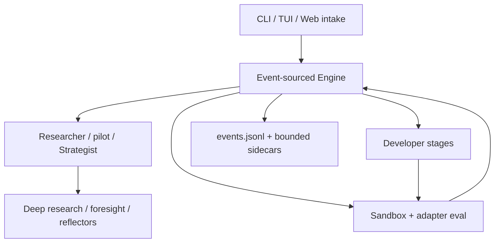

# LoopLab agent-system mega-review — 2026-08-09

**Review base:** `master` at `66bc0e61` plus the fixes listed in this document.
**Authority:** dated architecture/research record; current source, tests, README and `docs/guide/`
remain the runtime and user-contract authority.
**Scope:** production agent composition, prompts, tools, routing, permissions, memory, evaluation,
operator surfaces, documented business features, and current agent-system research

## Executive verdict

LoopLab should keep its event-sourced orchestrator. Its append-only event log, CAS/atomic append,
deterministic fold, recovery fences, permission registry, bounded loops, sandbox and provenance
controls are already a stronger foundation than replacing the engine with a general-purpose agent
framework would provide.

The principal architectural gap is one level inward: the **domain workflow is durable, but an
agent's internal phase/turn/tool workflow is not**. Prompt revisions, context manifests, model calls,
tool receipts and phase handoffs are mostly transient. A crash can replay the experiment state but
cannot resume the expensive treatment that produced it. The next architecture should extend the
existing event truth inward with additive checkpoints and typed contracts, not introduce LangGraph,
Temporal or another competing source of truth.

This review also found several smaller but live product-contract defects. The compatible ones were
fixed in this change: a registered prompt override was unreachable, external-Developer preflight did
not model its LLM fallback, task eval profiles were consumed but not exposed to the Researcher,
one-run auto-skill candidates were offered before promotion, tool collisions were silent, and several
UI/docs surfaces overstated or misdescribed their runtime scope. Larger changes are specified below
with compatibility boundaries rather than being rushed into the execution spine.

## Method

The review followed production entry points, not class names alone:

1. map every role facade, wrapper, backend, tool provider, prompt key and model-routing key;
2. trace each advertised capability to a production caller and each persisted field to a consumer;
3. compare CLI, TUI, Web/API and current guide claims;
4. exercise confirmed defects with focused tests while editing;
5. compare the resulting architecture with current primary sources on orchestration, durability,
   tool contracts, context, permissions, budgets and evals;
6. run the complete repository suite only after all changes are frozen.

The review distinguishes a **persona** (Researcher), an **execution stage** (`propose`), a
**transport/backend** (in-process LLM or external CLI), an **authority role** (who may change run
policy), and a **capability set** (tools/effects). Existing code often calls all five a “role”; that
overload is the root of several registry and preflight drifts.

## Production topology



The owner Assistant is a separate operator/control-plane system. Its run readers are scoped to the
configured run root; other file/shell effects follow their own permission boundary. It can inspect
and control existing runs, propose launch cards and create depth-one read-only subagents. It is not
part of a scientific run's durable state machine and must not be conflated with the Researcher or
Strategist.

## Agent and capability inventory

| Surface | Production implementations/composition | Tools and inputs | Authority/effects | Durable boundary |
|---|---|---|---|---|
| Researcher | offline task researcher; `LLMResearcher`; `ToolUsingResearcher`; panel, surrogate and foresight wrappers | state digest, task-specific search space, run/data/knowledge/skill/memory and optional literature tools | proposes `Idea`/operator/params/sweep/profile; never directly selects the winner | proposal becomes durable only when the Engine records the resulting domain event |
| Unified agent | `UnifiedAgent` control facade over propose, implement, repair, strategy and pilot stage clients | per-stage clients plus the shared role tool graph | one engine-facing object, while stage-local clients, contexts, routing and effects remain distinct | facade state and handoff notes are in-memory; domain results are durable |
| Developer | templated/offline developers; `LLMDeveloper`/repo developer; external `CliAgentDeveloper`; validation and best-of-N wrappers | task brief, parent code/files, stage/plan context, read-only repo/runtime tools | writes candidate code/files inside the declared surface; the external path is patch-gated by default, forced for repo tasks and explicitly disable-able for script tasks | accepted node/files and validation events are durable; an unfinished build is not resumable |
| Strategist | `RuleStrategist`, `LLMStrategist`, `ToolUsingStrategist` | run evidence, operator yields, cards, run/portfolio tools | proposes bounded run-wide strategy/control changes through governance | applied decisions/events are durable; reasoning trajectory is not |
| Pilot/action driver | unified pilot stage and action schemas | run state, pending hints, bounded control surface | chooses one allowed next action; Engine remains executor | chosen/applied domain action is durable |
| Deep Research | `DeepResearcher` over the shared provider assembly plus optional Web | stratified state brief; Run/Data, Sibling/AllRuns, CrossRun, Knowledge/Memory/Skills, Literature and Web tools subject to their existing gates | writes advisory memo/claims; does not select a champion | memo/claim records are durable; the multi-turn research treatment is not |
| Auxiliary judges | foresight ranker/panel, novelty grader, selection verifier, critic, crash triage, report/reflection and curation stewards | narrowly prepared evidence plus optional tools | advisory, gating or proposal-only according to the owning subsystem | verdict/event/sidecar may be durable; prompt/context/model revision generally is not |
| Owner Assistant | server Assistant with run launcher/control, run-root, file/shell and optional MCP tools | operator context and chat session | proposes new-run cards and controls existing runs subject to permission policy; the user starts a validated card through the launch boundary | assistant session/job stores are separate from `events.jsonl` |
| Owner subagent | `SubagentTools`, depth one, fresh read-only `plan` session | delegated prompt + read-only tools | returns text to the owner Assistant; cannot nest or mutate | final text only; no typed task/artifact lifecycle |

### Supporting agent/stage inventory

These are model-backed decision stages or wrappers, not all independent authority-bearing personas:

| Family | Production shape | Effect boundary | Main inconsistency |
|---|---|---|---|
| Proposal enrichment | surrogate, empirical panel and foresight-panel Researcher wrappers | reorders/replaces a proposal before evaluation; Engine still records/executes it | output/hint forwarding is duck-typed and terminology hides extra model cost |
| Build selection | `BestOfNDeveloper` + judge | chooses one of N implementations before execution | hidden model stage is exposed mainly as a numeric knob, not a capability/cost manifest |
| Repo onboarding | `LLMOnboarder` | proposes an eval adapter/spec for ratification | now governed by `PromptStore`; it remains a separate run-start, pre-search stage and `developer` credential route |
| Admission/taxonomy | novelty/dedup judge, concept classifier and consolidator | may admit a proposal or alter advisory concept vocabulary; never metric winner | several prompt families are hard-coded; concept override wiring was previously unreachable |
| Evaluation intervention | training monitor, live ASHA judge, crash triage and confirmation tie-break verifier | may continue/kill/request repair/break a configured statistical tie | deterministic guards and LLM stages are all called “agents,” obscuring authority |
| Reflection/memory | run reflection, comparative lessons, Memora abstraction and auto-skill distillation | writes advisory cross-run sidecars | trust/promotion lifecycle was incomplete; prompt governance remains fragmented |
| Portfolio stewards | concept, claim and task-facet stewards | proposal-only unless explicit governance applies; `concept_tidy` may ratify merges | the product-default umbrella buys concept+claim calls; task faceting is a separate default-off call because it has no behavior consumer |
| Per-run Boss | run chat + durable command service | stages/executes bounded run directives | separate prompt/tool/control vocabulary overlaps global Assistant and run tools |
| Report agents | run report and scope report writers | explanatory artifacts only | another hard-coded prompt family outside the central prompt registry |

### What is intentionally *not* one universal swarm

The current specialization is mostly static and appropriate. Dynamic worker fan-out is valuable for
naturally parallel literature/repository branches, but adding it to every scientific role would
multiply context, cost and failure modes without improving the core optimize-evaluate loop. The
recommended first use is an opt-in, depth-one, shared-budget orchestrator-worker mode for Deep
Research only.

## Confirmed inconsistencies and dispositions

| Priority | Finding | Business/runtime impact | Disposition |
|---|---|---|---|
| P0 | Prompt override `concept_consolidate_system` was registered and leaf-rendered, but production concept-map callers could not pass a `PromptStore` | advertised prompt customization silently did nothing | **Fixed:** prompt store is threaded through library, live cadence and both CLI calls; production-call inventory test added |
| P1 | Repo onboarding had an operator-critical hard-coded system prompt outside the advertised prompt store | the agent that authors a ratifiable metric adapter could not use the same prompt-governance surface as other Developers | **Fixed:** additive `repo_onboarder_system` key, production wiring and override test; byte-identical default retained |
| P1 | External Developer preflight removed all developer-stage endpoints, although validation or run-start onboarding can reach an in-process LLM; the factory also eagerly built clients that no role could consume | valid fallback/onboarding coder profiles were rejected or not probed, then failed after long external retries | **Fixed:** CLI credential/endpoint gates share one task-aware plan; server Start/Replay/resume spawn fences apply the same credential requiredness before `Popen`; factory binding is independently demand-driven, and a latent external→in-process switch is gated only when requested. The external CLI still receives no LoopLab secrets |
| P1 | `Idea.eval_profile` drove dispatch, but an LLM Researcher was not told a repo task's valid profile names or semantics | models guessed names or left a valuable cost/quality control unused | **Fixed:** exact task profiles and effective timeouts are included in the task-specific hint and exercised through real command selection; fresh malformed profiles fail loudly while historical snapshots retain their recorded dispatch semantics |
| P1 | Auto-memory wrote `status: candidate`, but the skill loader ignored lifecycle metadata and exposed every file immediately; its lifecycle key was also a truncated readable slug | one-run model-authored procedure could masquerade as promoted reusable knowledge, including through a same-prefix slug collision | **Fixed:** manual skills remain compatible; auto candidates are hidden by default, promoted skills are visible and labeled untrusted, explicit inspection can include candidates, lifecycle frontmatter cannot be forged through the model body or a multiline/Unicode task id, and promotion evidence is keyed by the full normalized-claim SHA-256 with exact-match legacy reuse |
| P1 | `CompositeTools` silently kept the first provider on duplicate function names | capability loss was deterministic but invisible; routing mistakes looked like model failure | **Fixed:** legacy first-wins behavior remains, collisions are recorded and warned, and opt-in strict composition fails immediately |
| P1 | CLI, TUI and Web had three New-run planners while README implied one shared Genesis | product parity claims exceeded implementation parity; proposal schemas can drift | **Documented truthfully now;** canonical planner/service remains a follow-up rather than a risky launch rewrite |
| P1 | Task-facet stewards spend finalize-time model calls and have a ledger plus operator CLI, but facets do not affect retrieval/ranking and are not fetched by the UI | paid product surface has no behavioral consumer | **Fixed without inventing behavior:** fresh `task_facets_finalize=false` stops scheduling the third paid call while concept+claim curation remains enabled; explicit opt-in, manual/on-demand APIs and ledgers remain. Snapshot schema v2 pins the new paid-treatment bit, while v1/missing-field snapshots preserve the historical all-three treatment behind `cross_run_curation`; facets still never authorize or rank |
| P1 | Prompt files hot-reload without a run/phase-pinned revision; UI prompts have a separate store | identical event inputs can receive different treatment mid-run and cannot be reproduced exactly | **Open architecture item:** pin a prompt bundle/context/tool-schema manifest per run or phase while retaining hot reload for future phases/runs |
| P1 | Outer event sourcing stops at the inner agent loop | crash recovery reconstructs state but loses unfinished expensive work and trajectory evidence | **Open architecture item:** additive phase/checkpoint/tool-receipt events and safe-boundary resume |
| P1 | An external or paid evaluation can finish before its terminal event is appended | a crash in that window can repeat the evaluator side effect on resume | **Open architecture item:** attempt-scoped invocation id plus durable started/completed receipt or outbox/reconciliation contract |
| P1 | `CostAccountant` supports limits, but shipped clients receive no shared finite run budget | observability is not admission control; concurrent roles cannot reserve against one cap | **Open architecture item:** shared reserve/commit call/token/dollar budget, default unlimited for compatibility |
| P1 | `concurrent_research_max_calls` counts research passes, not every provider/forced-emit/consolidation call inside a pass | the named ceiling can materially undercount real inference spend | **Open with shared budget:** debit at the provider broker, not at an outer cadence loop |
| P1 | Concurrent eval lanes admit against already-completed cumulative time rather than atomically reserving their worst-case budget | several lanes can enter under one remaining allowance and overshoot a “hard cumulative” cap | **Open resource item:** reserve bounded eval time at admission and return the unused portion |
| P1 | Developer outputs are `str` plus mutable `last_files`/`last_deleted`/telemetry side channels | wrappers or concurrent invocation can associate artifacts and receipts with the wrong node | **Open contract item:** immutable `DeveloperResult` envelope with a legacy string adapter |
| P1 | Cancellation is checked between blocking calls, while speculative build workers may be awaited to completion | pause/abort can wait for an LLM/external process that no longer has a useful consumer | **Open execution item:** attempt-owned cancellation token, quarantined late result and durable cancel receipt |
| P1 | External CLI agents use a composition-independent 600-second default and have no structured priced/unpriced usage result | timeout, cancellation and cost governance differ from in-process Developers | **Open contract item:** Settings-bound timeout plus immutable external-agent result with duration/cause/usage or explicit `unpriced` |
| P1 | MCP adapter flattens current structured results/security metadata; timeout does not cancel the outstanding operation; cache is process-global | unsafe basis for broad autonomous connector access | **Declaration boundary fixed, expansion still blocked:** malformed/oversized schemas are isolated before routing, ordinary safe names stay compatible, and ambiguous/unsafe/long origin pairs receive deterministic provider-safe full-digest names. Typed results, cancellation, principal-keyed cache and authorization binding remain required before wider role access |
| P1 | Agent trajectory/security eval corpus is absent | state replay and outcome benchmarks cannot catch bad tool routing, handoffs or prompt injection | **Open quality item:** add the eval ladder below |
| P2 | Fresh `agent_stage_models` / `agent_stage_base_urls` maps accepted misspelled keys and silently ignored them | an operator believed a stage override was active while the shared target ran | **Fixed:** one five-key registry validates fresh config; historical snapshots filter unknown old stage names with a warning so resume remains compatible |
| P2 | Deep Research hand-built a smaller tool graph than Researcher/Strategist | capability-layer promises exceeded actual role parity; configured memory/skills/run-root tools could be absent | **Fixed:** Deep Research now uses the shared provider assembly (including configured run-root, memory, skills, knowledge/Memora and literature gates) and appends only its Web-specific provider |
| P2 | Deep Research said it reasoned over all results while its compact brief dropped the middle beyond 40 nodes | an operator/model could mistake a head+tail sample for complete evidence | **Fixed:** the prompt now declares its bounded evidence, uses a deterministic best/failure/recent/seed/middle sample, and reports the exact omitted count |
| P2 | `Strategy` and `_apply_strategy` retain Developer-backend switching, but shipped Strategist output schemas and operator control do not expose it | a latent custom/historical capability complicates credential reachability without a clear product owner | **Operational gap fixed:** a custom/historical external→in-process switch now validates credentials and probes the target lazily, leaving the current Developer active on refusal. **Product choice remains:** expose the switch through governance or retire it through a compatibility migration |
| P2 | Generated run-level `AGENTS.md` described the self-contained script/JSON-metric path even for a seeded repository task | run provenance/API advertised a different execution contract, although the external backend already received the correct task brief directly and retained any repo-owned manifest | **Fixed:** generation is task-aware and records the repo brief/authority boundary; it does not overwrite a seed repository's own `AGENTS.md` |
| P2 | Runtime skill discovery was recursive while the Authoring surface listed only flat Markdown | packaged skills could execute but remain invisible to the first-party editor/review flow | **Partially fixed:** configured `skills_dir` now has a bounded recursive inventory: root Markdown stays writable, nested `**/SKILL.md` packages use safe relative display IDs and are read-only, symlinks/path escapes are skipped, and scan incompleteness is explicit while PUT/recovery stays flat. **Remaining product gap:** auto-distilled `<memory_dir>/skills/` is outside configured Authoring; candidates remain hidden until cross-task promotion and have no first-party review UI |
| P2 | Prompt governance covers a bounded registry while Genesis, assistants, reports, monitors and stewards keep separate prompt families | “canonical prompt store” is only partially true | **Partially fixed:** repo onboarding joined the store; continue with an additive typed `PromptDefinition` registry and explicit override policy, migrating byte-identically one family at a time |
| P2 | Web Settings said All-runs tools cover every run “on this machine”; both All-runs and Assistant readers are actually scoped to one configured run root | operator could infer a broader data boundary than actually exists | **Fixed:** UI schema, runtime output, config/tool copy and tests say run-root; the owner Assistant retains richer liveness/log/trace tools over that same root |
| P2 | UI guide said the launch card was not editable, while the shipped card edits a validated draft and invalidates validation after change | documented workflow contradicted the guarded UI | **Fixed:** guide now describes editable fields and mandatory revalidation |
| P2 | MCP wrapper comment said Auto runs calls inline, while UNKNOWN MCP effects deliberately ask even in Auto | security contract was correct in code/test but false in its owning comment | **Fixed:** comment now matches fail-closed behavior |

## Duplication and taxonomy debt

### One word, several contracts

Today these registries overlap without one validated definition:

- protocol personas (`Researcher`, `Developer`, `Strategist`);
- unified execution stages (`propose`, `implement`, `repair`, `strategy`, `pilot`);
- model/profile routing keys (those stages plus split roles and helpers);
- governance roles (`researcher`, `strategist`, `boss`);
- prompt keys;
- duck-typed forwarding/capability attribute lists;
- per-surface tool composition.

The compatible target is an additive `AgentSpec`/`CapabilityManifest`, not a rewrite of the classes:

```text
identity/persona + stage + backend + model target + prompt id/revision
+ input/output schema + tools/effects + authority + budget + fallback + checkpoint policy
```

Existing classes remain adapters. Source-scan tests should prove that every registered stage/prompt/
capability has a consumer and that every consumer is registered. The external-Developer reachability
fix is a first concrete slice of this model.

Use precise names in product and code: **unified control facade** for `UnifiedAgent`, **role** for
Researcher/Developer/Strategist/Pilot, **stage agent** for a model-backed judge/monitor/researcher,
**deterministic guard** for rule-only gates, and **product assistant** for the per-run Boss/global
Assistant surfaces. Describing the facade as a shared persona overpromises shared conversation
state: the unified control facade coordinates distinct stage clients and local contexts. Maintained
user/source copy now uses the facade terminology; no runtime context-sharing behavior was changed.

### Three planning stacks

- Web main-menu New run: owner Assistant + `RunLauncherTools.propose_run`;
- TUI: server `/api/genesis` job;
- CLI `--goal`: `engine/genesis.py` kind-selecting task author.

They share task-adapter validation and backend-default authority, but not planning code or schema.
Web additionally submits a reviewed `/api/start/preflight` token; TUI posts directly to `/api/start`,
whose server validates before spawn but issues no reviewed receipt; CLI validates directly. A future
canonical `RunProposal` service should own task validation, normalized settings, provenance,
editable-field policy and launch fingerprint. Existing callers should be compatibility adapters so
saved cards and CLI behavior do not disappear.

### Paid but inert task facets

Task facets currently have generation, proposal, ledger and operator machinery but no retrieval or
selection consumer. This is worse than a simple roadmap stub because it can add synchronous paid
finalize work. Fresh configurations now keep that specific call off with `task_facets_finalize=false`,
while the manual/on-demand paths, durable ledger and an explicit opt-in preserve the feature. Historical
snapshots that lack the field resume their original schedule instead of silently changing treatment.
Before wiring facets into behavior, create offline fixtures proving that the signal improves applicable
prior ranking without crossing task scope; never treat facets as authorization.

## SOTA comparison

The source statements below come from current primary documentation or original papers; the LoopLab
column is this review's inference from source and tests.

| Area | Current pattern | LoopLab position | Recommended import |
|---|---|---|---|
| Orchestration | OpenAI distinguishes manager-as-tools from ownership-transferring handoffs; Anthropic recommends the simplest composable workflow that fits | static specialization is sound; owner subagent is manager-as-tool-like | make ownership and handoff artifact explicit; do not add universal delegation |
| Durable execution | Temporal records nondeterministic activities; LangGraph checkpoints threads; Google ADK resumes completed/unfinished branches with at-least-once tool assumptions | domain events are excellent, inner treatment is transient | additive phase/checkpoint events, idempotent receipts and resume only at declared safe boundaries |
| Context | Current agent harness guidance uses compact, explicit artifacts and append-only session history outside model context | bounded compaction exists, but handoff is prose and prompt/context revision is unpinned | typed `ContextEnvelope`/`HandoffArtifact` with refs, hashes, provenance, audience and open questions |
| Tools | Current MCP defines output schemas, structured content and `isError`; tool metadata is untrusted | internal API is `str` and MCP contract is flattened | additive internal `ToolResult`/`ToolCapability`, legacy string adapter, typed risk/idempotency/cancel metadata |
| Budgets | Production multi-agent systems bound delegation and spend; long operations expose cancellation/resume | call cost is metered, not globally reserved or cooperatively cancelled | shared call/token/dollar reservations and cancellation propagated into transport/tool execution |
| Evals | OpenAI trace grading and Anthropic agent eval guidance grade trajectories, tools, handoffs and repeated stochastic trials | replay tests state folding; bench grades outcomes | layered trajectory, safety and repeated-trial corpus derived from traces |
| Remote interop | A2A defines cards, skills/auth, task lifecycle, artifacts, streaming and cancel | no current remote-agent business requirement | keep future contracts A2A-compatible; do not ship a remote runtime yet |

### Primary research sources

- [OpenAI Agents orchestration](https://developers.openai.com/api/docs/guides/agents/orchestration),
  [agent evals](https://developers.openai.com/api/docs/guides/agent-evals),
  [trace grading](https://developers.openai.com/api/docs/guides/trace-grading), and
  [prompting](https://developers.openai.com/api/docs/guides/prompting).
- Anthropic on [building effective agents](https://www.anthropic.com/engineering/building-effective-agents),
  [multi-agent research](https://www.anthropic.com/engineering/multi-agent-research-system),
  [context engineering](https://www.anthropic.com/engineering/effective-context-engineering-for-ai-agents),
  [long-running harnesses](https://www.anthropic.com/engineering/harness-design-long-running-apps),
  [managed agents](https://www.anthropic.com/engineering/managed-agents), and
  [agent evals](https://www.anthropic.com/engineering/demystifying-evals-for-ai-agents).
- [Temporal workflow definitions](https://docs.temporal.io/workflow-definition),
  [LangGraph persistence](https://docs.langchain.com/oss/python/langgraph/persistence), and
  [Google ADK resume](https://adk.dev/runtime/resume/).
- [Microsoft Agent Framework workflows](https://learn.microsoft.com/en-us/agent-framework/workflows/)
  and [durable extension](https://learn.microsoft.com/en-us/agent-framework/integrations/durable-extension).
- MCP 2026-07-28 [tools](https://modelcontextprotocol.io/specification/2026-07-28/server/tools),
  [authorization security](https://modelcontextprotocol.io/specification/2026-07-28/basic/authorization/security-considerations),
  and [transports](https://modelcontextprotocol.io/specification/2026-07-28/basic/transports).
- [A2A specification](https://a2a-protocol.org/latest/specification/),
  [Magentic-One](https://arxiv.org/abs/2411.04468),
  [τ-bench](https://arxiv.org/abs/2406.12045),
  [ToolSandbox](https://arxiv.org/abs/2408.04682),
  [AgentDojo](https://arxiv.org/abs/2406.13352), and
  [CaMeL](https://arxiv.org/abs/2503.18813).

## Target architecture, without a second orchestrator

### 1. Durable inner phases

Add feature-flagged, fold-compatible events such as:

- `agent_phase_started`: agent/stage id, resolved model, prompt/context/tool manifest hashes, budget;
- `agent_checkpointed`: turn boundary, completed idempotent receipts, compact handoff artifact ref;
- `agent_phase_completed`: typed outcome ref, actual usage/cost and terminal reason.

Old folds ignore additive events. Resume re-enters only a declared boundary and never blindly repeats
an unknown side effect. Large prompt/tool content stays in content-addressed artifacts; events retain
hashes and bounded metadata.

### 2. Typed compatibility layer

Introduce internal types while preserving current public adapters:

- `ToolResult(content, structured, is_error, provenance, receipt, retryable)` with `str(result)` as
  the legacy view;
- `ToolCapability(effect, risk, idempotency_key, concurrency_safe, cancel)`;
- `ContextEnvelope` and `HandoffArtifact` with an existing prose summary compatibility field;
- `AgentSpec`/`CapabilityManifest` generated for current role classes.

Do not infer safety from tool names or provider order. Unknown metadata remains UNKNOWN and asks.

### 3. Shared budget and cancellation

A run-level pool should atomically reserve estimated calls/tokens/dollars before dispatch, commit
actual usage afterward, and release unused reservation. Separate role budgets can partition the same
pool. Default `None` preserves today's unlimited behavior. Cancellation must reach in-flight model
requests, subprocesses and MCP operations; a timeout that merely stops waiting is not cancellation.

### 4. Agent eval ladder

1. deterministic unit cases for routing, schema validation, permissions and checkpoint fold;
2. curated trajectory cases with expected/forbidden tool calls and handoffs;
3. outcome cases on frozen tasks;
4. prompt-injection, confused-deputy and cross-run-scope cases;
5. repeated stochastic trials with confidence intervals and cost/latency regression gates.

Existing traces can seed the corpus after structural redaction and explicit consent; diagnostics-only
raw traces should not silently become permanent training/eval data.

### 5. Bounded Deep-Research workers

Only after the shared budget/checkpoint/tool contracts exist: allow a depth-one orchestrator to split
independent research questions, give each worker a bounded context and budget, and require a typed
evidence artifact. The parent synthesizes and retains ownership. No nesting, no write tools and no
automatic transfer of scientific-run authority.

## Deliberate non-changes

- No framework migration: it would create two replay/durability authorities.
- No universal swarm: specialization stays static unless decomposition is demonstrably parallel.
- No automatic A2A runtime: there is no current remote-agent business use case.
- No “hard budget” that is actually one independent limit per client: concurrent roles require one
  shared reservation ledger.
- No task-facet effect on authorization or champion selection without scoped offline evidence.
- No broad MCP access until typed results, cancellation and auth/cache isolation are fixed.

## Validation record

Focused tests were run during confirmed fixes, followed by release-wide validation on the combined
tree:

- `.venv/bin/python -m pytest -q --disable-warnings`: **9,232 passed, 27 skipped** out of 9,259;
- `cd ui && npm test`: **956 passed**;
- `cd ui && npm run build`: **324 modules transformed**, production build succeeded;
- `cd ui && npm run check:bundle`: every size and reachability budget passed; total JavaScript was
  **1,619,429 bytes raw / 506,743 bytes gzip** against the 506,880-byte gzip budget.

The Python suite includes the documentation/navigation/source-contract guards. A local
`mkdocs build --strict` could not start in this sandbox because the declared `docs` extra was absent
and registry download was denied before dependency resolution; this is recorded as an environment
limitation, not as a successful strict build. Downstream CI must run the declared docs extra to
complete that independent rendering check.
