# 71. Снижение порога входа в LoopLab

**Дата:** 2026-09-30. **База:** `master` / `origin/master`, `1103ba87b22cd3c02dcae80db87473d0c8ae8374`.
**Статус:** аудит и план; первый пакет изменений реализован частично (см. §13).
**Основной сценарий:** человек работает через Assistant в desktop UI.
**Второй сценарий:** Codex / Claude Code управляет экспериментом как внешний агент.

Это датированный документ. Поведение определяют текущие исходники и тесты; практические
инструкции должны жить в README и [User Guide](guide/index.md), а не переезжать сюда.

## 1. Вывод и рекомендуемый порядок

LoopLab уже умеет принимать задачу в чате, показывать проверяемое предложение запуска,
вести эксперимент и объяснять измеренный результат. Порог входа повышают прежде всего
**порядок знакомства с продуктом, обнаружение настройки модели и неявный следующий исполнитель**.
Новый пользователь слишком рано встречает архитектуру, варианты CLI, политики поиска,
структуру журналов и терминологию движка.

Предлагается:

1. Сделать **«Опиши задачу в Assistant»** главным входом README, сайта и общего quickstart.
2. Дать рядом самостоятельный путь **«Подключить своего coding agent»**, явно отделив его от
   делегирования только Developer.
3. До первого сообщения показать готовность модели и дать короткий пример запроса.
4. На каждом остановившемся шаге назвать **что ожидается, от кого и какое действие продолжит работу**.
5. Сохранить нынешние проверки запуска, происхождение метрик, права и журналы; раскрывать
   их подробности по мере необходимости.

Первый пакет работ: **OB-01, OB-02, OB-03, OB-09**. Особенно важен OB-09:
локально воспроизведён внешний run, который ничего не выполняет, но показывает
«Preparing the first experiment…» со спиннером.

## 2. Метод и границы проверки

### 2.1. Что проверено

- Перед аудитом подтянуты 159 коммитов из `origin/master`; рабочая ветка и локальный `master`
  fast-forwarded на указанную базу. Наблюдения сделаны после обновления.
- Прочитаны README, главная страница документации, установка, quickstart, UI guide,
  JupyterHub onboarding, external harness guide; сопоставлены с командами и исходниками UI.
- Запущен свежесобранный UI на отдельном пустом run-root. Экранная проверка — Edge,
  viewport **1920 × 1080**, desktop, тёмная тема. Каждый приложенный снимок сохранён и просмотрен.
- Пройден вход в New run, настройки модели, первый результат и диагностика внешнего ожидания.
- Выполнен короткий offline-пример: **3 узла / 3 оценки**, лучший узел `#2`,
  `metric=8.05262`; `inspect` и `replay` завершились успешно.
- Создан отдельный external run без подключённого агента: **0 узлов**, engine жив,
  в Agent cycle — обязательный `research_completed`. После наблюдения run явно остановлен
  через `stop --wait`; процесс вышел, run остался resumable.
- Выполнены `harness`, `harness --help`, `harness-mcp --help`; изучены контракт,
  `harness-progress`, UI-панель обязательств и ветка внешнего цикла движка.

### 2.2. Что не доказано этим аудитом

Это не установка на чистую ОС: использовались существующие Python/Node и окружение машины.
Пустой run-root не равнозначен заводским настройкам; UI показывал три customized values.
Не вызывалась платная модель: ответ Assistant, реальная launch card после ответа и платный
старт исследованы по коду/документации, а не выданы за пройденный end-to-end сценарий.
Не проверялись новая регистрация провайдера, действующая конфигурация клиентов Codex/Claude,
полный MCP-цикл с submit кандидата, реальное обучение MNIST и завершение всех внешних обязательств.
На 2560 × 1440 нужен отдельный приёмочный прогон. Мобильная компоновка вне этого плана.

Ниже **наблюдение** означает текущий экран, исполненную команду или конкретный исходник.
**Ожидаемый эффект** — продуктовая гипотеза, которую ещё нужно проверить на новых пользователях.
Приоритеты P0/P1/P2 относятся к снижению порога входа, а не объявляют все находки runtime-багами.

## 3. Два пользовательских пути

| | Assistant в UI — основной | Внешний Codex / Claude Code |
|---|---|---|
| Что пользователь хочет | «Вот задача и данные. Проведи эксперименты и покажи, что получилось» | «Продолжай работать в моём coding agent, а LoopLab пусть исполняет и измеряет» |
| Главная поверхность | Диалог + предложение запуска + измеренные результаты | Агентный диалог + MCP; UI для наблюдения и вмешательства |
| Что сообщает человек | Цель, доступные пути, ограничения, допустимые затраты | То же + границы действий агента и подготовленный доступ к run |
| Кто предлагает кандидатов | Встроенный цикл LoopLab после старта | Только внешний агент |
| Что делает LoopLab | Ведёт встроенный цикл, исполняет, проверяет и сохраняет результаты | Принимает готовые кандидаты, проверяет, исполняет, ведёт историю и обязательства |
| Момент первой ценности | Понятный измеренный baseline и следующий шаг | Первый принятый кандидат с измеренной метрикой и понятным продолжением |
| Критический риск понимания | «Чат открыт, значит модель настроена»; «обсудили план, значит run запущен» | «UI жив, значит агент работает»; «команда принята, значит узел уже закончен» |

`developer_backend=codex|claude` — **третий, расширенный вариант конфигурации**:
LoopLab сохраняет Researcher/search, coding agent получает только редактирование кандидата.
Его не следует показывать новичку как синоним внешнего управления всем экспериментом.

## 4. Пройденные экраны и визуальные доказательства

| Шаг | Действие и наблюдение | Оценка для новичка | Доказательство |
|---|---|---|---|
| 1 | Открыть пустой Runs: Assistant виден сразу, но слева уже Projects, portfolio views, фильтры; три из четырёх предложений чата предполагают имеющиеся результаты/работу | Основа хорошая, первый шаг рассеян | [01 — пустой экран](assets/71-onboarding/01-empty.png) |
| 2 | Start a new run в Assistant: поле получает фокус, появляется New run proposal и указание проверить launch card | Понятный вход; не хватает примера и статуса готовности модели | [02 — новый run](assets/71-onboarding/02-new-run.png) |
| 3 | LoopLab → Settings → LLM: настройка доступна; сначала открыт Search & policy с длинными объяснениями | Устройство движка предъявляется раньше подключения помощника | [03 — настройки](assets/71-onboarding/03-settings.png) |
| 4 | Открыть завершённый offline run: автоматически выбран Report; есть улучшение относительно baseline и предупреждение single-seed; Assistant привязан к run | Сильный первый результат; первичная синяя кнопка — Refresh report · paid | [04 — результат](assets/71-onboarding/04-first-result.png) |
| 5 | Открыть external run без агента: Running / Search, спиннер Preparing the first experiment…, 0 узлов | Вводит в заблуждение о том, кто сейчас действует | [05 — ожидание](assets/71-onboarding/05-external-wait.png) |
| 6 | Progress → Agent cycle: виден research gate, требования к concepts/hypothesis и novelty/foresight | Диагностика существует, но требует знания меню и протокола | [06 — обязательства](assets/71-onboarding/06-agent-cycle.png) |
| 7 | Открыть исходную архитектурную SVG из README: роли, search, memory, knowledge, event log на одном листе | Полезная справочная карта; слишком много понятий для первого объяснения | [07 — архитектура](assets/71-onboarding/07-architecture.png) |

### 4.1. Ключевое несоответствие состояния

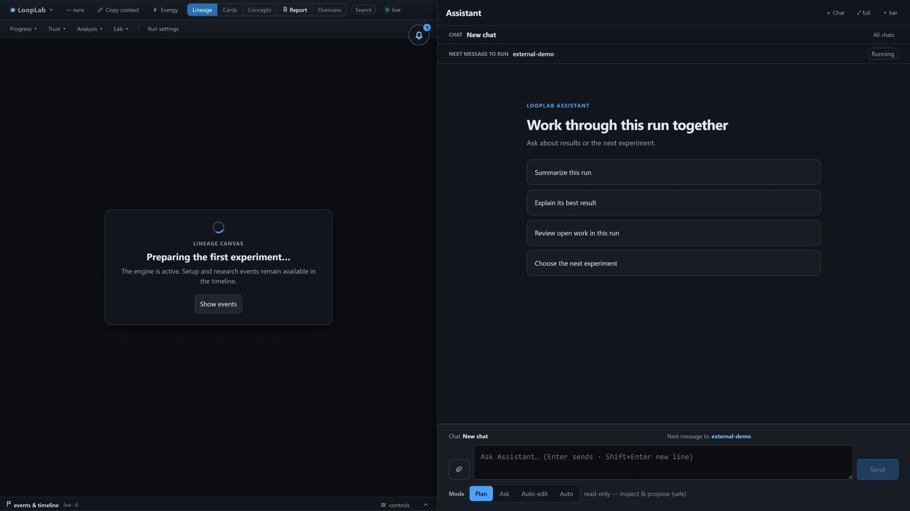

Тот же run в панели диагностики:

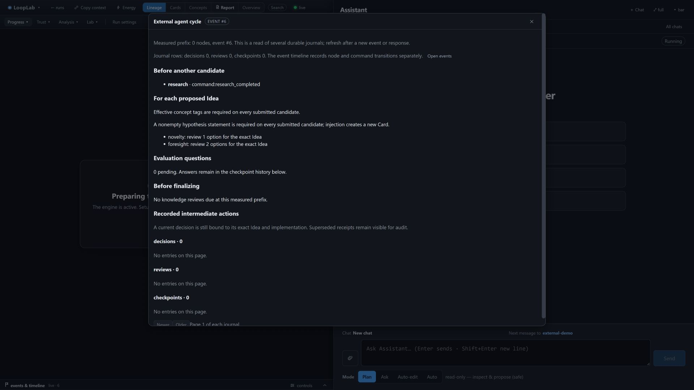

### 4.2. Что сохранить

- Assistant постоянно доступен, имеет отдельную область и явно показывает контекст следующего сообщения.
- New run переводит фокус в composer и поясняет, что старт выполняется через launch card.
- В `LaunchCard.jsx` уже есть server validation, effective preview, защита от повторного старта,
  восстановление неопределённого результата отправки и раскрытие ошибочных полей.
- Settings уже имеет Essential/All, поиск, сохранённое состояние и отдельный тест подключения
  с указанием возможной стоимости.
- Report открывается с вывода и оговорок, не прячет single-seed; есть экспорт и данные графиков.
- Agent cycle уже показывает обязательства и повреждённые источники. Нужна лучшая подача
  существующих фактов, а не второй независимый источник истины.

## 5. Где документация повышает порог входа

| Поверхность | Наблюдение | Что поменять |
|---|---|---|
| `README.md` | Архитектура и большой список возможностей предшествуют установке. Quick start ведёт через CLI, inspect/replay и варианты задания задачи | Первый экран: результат продукта, два пути, маленький пример диалога; архитектуру и каталог возможностей ниже |
| [Главная документации](index.md) | Первый hero CTA — Explore architecture infographic; Assistant не главный вход | Основной CTA «Начать через Assistant», второй «Подключить coding agent», архитектура третьим уровнем |
| [Installation](guide/installation.md) | Основной install без UI extra; нет полного clone/cd/venv-пути; Node отсутствует в Requirements; в extras нет harness | Рекомендуемая UI-установка из checkout с точными предпосылками; отдельно headless и harness; варианты PowerShell/POSIX |
| [Quickstart](guide/quickstart.md) | Offline CLI → содержимое run directory → real LLM → crash/resume; UI только в Next steps | Общий quickstart через Assistant; CLI demo и структура хранения — отдельные рецепты |
| README vs quickstart | Регрессионный пример README использует default llm, guide явно задаёт toy | Перед каждой командой назвать режим и возможность расходов; общий тестируемый источник примеров |
| [UI guide](guide/ui.md) | Вводная начинается с отдельного процесса, SSE, event folding; много текста об atomic build перед пользовательским сценарием | Сначала «открыть → описать → проверить → запустить → понять результат»; сборку и восстановление в troubleshooting/development |
| [JupyterHub onboarding](guide/jupyterhub-onboarding.md) | Part B уже прямо называет Assistant основным путём и объясняет, что сообщать; Part A содержит семь инфраструктурных шагов | Переиспользовать Part B в общем onboarding; оставить hub/proxy/storage-детали в deployment |
| [External harness](guide/external-harness.md) | Верно различает два режима, но установка, два токена, отдельный engine, MCP и динамические обязательства предшествуют первому результату | Короткий happy path с готовым handoff, затем reference и recovery; видимая граница operator/agent |
| [Guide index](guide/index.md) | External coding agents описан через Developer integration/migration; Web UI в разделе Operating | Навигация по намерению: Assistant / external agent / CLI automation; названия соответствуют режимам |
| Схемы | Большая SVG и inline-схема главной объясняют внутренний цикл; не показывают два пользовательских входа и владельца следующего шага | Две вводные схемы из §9; полную архитектуру сохранить как справочную |

Есть конкретный дрейф предпосылок: JupyterHub guide говорит «Node ≥ 20», а
`ui/package.json` задаёт `^20.19.0 || ^22.13.0 || >=24.0.0`. Надо ссылаться на один
поддерживаемый диапазон и проверять его автоматически. Не обещать установку опубликованного
пакета одной командой, пока такой путь и наличие готового UI bundle не проверены на чистой машине.

## 6. Реестр проблем и критерии исправления

Все OB-пункты ниже — **предложения к реализации** на базе этого аудита.
Сложность указана относительная: S — локальная правка, M — несколько согласованных поверхностей,
L — изменение протокола/жизненного цикла. Это не оценка в рабочих днях.

### OB-01 · P0 · S — Главный путь спрятан за архитектурой и CLI

**Основание:** README, docs home, quickstart; §5. Пользователь должен выбрать из нескольких
технических способов старта, прежде чем увидит целевой сценарий общения.

**Изменение:** одна стартовая страница с двумя действиями; UI выбран основным. В первом примере
показать цель → уточнение → launch card → измеренный результат. Переиспользовать JupyterHub Part B.

**Приёмка:** новый пользователь от README до описания своей задачи проходит один явно обозначенный
маршрут без чтения архитектуры, YAML, adapter registry и replay. CLI остаётся доступным рецептом.

### OB-02 · P0 · M — Установка не собирается в один воспроизводимый путь

**Основание:** Installation, UI guide, `pyproject.toml`, `ui/package.json`; §5.

**Изменение:** дать полный путь из репозитория: clone, cwd, venv, нужные extras, проверка Python/Node,
запуск сервера, ожидаемый адрес и результат. Различать исходную сборку UI и поставку с готовым bundle.
Предлагать короткую диагностику окружения до запуска, с адресным исправлением отсутствующей зависимости.

**Приёмка:** инструкция проходит на чистых Windows/PowerShell и Linux/POSIX; ветка UI
не заканчивается placeholder вместо приложения; harness extra документирован. Диагностика
не запускает модель и ясно отделяет свою проверку от платного теста провайдера.

### OB-03 · P0 · M — Готовность Assistant не видна рядом с composer

**Основание:** шаги 1–3; `Settings.jsx::LlmHealth`. Настройка/проверка есть в Settings,
но стартовый Assistant не сообщает, проверено ли подключение. В данном окружении по умолчанию
видны `qwen3:8b` и `http://localhost:11434/v1`; их наличие не доказывает доступность модели.

**Изменение:** рядом с первым диалогом показать «модель не проверена / готова / недоступна» и
кнопку подключения. Короткая форма endpoint/model/credential или локальная модель; технические
подробности — раскрываемые. После настройки возвращать в сохранённый черновик задачи.

**Приёмка:** три состояния различаются; отсутствие API key само по себе не считается ошибкой
локального endpoint. Реальный health check запускается явно с уведомлением о возможной цене.
Настройки, которые будет использовать Assistant, не подменяются статусом другого role endpoint.

### OB-04 · P1 · S — Пустой экран использует сценарии зрелого портфеля

**Основание:** шаг 1; `RunList.jsx`, `AssistantChat.jsx`. Projects, Saved view, несколько
фильтров и предложения объяснить best result показываются при нуле runs.

**Изменение:** при нуле данных оставить цель, короткий пример, «Своя задача» и «Посмотреть demo»;
портфельные элементы раскрывать с появлением данных или по действию пользователя.
Demo должно быть явно обозначено offline-примером с измеренными, а не выдуманными результатами.

**Приёмка:** нет предложений объяснить отсутствующий результат; demo доступно без LLM;
возврат опытного пользователя не теряет фильтры/проекты. Desktop остаётся основным форматом.

### OB-05 · P1 · S — Пустой запрос не учит, что именно сообщить

**Основание:** шаг 2; JupyterHub §B2 уже содержит нужное разделение ответственности.

**Изменение:** показать короткий редактируемый пример: цель, путь к repo/data, ограничение времени.
Assistant уточняет только недоступное, сам читает доступные файлы; отсутствующий server-side путь
поясняет до запуска. Attachment «text files» не должен восприниматься как импорт любого датасета.

**Приёмка:** запуск собственной задачи не требует написать Task JSON или придумать `kind`.
Для удалённого сервера явно сказано, на какой машине должен существовать путь.

### OB-06 · P1 · M — Launch card начинает с терминов движка

**Основание по коду:** `LaunchCard.jsx::reviewRows` — Run, Task source, Backend, Model,
Search, Parallel, Time limits. Конфигурация уже свёрнута; проверки и cost disclosure существуют.

**Изменение:** над техническим preview добавить короткое подтверждение смысла:
что улучшаем, чем измеряем и в какую сторону, какие данные/код используем, что разрешено менять,
какие ограничения будут действовать. Техническое представление и точные команды оставить доступными.

**Приёмка:** человек может ответить на эти вопросы без чтения JSON. Неизвестное явно названо.
Изменение черновика по-прежнему отменяет validation; Start привязан к проверенному preview.
Не убирать проверку или idempotency ради сокращения числа кликов.

### OB-07 · P1 · S — Четыре режима чата требуют изучения до первого результата

**Основание:** шаги 1–4 показывают Plan, Ask, Auto-edit, Auto и технические help-тексты.

**Изменение:** оставить текущие права, но объяснять их через ближайшее действие:
«Сейчас обсуждаем и готовим предложение. Запуск — после вашей проверки».
Для routine-изменений отдельно показывать, когда будет запрошено подтверждение.
Продвинутый выбор режимов доступен без обязательного изучения всех четырёх.

**Приёмка:** Plan допускает обсуждение/предложение, не создавая впечатления начатого run;
видимый режим соответствует серверной политике; настройка не переключается незаметно.

### OB-08 · P1 · S — Essential settings остаются справочником устройства движка

**Основание:** шаг 3. В первом разделе длинные определения Profile/Policy/parallel,
runtime-access toggles, ASHA-детали и backlog-примечание.

**Изменение:** начальная настройка: модель, доступные ресурсы, лимиты. Остальные defaults
сохранить; описания полей сократить до пользовательского результата, детали раскрывать.
Не менять смысл нуля/auto/unbounded и не скрывать отсутствие денежного лимита.

**Приёмка:** подключить модель можно без чтения MCTS/ASHA и прав Strategist; опытному
пользователю остаются поиск, All и точные текущие значения.

### OB-09 · P0 · M — Ожидание внешнего агента выглядит как выполняемая работа

**Основание:** шаги 5–6; `ui/src/runIndex.js` — ветка empty canvas при `engine_running`;
`looplab/engine/orchestrator.py` — внешняя ветка ждёт готовые injection/commands.

**Изменение:** на основной поверхности вывести external mode, владельца следующего шага,
актуальный blocker и ссылку на Agent cycle. Для воспроизведённого случая:
«Ожидается внешний агент. Перед первым кандидатом нужно записать исследовательское решение».
Отсутствие новых событий не доказывает смерть агента; без достоверной проверки связи писать
«состояние подключения неизвестно», а не «агент отключён».

**Приёмка:** внешний run с 0 узлов и без агента не обещает подготовку эксперимента.
Видны отдельно: server доступен, engine жив/остановлен/неизвестен, evaluation работает,
ожидается ответ checkpoint, нужен кандидат, требуется finish review. Нет вечного спиннера
на статичном ожидании. Данные берутся из текущего progress/state, а не выводятся из одной давности события.

### OB-10 · P1 · M — Первое подключение внешнего агента требует ручной сборки контекста

**Основание:** external guide, `harness-mcp --help`, `harness/manifest.py`, `mcp_server.py`.
Нужно сопоставить UI URL, run-root, run ID, engine process, MCP, два вида credential и выбранный режим.

**Изменение:** операторский шаг «Подключить внешнего агента» формирует проверяемую инструкцию
и handoff с URL, run identity, workspace, режимом, разрешёнными действиями и маршрутом recovery.
Credentials передаются отдельно штатным защищённым механизмом клиента; в копируемом тексте,
скриншотах и журнале секретов нет. Клиентские примеры проверяются для поддерживаемых версий.

**Приёмка:** UI и engine смотрят на один run-root; target run действительно external;
агент начинает с capabilities/contract/progress. Токен harness не описан как изолированный
доступ ровно к одному run: текущий scope шире. Для первого рецепта использовать отдельный сервер/root
с external runs, как предупреждает действующий guide про управление internal runs тем же токеном.
Не выдавать owner token для обхода запрета launch.

### OB-11 · P1 · M — Контракт сообщает обязанности, но следующий шаг приходится собирать

**Основание:** `harness/progress.py` уже возвращает blockers, candidate requirements,
pending checkpoints, finish requirements, policy preview и source health;
`panels.jsx::HarnessProgressPanel` отображает технические команды отдельными секциями.
Стандартный `harness` в этой проверке содержит 16 верхнеуровневых полей,
около 25 KB JSON при повторной сериализации — это измерение конкретной версии, не лимит API.

**Изменение:** поверх существующего контракта дать краткую сводку текущего хода:
что блокирует работу, кто отвечает, куда читать и какой тип ответа требуется.
Сначала вопросы текущей оценки/неполные источники, затем admission нового кандидата и finish.
Полный schema/историю загружать адресно. Это расширение discovery, а не автоматический научный ответ.

**Приёмка:** агент не вынужден пробовать запрещённые POST, чтобы обнаружить обязательство;
пагинация и source health не теряются; после событий/ответов сводка обновляется;
`policy_preview` остаётся рекомендацией, не разрешением создать кандидат от имени агента.

### OB-12 · P1 · M — Reconnect и «агент умер» не оформлены как пользовательский сценарий

**Основание:** external guide описывает отдельные процессы, durable commands, generation и resume,
но их нужно собрать в собственную процедуру. Шаг 5 показывает, почему одного Running мало.

**Изменение:** один recovery-рецепт: проверить UI/engine, прочитать current identity и receipts,
разрешить неопределённый результат уже отправленной команды, прочитать checkpoints/progress,
продолжить либо явно остановить. Не создавать новый run по умолчанию.

**Приёмка:** завершение процесса агента не представляется завершением исследования;
закрытие браузера не представляется остановкой engine. Повторное подключение не дублирует кандидат.
Checkpoint после завершения evaluator остаётся видимым ожиданием verdict, а не «зависшим train».
Автоматическая замена внешнего агента встроенным возможна только как отдельно спроектированное
явное действие с понятными последствиями, не как скрытый fallback.

### OB-13 · P2 · S — Первичный акцент отчёта предлагает ещё один платный запрос

**Основание:** шаг 4: результат и caveat уже выведены, синяя кнопка — Refresh report · paid.

**Изменение:** первым продолжением сделать чтение/воспроизведение уже измеренного результата:
«Что получилось», «Открыть решение», «Сравнить с baseline». Refresh report оставить отдельным
действием с текущим предупреждением. Короткая карточка результата в чате может собираться
детерминированно, без оплачиваемого пересказа при каждом открытии.

**Приёмка:** baseline, лучший результат, направление метрики, степень подтверждения и
путь к артефактам доступны без дополнительного model call. Toy обозначен учебным примером.

### OB-14 · P2 · S — Схема возможностей используется как схема первого действия

**Основание:** шаг 7, README и docs home. Различение agent/model и deterministic engine полезно,
но Genesis/Strategist/Reflector, memory/search/knowledge и event log требуют предварительного словаря.

**Изменение:** перед большой SVG дать две короткие схемы из §9. Встроенный цикл и external mode
имеют разные подписи владельца предложения; нет впечатления, что internal Researcher работает всегда.

**Приёмка:** человек по вводной схеме объясняет, где пишет задачу, кто запускает оценку,
где получает результат и кто должен продолжать. Есть текстовый эквивалент схемы.

### OB-15 · P1 · M — Demo, эксперимент и платный Assistant недостаточно разведены

**Основание:** разный backend в примерах; UI composer и run имеют разные точки вызова модели;
Settings указывает, что optional model-backed возможности могут использовать модель даже при toy.

**Изменение:** каждому стартовому рецепту назначить честное обещание: полностью offline demo;
Assistant с настроенной моделью; external agent со своим внешним billing. Для demo проверить весь
путь без сети, включая optional features. В launch preview показывать реальные лимиты,
отсутствующий денежный cap обозначать прямо; не обещать денежный cap, которого нет в конфигурации.

**Приёмка:** пользователь до действия различает оплату чата, встроенного цикла и внешнего агента;
метрики затрат LoopLab не выдаются за полный счёт coding agent. Нет неожиданного LLM-вызова в offline-рецепте.

### OB-16 · P2 · M — Путь новичка требует отдельной проверки читаемости и доступности

**Основание:** шаги 1–4. При Assistant справа основная поверхность получает около половины
Full HD; длинные settings-help занимают много строк, run toolbar тесный. В AX есть названия
кнопок, splitter с клавиатурой и View data для графиков — это хорошая основа.

**Изменение:** проверить первые шаги при 1920 × 1080 и 2560 × 1440, zoom 100/125%, keyboard-only.
Первичный текст крупнее справочного, короткие подписи без обрезания смысла, ошибки рядом с полями.
Улучшать плотность desktop-контента, не начинать мобильный redesign.

**Приёмка:** фокус не теряется при переходе в настройки/возврате к задаче; все обязательные
действия доступны клавиатурой; статус различим без цвета. Контраст нужно измерить отдельно:
этот визуальный аудит не является доказательством соответствия WCAG.

## 7. Целевой quickstart через Assistant

### 7.1. Пять шагов после открытия UI

1. **Проверить готовность.** Показать рабочую папку/сервер и модель. «Подключить модель» или
   «Открыть offline demo» — конкретные действия; advanced settings пока не нужны.
2. **Описать задачу.** Короткая цель и пути. Если данных недостаточно, Assistant задаёт одно
   связное уточнение; доступные README/entry scripts читает сам.
3. **Проверить предложение.** Цель, критерий успеха, данные, editable surface, compute и лимиты.
   Существующие Validate → effective preview → Start остаются границей фактического запуска.
4. **Понять текущую работу.** В чате/рядом с ним: «baseline выполняется», «нужно уточнение»
   либо конкретный blocker. Есть явная остановка. Технические события можно раскрыть.
5. **Получить первый результат.** Baseline/лучший узел, чем отличаются, caveat и доступное решение.
   Следующее действие — продолжить, проверить ещё раз или завершить, с понятными последствиями.

### 7.2. Пример стартового запроса

> Хочу улучшить accuracy на MNIST в репозитории `<путь к repo на сервере LoopLab>`.
> Данные доступны в `<путь к данным>`. Для первой пробы используй CPU,
> не больше трёх экспериментов и пяти минут на весь run. Сначала покажи,
> какой командой будешь измерять baseline и какие файлы менять.

Это **шаблон пользовательского намерения**, не обещание, что любой MNIST repo уложится в пять
минут. Assistant должен проверить наличие данных, dependencies, scorer и измеримость бюджета.
Скрыто загружать большой dataset или считать частичный checkpoint завершённым baseline нельзя.

### 7.3. Короткие подписи для прототипа

| Место | Предложение текста |
|---|---|
| Пустая установка | «Какую задачу будем исследовать? Укажите цель и где лежат код или данные» |
| До первой настройки | «Для диалога нужна модель. Подключите её или откройте offline demo» |
| Предложение | «Запуск ещё не начат. Проверьте задачу, измерение и ограничения» |
| External wait | «Следующий шаг — за внешним агентом. Требуется исследовательское решение» |
| Неизвестная связь | «Состояние подключения агента неизвестно. Последнее действие: …» |
| После оценки | «Измерение готово. Лучший результат …; подтверждение: …» |

Текущий UI англоязычный; это смысловые образцы. Язык shipping-copy нужно согласовать
со всем интерфейсом, не смешивать русский и английский случайными фрагментами.

## 8. Целевой quickstart для внешнего агента

### 8.1. Разделить setup оператора и рабочий цикл агента

**Оператор один раз:** устанавливает UI+harness, запускает server с правильным root,
подготавливает credentials и task, создаёт run в `external_harness=true` с `backend=toy`,
проверяет идентичность run и передаёт агенту scoped доступ. Внешнее владение решениями включает
именно `external_harness=true`; `toy` — рекомендуемый backend этой комбинации, а не обещание нулевой стоимости внешнего LLM
или бесплатного вычисления самой задачи. Scoped harness credential не даёт право launch.

**Агент на каждом подключении:** читает capabilities, state/task/config, harness-contract и
harness-progress с текущим `expected_generation`, затем релевантные `phases`/`phase_info`.
После событий и ответов обновляет state/progress. Вызывает существующие durable operations,
не переписывает event log и не подставляет заявленную метрику вместо scorer.

**Для человека:** готовый handoff должен экономить ручное перечисление API, но сохранять
ссылку на контракт и локальные особенности task. UI — наблюдение и управление этим же run.

### 8.2. Минимальный handoff без секретов — предлагаемая форма

```text
Режим: external harness
UI/MCP endpoint: <URL>
Run: <run_id + текущая generation>
Workspace и task: <ссылки/пути, видимые этому серверу>
Credentials: настроены отдельно; owner credential агенту не передаётся
Прочитай contract + progress и выполни обязательный следующий шаг.
Только ты предлагаешь кандидатов; LoopLab проверяет и измеряет их.
После отправки проверь receipt, node state и checkpoints.
При завершении закрой finish obligations и явно finalize; для перерыва pause.
Если связь потеряна, сначала восстанови state и результат уже отправленной команды.
```

Это описание будущего bootstrap UX, **не существующая команда и не новый формат протокола**.
Generation из handoff нельзя использовать бессрочно: после reset/recovery читать актуальную.

### 8.3. Что должно быть на одной странице recovery

| Ситуация | Что объяснить и предложить |
|---|---|
| UI работает, внешний агент не отвечает | Server и engine независимы от процесса агента; готовые оценки могут продолжаться, новые идеи не появятся сами |
| Требуется checkpoint verdict | Показать вопрос и ответственного; терминал узла может ждать ответа даже после завершения команды оценки |
| Candidate отклонён | Показать конкретное нарушенное обязательство/поле и актуальную phase/schema; не предлагать выключить все проверки |
| Команда принята, результата нет | Различать submitted/accepted/applied/deferred/terminal; проверить тот же command identity до повтора |
| Engine остановлен | Resume существующего run; затем перечитать state и outstanding work; одно лишь подключение MCP engine не запускает |
| Смена generation | Отбросить устаревший контекст, перечитать contract/progress и проверяемые кандидаты/receipts |
| Нужно закончить | Обработать pending nodes, требуемые отчёт/reviews; finalize явно. Закрытие чата не заменяет финализацию |
| Повреждён журнал | Показать source health/неполноту; отсутствие строки не трактовать как доказательство отсутствия действия |

Не создавать впечатления полной семантической идентичности встроенных novelty/foresight/listwise
judges внешним решениям: для этого уже существует `delegated_semantics` в контракте.

## 9. Предлагаемые вводные схемы

### 9.1. Основной путь: общение через UI

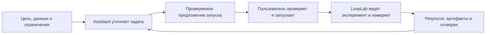
```mermaid
flowchart LR
    U[Цель, данные и ограничения] --> A[Assistant уточняет задачу]
    A --> P[Проверяемое предложение запуска]
    P --> V[Пользователь проверяет и запускает]
    V --> E[LoopLab ведёт эксперимент и измеряет]
    E --> R[Результат, артефакты и оговорки]
    R --> A
```

Текстовый эквивалент: человек описывает задачу; Assistant готовит предложение;
после проверки LoopLab запускает эксперимент; измеренные результаты возвращаются в тот же рабочий диалог.

### 9.2. Внешнее управление: три независимые стороны

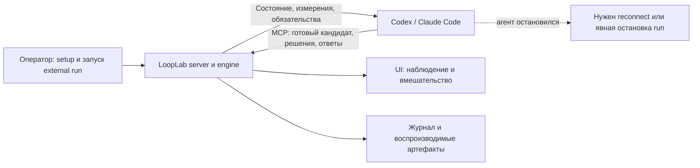
```mermaid
flowchart LR
    O[Оператор: setup и запуск external run] --> S[LoopLab server и engine]
    A[Codex / Claude Code] -->|MCP: готовый кандидат, решения, ответы| S
    S -->|Состояние, измерения, обязательства| A
    S --> UI[UI: наблюдение и вмешательство]
    S --> J[Журнал и воспроизводимые артефакты]
    A -. агент остановился .-> W[Нужен reconnect или явная остановка run]
```

Текстовый эквивалент: оператор подготавливает run; внешний агент предлагает и отвечает;
LoopLab исполняет и сохраняет доказательства. Живой UI не доказывает, что агент продолжает работу.
Большая [архитектурная схема](infographic/architecture-one-pager.svg) остаётся следующим уровнем детализации.

## 10. План изменений по небольшим поставкам

| Поставка | Содержание и затронутые поверхности | Зависимости | Проверяемый результат |
|---|---|---|---|
| A — вход и инструкции | OB-01/02/14; README, home, Installation, Quickstart, guide index; общий Assistant-рецепт из JupyterHub | Нет | Два ясных входа; чистая установка обоих рецептов |
| B — честное ожидание | OB-09 + recovery-часть OB-12; run status, empty canvas, Agent cycle, attention | Текущие state/progress | External wait виден без поиска по меню; нет ложного «готовим» |
| C — первый диалог | OB-03/04/05/07; Assistant, empty Runs, provider setup | A; существующие настройки/health | Новичок подключает модель и формулирует задачу без открытия All settings |
| D — понятный запуск и результат | OB-06/08/13/15; launch summary, настройки, Report, offline demo | C; серверный preview | Понятны измерение, ограничения, расходы и результат; все guards сохранены |
| E — внешний bootstrap | OB-10/11/12; operator setup, MCP discovery, handoff/reconnect guide | A+B; контракт доступа | Новый agent session получает первый measured candidate без ручного поиска endpoint |
| F — приёмка читаемости | OB-16 и проверки обоих путей | B–E | Full HD/2K, zoom, keyboard, реальные новые пользователи |

Для A сначала достаточно существующих команд и документов. Упаковку «одна команда установки»,
новый diagnostic CLI и lifecycle/heartbeat API нужно проектировать отдельно, если они понадобятся
после упрощения текущего пути. Не добавлять ещё один wizard поверх несогласованных инструкций.

### 10.1. Какие документы должны остаться источником истины

1. README — назначение, два входа, короткий работающий старт, ссылки.
2. Общий Quickstart — запуск через Assistant и получение результата.
3. External harness quickstart — подготовка оператором, handoff, первая оценка, reconnect.
4. Installation / Deployment — ОС, среда, JupyterHub, proxy, сборка.
5. Reference — CLI, settings, API/contract, термины, структура артефактов.
6. Номерные документы — причины решений и история; они не обязательное чтение для пользователя.

Новые короткие страницы должны переиспользовать команды и правила из reference. Не копировать
таблицы всех settings и не оставлять две несовместимые версии launch-пути.

## 11. Приёмочная матрица и измерение успеха

### 11.1. Обязательные сценарии

| Сценарий | Успех |
|---|---|
| Чистая Windows и Linux, source install | UI открыт, prerequisites заранее понятны, нет неописанного ручного build шага |
| Нет модели / недоступна / невалидный credential | Ошибка до первого содержательного диалога или явно на этом шаге; доступно исправление с сохранением черновика |
| Модель доступна, задачу описали обычным текстом | Появляется проверяемое предложение; пользователь понимает, что старт ещё не произошёл |
| Неправильный путь / нет scorer / запрещённый edit | Адресная ошибка и понятное следующее действие; нет ложного baseline |
| Offline demo без сети | Есть реальная оценка и Report без обращения к LLM |
| Первый реальный короткий ML-пример | Один измеренный baseline, правильная метрика/direction, доступный артефакт; бюджет соблюдён |
| Двойной Start / потеря ответа / reload | Один run; восстановление той же операции и черновика |
| Внешний run, агент ещё не подключён | Явное ожидание внешнего действия с актуальным blocker |
| Внешний агент пропал до submit и после submit | UI остаётся понятным; после reconnect не дублируется кандидат |
| Checkpoint во время оценки и после её завершения | Видно, кто должен ответить; node не объявлен готовым преждевременно |
| Stop/resume, новая generation, incomplete journal | Состояния различимы; stale command не принимается за актуальный результат |
| Finish obligations ещё не закрыты | Конкретный список оставшейся работы; отсутствие инициативы агента не маскируется под успех |
| Desktop 1920/2560, zoom и keyboard | Нет недоступных основных действий, обрезанных существенных подписей и потери фокуса |

Проверки UI должны проходить через реальные компоненты и серверный контракт; screenshots fixture
недостаточно для lifecycle. Внешний happy path проверять тестовым агентным клиентом с настоящими
durable receipts и evaluator. Текущий аудит **не означает прохождение всей этой матрицы**.

### 11.2. Метрики для первого usability-прогона

Сначала измерить текущую базу на пяти новых пользователях UI и пяти сессиях внешнего агента,
затем повторить после изменений. Это небольшой качественный пилот, не статистическое доказательство.

- Время от открытого UI до понятного launch proposal; отдельно время установки и provider setup.
- Время до первой измеренной оценки; отдельно собственно длительность evaluator.
- Доля прошедших путь без подсказки разработчика и без самостоятельного редактирования Task JSON.
- Число переходов в reference/terminal только для выяснения следующего шага.
- Правильность ответа «кто сейчас действует / ждёт / что нужно сделать».
- Случаи неожиданных платных действий и повторных запусков.

**Предлагаемые цели пилота, не текущие показатели:** 4 из 5 пользователей каждого пути доходят
до первой оценки без помощи разработчика; все понимают момент фактического запуска и режим расходов;
все правильно определяют внешнее ожидание. Для подготовленного demo целиться в ≤5 минут
от открытия UI до результата; сетевую установку зависимостей и реальное обучение считать отдельно.

## 12. Источники и локальная воспроизводимость

### 12.1. Источники реализации на указанной базе

- `README.md`; `docs/index.md`; `docs/guide/{index,installation,quickstart,ui,jupyterhub-onboarding,external-harness}.md`.
- `pyproject.toml` — extras; `ui/package.json` — версия Node; `docs/infographic/architecture-one-pager.svg`.
- `ui/src/{RunList,AssistantChat,LaunchCard,Settings,RunView,panels}.jsx`;
  `ui/src/runIndex.js` — причина misleading empty state.
- `looplab/harness/{manifest,contract,progress,phases,mcp_server}.py` — discovery и обязательства.
- `looplab/engine/orchestrator.py` — ветка `external_harness`; `looplab/serve/settings_store.py` — настройки по run-root.

### 12.2. Команды проб

Из checkout с установленными зависимостями; `<audit-root>` — отдельная новая директория.
Это воспроизведение наблюдений, а не предлагаемая новая главная инструкция пользователя.

```text
python -m looplab.cli ui --run-root <audit-root> --host 127.0.0.1 --port 8766
python -m looplab.cli run examples/toy_task.json --out <audit-root>/first-demo --backend toy --max-nodes 3 --no-genesis
python -m looplab.cli inspect <audit-root>/first-demo
python -m looplab.cli replay <audit-root>/first-demo
python -m looplab.cli harness
python -m looplab.cli run examples/toy_task.json --out <audit-root>/external-demo --backend toy --max-nodes 3 --no-genesis -s external_harness=true
python -m looplab.cli stop <audit-root>/external-demo --wait --timeout 20
```

External run здесь намеренно не получал кандидатов и не был finalized: он использовался
для наблюдения ожидания, затем был явно остановлен. Первый offline run завершён.
Снимки содержат только специально созданные демонстрационные данные.

### 12.3. Проверка документа

- `tests/test_documentation_contracts.py`: **14 passed**; относительные ссылки и реестр номерных документов согласованы.
- `mkdocs build --strict`: **успешно**; новая страница включена в навигацию сайта.
- `git diff --check`: ошибок whitespace нет.
- После исходного аудита изменены UI и документация; итоги повторной проверки указаны в §13.

## 13. Первый пакет исправлений

Это журнал реализации, а не изменение исходных наблюдений выше. Статус «частично» означает,
что у проблемы остались сценарии из приёмочной матрицы §11, которые ещё не закрыты.

| Пункт | Статус | Что сделано | Что остаётся |
|---|---|---|---|
| OB-01 | Сделано | README, главная, индекс и общий quickstart ведут сначала к Assistant; offline CLI сохранён отдельным путём. | Проверить понимание пути с новыми пользователями. |
| OB-02 | Частично | Installation теперь перечисляет поддерживаемые версии Node, source install для Windows/POSIX и нужные extras. | Проверить установку на чистых Windows и Linux. |
| OB-03 | Частично | Пустой Assistant предлагает открыть непосредственно LLM settings. | Проверка соединения и адресная ошибка рядом с composer ещё нужны. |
| OB-04 | Частично | При нуле run убраны подсказки для готового портфеля, список зовёт описать цель. | Сократить сложность навигации первого запуска. |
| OB-05 | Частично | Подсказка для нового run просит цель, путь к коду/данным и бюджет; текст поясняет отдельное утверждение launch proposal. | Проверить формулировку на реальных пользовательских задачах. |
| OB-06 | Частично | Launch card показывает цель, метрику, направление, пути, применимые права и лимиты перед техническими настройками; проверенный обзор берётся из серверного preview. | Проверить читаемость карточки с длинными путями на desktop и с реальным новым пользователем. |
| OB-07 | Частично | Composer показывает активные права и понятное пояснение; четыре варианта раскрываются по запросу, выбор возвращает фокус на видимый переключатель. | Проверить понимание режимов с новым пользователем. |
| OB-08 | Частично | Essential открывается с модели, показывает 13 полей ресурсов и лимитов с короткими пояснениями; технические детали и runtime permissions раскрываются отдельно. | Проверить подключение модели и понимание лимитов с новым пользователем. |
| OB-09 | Частично | Run workspace и Agent cycle показывают next step; списки различают внешний режим и engine, attention открывает текущие вопросы (§34–36). Гибель MCP и pause/resume проверены (§37–38). §47 показывает последнее успешное scoped progress чтение. | Активность запросов не доказывает живость агента; многочасовой сценарий OB-10 ещё открыт. |
| OB-10 | Частично | UI готовит handoff без credential; `connection_check` проверяет live run. Codex/Claude выполнили measured candidates; §37–57 проверяют MCP/UI recovery, pause/resume, engine loss, obligations, monitor, deadline и ASHA. §47–57 — request activity, auth, потерянные/неполные ответы, identity/discovery recovery, отдельный `[harness]` клиент и восстановление пропущенных интерпретаций результатов. | §33: Claude tool cycle с scripted provider. Модельные решения, интерактивное подтверждение инструментов и многочасовой сеанс ещё не проверены. |
| OB-11 | Реализовано | Общий `next_step` в progress/UI, компактный GET и MCP `run_progress`; source health, gates и пагинация сохраняются. §39/41 исправляют ссылки checkpoint/concept base на реальные MCP-фазы; §52 различает unavailable discovery и пустой catalog; §53 убирает FastAPI dependency из `phase_info`; §54–55 дают cursor и typed MCP read для результатов; §56 — проверенный repair recipe; §57 — original ACK для superseded review/decision. | Проверены контракт, subprocess-кандидаты, desktop и discovery из серверной подсказки; подключение нового клиента относится к OB-10. |
| OB-12 | Реализовано | Recovery-рецепт в UI/MCP/guide; original receipt без worker restart, поиск по ID/key. §37–57: source health, lifecycle verdict, engine recovery, obligations, monitor, retarget, idle recovery, activity, unknown acknowledgement, identity квитанции, minimal client и пагинация результатов без дублей интерпретаций. | Проверены гибель MCP/engine, restart UI, потерянные подтверждения, pause/resume и reset без дубля кандидата. §49–53 повреждают реальные replies, включая discovery. §54 восстанавливает сообщения после reconnect. Наблюдение запросов не измеряет живость агента. |
| OB-14 | Частично | Начало сайта показывает два основных входа. | Большая архитектурная схема всё ещё нуждается в упрощении для первого знакомства. |

Остальные пункты §3 и соответствующие сценарии §11 остаются открытыми. Изменения первого
пакета проверены на desktop 1920 × 1080 в пустом UI и на настоящем внешнем run без узлов;
это не доказывает прохождение всей приёмочной матрицы.

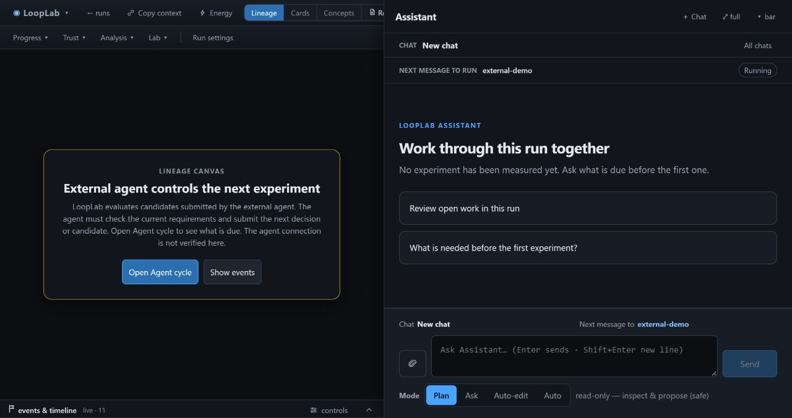

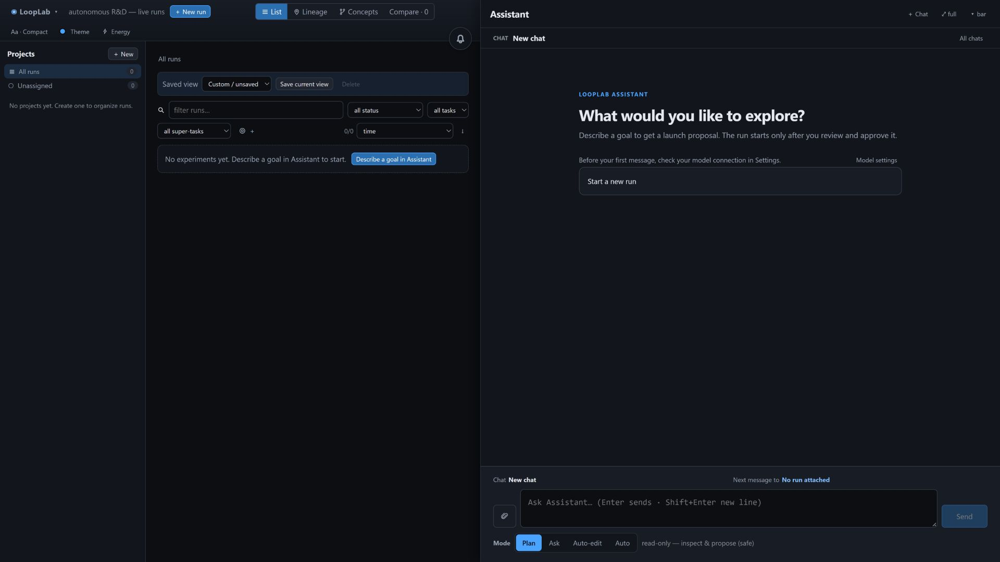

Повторная проверка: **1761/1761 UI тестов**, **14/14 проверок документации**,
`npm --prefix ui run build`, `npm --prefix ui run check:bundle` и
`mkdocs build --strict` прошли. Внешний тестовый run остановлен; его 0 узлов
не выдаются за измеренный результат.

## 14. Упрощение пустого рабочего пространства

На действительно пустой установке без проектов, сохранённых видов, фильтров и незавершённых
операций список Runs теперь показывает один стартовый экран. Навигация по портфелю, сортировка,
фильтры, плотность и эффекты появляются после первого run или при наличии сохранённого контекста.
Существующие проекты, виды и recovery не скрываются. В черновике нового run Assistant напоминает
о путях на сервере и показывает короткий пример цели с лимитом экспериментов. Это дальнейшая работа
по OB-04/05; остальные ограничения, перечисленные в §13, сохраняются.

## 15. Первый акцент отчёта

По OB-13 платное обновление Report перемещено после бесплатных действий чтения и экспорта
измеренного результата. Его кнопка больше не выделена как основное действие. Текущие
предупреждение о стоимости, idempotency и восстановление ответа сохранены. Более короткий
детерминированный итог в чате остаётся открытой задачей.

## 16. Подключение модели из черновика

Ссылка на настройки модели теперь остаётся видимой и после начала черновика первого run.
Переход в Settings и обратно сохраняет черновик Assistant. Подсказка в Settings перечисляет
порядок действий: Model и Base URL, сохранение, затем явная проверка соединения. Проверка может
стоить денег; для локального endpoint ключ может не требоваться. Статус соединения пока не
показывается возле поля чата автоматически, поэтому OB-03 остаётся частично открытым.

## 17. Короткий Quickstart

Общий [Quickstart](guide/quickstart.md) теперь заканчивается после пяти шагов через Assistant
и короткой ссылки на альтернативы. Подробные offline demo, `inspect`/`replay`, пример с живой
моделью и crash/resume перенесены в отдельный [CLI walkthrough](guide/cli-walkthrough.md).
Старый якорь `#offline-cli-walkthrough` оставлен в Quickstart как переход, а ссылки сайта,
README и установки ведут сразу к полному рецепту. В настройке Assistant пояснено, что
локальный endpoint по умолчанию требует работающего Ollama и загруженной модели; сохранённые
значения не доказывают доступность соединения. Сборка MkDocs в строгом режиме и 14 проверок
документации прошли. Offline toy run на двух узлах завершился с измеренным результатом;
`inspect` и `replay` его прочитали.

## 18. Статус модели рядом с первым диалогом

Пустой Assistant теперь читает сохранённую конфигурацию через `GET /api/settings` и показывает
имя модели, а также отдельные состояния: соединение не проверено, последний явный тест прошёл,
тест не прошёл, исход теста неизвестен или настройки не удалось прочитать. Для состояния ключа
`missing` локальная модель не объявляется неисправной. Результат теста передаётся из Settings
без ключа и сверяется с обеими ревизиями сохранённых настроек; после изменения модели старое
«тест прошёл» не показывается. Обновление статуса само не обращается к провайдеру и не может
подтвердить текущую доступность модели без явного теста. После обновления страницы результат
теста не восстанавливается, поэтому честно возвращается «соединение не проверено».

Это продвигает OB-03, но не закрывает встроенное редактирование endpoint и модели возле composer.
Проверка: 1765 UI-тестов, 14 контрактных проверок документации, сборка UI,
`check:bundle` и `mkdocs build --strict` прошли. Лимиты бандла обновлены по измеренным
размерам; начальный JS остаётся в прежнем пределе, статус загружается только для первого run.

## 19. Смысл запуска перед техническим preview

По OB-06 карточка запуска теперь начинает свёрнутый обзор с блока **What this run will do**:
цель, заявленная метрика и направление улучшения, пути к коду/данным, применимые правила
редактирования, лимит экспериментов и времени. Для task file до бесплатной валидации
карточка не угадывает его содержимое. Если поле отсутствует в предложении, она прямо
пишет, что оно не указано. После валидации обзор строится из серверного preview; изменение
черновика по-прежнему инвалидирует проверку. Точные команды, JSON, параллельность и
раскрытие стоимости остаются в карточке ниже.

## 20. Режим чата без обязательного изучения четырёх вариантов

По OB-07 под полем сообщения теперь видны **Permissions · Plan** (или текущий режим)
и пояснение того, что Assistant сможет сделать. Четыре режима доступны в раскрываемом
списке; каждый объясняет автоматические действия и необходимость подтверждения до выбора.
В Ask явно указано, что повторное действие можно одобрить только для текущего turn.
Для нового run подсказка показывает последовательность: обсудить цель, проверить карточку
через Validate, выбрать Start run. Прямой запуск оператором из карточки возможен и в Plan.

Раскрытие списка не меняет права. Выбор сохраняет существующие канонические mode ID и
политику сервера; заблокированные варианты можно прочитать, но нельзя применить.
После выбора список закрывается, фокус возвращается на его summary. Enter раскрывает
и закрывает список. Настройки composer по-прежнему принадлежат конкретному чату.

Проверка на изолированном пустом UI: 1920 × 1080 и 2560 × 1440, раскрытие с клавиатуры,
подготовка нового run без отправки сообщения. Горизонтального переполнения у composer
и выбора прав нет. **1769/1769 UI-тестов**, production build и `check:bundle` прошли.
Один лимит owner List JS обновлён по измерению 220 270 B (+314 B); остальные лимиты
и начальная загрузка укладываются в прежние пределы.

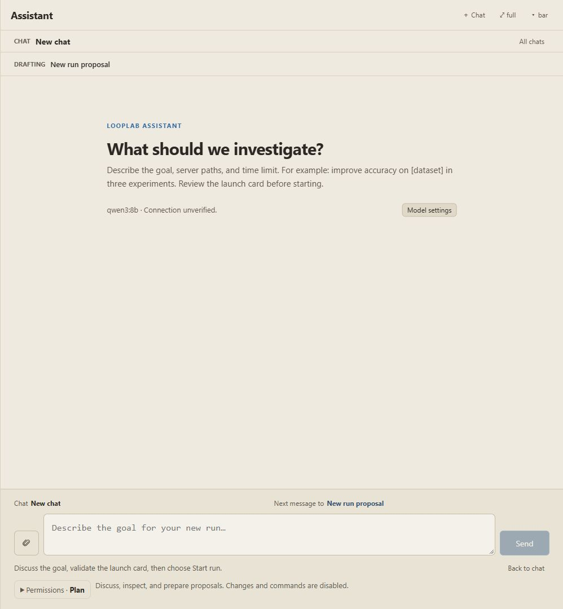

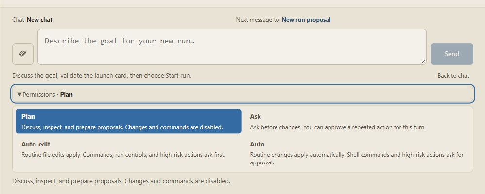

## 21. Начальные настройки: модель, ресурсы и лимиты

По OB-08 **Essential** сокращён с 18 до 13 полей в трёх разделах. Первым открывается
**Model**, где Model, Base URL и API key идут перед выбором experiment runner. Затем
**Experiments & resources** и **Time & model budgets**. Profile, Policy и настройки
внутренних ролей доступны через **All** и поиск. Дефолты, типы, ограничения значений,
права и механизм сохранения не изменены.

Короткие пояснения сохраняют смысл `0 = AUTO` для параллельности при запуске,
пустых временных лимитов и нулевых бюджетов модели. Денежный лимит и лимит токенов
теперь видны в Essential. Денежный контроль использует оценки и требует цен провайдера;
он не обещает точный итоговый счёт. Бюджеты run не включают Assistant chat.
Полное исходное описание доступно через **Technical details**, права внутренних
ролей — через **Runtime permissions**. Раскрытие не меняет права.

Подсказки хранятся в серверном каталоге настроек и проверяются его loader, HTTP-моделью
ответа и клиентом. **All** сохраняет все 249 полей; поиск охватывает весь каталог,
включая технические ключи. При переключении All/Essential сохраняется выбранный раздел.
Quickstart и UI guide обновлены под новые названия разделов.

Проверка: **1771/1771 UI-тестов**, затем **39/39** адресных проверок после уточнения
порядка полей; **3/3** HTTP-проверки каталога. Production build и `check:bundle` прошли.
Предел owner DAG JS обновлён по измерению 399 477 B (+272 B); начальная загрузка,
остальные пределы и проверки разделения маршрутов проходят без изменения лимитов.
На изолированном UI проверены 1920 × 1080 и 2560 × 1440, навигация по вкладкам
клавиатурой, раскрытие полного пояснения, All и поиск MCTS из Essential.
Горизонтального переполнения формы нет. Проверка подключения к реальному провайдеру
и исследование с новым пользователем в этот пакет не входят.

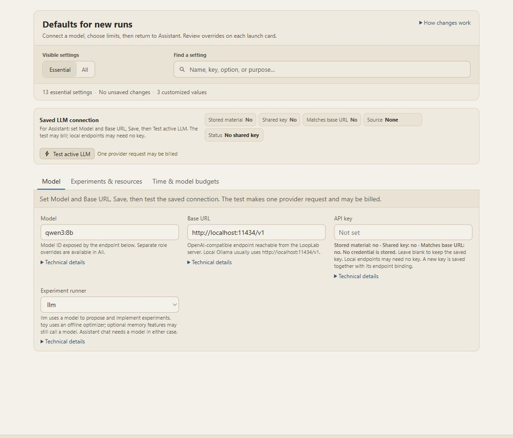

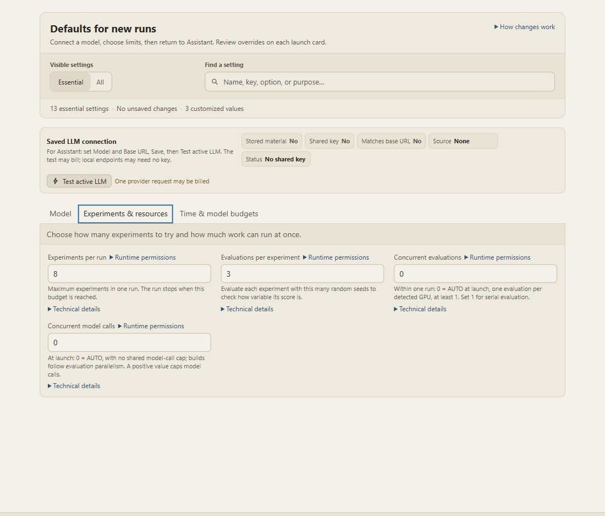

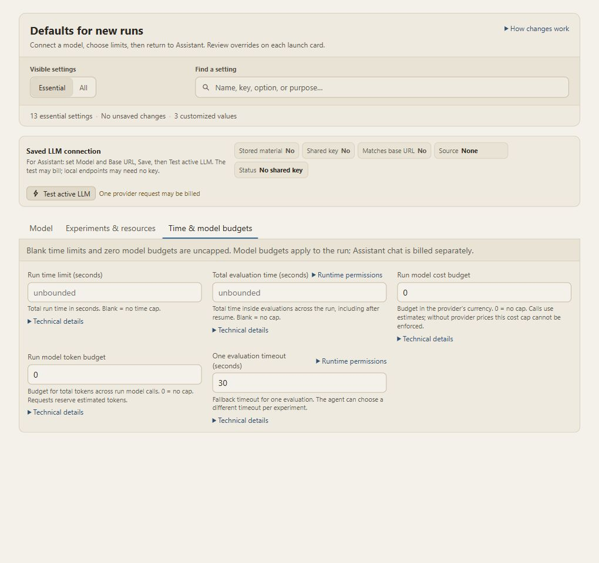

## 22. Понятный результат в чате и карточке эксперимента

По OB-13 завершённый run теперь показывает в Assistant бесплатный **Run result**:
первый допустимый эксперимент, результат, выбранный движком, направление метрики,
наличие confirmation и записанные caveat. Сводка строится из уже кешируемого fold
списка запусков: дополнительных запросов к модели и чтения detail при открытии нет.
Первый допустимый эксперимент не объявляется task baseline; разность двух чисел
не превращается в доказанное улучшение. Выбор берётся из состояния движка, включая
приоритет confirmation, а не переопределяется сортировкой сырых score в браузере.

**Read Report**, **Open selected code** и **Find artifacts** ведут к существующим данным.
Код открывается с точными run generation, node ID и attempt. **Ask about this result**
только готовит вопрос в composer; непустой черновик не перезаписывается. Запрос к модели
делает отдельный Send. В историческом режиме живая сводка не примешивается к snapshot.
Незавершённая финализация не выглядит готовым результатом; неполный источник или
некорректная сводка скрывают числа и объясняют отсутствие данных. При появлении карточки
чат прокручивается вниз только если оператор уже читает его конец.

В **Overview** отдельного эксперимента новый блок **Experiment result** заменяет
неподписанные `metric` и `feasible = true` на понятные части: evaluation score,
направление улучшения, источник значения, confirmation mean, число успешных seeds,
standard deviation и статус допустимости. Отсутствующие данные и один seed не
называются надёжным результатом. В Metrics подпись `robust mean` заменена на
`confirmation mean`. **All metrics & repeat checks** и **Review trust evidence**
открывают нужную вкладку инспектора, не запускают новую оценку.

Для родителей показаны их evaluation score и три состояния условий оценки:
совпадение подтверждено записью, различие с причиной, либо данных недостаточно.
Используется существующая проверка comparability; два отсутствующих receipt не
считаются совпадением. Эти условия не удостоверяют одинаковую процедуру confirmation.
После retarget блок просит проверить источник новой objective в Metrics.
Родительская связь и отсутствие родителей сами по себе не означают ни улучшение,
ни наличие task baseline. Удалённые, aborted и незавершённые эксперименты не
представляются успешно выбранным результатом.

Проверка: **1777/1777 UI-тестов**, затем **3/3** адресных после уточнения пояснения
о повторных проверках; **76 Python-тестов прошли, 1 пропущен**: выбранная строка
не меняет generation token, а его fence проверяется отдельными тестами.
Production build, `check:bundle`, контракт документации и строгая сборка MkDocs прошли.
Лимиты обновлены только для измеренного роста total и owner DAG/Concepts:
587 246 B JS / 57 353 B CSS всего, 400 869 B JS / 46 371 B CSS для owner DAG,
264 356 B JS для owner Concepts. Начальная загрузка остаётся 80.9 KiB JS / 35.8 KiB CSS;
проверки разделения owner/review маршрутов не ослаблены.

На реальном offline toy run из трёх оценённых узлов проверены `inspect`, `replay`,
сводка 78.35 → выбранные 8.053 без заявления доказанного улучшения, переходы к
точному коду, Files, Metrics и Trust. Подготовка вопроса не создала сообщения.
На 1920 × 1080 и 2560 × 1440 горизонтального переполнения блоков нет.
Это продвигает OB-13; достоверное обозначение toy backend и проверка с новым
пользователем остаются отдельными пунктами, поэтому весь пункт не закрыт.

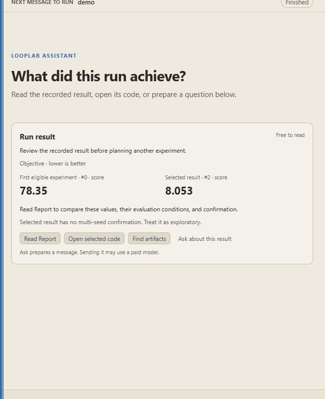

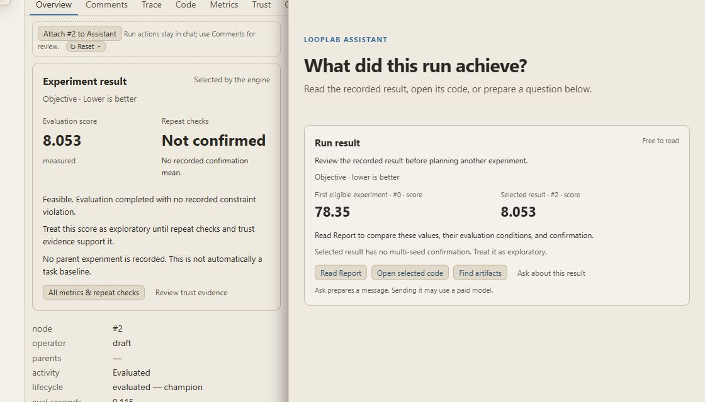

## 23. Явная проверка модели рядом с первым диалогом

Следующий шаг по OB-03: **Check connection…** открывает проверку прямо в первом Assistant,
рядом с черновиком задачи. Открытие читает и валидирует сохранённые настройки и каталог,
не обращается к провайдеру. **Test active LLM** запускается отдельно, с видимым пояснением
возможной оплаты. Ошибка, незавершённая операция и неизвестный результат остаются видимыми
в этом блоке. **Edit model settings** ведёт в существующую настройку модели.

Компонент health вынесен из Settings без второго механизма проверки. Settings и Assistant
используют один deadline, server-resolved active configuration, revision fence, operation ID
и recovery record. Двойное нажатие создаёт одну операцию. После ухода из незавершённой
проверки повторное открытие предлагает **Check previous result** с прежним ID и replay-only
запросом. Обычный новый тест заблокирован при terminal unknown; создание новой операции
сохраняет существующее явное подтверждение возможного повторного списания.
Тест не отправляет черновик чата и не меняет credential.

Настройки чтения проверяются тем же валидатором, что и Settings. Неполный ответ не включает
кнопку теста. Во время проверки и при неизвестном исходе сохраняется launch guard;
навигация не снимает recovery fence. У пояснений health теперь уникальные ARIA ID,
чтобы несколько поверхностей не ссылались на чужую подпись. При открытии блока фокус
переходит в него, если после удаления исходной кнопки фокус остался на body; текущий
фокус composer не перехватывается.

Проверка: **1780/1780 UI-тестов**, затем **11/11** адресных после поправок компоновки,
фокуса и сценария terminal unknown; **30/30** Python-проверок документации и настроек.
Production build, `check:bundle` и строгая сборка MkDocs прошли. Начальный JS остаётся
около 81 KiB; контроль загружается по явному открытию. После выделения общего health-компонента
лимиты total и двух DAG closures обновлены по измерению; ограничения разделения маршрутов
сохранены. Состояния успешного ответа, двойного нажатия, неполного envelope, ухода в полёте,
replay-only и terminal unknown проверены на смонтированных компонентах с HTTP fixtures.

На отдельном пустом UI при 1920 × 1080 и 2560 × 1440 проверены читаемость и перенос блока.
Черновик сохранён при открытии проверки и переходе в Settings. В браузере провайдер не
вызывался: показанное **Connection unverified** не объявляется живым соединением.
Редактирование model/endpoint остаётся в Settings; подключение реального провайдера
и проверка понимания с новым пользователем остаются в приёмке OB-03.

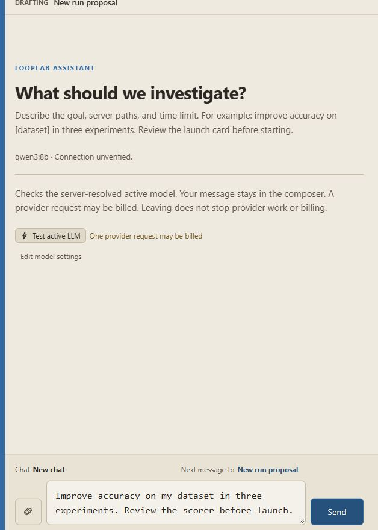

## 24. Выбранный результат и понятный следующий шаг в Report

**2026-10-01.** Исправлено расхождение между Assistant и Report: вывод отчёта теперь берёт
реально выбранный движком узел, а не последний минимум/максимум числового фронтира.
Отсутствующий, незавершённый, исключённый или удалённый выбранный результат не становится
успешным итогом. Один эксперимент называется первым допустимым результатом, без заявления
об улучшении относительно автоматически придуманного baseline.

Сравнение показывает именно evaluation scores и допускается только при записанных совпадающих
условиях, известном направлении и допустимости обоих узлов. Неизвестная/иная сопоставимость,
неполный журнал и retarget оставляют сравнение неустановленным. Confirmation mean показан
отдельно: receipt базовой оценки не переносится на средние повторных проверок.
Эвристический ярлык `robust` удалён; `repeat-checked` описывает число повторов, сохраняя
оговорку о том, что они не доказывают обобщение и статистическую значимость.

Рядом с выводом появился **Next step**: сначала разобраться с флагами Trust, установить
условия сравнения или проверить повторы. Графики и таблица обозначены как записанный
числовой фронтир; сумма его изменений больше не называется доказанным улучшением.
Разделы **Selected experiment** и **Reproduce — selected solution** не обещают победителя.
UI, Markdown и Model card используют один детерминированный вывод и следующий шаг.

Интегрированы 50 свежих коммитов `origin/master` до `5ad3e7c45` без конфликтов.
После интеграции: **1787/1787 UI-тестов**, затем **26/26** адресных после финальных подписей;
**105/105** Python-проверок документации, настроек, проекции результатов и agent-token scope.
Production build и все size/reachability gates прошли: total JS 590319 B gzip,
initial JS 82912 B; total ceiling обновлён до 577 KiB по измерению, остальные сохранены.

В браузере проверен ранее измеренный 3-node quadratic run: выбран #2, score 8.053;
нет ложного доказанного улучшения при неизвестной сопоставимости. При Full HD и 2K блок
вывода не переполняется, ошибок консоли нет. Чтение не вызывало провайдера.
`toy` не используется как признак синтетических данных: этот backend может исполнять реальные
задачи. Достоверное обозначение demo для всех старых запусков остаётся открытым пунктом OB-15.

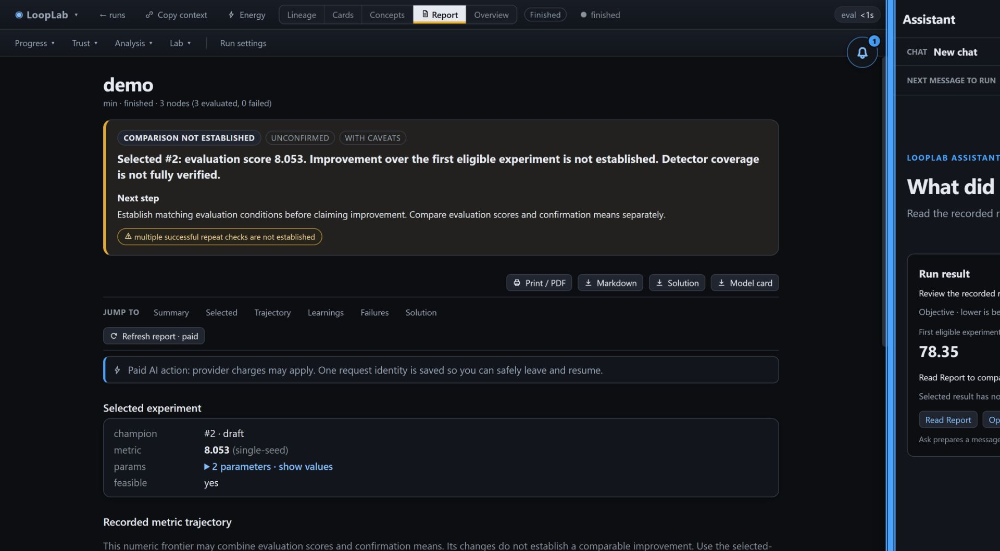

## 25. Короткий следующий шаг для внешнего агента

**2026-10-01 · OB-11.** `harness-progress.next_step` даёт одну текущую подсказку:
ответственный агент, причина, адреса чтения, phase и требуемый ответ. Приоритет — неполные
источники, затем открытый checkpoint. Пауза, finish и stop intent требуют сверки с live state
и receipts; запись журнала не доказывает, что процесс движка или агента жив. Незавершённые
кандидаты видны как unsettled, а окончание evaluator не заменяет обязательный verdict.

Продолжение и завершение остаются разными решениями. Research/report/concept/selection gates
перед новым кандидатом не навязываются агенту, который решил закончить. Сводка использует
существующие проверки admission/finalization; она не создаёт кандидат, не запускает Researcher
и не обещает допуск по одному отсутствию cycle gate. Idea-bound reviews и task edit surface
сохраняют свои ограничения.

MCP `run_progress(run_id, expected_generation)` читает
`harness-progress?brief=true` одним GET с текущей generation. Ошибки HTTP сохраняются;
скрытого retry/resume/POST нет. Инструмент объявлен read-only. Компактный ответ сохраняет
source health всех четырёх источников, требования continuation/finish, количества и pagination
receipts; тела истории и наблюдений читаются адресно. Списки вопросов/узлов ограничены 20
с явными total/truncation. Полные allowed verdicts берутся из checkpoints, а policy actions —
из полной progress-проекции. Policy остаётся советом.

UI **Progress → Agent cycle** показывает ту же серверную сводку над деталями. Событие запускает
повторное чтение, sidecar-only ответы подхватывает polling. После проваленного refresh или
при более новом известном event подсказка снимается; последние журналы остаются явно прошлыми
данными. Старый сервер без дополнительного поля продолжает показывать прежние секции.

Быстрый live-прогон на отдельном root: scoped harness token, реальный CLI engine и HTTP API,
вызов MCP tool. Первый quadratic-кандидат упал с исключением, второй исполнен sandbox и
измерен со score **0**. Проверены durable inject receipts, pause, resume, явный finalize,
409 на старой generation, `inspect` и replay. Итог — 2 узла, 1 failed и 1 evaluated;
компактный ответ finish занял **2724 B**. Это offline quadratic smoke, не MNIST и не проверка
научных суждений модели. Штатный perfect-metric Trust flag сохранился и был виден в Report.

Проверены 1920 × 1080 и 2560 × 1440: сводка и раскрытые маршруты читаемы, горизонтального
переполнения нет, ошибок консоли нет. Визуальная проверка выявила наследование flex-строки
от report status; исправлено отдельным блочным стилем сводки. Production bundle: **590849 B**
JS gzip, initial **82916 B**; total ceiling 578 KiB и Concepts closure 260 KiB обновлены по
измерению (+530 B total / +9 B closure), остальные size/reachability gates сохранены.

Автоматизированные проверки: 193 replay-теста; 157 Python-тестов external progress, MCP,
реального external engine, checkpoints, scope, phase/API contract и doc budgets;
1789 UI-тестов. После визуальной правки прошли 15 адресных UI/bundle-проверок и повторный Python-набор.
Production build, `check:bundle` и строгая сборка документации прошли.

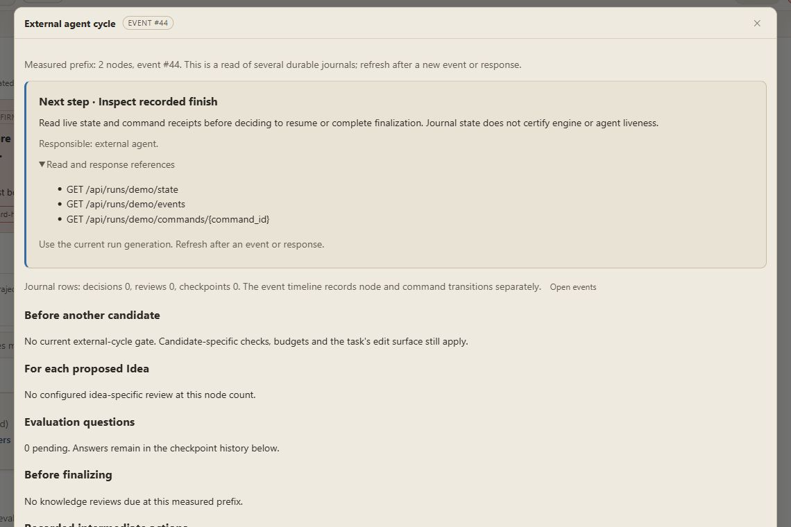

## 26. Подключение внешнего агента из UI

**2026-10-01 · OB-10.** В **Progress → Agent cycle → Connect external agent** оператор
получает адрес сервера, фактические run-root/run-dir, идентичность запуска и probe движка.
Чтение `harness-handoff` проверяет generation, external mode, целостность event history
и сохранённые task/config. В инструкцию входят ограничения editable surface, protected names
и operator stages; списки ограничены 40 строками с явными total/truncation. Полный task/contract
по-прежнему обязателен. Пути относятся к серверу и могут быть недоступны на машине клиента.

Три шага: настроить stdio MCP process, отдельно передать scoped credential, скопировать
инструкцию агента. Generic descriptor содержит только executable, args и URL; секреты и
owner credential не копируются. URL сохраняет proxy prefix и очищает user/password/query/hash.
Из names/paths удаляются известные секреты. Сервер сообщает только факт настройки harness token,
а не успешную авторизацию клиента. Scope шире одного run — рекомендован отдельный server/root.
Если token не настроен, показан operator setup. Owner token не предлагается для обхода launch gate.

Копирование не меняет MCP config и не запускает/resume эксперимент. При неуспешном refresh
или более новом наблюдаемом событии контекст и copy снимаются. При запрете clipboard инструкция
доступна для ручного копирования. После подключения агент сверяет текущие generation/run UID,
читает receipts, checkpoints и progress; pause/finalize остаются явными решениями.
Живой UI или engine не объявляется доказательством подключения внешнего агента.

Локальная приёмка: отдельный root, настоящий CLI engine и MCP SDK **2.2.0** через stdio.
Прошли initialize, capabilities, phases/phase_info и scoped run_progress; попытка MCP launch
отклонена **403**. Owner credential не передавался MCP process. Два реальных быстрых кандидата:
первый упал с исключением, второй quadratic измерен со score **0**. Проверены pause/resume,
явный finish, stale generation **409**, inspect/replay. Это offline smoke, не MNIST и
не доказательство качества научных решений модели. Версионная приёмка установленных
Codex/Claude клиентов и их secret storage остаётся открытой частью OB-10.

Дополнительно исправлен `run_progress` для буквальных run ID с пробелами, `#` и `%2F`:
ID URL-encoded ровно один раз; настоящий slash/traversal остаётся запрещённым.
Буквальное имя проверено через реальный HTTP server и ASGI transport; Starlette TestClient
повторно декодирует такой path, поэтому этот кейс не проверяется через его sync transport.
Route coverage теперь учитывает production static routes независимо от наличия UI build;
реальные запросы записаны recorder, dispatch отдельно проверен с built/unbuilt UI.

Проверки: **193 replay**, **204 Python** (1 существующий skip), **1792 UI**; production build,
`check:bundle` и строгая сборка документации. JS gzip **592872 B** (+2023 B), initial **82912 B**; total ceiling поднят
до 580 KiB по измерению, route/reachability ceilings сохранены. Desktop проверен в браузере
на **1920 × 1080** и **2560 × 1440**: без горизонтального переполнения и ошибок консоли.

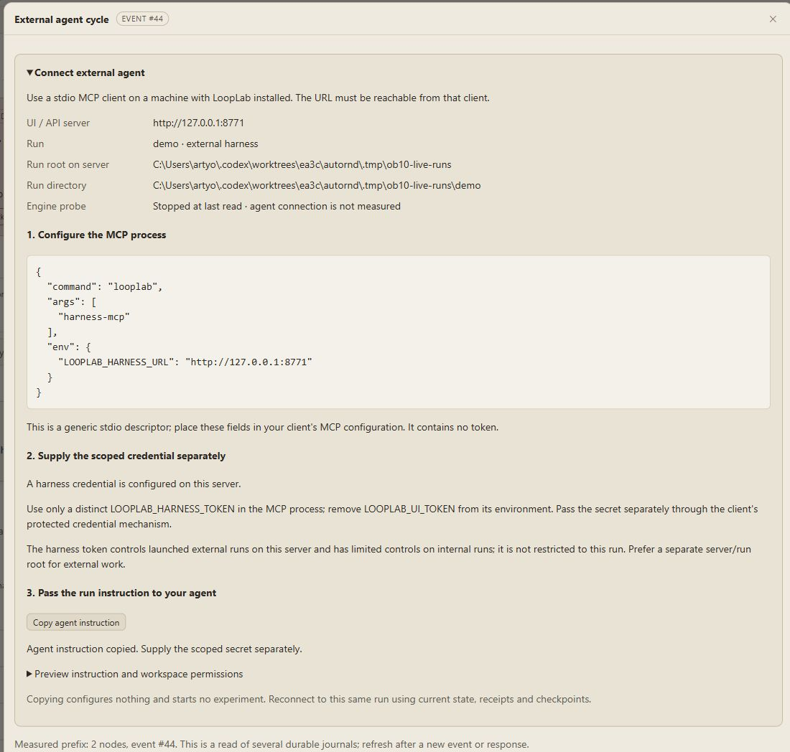

## 27. Восстановление внешней сессии и потерянного ответа

**2026-10-01 · OB-12.** У существующего `GET /commands/{command_id}` есть намеренная
семантика crash recovery: nonterminal record может перезапустить worker и продолжить
команду. Для предварительной проверки добавлен отдельный **read-only command_receipt**
в MCP и `GET /api/runs/{run_id}/command-receipt`. Общий `next_step` теперь указывает
на это наблюдение. Исходный Idempotency-Key позволяет найти receipt, даже когда POST
ответ потерялся и command ID неизвестен; вычисление identity разделяется с submit.
Ключ передаётся в header, не URL. Обязательна текущая generation, проверенная до и после чтения.

Этот GET не берёт exclusive sequencer, не запускает worker, не изменяет и не чинит record.
Вывод ограничен status/type/ID, intent seq и кодом ошибки; payload, hashes и error prose
исключены. Чтение файла ограничено 2 MiB; malformed/oversized/unreadable receipts дают отказ.
Пустой record не удаляется. 404 не доказывает отсутствие применённой команды, 409 требует
сверить identity, 503 требует проверить storage. Snapshot может отставать от event log.

В **Agent cycle → Connect external agent → Reconnect or recover a lost response**
показан recovery-рецепт и явное чтение по original key или command ID. Ввод не отправляет
запрос; кнопка выполняет один GET. Данные формы живут только в памяти, при смене identity
предыдущий результат снимается, проваленный refresh скрывает прежний status. Обновление
handoff из-за нового event не теряет вводимый ключ; recovery доступен и при отказе handoff read. `succeeded`
не выдаётся за завершение train/успешную научную оценку. MCP phase `recovery` показывает
границу явного resume/retry/pause/finish и operator-only разрешения зависшего activity claim.

Live smoke: настоящий CLI engine и две последовательно открытые stdio MCP-сессии.
Первая отправила quadratic candidate и отключилась; response ID был отброшен, движок
самостоятельно завершил оценку со score **0**. Новая MCP-сессия нашла original receipt
по ключу; байты `.commands` и `events.jsonl` не изменились. Exact-key resubmission вернул
тот же command ID, число узлов осталось **1**, дублей **0**. После pause engine остановился,
новый reconnect/read не запустил его. Затем выполнены явные resume и finish.
Внешний agent heartbeat и автоматическая замена агентом LoopLab не вводились; сервер
не заявляет удалённую живость по тишине журнала. Это offline quadratic smoke, не MNIST.

Проверки итогового набора: **364 Python** (5 существующих skip: Windows symlinks, `/proc` и fence), **1793 UI**, **193 replay**.
Дополнительно проверены invalid selectors, oversized/corrupt receipt, fence во время reset,
header-only key, отсутствие storage writes и скрытие stale UI. Production build,
bundle gates и строгая документация прошли. После последней правки OpenAPI header отдельно
проверены receipt, phase contract, route wiring и API reference. Измерено **594179 B** JS gzip,
initial **82912 B**; total ceiling 581 KiB, остальные route/reachability ceilings сохранены.
Desktop **1920 × 1080** и **2560 × 1440**: без горизонтального переполнения и ошибок консоли.

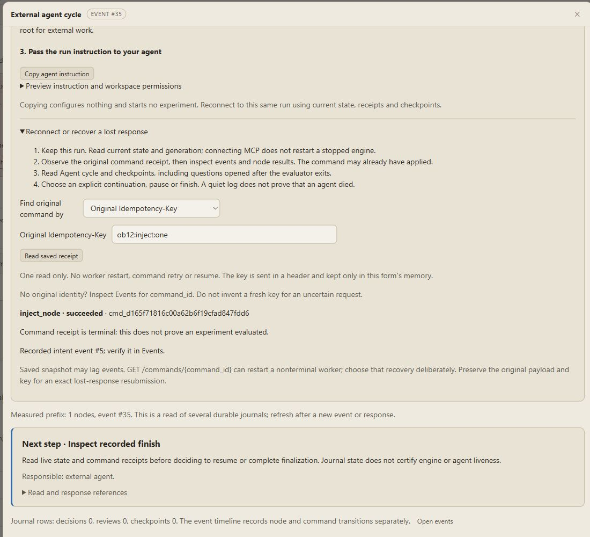

## 28. Краткий итог каждого эксперимента в чате

**2026-10-01 · OB-13, понятность результатов.** Assistant показывает короткие итоги
завершённых оценок: метрику и направление, доказанное сравнение с родителем,
подтверждение несколькими seeds, ограничения и переход к Metrics/Trust или Trace.
Итог run появляется после финализации и освобождения движка. Неизвестная живость,
запрос остановки и выход train-команды не считаются завершением run.
Последние три итога раскрыты, предыдущие свёрнуты; доступны EN/РУ.
Развёрнутый результат и файлы решения остаются в отдельном раскрываемом блоке.
Кнопка «Объяснить результат в чате» или «Разобрать ошибку в чате» готовит вопрос
об этой попытке. Пользователь отправляет его сам; существующий черновик сохраняется.
Русские подписи поясняют случайную инициализацию и переводят типичные причины ошибок.
Вопрос после ошибки просит найти причину в Trace/логах и предложить минимальное
исправление; подпись объясняет отдельный шаг отправки подготовленного вопроса.

LoopLab строит эти записи из измеренной истории без вызова модели. Внешний агент
добавляет интерпретацию до 700 символов через `POST /result-notices`, прочитав
generation, receipt ID и evidence token из GET. MCP phase `result_summary`, harness
contract, handoff и AGENTS.md объясняют этот шаг. Prompt встроенного Assistant
также требует краткого заключения при завершении наблюдаемого эксперимента.
Отсутствие интерпретации не блокирует run и не создаёт скрытого ожидания агента.

Комментарий сохраняется отдельно от owner chat, метрик и команд. Exact retry после
потерянного ответа возвращает тот же результат; одна версия receipt допускает один
комментарий. Изменение попытки, provenance, confirmation или ограничений снимает
устаревший текст. Reset родителя не подменяет историческое сравнение дочернего узла.
События завершения показываются в порядке фактического окончания, включая параллельные
оценки. Ошибка чтения скрывает прежние числа и предлагает явный retry.

Локальная приёмка: настоящий CLI engine, stdio MCP и защищённый scorer линейной
регрессии с отдельной validation-сеткой. Две конфигурации выполнили обучение:
MSE **0.7807408706494512** и **0.000012609385167897514**. Третья завершилась ошибкой
из-за нулевого числа шагов, без метрики. Агент опубликовал три кратких объяснения и
итог run; reconnect и точный повтор не создали дублей. Защищённый scorer не изменён.
`inspect` и `replay` прошли. Это быстрая проверка интеграции, не MNIST и не
подтверждение превосходства по нескольким seeds.

Полный UI-набор: **1796 passed**; после финальной правки компоновки — **15 focused passed**.
Серверные проверки охватили fencing, auth, idempotency, повреждённые источники,
finalization, provenance, replay и границы пакетов. Найденный module-level import
исправлен; итоговая проверка result notices, layering, API reference и doc budgets —
**26 passed**. Production build, bundle gates и строгая сборка документации прошли: JS gzip **599253 B**,
initial **82912 B**; total ceiling 586 KiB, остальные route/reachability ceilings сохранены.
Desktop проверен на **1920 × 1080** и **2560 × 1440**, без горизонтального переполнения.

Итоги относятся к текущему run и актуальным попыткам; это проекция в живом чате,
не копия в каждом Assistant session или публичном snapshot. GET по умолчанию отдаёт
50 итогов, максимум 200; полная история остаётся в Events. Автоматический вызов модели
после каждого узла не добавлен. Оставшиеся задачи OB-13 этим пунктом не закрываются.

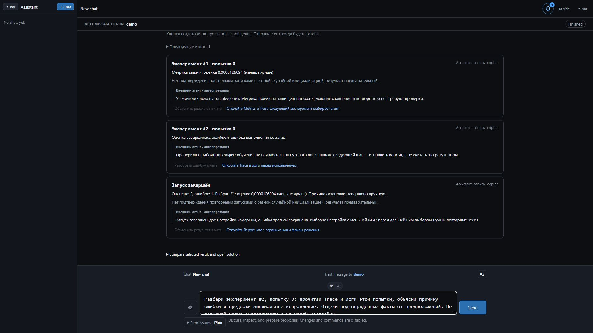

## 29. Язык Assistant доступен до первого запуска

В строке ввода, боковом и полном чате появился постоянный выбор **Auto / English /
Русский**. Раньше EN/РУ переключал только краткие итоги уже завершённых экспериментов.
Теперь выбор управляет языком новых ответов Assistant, кратких итогов и подготовленных
вопросов. Русский режим также переводит основные кнопки, подсказки, описание прав и
подробную карточку результата в чате. Другие вкладки и технические сообщения пока
не локализованы полностью; прежние ответы модели и тексты внешнего агента не переводятся.

Выбор сохраняется в браузере и синхронизируется между видами чата и вкладками. Старый
выбор языка итогов подхватывается при первом открытии. Auto оставляет язык ответа
модели на усмотрение сообщения пользователя; шаблонные итоги в Auto остаются английскими.
Смена языка не отправляет сообщение, не вызывает модель, не меняет права и не стирает
черновик. Сервер принимает только auto/en/ru и сохраняет язык с сообщением: восстановление
прерванного запроса использует исходный выбор, даже если настройка браузера уже изменена.

Проверка: **1798 UI tests passed**; серверные наборы replay/Assistant — **262 passed**,
дополнительно language/watch/continuous work/streaming/layering/API/docs — **114 passed**
(9 языковых тестов входят в оба набора). Обе API-формы передают язык в настоящий
`run_turn` со scripted model client; неизвестный язык отклоняется до записи и вызова
модели. Production build, проверки bundle/reachability и строгая сборка документации
прошли. Рост JS gzip — 3686 B за переводы и выбор языка; initial shell вырос на 57 B,
карточки результатов остаются lazy. Десктоп проверен на **1920 × 1080** и
**2560 × 1440**: выбор виден, черновик переживает переключение, язык переживает reload,
горизонтального переполнения нет. Живая платная модель в этой проверке не вызывалась.

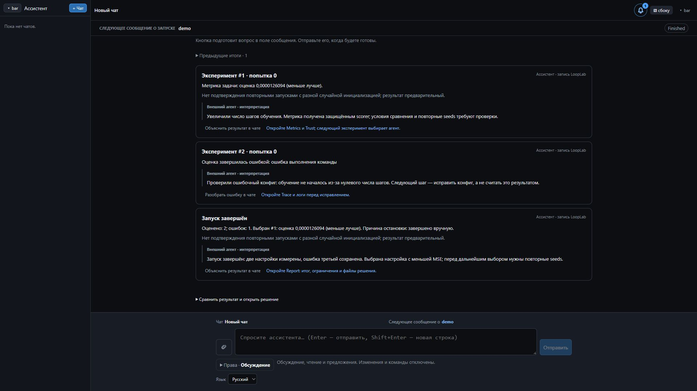

## 30. Что измерено, с чем сравниваем и что делать дальше

Краткие итоги в чате получили видимый статус и отдельные строки **Сравнение**,
**Надёжность**, **Дальше**. Числа и комментарий агента остаются разными источниками.
Ссылки теперь короткие: **Открыть метрики**, **Открыть логи**, **Открыть отчёт**.
Они сохраняют generation и точную попытку. Технические коды ограничений заменены
пояснениями; неизвестный код остаётся видимым и помечается как неизвестный.

Исправлена неоднозначность сравнения: среднее повторных запусков могло стоять рядом
с утверждением о сравнении основных оценок без указания разных типов измерений.
Теперь при наличии среднего показывается и основная оценка; сравнение явно называет
используемые числа. Если основная оценка отсутствует, среднее не подставляется вместо
неё. Неподтверждённая сопоставимость, разные условия и ограничения объясняют, почему
улучшение не установлено. Несколько родителей или отсутствие пригодного исходного
результата не превращаются в придуманную базовую оценку.

В подробном итоге run отдельно предупреждаем о сравнении основной оценки со средним
повторов. Восстановленная после ошибки метрика получает статус **Восстановлено**,
а не **Измерено**. Остановленная попытка ведёт к Trace и предлагает вопрос о причине
остановки, не выдавая отсутствие метрики за успешный результат. Вопрос об итогах
всего run теперь просит читать Report и учитывать причину завершения и сопоставимость,
а не искать несуществующего «родителя run». Все вопросы по-прежнему только заполняют
черновик; отправка явная, запуска экспериментов нет.

Проверка: **1800 UI tests passed**, после последней обработки отсутствующей основной
оценки — **8 focused passed**; replay и серверные result notices — **199 passed**.
Драйв проверяет противоположные направления raw score и confirmation mean, неизвестные
условия, восстановленную метрику, несколько родителей и отсутствие основной оценки;
mounted UI — остановку, точную ссылку Trace, вопросы и отсутствие POST при чтении.
Production build, bundle gates и строгая документация проходят. JS gzip **604971 B**
(+2032 B), initial **82971 B** (+2 B); изменения в lazy карточках, route/reachability
ceilings сохранены. Живой UI проверен на реальном завершённом smoke run линейной
регрессии в **1920 × 1080** и **2560 × 1440**, без нового обучения и платной модели.
Карточки в Full HD прокручиваются внутри чата; в 2K три последних итога помещаются
вместе с полем сообщения, горизонтального переполнения нет.

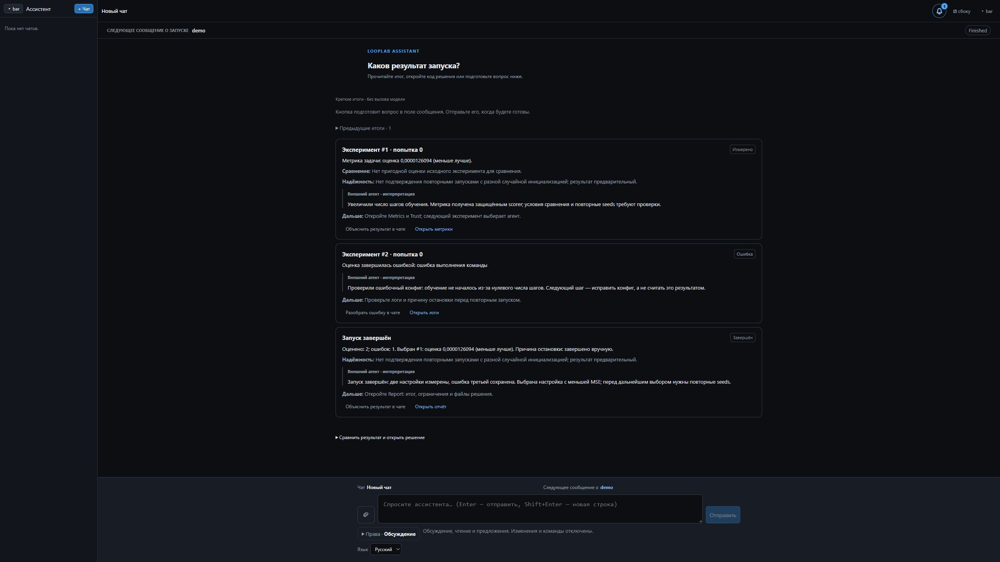

## 31. OB-10: подключение конкретного MCP-клиента и явные credentials

В **Progress → Agent cycle → Connect external agent** появился выбор **Codex /
Claude Code / Other MCP client** и отдельная кнопка копирования конфигурации.
Codex получает TOML с `env_vars`, Claude — `.mcp.json` с подстановкой переменной
окружения. Токен не вставляется в файл, инструкцию или clipboard. Подсказка указывает
место конфигурации, адрес сервера, необходимость перезапустить клиент и заменить
`command` полным путём, если LoopLab установлен в virtualenv. Подтверждение копирования
видно у соответствующей кнопки; смена клиента убирает прежнее подтверждение.

Исправлен скрытый переход к правам владельца: `harness-mcp` больше не берёт
`LOOPLAB_UI_TOKEN`, когда harness token отсутствует. Пустой токен, буквальный
неразвёрнутый placeholder и совпадение с унаследованным owner token дают понятный
отказ до открытия HTTP transport. Claude-конфигурация задаёт пустой default для
отсутствующей переменной. Проверка не подтверждает scope произвольного переданного
секрета: оператор по-прежнему должен выдать отдельный harness token.

Ответ MCP initialize теперь содержит инструкцию: читать contract и текущую generation,
искать phases, проверять source health/checkpoints, восстанавливать исходный receipt,
сохранять payload/key при повторе, завершать явно и писать краткие итоги в язык пользователя.
Это подсказка клиенту; обязательные проверки остаются в LoopLab. Подключение и копирование
не запускают эксперимент, не возобновляют run и не добавляют ожиданий в engine.

Проверка подключения разделена по фактическим границам:

- **Codex CLI 0.159.2** разобрал именно TOML из UI через временные `-c` overrides и
  `mcp get --json`. Пользовательская конфигурация не менялась. Модельный сеанс Codex
  и его approval flow этим не проверены.
- **MCP Python SDK 2.2.0**, настоящий stdio-процесс установленного `looplab.exe` и
  отдельный UI/API: initialize instructions, discovery, scoped 403 для owner settings,
  отказ запуска без токена, потерянный ответ и reconnect по исходному ключу,
  точный retry без дополнительного узла, stale generation 409, inspect/replay.
- Защищённый scorer обучил линейную регрессию: 5 и 80 шагов дали MSE **0,78074087**
  и **0,0000126094**; нулевое число шагов дало failed без метрики. После каждого
  результата и явного завершения записаны русские комментарии с receipt/evidence;
  повтор комментария вернул replayed. Scorer остался неизменным, платная модель не вызывалась.
- **Claude CLI не установлен**. JSON и env expansion сверены с официальным
  [описанием Claude Code](https://code.claude.com/docs/en/mcp); runtime acceptance
  остаётся открытым. Codex-формат следует
  [официальной документации](https://learn.chatgpt.com/docs/extend/mcp?surface=cli).

Автоматические проверки: **1800 UI passed**, после финального оформления —
**3 focused passed**; **193 replay passed**, **139 targeted backend passed**,
после дополнительных CLI/credential проверок — **73 passed** (наборы пересекаются).
Production build и bundle/reachability gates проходят. UI проверен в Full HD и 2K;
выбор клиента и копирование работают, горизонтального переполнения нет.
JS gzip **605428 B** (+457 B), CSS gzip **58445 B** (+43 B), initial **82977 B**
(+6 B). Дополнения остаются в lazy Agent cycle; route/reachability ceilings сохранены.
OB-10 остаётся открытым для реального Claude-клиента и полного Codex-сеанса.

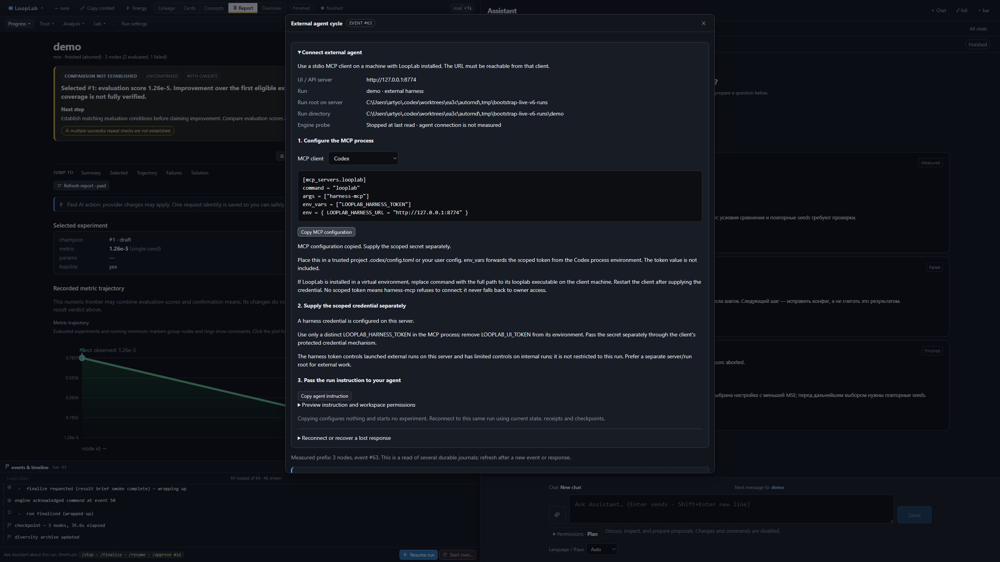

## 32. OB-10: настоящий Codex MCP и ожидание разрешения Claude

Два уровня подключения теперь названы отдельно: **Connected** подтверждает stdio-процесс,
а доступ к UI/API и правильному run проверяет новый MCP `connection_check`.
Этот tool делает только GET state с `observe_only=true` → generation-fenced handoff → compact progress.
Можно передать generation из handoff: при несовпадении проверка останавливается до
чтения контекста заменённого run. Без неё tool явно проверяет текущую generation.
Обычный GET state может согласовать уже начатый операторский reset. Для диагностики
добавлен режим наблюдения, обходящий это согласование; он не завершает reset и не
создаёт нового ожидания. Последующие чтения по-прежнему защищены generation fence.

Короткие diagnostics различают недоступный API, отклонённый credential/access,
неверный run ID/root, изменившийся контекст, отсутствие server harness token и неполный
ответ. Ошибки не копируют HTTP body, URL или текст исключения. Успех означает успешные
чтения: `evidence_complete`, source health, обязательства и last-read engine status
остаются видимыми. Tool не подтверждает agent liveness, scope произвольного секрета
или admission кандидата; не выполняет POST, resume, запуск модели или эксперимента.
Непечатные и не-ASCII символы в MCP credential теперь отклоняются до transport,
с фиксированным сообщением без значения секрета.
Некорректный URL сервера также отклоняется с фиксированным сообщением без его значения.

В UI и копируемой инструкции появился явный следующий шаг подключения. Для Claude
указано открывать проект интерактивно и рассмотреть MCP approval prompt: **Pending
approval** означает, что процесс ещё не подключён. Для Codex указаны trusted project
и `/mcp`. После подключения агент проверяет `connection_check`, затем читает полный
contract/task/config. Это клиентское разрешение, отдельное от checkpoint LoopLab.

### Приёмочная матрица на Windows

| Клиент | Что проверено | Что ещё не проверено |
|---|---|---|
| Codex 0.159.2 | Настоящий App Server MCP client: initialize, ephemeral сеанс, tools discovery, capabilities/phases, connection_check, task/config/contract/progress; ready-made кандидаты, защищённое обучение, receipts/retry, commentary, finish | Решения модели и интерактивный approval flow; model turns не запускались |
| Claude Code 2.1.286 | Закреплённый официальный npm package в отдельном `.tmp`, generated `.mcp.json` с заменой command полным путём; Pending approval, разрешение только looplab через временные settings, Connected, отказ без токена | Полный вызов инструментов и обучение через Claude, модельный диалог |

Codex запущен отдельным stdio-процессом с временной конфигурацией одного MCP сервера.
Сеанс `ephemeral: true`, без сохранённого чата и без model turn; пользовательская
конфигурация не менялась. Все рабочие вызовы прошли через `mcpServer/tool/call`, включая
`run_progress`, `command_receipt` и новый `connection_check`. После refresh MCP повтор
исходной команды с тем же payload/key сохранил command ID и число узлов.
Protected scorer линейной регрессии измерил MSE **0,78074087** и **0,0000126094**;
третий конфиг завершился failed без метрики. Русские комментарии с receipt/evidence
записаны после каждого результата и явного завершения; inspect/replay прошли.

Claude получил отдельный configuration directory. Проверка project config без разрешения
вернула Pending approval; с временным разрешением только looplab — Connected; без
harness token — Failed to connect. Во всех трёх случаях CLI exit code был **0**:
сам exit code не доказывает соединение. Connected получен при выключенном UI/API,
что подтверждает необходимость отдельной проверки live reads. Значение токена в
выводе клиента отсутствовало. Форматы и границы соответствуют официальным
[Codex App Server](https://learn.chatgpt.com/docs/app-server) и
[Claude MCP](https://code.claude.com/docs/en/mcp) описаниям; результаты относятся
только к указанным версиям, а не ко всем клиентам и платформам.

Проверки: **1800 UI passed**, **193 replay passed**, **188 targeted backend passed**;
после проверок credential/connection/docs — **109 passed**; после добавления observation
mode — **117 passed**, после финальной инструкции — **3 focused UI passed**
(наборы пересекаются).
Финальные URL/connection/MCP/API/config-doc проверки — **94 passed**;
doc budgets — **8 passed**, геометрия схемы — **3 passed**; strict MkDocs build прошёл.
Production build и все bundle/reachability gates проходят без повышения ceilings:
JS gzip **605667 B** (+239 B), CSS **58445 B** (без роста), initial **82970 B**.

Визуальная проверка нового абзаца в этой итерации не выполнена: встроенный браузер
отказал в открытии тестового localhost (`ERR_BLOCKED_BY_CLIENT`). Проверки поведения
UI и production build прошли; предыдущая проверка Full HD/2K относится к §31.

## 33. OB-10: Claude tool cycle и отдельное разрешение вызовов

Подключение сервера и разрешение вызывать его инструменты — два разных шага клиента.
Настоящий Claude Code **2.1.286** в `--print --permission-mode default` без разрешения
на `connection_check` вернул tool result с `is_error: true` и `permission_denials`.
При этом итоговый JSON содержал `is_error: false`, а CLI завершился с кодом **0**.
Такой результат не доказывает, что инструмент выполнялся или кандидат был принят.

В UI пояснение перенесено к **3. Connect and give the agent this run**, рядом с
копированием инструкции. Оно различает project approval, Connected, разрешение
инструмента и результат чтения API. Подсказка `--print` показывается для Claude.
Копируемая инструкция и MCP initialize предлагают проверять `isError/is_error`,
`permission_denials`, HTTP status и durable receipt. При отказе нужно рассмотреть
клиентское разрешение; после неоднозначной отправки — прочитать original receipt
до повтора. Это не новый checkpoint и не ожидание внутри LoopLab.

### Воспроизводимая локальная приёмка

В репозитории добавлен `benchmarks/claude_harness_smoke.py`; запуск описан в
[external guide](guide/external-harness.md#reproduce-the-claude-transport-check).
Он требует установленного Claude и нового output directory. Для Windows проверен
нативный `claude.exe` из официального закреплённого npm package. Пользовательские
настройки, аккаунт и существующие runs не используются; `--bare`, отдельный config
directory, `--no-session-persistence`, default permissions, запрет built-in tools
и allowlist только нужных LoopLab tools ограничивают тестовую сессию.

Локальный Messages provider выдаёт заранее заданные tool calls по официальному
[SSE-протоколу](https://platform.claude.com/docs/en/build-with-claude/streaming).
Он не является моделью и не возвращает метрики: JSON результатов приходит от
настоящего MCP-клиента Claude и LoopLab API. Наблюдатель отказывает при tool error,
неверном tool ID, неоднозначном content или отсутствии ожидаемого результата.
CLI cost estimate основан на тестовых token counts; это не списание провайдером.

Финальный прогон на отдельном root прошёл три сеанса:

| Сеанс | Проверяемая граница | Результат |
|---|---|---|
| Без tool approval | Один запрос `connection_check`; client default permissions | Refused, `permission_denials: 1`, CLI exit 0 |
| Первый клиент | capabilities, connection, task/config/contract, phases/progress, scoped owner refusal; ready-made кандидат | 11 выполненных tool calls; клиент явно завершился после receipt |
| Новый клиент | Те же bootstrap reads, original receipt, exact retry; ещё две оценки, checkpoints, русские commentary/retry и явный finish | 57 выполненных tool calls; исходный command ID сохранён, дополнительных узлов от retry нет |

5 и 80 шагов защищённого SGD scorer дали held-out MSE **0,7807408706** и
**0,0000126094**. Нулевое число шагов дало **failed без метрики**; интерпретация
объясняет, что обучение не началось и нужно исправить конфиг. Записаны комментарии
после каждого узла и завершённого run; повторы вернули `replayed`. Scorer в source
и всех трёх node directories побайтно неизменен. `inspect` и `replay` прошли.
Счётчики в `acceptance.json` различают tool attempts и client tool errors.

Исследование, concepts, reports, lessons и monitors в этой маленькой задаче выключены.
Это проверка transport/permissions/recovery, а не всех внешних обязательств или
решений LLM. Интерактивное подтверждение tool prompt человеком и реальное модельное
планирование остаются открытой частью OB-10. Разрешения клиента не обходятся.

Проверки: **193 replay passed**, **116 targeted Python passed**, **3 focused UI passed**;
production build и все bundle/reachability gates проходят без изменения ceilings.
JS gzip **605642 B** (−25 B к §32), CSS **58445 B**, initial JS **82970 B**.
UI открыт в Edge: фактический viewport **1920×1080**, инструкция читается,
горизонтального переполнения документа и pre нет. Попытка выставить 2K не изменила
фактический viewport, поэтому новая 2K-проверка не заявляется. Визуальное ограничение
встроенного браузера из §32 закрыто проверкой через Edge.

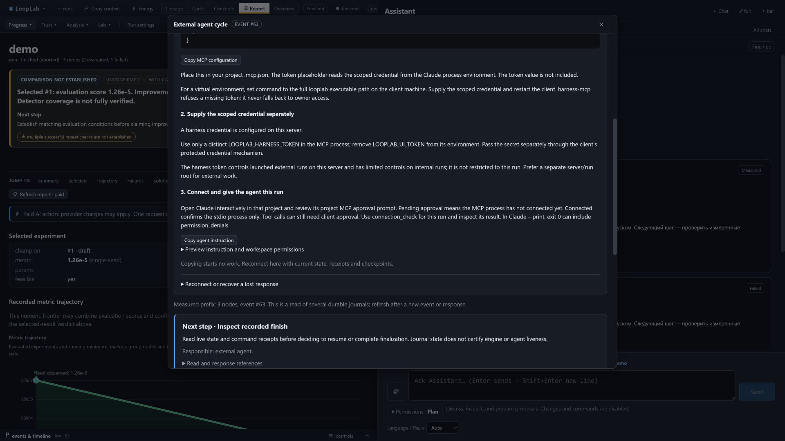

## 34. OB-09: очередь, checkpoint и остановка engine во внешнем цикле

**2026-10-01.** `harness-progress` и MCP `run_progress` теперь возвращают
`execution`: отдельную проверку engine lock, неизвестное состояние подключения
агента и счётчики записанной активности незавершённых узлов. Используется та же
публичная проекция, что в Inspector, на том же префиксе событий: очередь,
допущенная оценка, сборка и legacy/untracked pending. Отложенная при pause
оценка остаётся в очереди; после смены владельца engine старый допуск не
объявляет повторное обучение. Terminal, tombstone и aborted не попадают в
список незавершённых кандидатов.

**Agent cycle** показывает последний engine probe и записанную активность в
следующем шаге. Остановка engine меняет заголовок даже без нового event_seq;
периодическое чтение каждые 10 секунд обновляет эту независимую проверку.
Неизвестный lock не объявляется живым. Подключение агента не выводится из
давности событий или наличия engine. При ошибке обновления прежний следующий
шаг скрывается. Новых клиентских production строк и bundle overhead нет.

Checkpoint сохраняет приоритет и на остановленном engine, но теперь называет
нужное решение: проверка завершённого stage, ответ training monitor или решение
о продлении deadline. Повреждённые источники идут раньше вопроса. Разрешённые
verdict и права abort по-прежнему читаются из полного checkpoint. State references
используют `observe_only=true`; receipt читается без запуска command worker.
GET progress имеет `Cache-Control: no-store`. Чтение не выполняет recovery,
не отправляет кандидата и не добавляет обязательств.

### Локальное измерение через настоящий MCP

Отдельный loopback UI/API, Python MCP SDK и реальный subprocess-evaluator с
защищённым SGD scorer прошли цикл:

1. Idle external run: engine жив, подключение агента не измеряется.
2. Один готовый кандидат: допуск к оценке записан, engine жив.
3. Принудительная остановка **собственного** engine во время оценки: префикс
   остался **event #16**, узел pending; следующий шаг показал остановленный
   engine вместо продолжающегося обучения.
4. Повторное MCP-чтение и оригинальный receipt не изменили `events.jsonl`.
5. Явный `looplab resume`: тот же узел повторно допущен и получил held-out
   MSE **0.7807408706494512** после пяти SGD шагов. До terminal метрика не
   заявлялась. Scorer побайтно неизменен, второй узел не создан.
6. Русская интерпретация node, явная финализация и интерпретация run; точные
   retry вернули `replayed`. `inspect` и `replay` прошли.

Артефакт локального прогона: `.tmp/harness-wait-live-v2/acceptance.json`,
поколение `c7bc4c8e6c30222de3741d4699ccbac9f99fd26ccb9197d7312540f3914452f1`.
Обязательства research/concepts/reports/lessons/monitor в этой маленькой задаче
выключены; это проверка физической остановки и восстановления engine через MCP.
Состояния queued/withheld, legacy pending, stale generation, смена владельца,
terminal и три вида checkpoint отдельно проверяются регрессионными тестами.
Клиентский mounted-тест проверяет смену engine state через настоящий poll при
неизменном event_seq. OB-09 остаётся частичным для остальных основных поверхностей;
автоматический контроль подключения внешнего агента не добавлен.

Проверки: **193 replay passed**, **145 targeted Python passed**, **4 mounted UI
passed**, строгая сборка MkDocs и budgets/geometry полной схемы проходят.
API reference повторно сгенерирован и проверен, его содержимое не изменилось:
поля `execution` описаны здесь и в external guide. Production UI не изменён;
новая проверка визуальной компоновки FHD/2K в этом пакете не заявляется.


## 35. OB-09: следующий шаг внешнего агента на основном экране

В owner workspace external run появилась компактная строка **External agent**:
заголовок берётся из серверного `next_step`, пояснение раскрывается по клику,
**Agent cycle** открывает полный журнал и требования. Строка расположена над
сменяемыми видами run, поэтому не требует поиска в меню. Она читает только
`harness-progress?brief=true` с текущим поколением; poll — 10 секунд.

Смена поколения или наблюдения engine сбрасывает прежний scope. Старый event
prefix, неверный payload и неудачный refresh убирают текущий совет. Более свежий
lock probe из progress может показать остановку без нового события, даже когда
последний state ещё содержал `engine_running=true`. Он не измеряет соединение
агента. Retry выполняет GET; открытие панели не отправляет команды и не возобновляет
engine. В History и review строка размонтируется и не читает live advice.

Events Dock больше не выводит «Planning next experiment…» из последнего события
внешнего run. Реальная setup/build/evaluation активность сохраняет свои подписи.
Неизвестные настройки показываются как ожидание чтения настроек. Внешний режим
не анимирует предполагаемую работу агента и не выдаёт внутренний live trace за
его рассуждения; записанные traces узлов доступны в Inspector.

Agent cycle и общий resource notice выделены в собственные модули, чтобы строка
не загружала остальные панели. Обязательства, recovery-инструкции, scoped token
и history controls сохранены. Выполненные эксперименты и серверные API не менялись.

Проверки: **193 replay**, **1804 UI**, после последнего уточнения неизвестных
настроек — **19 targeted UI**. Mounted проверки проходят полный RunView до
History/review и обратно, same-event остановку engine, неудачный poll, Retry,
новый event и поколение. Production UI проверен через браузер при **1920×1080**
(Report и раскрытое пояснение) и **2560×1440** (Lineage и переход в Agent cycle).
Данные — завершённый реальный SGD run из §33; новый ML прогон здесь не заявляется.

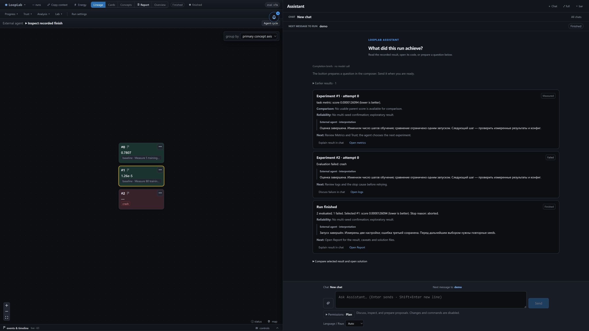

Bundle: HEAD **605642 B JS / 58445 B CSS gzip**, после изменения
**606794 B / 58684 B**; initial shell **82963 B JS / 36625 B CSS**.
Суммарная граница обновлена по этому измерению до 593/57.5 KiB; пределы
маршрутов, отдельных chunks, manifest cycles и запрещённых зависимостей сохранены
и проходят. OB-09 остаётся частичным для специализированных списков/attention
и проверки реального соединения внешнего агента.

## 36. OB-09: найти внешний run и вопрос, требующий ответа

Списки run, карта портфеля, Compare и campaign finder показывают внешний режим
из сохранённого config snapshot. Живой engine подписан **engine active**: это
наблюдение процесса, соединение внешнего агента не измеряется. Неизвестный или
повреждённый config не превращается в подтверждённый встроенный режим.

**Attention → Needs action → Open Agent cycle** теперь обнаруживает открытые
stage/monitor/ASHA/deadline вопросы. Ссылка сохраняет поколение run; Agent cycle
читает полный вопрос и допустимые ответы. В inbox не попадают приватные ожидания,
логи обучения или checkpoint ID. Открытие UI не отвечает, не возобновляет engine
и не добавляет ожидания к оценке. OS-уведомления для этих вопросов выключены
на сервере и клиенте. Существующая задержка refresh attention остаётся.

Кэш учитывает identities events, config и checkpoint journal. Поэтому ответ
убирает вопрос без нового события. Один общий projector с harness-progress
проверяет поколение, node attempt и последний evaluator claim. После reset,
смены run или повторного допуска старый вопрос не выдаётся как текущий.
Неполные журналы и нечитабельный mode дают partial; ранее проверенные строки
сохраняются только с явной отметкой stale. Сначала сортируется и считается весь
набор вопросов, затем выдаются страницы.

### Проверка на реальном коротком обучении

Через настоящий stdio MCP запущен toy external harness с защищённым scorer:
пять SGD шагов линейной регрессии, editable surface — только `config.json`.
Operator pipeline объявил один checked stage; обучение не дублировалось.
Engine естественно открыл `stage_check` после команды и ждал ответа при event
**#18**. Inbox показал вопрос при **1920×1080**; его ссылка открыла текущий
Agent cycle при **2560×1440**, без горизонтального overflow. После MCP verdict
`proceed` узел terminal получил held-out MSE **0.7807408706494512**.

Scorer побайтно неизменён. Русские интерпретации узла и явно завершённого run
опубликованы через result-notices; точные retry вернули `replayed`. `inspect`
и `replay` прошли. Один seed не доказывает улучшение модели. Research/report/
concept/lesson/monitor обязательства в этой маленькой задаче выключены;
stage checkpoint включён декларацией оператора. Это проверка discovery и ответа,
не доказательство паритета всех исследовательских суждений.

Локальные артефакты: `.tmp/external-discovery-live-v3/acceptance.json`,
generation `6d6746906de111a7dcecfc98223da50109d973fbdd346c301e825c0435942ef3`.

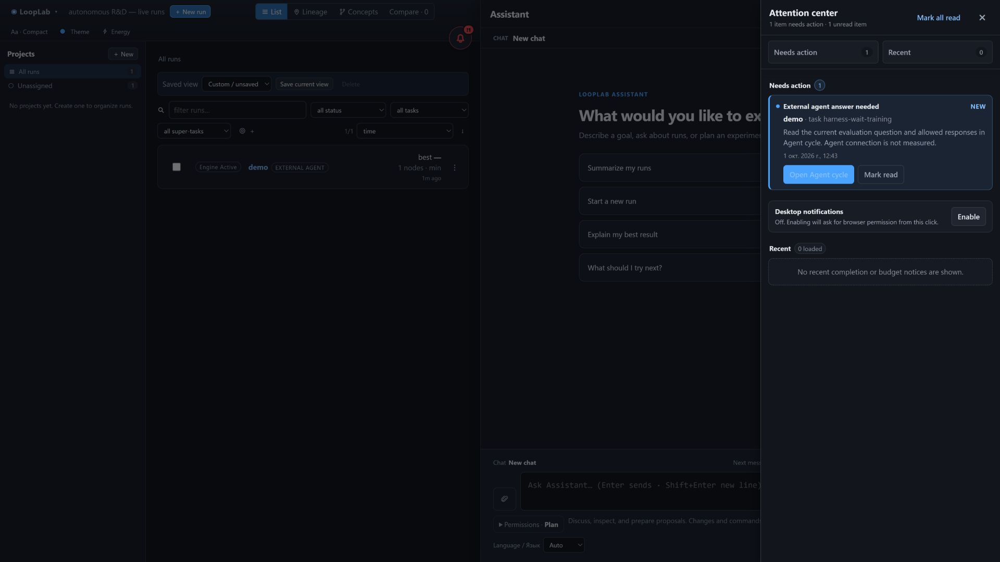

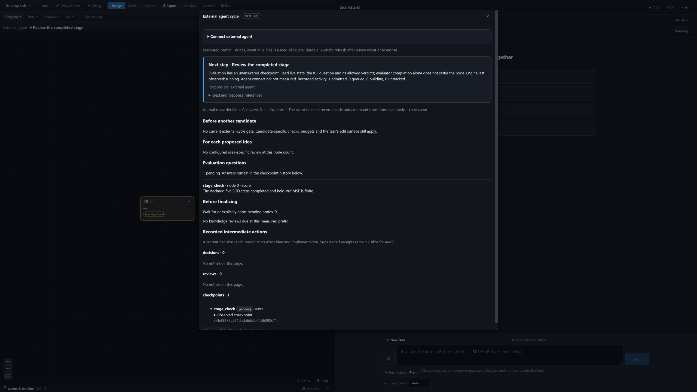

### Регрессии и границы

**193 replay**, **1807 UI** и **241 backend/doc** прошли; один существующий
тест пропущен по платформе. Backend проверки покрывают четыре вида
вопросов, ответ без события, reset/reclaim/terminal/новый run, режим config,
повреждённые источники, paging и действующие правила доступа. Mounted UI
проверяет реальные list/attention, generation link и отсутствие мутаций и
дополнительных per-run reads.

Карта портфеля вынесена из общего graph chunk в свой lazy entry. Owner DAG
уменьшился с **405326** до **403362 B JS gzip**, review DAG — с **267207** до
**265140 B**. Все прежние маршрутные, cycle и forbidden-reachability лимиты
сохранены. Сумма **607640 B JS / 58684 B CSS**, initial **82968 / 36625 B**;
суммарный JS ceiling обновлён по измерению до **594 KiB**. OB-09 остаётся
частичным только для наблюдения соединения самого агента и длинной сессии OB-10.

## 37. OB-10/12: гибель MCP, потерянный ответ и неполный checkpoint источник

### Исправленная ошибка

Progress и attention отмечали повреждённый checkpoint journal как неполный, но
checkpoint API молча пропускал плохие строки. Из оставшегося префикса можно было
прочитать вопрос, записать ответ и продолжить stage. Engine также мог употребить
ранее сохранённый ответ при повреждённом хвосте. Шесть новых проверок сначала
воспроизвели эти ошибки.

Один общий validator теперь используется в progress, attention и checkpoint
reader/writer. Повреждённый JSON, неверная форма, duplicate вопрос/ответ или ответ
без вопроса запрещают GET/POST checkpoint с **503**. Отсутствующий, пустой или
неполный event log также
запрещает публикацию вопросов и употребление ответов. Stage остаётся ожидающим;
переход через reconnect не чинит источник и не даёт автоматический verdict.
Оператор восстанавливает источник явно, агент заново читает state/progress.
Точный retry с прежним `action_id` возвращает `replayed`, в том числе после
terminal узла. Дополнительный тест проверяет повреждение во время event read.

Расширенная проверка зависимостей также обнаружила module-level импорт harness
в attention из §36. Импорты перенесены внутрь чтения внешних вопросов; прежние
правила слоёв сохранены.

### Воспроизводимый локальный сценарий

```sh
python -m benchmarks.external_session_smoke --out .tmp/new-session-proof
```

Нужны source checkout и extras `[ui,harness]`; output directory должен быть новым.
Сценарий поднимает отдельный loopback UI с scoped token, запускает engine и две
настоящие stdio MCP-сессии. Owner credential не передаётся MCP; token не пишется
в acceptance. Scorer защищён, editable surface — только `config.json`.
Чистая CPU-регрессия объявляет `gpus: 0` и пустой `CUDA_VISIBLE_DEVICES` только
для своих subprocess: чужая GPU lease не должна задерживать эту проверку.

| Проба | Проверенный результат |
| --- | --- |
| Первый `inject_node` применён, HTTP acknowledgement заменён на 503 | Original key находит тот же command ID; повторный кандидат не появляется. |
| MCP-процесс принудительно завершён при естественном stage checkpoint | Engine остаётся жив; новая сессия после restart UI находит тот же вопрос. |
| Reconnect читает receipt, progress и checkpoint | Events и checkpoint journal побайтно неизменны. |
| В disposable journal добавлен повреждённый хвост | GET/POST дают 503, progress неполный, узел остаётся pending; источники не переписываются автоматически. |
| Fixture явно возвращает свои известные правильные байты | Та же question identity снова доступна; это fault injection, не рецепт ремонта production данных. |
| Записанный verdict получил HTTP 503 вместо acknowledgement | Точный retry после terminal возвращает `replayed`, второго ответа нет. |
| 5 и 80 SGD шагов с тем же scorer | Held-out MSE **0.7807408706494512** и **0.000012609385167897514**. |
| Ноль шагов | Узел failed, метрика отсутствует; незавершённое обучение не выдаётся за результат. |
| Три terminal узла и явный `run_abort` | Краткие русские result-notices приняты; повтор каждого тела идемпотентен. |
| Защищённый scorer и история | Scorer побайтно неизменён во всех узлах; `inspect` и `replay` проходят. |

Пройденный локальный proof: `.tmp/external-session-proof-6/acceptance.json`.
Это реальное выполнение команд обучения без модельных/provider вызовов;
потеря acknowledgement моделируется HTTP 503 **после** записи результата.
Нет заявления о потере сетевых пакетов, качестве модельных решений или
интерактивных разрешениях Codex/Claude. Один детерминированный пример не
доказывает устойчивость ML-улучшения; остальные research/report/concept/lesson/
monitor обязанности здесь выключены, checked stage задан оператором.

OB-12 сохраняет статус реализованного recovery-сценария. OB-10 остаётся частичным:
подключение агента не измеряется, многочасовой сеанс и решения настоящей модели
с интерактивными разрешениями требуют отдельной проверки. Тихая история не
считается доказательством смерти агента.

### Проверки изменения

Прошли **249 backend** проверок checkpoint/progress/attention, MCP reconnect,
доступов, фаз, границ пакетов и containment; **31 docs/architecture** проверка
и `mkdocs build --strict`. Replay перед изменением: **193** проверок. В smoke
после изменения отдельно прошли CLI `inspect`/`replay`. UI-код не менялся.

## 38. OB-10/12: pause/resume и ответ только текущему evaluator

### Что исправлено

Checkpoint POST уже сверял lifecycle при приёме ответа, а progress/attention
отделяли актуальные вопросы от старых. Однако engine helper `answer_for` читал
сохранённый verdict по ID без проверки текущего run и evaluator. Пять направленных
тестов воспроизвели возврат ответа после node reset, нового claim при той же
node generation, terminal узла, замены event log и смены run UID при прежнем token.

Теперь употребление ответа проходит через общий checkpoint projector:
generation и UID run, node attempt, последний evaluator claim и pending status
должны совпадать. Устаревший ответ остаётся историей; точный POST retry возвращает
квитанцию принятия, но не разрешает новую оценку. При чтении отстающего event
prefix verdict также не выдаётся; после полного чтения актуальный ответ доступен.
Новые gates, настройки и автоматическое восстановление не добавлены.

Pause сам по себе не отменяет вопрос in-flight оценки. Engine может продолжать
drain и требовать ответ при уже установленном paused flag; сервер и UI живут
независимо. После выхода engine новая MCP-сессия только читает paused run.
Продолжение требует явного durable `resume`.

### Реальный MCP-прогон

Расширен `benchmarks.external_session_smoke`: теперь после двух измеренных
обучений агент отправляет `pause`, наблюдает выход исходного engine и закрывает
вторую MCP-сессию. Третья читает state/progress/receipt: engine не запускается,
events и checkpoint journal не меняются. Явный `resume` использует настоящий
production command spawner и создаёт ровно один новый engine. Его Popen сохраняется
только для cleanup собственных процессов этого отдельного server.

После resume агент отправляет `node_reset` ранее оценённого узла. Node ID сохраняется,
attempt становится **1**, engine открывает новый stage checkpoint. Retry прежнего
ответа даёт `replayed`, но новый вопрос остаётся pending. Свежий verdict завершает
повторную оценку с тем же held-out MSE **0.000012609385167897514**. Опубликована
отдельная русская интерпретация новой попытки. Затем нулевое число шагов снова даёт
failed без метрики; run явно финализирован.

Прогон также показал различие эффекта и receipt: paused flag, resumed state или
живой engine могут быть видны до terminal статуса command worker. Следующая
мутация в этот момент корректно получает `command_in_progress`. Benchmark теперь
ждёт terminal сохранённой квитанции через пассивный `command_receipt`, прежде чем
отправлять следующий control. Инструкция recovery поясняет этот порядок.

### Проверки и оставшиеся границы

Пять lifecycle тестов падали до исправления; после него проходят **9** направленных
проверок, включая pause и три отстающих event reads. Расширенный backend-прогон:
**255** проверок; дополнительные три проверки отстающего чтения выполнены отдельно.
Перед изменением прошли **193 replay** проверки. Новый live proof —
`.tmp/external-pause-proof-4/acceptance.json`; защищённый scorer неизменён во всех
трёх узлах, CLI `inspect`/`replay` прошли. Оценённый узел переизмерялся явно,
первичное обучение не дублировалось внутри stage pipeline.

Это короткий сценарий реальных subprocess и трёх MCP-сессий без provider/model
вызовов. Многочасовой сеанс, модельные решения и интерактивные разрешения конкретных
Codex/Claude клиентов остаются открытыми в OB-10. Совпадение детерминированного
scorer не доказывает устойчивость ML-результата. Подключение внешнего агента
по-прежнему не измеряется.

Также прошли **31** проверка документации/схемы и `mkdocs build --strict`.

## 39. OB-11 и OB-10/12: реальные MCP-фазы и pause при открытом вопросе

### Подтверждённая ошибка discovery

`next_step.phase_id` выдавал runtime kind вопроса: `stage_check`, `train_monitor`
или `asha_live`. В MCP-каталоге таких фаз нет: агент, следовавший подсказке UI,
получал `unknown phase` из `phase_info`. Предыдущий smoke жёстко выбирал
`evaluation` и не обнаруживал рассогласование. Четыре проверки воспроизвели ошибку.

Теперь подсказка указывает на существующую фазу решения:

| Runtime kind в вопросе | MCP `next_step.phase_id` |
| --- | --- |
| `stage_check` | `evaluation` |
| `train_monitor`, `asha_live` | `monitor` |
| `deadline_grace` | `deadline_grace` |

Сам вопрос сохраняет прежний kind и ограничения verdict. Общая mapping находится
рядом с каталогом фаз; её значения проверяются по каталогу. Smoke теперь выбирает
фазу из реального progress, читает её через MCP и проверяет доступ к response route.

Для paused run с открытым вопросом подсказка объясняет: новые работы приостановлены,
но уже начатая оценка ждёт checkpoint. Ответ сам по себе не возобновляет поиск.
Эта формулировка и реальный `phase_info: evaluation` проверены в mounted UI.

### Проверка ожидания и смены сессии

`benchmarks.external_session_smoke --checkpoint-hold-seconds 120` позволяет
наблюдать открытый checkpoint по реальному времени. В начале первого обучения
агент ставит pause, затем его MCP-процесс завершается и частный UI перезапускается.
Новая сессия только читает progress/state/question. На протяжении заданного
интервала engine остаётся жив, тот же вопрос pending, узел не terminal и метрика
отсутствует; journals побайтно неизменны. Перед снимком тест отдельно дожидается
engine `command_ack` для pause: завершённая command receipt может предшествовать
этому законному append. Обычный ACK не приписывается чтению API.

Явный resume сохраняет первоначальный engine и checkpoint. Первый score stage
завершается ровно один раз, повторного обучения при reconnect/resume нет. Затем
сценарий проверяет остальные шаги §38: quiescent pause, третью MCP-сессию,
production spawn, reset с новым вопросом, повторную оценку, отказ нулевого числа
шагов, русские result-notices, явный finish и CLI inspect/replay.

Полностью прошли короткий двухсекундный прогон и **120 секунд реального ожидания,
24 наблюдения** после смены MCP/UI. Proof второго прогона:
`.tmp/external-held-checkpoint-proof-3/acceptance.json`. Оба завершены; защищённый
scorer неизменён во всех узлах, первый score stage выполнен один раз, CLI
`inspect`/`replay` проходят. Измерения MSE: **0.7807408706494512** при пяти шагах,
**0.000012609385167897514** при 80, затем failed без метрики при нуле шагов;
явное переизмерение второй конфигурации совпало. Это один детерминированный
пример протокола, не вывод об устойчивости обучения.
Флаг допускает интервал до суток; это возможность воспроизведения, не заявление
о проведённой многочасовой проверке. Модельные решения и интерактивные разрешения
Codex/Claude остаются открытыми в OB-10; соединение агента не измеряется.

### Регрессия

Прошли **263 backend** проверки checkpoint lifecycle, discovery, progress,
attention, MCP, доступа, границ пакетов и containment; **5 mounted UI** проверок;
**32 docs/architecture** проверки и `mkdocs build --strict`. Перед изменением
прошли **193 replay** проверки. Новые фазы, настройки и engine gates не добавлены.

## 40. OB-10/12: аварийная остановка engine до terminal-результата

### Новый воспроизводимый сценарий

Добавлен `benchmarks.external_session_smoke --engine-loss` с отдельным новым
output directory. Это остановка собственного subprocess через `terminate`,
а не штатный pause/drain; trainer уже завершён, но stage checkpoint ещё открыт.
Engine не успел записать `eval_invocation_settled` и terminal узла. Затем убивается
собственный MCP-процесс и перезапускается частный UI, как в предыдущем сценарии.

Новая MCP-сессия только читает state/progress/question/receipt. Engine остаётся
остановленным, узел pending без метрики, история побайтно неизменна. Старый вопрос
виден как записанное обязательство прежнего evaluator. Это не доказательство
того, что обучение продолжается.

Явный durable `resume` создаёт один replacement engine. Он повторяет незавершённую
оценку того же узла и attempt, записывает новый evaluator claim и открывает новый
checkpoint. Старый verdict POST получает **409**, checkpoint journal не меняется;
старый вопрос виден в полной истории как `superseded`, без ответа. Свежий verdict
завершает оценку. Три node ID сохраняются до finish; новый кандидат не создаётся.

Первый score command здесь исполняется **дважды**, а terminal-результат получается
один. Это ожидаемое восстановление ещё не settled попытки, а не два успешных
эксперимента. В обычном сценарии с живым waiting engine тот же command по-прежнему
выполняется один раз. Protected scorer во всех узлах неизменён. Проверена настоящая
production-логика resume; cleanup охватывает только Popen этого disposable server.

### Подсказки и понятность результата

Compact/full progress и UI теперь объясняют stopped engine с checkpoint:
это recorded question; перед решением нужны state и original receipt, после
resume нужно заново прочитать progress/checkpoints, поскольку evaluator может
заменить вопрос и повторить незавершённую оценку. Response route и допустимые
verdict не изменены; автоматическое восстановление не добавлено. Существующие
три проверки stopped checkpoint падали до уточнения и проходят после него.
Mounted UI проверяет отображение серверной подсказки.

Русская интерпретация первого terminal-узла в crash-сценарии прямо сообщает
о повторной оценке после остановки engine и отказе старого verdict. Итог run
различает это восстановление и последующее явное переизмерение через reset.
Result-notices по-прежнему используют измеренную evidence-квитанцию и exact retry.

Пройденный proof: `.tmp/external-engine-loss-proof-2/acceptance.json`.
Он также включает повреждённый checkpoint tail, потерянные HTTP acknowledgements,
ещё один штатный pause/resume, reset и неуспешную конфигурацию. CLI `inspect` и
`replay` проходят. Никаких provider/model вызовов нет; многочасовая работа,
модельные решения и интерактивные разрешения клиентов остаются открытыми в OB-10.

Регрессия: **263 backend**, **5 mounted UI**, **32 docs/architecture** проверки;
**193 replay** перед изменением. Контрольный live-прогон без `--engine-loss` тоже
прошёл: `.tmp/external-engine-loss-control-1/acceptance.json`, один первый score
stage и тот же checkpoint после resume живого engine.

## 41. OB-10/11/12: recovery с включёнными фазами исследования и отчёта

### Исправленная ссылка concept base

Expansion blocker для включённого `concept_run_base` возвращал это имя настройки
как `phase_id`, хотя в MCP-каталоге соответствующая фаза — `concept_tags`.
Направленный тест полного и compact progress воспроизвёл отсутствующую фазу.
Теперь blocker указывает `concept_tags` и прежний `command:run_concepts`.
Проверены существование фазы и внешний write access. Настройка, admission gate,
контрольный command и его защитные проверки не менялись. Mounted UI отображает
реальное имя фазы и команду.

### Реальный MCP-прогон с обязанностями

Новый `--obligations` в `benchmarks.external_session_smoke` включает:
`deep_research_every=1`, `report_every=1`, `concept_run_base=true`,
`reflection_priors=true`, `lessons_every=1`, `comparative_lessons=true`.
Для остальных выключенных обязанностей остаётся прежняя ограниченная конфигурация;
нет заявления о проверке всех настроек LoopLab этим одним сценарием.

Агент начинает с live contract/config/task/progress, ищет каждую требуемую фазу
через MCP и проверяет write access. Fixture задаёт известный protected SGD scorer;
агент читает task и измеренную историю, публикует
research memo, задаёт кандидатам authored concept tags и seeding run base после
первого измерения. Report содержит прочитанные node ID, attempt, status и metric;
контент проходит обычную валидацию `report_generated`. Указанные числа получены
scorer, не переданы как оценка кандидата.

Lesson/skill reviews содержат `no_applicable_action` и причину: один искусственный
детерминированный пример восстановления не даёт независимого ML-вывода для
межзадачной памяти. Evidence — текущие terminal узлы. Exact replay review в том же
evidence window не создаёт вторую запись. Новые reusable lessons не выдумываются.

Report и reviews текущего node window публикуются перед штатной паузой. Третья
MCP-сессия видит их актуальными без повторного authoring. После `node_reset`
число узлов остаётся **2**, но меняется evidence revision: report и две review-фазы
снова due, прежние **4** review-записи становятся `superseded`. После переоценки
агент заново закрывает текущие требования перед третьим кандидатом.

Перед finish опубликованы текущий report и две reasoned reviews. Expansion-only
research всё ещё due при трёх узлах; он не мешает явному `run_abort`. Это проверяет
разделение двух направлений работы, а не отключение обязательных finish gates.
Result-notices после terminal узлов и run сохраняют русские сводки и exact retry.

Сценарий также комбинируется с `--engine-loss`: новый evaluator отклоняет старый
verdict, после чего агент продолжает через текущие обязанности. Измеренные MSE
прежние: **0.7807408706494512** при пяти шагах, **0.000012609385167897514** при 80,
failed без метрики при нуле. Повторная оценка 80 шагов совпала в этой задаче.
Scorer побайтно неизменён; CLI `inspect` и `replay` проходят.

Proof обычного восстановления с обязанностями:
`.tmp/external-obligations-proof-4/acceptance.json`. Комбинированный сценарий с
остановкой engine: `.tmp/external-obligations-final-proof-1/acceptance.json`.
Рецепты и параметры приведены в [external guide](guide/external-harness.md).
Комбинированный proof содержит **3** research memo, **1** run concept base,
**4** report и **8** review-записей; exact replay reviews не увеличил их число.

### Регрессия и границы

Прошли **290 backend** проверок, включая external run mode, checkpoint lifecycle,
progress, MCP и доступ; **5 mounted UI**, **32 docs/architecture** проверки и
`mkdocs build --strict`. Перед изменением прошли
**193 replay** проверки. Проверяются настоящие training subprocess, MCP и durable
API без provider/model вызовов. Research memo здесь — разбор локального кода и
измеренных результатов, не поиск литературы. Качество модельных решений,
интерактивные разрешения клиентов и многочасовой сеанс остаются открытыми в OB-10.

## 42. OB-10/11/12: recovery открытого monitor и строгая stop authority

### Воспроизведённая ошибка metadata

Общий checkpoint reader проверял базовые поля вопроса, но не требовал boolean
для `kill_enabled` и не ограничивал `phase_id` реализованными видами вопросов.
При повреждении journal строка `"false"` была truthy: старый POST validator
принимал `abort` для изначально advisory monitor. Отдельное воспроизведение кода
предыдущего коммита в disposable process дало **HTTP 200** и consumed verdict
`abort`; рабочие файлы репозитория не откатывались.

Теперь источник требует известный checkpoint kind и строго boolean
`kill_enabled`. Ошибочные строки, integer, null и неизвестные виды отказаны
до интерпретации ответа: GET/POST checkpoint возвращают **503**, progress становится
incomplete с `inspect_sources`, engine не публикует и не употребляет ответы из
такого journal. Восстановление известных корректных fixture bytes возвращает
обычное поведение; это не автоматический ремонт production источника.
Проверен также list вместо phase ID, чтобы validator не создавал 500.

Разрешённые verdicts определяются общей функцией для POST validator и подсказки:

| Вопрос | Допустимый ответ |
| --- | --- |
| Checked stage | `proceed`, `inconclusive`, `fail`; для fail действуют прежние hard-kind проверки |
| Advisory monitor | `continue`, `watch`; abort не предоставлен |
| Monitor с boolean kill authority | `continue`, `watch`, `abort` |
| Deadline grace | `extend`, `stop`; runtime ограничивает одно продление |

UI показывает эту серверную подсказку, включая отказ abort authority. Полный вопрос
и phase_info остаются обязательными reads. Run setting `train_monitor_kill=true`
сам по себе не разрешает abort на первом advisory checkpoint. Новые verdicts,
события, автоматический ответ и engine gates не добавлены.

### Реальная оценка и второй разрыв MCP

Добавлен `--monitor` в `benchmarks.external_session_smoke`: оператор задаёт один
protected `train_eval` command с training role, который выполняет SGD и scoring
один раз. `train_monitor=true`, `train_monitor_kill=true`, cadence — **600 секунд**.
Команда выполняется быстро, поэтому вопрос открывается в final observation до
terminal узла. Observation — настоящий stdout/stderr command, не искусственная
кривая обучения. Этот сценарий не проверяет решение об остановке живой loss curve.

После stage verdict protected command уже завершён, но узел pending, метрика ещё
отсутствует и первый training monitor advisory. Агент не отвечает: завершается
второй собственный MCP-процесс, UI перезапускается второй раз. Новая сессия читает
тот же checkpoint ID и неизменный checkpoint journal; engine остаётся тем же.
Недопустимый `abort` получает **400**, вопрос остаётся pending. Явный `continue`
закрывает его; exact replay не дублирует ответ. Только затем фиксируется terminal.

Четыре monitor вопроса обслужены отдельно: первый узел, второй узел, его новая
попытка после reset и неуспешный третий узел. Новый attempt получает новый вопрос;
failed-конфигурация остаётся без метрики после review. Первый command выполняется
ровно один раз при recovery живого engine. Все protected scorer bytes неизменны.
Monitor был видимой обязанностью, а не скрытым ожиданием команды.

Combined proof с включёнными research/concept/report/review обязанностями:
`.tmp/external-monitor-final-proof-1/acceptance.json`. Также пройден monitor-only
сценарий `.tmp/external-monitor-reconnect-proof-1/acceptance.json`. Оба завершены
явно, русские result-notices опубликованы, CLI `inspect`/`replay` проходят.
Инструкция запуска добавлена в [external guide](guide/external-harness.md).

### Проверки и границы

До исправления падали **11** направленных проверок authority/discovery; после
него проходят **300 backend** проверок, включая **10** вариантов неверной metadata,
checkpoint lifecycle, progress, доступы и границы пакетов; **5 mounted UI** проверок.
Перед изменением прошли **193 replay** проверки. Deadline verdict и реальное
продление subprocess проверяются существующими backend-тестами; отдельный live
MCP reconnect на deadline выполнен следующим шагом, в §43. Остаются открытыми многочасовой
сеанс, реальные модельные решения и интерактивные разрешения клиентов в OB-10.

Также прошли **32 docs/architecture** проверки и `mkdocs build --strict`.

Контрольный live-прогон без monitor, с обязанностями и остановкой engine,
тоже завершился: `.tmp/external-monitor-control-proof-1/acceptance.json`.

## 43. OB-10/11/12: MCP recovery на deadline и точный смысл cap

**2026-10-01.** Добавлен отдельный воспроизводимый offline-прогон
`benchmarks.external_deadline_smoke`. Четыре приватных run, настоящий CLI engine,
реальный stdio MCP и перезапускаемый UI используют неизменный protected scorer.
Он выполняет пять шагов SGD и считает held-out MSE. Таймер перед обучением —
контролируемая инъекция задержки, а не доказательство медленного ML обучения.
Ни scorer, ни метрика не задаются внешним агентом. Editable только `config.json`.

### Устранена неточность про ожидание deadline

Прежнее объяснение «missing answer never grants time» не описывало расход времени:
callback ждёт явного ответа, но не приостанавливает subprocess. Пока агент отсутствует,
команда может продолжать работу или завершиться, а узел остаётся pending без метрики.
На этом ожидании нет автоматического timeout. Cap ограничивает единственное
продление **после употребления `extend` runtime**, а не полное время команды
и не интервал до ответа. Это теперь явно сказано в `looplab harness`,
`harness-contract`, `phase_info(deadline_grace)`, серверной подсказке `next_step`,
видимой в UI, и [external guide](guide/external-harness.md).

Автоматический verdict, остановка при потере MCP и измерение соединения агента
не добавлены. Если нужен обычный timeout без ожидания агента, оператор отключает
deadline review через `eval_deadline_grace_s=0` при настройке запуска.

### Проверенные сценарии

| Режим | Явное решение и наблюдаемый результат |
| --- | --- |
| `completed_extend` | После разрыва MCP и restart UI восстановлен тот же вопрос. Extend с cap 15 секунд; SGD завершён, измеренный MSE **0.7807408706494512** |
| `stop` | После reconnect явный stop завершает stage с timeout; узел failed, метрики нет |
| `capped_extend` | После reconnect один extend с cap 1 секунда; медленная команда остановлена, stage хранит `deadline_grace_s=1`, метрики нет; второго вопроса нет |
| `disabled` | Grace выключен, обычный timeout; ни question, ни ответа агента, ни метрики |

При включённом grace каждый run сначала держит естественно открытый вопрос
без ответа более **1.2 секунды** при declared deadline **0.8 секунды**. Реальный
command log растёт: ожидание не является заморозкой обучения или общим time cap.
Узел всё ещё pending, metric отсутствует. Затем завершается только собственный
MCP-процесс и перезапускается приватный UI. Read-only reconnect сохраняет checkpoint
ID и journal, видит прежний живой engine, не отвечает и не запускает команду повторно.
Перед ответом protected command ещё находится в задержке, до SGD.

Неподходящий для deadline `abort` получает **400** и не закрывает вопрос. Явные
extend/stop, их exact retry до terminal и после terminal дают одну квитанцию ответа.
На каждый run приходится один score execution и один terminal event. Timeout
никогда не превращён в завершённый score. Защищённые bytes проверяются и в source,
и в node workspace. На каждый узел и финализированный run отправлены краткие
русские result-notices с evidence token; повтор не дублирует комментарий.
Все четыре run явно завершены и проходят CLI `inspect`/`replay`.

Proof: `.tmp/external-deadline-proof-2/acceptance.json`, отдельные journals,
engine logs и inspect/replay в подкаталогах случаев. Команда воспроизведения
и выбор отдельного случая добавлены в guide. Граница проверки: protocol timing,
реальные процессы и настоящее короткое SGD; многочасовой сеанс, модельные решения,
интерактивные разрешения клиентов и обнаружение гибели удалённого агента остаются открытыми.

Перед изменениями прошли **193 replay** проверки. После уточнения контракта —
**155 backend**, **5 mounted UI**, **32 docs/architecture** и `mkdocs build --strict`.
Полная матрица из четырёх live-сценариев выполнена дважды; второй прогон также
проверяет рост log при unanswered wait, stage cap и exact replay после terminal.
В нём stop → terminal занял **0.156 секунды**, extend с cap 1 → timeout terminal —
**1.203 секунды** с учётом polling, cleanup и публикации события.

## 44. OB-10/11/12: живой SGD monitor и граница попытки для loss veto

**2026-10-01.** Следующая проверка после deadline recovery — внешний agent review
по ещё работающему training command. Ранее §42 проверял первый advisory вопрос
после завершения быстрой команды. Теперь проверены реальные текущие loss points,
`watch`, разрешённый stop, восстановление открытого stop-вопроса и завершение
training authority по появлению declared checkpoint.

### Найден и исправлен баг старой кривой

В `external_watch.observe_external_eval` observation уже читался с pre-attempt
snapshot, а `read_stage_trajectory` для deterministic kill veto вызывался **без него**.
Логи дописываются при reset/repair; поэтому сервер показывал агенту текущие строки,
но разрешение остановки мог определять по смеси текущей и предыдущей попытки.

До изменения упали **четыре** регрессионные проверки:

| Предыдущая попытка → текущая | Ошибка прежнего monitor |
| --- | --- |
| Descending loss → frozen loss | Старая descent запрещала abort новой попытки после watch |
| `NaN` → неаномальная descending loss | Старая anomaly снимала veto; новая улучшающаяся попытка ошибочно получала abort authority |

Оба направления воспроизведены для named pipeline и single-command `eval.log`.
Теперь live trajectory получает snapshot текущей попытки. Общий reader определяет
byte floor через существующий `attempt_byte_floor` на том же открытом файле;
нечитаемая граница даёт пустую trajectory. Прежний explicit floor для stage check
сохраняется. Логи не стираются, вопросы и ответы не переписываются. Новые verdicts,
каденции, автоматическая остановка и модельные решения не добавлены.

### Три реальных MCP-прогона

Добавлен `benchmarks.external_live_monitor_smoke`: отдельные приватные run roots,
настоящий CLI engine, stdio MCP и перезапускаемый UI. Оператор объявляет
`train → score`; оба скрипта защищены, editable только `config.json`.
Train действительно обновляет linear model по SGD и пишет рассчитанный loss,
затем сохраняет weights. Отдельный scorer считает held-out MSE этих weights.
Паузы по 0.1 секунды между optimizer steps нужны для наблюдения короткого CPU
эксперимента; они не имитируют дорогой training и не создают выдуманную loss curve.
Monitor cadence явно **0.4 секунды**, train kill включён, ASHA/deadline review выключены.

| Сценарий | Наблюдение и результат |
| --- | --- |
| `improving` | 80 steps, `lr=0.05`; первый вопрос advisory, после watch abort остаётся запрещён descending veto. Обучение и score выполнены по одному разу; MSE **0.004653682304385089** |
| `frozen_stop` | Контроль с `lr=0`: loss рассчитан реально, но optimizer не меняет weights. После watch новый вопрос даёт stop authority. MCP завершается, UI перезапускается; тот же вопрос и journal сохранены, engine жив. Явный abort даёт failed `monitor_broken`, без weights, score и метрики |
| `checkpoint_validation` | 15 steps, `lr=0`; после записи weights command продолжает проверку checkpoint. После watch новые вопросы advisory: training authority уже потрачена. Отдельный score выполняется один раз, MSE **2.3913043478260874** |

Первый run получил **10** вопросов, контроль stop — **2**, checkpoint validation —
**9**. Каждый advisory abort получает 400, правильный ответ и exact retry — одну
квитанцию. Один принятый abort останавливает только этот приватный контроль;
flat loss сам по себе не объявляется доказательством поломки ML задачи.
Каждый run имеет один terminal event. Protected source/workspace bytes неизменны.
Все узлы и явно завершённые run получили короткие русские result-notices с
evidence token и exact retry; CLI `inspect`/`replay` проходят.

Proof: `.tmp/external-live-monitor-proof-1/acceptance.json`, journals и логи по
сценариям. [External guide](guide/external-harness.md), MCP monitor purpose,
harness-contract и B/E architecture diagram поясняют, что watch запрашивает новый
взгляд, а permission берётся из **нового вопроса** по evidence текущей попытки.

Границы: смешение старой и новой кривой воспроизведено направленными backend
тестами; live-прогон отдельно проверяет настоящую текущую кривую, stop и recovery.
Это не multi-hour session и не оценка научных решений модели. ASHA same-resource
recovery проверен следующим шагом, в §45. Интерактивные разрешения клиентов и обнаружение гибели remote agent
остаются открытыми сценариями.

Перед изменением прошли **193 replay** проверки; после исправления — **216 backend**,
включая четыре новые регрессии, stage trajectory, monitor contracts/receipts,
checkpoint lifecycle и границы пакетов.

После уточнения discovery повторно прошли **10** проверок harness manifest/phase
contract. Также прошли **32 docs/architecture** и `mkdocs build --strict`;
OpenAPI reference регенерирован, список маршрутов не изменился.

## 45. OB-10/11/12: ASHA same-rung recovery и отмена stop после retarget

**2026-10-01.** Следующий проверенный сценарий — внешний ASHA review по реальным
промежуточным измерениям. На каждый приватный run сначала оцениваются два базовых
SGD-кандидата; их measured resource curves сохраняет engine. Третий кандидат —
контроль с `lr=0`. Protected opaque command сам обучает и считает held-out MSE
на каждом шаге, поэтому тренировка и score не дублируются внешним агентом.
Editable только `config.json`; метрику агент не публикует как собственное число.

### Пять найденных дефектов

Сначала воспроизведены **три** сбоя в `tests/test_external_asha_guards.py`:

1. После `metric_retarget` внешний ASHA мог разрешать abort по прежней task curve,
   хотя built-in watchdog в такой ситуации остаётся advisory.
2. При переходе между stages накопленный `under_streak` переносился на новый
   stage: stop становился доступен раньше его собственного grace-окна.
3. Ограничение объединённого observation через `[-6000:]` вытесняло ASHA comparison
   prefix длинным log. Агент терял resource, peer measurements и правило stop.

Исправлены текущая objective guard, reset watch/streak при смене stage и bounded
observation с сохранением comparison prefix перед недавним хвостом лога. Порог
остался прежним: **три** consecutive same-rung underperforming checks, достаточно
eligible peers и prior watch. Новые verdicts или автоматические решения не вводились.

Ещё **два** сбоя воспроизведены для retarget на уже открытом вопросе и между
принятием `abort` API и его употреблением engine. Теперь pending projection и POST
validator снимают abort authority при активном retarget. Они возвращают текущий
`kill_enabled=false`, `recorded_kill_enabled` и `stop_refusal=objective_retargeted`.
Journal сохраняет исходную immutable question; история отвеченных вопросов сохраняет
исходную authority, а reads ничего не переписывают. UI next step называет причину
veto и разрешает только continue/watch. Недопустимый abort получает **400**.

Engine дополнительно читает текущую objective перед применением принятого ASHA abort.
Если оператор уже retargeted run, остановка не применяется; диагностическое событие
`asha_rank` содержит optional `stop_refusal`. Старый ответ остаётся квитанцией своего
принятия, exact replay не выдаётся за новое permission. Observer может открыть новый
advisory вопрос, включая при неизменном log digest. Ответ continue/watch за агента
не подставляется. Этот race проверен управляемой backend-инъекцией в точке consumption.

### Реальные CPU/MCP-прогоны

Добавлен `benchmarks.external_asha_smoke`. На всех случаях настоящий CLI engine,
реальный stdio MCP, generation-fenced reads и durable commands. Оператор явно
задал `asha_live_min_siblings=2`, cadence **0.4 секунды**, kill enabled; training
monitor и deadline review выключены. Canonical rung — наибольшая степень двойки
не больше resource. Сравниваются сохранённые **start-of-rung** измерения, не
готовый endpoint вместо неизвестного промежуточного значения.

| Случай | Проверенный результат |
| --- | --- |
| `same_resource_stop` | Два peers с 16/32 steps; два advisory вопроса отвечены watch. Третий разрешает abort. MCP завершается, UI перезапускается; тот же вопрос, journal и живой engine сохранены. Явный abort даёт `asha_underperforming`, без итоговой метрики или weights |
| `missing_resource` | Operator metric не объявляет resource key. ASHA видит objective и endpoints, но peers несопоставимы. Даже после watch abort запрещён; command завершён, MSE **2.3913043478260874** |
| `unmatched_rung` | Peers обучены 2/3 steps; текущий command быстро проходит первые 20 steps. Для его rung нет двух сохранённых peer measurements. Abort запрещён; итоговый MSE **2.3913043478260874** |
| `retarget` | Private operator меняет objective на declared measured weight norm до третьего кандидата. ASHA task curve остаётся advisory. Итог weight norm **0**, task MSE **2.3913043478260874** сохранён отдельно |
| `retarget_open` | Третий stop-вопрос уже открыт, MCP завершается. Оператор retargets run; после restart UI новая сессия читает тот же ID, неизменный journal и снятое разрешение abort. Continue позволяет завершить score: weight norm **0**, task MSE **2.3913043478260874** |

Retarget делает только operator fixture с приватным owner credential, который не
передаётся MCP. Это проверка смены измеряемой цели, не рекомендация минимизировать
weight norm: нулевая норма здесь сопровождается плохим MSE. Две обычные baseline
метрики — **0.13721179500378475** и **0.01337676906957059**; short-peer control —
**1.4503680139130435** и **1.1623042552333913**.

Полная матрица получила **3/8/7/10/8** вопросов соответственно. Exact retries не
дублируют ответы. Каждый run имеет ровно три opaque score executions и три terminal
events, по одному на node. Protected scorer bytes неизменны в source и workspace.
Partial measurement остановленного command не становится terminal metric. На все
terminal nodes и явно завершённые run отправлены русские result-notices с evidence
token и стабильными action IDs. Все пять run проходят CLI `inspect`/`replay`.

Proof: `.tmp/external-asha-final-proof-1/acceptance.json`. Предварительная матрица
из четырёх случаев: `.tmp/external-asha-proof-2/acceptance.json`. Первая попытка
fixture исправлена: `resource_curve` намеренно исключён из compact node dump;
provenance assertion читает private event ledger, а agent decision читает реальные
checkpoint comparisons через MCP. Public `task_metric` читается из измеренного state.

Обновлены [external guide](guide/external-harness.md), MCP phase purpose, contract,
UI next step и full B/E architecture diagram. Event reference регенерирован для
optional stop refusal; маршруты и настройки не добавлены. Перед изменением прошли
**193 replay** проверки; после — **331 backend** и **5 mounted UI**.

После финального уточнения discovery повторно прошли **10 manifest/phase**
проверок. Прошли **32 docs/architecture** и `mkdocs build --strict`;
OpenAPI reference регенерирован, список маршрутов не изменился.

Границы: новое stage grace и accepted-answer race проверены направленными backend
тестами; live матрица отдельно проверяет настоящие curves, два MCP recovery и
operator retarget. Многочасовой сеанс, модельные решения, интерактивные разрешения
клиентов и обнаружение гибели remote agent остаются открытыми в OB-10.

## 46. OB-10/11/12: recovery между экспериментами без pending nodes

**2026-10-01.** Проверен следующий пробел: engine может умереть после terminal
результата, когда нет ни pending nodes, ни открытого checkpoint, ни записанного
pause. В этом состоянии `harness-progress.next_step` всё ещё предлагал
`choose_direction`, хотя наблюдаемый engine owner отсутствовал. При неопределённом
lock probe выдавалась та же подсказка. Три регрессионных случая сначала упали.

Теперь такой idle run возвращает `inspect_lifecycle` и настоящую MCP-фазу
`recovery`. Stopped и unknown имеют разные объяснения: неопределённый probe не
доказывает гибель процесса. Подсказка ведёт к state и сохранённым command receipts
перед новым кандидатом или явным resume/finalization; `action=null`, автоматического
resume нет. Неполные источники и pending checkpoints сохраняют прежний приоритет.
Когда engine owner жив, доступен `choose_direction` с явным объяснением ожидания
внешнего решения и отсутствия автоматического internal takeover после MCP loss.
Это read advice, не новый admission gate и не изменение control command semantics.

### Реальная проверка двух процессов после measured результата

Добавлен `benchmarks.external_idle_recovery_smoke`. На каждом приватном run
реальный защищённый CPU SGD command обучает и измеряет held-out MSE. Editable
только `config.json`. Первый кандидат имеет 16 steps, второй — 32; scorer не
изменяется и не вызывается второй раз для получения того же node score.
Исследовательские, monitor, ASHA и deadline obligations здесь явно выключены,
чтобы проверить ожидание между экспериментами, а не очередной checkpoint.

| Случай | Проверенный результат |
| --- | --- |
| `agent_loss` | После measured node fixture завершает свой MCP и перезапускает свой UI. Тот же engine жив, pending nodes нет. Новая сессия читает исходную квитанцию и трижды получает `choose_direction`; дополнительные кандидаты или результаты не появляются. Второй кандидат отправлен явно; всего один engine process |
| `engine_loss` | В том же idle состоянии fixture завершает также свой engine. Новая сессия получает `inspect_lifecycle`/`recovery`, хотя pause не записан. Три повторных чтения не меняют event log и не запускают child. Явный durable `resume` создаёт один replacement engine; exact retry не создаёт другого. После него новый кандидат оценивается нормально |

В обоих случаях generation сохраняется, original receipt ID совпадает, protected
scorer bytes неизменны. Ровно **два** score executions и **два** node terminal
events; measured MSE **0.13721179500378475** и **0.01337676906957059**. Каждый terminal
node и явно завершённый run получают русскую result interpretation со stable
action ID и evidence token. CLI `inspect`/`replay` проходят.

Proof: `.tmp/external-idle-proof-2/acceptance.json`. Первая попытка fixture
исправлена: compact command receipt использует поле `id`, не `command_id`;
это ошибка probe, не production API. Приватные процессы очищены; пользовательский
UI/server не перезапускался.

UI использует существующий код `inspect_lifecycle`: mounted test проверяет
обновление idle recovery-подсказки без нового события и скрытие старой подсказки
при failed refresh. Обновлены recovery phase purpose, external guide и full B/E
architecture diagram. Новые endpoints, настройки, фоновые таймеры и события
не добавлены; OpenAPI reference регенерирован без смены маршрутов.

Перед изменением прошли **193 replay** проверки. После исправления — **131**
backend/contract/layering и **110** MCP/handoff/connection/receipt/liveness
проверок, **5 mounted UI**, **32 docs/architecture**; `mkdocs build --strict`
успешен. Три исходно падавшие idle recovery-регрессии входят в backend набор.

Граница: живость внешнего агента по-прежнему **не измеряется**. Успешное MCP чтение
подтверждает только этот запрос; тихий run не доказывает гибель агента. Два коротких
scripted-прогона не закрывают многочасовую работу, model judgments или интерактивные
разрешения клиентов. Этот пункт закрывает неверный recovery hint для idle engine.

## 47. OB-09/10/12: наблюдаемая активность scoped progress запросов

**2026-10-01.** Agent cycle показывает последнее успешное чтение progress с
harness credential. Через **120 секунд** без нового такого чтения статус становится
`quiet`. Это наблюдение запросов, а не проверка живости: агент может рассуждать,
ждать разрешения клиента или быть отключён. `execution.agent_connection` остаётся
`not_measured`. Получение ответа клиентом сервер тоже не доказывает.

Optional `agent_activity` возвращается в full/brief HTTP progress и MCP `run_progress`,
включая чтение из `connection_check`. Owner/browser polling, другие API calls,
неавторизованные и wrong-generation запросы не обновляют время. Наблюдение хранится
только в памяти UI-процесса, максимум **256** run/generation entries; restart,
eviction и новая generation оставляют `not_observed`. Возраст измеряется monotonic
clock, timestamp — server UTC. Нет новых файлов, событий, heartbeat timers,
admission/finish gates, автоматического resume или internal takeover.

UI поддерживает русский и английский язык. Failed/stale refresh убирает прежний
сигнал; malformed optional activity показывает отдельное сообщение, сохраняя
authoritative obligations. Старый сервер без поля сохраняет прежний интерфейс.
На приватном desktop preview проверены Agent cycle и панель при **1920×1080**;
кнопка закрытия находится в viewport. Пользовательский UI на 8775 не менялся.

### Реальная пауза после measured результата

`benchmarks.external_idle_recovery_smoke --case agent_loss --quiet-hold-seconds 121`
обучает первый защищённый CPU SGD candidate, завершает свой MCP и держит engine
живым **121 секунду**. Owner polling получает `quiet`, сохраняя last-read timestamp;
event log неизменен, pending nodes отсутствуют. Restart приватного UI забывает
наблюдение. Новая MCP-сессия читает исходную квитанцию без повторного training,
после явного inject второй candidate оценивается нормально.

Proof: `.tmp/agent-activity-live-proof-1/acceptance.json`. Ровно **два** opaque score
executions; held-out MSE **0.13721179500378475** и **0.01337676906957059**.
Protected scorer bytes неизменны. CLI `inspect`/`replay` проходят; terminal nodes
и явно завершённый run получили русские result-notices со stable action IDs.

Перед изменением прошли **193 replay** проверки. После — **236 backend/MCP**,
**800 activity/package-layout** и **7 mounted UI**. Layout gate также обнаружил
шесть прежних пропусков в compatibility map: command identity/receipt, external
attention, assistant language, result notices и run result summary. Добавлены
соответствия существующим serve modules. Guide, discovery и full B/E diagram
обновлены; OpenAPI регенерирован без изменения маршрутов. Финальные **31 docs/diagram**
проверка и `mkdocs build --strict` прошли; staged production build успешен.
Private HEAD build: **607640 B** JS gzip; новая сборка — **608712 B**, прирост
**1072 B**. Общий ceiling изменён с 594 на **595 KiB** по этому измерению;
CSS, initial shell и структурные бюджеты не изменены.

Граница: короткая scripted пауза не закрывает многочасовые сценарии, модельные
решения и интерактивные разрешения клиентов. Детектор смерти агента не добавлен.
При preview найден следующий onboarding defect: harness token без owner token
на private server даёт `auth/status.required=false`, но owner run reads — 401;
UI зависает на загрузке. Это отдельный следующий пункт исправления auth contract.

## 48. OB-10: понятный startup refusal вместо вечной загрузки UI

**2026-10-01.** Исправлена configuration из §47: `LOOPLAB_HARNESS_TOKEN` задан,
а resolved owner token отсутствует. Ранее `/api/auth/status` обещал anonymous
access, хотя auth middleware отклонял owner run reads с 401. Две regression
проверки сначала упали: отсутствие и пустое значение `LOOPLAB_UI_TOKEN`.

Теперь `make_app` отказывает до запуска HTTP listener с `EnvironmentRefusal`:
нужен отдельный `LOOPLAB_UI_TOKEN`, затем restart сервера. Настоящий
`python -m looplab.cli ui --no-build` проверен subprocess-тестом: exit **2**,
понятная инструкция, без traceback и значения harness secret. Значение токена
не включается в сообщение. Это refusal конфигурации, не изменение scope агента.

Private UI без обоих credentials сохраняет anonymous mode. При двух разных
credentials браузер требует owner unlock; harness credential не проходит
owner unlock и не получает permission на `/api/start`. Existing shared-origin
policy может разрешить сохранённый или minted owner token; этот сценарий
проверен с приватным token file. Explicit `LOOPLAB_UI_ANONYMOUS=true` вместе
с harness token также отказывает. Документированный operator setup требует
двух credentials; MCP получает только harness token.

Обновлены external guide и B/E diagram. Финальные **39 auth/owner/layering**
проверок прошли; **2** existing POSIX-only проверки skipped. Ещё **2** existing
symlink fixture проверки deselected после воспроизведённого `WinError 1314`
на этой Windows-машине: ошибка создания ссылки происходит до production code,
поэтому их security assertions здесь не подтверждены. Тесты не изменены.
Первый расширенный набор: **218 passed**, те же **2 fixture failures**, **2 skipped**.
После выбора `EnvironmentRefusal` финальный scoped backend/MCP/CLI набор —
**211 passed, 1 skipped**. **31 docs/diagram** проверка и `mkdocs build --strict`
прошли; API reference регенерирован, маршруты не менялись.

Граница: auth configuration исправлена; многочасовые сеансы, model judgments
и интерактивные разрешения клиентов остаются отдельными открытыми пунктами OB-10.

## 49. OB-10/12: потерянный HTTP-ответ не означает неисполненную команду

**2026-10-01.** MCP `api_request` прежде выбрасывал transport exception без
краткой инструкции recovery. После timeout или обрыва соединения сервер мог уже
принять команду, а агент видел обычную ошибку инструмента. До изменения **21**
направленная regression проверка упала; проверка propagation programming error
проходила и сохранена.

Теперь `api_request`, `run_progress` и `command_receipt` при `httpx.TransportError`
возвращают фиксированную диагностику без текста exception, URL, тела или ключа:

| Запрос | Наблюдаемый результат |
| --- | --- |
| GET | `status=null`, `code=api_unreachable`, `outcome=unavailable`; отсутствие ответа не доказывает отсутствие receipt |
| POST/PUT/PATCH/DELETE | `status=null`, `code=request_outcome_unknown`, `outcome=unknown`; запись могла быть принята или применена |

Автоматического retry нет. Для command надо читать `command_receipt` с исходным
Idempotency-Key и current generation, затем state/checkpoints, прежде чем выбирать
exact retry. Для других guarded actions сохраняются исходный `action_id` и тело.
Новый идентификатор не становится recovery старого ответа. Programming errors
продолжают выбрасываться; HTTP 4xx/5xx сохраняют status/body. `connection_check`
сохраняет прежний fixed `api_unreachable`. Это диагностическая доставка MCP:
`isError=false` не делает `status=null` доказательством applied command.

### Реальные TCP обрывы после принятия двух записей

Приватный `external_idle_recovery_smoke --case agent_loss --drop-command-response`
использует owned loopback proxy. Он пересылает запрос UI, получает реальный **200**,
затем закрывает клиентский TCP socket, не отправляя ответ MCP:

1. Первый `inject_node`: агент получает unknown, читает сохранённую receipt по
   исходному key и повторяет точное тело/key. Receipt ID совпадает; второго node нет.
2. Русская node result interpretation: агент получает unknown, читает сохранённый
   текст и повторяет исходные evidence/action fields. Ответ replayed; дубля в чате нет.
3. `run_progress` GET: ответ теряется после server read. Агент видит unavailable;
   следующий явный read проходит, event log остаётся неизменным.

Затем fixture завершает свой MCP, перезапускает свой UI и reconnects. Три reads
ничего не запускают. Второй candidate подаётся явно; run явно завершается.
Ровно **два** protected CPU SGD score executions, **один** engine process и
**три** commentary rows (два node и run). MSE **0.13721179500378475** и
**0.01337676906957059**, protected scorer bytes неизменны, CLI `inspect`/`replay`
проходят. Пользовательский server и credentials не меняются.

Proof: `.tmp/external-transport-proof-3/acceptance.json`. Первый probe проверил
command/GET loss; расширенная вторая попытка исправлена: public `commentary`
является строкой summary, а не объектом с action ID. Это ошибка fixture; exact
retry теперь проверяется через настоящий POST receipt, строки ledger считаются
отдельно. Все owned процессы и proxy закрываются в fixture cleanup.

Перед изменением прошли **193 replay** проверки; после — **171 backend/MCP**.
Также прошли **31 docs/diagram** проверка и `mkdocs build --strict`;
OpenAPI reference регенерирован без изменения маршрутов.
Обновлены capability manifest, MCP instructions/tool help, external guide и full
B/E architecture diagram. Новые endpoints, настройки и engine gates не добавлены.
Короткий scripted network fault не закрывает model judgments, многочасовые сеансы
или интерактивные разрешения Codex/Claude клиентов.

## 50. OB-10/12: неполные подтверждения записи и canonical generation

**2026-10-01.** После transport recovery из §49 проверены ответы, которые дошли
до MCP, но не подтвердили результат. При over-cap POST прежняя подсказка
«Use a narrower API query» предлагала менять запрос. HTTP 200 с повреждённым JSON
выдавался как successful text body; 5xx не объяснял возможную принятую запись.
До исправления **19** направленных regression checks упали, **6** compatibility
checks прошли.

Теперь запись с **5xx**, invalid JSON **2xx** или over-cap **2xx** получает
`code=request_outcome_unknown`, `outcome=unknown`. Сохраняются настоящий HTTP status
и причина (`server_error`, `invalid_json`, `response_too_large`); transport loss
из §49 имеет `reason=transport_error`. Общая подсказка ведёт к original receipts,
state/checkpoints и exact retry с тем же key/action ID. Новые идентификаторы
не подставляются, retries не запускаются автоматически. HTTP 200 само по себе
не подтверждает принятие durable command.

Bounded 5xx body сохранён; over-cap и malformed success body не выдаются за
квитанцию. Generic GET сохраняет text body. Empty 204/205 writes поддерживаются;
validation 4xx сохраняют status/body. Over-cap read получает
`response_incomplete`/`unavailable` с narrower-query advice. Typed `run_progress`
и `command_receipt` отклоняют HTTP-200 не-object ответы (HTML, JSON null/list).
Это проверка envelope, не полная проверка domain schema или permission на действие.

### Три настоящих прогона с повреждением reply после server acceptance

Owned loopback proxy сначала получает upstream **200** для first candidate и
его русской result interpretation; затем возвращает агенту выбранный fault:

| `--response-fault` | Что получает MCP | Проверенный исход |
| --- | --- | --- |
| `invalid_json` | HTML с HTTP 200 | Unknown outcome; original receipt и summary прочитаны, exact retries не дублируют node/commentary |
| `oversized` | JSON **262158 bytes** с HTTP 200, больше **256 KiB** | Body отсутствует, `truncated=true`; recovery использует исходную квитанцию и тот же ключ |
| `server_error` | HTTP 503 после настоящего upstream 200 | Status/body сохранены вместе с unknown outcome; retry возвращает исходную команду |

В каждом run также теряется настоящий GET reply, затем MCP завершается и UI
перезапускается. Reads не запускают работу; второй candidate подаётся явно,
run явно завершается. Ровно **два** protected CPU SGD score executions,
**один** engine process и **три** commentary rows. MSE **0.13721179500378475**
и **0.01337676906957059**, scorer bytes неизменны; `inspect`/`replay` проходят.
Fault payloads не являются ML evidence. Пользовательский server не затронут.

Proofs: `.tmp/external-ack-invalid_json-proof-2/acceptance.json`,
`.tmp/external-ack-oversized-proof-1/acceptance.json`,
`.tmp/external-ack-server_error-proof-1/acceptance.json`. Для воспроизведения
к команде §49 добавить `--response-fault` с одним из этих значений и новый out dir.
Default `disconnect` сохраняет прежнюю проверку разрыва TCP.

Отдельно найдена ошибка `connection_check`: допустимый uppercase hex digest
сравнивался case-sensitive, хотя server generation fences принимают обе формы.
Две regression проверки сначала упали. Теперь digest нормализуется в lowercase
перед comparison и следующими reads. Разные digests по-прежнему отказываются
до handoff/progress. Run IDs, action IDs и keys не меняются. Повторный live
`invalid_json` probe подключается с uppercase handoff до и после restart UI;
`uppercase_handoff_canonicalized=true` в proof.

Перед изменением прошли **193 replay** проверки. После — **198 backend/MCP**,
включая новые response/generation и прежние refusal/receipt/notice проверки.
Также прошли **31 docs/diagram** проверка и `mkdocs build --strict`;
OpenAPI reference регенерирован без изменения маршрутов.
Обновлены guide, MCP instructions/help, capability manifest и full B/E diagram;
маршруты, settings, response cap и engine gates не менялись. Граница: эти короткие
scripted probes не закрывают многочасовую работу, model judgments или интерактивные
разрешения клиентов.

## 51. OB-10/12: полученный JSON должен относиться к запрошенному run/command

**2026-10-01.** После §50 проверен следующий пробел: typed MCP reads принимали
HTTP-200 JSON object с чужой generation или квитанцией другой команды. Проверка
handoff обнаруживала неверный context только после чтения progress. До исправления
**18** направленных regression checks упали, **1** compatibility check прошёл.

Теперь `run_progress` и `command_receipt` проверяют generation из ответа против
запрошенного digest с учётом обеих hex форм. Receipt также проверяет command ID
против указанного ID или durable ID исходного Idempotency-Key. Derivation общая
с server submission/observation; ключ не переименовывается и не нормализуется.
Valid key path не импортирует FastAPI/uvicorn: subprocess с запрещёнными UI imports
проверяет, что remote MCP client не требует локального UI extra.

| Ответ с HTTP 200 | Диагностика typed read |
| --- | --- |
| Нет корректной generation или command identity | `response_incomplete`, `outcome=unavailable`, `reason=invalid_response` |
| Другая generation | `response_context_mismatch`, `outcome=unavailable`, `reason=generation_mismatch` |
| Другой command ID при той же generation | `response_context_mismatch`, `outcome=unavailable`, `reason=command_mismatch` |

Status сохраняется, чужой body не возвращается. Агенту надо явно обновить state
и original receipts до решения. Дополнительных requests, retries, нового key,
worker restart или engine gate нет. Generic `api_request` остаётся route-general;
это identity validation typed reads, не полная проверка domain schemas или
доказательство terminal evaluation. HTTP failures и прежние incomplete diagnostics
сохраняются. `connection_check` проверяет run ID, generation, mode, credential,
paths и engine observation handoff **до** progress; malformed handoff останавливает
проверку после двух GETs. Missing credential сохраняет собственную диагностику.

### Два настоящих MCP/SGD прогона с подменой identity

Owned loopback proxy получает настоящий upstream **200**, затем заменяет JSON
progress generation (`--read-fault stale_generation`) или ID original command
receipt (`--read-fault wrong_receipt`). MCP отказывает с указанным выше кодом,
без body. Следующие явные reads получают настоящую квитанцию и progress;
event log не изменяется. В обоих runs также теряются accepted command/commentary
replies, выполняются exact retries, MCP завершается и собственный UI перезапускается.
Reconnect ничего не запускает; второй candidate подаётся и run завершается явно.

В каждом proof ровно **два** protected CPU SGD score executions, **один** engine
process и **три** русских commentary rows. MSE **0.13721179500378475** и
**0.01337676906957059**, scorer bytes неизменны; CLI `inspect`/`replay` проходят.
Fault identity не считается ML evidence. Пользовательский server не затронут.
Proofs: `.tmp/external-read-stale_generation-proof-2/acceptance.json` и
`.tmp/external-read-wrong_receipt-proof-1/acceptance.json`.
Первый stale-generation probe упал в fixture: proxy пытался прочитать gzip как
JSON. Исправлено распаковывание перед подменой; повторный run прошёл. Это не
production exception. Owned процессы закрываются через fixture cleanup.

Перед изменением прошли **193 replay** проверки. Финальный backend/MCP набор —
**214 passed**. Четыре прежних synthetic HTTP-200 fixtures были unbound objects;
они обновлены реальными generation/command fields, error passthrough assertions
сохранены. Ещё **31 docs/diagram** и **20 identity** checks прошли; строгая сборка
MkDocs прошла, API reference регенерирован без изменения маршрутов. Обновлены
manifest, MCP instructions/help, guide и full B/E diagram. Settings и runtime
gates не менялись. Model judgments, интерактивные разрешения клиентов и
многочасовые сеансы остаются открытыми в OB-10.

## 52. OB-10/11/12: unavailable discovery не превращается в пустой catalog

**2026-10-01.** После §51 проверены оставшиеся live reads MCP: `operations` и
`operation_schema`. Они читали OpenAPI напрямую с `raise_for_status`/`response.json`,
обходя recovery diagnostics. Transport/HTTP/JSON failures выбрасывали исключение;
JSON object без `paths` мог молча выдавать zero capabilities, malformed nested
objects — AttributeError или неполную схему. До исправления **34** направленных
regression checks упали, **2** compatibility checks прошли.

Общий `_openapi` теперь делает один authenticated GET и проверяет структуру
catalog до поиска маршрутов/сбора referenced schemas. Это не полный OpenAPI
validator. Исправление не добавляет cache fallback, retry, model call или работу
engine. Programming errors продолжают выбрасываться, а не маскироваться как
network loss. Invalid API path по-прежнему отказывается до transport.

| Discovery failure | Ответ агента |
| --- | --- |
| Transport loss | `status=null`, `code=api_unreachable`, `outcome=unavailable`, `at=openapi` |
| HTTP не 200, включая redirect/refused access | Настоящий status, `code=api_read_failed`, `outcome=unavailable`, `at=openapi` |
| Invalid JSON, malformed paths/operations/components | `status=200`, `code=response_incomplete`, `reason=invalid_response`, `outcome=unavailable`, `at=openapi` |

Диагностика фиксированная, без raw body, exception, URL или secret. Error response
не выдаёт `matches`/`operations`/`components` как будто catalog успешно прочитан.
Агенту надо явно повторить discovery после восстановления. Успешные response
shapes сохранены; valid empty matches отличаются от unavailable read. Весь live
catalog читается до local selection и не ограничивается individual API-reply
cap **256 KiB**. Отдельная проверка сохраняет large catalog, path-level parameters,
extensions и recursive referenced schemas, исключая unrelated definitions.

### Три настоящих live discovery recovery прогона

`external_idle_recovery_smoke --case agent_loss --drop-command-response` расширен
опцией `--discovery-fault disconnect|invalid_json|invalid_catalog`. Перед первым
candidate owned loopback proxy для каждого из двух discovery tools получает
upstream **200**, затем закрывает TCP, возвращает HTML или JSON `{"paths":[]}`.
MCP доставляет unavailable diagnostics; следующий явный read каждого инструмента
находит настоящий POST command route и его referenced schema. Event log до/после
этих четырёх reads совпадает. Ничего не запускается от discovery.

Далее в каждом run теряются accepted candidate/commentary replies, exact retries
сохраняют original receipt и summary; теряется progress reply, завершается MCP,
перезапускается собственный UI и происходит reconnect. Второй candidate подаётся
явно, run явно завершается. Ровно **два** protected CPU SGD score executions,
**один** engine process и **три** русских commentary rows. MSE
**0.13721179500378475** и **0.01337676906957059**, scorer bytes неизменны;
CLI `inspect`/`replay` проходят. Пользовательский server не затронут.

Proofs: `.tmp/external-discovery-disconnect-proof-1/acceptance.json`,
`.tmp/external-discovery-invalid_json-proof-1/acceptance.json` и
`.tmp/external-discovery-invalid_catalog-proof-1/acceptance.json`.
Fault payloads не считаются ML evidence. Owned процессы/proxy закрываются cleanup.

Перед изменением прошли **193 replay** проверки. После первого исправления —
**222 backend/MCP**, финальный набор — **251 passed**, включая **37** discovery
checks и прежние receipt/handoff/refusal/notice/layering проверки. Ещё **31 docs/diagram**
checks и `mkdocs build --strict` прошли; API reference регенерирован без изменения маршрутов.
Обновлены guide, manifest, MCP instructions/help и full B/E diagram; в guide
исправлен список **11** MCP tools, включая `connection_check`. Настройки,
endpoints, engine gates и индивидуальный reply cap не менялись. Model judgments,
интерактивные разрешения клиентов и многочасовые сеансы остаются открытыми в OB-10.

## 53. OB-10/11/12: отдельному MCP-клиенту достаточно установки `[harness]`

**2026-10-01.** Проверен обещанный remote-client install без локального UI.
`phase_info` импортировал `serve/control_validation.py`, который требует FastAPI
и server helpers. Даже фазы без durable commands не работали на клиенте с одним
`[harness]`. Все **5** subprocess probes с запрещёнными FastAPI/Uvicorn imports
сначала упали: implementation, research, report, recovery и genesis.

Canonical `CONTROL_DATA_FIELDS` и `CONTROL_SERVER_DERIVED_FIELDS` перенесены в
существующий UI-free `serve/protocol.py`. MCP читает этот protocol; server validator
импортирует и re-exports **те же объекты**, затем по-прежнему соединяет пять таблиц
в `ControlSpec`. Состав полей не менялся. Validation, normalization, provenance,
owner/scoped authority, generation fences и engine decisions остаются серверными.
Отдельный endpoint, новая копия allow-list или UI dependency в `[harness]` не добавлены.

Mutation tests сохранены: missing row отказывается в самом protocol; validator
сохраняет свою completeness assertion. Five-table mutation ladder inlines настоящий
protocol literal только в test variant, затем по одному добавляет fake event во
все пять таблиц. Отдельные assertions проверяют object identity таблиц и каждой
`ControlSpec.data_fields`. Это поддерживает прежние missing-handler и append-time
precondition guards после переноса canonical declaration.

### Настоящий отдельный minimal environment

Создан новый private venv, установлен editable `.[harness]`. MCP SDK **2.2.0**;
FastAPI отсутствует. Uvicorn **0.54.0** установлен транзитивно самим MCP SDK —
это не LoopLab UI install и не запуск HTTP server на клиенте. В обоих stdio
sessions дополнительно запрещены imports FastAPI **и** Uvicorn. Server/engine/scorer
работают на исходном interpreter. Installed `looplab harness` и
`looplab harness-mcp --help` также проходят в новом окружении.

`external_idle_recovery_smoke --case agent_loss --drop-command-response
--discovery-fault invalid_catalog --mcp-python PATH_TO_NEW_PYTHON` читает все **32**
фазы и `phase_info`, entity schemas, settings keys/help и live command route/schema
до и после reconnect. Затем проверяет malformed live catalog, потерянные accepted
candidate/commentary replies, exact retries, недоступный progress, гибель своего
MCP и restart своего UI. После явного второго candidate run явно завершается.

Ровно **два** protected CPU SGD score executions, **один** engine process и
**три** русских commentary rows. MSE **0.13721179500378475** и
**0.01337676906957059**, scorer bytes неизменны; CLI `inspect`/`replay` проходят.
Proof: `.tmp/external-remote-harness-proof-3/acceptance.json`,
`mcp_client_ui_packages.fastapi=false`, `mcp_ui_imports_blocked=true`,
`remote_metadata_before_and_after_reconnect=true`. Пользовательский server не затронут.

Две ранние ошибки fixture исправлены: первый probe ошибочно требовал физического
отсутствия транзитивного Uvicorn; второй читал только первый content block
list-returning `phases`. Теперь проверяется FastAPI absence, import guard и все
phase content blocks SDK. Оба refusal произошли до scoring; успешный третий probe
прошёл полностью. Owned процессы закрываются cleanup.

Перед изменением прошли **193 replay** проверки; первый targeted набор после
переноса — **110 passed**. Финальный backend/MCP/control набор — **256 passed**;
**31 docs/diagram** проверка и `mkdocs build --strict` прошли. API reference
регенерирован без изменения маршрутов. Обновлены guide, manifest, MCP help,
package-map/layering пояснение и full B/E diagram. Новых settings, engine waits
или retries нет. Local phases/settings зависят от версии клиента: client/server
LoopLab versions должны совпадать; live route schema и server validation обязательны.
Реальный перенос между физическими машинами, model judgments, interactive client
approvals и многочасовые сеансы ещё не закрыты.

## 54. OB-10/11/12: восстановление пропущенных интерпретаций всех результатов

**2026-10-01.** После reconnect внешний агент мог прочитать только последние
**50** result receipts, максимум **200**. `has_more` сообщал о старых результатах,
но способа получить следующую страницу не было. Если агент пропустил много
завершений, исполнить требование кратко объяснить каждый результат было невозможно.
До исправления все **9** новых направленных regression checks упали.

Существующий GET `/result-notices` теперь возвращает `next_cursor`. Следующий GET
с тем же `expected_generation` и неизменённым cursor читает строго более старые
текущие receipts. Внутри страницы порядок хронологический, первой выдаётся самая
новая страница. Default/max limit **50/200** сохранён; после `next_cursor=null`
агент обновляет head для завершений, появившихся во время обхода. При MCP reply cap
можно уменьшить limit. Нового endpoint или MCP tool не добавлено.

Cursor связан с server run directory, generation, ID и evidence token опорного
receipt. Новые terminal results, запись commentary и restart UI по тому же пути
не сдвигают границу. Malformed cursor возвращает **400**
`result_notice_cursor_invalid`; другой run/generation, исчезнувший или изменённый
anchor — **409** `result_notice_cursor_changed` с советом обновить state/head и
сверить уже опубликованные interpretations. Cursor не credential и не заменяет
scoped access. Это просмотр текущего evidence, а не замороженный snapshot всего
run: POST по-прежнему проверяет актуальность receipt/evidence token.

Агент публикует только отсутствующую текущую commentary, сохраняя точное тело и
stable action ID для повторов потерянного ответа. Чтение страниц и запись prose
не запускают engine, не создают admission/finish gate и не заменяют checkpoints
или reports. UI сохраняет bounded latest-results view; эта правка относится к
восстановлению внешнего агента через API/MCP.

### Два настоящих коротких recovery прогона

`external_idle_recovery_smoke --case all --result-backlog --mcp-python
PATH_TO_HARNESS_ONLY_PYTHON` откладывает node interpretations до reconnect.
Проверены гибель MCP с restart собственного UI и гибель engine с явным resume.
Отдельный client environment не содержит FastAPI; imports FastAPI/Uvicorn
запрещены, metadata всех **32** фаз прочитана до и после reconnect.

В каждом run выполнены ровно **два** protected CPU SGD score executions: MSE
**0.13721179500378475** и **0.01337676906957059**. Агент читает страницы `limit=1`
в порядке node **1 → 0**, пишет русскую interpretation и точно повторяет каждый
POST. После явного finalize доступны run → node 1 → node 0, ровно **три** commentary
rows без дублей. Agent-loss case сохраняет **один** engine; engine-loss case имеет
исходный и **один** replacement после явного resume. Scorer bytes неизменны,
CLI `inspect`/`replay` проходят. Proof:
`.tmp/external-result-backlog-proof-2/acceptance.json`.

Первый live fixture поймал существующий `trust_scan` после `node_evaluated` при
проверке event bytes. Fixture теперь дожидается этой уже существующей границы
перед проверкой: paging/commentary не меняют event log. В production нового
ожидания нет. Две ошибки unit fixtures также исправлены: duplicate terminal
игнорируется replay, поэтому evidence change проверяется через confirmation;
provenance backfill требует исходный provenance object. Синтетические 205 receipts
служат проверкой полноты страниц и не считаются измеренными ML experiments.

Перед правкой прошли **193 replay** проверки. Result paging/notice набор —
**15 passed**; финальный backend/MCP/control набор — **240 passed**, включая эти
15 checks. Guide, AGENTS, manifest, MCP instructions/phase help и full B/E diagram
обновлены. Ещё **31 docs/diagram** check и `mkdocs build --strict` прошли.
API reference регенерирован без изменения маршрутов. Физический
remote transfer, model judgments, interactive client approvals и многочасовые
сеансы остаются открытыми.

## 55. OB-10/11/12: результаты через отдельный read-only MCP-инструмент

**2026-10-01.** §54 сделал старые completion receipts доступными, но агенту всё
ещё приходилось собирать URL и query для каждой страницы через `api_request`.
Этот общий transport сохраняет HTTP payload и не проверяет identity конкретного
домена. Новому агенту проще дать один явный read с run/generation/limit/cursor,
как уже сделано для progress и command receipt.

Добавлен MCP `result_notices(run_id, expected_generation, limit=50, cursor=null)`.
Он проверяет literal run ID, SHA-256 generation, integer limit **1..200** и
длину непустого opaque cursor до **256** characters; строит encoded query и делает
ровно **один GET** существующего `/result-notices`. Cursor semantics проверяет
сервер. Клиент не читает workspace, не пишет events и не следует следующей
странице автоматически. Нет retry, resume, model call или нового engine gate.

Ответ проходит ту же проверку generation envelope, что progress/command reads.
Неверная generation даже при HTTP 200 возвращает
`response_context_mismatch`/`unavailable`, `reason=generation_mismatch`, без body.
Malformed/non-object/over-cap success также unavailable; это не пустой список
результатов. HTTP refusals сохраняются, включая 409 с советом обновить cursor.
Проверка envelope не заменяет receipt domain schema, server evidence tokens
и проверку POST. Default/max page size и cap **256 KiB** сохранены.

Список MCP tools теперь содержит **12**, с read-only/idempotent annotations и
необязательными paging arguments нового инструмента. Общий `api_request`
остаётся для POST интерпретаций с exact receipt/token/body/action ID и прочих
domain APIs. Инструкции, phase help, guide, AGENTS, manifest и full B/E diagram
указывают новый read. Новых HTTP endpoints, settings или server dependencies нет.

### Три реальных коротких прогона

Два `external_idle_recovery_smoke --case all --result-backlog --mcp-python
PATH_TO_HARNESS_ONLY_PYTHON` используют typed MCP для one-item страниц после
гибели MCP/restart UI и гибели engine/явного resume. В каждом восстановлены
node **1 → 0** и затем run → node 1 → node 0; ровно **три** русских commentary
rows, exact POST retries без дублей. Event bytes не изменены от paging/commentary.
Agent-loss case имеет **один** engine, engine-loss — исходный и **один** replacement.
Proof: `.tmp/external-typed-results-proof-1/acceptance.json`.

Третий probe `--case agent_loss --drop-command-response --read-fault
stale_result_generation --mcp-python PATH_TO_HARNESS_ONLY_PYTHON` получает настоящий
result page с upstream **200**, затем owned proxy подменяет только generation.
Typed MCP отказывает без body; последующий явный read возвращает настоящий
контекст. Потерянные accepted candidate/commentary replies по-прежнему восстановлены
original receipt и точными POST retries. Proof:
`.tmp/external-result-context-proof-2/acceptance.json`. Подмена не считается ML evidence.

Во всех трёх runs ровно **два** protected CPU SGD score executions с MSE
**0.13721179500378475 / 0.01337676906957059**, scorer bytes неизменны,
CLI `inspect`/`replay` проходят. Minimal client без FastAPI работает с запрещёнными
FastAPI/Uvicorn imports; metadata всех **32** фаз прочитана до/после reconnect.
Пользовательский server и credentials не менялись; owned процессы закрыты cleanup.

Перед изменением прошли **193 replay** проверки. До реализации нового инструмента
**23** новых checks упали; первый targeted набор дал **98 passed / 1 failed** из-за
ошибки test fixture: MCP SDK использует serialized alias `inputSchema`, не такое
Python attribute. После исправления — **99 passed**. Финальный backend/MCP/control
набор — **263 passed**, включая новые checks. Ещё **31 docs/diagram** проверка
и `mkdocs build --strict` прошли; API reference регенерирован без изменения маршрутов.
Длинные сеансы, реальные model
judgments, interactive client approvals и physical remote transfer ещё открыты.

## 56. OB-10/11/12: failed experiment → reconnect → исправленный потомок

**2026-10-02.** Прежний recovery probe проверял неуспешный scorer, но завершал
run после ошибки. Теперь проверен полный путь диагностики и исправления через
внешнего агента: сохранить failure, пережить разрыв сеанса, прочитать актуальные
логи и подать готового потомка. Runtime defect в этом пути не воспроизведён;
устранён пробел в приёмке и пошаговом объяснении repair.

`external_idle_recovery_smoke --case all --result-backlog --failed-first
--mcp-python PATH_TO_HARNESS_ONLY_PYTHON` меняет только разрешённый `config.json`:
первый learning rate имеет неправильный тип, protected scorer завершается с
настоящим TypeError. Engine записывает `node_failed`, метрика отсутствует,
`weights.json` не создаётся. При этом durable `inject_node` receipt имеет
`succeeded`: кандидат принят, но обучение неуспешно. Эти два исхода не смешиваются.

После гибели MCP/restart собственного UI либо гибели engine агент:

1. Читает original receipt, live state, task/config/contract и progress без запуска
   работы. Minimal client читает metadata всех **32** фаз без FastAPI; imports
   FastAPI/Uvicorn запрещены.
2. Находит `repair` через MCP phases, читает failed node с generation fence и
   `logs` с той же generation, `attempt=0`, bounded `tail=8000`. Ошибка находится
   в `stages.train_eval`; `eval` для staged pipeline не обязан содержать этот лог.
   Неправильные generation и attempt возвращают **409**.
3. Точно повторяет первоначальный accepted inject и получает прежний receipt
   без нового score execution. Попытка передать исправленный payload с тем же
   ключом возвращает **409**; event bytes от этих reads/retries не меняются.
4. Для engine-loss case явно выполняет resume. Подаёт исправленный ready-made
   child с новым ключом, `parent_id=0`, `parent_generations={"0":0}`. Никакого
   in-process triage, inline repair или изменения защищённого scorer нет.
5. Читает measured child result и страницы completion receipts; пишет отдельные
   русские interpretations failure, child и явно завершённого run. Exact repeats
   не дублируют commentary. Failure без score не включается в parent comparisons
   и не поддерживает claimed improvement delta.

В обоих cases ровно **два** protected scorer invocations: **один failed без
метрики**, **один successful SGD** с MSE **0.01337676906957059**. Ровно два terminal
events, сохранённая lineage и **три** commentary rows. Final receipt сообщает
`failed=1`, `evaluated=1`, `selected_node=1`. Agent-loss case сохраняет **один**
engine, engine-loss — исходный и **один** replacement после явного resume.
Scorer bytes неизменны; CLI `inspect`/`replay` проходят. Proof:
`.tmp/external-failure-child-proof-2/acceptance.json`.

Первый fixture достиг measured child, но ошибочно ожидал внутренний
`parent_generations` в публичном `/state`: поле намеренно исключено из dump.
Проверка перенесена в настоящий durable `node_created` event; публичный parent ID
проверяется через MCP. Это исправление fixture, не изменение server projection.
Обычный success/backlog case без `--failed-first` отдельно перепроверен:
`.tmp/external-failure-default-proof-1/acceptance.json`, два успешных SGD scores
**0.13721179500378475 / 0.01337676906957059**, один engine, три commentary rows.

Guide теперь содержит полный repair recipe: admission receipt отдельно от
terminal result, generation/attempt-bound logs, новый ключ для corrected child,
сохранение failure и отсутствие measured delta. MCP instructions, phase help,
manifest, AGENTS и full B/E diagram обновлены. Новых endpoints, settings,
runtime gates или автоматических ожиданий нет. Перед изменением прошли
**193 replay** проверки. Финальный backend/MCP/progress набор — **277 passed**;
ещё **31 docs/diagram** check и `mkdocs build --strict` прошли. API reference
регенерирован без изменения маршрутов. Модельные решения, интерактивные approvals, многочасовые
сеансы и physical remote transfer остаются открытыми.

## 57. OB-10/11/12: старый receipt восстанавливается, но не закрывает новую обязанность

**2026-10-02.** При проверке failed-child recovery с включёнными research,
report и lesson/skill obligations найден runtime defect в journal retries.
`harness-decisions` и `harness-reviews` на повторном запросе заново вычисляли
`at_node` и `evidence_revision`, затем сравнивали всю строку с сохранённой.
После нового узла или reset тот же запрос/action ID получал **409** как будто
агент изменил его содержимое. Review также проверял текущую доступность evidence
до поиска принятой квитанции, мешая ACK после tombstone.

Общий `harness/journals.same_receipt_request` сравнивает canonical JSON проекции
двух строк, исключая только эти **два** server-assigned context fields. Run UID,
generation, action ID и всё нормализованное authored content остаются в сравнении.
JSON type distinctions сохранены: boolean не равен integer. Решения по-прежнему
проверяют Idea/alternatives/implementation contracts; review проверяет текущий
domain action и evidence для каждой **новой** публикации после lookup старого ACK.
Generation/configuration guards и оба существующих locks сохранены.

Совпавший повтор возвращает исходную строку с исходными stamps. Ни journal row,
ни event не добавляются, ничего не переписывается. Новое evidence не становится
одобренным от повторения: progress помечает receipt `superseded`, свежие admission
и finish obligations остаются обязательными. Изменённый authored content с тем же
action ID отказывается. Новых ledger fields, digest, migration или endpoint нет;
уже сохранённые receipts исправлены тем же сравнением.

### Два настоящих failed-child прогона с obligations

`external_idle_recovery_smoke --case all --result-backlog --failed-first
--obligations --mcp-python PATH_TO_HARNESS_ONLY_PYTHON` включает
`deep_research_every=1`, `report_every=1`, novelty decisions, authored concept tags,
`reflection_priors`, `lessons_every=1` и comparative lesson reviews.

В agent-loss/restart UI и engine-loss/явном resume cases первый protected scorer
падает с TypeError неправильного learning-rate type. Кандидат принят, но metric
отсутствует. После чтения fenced logs и текущих obligations агент публикует memo,
report и обоснованные no-action reviews, затем допускает исправленного потомка.
Две novelty decisions — authored protocol choices fixture; model parity не заявляется.

После terminal child повторены **четыре** старые публикации: две decisions и две
reviews. Все возвращают original receipts, события и journal bytes неизменны;
все четыре остаются `superseded`. Node commentary не закрывает finish report/reviews.
Попытка finalize даёт durable receipt `status=rejected` с
`external_report_required`; после свежего отчёта — `external_reviews_required`.
HTTP status при этих refusals — **200**, поэтому fixture проверяет command status/error.
Отказы не меняют event log. После свежих lesson/skill reviews run завершается явно.
Research и concept-base expansion gates не принуждают к лишнему исследованию при finish.

В каждом run ровно **два** scorer invocations: **один failed без score**,
**один measured SGD** с MSE **0.01337676906957059**. Два terminal events,
сохранённая parent generation, **три** русских commentary rows без дублей.
Agent-loss case имеет **один** engine; engine-loss — исходный и **один** replacement
после явного resume. Protected scorer bytes неизменны; `inspect`/`replay` проходят.
Minimal MCP client без FastAPI, с запрещёнными FastAPI/Uvicorn imports, прочитал
все **32** phases до/после reconnect. Proof:
`.tmp/external-obligation-retry-proof-2/acceptance.json`.

Начальные **10** checks дали **8 failed / 2 passed**: шесть отказов replay
подтверждали defect, две проверки tombstone имели неправильный fixture payload
`node_id` вместо настоящего `node_ids`. Payload исправлен. Первый targeted набор
после фикса — **51 passed**; расширенный retry набор — **18 passed**, включая
legacy receipts, reset/tombstone/new-node, scope/content conflicts, fresh-write
refusal и JSON type guard. Первый live probe ошибочно ожидал HTTP 409 вместо
настоящего rejected command receipt; assertion исправлен, оба cases пройдены заново.
Перед изменением прошли **193 replay** проверки. Guide, AGENTS, MCP instructions,
manifest и full B/E diagram обновлены; никаких новых settings или engine waits.
Финальный backend/MCP/progress набор — **325 passed**; ещё **31 docs/diagram**
check и `mkdocs build --strict` прошли. API reference регенерирован без изменения
маршрутов.
Модельные решения, interactive client approvals, длинные сеансы и physical
remote transfer остаются открытыми.
