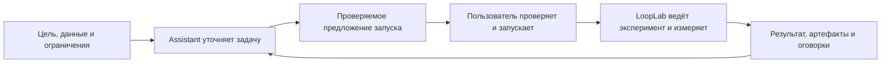
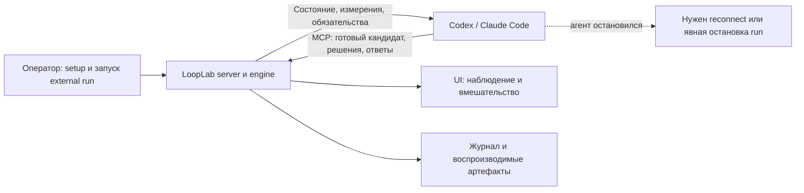

# 71. Снижение порога входа в LoopLab

**Дата:** 2026-09-30. **База:** `master` / `origin/master`, `1103ba87b22cd3c02dcae80db87473d0c8ae8374`.
**Статус:** аудит и план; первый пакет изменений реализован частично (см. §13).
**Основной сценарий:** человек работает через Assistant в desktop UI.
**Второй сценарий:** Codex / Claude Code управляет экспериментом как внешний агент.

Это датированный документ. Поведение определяют текущие исходники и тесты; практические
инструкции должны жить в README и [User Guide](guide/index.md), а не переезжать сюда.

## 1. Вывод и рекомендуемый порядок

LoopLab уже умеет принимать задачу в чате, показывать проверяемое предложение запуска,
вести эксперимент и объяснять измеренный результат. Порог входа повышают прежде всего
**порядок знакомства с продуктом, обнаружение настройки модели и неявный следующий исполнитель**.
Новый пользователь слишком рано встречает архитектуру, варианты CLI, политики поиска,
структуру журналов и терминологию движка.

Предлагается:

1. Сделать **«Опиши задачу в Assistant»** главным входом README, сайта и общего quickstart.
2. Дать рядом самостоятельный путь **«Подключить своего coding agent»**, явно отделив его от
   делегирования только Developer.
3. До первого сообщения показать готовность модели и дать короткий пример запроса.
4. На каждом остановившемся шаге назвать **что ожидается, от кого и какое действие продолжит работу**.
5. Сохранить нынешние проверки запуска, происхождение метрик, права и журналы; раскрывать
   их подробности по мере необходимости.

Первый пакет работ: **OB-01, OB-02, OB-03, OB-09**. Особенно важен OB-09:
локально воспроизведён внешний run, который ничего не выполняет, но показывает
«Preparing the first experiment…» со спиннером.

## 2. Метод и границы проверки

### 2.1. Что проверено

- Перед аудитом подтянуты 159 коммитов из `origin/master`; рабочая ветка и локальный `master`
  fast-forwarded на указанную базу. Наблюдения сделаны после обновления.
- Прочитаны README, главная страница документации, установка, quickstart, UI guide,
  JupyterHub onboarding, external harness guide; сопоставлены с командами и исходниками UI.
- Запущен свежесобранный UI на отдельном пустом run-root. Экранная проверка — Edge,
  viewport **1920 × 1080**, desktop, тёмная тема. Каждый приложенный снимок сохранён и просмотрен.
- Пройден вход в New run, настройки модели, первый результат и диагностика внешнего ожидания.
- Выполнен короткий offline-пример: **3 узла / 3 оценки**, лучший узел `#2`,
  `metric=8.05262`; `inspect` и `replay` завершились успешно.
- Создан отдельный external run без подключённого агента: **0 узлов**, engine жив,
  в Agent cycle — обязательный `research_completed`. После наблюдения run явно остановлен
  через `stop --wait`; процесс вышел, run остался resumable.
- Выполнены `harness`, `harness --help`, `harness-mcp --help`; изучены контракт,
  `harness-progress`, UI-панель обязательств и ветка внешнего цикла движка.

### 2.2. Что не доказано этим аудитом

Это не установка на чистую ОС: использовались существующие Python/Node и окружение машины.
Пустой run-root не равнозначен заводским настройкам; UI показывал три customized values.
Не вызывалась платная модель: ответ Assistant, реальная launch card после ответа и платный
старт исследованы по коду/документации, а не выданы за пройденный end-to-end сценарий.
Не проверялись новая регистрация провайдера, действующая конфигурация клиентов Codex/Claude,
полный MCP-цикл с submit кандидата, реальное обучение MNIST и завершение всех внешних обязательств.
На 2560 × 1440 нужен отдельный приёмочный прогон. Мобильная компоновка вне этого плана.

Ниже **наблюдение** означает текущий экран, исполненную команду или конкретный исходник.
**Ожидаемый эффект** — продуктовая гипотеза, которую ещё нужно проверить на новых пользователях.
Приоритеты P0/P1/P2 относятся к снижению порога входа, а не объявляют все находки runtime-багами.

## 3. Два пользовательских пути

| | Assistant в UI — основной | Внешний Codex / Claude Code |
|---|---|---|
| Что пользователь хочет | «Вот задача и данные. Проведи эксперименты и покажи, что получилось» | «Продолжай работать в моём coding agent, а LoopLab пусть исполняет и измеряет» |
| Главная поверхность | Диалог + предложение запуска + измеренные результаты | Агентный диалог + MCP; UI для наблюдения и вмешательства |
| Что сообщает человек | Цель, доступные пути, ограничения, допустимые затраты | То же + границы действий агента и подготовленный доступ к run |
| Кто предлагает кандидатов | Встроенный цикл LoopLab после старта | Только внешний агент |
| Что делает LoopLab | Ведёт встроенный цикл, исполняет, проверяет и сохраняет результаты | Принимает готовые кандидаты, проверяет, исполняет, ведёт историю и обязательства |
| Момент первой ценности | Понятный измеренный baseline и следующий шаг | Первый принятый кандидат с измеренной метрикой и понятным продолжением |
| Критический риск понимания | «Чат открыт, значит модель настроена»; «обсудили план, значит run запущен» | «UI жив, значит агент работает»; «команда принята, значит узел уже закончен» |

`developer_backend=codex|claude` — **третий, расширенный вариант конфигурации**:
LoopLab сохраняет Researcher/search, coding agent получает только редактирование кандидата.
Его не следует показывать новичку как синоним внешнего управления всем экспериментом.

## 4. Пройденные экраны и визуальные доказательства

| Шаг | Действие и наблюдение | Оценка для новичка | Доказательство |
|---|---|---|---|
| 1 | Открыть пустой Runs: Assistant виден сразу, но слева уже Projects, portfolio views, фильтры; три из четырёх предложений чата предполагают имеющиеся результаты/работу | Основа хорошая, первый шаг рассеян | [01 — пустой экран](assets/71-onboarding/01-empty.png) |
| 2 | Start a new run в Assistant: поле получает фокус, появляется New run proposal и указание проверить launch card | Понятный вход; не хватает примера и статуса готовности модели | [02 — новый run](assets/71-onboarding/02-new-run.png) |
| 3 | LoopLab → Settings → LLM: настройка доступна; сначала открыт Search & policy с длинными объяснениями | Устройство движка предъявляется раньше подключения помощника | [03 — настройки](assets/71-onboarding/03-settings.png) |
| 4 | Открыть завершённый offline run: автоматически выбран Report; есть улучшение относительно baseline и предупреждение single-seed; Assistant привязан к run | Сильный первый результат; первичная синяя кнопка — Refresh report · paid | [04 — результат](assets/71-onboarding/04-first-result.png) |
| 5 | Открыть external run без агента: Running / Search, спиннер Preparing the first experiment…, 0 узлов | Вводит в заблуждение о том, кто сейчас действует | [05 — ожидание](assets/71-onboarding/05-external-wait.png) |
| 6 | Progress → Agent cycle: виден research gate, требования к concepts/hypothesis и novelty/foresight | Диагностика существует, но требует знания меню и протокола | [06 — обязательства](assets/71-onboarding/06-agent-cycle.png) |
| 7 | Открыть исходную архитектурную SVG из README: роли, search, memory, knowledge, event log на одном листе | Полезная справочная карта; слишком много понятий для первого объяснения | [07 — архитектура](assets/71-onboarding/07-architecture.png) |

### 4.1. Ключевое несоответствие состояния


Тот же run в панели диагностики:


### 4.2. Что сохранить

- Assistant постоянно доступен, имеет отдельную область и явно показывает контекст следующего сообщения.
- New run переводит фокус в composer и поясняет, что старт выполняется через launch card.
- В `LaunchCard.jsx` уже есть server validation, effective preview, защита от повторного старта,
  восстановление неопределённого результата отправки и раскрытие ошибочных полей.
- Settings уже имеет Essential/All, поиск, сохранённое состояние и отдельный тест подключения
  с указанием возможной стоимости.
- Report открывается с вывода и оговорок, не прячет single-seed; есть экспорт и данные графиков.
- Agent cycle уже показывает обязательства и повреждённые источники. Нужна лучшая подача
  существующих фактов, а не второй независимый источник истины.

## 5. Где документация повышает порог входа

| Поверхность | Наблюдение | Что поменять |
|---|---|---|
| `README.md` | Архитектура и большой список возможностей предшествуют установке. Quick start ведёт через CLI, inspect/replay и варианты задания задачи | Первый экран: результат продукта, два пути, маленький пример диалога; архитектуру и каталог возможностей ниже |
| [Главная документации](index.md) | Первый hero CTA — Explore architecture infographic; Assistant не главный вход | Основной CTA «Начать через Assistant», второй «Подключить coding agent», архитектура третьим уровнем |
| [Installation](guide/installation.md) | Основной install без UI extra; нет полного clone/cd/venv-пути; Node отсутствует в Requirements; в extras нет harness | Рекомендуемая UI-установка из checkout с точными предпосылками; отдельно headless и harness; варианты PowerShell/POSIX |
| [Quickstart](guide/quickstart.md) | Offline CLI → содержимое run directory → real LLM → crash/resume; UI только в Next steps | Общий quickstart через Assistant; CLI demo и структура хранения — отдельные рецепты |
| README vs quickstart | Регрессионный пример README использует default llm, guide явно задаёт toy | Перед каждой командой назвать режим и возможность расходов; общий тестируемый источник примеров |
| [UI guide](guide/ui.md) | Вводная начинается с отдельного процесса, SSE, event folding; много текста об atomic build перед пользовательским сценарием | Сначала «открыть → описать → проверить → запустить → понять результат»; сборку и восстановление в troubleshooting/development |
| [JupyterHub onboarding](guide/jupyterhub-onboarding.md) | Part B уже прямо называет Assistant основным путём и объясняет, что сообщать; Part A содержит семь инфраструктурных шагов | Переиспользовать Part B в общем onboarding; оставить hub/proxy/storage-детали в deployment |
| [External harness](guide/external-harness.md) | Верно различает два режима, но установка, два токена, отдельный engine, MCP и динамические обязательства предшествуют первому результату | Короткий happy path с готовым handoff, затем reference и recovery; видимая граница operator/agent |
| [Guide index](guide/index.md) | External coding agents описан через Developer integration/migration; Web UI в разделе Operating | Навигация по намерению: Assistant / external agent / CLI automation; названия соответствуют режимам |
| Схемы | Большая SVG и inline-схема главной объясняют внутренний цикл; не показывают два пользовательских входа и владельца следующего шага | Две вводные схемы из §9; полную архитектуру сохранить как справочную |

Есть конкретный дрейф предпосылок: JupyterHub guide говорит «Node ≥ 20», а
`ui/package.json` задаёт `^20.19.0 || ^22.13.0 || >=24.0.0`. Надо ссылаться на один
поддерживаемый диапазон и проверять его автоматически. Не обещать установку опубликованного
пакета одной командой, пока такой путь и наличие готового UI bundle не проверены на чистой машине.

## 6. Реестр проблем и критерии исправления

Все OB-пункты ниже — **предложения к реализации** на базе этого аудита.
Сложность указана относительная: S — локальная правка, M — несколько согласованных поверхностей,
L — изменение протокола/жизненного цикла. Это не оценка в рабочих днях.

### OB-01 · P0 · S — Главный путь спрятан за архитектурой и CLI

**Основание:** README, docs home, quickstart; §5. Пользователь должен выбрать из нескольких
технических способов старта, прежде чем увидит целевой сценарий общения.

**Изменение:** одна стартовая страница с двумя действиями; UI выбран основным. В первом примере
показать цель → уточнение → launch card → измеренный результат. Переиспользовать JupyterHub Part B.

**Приёмка:** новый пользователь от README до описания своей задачи проходит один явно обозначенный
маршрут без чтения архитектуры, YAML, adapter registry и replay. CLI остаётся доступным рецептом.

### OB-02 · P0 · M — Установка не собирается в один воспроизводимый путь

**Основание:** Installation, UI guide, `pyproject.toml`, `ui/package.json`; §5.

**Изменение:** дать полный путь из репозитория: clone, cwd, venv, нужные extras, проверка Python/Node,
запуск сервера, ожидаемый адрес и результат. Различать исходную сборку UI и поставку с готовым bundle.
Предлагать короткую диагностику окружения до запуска, с адресным исправлением отсутствующей зависимости.

**Приёмка:** инструкция проходит на чистых Windows/PowerShell и Linux/POSIX; ветка UI
не заканчивается placeholder вместо приложения; harness extra документирован. Диагностика
не запускает модель и ясно отделяет свою проверку от платного теста провайдера.

### OB-03 · P0 · M — Готовность Assistant не видна рядом с composer

**Основание:** шаги 1–3; `Settings.jsx::LlmHealth`. Настройка/проверка есть в Settings,
но стартовый Assistant не сообщает, проверено ли подключение. В данном окружении по умолчанию
видны `qwen3:8b` и `http://localhost:11434/v1`; их наличие не доказывает доступность модели.

**Изменение:** рядом с первым диалогом показать «модель не проверена / готова / недоступна» и
кнопку подключения. Короткая форма endpoint/model/credential или локальная модель; технические
подробности — раскрываемые. После настройки возвращать в сохранённый черновик задачи.

**Приёмка:** три состояния различаются; отсутствие API key само по себе не считается ошибкой
локального endpoint. Реальный health check запускается явно с уведомлением о возможной цене.
Настройки, которые будет использовать Assistant, не подменяются статусом другого role endpoint.

### OB-04 · P1 · S — Пустой экран использует сценарии зрелого портфеля

**Основание:** шаг 1; `RunList.jsx`, `AssistantChat.jsx`. Projects, Saved view, несколько
фильтров и предложения объяснить best result показываются при нуле runs.

**Изменение:** при нуле данных оставить цель, короткий пример, «Своя задача» и «Посмотреть demo»;
портфельные элементы раскрывать с появлением данных или по действию пользователя.
Demo должно быть явно обозначено offline-примером с измеренными, а не выдуманными результатами.

**Приёмка:** нет предложений объяснить отсутствующий результат; demo доступно без LLM;
возврат опытного пользователя не теряет фильтры/проекты. Desktop остаётся основным форматом.

### OB-05 · P1 · S — Пустой запрос не учит, что именно сообщить

**Основание:** шаг 2; JupyterHub §B2 уже содержит нужное разделение ответственности.

**Изменение:** показать короткий редактируемый пример: цель, путь к repo/data, ограничение времени.
Assistant уточняет только недоступное, сам читает доступные файлы; отсутствующий server-side путь
поясняет до запуска. Attachment «text files» не должен восприниматься как импорт любого датасета.

**Приёмка:** запуск собственной задачи не требует написать Task JSON или придумать `kind`.
Для удалённого сервера явно сказано, на какой машине должен существовать путь.

### OB-06 · P1 · M — Launch card начинает с терминов движка

**Основание по коду:** `LaunchCard.jsx::reviewRows` — Run, Task source, Backend, Model,
Search, Parallel, Time limits. Конфигурация уже свёрнута; проверки и cost disclosure существуют.

**Изменение:** над техническим preview добавить короткое подтверждение смысла:
что улучшаем, чем измеряем и в какую сторону, какие данные/код используем, что разрешено менять,
какие ограничения будут действовать. Техническое представление и точные команды оставить доступными.

**Приёмка:** человек может ответить на эти вопросы без чтения JSON. Неизвестное явно названо.
Изменение черновика по-прежнему отменяет validation; Start привязан к проверенному preview.
Не убирать проверку или idempotency ради сокращения числа кликов.

### OB-07 · P1 · S — Четыре режима чата требуют изучения до первого результата

**Основание:** шаги 1–4 показывают Plan, Ask, Auto-edit, Auto и технические help-тексты.

**Изменение:** оставить текущие права, но объяснять их через ближайшее действие:
«Сейчас обсуждаем и готовим предложение. Запуск — после вашей проверки».
Для routine-изменений отдельно показывать, когда будет запрошено подтверждение.
Продвинутый выбор режимов доступен без обязательного изучения всех четырёх.

**Приёмка:** Plan допускает обсуждение/предложение, не создавая впечатления начатого run;
видимый режим соответствует серверной политике; настройка не переключается незаметно.

### OB-08 · P1 · S — Essential settings остаются справочником устройства движка

**Основание:** шаг 3. В первом разделе длинные определения Profile/Policy/parallel,
runtime-access toggles, ASHA-детали и backlog-примечание.

**Изменение:** начальная настройка: модель, доступные ресурсы, лимиты. Остальные defaults
сохранить; описания полей сократить до пользовательского результата, детали раскрывать.
Не менять смысл нуля/auto/unbounded и не скрывать отсутствие денежного лимита.

**Приёмка:** подключить модель можно без чтения MCTS/ASHA и прав Strategist; опытному
пользователю остаются поиск, All и точные текущие значения.

### OB-09 · P0 · M — Ожидание внешнего агента выглядит как выполняемая работа

**Основание:** шаги 5–6; `ui/src/runIndex.js` — ветка empty canvas при `engine_running`;
`looplab/engine/orchestrator.py` — внешняя ветка ждёт готовые injection/commands.

**Изменение:** на основной поверхности вывести external mode, владельца следующего шага,
актуальный blocker и ссылку на Agent cycle. Для воспроизведённого случая:
«Ожидается внешний агент. Перед первым кандидатом нужно записать исследовательское решение».
Отсутствие новых событий не доказывает смерть агента; без достоверной проверки связи писать
«состояние подключения неизвестно», а не «агент отключён».

**Приёмка:** внешний run с 0 узлов и без агента не обещает подготовку эксперимента.
Видны отдельно: server доступен, engine жив/остановлен/неизвестен, evaluation работает,
ожидается ответ checkpoint, нужен кандидат, требуется finish review. Нет вечного спиннера
на статичном ожидании. Данные берутся из текущего progress/state, а не выводятся из одной давности события.

### OB-10 · P1 · M — Первое подключение внешнего агента требует ручной сборки контекста

**Основание:** external guide, `harness-mcp --help`, `harness/manifest.py`, `mcp_server.py`.
Нужно сопоставить UI URL, run-root, run ID, engine process, MCP, два вида credential и выбранный режим.

**Изменение:** операторский шаг «Подключить внешнего агента» формирует проверяемую инструкцию
и handoff с URL, run identity, workspace, режимом, разрешёнными действиями и маршрутом recovery.
Credentials передаются отдельно штатным защищённым механизмом клиента; в копируемом тексте,
скриншотах и журнале секретов нет. Клиентские примеры проверяются для поддерживаемых версий.

**Приёмка:** UI и engine смотрят на один run-root; target run действительно external;
агент начинает с capabilities/contract/progress. Токен harness не описан как изолированный
доступ ровно к одному run: текущий scope шире. Для первого рецепта использовать отдельный сервер/root
с external runs, как предупреждает действующий guide про управление internal runs тем же токеном.
Не выдавать owner token для обхода запрета launch.

### OB-11 · P1 · M — Контракт сообщает обязанности, но следующий шаг приходится собирать

**Основание:** `harness/progress.py` уже возвращает blockers, candidate requirements,
pending checkpoints, finish requirements, policy preview и source health;
`panels.jsx::HarnessProgressPanel` отображает технические команды отдельными секциями.
Стандартный `harness` в этой проверке содержит 16 верхнеуровневых полей,
около 25 KB JSON при повторной сериализации — это измерение конкретной версии, не лимит API.

**Изменение:** поверх существующего контракта дать краткую сводку текущего хода:
что блокирует работу, кто отвечает, куда читать и какой тип ответа требуется.
Сначала вопросы текущей оценки/неполные источники, затем admission нового кандидата и finish.
Полный schema/историю загружать адресно. Это расширение discovery, а не автоматический научный ответ.

**Приёмка:** агент не вынужден пробовать запрещённые POST, чтобы обнаружить обязательство;
пагинация и source health не теряются; после событий/ответов сводка обновляется;
`policy_preview` остаётся рекомендацией, не разрешением создать кандидат от имени агента.

### OB-12 · P1 · M — Reconnect и «агент умер» не оформлены как пользовательский сценарий

**Основание:** external guide описывает отдельные процессы, durable commands, generation и resume,
но их нужно собрать в собственную процедуру. Шаг 5 показывает, почему одного Running мало.

**Изменение:** один recovery-рецепт: проверить UI/engine, прочитать current identity и receipts,
разрешить неопределённый результат уже отправленной команды, прочитать checkpoints/progress,
продолжить либо явно остановить. Не создавать новый run по умолчанию.

**Приёмка:** завершение процесса агента не представляется завершением исследования;
закрытие браузера не представляется остановкой engine. Повторное подключение не дублирует кандидат.
Checkpoint после завершения evaluator остаётся видимым ожиданием verdict, а не «зависшим train».
Автоматическая замена внешнего агента встроенным возможна только как отдельно спроектированное
явное действие с понятными последствиями, не как скрытый fallback.

### OB-13 · P2 · S — Первичный акцент отчёта предлагает ещё один платный запрос

**Основание:** шаг 4: результат и caveat уже выведены, синяя кнопка — Refresh report · paid.

**Изменение:** первым продолжением сделать чтение/воспроизведение уже измеренного результата:
«Что получилось», «Открыть решение», «Сравнить с baseline». Refresh report оставить отдельным
действием с текущим предупреждением. Короткая карточка результата в чате может собираться
детерминированно, без оплачиваемого пересказа при каждом открытии.

**Приёмка:** baseline, лучший результат, направление метрики, степень подтверждения и
путь к артефактам доступны без дополнительного model call. Toy обозначен учебным примером.

### OB-14 · P2 · S — Схема возможностей используется как схема первого действия

**Основание:** шаг 7, README и docs home. Различение agent/model и deterministic engine полезно,
но Genesis/Strategist/Reflector, memory/search/knowledge и event log требуют предварительного словаря.

**Изменение:** перед большой SVG дать две короткие схемы из §9. Встроенный цикл и external mode
имеют разные подписи владельца предложения; нет впечатления, что internal Researcher работает всегда.

**Приёмка:** человек по вводной схеме объясняет, где пишет задачу, кто запускает оценку,
где получает результат и кто должен продолжать. Есть текстовый эквивалент схемы.

### OB-15 · P1 · M — Demo, эксперимент и платный Assistant недостаточно разведены

**Основание:** разный backend в примерах; UI composer и run имеют разные точки вызова модели;
Settings указывает, что optional model-backed возможности могут использовать модель даже при toy.

**Изменение:** каждому стартовому рецепту назначить честное обещание: полностью offline demo;
Assistant с настроенной моделью; external agent со своим внешним billing. Для demo проверить весь
путь без сети, включая optional features. В launch preview показывать реальные лимиты,
отсутствующий денежный cap обозначать прямо; не обещать денежный cap, которого нет в конфигурации.

**Приёмка:** пользователь до действия различает оплату чата, встроенного цикла и внешнего агента;
метрики затрат LoopLab не выдаются за полный счёт coding agent. Нет неожиданного LLM-вызова в offline-рецепте.

### OB-16 · P2 · M — Путь новичка требует отдельной проверки читаемости и доступности

**Основание:** шаги 1–4. При Assistant справа основная поверхность получает около половины
Full HD; длинные settings-help занимают много строк, run toolbar тесный. В AX есть названия
кнопок, splitter с клавиатурой и View data для графиков — это хорошая основа.

**Изменение:** проверить первые шаги при 1920 × 1080 и 2560 × 1440, zoom 100/125%, keyboard-only.
Первичный текст крупнее справочного, короткие подписи без обрезания смысла, ошибки рядом с полями.
Улучшать плотность desktop-контента, не начинать мобильный redesign.

**Приёмка:** фокус не теряется при переходе в настройки/возврате к задаче; все обязательные
действия доступны клавиатурой; статус различим без цвета. Контраст нужно измерить отдельно:
этот визуальный аудит не является доказательством соответствия WCAG.

## 7. Целевой quickstart через Assistant

### 7.1. Пять шагов после открытия UI

1. **Проверить готовность.** Показать рабочую папку/сервер и модель. «Подключить модель» или
   «Открыть offline demo» — конкретные действия; advanced settings пока не нужны.
2. **Описать задачу.** Короткая цель и пути. Если данных недостаточно, Assistant задаёт одно
   связное уточнение; доступные README/entry scripts читает сам.
3. **Проверить предложение.** Цель, критерий успеха, данные, editable surface, compute и лимиты.
   Существующие Validate → effective preview → Start остаются границей фактического запуска.
4. **Понять текущую работу.** В чате/рядом с ним: «baseline выполняется», «нужно уточнение»
   либо конкретный blocker. Есть явная остановка. Технические события можно раскрыть.
5. **Получить первый результат.** Baseline/лучший узел, чем отличаются, caveat и доступное решение.
   Следующее действие — продолжить, проверить ещё раз или завершить, с понятными последствиями.

### 7.2. Пример стартового запроса

> Хочу улучшить accuracy на MNIST в репозитории `<путь к repo на сервере LoopLab>`.
> Данные доступны в `<путь к данным>`. Для первой пробы используй CPU,
> не больше трёх экспериментов и пяти минут на весь run. Сначала покажи,
> какой командой будешь измерять baseline и какие файлы менять.

Это **шаблон пользовательского намерения**, не обещание, что любой MNIST repo уложится в пять
минут. Assistant должен проверить наличие данных, dependencies, scorer и измеримость бюджета.
Скрыто загружать большой dataset или считать частичный checkpoint завершённым baseline нельзя.

### 7.3. Короткие подписи для прототипа

| Место | Предложение текста |
|---|---|
| Пустая установка | «Какую задачу будем исследовать? Укажите цель и где лежат код или данные» |
| До первой настройки | «Для диалога нужна модель. Подключите её или откройте offline demo» |
| Предложение | «Запуск ещё не начат. Проверьте задачу, измерение и ограничения» |
| External wait | «Следующий шаг — за внешним агентом. Требуется исследовательское решение» |
| Неизвестная связь | «Состояние подключения агента неизвестно. Последнее действие: …» |
| После оценки | «Измерение готово. Лучший результат …; подтверждение: …» |

Текущий UI англоязычный; это смысловые образцы. Язык shipping-copy нужно согласовать
со всем интерфейсом, не смешивать русский и английский случайными фрагментами.

## 8. Целевой quickstart для внешнего агента

### 8.1. Разделить setup оператора и рабочий цикл агента

**Оператор один раз:** устанавливает UI+harness, запускает server с правильным root,
подготавливает credentials и task, создаёт run в `external_harness=true` с `backend=toy`,
проверяет идентичность run и передаёт агенту scoped доступ. Внешнее владение решениями включает
именно `external_harness=true`; `toy` — рекомендуемый backend этой комбинации, а не обещание нулевой стоимости внешнего LLM
или бесплатного вычисления самой задачи. Scoped harness credential не даёт право launch.

**Агент на каждом подключении:** читает capabilities, state/task/config, harness-contract и
harness-progress с текущим `expected_generation`, затем релевантные `phases`/`phase_info`.
После событий и ответов обновляет state/progress. Вызывает существующие durable operations,
не переписывает event log и не подставляет заявленную метрику вместо scorer.

**Для человека:** готовый handoff должен экономить ручное перечисление API, но сохранять
ссылку на контракт и локальные особенности task. UI — наблюдение и управление этим же run.

### 8.2. Минимальный handoff без секретов — предлагаемая форма

```text
Режим: external harness
UI/MCP endpoint: <URL>
Run: <run_id + текущая generation>
Workspace и task: <ссылки/пути, видимые этому серверу>
Credentials: настроены отдельно; owner credential агенту не передаётся
Прочитай contract + progress и выполни обязательный следующий шаг.
Только ты предлагаешь кандидатов; LoopLab проверяет и измеряет их.
После отправки проверь receipt, node state и checkpoints.
При завершении закрой finish obligations и явно finalize; для перерыва pause.
Если связь потеряна, сначала восстанови state и результат уже отправленной команды.
```

Это описание будущего bootstrap UX, **не существующая команда и не новый формат протокола**.
Generation из handoff нельзя использовать бессрочно: после reset/recovery читать актуальную.

### 8.3. Что должно быть на одной странице recovery

| Ситуация | Что объяснить и предложить |
|---|---|
| UI работает, внешний агент не отвечает | Server и engine независимы от процесса агента; готовые оценки могут продолжаться, новые идеи не появятся сами |
| Требуется checkpoint verdict | Показать вопрос и ответственного; терминал узла может ждать ответа даже после завершения команды оценки |
| Candidate отклонён | Показать конкретное нарушенное обязательство/поле и актуальную phase/schema; не предлагать выключить все проверки |
| Команда принята, результата нет | Различать submitted/accepted/applied/deferred/terminal; проверить тот же command identity до повтора |
| Engine остановлен | Resume существующего run; затем перечитать state и outstanding work; одно лишь подключение MCP engine не запускает |
| Смена generation | Отбросить устаревший контекст, перечитать contract/progress и проверяемые кандидаты/receipts |
| Нужно закончить | Обработать pending nodes, требуемые отчёт/reviews; finalize явно. Закрытие чата не заменяет финализацию |
| Повреждён журнал | Показать source health/неполноту; отсутствие строки не трактовать как доказательство отсутствия действия |

Не создавать впечатления полной семантической идентичности встроенных novelty/foresight/listwise
judges внешним решениям: для этого уже существует `delegated_semantics` в контракте.

## 9. Предлагаемые вводные схемы

### 9.1. Основной путь: общение через UI



Текстовый эквивалент: человек описывает задачу; Assistant готовит предложение;
после проверки LoopLab запускает эксперимент; измеренные результаты возвращаются в тот же рабочий диалог.

### 9.2. Внешнее управление: три независимые стороны



Текстовый эквивалент: оператор подготавливает run; внешний агент предлагает и отвечает;
LoopLab исполняет и сохраняет доказательства. Живой UI не доказывает, что агент продолжает работу.
Большая [архитектурная схема](infographic/architecture-one-pager.svg) остаётся следующим уровнем детализации.

## 10. План изменений по небольшим поставкам

| Поставка | Содержание и затронутые поверхности | Зависимости | Проверяемый результат |
|---|---|---|---|
| A — вход и инструкции | OB-01/02/14; README, home, Installation, Quickstart, guide index; общий Assistant-рецепт из JupyterHub | Нет | Два ясных входа; чистая установка обоих рецептов |
| B — честное ожидание | OB-09 + recovery-часть OB-12; run status, empty canvas, Agent cycle, attention | Текущие state/progress | External wait виден без поиска по меню; нет ложного «готовим» |
| C — первый диалог | OB-03/04/05/07; Assistant, empty Runs, provider setup | A; существующие настройки/health | Новичок подключает модель и формулирует задачу без открытия All settings |
| D — понятный запуск и результат | OB-06/08/13/15; launch summary, настройки, Report, offline demo | C; серверный preview | Понятны измерение, ограничения, расходы и результат; все guards сохранены |
| E — внешний bootstrap | OB-10/11/12; operator setup, MCP discovery, handoff/reconnect guide | A+B; контракт доступа | Новый agent session получает первый measured candidate без ручного поиска endpoint |
| F — приёмка читаемости | OB-16 и проверки обоих путей | B–E | Full HD/2K, zoom, keyboard, реальные новые пользователи |

Для A сначала достаточно существующих команд и документов. Упаковку «одна команда установки»,
новый diagnostic CLI и lifecycle/heartbeat API нужно проектировать отдельно, если они понадобятся
после упрощения текущего пути. Не добавлять ещё один wizard поверх несогласованных инструкций.

### 10.1. Какие документы должны остаться источником истины

1. README — назначение, два входа, короткий работающий старт, ссылки.
2. Общий Quickstart — запуск через Assistant и получение результата.
3. External harness quickstart — подготовка оператором, handoff, первая оценка, reconnect.
4. Installation / Deployment — ОС, среда, JupyterHub, proxy, сборка.
5. Reference — CLI, settings, API/contract, термины, структура артефактов.
6. Номерные документы — причины решений и история; они не обязательное чтение для пользователя.

Новые короткие страницы должны переиспользовать команды и правила из reference. Не копировать
таблицы всех settings и не оставлять две несовместимые версии launch-пути.

## 11. Приёмочная матрица и измерение успеха

### 11.1. Обязательные сценарии

| Сценарий | Успех |
|---|---|
| Чистая Windows и Linux, source install | UI открыт, prerequisites заранее понятны, нет неописанного ручного build шага |
| Нет модели / недоступна / невалидный credential | Ошибка до первого содержательного диалога или явно на этом шаге; доступно исправление с сохранением черновика |
| Модель доступна, задачу описали обычным текстом | Появляется проверяемое предложение; пользователь понимает, что старт ещё не произошёл |
| Неправильный путь / нет scorer / запрещённый edit | Адресная ошибка и понятное следующее действие; нет ложного baseline |
| Offline demo без сети | Есть реальная оценка и Report без обращения к LLM |
| Первый реальный короткий ML-пример | Один измеренный baseline, правильная метрика/direction, доступный артефакт; бюджет соблюдён |
| Двойной Start / потеря ответа / reload | Один run; восстановление той же операции и черновика |
| Внешний run, агент ещё не подключён | Явное ожидание внешнего действия с актуальным blocker |
| Внешний агент пропал до submit и после submit | UI остаётся понятным; после reconnect не дублируется кандидат |
| Checkpoint во время оценки и после её завершения | Видно, кто должен ответить; node не объявлен готовым преждевременно |
| Stop/resume, новая generation, incomplete journal | Состояния различимы; stale command не принимается за актуальный результат |
| Finish obligations ещё не закрыты | Конкретный список оставшейся работы; отсутствие инициативы агента не маскируется под успех |
| Desktop 1920/2560, zoom и keyboard | Нет недоступных основных действий, обрезанных существенных подписей и потери фокуса |

Проверки UI должны проходить через реальные компоненты и серверный контракт; screenshots fixture
недостаточно для lifecycle. Внешний happy path проверять тестовым агентным клиентом с настоящими
durable receipts и evaluator. Текущий аудит **не означает прохождение всей этой матрицы**.

### 11.2. Метрики для первого usability-прогона

Сначала измерить текущую базу на пяти новых пользователях UI и пяти сессиях внешнего агента,
затем повторить после изменений. Это небольшой качественный пилот, не статистическое доказательство.

- Время от открытого UI до понятного launch proposal; отдельно время установки и provider setup.
- Время до первой измеренной оценки; отдельно собственно длительность evaluator.
- Доля прошедших путь без подсказки разработчика и без самостоятельного редактирования Task JSON.
- Число переходов в reference/terminal только для выяснения следующего шага.
- Правильность ответа «кто сейчас действует / ждёт / что нужно сделать».
- Случаи неожиданных платных действий и повторных запусков.

**Предлагаемые цели пилота, не текущие показатели:** 4 из 5 пользователей каждого пути доходят
до первой оценки без помощи разработчика; все понимают момент фактического запуска и режим расходов;
все правильно определяют внешнее ожидание. Для подготовленного demo целиться в ≤5 минут
от открытия UI до результата; сетевую установку зависимостей и реальное обучение считать отдельно.

## 12. Источники и локальная воспроизводимость

### 12.1. Источники реализации на указанной базе

- `README.md`; `docs/index.md`; `docs/guide/{index,installation,quickstart,ui,jupyterhub-onboarding,external-harness}.md`.
- `pyproject.toml` — extras; `ui/package.json` — версия Node; `docs/infographic/architecture-one-pager.svg`.
- `ui/src/{RunList,AssistantChat,LaunchCard,Settings,RunView,panels}.jsx`;
  `ui/src/runIndex.js` — причина misleading empty state.
- `looplab/harness/{manifest,contract,progress,phases,mcp_server}.py` — discovery и обязательства.
- `looplab/engine/orchestrator.py` — ветка `external_harness`; `looplab/serve/settings_store.py` — настройки по run-root.

### 12.2. Команды проб

Из checkout с установленными зависимостями; `<audit-root>` — отдельная новая директория.
Это воспроизведение наблюдений, а не предлагаемая новая главная инструкция пользователя.

```text
python -m looplab.cli ui --run-root <audit-root> --host 127.0.0.1 --port 8766
python -m looplab.cli run examples/toy_task.json --out <audit-root>/first-demo --backend toy --max-nodes 3 --no-genesis
python -m looplab.cli inspect <audit-root>/first-demo
python -m looplab.cli replay <audit-root>/first-demo
python -m looplab.cli harness
python -m looplab.cli run examples/toy_task.json --out <audit-root>/external-demo --backend toy --max-nodes 3 --no-genesis -s external_harness=true
python -m looplab.cli stop <audit-root>/external-demo --wait --timeout 20
```

External run здесь намеренно не получал кандидатов и не был finalized: он использовался
для наблюдения ожидания, затем был явно остановлен. Первый offline run завершён.
Снимки содержат только специально созданные демонстрационные данные.

### 12.3. Проверка документа

- `tests/test_documentation_contracts.py`: **14 passed**; относительные ссылки и реестр номерных документов согласованы.
- `mkdocs build --strict`: **успешно**; новая страница включена в навигацию сайта.
- `git diff --check`: ошибок whitespace нет.
- После исходного аудита изменены UI и документация; итоги повторной проверки указаны в §13.

## 13. Первый пакет исправлений

Это журнал реализации, а не изменение исходных наблюдений выше. Статус «частично» означает,
что у проблемы остались сценарии из приёмочной матрицы §11, которые ещё не закрыты.

| Пункт | Статус | Что сделано | Что остаётся |
|---|---|---|---|
| OB-01 | Сделано | README, главная, индекс и общий quickstart ведут сначала к Assistant; offline CLI сохранён отдельным путём. | Проверить понимание пути с новыми пользователями. |
| OB-02 | Частично | Installation теперь перечисляет поддерживаемые версии Node, source install для Windows/POSIX и нужные extras. | Проверить установку на чистых Windows и Linux. |
| OB-03 | Частично | Пустой Assistant предлагает открыть непосредственно LLM settings. | Проверка соединения и адресная ошибка рядом с composer ещё нужны. |
| OB-04 | Частично | При нуле run убраны подсказки для готового портфеля, список зовёт описать цель. | Сократить сложность навигации первого запуска. |
| OB-05 | Частично | Подсказка для нового run просит цель, путь к коду/данным и бюджет; текст поясняет отдельное утверждение launch proposal. | Проверить формулировку на реальных пользовательских задачах. |
| OB-06 | Частично | Launch card показывает цель, метрику, направление, пути, применимые права и лимиты перед техническими настройками; проверенный обзор берётся из серверного preview. | Проверить читаемость карточки с длинными путями на desktop и с реальным новым пользователем. |
| OB-07 | Частично | Composer показывает активные права и понятное пояснение; четыре варианта раскрываются по запросу, выбор возвращает фокус на видимый переключатель. | Проверить понимание режимов с новым пользователем. |
| OB-08 | Частично | Essential открывается с модели, показывает 13 полей ресурсов и лимитов с короткими пояснениями; технические детали и runtime permissions раскрываются отдельно. | Проверить подключение модели и понимание лимитов с новым пользователем. |
| OB-09 | Частично | Живой внешний run без узлов показывает роль агента и ссылку на Agent cycle без спиннера подготовки. | Показать точное ожидание и состояние агента в других фазах. |
| OB-10 | Частично | UI готовит проверенный handoff для existing external run; stdio descriptor и инструкция без credential, workspace и reconnect reads. | См. §26: проверен реальный MCP stdio. Клиентская установка, secret storage и матрица версий Codex/Claude остаются ручной настройкой и требуют отдельной приёмки. |
| OB-11 | Реализовано | Общий `next_step` в progress/UI, компактный GET и MCP `run_progress`; source health, gates и пагинация сохраняются. | См. §25: проверены контракт, реальные subprocess-кандидаты и desktop; подключение нового клиента относится к OB-10. |
| OB-12 | Реализовано | Recovery-рецепт в UI/MCP/guide; чтение original receipt без worker restart, поиск по ID/key и generation fence. | См. §27: проверены disconnect, новая MCP-сессия и отсутствие дубля. Живость внешнего агента остаётся явно неизмеряемой. |
| OB-14 | Частично | Начало сайта показывает два основных входа. | Большая архитектурная схема всё ещё нуждается в упрощении для первого знакомства. |

Остальные пункты §3 и соответствующие сценарии §11 остаются открытыми. Изменения первого
пакета проверены на desktop 1920 × 1080 в пустом UI и на настоящем внешнем run без узлов;
это не доказывает прохождение всей приёмочной матрицы.


Повторная проверка: **1761/1761 UI тестов**, **14/14 проверок документации**,
`npm --prefix ui run build`, `npm --prefix ui run check:bundle` и
`mkdocs build --strict` прошли. Внешний тестовый run остановлен; его 0 узлов
не выдаются за измеренный результат.

## 14. Упрощение пустого рабочего пространства

На действительно пустой установке без проектов, сохранённых видов, фильтров и незавершённых
операций список Runs теперь показывает один стартовый экран. Навигация по портфелю, сортировка,
фильтры, плотность и эффекты появляются после первого run или при наличии сохранённого контекста.
Существующие проекты, виды и recovery не скрываются. В черновике нового run Assistant напоминает
о путях на сервере и показывает короткий пример цели с лимитом экспериментов. Это дальнейшая работа
по OB-04/05; остальные ограничения, перечисленные в §13, сохраняются.

## 15. Первый акцент отчёта

По OB-13 платное обновление Report перемещено после бесплатных действий чтения и экспорта
измеренного результата. Его кнопка больше не выделена как основное действие. Текущие
предупреждение о стоимости, idempotency и восстановление ответа сохранены. Более короткий
детерминированный итог в чате остаётся открытой задачей.

## 16. Подключение модели из черновика

Ссылка на настройки модели теперь остаётся видимой и после начала черновика первого run.
Переход в Settings и обратно сохраняет черновик Assistant. Подсказка в Settings перечисляет
порядок действий: Model и Base URL, сохранение, затем явная проверка соединения. Проверка может
стоить денег; для локального endpoint ключ может не требоваться. Статус соединения пока не
показывается возле поля чата автоматически, поэтому OB-03 остаётся частично открытым.

## 17. Короткий Quickstart

Общий [Quickstart](guide/quickstart.md) теперь заканчивается после пяти шагов через Assistant
и короткой ссылки на альтернативы. Подробные offline demo, `inspect`/`replay`, пример с живой
моделью и crash/resume перенесены в отдельный [CLI walkthrough](guide/cli-walkthrough.md).
Старый якорь `#offline-cli-walkthrough` оставлен в Quickstart как переход, а ссылки сайта,
README и установки ведут сразу к полному рецепту. В настройке Assistant пояснено, что
локальный endpoint по умолчанию требует работающего Ollama и загруженной модели; сохранённые
значения не доказывают доступность соединения. Сборка MkDocs в строгом режиме и 14 проверок
документации прошли. Offline toy run на двух узлах завершился с измеренным результатом;
`inspect` и `replay` его прочитали.

## 18. Статус модели рядом с первым диалогом

Пустой Assistant теперь читает сохранённую конфигурацию через `GET /api/settings` и показывает
имя модели, а также отдельные состояния: соединение не проверено, последний явный тест прошёл,
тест не прошёл, исход теста неизвестен или настройки не удалось прочитать. Для состояния ключа
`missing` локальная модель не объявляется неисправной. Результат теста передаётся из Settings
без ключа и сверяется с обеими ревизиями сохранённых настроек; после изменения модели старое
«тест прошёл» не показывается. Обновление статуса само не обращается к провайдеру и не может
подтвердить текущую доступность модели без явного теста. После обновления страницы результат
теста не восстанавливается, поэтому честно возвращается «соединение не проверено».

Это продвигает OB-03, но не закрывает встроенное редактирование endpoint и модели возле composer.
Проверка: 1765 UI-тестов, 14 контрактных проверок документации, сборка UI,
`check:bundle` и `mkdocs build --strict` прошли. Лимиты бандла обновлены по измеренным
размерам; начальный JS остаётся в прежнем пределе, статус загружается только для первого run.

## 19. Смысл запуска перед техническим preview

По OB-06 карточка запуска теперь начинает свёрнутый обзор с блока **What this run will do**:
цель, заявленная метрика и направление улучшения, пути к коду/данным, применимые правила
редактирования, лимит экспериментов и времени. Для task file до бесплатной валидации
карточка не угадывает его содержимое. Если поле отсутствует в предложении, она прямо
пишет, что оно не указано. После валидации обзор строится из серверного preview; изменение
черновика по-прежнему инвалидирует проверку. Точные команды, JSON, параллельность и
раскрытие стоимости остаются в карточке ниже.

## 20. Режим чата без обязательного изучения четырёх вариантов

По OB-07 под полем сообщения теперь видны **Permissions · Plan** (или текущий режим)
и пояснение того, что Assistant сможет сделать. Четыре режима доступны в раскрываемом
списке; каждый объясняет автоматические действия и необходимость подтверждения до выбора.
В Ask явно указано, что повторное действие можно одобрить только для текущего turn.
Для нового run подсказка показывает последовательность: обсудить цель, проверить карточку
через Validate, выбрать Start run. Прямой запуск оператором из карточки возможен и в Plan.

Раскрытие списка не меняет права. Выбор сохраняет существующие канонические mode ID и
политику сервера; заблокированные варианты можно прочитать, но нельзя применить.
После выбора список закрывается, фокус возвращается на его summary. Enter раскрывает
и закрывает список. Настройки composer по-прежнему принадлежат конкретному чату.

Проверка на изолированном пустом UI: 1920 × 1080 и 2560 × 1440, раскрытие с клавиатуры,
подготовка нового run без отправки сообщения. Горизонтального переполнения у composer
и выбора прав нет. **1769/1769 UI-тестов**, production build и `check:bundle` прошли.
Один лимит owner List JS обновлён по измерению 220 270 B (+314 B); остальные лимиты
и начальная загрузка укладываются в прежние пределы.


## 21. Начальные настройки: модель, ресурсы и лимиты

По OB-08 **Essential** сокращён с 18 до 13 полей в трёх разделах. Первым открывается
**Model**, где Model, Base URL и API key идут перед выбором experiment runner. Затем
**Experiments & resources** и **Time & model budgets**. Profile, Policy и настройки
внутренних ролей доступны через **All** и поиск. Дефолты, типы, ограничения значений,
права и механизм сохранения не изменены.

Короткие пояснения сохраняют смысл `0 = AUTO` для параллельности при запуске,
пустых временных лимитов и нулевых бюджетов модели. Денежный лимит и лимит токенов
теперь видны в Essential. Денежный контроль использует оценки и требует цен провайдера;
он не обещает точный итоговый счёт. Бюджеты run не включают Assistant chat.
Полное исходное описание доступно через **Technical details**, права внутренних
ролей — через **Runtime permissions**. Раскрытие не меняет права.

Подсказки хранятся в серверном каталоге настроек и проверяются его loader, HTTP-моделью
ответа и клиентом. **All** сохраняет все 249 полей; поиск охватывает весь каталог,
включая технические ключи. При переключении All/Essential сохраняется выбранный раздел.
Quickstart и UI guide обновлены под новые названия разделов.

Проверка: **1771/1771 UI-тестов**, затем **39/39** адресных проверок после уточнения
порядка полей; **3/3** HTTP-проверки каталога. Production build и `check:bundle` прошли.
Предел owner DAG JS обновлён по измерению 399 477 B (+272 B); начальная загрузка,
остальные пределы и проверки разделения маршрутов проходят без изменения лимитов.
На изолированном UI проверены 1920 × 1080 и 2560 × 1440, навигация по вкладкам
клавиатурой, раскрытие полного пояснения, All и поиск MCTS из Essential.
Горизонтального переполнения формы нет. Проверка подключения к реальному провайдеру
и исследование с новым пользователем в этот пакет не входят.


## 22. Понятный результат в чате и карточке эксперимента

По OB-13 завершённый run теперь показывает в Assistant бесплатный **Run result**:
первый допустимый эксперимент, результат, выбранный движком, направление метрики,
наличие confirmation и записанные caveat. Сводка строится из уже кешируемого fold
списка запусков: дополнительных запросов к модели и чтения detail при открытии нет.
Первый допустимый эксперимент не объявляется task baseline; разность двух чисел
не превращается в доказанное улучшение. Выбор берётся из состояния движка, включая
приоритет confirmation, а не переопределяется сортировкой сырых score в браузере.

**Read Report**, **Open selected code** и **Find artifacts** ведут к существующим данным.
Код открывается с точными run generation, node ID и attempt. **Ask about this result**
только готовит вопрос в composer; непустой черновик не перезаписывается. Запрос к модели
делает отдельный Send. В историческом режиме живая сводка не примешивается к snapshot.
Незавершённая финализация не выглядит готовым результатом; неполный источник или
некорректная сводка скрывают числа и объясняют отсутствие данных. При появлении карточки
чат прокручивается вниз только если оператор уже читает его конец.

В **Overview** отдельного эксперимента новый блок **Experiment result** заменяет
неподписанные `metric` и `feasible = true` на понятные части: evaluation score,
направление улучшения, источник значения, confirmation mean, число успешных seeds,
standard deviation и статус допустимости. Отсутствующие данные и один seed не
называются надёжным результатом. В Metrics подпись `robust mean` заменена на
`confirmation mean`. **All metrics & repeat checks** и **Review trust evidence**
открывают нужную вкладку инспектора, не запускают новую оценку.

Для родителей показаны их evaluation score и три состояния условий оценки:
совпадение подтверждено записью, различие с причиной, либо данных недостаточно.
Используется существующая проверка comparability; два отсутствующих receipt не
считаются совпадением. Эти условия не удостоверяют одинаковую процедуру confirmation.
После retarget блок просит проверить источник новой objective в Metrics.
Родительская связь и отсутствие родителей сами по себе не означают ни улучшение,
ни наличие task baseline. Удалённые, aborted и незавершённые эксперименты не
представляются успешно выбранным результатом.

Проверка: **1777/1777 UI-тестов**, затем **3/3** адресных после уточнения пояснения
о повторных проверках; **76 Python-тестов прошли, 1 пропущен**: выбранная строка
не меняет generation token, а его fence проверяется отдельными тестами.
Production build, `check:bundle`, контракт документации и строгая сборка MkDocs прошли.
Лимиты обновлены только для измеренного роста total и owner DAG/Concepts:
587 246 B JS / 57 353 B CSS всего, 400 869 B JS / 46 371 B CSS для owner DAG,
264 356 B JS для owner Concepts. Начальная загрузка остаётся 80.9 KiB JS / 35.8 KiB CSS;
проверки разделения owner/review маршрутов не ослаблены.

На реальном offline toy run из трёх оценённых узлов проверены `inspect`, `replay`,
сводка 78.35 → выбранные 8.053 без заявления доказанного улучшения, переходы к
точному коду, Files, Metrics и Trust. Подготовка вопроса не создала сообщения.
На 1920 × 1080 и 2560 × 1440 горизонтального переполнения блоков нет.
Это продвигает OB-13; достоверное обозначение toy backend и проверка с новым
пользователем остаются отдельными пунктами, поэтому весь пункт не закрыт.


## 23. Явная проверка модели рядом с первым диалогом

Следующий шаг по OB-03: **Check connection…** открывает проверку прямо в первом Assistant,
рядом с черновиком задачи. Открытие читает и валидирует сохранённые настройки и каталог,
не обращается к провайдеру. **Test active LLM** запускается отдельно, с видимым пояснением
возможной оплаты. Ошибка, незавершённая операция и неизвестный результат остаются видимыми
в этом блоке. **Edit model settings** ведёт в существующую настройку модели.

Компонент health вынесен из Settings без второго механизма проверки. Settings и Assistant
используют один deadline, server-resolved active configuration, revision fence, operation ID
и recovery record. Двойное нажатие создаёт одну операцию. После ухода из незавершённой
проверки повторное открытие предлагает **Check previous result** с прежним ID и replay-only
запросом. Обычный новый тест заблокирован при terminal unknown; создание новой операции
сохраняет существующее явное подтверждение возможного повторного списания.
Тест не отправляет черновик чата и не меняет credential.

Настройки чтения проверяются тем же валидатором, что и Settings. Неполный ответ не включает
кнопку теста. Во время проверки и при неизвестном исходе сохраняется launch guard;
навигация не снимает recovery fence. У пояснений health теперь уникальные ARIA ID,
чтобы несколько поверхностей не ссылались на чужую подпись. При открытии блока фокус
переходит в него, если после удаления исходной кнопки фокус остался на body; текущий
фокус composer не перехватывается.

Проверка: **1780/1780 UI-тестов**, затем **11/11** адресных после поправок компоновки,
фокуса и сценария terminal unknown; **30/30** Python-проверок документации и настроек.
Production build, `check:bundle` и строгая сборка MkDocs прошли. Начальный JS остаётся
около 81 KiB; контроль загружается по явному открытию. После выделения общего health-компонента
лимиты total и двух DAG closures обновлены по измерению; ограничения разделения маршрутов
сохранены. Состояния успешного ответа, двойного нажатия, неполного envelope, ухода в полёте,
replay-only и terminal unknown проверены на смонтированных компонентах с HTTP fixtures.

На отдельном пустом UI при 1920 × 1080 и 2560 × 1440 проверены читаемость и перенос блока.
Черновик сохранён при открытии проверки и переходе в Settings. В браузере провайдер не
вызывался: показанное **Connection unverified** не объявляется живым соединением.
Редактирование model/endpoint остаётся в Settings; подключение реального провайдера
и проверка понимания с новым пользователем остаются в приёмке OB-03.


## 24. Выбранный результат и понятный следующий шаг в Report

**2026-10-01.** Исправлено расхождение между Assistant и Report: вывод отчёта теперь берёт
реально выбранный движком узел, а не последний минимум/максимум числового фронтира.
Отсутствующий, незавершённый, исключённый или удалённый выбранный результат не становится
успешным итогом. Один эксперимент называется первым допустимым результатом, без заявления
об улучшении относительно автоматически придуманного baseline.

Сравнение показывает именно evaluation scores и допускается только при записанных совпадающих
условиях, известном направлении и допустимости обоих узлов. Неизвестная/иная сопоставимость,
неполный журнал и retarget оставляют сравнение неустановленным. Confirmation mean показан
отдельно: receipt базовой оценки не переносится на средние повторных проверок.
Эвристический ярлык `robust` удалён; `repeat-checked` описывает число повторов, сохраняя
оговорку о том, что они не доказывают обобщение и статистическую значимость.

Рядом с выводом появился **Next step**: сначала разобраться с флагами Trust, установить
условия сравнения или проверить повторы. Графики и таблица обозначены как записанный
числовой фронтир; сумма его изменений больше не называется доказанным улучшением.
Разделы **Selected experiment** и **Reproduce — selected solution** не обещают победителя.
UI, Markdown и Model card используют один детерминированный вывод и следующий шаг.

Интегрированы 50 свежих коммитов `origin/master` до `5ad3e7c45` без конфликтов.
После интеграции: **1787/1787 UI-тестов**, затем **26/26** адресных после финальных подписей;
**105/105** Python-проверок документации, настроек, проекции результатов и agent-token scope.
Production build и все size/reachability gates прошли: total JS 590319 B gzip,
initial JS 82912 B; total ceiling обновлён до 577 KiB по измерению, остальные сохранены.

В браузере проверен ранее измеренный 3-node quadratic run: выбран #2, score 8.053;
нет ложного доказанного улучшения при неизвестной сопоставимости. При Full HD и 2K блок
вывода не переполняется, ошибок консоли нет. Чтение не вызывало провайдера.
`toy` не используется как признак синтетических данных: этот backend может исполнять реальные
задачи. Достоверное обозначение demo для всех старых запусков остаётся открытым пунктом OB-15.


## 25. Короткий следующий шаг для внешнего агента

**2026-10-01 · OB-11.** `harness-progress.next_step` даёт одну текущую подсказку:
ответственный агент, причина, адреса чтения, phase и требуемый ответ. Приоритет — неполные
источники, затем открытый checkpoint. Пауза, finish и stop intent требуют сверки с live state
и receipts; запись журнала не доказывает, что процесс движка или агента жив. Незавершённые
кандидаты видны как unsettled, а окончание evaluator не заменяет обязательный verdict.

Продолжение и завершение остаются разными решениями. Research/report/concept/selection gates
перед новым кандидатом не навязываются агенту, который решил закончить. Сводка использует
существующие проверки admission/finalization; она не создаёт кандидат, не запускает Researcher
и не обещает допуск по одному отсутствию cycle gate. Idea-bound reviews и task edit surface
сохраняют свои ограничения.

MCP `run_progress(run_id, expected_generation)` читает
`harness-progress?brief=true` одним GET с текущей generation. Ошибки HTTP сохраняются;
скрытого retry/resume/POST нет. Инструмент объявлен read-only. Компактный ответ сохраняет
source health всех четырёх источников, требования continuation/finish, количества и pagination
receipts; тела истории и наблюдений читаются адресно. Списки вопросов/узлов ограничены 20
с явными total/truncation. Полные allowed verdicts берутся из checkpoints, а policy actions —
из полной progress-проекции. Policy остаётся советом.

UI **Progress → Agent cycle** показывает ту же серверную сводку над деталями. Событие запускает
повторное чтение, sidecar-only ответы подхватывает polling. После проваленного refresh или
при более новом известном event подсказка снимается; последние журналы остаются явно прошлыми
данными. Старый сервер без дополнительного поля продолжает показывать прежние секции.

Быстрый live-прогон на отдельном root: scoped harness token, реальный CLI engine и HTTP API,
вызов MCP tool. Первый quadratic-кандидат упал с исключением, второй исполнен sandbox и
измерен со score **0**. Проверены durable inject receipts, pause, resume, явный finalize,
409 на старой generation, `inspect` и replay. Итог — 2 узла, 1 failed и 1 evaluated;
компактный ответ finish занял **2724 B**. Это offline quadratic smoke, не MNIST и не проверка
научных суждений модели. Штатный perfect-metric Trust flag сохранился и был виден в Report.

Проверены 1920 × 1080 и 2560 × 1440: сводка и раскрытые маршруты читаемы, горизонтального
переполнения нет, ошибок консоли нет. Визуальная проверка выявила наследование flex-строки
от report status; исправлено отдельным блочным стилем сводки. Production bundle: **590849 B**
JS gzip, initial **82916 B**; total ceiling 578 KiB и Concepts closure 260 KiB обновлены по
измерению (+530 B total / +9 B closure), остальные size/reachability gates сохранены.

Автоматизированные проверки: 193 replay-теста; 157 Python-тестов external progress, MCP,
реального external engine, checkpoints, scope, phase/API contract и doc budgets;
1789 UI-тестов. После визуальной правки прошли 15 адресных UI/bundle-проверок и повторный Python-набор.
Production build, `check:bundle` и строгая сборка документации прошли.


## 26. Подключение внешнего агента из UI

**2026-10-01 · OB-10.** В **Progress → Agent cycle → Connect external agent** оператор
получает адрес сервера, фактические run-root/run-dir, идентичность запуска и probe движка.
Чтение `harness-handoff` проверяет generation, external mode, целостность event history
и сохранённые task/config. В инструкцию входят ограничения editable surface, protected names
и operator stages; списки ограничены 40 строками с явными total/truncation. Полный task/contract
по-прежнему обязателен. Пути относятся к серверу и могут быть недоступны на машине клиента.

Три шага: настроить stdio MCP process, отдельно передать scoped credential, скопировать
инструкцию агента. Generic descriptor содержит только executable, args и URL; секреты и
owner credential не копируются. URL сохраняет proxy prefix и очищает user/password/query/hash.
Из names/paths удаляются известные секреты. Сервер сообщает только факт настройки harness token,
а не успешную авторизацию клиента. Scope шире одного run — рекомендован отдельный server/root.
Если token не настроен, показан operator setup. Owner token не предлагается для обхода launch gate.

Копирование не меняет MCP config и не запускает/resume эксперимент. При неуспешном refresh
или более новом наблюдаемом событии контекст и copy снимаются. При запрете clipboard инструкция
доступна для ручного копирования. После подключения агент сверяет текущие generation/run UID,
читает receipts, checkpoints и progress; pause/finalize остаются явными решениями.
Живой UI или engine не объявляется доказательством подключения внешнего агента.

Локальная приёмка: отдельный root, настоящий CLI engine и MCP SDK **2.2.0** через stdio.
Прошли initialize, capabilities, phases/phase_info и scoped run_progress; попытка MCP launch
отклонена **403**. Owner credential не передавался MCP process. Два реальных быстрых кандидата:
первый упал с исключением, второй quadratic измерен со score **0**. Проверены pause/resume,
явный finish, stale generation **409**, inspect/replay. Это offline smoke, не MNIST и
не доказательство качества научных решений модели. Версионная приёмка установленных
Codex/Claude клиентов и их secret storage остаётся открытой частью OB-10.

Дополнительно исправлен `run_progress` для буквальных run ID с пробелами, `#` и `%2F`:
ID URL-encoded ровно один раз; настоящий slash/traversal остаётся запрещённым.
Буквальное имя проверено через реальный HTTP server и ASGI transport; Starlette TestClient
повторно декодирует такой path, поэтому этот кейс не проверяется через его sync transport.
Route coverage теперь учитывает production static routes независимо от наличия UI build;
реальные запросы записаны recorder, dispatch отдельно проверен с built/unbuilt UI.

Проверки: **193 replay**, **204 Python** (1 существующий skip), **1792 UI**; production build,
`check:bundle` и строгая сборка документации. JS gzip **592872 B** (+2023 B), initial **82912 B**; total ceiling поднят
до 580 KiB по измерению, route/reachability ceilings сохранены. Desktop проверен в браузере
на **1920 × 1080** и **2560 × 1440**: без горизонтального переполнения и ошибок консоли.


## 27. Восстановление внешней сессии и потерянного ответа

**2026-10-01 · OB-12.** У существующего `GET /commands/{command_id}` есть намеренная
семантика crash recovery: nonterminal record может перезапустить worker и продолжить
команду. Для предварительной проверки добавлен отдельный **read-only command_receipt**
в MCP и `GET /api/runs/{run_id}/command-receipt`. Общий `next_step` теперь указывает
на это наблюдение. Исходный Idempotency-Key позволяет найти receipt, даже когда POST
ответ потерялся и command ID неизвестен; вычисление identity разделяется с submit.
Ключ передаётся в header, не URL. Обязательна текущая generation, проверенная до и после чтения.

Этот GET не берёт exclusive sequencer, не запускает worker, не изменяет и не чинит record.
Вывод ограничен status/type/ID, intent seq и кодом ошибки; payload, hashes и error prose
исключены. Чтение файла ограничено 2 MiB; malformed/oversized/unreadable receipts дают отказ.
Пустой record не удаляется. 404 не доказывает отсутствие применённой команды, 409 требует
сверить identity, 503 требует проверить storage. Snapshot может отставать от event log.

В **Agent cycle → Connect external agent → Reconnect or recover a lost response**
показан recovery-рецепт и явное чтение по original key или command ID. Ввод не отправляет
запрос; кнопка выполняет один GET. Данные формы живут только в памяти, при смене identity
предыдущий результат снимается, проваленный refresh скрывает прежний status. Обновление
handoff из-за нового event не теряет вводимый ключ; recovery доступен и при отказе handoff read. `succeeded`
не выдаётся за завершение train/успешную научную оценку. MCP phase `recovery` показывает
границу явного resume/retry/pause/finish и operator-only разрешения зависшего activity claim.

Live smoke: настоящий CLI engine и две последовательно открытые stdio MCP-сессии.
Первая отправила quadratic candidate и отключилась; response ID был отброшен, движок
самостоятельно завершил оценку со score **0**. Новая MCP-сессия нашла original receipt
по ключу; байты `.commands` и `events.jsonl` не изменились. Exact-key resubmission вернул
тот же command ID, число узлов осталось **1**, дублей **0**. После pause engine остановился,
новый reconnect/read не запустил его. Затем выполнены явные resume и finish.
Внешний agent heartbeat и автоматическая замена агентом LoopLab не вводились; сервер
не заявляет удалённую живость по тишине журнала. Это offline quadratic smoke, не MNIST.

Проверки итогового набора: **364 Python** (5 существующих skip: Windows symlinks, `/proc` и fence), **1793 UI**, **193 replay**.
Дополнительно проверены invalid selectors, oversized/corrupt receipt, fence во время reset,
header-only key, отсутствие storage writes и скрытие stale UI. Production build,
bundle gates и строгая документация прошли. После последней правки OpenAPI header отдельно
проверены receipt, phase contract, route wiring и API reference. Измерено **594179 B** JS gzip,
initial **82912 B**; total ceiling 581 KiB, остальные route/reachability ceilings сохранены.
Desktop **1920 × 1080** и **2560 × 1440**: без горизонтального переполнения и ошибок консоли.


## 28. Краткий итог каждого эксперимента в чате

**2026-10-01 · OB-13, понятность результатов.** Assistant показывает короткие итоги
завершённых оценок: метрику и направление, доказанное сравнение с родителем,
подтверждение несколькими seeds, ограничения и переход к Metrics/Trust или Trace.
Итог run появляется после финализации и освобождения движка. Неизвестная живость,
запрос остановки и выход train-команды не считаются завершением run.
Последние три итога раскрыты, предыдущие свёрнуты; доступны EN/РУ.
Развёрнутый результат и файлы решения остаются в отдельном раскрываемом блоке.
Кнопка «Объяснить результат в чате» или «Разобрать ошибку в чате» готовит вопрос
об этой попытке. Пользователь отправляет его сам; существующий черновик сохраняется.
Русские подписи поясняют случайную инициализацию и переводят типичные причины ошибок.
Вопрос после ошибки просит найти причину в Trace/логах и предложить минимальное
исправление; подпись объясняет отдельный шаг отправки подготовленного вопроса.

LoopLab строит эти записи из измеренной истории без вызова модели. Внешний агент
добавляет интерпретацию до 700 символов через `POST /result-notices`, прочитав
generation, receipt ID и evidence token из GET. MCP phase `result_summary`, harness
contract, handoff и AGENTS.md объясняют этот шаг. Prompt встроенного Assistant
также требует краткого заключения при завершении наблюдаемого эксперимента.
Отсутствие интерпретации не блокирует run и не создаёт скрытого ожидания агента.

Комментарий сохраняется отдельно от owner chat, метрик и команд. Exact retry после
потерянного ответа возвращает тот же результат; одна версия receipt допускает один
комментарий. Изменение попытки, provenance, confirmation или ограничений снимает
устаревший текст. Reset родителя не подменяет историческое сравнение дочернего узла.
События завершения показываются в порядке фактического окончания, включая параллельные
оценки. Ошибка чтения скрывает прежние числа и предлагает явный retry.

Локальная приёмка: настоящий CLI engine, stdio MCP и защищённый scorer линейной
регрессии с отдельной validation-сеткой. Две конфигурации выполнили обучение:
MSE **0.7807408706494512** и **0.000012609385167897514**. Третья завершилась ошибкой
из-за нулевого числа шагов, без метрики. Агент опубликовал три кратких объяснения и
итог run; reconnect и точный повтор не создали дублей. Защищённый scorer не изменён.
`inspect` и `replay` прошли. Это быстрая проверка интеграции, не MNIST и не
подтверждение превосходства по нескольким seeds.

Полный UI-набор: **1796 passed**; после финальной правки компоновки — **15 focused passed**.
Серверные проверки охватили fencing, auth, idempotency, повреждённые источники,
finalization, provenance, replay и границы пакетов. Найденный module-level import
исправлен; итоговая проверка result notices, layering, API reference и doc budgets —
**26 passed**. Production build, bundle gates и строгая сборка документации прошли: JS gzip **599253 B**,
initial **82912 B**; total ceiling 586 KiB, остальные route/reachability ceilings сохранены.
Desktop проверен на **1920 × 1080** и **2560 × 1440**, без горизонтального переполнения.

Итоги относятся к текущему run и актуальным попыткам; это проекция в живом чате,
не копия в каждом Assistant session или публичном snapshot. GET по умолчанию отдаёт
50 итогов, максимум 200; полная история остаётся в Events. Автоматический вызов модели
после каждого узла не добавлен. Оставшиеся задачи OB-13 этим пунктом не закрываются.


## 29. Язык Assistant доступен до первого запуска

В строке ввода, боковом и полном чате появился постоянный выбор **Auto / English /
Русский**. Раньше EN/РУ переключал только краткие итоги уже завершённых экспериментов.
Теперь выбор управляет языком новых ответов Assistant, кратких итогов и подготовленных
вопросов. Русский режим также переводит основные кнопки, подсказки, описание прав и
подробную карточку результата в чате. Другие вкладки и технические сообщения пока
не локализованы полностью; прежние ответы модели и тексты внешнего агента не переводятся.

Выбор сохраняется в браузере и синхронизируется между видами чата и вкладками. Старый
выбор языка итогов подхватывается при первом открытии. Auto оставляет язык ответа
модели на усмотрение сообщения пользователя; шаблонные итоги в Auto остаются английскими.
Смена языка не отправляет сообщение, не вызывает модель, не меняет права и не стирает
черновик. Сервер принимает только auto/en/ru и сохраняет язык с сообщением: восстановление
прерванного запроса использует исходный выбор, даже если настройка браузера уже изменена.

Проверка: **1798 UI tests passed**; серверные наборы replay/Assistant — **262 passed**,
дополнительно language/watch/continuous work/streaming/layering/API/docs — **114 passed**
(9 языковых тестов входят в оба набора). Обе API-формы передают язык в настоящий
`run_turn` со scripted model client; неизвестный язык отклоняется до записи и вызова
модели. Production build, проверки bundle/reachability и строгая сборка документации
прошли. Рост JS gzip — 3686 B за переводы и выбор языка; initial shell вырос на 57 B,
карточки результатов остаются lazy. Десктоп проверен на **1920 × 1080** и
**2560 × 1440**: выбор виден, черновик переживает переключение, язык переживает reload,
горизонтального переполнения нет. Живая платная модель в этой проверке не вызывалась.


