# 72 — Из ноды во фреймворк: upstream возможностей, найденных в прогоне (2026-10-01)

> **Статус: WP1–WP3 и 72.1–72.7 реализованы в opt-in scope §18; review — §17.** Ни один
> дефолт не переключён. Исторические свидетельства ниже:
> каждое исходное утверждение о коде сверено с `master` @ `65551da0` (2026-10-01) и цитируется как
> `<модуль>.py::<символ>`; исходные symbol proofs проверялись через
> `core/claimpin.py::predicate_holds`. Текущая приёмка в разделах 5 и 18 подтверждается
> исполнением, а не историческими symbol proofs. Исторические свидетельства — журнал прогона
> `minionerec-lora-v1` (`events.jsonl`, 1 892 логических события после распаковки батчей, последнее —
> 2026-10-01 14:33 UTC) и рабочие каталоги его узлов `nodes/node_0..3`; оба читались только на
> чтение. Пометки: **[измерено]** — число или дифф сняты с журнала/диска в этом проходе;
> **[рассуждение]** — вывод из кода или из измеренного, исполнением не проверенный. Документ не
> перевешивает код и тесты. Решение doc 37 (рабочие каталоги узлов на `git worktree` — отклонено
> навсегда) здесь **не пересматривается**: раздел 2.1 объясняет, почему предложение его не задевает.

**Ревью 2026-10-02.** Исторические измерения выше относятся к исходному проходу, а не
к повторному чтению удалённого прогона. Ревью начиналось на `cdebb964c`, интегрированном
с harness fixes в `034d3ae97`. Цель — перенос проверенной общей возможности из узла
в базу — реализована по контракту §17 с приёмкой и границами §18. Наблюдаемая база
засева (72.2) стала первым этапом; один digest по-прежнему не заменяет архив,
измеренную проверку или явное разрешение upstream.

**Область текущего плана — функциональность LoopLab над репозиторием задачи.**
Внешний агент, Git worktree, сохранность кандидатов и слияние здесь относятся
к продукту LoopLab. Рабочие каталоги Codex и доставка исходников самого LoopLab
не являются приёмкой этих функций. Уточнение пользователя и новое продуктовое
ревью — **§19.13**; эта граница действует и для следующих доработок.
Исторические inventory разработки в §19.3–19.12 сохранены как свидетельства
обслуживания репозитория, но больше не определяют продуктовый O2 и очередь.

**Верхнеуровневое ревью 2026-10-03 — §19.** CLOSED выше относится к реализации
ограниченного протокола. Удобство первого запуска, восстановление внешнего
агента, ясность результата и доставка изменений в опубликованный master имеют
отдельные **OPEN 72.O1–72.O14** с приоритетами и критериями приёмки. Это новые
темы, а не повторное закрытие старых пунктов по наличию символов.
Повторное ревью §19.6 уточняет patch equivalence, WIP и недостающие темы режима,
стоимости и рабочего контекста; новых merge/push этим ревью не выполнялось.
§19.7 проверяет границы Git-экспорта и reviewer bundle на записанном repo-прогоне
и сводит backlog к последовательным рабочим результатам.
§19.8 уточняет восстановление и границы полномочий свежей HTTP-пробой; там же
указаны ближайшие результаты реализации и исправленный контрактный тест.
**Реализация OPEN начата — §20:** первые increments 72.O12, пагинации, подписей и покрытия сравнений 72.O5 уже в UI; полная
приёмка пользовательских путей остаётся отдельным шагом. Текущая ветка доставлена
в master; это не закрывает доставку результата эксперимента в репозиторий пользователя.

**Короткий маршрут чтения текущего плана:** scope реализованного — §18.4;
список OPEN — §19.4; свежий обзор со скриншотами и inventory — §19.9;
активная очередь и граница закрытия — §19.4, диагностические свидетельства — §19.4.1;
связанный пользовательский путь — §19.10;
новые отказы CI и проверка RU/handoff — §19.11;
свежая сборка UI и исторический срез CI/inventory разработки — §19.12;
актуальное продуктовое ревью worktrees, общей базы и task repo — **§19.13**.
Свежий UI-проход с включённым upstream, двумя переносами и recipe-only узлом —
**§19.14**: снимки, конкретные пробелы чтения кода и уточнённые OPEN slices.
**§19.15**: обещания первого входа, смысл завершения и отдельная приёмка доставки
в task repo. Действующая очередь одна — §19.4; предыдущие очереди исторические.
**§19.16**: актуализация после §20.24–20.37, свежий десктопный UI и конкретные
остатки OPEN. Выполненные защиты отделены от ещё не принятого пользовательского пути.
Реализованные блоки интеграционных исправлений — §20.18–20.19. §19.5–19.8
описывают предыдущие проходы; их очереди и Git-срезы не заменяют свежий план.
Диагностика подтверждённых Windows Git path limits — §20.20; это частичный O13.
Отказы запуска/таймаута Git и exact recovery через Assistant/MCP — §20.21.
Проверка совместимости config при bootstrap внешнего агента — §20.22.
Свежие Windows CI отказы и устойчивость deadline/canary fixtures — §20.23.
Главные оставшиеся препятствия: понять вывод, продолжить после потери клиента
и получить проверенный код в нужном репозитории. Количество API и закрытые WP
сами по себе не показывают, насколько легко пользователь проходит этот путь.

| Что нужно сейчас | Состояние продуктового review-среза (§19.16) | Где остаток |
|---|---|---|
| Измерение и upstream протокол | Реализованы в opt-in scope; ограничения сохраняются | §18.4, §20 |
| Worktrees LoopLab | Есть run-owned Git, отдельные предложения, проверка полных байтов и восстановление прерванного claim; нет цельного пользовательского управления их жизненным циклом | O2/O4/O7; §19.13 |
| Накопление общего кода | Два последовательных переноса проверены на CPU SGD; конфликты сохраняют всю прежнюю базу, рецепты не становятся общим default | O7/O10/O13: видимые зависимости и объяснение конфликтов |
| Первый запуск и понятное продолжение | Есть handoff, typed reads и recovery receipts; original proposal сохраняется до Git/claim и читается новым клиентом через fenced HTTP/MCP/Assistant pages (§20.38) | O3/O4/O8/O9/O11/O13: цельный чатовый recovery и согласование writer |
| Понятный результат | Бесплатные итоги и сопоставимость работают; root caption больше не объявляет task baseline (§20.38); остаются повторение оговорок и связь результата с воспроизведением/доставкой | O5/O9/O10; §19.16 |
| Воспроизвести и забрать код | Saved edits и чтение проверенной базы реализованы; это ещё не полная исполненная программа и не проверенная доставка в пользовательскую ветку | O6/O14 |
| Качество выпуска самого LoopLab | CI и публикация исходников остаются отдельным инженерным gate, вне продуктовой приёмки Git worktrees | O1; исторический срез §19.12 |

**Короткое решение для следующей реализации.** Основной вход — Assistant. После
подключения модели для первого небольшого опыта достаточно цели, доступного серверу кода/данных,
согласованной оценки и лимита. Переиспользование общего кода раскрывается при
запросе пользователя и требует отдельной политики запуска. Для существующего
измеренного run ближайший независимый increment — O5/O6: краткий вывод,
manifest исполненной программы и содержательный diff. Для прерванного proposal
следующий O2/O4/O8 slice — цельный чатовый recovery поверх чтения retained request,
реализованного в §20.38.
Следом O14 — проверенная передача
в выбранный task repo. Первое измерение, общий код будущих опытов и доставка
в ветку имеют отдельные критерии успеха; один зелёный статус их не заменяет.

---

## 0. Сводка

Первые пять строк и строка «Главный риск» описывают исходный прогон. Текущий
реализованный путь и его ограничения описаны в §18.

| Вопрос | Ответ | Где |
|---|---|---|
| Как база попадает в узел | Перечитывается ВЖИВУЮ из рабочей копии оператора при каждой материализации жизненного цикла; движок её не пишет никогда | 1.1 |
| Двигалась ли база в этом прогоне | Да, руками оператора, дважды; ни одного события — только сменившийся дайджест `substrate` на терминале узла 2 | 1.1 |
| Что потеряно на узле 2 | 15 ч 26 мин стены, из них 8.07 ч — четыре упавших или задержанных оценки; три из четырёх причин — общие дефекты пайплайна, не наука узла | 1.2 |
| Кто ещё ударился бы о те же дефекты | Семь черновиков-соседей (3, 6, 7, 10, 12, 13, 20) несут оба триггера и не могут унаследовать фикс соседа | 1.2 |
| Узел 19 | Плечо исследователя реализовано одноразовым сценарием на 156 строк, который копирует общий раннер и в третий раз переписывает фикс узла 2; по диффам env это плечо выражалось рецептом поверх общего раннера | 1.3 |
| Что уже реализовано | Archived seed, Maintainer worktree, per-hunk nomination, измеренные equivalence/regression/repair gates, explicit CAS, перенос overlay, Assistant/MCP и provenance/filter UI | 8–18 |
| Предложение | «Полоса upstream»: классификация диффа узла на РЕЦЕПТ и ВОЗМОЖНОСТЬ, роль Maintainer в worktree БАЗЫ (по одному на кандидата), гейт эквивалентности/регрессии, журналируемое `base_advanced` | 3 |
| Главный риск | Контракт оценки декларативен: он не видит байтов скорера, а в этой задаче скорер и тренер — один файл без защиты (`protect: []`) | 3.4, 4 |
| Состояние пунктов | 72.1–72.7 закрыты в ограниченном, исполняемом scope; неподдерживаемые среды явно отказываются | 5, 18 |

---

## 1. Проблема на прогоне `minionerec-lora-v1`

Прогон 2026-09-30 12:47 → 2026-10-01 (жив на момент чтения), задача `kind: repo`, редактируемый путь —
рабочая копия тренировочного репозитория MiniOneRec (`editable_path` в `task.snapshot.json`),
`edit_surface: ["**/*"]`, `protect: []`, оценка — `bash MiniOneRec/looplab/run_experiment.sh` с
метрикой `InCart_FilteredUnseenRecall@20` из stdout. Узлы — внедрённые оператором черновики
(`inject_node`, один узел = один `experiment.env`) плюс карточки исследователя.

### 1.1 Как база попадает в узел и что видно, когда она движется

**Код [измерено по дереву].** Материализация узла — три шага в одном порядке:
`engine/workspace.py::WorkspaceSeeder.materialize` вызывает засев (`seed_workspace` →
`engine/workspace_seed.py::seed_candidate_workspace` → `engine/workspace_seed.py::seed_repo_tree`:
`git ls-files -z` по исходному пути и копия КАЖДОГО отслеживаемого файла в его состоянии в рабочем
дереве), затем пишет поверх файлы узла (`write_node_files`), затем ассеты задачи. Засев идёт на
каждом НОВОМ жизненном цикле (`engine/evaluate.py::EvaluateMixin._eval_prepare_workdir`); ремонт
внутри цикла базу не перечитывает — он только дописывает оверлей
(`engine/evaluate.py::EvaluateMixin._eval_apply_repair`, «re-materialize before re-eval» пишет
только файлы узла). Отсюда поправка к формулировке «база заморожена на старте»: база **не
снимается** на старте — она читается вживую из рабочей копии оператора; движок в неё **не пишет
никогда**. Всё, что узел улучшил, живёт только в `Node.files` (оверлей на базу,
`core/models.py::Node`), и пути из узла обратно в базу нет.

Что записывается, когда база движется:

- `run_started.workspace` — отпечаток источника на старте (`WorkspaceSeeder.workspace_fingerprint`:
  для git — один HEAD);
- `workspace_changed {was, now}` — только при ВХОДЕ в прогон (resume), и только при новом
  отпечатке, то есть при новом HEAD: незакоммиченная правка строки не даёт
  (`engine/setup_phase.py::workspace_moved`, doc 69 69.20);
- `metric_provenance.comparability.substrate` на `node_evaluated` — HEAD + дайджест грязного
  состояния, снятый **на терминале узла**, а не на его засеве
  (`engine/evaluate.py::EvaluateMixin._eval_write_terminal` вызывает
  `WorkspaceSeeder.substrate_fingerprint` «LIVE rather than from the folded pin»); это
  дискриминатор, сертифицировать он не может (`engine/comparability.py::comparability_record`).

**Прогон [измерено].**

| Узел | `workspace_seeded` (UTC) | `workspace_bytes` | `substrate` на терминале |
|---|---|---|---|
| 0 | 09-30 13:23:11 | 8 964 167 | `bfe1cc856ec9f830` (терминал 17:33:06) |
| 1 | 09-30 17:33:07 | 8 964 379 | `bfe1cc856ec9f830` (терминал 21:02:15) |
| 2 | 09-30 21:02:17 | 8 964 379 | `bd9473c607d2a598` (терминал 10-01 12:28:30) |
| 3 | 10-01 12:28:31 | 8 965 207 | — (ещё оценивается) |

Ни одного `workspace_changed` и ни одной иной записи о сдвиге базы между этими строками. Дифф рабочих каталогов
`node_0` и `node_3` по отслеживаемым файлам — ровно два файла базы:
`MiniOneRec/looplab/run_experiment.sh` (+12 строк: под `SFT_TRAIN_DATA_ROOT` один процесс конвертации
по умолчанию и зажим `SFT_EVAL_SAMPLE` к числу valid-пользователей) и
`MiniOneRec/scripts/prepare_incremental_data.py` (новый флаг `--no-ft-history`). Это ручной бэкпорт
оператора: два фикса узла 2 (раздел 1.2) и одна новая возможность подготовки данных.

**[рассуждение]** Узел 0 засеян с 8 964 167 байтами, а его `substrate` равен `substrate` узла 1,
засеянного с 8 964 379. Засев копирует только отслеживаемые файлы, а `substrate` меняется от любой
правки отслеживаемого файла (HEAD или дайджест `git diff HEAD`,
`engine/setup_phase.py::SetupPhaseMixin._dirty_inputs`). Значит, база сдвинулась ВО ВРЕМЯ оценки
узла 0, и его запись называет дерево, на котором он закончился, а не то, на котором он бежал.
Сравнение узлов по базе, которое предлагает раздел 3.6, на такой записи невозможно.

### 1.2 Узел 2: три фикса ремонта, которые принадлежали пайплайну

Узел 2 (`q2_full_lr1e-5`: полный fine-tune модели v11 node 0 на неделе 07-08..07-14) — первый
тренирующий узел вопроса Q2. Его ремонты по `node_repaired` **[измерено]**:

| Ремонт (`attempt`) | Оценка до него, с | Причина (цитата триажа) | Что вписал ремонт | Чьё это |
|---|---|---|---|---|
| 1 | 152 | `SchemaInferenceError: Please pass features or at least one example` — потоковый источник (`SAMPLE=-1`) даёт ~2 чанка на 64 шарда, 62 шарда пустые | `SFT_DATASET_NUM_PROC=1` в `experiment.env` | пайплайн: любой узел на потоковом корне ~100k пользователей |
| 2 | 281 | `Cannot take a larger sample than population` — valid-сплит ~5 000 пользователей меньше `SFT_EVAL_SAMPLE=20000` | `SFT_EVAL_SAMPLE=-2` в `experiment.env` | пайплайн: любой узел на инкрементальном корне |
| 3 | 4 014 | `RuntimeError: basic_ios::clear: iostream error` в `torch.save` периодического resume-сейва — staging на tmpfs переполнен | `SFT_RESUME_EVERY_MIN=0` в `experiment.env` | среда/пайплайн: любой узел дольше 60 мин |
| 4 | 24 591 | `inert_path`: маркеры активации `SFT_EVAL_SAMPLE=-2`, `SFT_RESUME_EVERY_MIN=0` — присваивания, которые ничто не печатает | целиком `run_experiment.sh` в оверлей, с двумя блоками `echo` | инструментовка одного узла |

Четвёртая оценка дошла до конца и напечатала 0.1126388 (цитата триажа
`FilteredUnseenRecall@20: 0.1126388041164201`); метрика была задержана, после ремонта прошла полная
повторная оценка, давшая 0.1114069. **Стоимость [измерено]:** узел 2 от `node_eval_started`
(09-30 21:02:16) до `node_evaluated` (10-01 12:28:30) — 15 ч 26 мин; четыре оценки до ремонтов —
29 038 с (8.07 ч), финальная — ~24 687 с, триаж, ремонты и критик ремонта — ~31 мин.

Три обстоятельства делают это проблемой фреймворка, а не одного узла.

1. **Фиксы 1–3 записаны в файл рецепта.** Все три — строки `experiment.env`, то есть по классу
   изменения узел «config_only» (`engine/activation.py::change_class`). По типу файла общий фикс
   пайплайна неотличим от научной ручки; различает их только ПРОИСХОЖДЕНИЕ строки — ремонт с
   инфраструктурной причиной против идеи.
2. **Соседи не наследуют.** Узел наследует файлы родителя, но не фикс соседа: родителем становятся
   только победой по метрике — это механизм, описанный в докстринге
   `core/models.py::RunState.repair_candidates`. **[измерено]** Ещё семь черновиков — 3, 6, 7, 10,
   12, 13, 20 — объявляют инкрементальный `SFT_TRAIN_DATA_ROOT`, `SAMPLE=-1`, `SFT_EVAL_SAMPLE=20000`
   и не задают `SFT_DATASET_NUM_PROC`. **[рассуждение]** На исходной базе каждый из них повторил бы
   падения 1 и 2 (дёшево по GPU, но каждое — триаж, ремонт и попытка), а при обучении дольше часа —
   падение 3. Узел 3 уже засеян с бэкпортом оператора и падений 1–2 избежит; бэкпорта фикса 3 в
   отслеживаемых файлах базы на момент засева узла 3 нет (дифф `node_0`/`node_3` выше).
3. **Существующее ранжирование этого не видит.** `looplab repair-candidates`
   (`cli/inspect_cmds.py::repair_candidates`) группирует ремонты по пути и считает РАЗНЫЕ узлы; совет
   «promote» печатается при `node_count >= 2`. **[рассуждение]** Все четыре `node_repaired` этого
   прогона — узла 2, так что команда не посоветовала бы ничего: дефект повторяемый по механизму
   (семь соседей несут триггер), но учёт видит только тех, кто уже заплатил.

### 1.3 Узел 19: плечо исследователя как одноразовый сценарий

Карточка `card-14` (`source: researcher`: «replay 100k старых пользователей при LoRA-дообучении на
новой неделе снимает забывание») собрана спекулятивно как `improve` узла 1 (10-01 01:13:46, ещё не
оценена). Файлы узла **[измерено]**: `experiment.env`, `looplab_stages.json` (стадия `train` →
`bash MiniOneRec/looplab/train_q2replay.sh`, таймаут 82 800 с), `train_q2replay.sh` — 156 строк,
8 942 байта, по собственному заголовку «mirrors run_experiment.sh's setup (envs, backbone map,
paths)», только `BACKBONE=qwen35_0.8B`, плюс ветка пересборки replay-корня из манифеста. Строки
111–129 сценария заново реализуют оба фикса узла 2 — зажим `SFT_EVAL_SAMPLE` и
`SFT_DATASET_NUM_PROC=1`: **третья копия одного фикса** (оверлей узла 2, бэкпорт оператора, сценарий
узла 19).

**[рассуждение по диффам env, исполнением не проверено]** `experiment.env` узла 19 отличается от
узла 3 (LoRA r16, lr 1e-4 на инкрементальном корне, общий раннер) только корнем данных
`…/ft_w0708_replay100k` (его же использует черновик 7 через общий раннер), `SFT_TRAIN_EMBEDDINGS=sid`
и переключением на свою стадию (`SFT_SKIP_TRAIN=1`, `SFT_FINETUNE_FROM=ckpt_q2replay/model`). То есть
само плечо выражалось РЕЦЕПТОМ поверх существующей возможности базы; Developer этого не увидел и
построил ВОЗМОЖНОСТЬ-дубликат. Реальная новая возможность в сценарии одна — пересборка replay-корня,
когда его нет, — и она тоже осталась внутри узла.

### 1.4 Инструментовка, которая живёт в одном узле

Ремонт 4 положил в оверлей узла 2 **весь** `run_experiment.sh` (275 строк); **[измерено]** от базы,
с которой засеян узел 3, он отличается ровно двумя блоками `echo`, добавленными, чтобы маркеры
активации что-то напечатали. Причина закрыта градуированной проверкой активации (серия `ae0e6f54` …
`65551da0`: маркер-присваивание, которое задаёт собственный конфиг config-only изменения, читается
как env-запись, `engine/activation.py`). Остаётся следствие, важное для раздела 3.6: оверлей,
который копирует файл ЦЕЛИКОМ, приколачивает этот файл к версии базы на момент ремонта —
`materialize` пишет файлы узла поверх засева, так что последующее продвижение базы в
`run_experiment.sh` не дойдёт ни до узла 2, ни до его потомков.

---

## 2. Что есть сегодня и почему это не то

| Механизм | Что делает | Почему не upstream |
|---|---|---|
| Рабочие каталоги узлов на `git worktree` | Отклонено и измерено (doc 37; постоянная запись `f3-node-workspace-worktree` в `docs/29-operator-backlog-2026-08-11.md` §F3) | Не пересматривается; см. 2.1 |
| Внешний CLI-агент (`agents/developer_backends.py::external_cli_developer`, `agents/cli_agent.py::CliAgentDeveloper`, `Settings.agent_patch_gate`) | Агент правит временный git-репозиторий (`agents/cli_agent.py::_git_seed`: `git init` + коммит засева), патч-гейт принимает правки внутри поверхности и вне `protect` | Принятые правки становятся `last_files` — оверлеем узла; база не трогается |
| Слияние (`Settings.merge_mode`: `auto`/`mean`/`ensemble`) | Рекомбинирует код двух узлов в узел-потомок | Результат — снова оверлей |
| `looplab export-git` (`events/git_export.py::fast_import_stream`) | Проекция DAG узлов в git: коммит на жизненный цикл | Дерево коммита — только файлы узла; базы в журнале нет (doc 67, открытый пункт `repo-base-tree-not-archived`), проекцию никто не читает обратно |
| `seed_from_run` (`engine/seed_from_run.py::seed_intent`) | Чемпион прошлого прогона — первый узел нового, с квитанцией контракта оценки (`same`/`different`/`unknown`) | Переносит оверлей в новый прогон; база нового прогона — то, что лежит в рабочей копии |
| `promote` (`events/git_export.py::promoted_id`, событие `promote`) | Алиас чемпиона | Меняет, КТО чемпион, не базу |
| `looplab repair-candidates` (`core/models.py::RunState.repair_candidates`) | Ранжирует пути по числу узлов, которые их чинили | По собственному докстрингу «ranks, decides nothing» и требует, чтобы продвижение было записано событием, — такого события нет (раздел 5) |
| `substrate`, `workspace_changed` | Отмечают, что база иная | Записывают сдвиг, не делают его; `substrate` — на терминале, `workspace_changed` — только при входе и только по HEAD |

### 2.1 Почему это не пересмотр doc 37

Doc 37 мерил worktree как РАБОЧИЙ КАТАЛОГ КАЖДОГО УЗЛА: +2.1 % диска, засев — 0.02 % прогона, и
дисквалификатор — worktree выписывает КОММИТ, а засев копирует РАБОЧЕЕ ДЕРЕВО (на тестовом стенде
v1 10 из 17 отслеживаемых файлов были грязными). Здесь предлагается другой объект: один worktree
базового репозитория на один КАНДИДАТ upstream (единицы на прогон, не сотни), где Maintainer
обобщает изменение и откуда идёт коммит. Узлы по-прежнему засеваются копией. Дисквалификатор doc 37
при этом действует и здесь, и предложение обязано его учесть: worktree кандидата нарезается не от
HEAD, а от коммита, снятого с рабочего дерева без его изменения (**[рассуждение]** `git stash create`
даёт такой коммит из индекса и отслеживаемых правок и не трогает ни дерево, ни ссылки), — иначе
Maintainer обобщал бы фикс поверх базы, на которой узел не бежал.

**Поправка ревью.** `git stash create` — лишь возможный источник tracked snapshot:
при чистом дереве он не создаёт коммит; untracked protected files, submodules,
LFS payloads, data/references и task assets им не архивируются. Недостижимый объект
может удалить GC. Для 72.1 нужен сохранённый, достижимый run-owned snapshot и явная
граница его покрытия. Снимок обязан соответствовать фактическому засеву; одно
наблюдение HEAD/dirty до или после копии не доказывает атомарность дерева.

---

## 3. Предложение: «полоса upstream»

Цель — чтобы находка узла, которая принадлежит пайплайну, становилась частью базы один раз, с
доказательством, что ничего не сломано, и с записью, по которой видно, какой узел на какой базе
бежал. Наука узла (рецепт) остаётся в узле.

### 3.1 Классификация диффа узла: РЕЦЕПТ против ВОЗМОЖНОСТИ

- **РЕЦЕПТ** — ручки эксперимента и конфиги, которые и есть гипотеза: остаётся в узле.
- **ВОЗМОЖНОСТЬ** — код: новый режим, фикс пайплайна, подготовка данных, сценарий стадии.

Строится на том, что уже есть: `engine/activation.py::node_change` (что узел изменил — его линия
против БАЗЫ, после `65551da0`) и `engine/activation.py::is_config_path`. Но раздел 1.2 показывает,
что класс файла недостаточен: три фикса пайплайна — строки `experiment.env`. Поэтому классификация —
по СТРОКЕ/ханку, а не по узлу, и по трём осям:

1. путь (`is_config_path`);
2. происхождение ханка — идея (`node_created`) или ремонт (`node_repaired` с `reason` из
   `core/models.py::FAILURE_REASONS` и `triage_action`); ремонт с инфраструктурной причиной
   (`crash`, `oom`, `setup`, `timeout` на стадии подготовки) — кандидат в возможность, даже если он
   живёт в конфиге (тогда upstream — это ДЕФОЛТ в раннере, как сделал оператор);
3. дубликат базы — ханк, который воспроизводит уже существующую возможность (узел 19), — сигнал не к
   upstream, а к тому, что рецепт можно было выразить без него.

Итог — один класс на ханк, записанный рядом с `activation.change_class`, а не новый смысл старого
поля: `change_class` гейтит вердикт активации, и менять его значение нельзя.

Классификация **номинирует**, но не разрешает публикацию. `reason_findings`, crash
или env-строка не доказывают инфраструктурность и не дают прав на защищённую
поверхность. Source lineage/attempt, хэш исходного diff и подтверждение оператора
должны сохраняться; изменившийся source делает nomination устаревшей.

### 3.2 Кандидаты и порядок

1. Фиксы ремонта инфраструктурных отказов — дёшевы и повторяются (раздел 1.2). Источник —
   `RunState.repair_ledger`, но с порогом не «≥ 2 узла уже заплатили», а «≥ 1 ремонт + триггер
   присутствует у ещё не запущенных узлов» (проверяемо: триггер — условие из `reason_findings`
   ремонта; **[рассуждение]** для env-триггеров это статическая проверка их `experiment.env`).
2. Возможности оценённых узлов, чемпион первым: его код уже прошёл измерение.

### 3.3 Роль Maintainer

Отдельная роль (не Developer: у неё другой предмет — база, а не узел) в worktree базового репозитория,
по одному на кандидата, нарезанном от коммита рабочего дерева (2.1). Обязанности:

- новое поведение — за флагом, по умолчанию — старое (у оператора это уже так: `SFT_DATASET_NUM_PROC`
  по умолчанию 1 только под `SFT_TRAIN_DATA_ROOT`, `${VAR:-…}` уступает значению узла);
- убрать хардкоды узла (`BACKBONE=qwen35_0.8B` единственный в `train_q2replay.sh`, пути `/var/tmp/…`);
- тесты репозитория, если они есть; если нет — шаг гейта 3.4 их заменяет;
- задокументировать ручку там, где их ищут Developer и исследователь (в MiniOneRec — рядом с
  разделом про ручки, который цитирует цель прогона).

### 3.4 Гейт

- **Тесты репозитория** и **критик** (форма уже есть: `repair_critic_verdict`).
- **ЭКВИВАЛЕНТНОСТЬ.** Рецепт узла-источника на новой базе воспроизводит его метрику в пределах шума.
  Для возможности чемпиона — полная переоценка с полом шума (`engine/noise_floor.py::NoiseFloorMixin`).
  Для фикса ремонта канарейки **недостаточно**. **[измерено по `run_experiment.sh` из засева]**
  Канарейка (`LOOPLAB_CANARY=1`) ставит `SAMPLE=2000` и `SFT_EVAL_SAMPLE=200` и не включает
  resume-сейв. **[рассуждение]** Тем самым она убирает триггеры всех трёх падений: потоковый
  источник `SAMPLE=-1` (падение 1), valid-сплит меньше выборки (падение 2), часовой сейв (падение 3).
  Нужен прогон стадии, на которой случился отказ, с её настоящим триггером: падения 1 и 2 наступили
  на подготовке данных, за 152 и 281 с оценки. Канарейка остаётся проверкой того, что уменьшенный
  путь не сломан. **Пример трудности [измерено]:** один и тот же рецепт узла 2 дал
  0.1126388 на исходном `run_experiment.sh` и 0.1114069 на бэкпортированном (Δ = −0.0012, одна пара);
  **[рассуждение]** одна пара не отличает дрейф базы от недетерминизма GPU-обучения, поэтому
  эквивалентность — это сравнение с полом шума, а не с одним числом.
- **РЕГРЕССИЯ.** Флаг выключен → старые рецепты исполняются байт-в-байт как раньше. **[рассуждение]**
  Дешёвый зонд в этой задаче уже есть: ключ кэша подготовленного датасета кодирует параметры
  (триаж узла 2 цитирует его как `n-1 … e20000`), так что совпадение ключа у старого рецепта на
  старой и новой базе — проверка без GPU.
  Поправка ревью: совпадение cache key проверяет только этот ключ, не содержимое
  кэша, поведение тренера или оценку. «Байт-в-байт» заменяется проверяемыми
  observable invariants старого рецепта: входы/выходы стадии, defaults, аргументы,
  артефакты и tests. Это ограниченное evidence, не доказательство всех регрессий.
- **КОНТРАКТ ОЦЕНКИ НЕ МЕНЯЕТСЯ НИКОГДА** этим путём. Квитанция `seed_from_run`
  (`engine/eval_contract.py::EvalContract`: ридер, команда, объявленные пути) — нужна, но не
  достаточна: она декларативна и байтов скорера не видит. В этой задаче команда оценки —
  `run_experiment.sh`, который и тренирует, и оценивает, а `protect: []`, так что квитанция ответит
  `same` на правку того самого файла, что считает метрику. Требование гейта: ни один ханк кандидата
  не касается пути оценки; для совмещённого скрипта это требует от оператора объявить защищённый
  регион или вынести оценку в свою стадию — решение оператора, не Maintainer'а.
  Поправка ревью: неизменный entrypoint не защищает импортируемые evaluator
  dependencies, labels, split/filter и metric reader. Gate требует operator-owned
  границы оценивания и её byte evidence; protected regions сегодня не являются
  готовым API. Если trainer/scorer совмещены и границу нельзя проверить, продвижение
  отказывается. Declared same и noise floor эту неизвестность не закрывают.

### 3.5 Слияние

В собственную ветку прогона — автоматически после гейта. В общий (командный) репозиторий — только
PR/MR для человека; движок туда не пушит.

Автоматическое слияние — будущий отдельный opt-in оператора, а не следствие
`repair_candidates` или model verdict. До него — явное подтверждение конкретного
кандидата и compare-and-swap на ожидаемую базу. Owner checkout не переписывается;
параллельное изменение базы требует нового решения, не silent rebase.

### 3.6 Продвижение базы внутри живого прогона

- Журналируемое событие `base_advanced {commit, parent_commit, source: {node_id, attempt, hunks},
  evaluation_contract_digest, scorer_digest}` — единственный способ, которым база движется внутри
  прогона, включая ручной бэкпорт оператора (сегодня он не записывается ничем, раздел 1.1).
- База ПРИКОЛАЧИВАЕТСЯ к коммиту: засев читает дерево коммита, а не живую рабочую копию. Это
  делает переигровку детерминированной и закрывает тот же пробел, что открытый пункт doc 67
  `repo-base-tree-not-archived` (база записана дайджестом, не содержимым).
  Уточнение: детерминированный event replay уже восстанавливает state. Повторное
  выполнение требует доступных archived bytes, data/reference identities,
  evaluation boundary и environment; commit/digest по отдельности этого не дают.
- Ещё не запущенные узлы засеваются на новой базе; уже идущие доигрывают на своей.
- Каждый узел записывает базу, на которой его ЗАСЕЯЛИ (`workspace_seeded`), а не ту, что была на
  его терминале (раздел 1.1), — чтобы сравнения можно было фильтровать по базе.
- Оверлей, который не накладывается на новую базу (трёхсторонний merge: старая база, новая база,
  оверлей), оставляет узел на старой базе с пометкой. Оверлей, копирующий файл целиком (узел 2,
  раздел 1.4), — частый случай такого конфликта, и его надо отличать от настоящей правки.

### 3.7 Пакеты работ

- **WP1** — upstream фиксов ремонта + `base_advanced` для не запущенных узлов + база на засеве в
  записи узла. Без Maintainer'а: фикс ремонта переносится как дефолт за флагом, кандидата подтверждает
  оператор (как сегодня), но движок делает это записанным и проверенным.
- **WP2** — Maintainer: обобщение возможностей (сценарии стадий, режимы, подготовка данных),
  классификация ханков 3.1, гейт эквивалентности.
- **WP3** — UI/отчёт: на какой базе бежал узел, какая возможность пришла из какого узла.

---

## 4. Риски и открытые вопросы

1. **Сравнимость при дрейфе базы.** Продвижение базы делает узлы по разные его стороны
   несравнимыми, если гейт эквивалентности не доказал обратного; `comparability` уже отказывает
   по `substrate` (`engine/comparability.py`), так что каждое продвижение режет таблицу прогона.
   Вопрос — когда эквивалентность разрешает считать узлы сравнимыми, а когда нет.
2. **Качество обобщения Maintainer'а.** Тот же Developer-класс ошибок (узел 19 не увидел
   существующую возможность); гейт ловит поломку, но не плохую абстракцию.
3. **Цена эквивалентности на GPU.** Полная переоценка чемпиона здесь — ~6.9 ч на одной L40S; пол
   шума требует нескольких. Для фиксов ремонта — минуты (стадия отказа), для возможностей — часы.
4. **Конфликты с параллельными оверлеями.** См. 3.6; целиком скопированные файлы — главный
   источник.
5. **`merge_mode` и дедупликация карточек/новизны.** Возможность, уже поднятая в базу, не должна
   предлагаться заново, а слияние двух узлов, один из которых несёт уже поднятый ханк, не должно
   его дублировать. Нужна запись «этот ханк теперь в базе» для проверок новизны.
6. **Доверие и безопасность.** Код узла исполнялся в песочнице оценки; в базе он исполняется в
   каждом следующем узле и, через PR, у людей. Поднимать можно только то, что прошло патч-гейт
   поверхности и `protect`, — а здесь `protect: []`, так что защищать нечего, пока оператор не
   объявит путь оценки (3.4).
7. **Детерминизм переигровки.** Пока база читается вживую (1.1), переигровка прогона на другом
   состоянии рабочей копии исполняет другой код; приколачивание к коммиту (3.6) — предпосылка
   всего остального.

---

## 5. Состояние пунктов

Пункты закрыты по исполняемому пути §18. Исторические absent-фальсификаторы
из исходного ревью сняты: символ сам по себе не был достаточной приёмкой.
Постоянный отказ от git worktree для **узлов** сохраняется; worktree здесь
принадлежит только Maintainer. Архивы не включают data/environment.

| Пункт | Реализация и проверяемый результат |
|---|---|
| **72.1 — CLOSED** | `UpstreamLane.advance`: stopped-engine current-evidence CAS, durable `base_advanced`; actual next Engine evaluation uses its archived selector. |
| **72.2 — CLOSED** | Same-read `workspace_seeded.base_revision`; terminal receipt identifies seed event, node and lifecycle. Partial/legacy provenance stays unknown. |
| **72.3 — CLOSED** | Applied current-lifecycle repair hunks, original failing env tokens and pending neighbors; real old-fail/new-pass operator probe. Config fixes are generalized into runner code under an opt-in flag. |
| **72.4 — CLOSED** | Per-hunk path/ranges/hash, idea/repair origin, recipe/capability/already_promoted advice; advice never certifies a score or authorizes advancement. |
| **72.5 — CLOSED** | Dedicated `agents/maintainer.py` author contract and validator; run-owned reachable git worktrees, separate source recipe, documented prior-default flag and named critic. Assistant/external agent authors the proposal; no extra hidden paid role. |
| **72.6 — CLOSED** | Operator tests, artifact regressions, paired full source repeats with SEM/tolerance and reproduction of the source score; repair trigger gate; scorer bytes and actual inputs bound before/after and at CAS. Durable claims, execution costs and exact ACKs are separate from Node.metric. |
| **72.7 — CLOSED** | Inspector, Overview and Report show recorded base/origin/conflict; graph base filter intersects concept filters and aggregates only matching nodes. Assistant is the action entry point. |

Historical implementation milestones (§7–16) retain their dated “next step” notes.
The current contract and limitations are §18, not those earlier intermediate states.

## 6. Рекомендуемый порядок

Исторический порядок первоначальной реализации. Статусы отдельных этапов в
§7–17 сохранены как журнал; текущие закрытие и приёмка находятся в §5 и §18.

1. **72.2 — выполнен в scope §7–8.** Без базы на засеве продвижение не проверяемо.
2. **72.1** вместе с 67.12 (`repo-base-tree-not-archived`) — приколачивание базы к коммиту и событие
   продвижения; сначала сохранение snapshot и проверяемая граница scorer, затем
   explicit advancement с CAS и gate evidence из 72.6. Событие само по себе не
   делает произвольный ручной backport проверенным.
3. **72.3** — WP1: фиксы ремонта как дефолты за флагом, подтверждение оператором, проверка
   стадией отказа (часть 72.6, достаточная для фиксов ремонта).
4. **72.4**, **72.5**, остаток **72.6** — WP2.
5. **72.7** — WP3, когда в записи появится то, что показывать.

## 7. Контракт первого шага после ревью

72.2 фиксирует effective editable bytes **в destination после seed/protected и до
data/reference mounts, node overlay и task assets**. Все расширения файлов,
включая `experiment.env`, входят в scope. Изменение источника во время копии
может дать смешанное дерево: receipt описывает полученную копию, не утверждает,
что существовал один соответствующий исходный commit.

Receipt должен иметь version, scope, complete/digest и причину unknown. Непрочитанный,
нестабильный, неподдерживаемый или превышающий bounded budget seed не получает
digest частичного дерева. Это diagnostic, не новый evaluation gate. Новый seed
при reset записывается отдельно; ремонт в текущем workdir не снимает новую базу.
Успешный terminal сохраняет тот же receipt в metric provenance с lifecycle;
прочитать source repo на terminal для этого нельзя. Старые записи не дополняются
предположением о базе. Прежний live `substrate` остаётся отдельным историческим
дискриминатором; receipt не сертифицирует сравнимость, equivalence или archive.

Приёмка: tracked dirty tree и удаление файла; env без source suffix; non-git/all;
несколько editables и untracked protect; mount и overlay не меняют receipt; source
drift после seed; reset/repair; unreadable/unstable/over-budget → unknown. Короткий
protected training probe должен связать receipt засева с настоящим terminal,
изменить source после seed и показать отсутствие повторного обучения.

## 8. Первый шаг (коммит `1ef15258c`) и границы его проверки

Ревью и правки плана сохранены отдельно в `07530afd0`, до реализации.
`workspace_seed.seeded_base_revision` полностью хеширует regular files полученного
дерева: относительный путь, executable bits и SHA-256 содержимого. Все суффиксы
включены; untracked protected файлы и несколько editables тоже. Ограничения:
20 000 entries и 64 MiB суммарных данных. Непрочитанное, изменившееся при чтении,
неподдерживаемое или превышающее лимит дерево возвращает `complete:false`,
`digest:null` и reason; частичный счётчик — диагностический, не идентичность.
На публичном API счётчик называется `file_count`, чтобы не попадать под очистку
поля с исходниками `files`. Содержимое файлов в receipt не записывается.

Engine включает capture при засеве; Developer commands сохраняют прежний путь
без дополнительного хеширования. Receipt хранится в `EvalAttempt`, не в общем
кеше: новый reset/materialize получает новую запись, repair overlay её не заменяет.
Успешный primary terminal переносит receipt, не перечитывая source для этого поля;
replay восстанавливает его через существующий metric provenance. У failed узла
seed остаётся в timeline. Legacy, заменённый seam без receipt и recovery уже
завершённой оценки без сохранённого seed receipt остаются неизвестными. Confirmation
workspaces имеют seed diagnostic; эта реализация не добавляет им отдельного
score-bound receipt. Ни одного нового gate, ожидания или разрешения на upstream нет.

**Проверки.** `tests/test_seeded_base_revision.py` покрывает контракт §7, включая
middle-byte mutation большого файла и отказ от частичного digest. Native symlink
проверка пропускается только при Windows error 1314 (нет права создать symlink).
Команда `benchmarks.external_idle_recovery_smoke --case all --seed-base-recovery`
проверена на двух приватных прогонах: потеря MCP агента и остановка/явный resume
движка. В каждом два настоящих protected SGD score execution, метрики
`0.13721179500378475` и `0.01337676906957059`. Source `experiment.env` изменён
после seed, до первого terminal: первый результат сохраняет старый digest,
второй — новый; receipt/sequence/node generation совпадают. Public MCP сохраняет
`file_count:3`. Reconnect reads не запускают работу, scorer не меняется,
`inspect`/`replay` проходят. Локальная приёмка:
`.tmp/doc72-seed-base-proof-3/acceptance.json` (не версия удалённого MiniOneRec).

Автоматическая приёмка: 289 passed / 3 skipped в workspace/evaluation/event/
replay/comparability наборе; после ужесточения directory budget — 13 passed /
1 skipped отдельно для seed receipt. Harness/results/minimal remote install:
114 passed. Documentation/API/diagram contracts: 31 passed. `mkdocs build
--strict` прошёл; шесть оставшихся `proof:` проверены через `predicate_holds`.

**Следующий шаг после 72.2 — 72.1 вместе с 67.12:** доступный архив полученной базы
и scorer boundary до любого продвижения. Сам digest не хранит bytes, data или
environment, не доказывает equivalence и не меняет сравнимость. Классификация
ханков, Maintainer, gate/CAS advancement и UI остаются шестью открытыми пунктами.

## 9. Ревью следующего шага: архив полученной базы

Первый prerequisite 72.1/67.12 — сохранить байты того же destination seed,
который уже назван digest. Повторная копия source или HEAD archive после seed
может дать другую базу. Поэтому запись архива должна получать **те же прочитанные
байты**, из которых 72.2 считает digest, до mounts/overlay/assets.

Решение: отдельный run-owned `base_snapshots/<digest>/`, приватная временная
директория и публикация целиком через durable no-replace rename. Одинаковая база
переиспользуется только после bounded проверки содержимого и executable bits.
Повреждённый существующий архив не заменяется молча. Partial/unknown seed не
публикуется. Receipt отдельно различает известную идентичность и доступность
архива: ошибка записи/публикации не отменяет измеренную оценку и не даёт новых
разрешений. Обрыв до публикации может оставить orphan staging; он не считается
архивом. Ограничения 72.2 остаются; пустые директории и полные POSIX permissions
не входят в идентичность regular-file contents.

Перед использованием архив нужно проверить относительно receipt, а не доверять
имени каталога. Приёмка: база после удаления source и node workdir; dirty/env/
untracked protect; исключение overlay/mount; одинаковая база без дубликатов;
конкурентная публикация; недоступный/повреждённый архив и unknown seed без
ложного успеха; отсутствие нового evaluation wait. Живой SGD/MCP probe должен
проверить прежнюю и новую архивированные базы после drift/reconnect.

Этот шаг пока не закрывает 72.1: scorer dependency boundary, перенос архивов
в export bundle, выбор pinned base и gate/CAS advancement требуют следующих
изменений. Event replay уже существует; повторное исполнение требует ещё
data/reference/environment identities и защищённого evaluation boundary.

## 10. Архив засева: реализация prerequisite 72.1

`engine/seed_archive.py` сохраняет regular files под `base_snapshots/<digest>/`
в run directory, до overlay/mount/assets. Запись получает bytes из прохода 72.2,
а не копирует source заново. Содержимое staging проверяется тем же bounded digest;
файлы и directory entries синхронизируются перед durable no-replace publication.
Существующий архив принимается только при совпадении содержимого; конфликт не
перезаписывается. Параллельные одинаковые seed используют один архив.

`base_revision.archive` имеет version, status (`stored` / `unavailable`), reason
и только run-relative path. Unknown seed, ошибка чтения/записи/sync/rename или
повреждение существующего архива не дают `stored`; известный seed digest и
материализация остаются доступны. Ошибка файла не публикует частичный архив.
При обрыве до публикации staging может остаться; `.pending-*` не является
подтверждённым архивом и не выбирается для выполнения. Права файлов приватные,
executable bits сохраняются. POSIX permissions, пустые директории, mounts и
environment не входят в эту идентичность. На filesystem без durable no-replace
архив объявляется недоступным; replacing fallback не применяется.

`verified_seed_archive(run_dir, receipt)` проверяет format/path и все содержимое
перед выдачей пути. Directory name сам по себе не доказательство; escape, reparse,
missing/corrupt archive возвращают unavailable. Это библиотечный reader основы
upstream; отдельной команды restore/execute и переключения базы пока нет.
`stored` — результат публикации в момент capture, не live health. Event replay
сохраняет receipt, но не восстанавливает отсутствующий архив; перед использованием
нужна новая проверка bytes.

Ревью сохранено до реализации в `1f46c508f`. Приёмка: 66 passed / 4 skipped
в archive/seed/Developer/multi/protected наборе; 844 passed / 3 skipped при
проверке package aliases и materialization seams; 85 passed в evaluation/replay
наборе; 50 passed в API/events/diagram/docs contracts. После финального ревью:
68 passed / 1 skipped в archive/layering/containment/docs наборе. Пропуски —
явные platform/privilege ограничения; POSIX executable/umask case на этой
Windows машине не исполнен. `mkdocs build --strict` прошёл.

Native Windows проверка выявила `fsync` на read-only descriptor; он заменён
write-capable дескриптором. Root archive directory публикуется отдельным
durable rename; вложенные parents — canonical strict writer. Ошибки sync/rename
сохраняют `unavailable`, не фиктивное подтверждение.

Живой `--case all --seed-base-recovery` повторён на финальном коде в
`.tmp/doc72archive-verified-proof/acceptance.json`: агент потерян/подключён заново
и движок остановлен/явно resumed. В каждом два protected SGD execution, без
повторного обучения от reconnect. Старый/новый seed archives проверены из
public MCP receipt, включая `experiment.env` и неизменный scorer; generation
и sequence совпадают, `inspect`/`replay` проходят. Отдельный тест удаляет source
и node workdir, затем читает архив и выполняет сохранённый простой scorer.
Это не повтор полной удалённой ML-задачи и не доказательство model judgment.

72.1 остаётся открытым:
Archive export реализован в §12, declared scorer boundary — в §14; следующий шаг — pinned
base selection, gate/CAS advancement. 67.12 реализован в bounded scope, universal replay
и работа со старым неподтверждённым base не заявляются.

## 11. Ревью export-bundle перед реализацией

Экспорт должен переносить только base receipts из `workspace_seeded` и
`node_evaluated.metric_provenance`, включая историю вытесненных generations.
Не сканировать все каталоги архивов: unreferenced и staging не являются evidence.
Одинаковые базы копировать один раз, а ссылки на события сохранять отдельно.
Raw events не переписывать. Legacy без receipt сохраняет прежний формат bundle.

`base_snapshots/index.json` связывает исходный receipt/event sequence с результатом
экспорта (`exported` / `unavailable` + reason), который не заменяет исторический
`archive.status`. Missing, corrupt, unknown или неподдерживаемая база не получает
подтверждение. Не подставлять нынешний source repo. Проверить копируемые bytes
относительно ожидаемого receipt **до публикации**: предварительная проверка source
не закрывает drift между проверкой и копированием.

RO-Crate перечисляет каждый перенесённый файл и index с SHA-256. Verification
также связывает index с скопированным event log и проверяет whole-base digest и
executable bits; per-file bytes checksum один не обнаруживает потерю режима.
CLI отдельно называет количество перенесённых и недоступных receipts. Correct
package с явными omissions не означает полностью воспроизводимую ML-задачу.

Output внутри исходных base archives или поверх run directory должен быть
отклонён до записи; linked archive output не должен вести запись наружу.
Приёмка: export после удаления source/workdirs; два base digest и reset history;
дедупликация; unavailable/corrupt receipts; source drift при копии; tamper/missing
файлы и mode; опасные output/reference paths; legacy compatibility. Живой SGD
probe переносит обе базы, проверяет crate и исполняет сохранённый scorer отдельно
как export validation (это не новая измеренная оценка узла).

72.1 остаётся открытым: следующим будет operator-owned scorer boundary, затем
pinned base selection и gate/CAS advancement. Data/environment не включаются.

## 12. Export-bundle: реализация prerequisite 72.1

`engine/bundle_bases.py` собирает receipts из всех записанных seed/terminal events,
сохраняя event sequence, node/generation и исходный receipt. `index.json` имеет
version 1 и отдельный export outcome; его бюджет проверки — 32 MiB. Valid identical
identities копируются один раз. Unknown/missing/corrupt архивы отмечаются unavailable;
live repo не используется. `copy_seed_archive` проверяет actual read bytes против
ожидаемого receipt до публикации, сохраняя executable bits. RO-Crate перечисляет
index и все перенесённые файлы. Legacy bundle без receipts остаётся прежним.

`verify_bundle` связывает index с неизменённым event log, проверяет членство файлов
в crate и whole-base identity, а не только byte checksums. Неизвестные receipts
не становятся исполненными узлами или архивами. CLI показывает число distinct
archives, exported/unavailable receipts. Source run/archives нельзя выбрать как
output, linked archive root не используется для записи. Не добавлено новой оценки
узла, публикации метрики или engine wait.

Ревью сохранено отдельно в `d1b5fb34d`, до реализации. Повтор concurrency приёмки
обнаружил native Windows `OSError(183)` от durable rename: этот исход теперь
распознаётся отдельно от storage failure, с проверкой существующего победителя.
Replacing fallback не добавлен. Два deterministic native-error случая покрывают
публикацию корня и digest directory.

Финальное ревью также воспроизвело пропуск alias member в crate: сравнение только
количества файлов принимало `//score.py` вместо canonical member. Теперь точный
набор имён берётся из тех же bytes, которыми проверяется digest, и сравнивается
с crate; отдельный regression test подтверждает отказ.

Приёмка: первоначальный replay набор — 193 passed; runtime/package/layering/
containment — 884 passed / 6 skipped. После alias fix archive/bundle/seed набор
повторён: 52 passed / 6 skipped. Docs/API/events/diagram contracts — 50 passed;
`mkdocs build --strict` прошёл. Пропуски — POSIX mode semantics и недоступные
Windows symlink privileges; эти случаи здесь не заявлены исполненными.

Живые `agent_loss` и `engine_loss` прошли в
`.tmp/doc72bundle-live-proof/acceptance.json`: в каждом два измеренных protected
SGD evaluation, затем удалены private source и node workdirs, экспортированы и
проверены обе базы. Один отдельный export-validation execution воспроизводит
метрику второго узла `0.01337676906957059`; он не добавляет engine evaluation,
метрику или событие. Raw run log и его bundle copy побайтно совпадают. Обе crate
проверены повторно финальным verifier после alias fix. Model judgment не проверялся.

Следующий шаг 72.1/72.6 — явная
operator-owned scorer boundary; затем pinned base selection и evidence-bound
gate/CAS advancement. Архив regular files не заменяет data/environment и не
доказывает эквивалентность изменений.

## 13. Ревью operator-owned scorer boundary перед реализацией

Существующий `protect_entrypoint` защищает найденный entrypoint, а не импортируемые
evaluator dependencies, labels, split/filter rules. `protect` также не утверждает,
что его список является границей оценивания. Ни одно из этих свойств нельзя
автоматически трактовать как permission для upstream. Совмещённый trainer/scorer
можно защитить целиком; менять внутри него «только training region» сейчас нельзя.

Первый контракт — opt-in `cmd.scorer_boundary: {files: [...]}` (`eval` — alias cmd).
Оператор перечисляет до 128 literal regular-file paths относительно **корня node
workspace**, с префиксом имени editable. Это не paths относительно eval.cwd.
Пустой список, glob, aliases, absolute/drive/parent escapes, повторные или опасные
кроссплатформенные имена отклоняются. Каждый путь должен принадлежать объявленному
editable и существовать в source при submit. Data/reference mounts и host scorers
за пределами editable в этот первый контракт не входят. Полнота dependency closure
остаётся утверждением оператора; framework не выводит её из imports или argv.

Все declared файлы добавляются к protect соответствующего editable, поэтому общий
write gate, внешнее inject admission, Developer tools и protected seeding используют
ту же защиту, включая seed_mode=none и protect_entrypoint=false. Declaration живёт
в task snapshot, не в файле кандидата. Resume не должен становиться невозможным
из-за исчезнувшего source: сохранённая declaration продолжает защищать имена, а
отсутствующие/copied unreadable bytes дают unavailable evidence.

`base_revision.scorer_boundary` — versioned receipt только явно объявленной
границы: canonical paths, hashes полных bytes и executable bits из **того же read**,
который вычисляет base digest, до mounts/overlay/assets. Не перечитывать source на
terminal и не добавлять второй полный обход seed. Если base read не complete или
хотя бы declared file отсутствует, digest границы unknown; partial rows не являются
подтверждением. Необъявленная граница не добавляет ключ и не меняет legacy task dumps,
setup identity, seed receipts или execution. Архив/replay/export сохраняют receipt.

Приёмка: declaration validation; multi-editable и nested/cwd semantics; protected
write/delete/admission и seed_mode=none; изменение helper при прежнем entrypoint;
source drift после seed; unknown/missing/oversized reads; same-read proof; legacy
identity compatibility; replay/export preservation; два реальных быстрых protected
SGD сценария восстановления с декларацией и unchanged scorer. Никакой новой
оценки, hidden wait, автоматического продвижения или equivalence verdict этот
шаг не вводит. 72.1/72.6 остаются открытыми; далее pinned selection и gate/CAS.

## 14. Реализация declared scorer boundary: prerequisite 72.1/72.6

Ревью сохранено до реализации в `3b8b580a7`. `EvalSpec.scorer_boundary` принимает
`{files: [...]}`; `core/scorer_boundary.py` валидирует portable literal paths и
принадлежность editable, не вычисляя import closure. `_editable_mounts` добавляет
этот набор к protect владельца. Данные/reference inputs исключаются и при root
editable; named editable выигрывает при разрешении workspace-relative пути.
Submit требует regular source files без links; reload сохраняет защиту имён,
даже когда source больше нет. Partial protected regions не добавлены.

`BoundaryCapture` получает bytes из callback полного base read; архивный writer
потребляет те же bytes. Receipt хранится в `base_revision.scorer_boundary` и
primary terminal provenance: version 1, scope `operator_declared_seed_files`,
declared_files, complete/digest/reason и per-member path/SHA-256/bytes/executable.
При unknown seed или missing file нет partial confirmation. Для legacy без
declaration ключ отсутствует в task dumps, repo_spec и receipt; serializer
совместим с поддерживаемым Pydantic floor. Настройки и дефолты не переключены.

Живой MCP probe выявил, что публичный `/state` рекурсивно скрывает ключ `files`
как raw исходники. Metadata называется `members`, поэтому доступна агенту вместе
с digest и declared_files; существующий raw-code фильтр не ослаблен. Тест проверяет
полный публичный receipt, а live проверка читает его через MCP. После source drift
base digest изменяется, но scorer digest сохраняется, если scorer bytes те же.

Приёмка: первым выполнен replay — 193 passed. Repo/task/surface/protected-seed/
archive/bundle/package/layering/containment набор — 1067 passed / 10 skipped.
После финального ревью и metadata correction: scorer-boundary/archive/bundle —
58 passed / 5 skipped. API/events/diagram/docs contracts — 50 passed;
`mkdocs build --strict` прошёл. Platform/privilege пропуски не считаются покрытием
POSIX executable semantics или Windows symlinks без нужной привилегии.

`.tmp/doc72scorer-verified-proof/acceptance.json`: `agent_loss` и `engine_loss`
прошли с `protect:[]`, `protect_entrypoint:false` и explicit boundary `[score.py]`.
В каждом два real CPU protected SGD evaluation; terminal/MCP receipt совпадает
с seed, source drift не подменяет scorer hash. Reconnect не вызывает повторного
обучения. После удаления private source/workdirs обе базы экспортированы и
проверены; один отдельно учтённый export-validation execution воспроизводит
метрику второго узла, не меняя run log. `inspect` и `replay` прошли. Model judgment
и полнота произвольных scorer dependencies здесь не проверены.

72.1/72.6 остаются открытыми. Следующий шаг — выбор run-owned pinned base для новых
жизненных циклов; затем evidence-bound equivalence/regression gate и advancement
с CAS. Этот receipt фиксирует байты declared set до исполнения; сам по себе он
не доказывает неизменность во время исполнения, эквивалентность или permission
для продвижения. Host scorers, mounts и environment требуют отдельной идентичности.

## 15. Ревью initial pinned base selection перед реализацией

Нельзя вводить live `set_base` до equivalence/regression gate: выбор другого
архива внутри запущенного рана фактически является непроверенным advancement.
Первый публичный шаг — immutable operator-owned выбор **начальной** базы новой
repo-задачи: `seed_base: {run_dir, event_seq, digest}`. Это ссылка на конкретный
`workspace_seeded.base_revision` существующего run или экспортированного bundle,
а не supplied receipt, terminal score, workdir или произвольный repo path.
Digest ожидается полностью, sequence — неотрицательный integer (журнал начинается
с нуля; bool недопустим); отсутствующий, damaged или
изменившийся event source и unverified archive отказываются без fallback.

Одна aggregate копия selected archive должна попадать в candidate workspace,
включая multi-editable namespaces, без git discovery, suffix/ignore filters или
повторного live protected seeding. Source paths для Developer/scout/probe и engine
должны указывать на тот же archive; исходные пути сохраняются отдельно для
absolute cwd remap и предупреждений о source-tree argv. Read/copy drift проверяется
по фактически прочитанным bytes до scoring. Existing nonempty destination не
используется как overlay на pin; ни repair внутри lifecycle, ни reuse не меняют pin.
Task assets и operator-declared stages остаются последующими владельцами своих
поверхностей; pin не объявляет их частью base identity.

Поскольку выбран уже реализованный snapshot, `seed_mode` не фильтрует его второй
раз: все regular files выбранной базы копируются. Native executable bits
сохраняются. Copy/storage failure отказывает именно этот pinned seed, вместо
unknown/live подстановки. Declared scorer boundary проверяется из selected bytes.
Необъявленная зависимость evaluator остаётся неизвестной. Initial pin не является
новой оценкой или подтверждением, что метрики старого и нового рана сравнимы.

`base_revision.selection` сохраняет origin run, origin event sequence и expected
digest; `seed_event_seq` по-прежнему относится к текущему run. Current run сохраняет
свой архив полученных bytes и переносит его через export. Выбранный origin log и
archive остаются явными required inputs для дальнейшего засева/resume: их утрата
не должна тихо переключать provider на другую историю или owner source. Portable
bundle можно явно выбрать как origin новой задачи. Автоматическое восстановление
origin по текущему run — отдельный следующий контракт, не implicit fallback.

Приёмка: неизменный seed после live source drift/removal; single/multi namespaces;
exact protected bytes; Developer probe и engine используют одну базу; no ignore
filter; missing/corrupt/wrong-sequence/digest/log и copy drift; no outside write;
existing destination refusal; source cwd mapping; legacy serialization/seeding;
replay/export metadata и реальные быстрые CPU SGD восстановления. Декларация
не может поступить через candidate injection. Live advancement, CAS и gate
verdict ещё не реализованы; 72.1/72.6 остаются открытыми.

## 16. Реализация immutable initial pin и приёмка

Ревью сохранено до кода в `86a25d7cc`. Новый opt-in `RepoTask.seed_base` — точная
ссылка `{run_dir, event_seq, digest}`. `engine/seed_base.py` требует absolute origin,
неотрицательную event sequence и полный lowercase SHA-256; bool, supplied receipt,
лишние/неполные поля и относительный путь не принимаются. Журнал читается bounded
regular-file reader (32 MiB), проверяется целиком, включая dense sequence с нуля,
atomic batch envelopes и tail после выбранного события. Только реальный
`workspace_seeded.base_revision` со stored verified archive разрешает копию.

`pinned_editables` направляет scout/Developer/probe на этот архив, сохраняя
`origin_path` для cwd remap. Общий `seed_candidate_workspace` копирует aggregate
bytes один раз в пустой plain destination; отдельного live protected seed, git
discovery или повторного ignore/seed_mode filter нет. Callback копии и отдельная
проверка destination должны совпасть с recorded version/scope/digest/count/bytes.
Ошибка или drift не разрешают evaluation. Namespace ownership и существующая
защита scorer сохраняются; mounts, overlay и assets идут после base receipt.
Для pinned задачи cwd вне workspace/remappable editable и абсолютные source argv
отказываются; opaque command dependencies этим не сертифицируются.

`run_started.seed_base` связывает выбор с запуском. На обоих reentry boundaries
и перед workspace cleanup проверяются неизменность выбора и наличие verified
origin. Отказ сохраняет journal bytes и старый candidate directory. Повторный
seed тоже проверяется; lost origin требует восстановления именно выбранной
истории/архива или явно новой задачи. Ни live repo, ни current-run archive не
становятся implicit fallback. Текущий seed/primary terminal хранит
`base_revision.selection`, сохраняя current-run `seed_event_seq`, и публикует
собственный архив для export. Legacy без выбора сохраняет отсутствие нового
ключа в dumps/repo_spec/run_started и прежний путь засева.

Проверка обнаружила две ошибки реализации/fixture: reader ошибочно ожидал seq=1
в начале журнала; заключительная fixture-проверка пыталась читать уже намеренно
удалённый source scorer. Reader использует native numbering с нуля, проверка
сверяет scorer выбранного origin и оба узла. Добавлены event-zero/non-seed,
atomic-batch/gap, whole-log/budget и реальные Developer command tests; pin drift
и lost origin проверены через настоящий Engine до journal writes/cleanup.
Широкий gate также выявил существующий private import lifecycle decoder в result
notices: seam зарегистрирован с объяснением, без второй копии generation rule.

Приёмка: первым replay — 193 passed. Финальный repo/task/Developer/seed/archive/
bundle/setup/resume/package/layering/private-seam/engine-attribute набор —
1032 passed / 11 skipped. Docs/API/event/diagram/containment contracts — 90 passed;
API/events reference regenerated, `mkdocs build --strict` и `git diff --check`
прошли. Первый широкий запуск включал два Windows symlink tests без privilege и
два «non-repo» setup fixtures внутри checkout: git находил родительский репозиторий.
Setup fixtures перепроверены вне checkout и прошли; symlink/POSIX privilege gaps
не объявляются покрытыми. Они не исправлялись ослаблением production guards.

`.tmp/doc72pin-final-proof/acceptance.json`: `agent_loss` и `engine_loss` прошли
через production HTTP/MCP, каждый с двумя настоящими CPU protected SGD evaluation.
Source меняется до первого terminal и удаляется до второго кандидата; оба receipt
сохраняют исходный digest/selection и complete declared scorer boundary. Reconnect
не начинает работу и не дублирует training; явное engine resume использует pin.
После удаления node workdirs CLI экспортирует один deduplicated archive;
отдельно учтённый export-validation execution воспроизводит второй результат и
не меняет run log. `inspect`/`replay`, result notices/commentary и неизменность
scorer проверены. Origin fixture сохраняется как required input.

72.1/72.6 ещё открыты. Следующий контракт — evidence-bound equivalence/regression
gate и advancement с CAS; далее Maintainer lane и UI. Initial pin не продвигает
возможности из Node.files в базу, не сравнивает шкалы разных задач и не заменяет
идентичность data/environment/host scorer или полноту объявленных dependencies.

## 17. Финальное ревью оставшихся WP1–WP3 перед реализацией

Цель — законченный путь nomination → Maintainer → измеренный gate → explicit
CAS advancement → новые seeds → provenance в UI/отчёте. Одни названия событий
не закрывают пункты. Defaults остаются прежними; оператор включает `upstream`
в новой pinned repo-задаче с явной scorer boundary и regression probes. Никакой
записи в owner checkout, push или автоматического изменения scoring contract.

Поправки к исходному предложению:

1. Run-owned reachable git repository/worktree служит Maintainer, не узлам.
   Authoritative база — verified archive полученных bytes. Git refs/commit нужны
   для review и reachability, а не вместо проверки archive. Все edits проходят
   существующую surface/protect проверку; совмещённый защищённый trainer/scorer
   требует operator split и здесь не обходит защиту.
2. Hunk nomination содержит path/ranges/hash и происхождение current lifecycle.
   Config hunk сам по себе — recipe; repair-origin и exact pending env trigger
   номинируют capability. Это совет, не доказательство причины/полезности.
   Promoted hunk signatures и база доступны Researcher/внешнему агенту для дедупа.
3. Maintainer авторствует обобщённый patch и отдельный recipe источника на новой
   базе. Recipe вне затронутых capability paths сохраняет source bytes; flag,
   прежний default, документация, tests и critic фиксируются для review. Critic —
   явно agent-authored суждение, которое не заменяет execution evidence.
4. Gate выполняет объявленные tests, полную source evaluation на старой/новой
   базе (повторы и шум), operator-declared old-recipe artifact regression probes.
   Repair capability дополнительно требует объявленный trigger probe: old fails,
   new passes. Canary не заменяет его. Operator stages выигрывают, opaque score
   не дублируется дополнительной training стадией. Gate execution/logs/cost и
   source node score — разные записи; проверка не публикует новый Node.metric.
5. Gate bind включает candidate/source/recipe/task/config и declared evaluator
   bytes, bounded mounted-input fingerprints и environment. Unsupported или
   неполное evidence отказывает; noise не отменяет scorer/input drift. Это scope
   объявленных observable probes, не доказательство произвольных dependencies.
6. Claim пишется до исполнения. Lost reply восстанавливается exact action/body;
   crashed started gate не перезапускается молча. Operator recovery явно abandons
   старую попытку, новая проверка имеет новую identity. CAS advance перепроверяет
   текущие inputs/source/base и measured verdict, публикует событие атомарно.
7. Для первой законченной реализации advancement требует остановленного engine:
   UI/assistant явно сообщает «pause, дождаться выхода, advance, resume». Так все
   роли при resume получают один provider; background builds не переключаются
   посреди model call. Это явное требование, не hidden command wait. Начатые
   evaluations не переписываются; очередные lifecycle получают новую базу.
8. Pending overlays выполняют three-way merge старой базы, новой базы и overlay;
   exact duplicate исчезает, nonoverlap переносится, conflict оставляет целый
   node на verified старой базе с причиной. Ни конфликт, ни новая база не стирают
   measured history и не объявляют все прежние результаты сравнимыми.
9. UI показывает digest/origin/source capability и conflict, фильтр по measured
   базе и историю gate/advance. Основные действия доступны через Assistant tools
   и scoped harness MCP; owner task declarations/recovery остаются operator-only.

Приёмка закрытия: реальные короткие training source + generalization + paired
gate + advance + следующий узел без дублирующего runner; failed gate/scorer drift/
data drift/stale source/base/CAS, lost ACK/crashed claim/recovery, protected writes,
three-way nonoverlap/conflict и reset, archive/export/replay, external MCP и UI.
Документ отмечает поддержку по этому scope и точные оставшиеся ограничения;
маркер снимается по исполняемому пути, а не по появлению символа.

## 18. Законченный upstream lane: контракт, приёмка и границы

Ревью §17 опубликовано отдельным commit `9c8570109` до реализации. WP1–WP3
закрываются одним shared engine transaction, доступным Assistant и внешнему агенту.
Новый opt-in `RepoTask.upstream` требует immutable `seed_base`, declared
`cmd.scorer_boundary`, operator tests и old-recipe artifact regressions. Декларация
закреплена в `run_started`; её нельзя добавить/ослабить на resume. Без неё
никакой новый платный шаг или advancement не запускается.

### 18.1 Авторство и измеренное решение

`upstream_candidates` сравнивает source overlay с его реально архивированным seed:
path, ranges, SHA-256 hunks, source lifecycle signature и repair/idea origin.
Nomination и fresh proposal используют одну проверку primary measured source:
salvaged/missing score, reset lifecycle и неверный seed receipt не дают hunks.
Retargeted extra metric не подменяет отсутствующий primary task score.
Отсутствие новой extra objective у источника с сохранённым primary score не мешает
upstream: gate повторяет declared primary evaluator, ranking остаётся на новой цели.
Receipt связывает integer node/generation/seed sequence с полным archived seed
event; digest, file count и bytes должны совпадать. Seed event должен предшествовать
текущему primary evaluation terminal. Исторический exact ACK остаётся readable,
но не заменяет current source eligibility для нового действия.
Repair применяется только до terminal текущего lifecycle. Для env-fix pending
триггер ищется по **старому падающему** присваиванию, не по исправленному значению.
Unchanged и post-terminal repair не превращают научную ручку в capability.
`already_promoted` hunks и `state_brief` помогают не предлагать общий runner заново.
Классификация — bounded advice, не доказательство полезности или разрешение записи.

Maintainer — отдельный author contract, вызываемый автором Assistant/внешним агентом.
Он получает исходную реализацию, делает generalized patch, отдельный source recipe,
явный flag с прежним default, документацию и named critic review. Worktree создаётся
в `RUN_DIR/upstream/proposals/...`; reachable git refs лежат в `upstream/git`.
Обычные node directories остаются обычными directory, owner checkout не записывается.
Critic prose не выдаётся за независимую модельную оценку или measured verdict.

Env repair переносится в runner implementation; recipe может явно включить новый
repair flag. Pending scientific knobs не переписываются автоматически. Operator
repair probe обязан содержать исходный failing trigger. Probe не может подменить
проверяемый implementation своим overlay. Patch/recipe/probes проходят прежние
surface/protect проверки; supplied score не является входом решения.

Gate реально исполняет declared tests, paired full old/new source repetitions,
old-recipe artifact regressions и, для repair nomination, old-fail/new-pass probe.
Source mean должен воспроизвести исходный task score. Tolerance = `atol + rtol ×
scale + sigma × hypot(old_SEM, new_SEM)`; repetitions 2–10 (default 3), sigma ≤4.
Один source score, canary или prose не заменяют gate. Общий stage resolver сохраняет
operator stages; opaque train+score command исполняется один раз за evaluation.

Каждое gate execution пишет log/workspace и отдельный `upstream_execution` с фактической
стоимостью в `eval_seconds_by_kind.upstream`; Node.metric не обновляется. Fingerprint
связывает task/config bytes, source lifecycle, оба actual archives, source recipe,
declared inputs, installed interpreter distributions и process environment. Scorer
boundary неизменна до/после каждого исполнения. Input drift между gate и CAS отказывает.

### 18.2 Явная смена базы и восстановление

Assistant tools и scoped MCP: `upstream_status`, `upstream_propose`, `upstream_check`,
`upstream_advance`. `phases(query="upstream")` / `phase_info` показывают соответствующие
API и write access. Внутренний run требует owner credential для upstream writes;
scoped token работает с external run, recovery остаётся operator-only.
Assistant plan mode только читает. Каждая mutation проходит существующую approval
policy; approval scope содержит digest полного запроса, включая bytes после preview.

Порядок: pause → дождаться **выхода engine** → propose → check → прочитать measured
gate → explicit CAS advance → отдельно resume. Lifecycle и required interprocess
locks ограждают launch/reset/delete. Начатые evaluations и queued candidate admission
блокируют advancement. Нет автоматического продвижения, перезапуска, takeover или
неизвестного engine wait.

Claim append durable **до** работы. Exact action/body возвращает исходный ACK и не
покупает повторную training; ACK читается и после resume. Started claim без verdict
отказывает повторному запуску. Оператор inspect-ит logs/worktree и явно abandons claim
через `/upstream/recover`, после чего агент выбирает новый action ID. Abandonment —
успешная audit action, не gate pass/advance/resume. Повреждённый/незавершённый log
отказывает даже восстановлению ACK. Typed MCP проверяет identities, generations,
pagination, gates, finite numeric execution/cost fields и evidence token; incomplete
HTTP 200 остаётся unavailable/unknown, не saved success. Source recipe bytes хранятся
в manifest/events; ACK/read возвращают их digest/path metadata.

`base_advanced` с exact gate token/CAS сохраняет immutable selector. Future materialization
берёт эту базу. Three-way merge переносит nonoverlap; точная унаследованная реализация
поглощается проверенным общим runner. Scientific recipe сохраняется отдельно. Конфликт
оставляет **весь** узел на старой verified базе с перечнем конфликтов. Effective overlay
пишется `node_overlay_rebased`, поэтому export/reset/replay не возвращают удалённую
копию runner. Terminal сохраняет именно использованные base/seed/node/generation.
Старые scores не ретаргетятся и не объявляются автоматически сравнимыми с новой базой.

### 18.3 Приёмка

`benchmarks/upstream_smoke.py` запускает disposable UI server, настоящий Engine и
scoped stdio MCP. Никаких model calls или ML leaderboard claims. Acceptance:
`.tmp/doc72-full-upstream-complete/acceptance.json` — два настоящих CPU SGD experiment,
7 gate executions, точные ACK retries без повторного исполнения, explicit advance,
следующий child с recipe `MOMENTUM=0.3` без копии runner, result commentary по-русски,
сохранённый прежний score и scorer bytes, replay и verified export без log writes/eval.

`tests/test_upstream_repairs.py`: настоящее падение negative-recipe training, applied
repair и source evaluation; generalized opt-in sentinel, 9 gate executions, старый
trigger падает/новый проходит, default artifact regression и paired equivalence.
Canary без trigger и post-terminal repair отказываются.

Functional tests покрывают failed default/equivalence, source reset, archive/snapshot
drift, torn log, masked probe, бюджеты, engine-running guard, lost claim/recovery,
exact body conflicts, protected scorer, operator stages/opaque single training,
pending overlay conflict/absorption/rematerialization, typed API/MCP, scoped owner
boundaries и полное Assistant approval binding. UI unit tests проверяют unknown
provenance, filtering/origin и связанные graph/report/Inspector flows.

Финальная UI-проверка production build на desktop 1920×1080 подтвердила историю
баз, Assistant handoff без автоматической отправки и выделение нового seed на
графе. Исправлены стили provenance, ранее зависевшие от загрузки Overview, и
ложный ▲/▼ между несопоставимыми результатами. Arrow требует matching recorded
evaluation, finite measured scores и совместимую записанную базу; confirmation
means и unknown evidence не превращаются в improvement. 1814 UI tests прошли
с concurrency=4. Build и bundle size/reachability/cycle gates прошли; измеренный
baseline нового provenance UI записан рядом с budget, route boundaries сохранены.

Replay-first: 193 tests. Общая Python regression: 1258 passed, 10 skipped, один
Windows `rmtree` отказ на уже пустом workspace при нагруженном прогоне. Тот же
seed suite отдельно: 13 passed, 1 skipped; ещё 32 реальные rematerialization
циклы прошли. Причина системного отказа не доказана; containment/delete guard
не ослаблен и эта ошибка не объявлена исправленной. Первый oversubscribed UI
прогон также имел один timing failure; isolated case и весь controlled suite
прошли. API/event references, архитектурная схема, docs budgets и strict MkDocs
проверены отдельно. Эти результаты не заменяют явно ограниченный gate scope ниже.

### 18.4 Явные ограничения

Первая lane требует `trusted_local`, self-contained command evaluator и declared
scorer boundary. Docker/host scorer/run_setup/environment installation отказываются
этим gate; они не исполняются менее защищённым альтернативным путём. Проверяются
только declared observable recipes/triggers/dependencies, не произвольный внешний
side effect или полнота undeclared scorer closure. Boundaries файловые, не protected
regions внутри совмещённого trainer/scorer. Первичный GPU benchmark и отдельный
paid Maintainer/critic model workflow этой приёмкой не заявлены.

Regular archive bounds — 20 000 entries/64 MiB; event source read — 32 MiB,
patch — bounded text 2 MiB. MCP transport сохраняет прежние 1 MiB request / 256 KiB
response limits: слишком большой ответ unavailable, нужны узкие history pages.
Origin log/archive, inputs и interpreter остаются required dependencies для resume;
export переносит actual base bytes и provenance, не объявляет environment/data
архивированными и не переназначает absolute origin молча. POSIX/Windows symlink
привилегии и arbitrary GPU reproducibility не объявлены покрытыми CPU-прогоном.

### 18.5 Ревью настоящих Git worktrees (2026-10-02)

Дополнительный real-Git прогон обнаружил две ошибки проекции: `git add -A`
терял записанные ignored files, а `.gitattributes` менял CRLF/LF при checkout.
Изменённый base ref также принимался без сверки с immutable archive. Четыре
новых regression cases сначала упали (`.tmp/doc72-worktree-red.log`).

Правка: private Git не наследует ambient config; hooks/fsmonitor выключены,
приоритетные info attributes отключают byte transforms, staging включает ignored
members. Каждый новый worktree до authoring сравнивается с записанной базой.
Git metadata в seed запрещена до `git init`; она не может перенаправить repository.
Git остаётся review projection: immutable archive и measured gate сохраняют
авторитет, изменение ref или worktree само по себе не разрешает advancement.

После правки: 8 real-Git scenarios проверяют ignored members, CRLF/LF, `$Id$`,
UTF-16, sibling worktrees, ref drift, seed metadata refusal, отсутствие запуска
ambient filter и настоящий gate/advance с ignored candidate file. Targeted
upstream suite — 33 passed, документационные guards — 867 passed; новые Git
cases и geometry/budgets повторно прошли после дополнения схемы. Повторная полная
Engine/stdio MCP приёмка: `.tmp/doc72-git-worktree-complete/acceptance.json`,
2 реальных SGD experiments, 7 gate executions, следующий lifecycle на новой
базе, exact ACK retries, replay/export; owner bytes сохранились. Strict MkDocs
прошёл. Это проверка новых private worktrees; повреждённая старая Git projection
отказывает и требует явного восстановления, а не молча переписывается.

### 18.6 Ревью привязки candidate bytes к approved patch (2026-10-02)

Сверка manifest hash с request не доказывала, что изменяемый worktree содержит
ровно согласованные bytes. Real-Git regression воспроизвела три отказа проверки:
посторонний файл, другая документация на разрешённом пути и исчезнувший recipe
проходили proposal publication (`.tmp/doc72-candidate-red.log`). Gate проверял
фактический snapshot, но не исправлял расхождение с авторизованным запросом.

Правка: построить ожидаемую полную identity из verified original archive и exact
patch/deletions, сохраняя executable bits существующих файлов. Сравнить её с
identity **реально сохранённого** same-read archive до публикации candidate
seed/proposal; один более ранний snapshot read не закрывает drift при capture.
Использовать тот же
digest encoding, что и обычный seed; не материализовать ещё одну копию базы.
Любое отличие сохраняет failed claim и worktree для review, покупает ноль gate
executions и не даёт `base_advanced`. Archive остаётся authority; Git не заменяет
ни точный request, ни измеренное evidence.

Приёмка: 5 candidate-binding cases, включая drift непосредственно при archive
capture и согласованное добавление/удаление с 7 настоящими gate executions.
Повтор failed proposal возвращает исходный ACK, не новый worktree. Общий прогон
binding/Git/seed: 26 passed, 1 platform skip; остальные targeted gate/API/repair
проверки: 25 passed. Docs/layout/containment/diagram guards: 867 passed, strict
MkDocs прошёл. Engine/stdio MCP повторно выполнил 2 SGD experiments и 7 gate
executions: `.tmp/doc72-candidate-complete/acceptance.json`, следующий lifecycle
на новой базе, exact retries, replay/export и неизменные owner/scorer bytes.
Seed digest encoding не изменён: старые архивы и provenance остаются проверяемыми.

### 18.7 Последовательные базы, confirmation и generation fence (2026-10-02)

Ревью продолжено двумя настоящими переносами SGD: сначала MOMENTUM, затем
LEARNING_RATE, с отдельной исходной оценкой второго source и 14 gate executions.
Проверены старый default, перенос уже перенесённого overlay, независимая научная
правка, целая старая база при конфликте, сохранение recipe после reset и exact ACK
первого предложения/gate/advance после второй смены базы. Эти случаи прошли.

Обнаружены связанные ошибки материализации. Confirmation терминальных узлов
обеих прежних баз выбирал последний shared runner; два regression cases сначала
упали (`.tmp/doc72-confirm-red.log`). Gate сертифицирует объявленный source recipe,
поэтому нельзя считать его разрешением менять реализацию любого прошлого
эксперимента при повторной оценке. Теперь terminal repetition использует primary
measured selection и прежний overlay; не публикует миграцию terminal files.
Отсутствующий/повреждённый исторический архив отказывает **до** очистки рабочего
каталога. Новый pending lifecycle, включая явный reset, получает текущую базу
через прежний guarded migration, а не через confirmation.

Полный Engine/MCP прогон обнаружил ошибку attribution: имя
`node_0_g0_seed_1` записывало `workspace_seeded.node_id=1`, путая seed с узлом.
Материализация теперь передаёт настоящий Node; событие получает его ID и generation.
Standalone seeding без Node сохраняет прежний diagnostic fallback. Старые записи
не переписываются и не приобретают отсутствовавшее поколение.

Поздний seed старого поколения после reset также мог сменить basis научного
overlay и вернуть специально удалённую настройку runner: отдельный case сначала
упал (`.tmp/doc72-stale-seed-red.log`). Basis обновляют только seeding/applied rebase
тогдашнего pending lifecycle. Terminal confirmation, superseded generation и
неприменённый rebase остаются diagnostics. Source authority дополнительно сверяет
поколение seed event, когда оно записано; legacy отсутствие не заменяется новым
утверждением о происхождении.

MCP discovery добавляет `confirmation` с настоящим `command:force_confirm` и
generation-bound subject. Forced confirm собирает full-profile repeated evidence,
не вводит node в robust winner election. Приёмка `benchmarks.upstream_smoke --confirm`
через private UI/scoped stdio MCP выполнила 2 primary SGD, 7 gate executions и
3 Engine confirmation evaluations на исходной базе/реализации. Exact forced-command
retry не запускает ещё seeds, primary provenance/files сохраняются; replay/export
и owner/scorer bytes проверены (`.tmp/doc72-confirm-fenced/acceptance.json`).

Итог: regression suite replay/upstream/seed/confirmation/MCP — 385 passed,
6 platform skips. Семь multibase/terminal scenarios и source integrity guards
отдельно прошли на окончательном коде: 17 passed, включая missing/invalid primary
selection без cleanup или fallback. Event-reference обновлён; docs guards сначала
нашли превышение summary budget, оно исправлено; финальные contract/diagram/
layering guards — 89 passed, strict MkDocs прошёл. Два Windows workspace-bytes
symlink cases в первом широком запуске получили WinError 1314; теперь они явно
skip **только** при отсутствующей directory-symlink privilege, остальные OSError
продолжают падать. Production guards не ослаблены. Это CPU protocol acceptance;
GPU и произвольные undeclared recipes ею не покрыты.

### 18.8 Полное ревью реализации и оставшихся границ (2026-10-02)

Реализован весь explicit opt-in путь §17: nomination → approved Maintainer patch →
measured gate → CAS → следующий lifecycle → provenance. Качество этого пути
проверяется исполнениями и отказами, а не количеством tools или названий событий.
Исторические «ещё открыты» в §16 описывают состояние до §18, не текущий tracker.

| Область | Итог ревью |
| --- | --- |
| Реальные bytes и Git worktrees | Archive остаётся authority; ignored/CRLF/filter cases, полный approved patch и несколько баз проверяются отдельно от Git refs. |
| Научный смысл gate | Full old/new repetitions, воспроизведение source score, SEM, прежний default/artifacts и original repair trigger; только declared observable scope. |
| Контракт выполнения | Найдено расхождение live timeout и metric-subject enforcement; исправлено через общий node pipeline и действующие runtime policies. |
| MCP evidence | Найден приём неполного passing result при совпадающем hash; исправлена семантическая проверка всех gate legs, пар и статистики. |
| Retry, CAS и recovery | Exact ACK не покупает исполнения. Новый request проверяет актуальные inputs и effective timeout; crashed claim требует operator recovery и новый action ID. |
| Overlay, reset и confirmation | Pending migration сохраняет scientific recipe; conflict сохраняет целую старую базу; terminal repetition использует primary historical implementation. |
| Assistant, UI и внешняя авторизация | Shared transaction, полное approval-body binding, scoped external writes, owner-only declaration/recovery; никакого скрытого Maintainer job. |
| Replay и экспорт | Events и immutable archives сохраняют историю; gate cost отдельно от Node.metric. Export не запускает оценку и не архивирует undeclared environment автоматически. |

Подтверждённые ошибки этого ревью и правки:

1. Typed MCP принимал passing ACK/history без equivalence leg, полных пар, SEM,
   корректных means или source reproduction. Пересчитанный digest не выявлял
   неполноту. Проверяются обязательные test/regression/equivalence, количества и
   identities actual executions, совпадение samples с terminal metrics,
   means/SEM/delta и finite numerical fields. ACK сверяется с requested proposal;
   advance — также с requested from-revision/evidence-token. Boolean version не
   принимается за integer v1. Invalid reply возвращает unknown/unavailable без
   body и без автоматического повторного исполнения. Complete failed partial
   comparison остаётся диагностикой и не разрешает advancement. Admission уже
   требовал operator tests: отсутствие tests отказывает до proposal work.
2. Gate строил pipeline из launch-time spec и игнорировал live `eval_timeout`.
   Реальные проверки с лимитами 5/30 вместо 10 воспроизвели расхождение; смена
   лимита после pass позволяла старый CAS. Gate теперь вызывает общий
   `_eval_pipeline`, включая resolved developer-stage leashes, и bind включает
   effective spec. Изменение effective timeout требует fresh check; exact ACK
   сохраняет исходную identity. Operator override также учитывается в ceiling.
3. Gate обходил `metric_subject=require`: отсутствие declaration/artifact не
   блокировало pass. Actual SGD cases подтвердили оба дефекта. Теперь полный
   source eval связывает subject/subject_glob; unbound subject при require делает
   repetition invalid. Bound artifact проходит. Audit/off сохраняют их прежнюю
   семантику. Настроенные stall cap и single-command divergence watch также
   передаются в runtime; node checkpoints не превращаются в скрытое ожидание gate.
4. Одинаковый probe в regression и repair declarations ошибочно считался repair
   даже для idea без repair-trigger: сравнение dictionary membership меняло
   ожидаемый old-pass в old-fail. Actual SGD case сначала упал. Gate теперь
   переносит тип из declaration list, а не угадывает его по равенству содержимого;
   неактивные repair probes не меняют обычную regression.

Границы §18.4 остаются частью результата: это законченный CPU protocol path для
trusted-local self-contained evaluator, не обещание arbitrary GPU reproducibility,
Docker/host-scorer parity или независимого paid Maintainer/critic workflow.

Финальная приёмка этого ревью: 891 Python tests passed, 31 platform/optional skips;
1814 UI tests passed. Docs/API/event/layout/containment/diagram guards — 968 passed,
последние изменённые docs/diagram/layering повторно — 34 passed. UI staging build,
size/reachability bundle gates, strict MkDocs, Ruff и whitespace check прошли.
Первый широкий прогон имел 12 WinError 1314 при создании test symlinks. Fixtures
теперь skip только при отсутствующей Windows privilege, остальные ошибки не
подавляются; четыре обычных containment cases больше не требуют ненужных ссылок.
Production path guards не ослаблены. Финальный широкий прогон не имеет failures.

`.tmp/doc72-mega-verified-acceptance/acceptance.json`: actual private server и
scoped stdio MCP, 2 primary SGD trainings, 7 gate executions, 3 confirmation seeds
на исходной реализации, exact ACK recovery без extra execution, replay/export и
неизменные owner/scorer bytes. Это CPU protocol acceptance, не ML benchmark.
Ранее записанные ACK не переписываются: новый input binding может потребовать
fresh gate перед новым CAS; exact retry подтверждает прежний ACK, не новую
сертификацию. Изменений launch defaults или автоматического resume нет.

### 18.9 Declared environment и согласованность runtime evidence (2026-10-02)

Следующий проход воспроизвёл ещё два дефекта:

1. Interpreter distributions читались только в environment сервера. Оценка же
   использует `Settings.eval_env` → `eval.env` → `stages[].env`. Во всех трёх
   случаях actual SGD pipeline импортировал dependency через declared PYTHONPATH;
   изменение её distribution version после passing gate не запрещало CAS.
   Теперь fingerprint читает selected interpreter под теми же env слоями.
   Stage declarations берутся из общего validated operator-stage reader; env
   execution и observation используют одну композицию. Secret host variables
   не передаются probe. Одинаковые env делят один subprocess внутри read, но не
   между gate и CAS. Общий предел observation остаётся 30 секунд, не 30 на stage.
   Exact ACK не покупает training и не освежает evidence; новая версия требует
   fresh gate/action ID. Scope selected interpreter/declared observables сохраняется:
   это не полный hash произвольных библиотечных bytes или wrapper environment.
2. Shape-complete MCP result мог сообщать `valid=true`, полный passing gate и
   одновременно `stage.status=fail|timeout`. Matching evidence token этого не
   выявлял. Проверка execution теперь требует, чтобы valid row не была timed out,
   а её stages имели успешный status и exit code 0. Настоящие failed/timeout
   diagnostics с `valid=false` остаются читаемыми и не разрешают advancement.

Actual dependency-import cases сначала упали для task/run/stage env; два
contradictory-stage ACK cases тоже упали до правки. Первые targeted environment,
receipt, budget, repair и HTTP/MCP guards после исправления: 38 passed.

Финальная проверка этого прохода: 916 Python tests passed, 31 platform/optional
skips; docs/API/event/layout/layering/containment/diagram guards — 968 passed.
Strict MkDocs, Ruff и whitespace check прошли.
`.tmp/doc72-fix-acceptance/acceptance.json`: private server и scoped stdio MCP,
2 primary SGD trainings, 7 gate executions и 3 confirmation seeds. Original
confirmation base/files, exact retries без reexecution, replay/export и
неизменные owner/scorer bytes подтверждены. Это короткая CPU protocol acceptance;
ограничения selected interpreter и declared observables выше сохраняются.

### 18.10 Scientific reversions после advancement (2026-10-02)

Actual SGD cases воспроизвели silent experiment substitution: absorption заново
обрабатывала все historical promotions, включая уже входящие в basis overlay.
Если новая node или repair после migration явно возвращали прежний source code,
его байтовое совпадение со старым source ошибочно удаляло правку и добавляло
source recipe. Три случая сначала упали: node после первой promotion, repair
после migration и node после двух promotions.

Теперь absorption проходит только transitions после фактического basis selector
overlay. Basis остаётся generation-fenced и берётся из creation или применённых
seed/rebase events. Новые scientific reversions сохраняются; старые overlays по-
прежнему мигрируют, а конфликты удерживают whole old base. При следующем advancement
действует обычный three-way merge. Текстовый merge не обещает semantic compatibility:
дополнительный случай с удалённым settings reader сохраняет reversal и честно
падает в actual training вместо подмены успешным generalized runner.

Live smoke раньше отправлял прежний `SOURCE` как ready-made implementation,
ожидая его удаления. Этот прогон выявил зависимость fixture от исправленной
подмены. Для reuse advanced runner smoke теперь передаёт только recipe; explicit
source bytes не считаются inherited автоматически.

Приёмка: replay first — 193 passed; targeted migration/SGD cases — 17 passed;
связанные upstream/seed/workspace/confirmation/export/MCP guards — 591 passed,
14 platform/optional skips. Docs/diagram/layering/containment — 108 passed.
Ruff, whitespace check и strict MkDocs прошли.
`.tmp/doc72-overlay-final-acceptance/acceptance.json`: private server + scoped
MCP, 2 primary trainings, 7 gate executions, 3 confirmation seeds на original
base/files; exact retries без extra execution, replay/export и неизменные
owner/scorer bytes. Никакой merge не заменяет measured result и необходимый repair.

### 18.11 Новые helpers не могут быть замаскированы probe (2026-10-02)

Воспроизведён false passing gate на actual SGD. Generalization добавляла новый
`runner_support.py`: source recipe с momentum=0.2 воспроизводилась, но старый
default=0.0 менялся на 0.8. Operator regression probe подставлял исправный helper
поверх ошибочного shared helper. Gate проходил; без подмены regression падал при
том же passing source equivalence. Admission проверяла только nominated paths,
поэтому новый helper не попадал в anti-masking boundary.

Теперь дополнительные non-config implementation paths входят в capability paths
для обычных ideas, как и для repair. Probe overlays и source recipe не могут
перезаписывать shared non-config patch, включая helper, объявленный documentation.
Проверка идёт до proposal claim, worktree и любой оценки. Operator-declared
scientific config recipes сохраняют прежнюю семантику; scoring boundary не меняется.
Новый guard проверяет actual отказ с неизменным event log и отсутствующим worktree;
unmasked control по-прежнему честно fails regression и passes source equivalence.

Приёмка: red actual SGD — 1 failed/1 passed (masked gate ложно succeeded);
после правки 5 helper cases passed, включая probe/recipe/documentation обходы.
Связанные upstream/seed/workspace/confirmation/export/MCP guards — 596 passed,
14 platform/optional skips; docs/diagram/layering/containment — 108 passed.
Replay first (193 passed), Ruff, whitespace check и strict MkDocs прошли.
`.tmp/doc72-helper-acceptance/acceptance.json`: private server + scoped stdio MCP,
2 primary trainings, 7 gate executions и 3 confirmation seeds; original
confirmation base/files, exact retries без reexecution, replay/export и
неизменные owner/scorer bytes подтверждены.

### 18.12 Case aliases и ранее сохранённые proposals (2026-10-02)

Actual Windows SGD воспроизвёл ещё один false pass: probe с
`RUNNER_SUPPORT.PY` заменял `runner_support.py` на NTFS, а пересечение shared patch
и probe сравнивало строки case-sensitively. Новый guard использует portable
casefold identity, уже применённую к отдельным path declarations, между overlays.
Точные имена запроса, hashes и архивные bytes не переписываются. Recipe writes
и deletions с case alias проходят через тот же отказ до claim/worktree/evaluation.

Также воспроизведено, что persisted masked proposal с настоящим passing gate
мог купить свежую оценку или пройти CAS после исправления admission. Shared guard
теперь вызывается и при чтении bound manifest для fresh check/advance. Exact
proposal/check ACK остаются исходными без event write или reexecution; исторический
ACK не является новой сертификацией. Для исправленного proposal нужен новый body
и action ID. Event schema, replay и существующие receipts не мигрируются.

Приёмка: case-alias SGD guard сначала failed из-за ложного succeeded gate;
два upgrade guards сначала failed (fresh check и CAS не отказали).
После правки targeted helper/integrity/repair/transaction — 30 passed;
связанные upstream/seed/workspace/confirmation/export/MCP — 601 passed,
14 platform/optional skips; docs/diagram/layering/containment — 108 passed.
Replay first (193 passed), Ruff, whitespace check и strict MkDocs прошли.
`.tmp/doc72-case-acceptance/acceptance.json`: private server + scoped stdio MCP,
2 primary trainings, 7 gate executions, 3 confirmation seeds на original
base/files; exact retries без reexecution, replay/export и неизменные
owner/scorer bytes подтверждены.

### 18.13 Восстановление после обрыва первой Git initialization (2026-10-02)

Воспроизведён сбой после смерти процесса при первом upstream proposal:
`upstream/git` уже существовал, но commit/base ref ещё не были готовы. Даже после
явного operator abandon новый action ID не мог создать worktree. Red проверки
обрыва после настоящих `git init`, `add`, `commit` дали 3 failed; обрыв после
готового base ref был положительным контролем.

Initial repository теперь строится в отдельном run-owned
`upstream/.git-init-PROPOSAL_ID`. Только после seed, byte-preserving attributes,
commit и base ref он публикуется через durable no-replace directory rename.
После обрыва staging остаётся для inspection; unresolved claim по-прежнему
требует явного operator abandon, а fresh proposal получает отдельный staging.
Обрыв после публикации готового repository также допускает новый proposal.
Нет автоматического retry, удаления evidence, approval, advancement или resume.
Старые повреждённые private repositories требуют отдельного operator repair:
эта правка предотвращает новую частичную публикацию, не подменяет recovery.

Добавлены шесть real-Git process-loss случаев: после seed, init, add, commit,
base ref и publication. Каждый после abandon выполняет fresh proposal и
настоящий семикратный SGD gate без base advancement. Также исправлен test helper
multi-base: loop variable затирала переданное имя directory и складывала разные
nodes в `write_assets`. Теперь guards явно проверяют отдельные `node_ID` и
`node_ID_g0_seed_7` пути; прежние migration/reversion/confirmation сценарии
проверяются на реальных отдельных workspaces.

Private server + scoped stdio MCP acceptance:
`.tmp/doc72-initialization-acceptance/acceptance.json` — 2 primary SGD trainings,
7 gate executions, 3 confirmation seeds; original primary base/files,
exact retries без reexecution, replay/export и неизменные owner/scorer bytes
подтверждены. Replay first — 193 passed; initial Git/worktree subset — 13 passed
до добавления шестого seed-cut случая. Полный связанный upstream/seed/workspace/
confirmation/export/MCP regression, включая все шесть cut cases и исправленный
multi-base helper, — 607 passed, 14 platform/optional skips;
docs/diagram/layering/containment — 108 passed. Strict MkDocs, Ruff и whitespace
check прошли.

### 18.14 Полнота gate проверяется и перед server CAS (2026-10-02)

Воспроизведено, что свежий CAS доверял сохранённым `passed=true`,
`evidence_token` и `input_identity`, даже если в result отсутствовали checks или
regression artifact receipts, изменились execution costs либо tolerance.
Четыре real-SGD guards дали red: соответствующие неполные результаты с
пересчитанным matching hash разрешали `base_advanced`. Отдельный MCP guard также
принимал passing regression с двумя пустыми artifact maps.

Pure numeric/execution/gate validator перенесён из typed MCP reader в
`looplab/core/upstream_evidence.py` и используется обеими сторонами. Passing
regression теперь требует nonempty equal artifact receipts. Server перед новым
CAS дополнительно связывает checks с полным списком launched tests/regressions/
required repair probes, repeats и declared artifact sets. Means/SEM и tolerance
пересчитываются по samples; source reproduction сверяется с primary score.
Result executions обязаны точно совпасть с `upstream_execution` events того же
action/proposal/request hash, включая реальные costs.

При review первой правки ещё один red guard показал, что approximate tolerance
comparison превращал явно заданный ноль в allowance до `1e-12`. CAS теперь
требует точного computed tolerance и проверяет actual delta по полным samples.
Scientific tolerance определяется operator declaration, не numeric rounding
validator. Offline MCP сохраняет проверку согласованности statistical fields;
fresh authority требует ещё и launched policy.

Пять saved-evidence вариантов отказывают до event write и base switch. Exact
historical ACK сохраняется, не обновляет evidence и не заменяет новый CAS. Каждый
вариант проходит после explicit fresh check/action ID. Missing artifact evidence
в passing HTTP 200 даёт unknown/unavailable в MCP write/history; настоящие failed
partial gates остаются читаемыми диагностическими результатами. Event schema,
scoring files и измеренные Node.metric не меняются.

Первичный targeted transaction/repair/typed receipt прогон после правки —
38 passed. Итоговый upstream/seed/workspace/confirmation/export/MCP regression,
включая настоящий failed artifact gate через MCP, — 615 passed,
14 platform/optional skips; docs/diagram/layering/containment — 108 passed.
Replay first — 193 passed; strict MkDocs, Ruff и whitespace check прошли.
`.tmp/doc72-gate-cas-acceptance/acceptance.json`: private server + scoped stdio MCP,
2 primary SGD trainings, 7 gate executions, 3 confirmation seeds на original
primary base/files; exact retries без reexecution, replay/export и неизменные
owner/scorer bytes подтверждены. Scope остаётся declared CPU protocol acceptance,
не arbitrary environment closure или проверка paid model judgments.

### 18.15 Claim lineage и поздний результат после abandon (2026-10-02)

После проверки полноты result найден ещё один разрыв: recorded executions
совпадали с gate, но CAS не требовал действительного preceding claim. Шесть red
real-SGD проб разрешали advancement при missing/duplicate start, wrong request
hash или input context, первом execution до start и late completion после
operator abandon. Последний случай выполнял настоящий gate, обрывал процесс до
publication, явно abandon-ил claim и затем сохранял задержанный результат.
Все measured scores и реальные execution charges сохранялись.

`looplab/engine/upstream_state.py::claimed_gate_executions` теперь связывает fresh
CAS с единственным `upstream_gate_started` и единственным completion. Request
hash пересчитывается из canonical check body с текущей run generation; start
обязан совпасть с proposal, request и result input identity. Каждый charge
принадлежит тому же request/proposal и расположен строго между start/finish.
Operator abandonment этого claim отзывает authority независимо от того, до или
после задержанного completion записана отмена. Duplicate/mixed-operation claim
history также не разрешает CAS. Отказ называет `events.jsonl` и требует inspect
и explicit fresh check/action ID.

Добавлены ещё три boundary cases: charge после finish, duplicate finish и
согласованные request hashes чужой generation во всех gate records. Все девять
сценариев отказывают до event write или base switch и проходят после нового
явного check. Exact historical ACK path, measured Node.metric и execution costs
не переписываются. Нет автоматического retry, resume или скрытого ожидания;
event schema и правила operator-only recovery сохранены.

Targeted claim/admission/recovery/transaction — 25 passed. Полный связанный
upstream/seed/workspace/confirmation/export/MCP regression — 624 passed,
14 platform/optional skips; docs/diagram/layering/containment — 108 passed.
Replay first — 193 passed; strict MkDocs, Ruff и whitespace check прошли.
`.tmp/doc72-claims-acceptance/acceptance.json`: private server + scoped stdio MCP,
2 primary SGD trainings, 7 gate executions, 3 confirmation seeds на original
primary base/files; exact retries без reexecution, replay/export и неизменные
owner/scorer bytes подтверждены. Scope остаётся declared CPU protocol acceptance,
без проверки paid model judgments и arbitrary environment closure.

### 18.16 Повторное комплексное ревью: measured verdict и текущая проверка в UI (2026-10-02)

Ревью выполнено в worktree `codex/external-agent-harness-verified`, исходный
HEAD `650a3f7a9`. Проверены требования документа и цепочка source nomination →
approved candidate bytes → real gate → claim lineage → explicit CAS → новый
lifecycle → confirmation/replay/export, а также Assistant/MCP и UI.

| Область | Результат ревью |
|---|---|
| Nomination и Maintainer | Номинация остаётся советом; current terminal source, patch/recipe/probe separation, protected scorer и привязка полного архива к approved patch проверяются до нового исполнения. |
| Git и immutable archive | Рабочее дерево принадлежит run, archive остаётся авторитетным; reachable refs, case aliases, interrupted initialization и повторные proposals покрыты regression. Owner checkout не записывается. |
| Научный gate | Реальные old/new repetitions, воспроизведение primary source, default artifact regression и original repair trigger сохранены. Найден и исправлен разрыв между приближённой проверкой чисел MCP и фактическим вердиктом. |
| CAS и восстановление | Текущие generation/base/input context и одна неотозванная claim обязательны; lost ACK не покупает повторную training, abandonment не разрешает advance/resume. Отдельный server CAS уже отказывал ложной equivalence. |
| Overlay и confirmation | Конфликт сохраняет весь node на старой базе; новые lifecycle используют migration, научные reversions сохраняются. Confirmation повторяет оригинальные primary base/files. |
| Assistant и внешний агент | Shared transaction, scoped/owner boundaries и approval binding сохранены. Реальный private UI + stdio MCP прошёл полный цикл с отдельными измерениями, result commentary и exact retry. |
| UI и понятность результата | Найден и исправлен показ прежнего passing gate при новом незавершённом или abandoned claim. Recorded result отделён от текущего разрешения CAS; отсутствующие costs не превращаются в ноль. |
| Replay, экспорт и бюджеты | Связанный regression и реальный smoke сохраняют primary scores, scorer/owner bytes и execution accounting; экспорт не запускает новую оценку. |
| Структура и проверяемость документации | `upstream_evidence` добавлен в обязательную package map. Generated `.tmp` HTML больше не создаёт ложные duplicate claims; отрицательный контроль сохраняет отказ ложному source claim. |

**Подтверждённые дефекты.** Четыре red transport cases сохраняли matching digest,
согласованные execution metrics и statistics, но сдвигали `delta` в пределах
representation epsilon. При actual delta ±5e-13 и tolerance 0 MCP принимал
ложный pass; такой же разрыв был у ненулевой границы и ложного failed verdict.
`looplab/core/upstream_evidence.py::equivalence` теперь требует совпадения
verdict с actual paired means и declared tolerance, дополнительно к прежней
проверке reported fields. Числовой epsilon не становится научным допуском.
Corrupt HTTP 200 даёт unknown/unavailable без verdict body; настоящие failed
partial gates остаются читаемыми. Node.metric и формат событий не меняются.

Пять первоначальных red UI cases показали старый pass во время нового claim,
возврат pass после abandon/late completion, принятие bounded history без start,
ложный ноль при missing cost и отсутствие ясной границы recorded/current evidence.
`ui/src/upstreamCheckModel.js::upstreamCheckSummary` связывает текущий check со
start/action/proposal/request/context, замечает abandonment и незавершённую
проверку. Missing/duplicate/mixed claim evidence показывается как unavailable;
старый late completion не вытесняет новую попытку. Все изменения UI проверяются
реальным render компонента, а не поиском строки в исходнике.

Два дополнительных дефекта проверок воспроизведены на текущем worktree:
`looplab/__init__.py::_LAYOUT` не содержал уже существующий core module
`upstream_evidence`; legacy/canonical module identity теперь проверяется общим
layout suite. `looplab/core/claimpin.py::tracked_text_files` читал старые rendered
HTML из `.tmp` как source declarations, поэтому local review sites создавали
duplicate и markup-split claims. Generated directory исключён; новый red/green
контроль сохраняет проверку настоящей документации и отказ ложному source claim.
Проверки claim pins и open-item index выполнены вместе.

Первичная проверка до изменений: replay — 193 passed; upstream — 116 passed.
После исправления числовой границы и receipt guards — 42 passed. Связанный
upstream/seed/workspace/repo/confirmation/export/MCP regression — 568 passed,
16 platform/optional skips. UI — 1821 passed; docs/claim pins/open-item index/
layout/layering/containment/API/event contracts — 985 passed. Production build,
strict MkDocs, Ruff и whitespace check прошли. UI build сохранён в private staging
directory, без замены обслуживаемого `ui/dist`.

Сборка отдельного архива исходного HEAD: 612,980 B JS gzip; после исправления UI:
613,587 B (+607 B), CSS неизменен — 59,141 B. Общий ceiling поднят с 599 до 600 KiB
по этой паре измерений, с 813 B headroom. Новый claim model остаётся в lazy panel;
route, static-cycle и forbidden-reachability ceilings не изменены и проходят.

`.tmp/doc72-megareview-sgd-final/acceptance.json`: private UI server + scoped
stdio MCP, 2 primary CPU SGD trainings, 7 gate executions и 3 confirmation seeds
на original primary base/files. Exact retries без reexecution, следующий
experiment на новой базе, replay/export и неизменные owner/scorer bytes прошли.
Это protocol acceptance; paid critic/model judgments, Docker/host scorer,
environment installation, произвольные dependency closures и полный suite
всего проекта этим ревью не проверены. Ограничения раздела 18.4 сохраняются.

### 18.17 Числовой overflow не обрывает MCP recovery (2026-10-02)

Повторный review от HEAD `847f82bf0` обнаружил ещё один разрыв typed ACK:
`upstream_write` вычислял canonical hash результата до безопасной semantic
validation. JSON literal `1e309` декодируется в nonfinite float; в metric и даже
unknown extra field это приводило к `ValueError` вместо unknown receipt. Третий
red case содержал по отдельности конечные integer execution costs, сумма которых
превышала float range: `math.isclose` выбрасывал `OverflowError`. Все три ошибки
воспроизведены на транспортной копии настоящего SGD receipt, без изменения
primary score, реальных charge events или saved result.

`looplab/core/upstream_evidence.py::gate` проверяет конечность суммы до числового
сравнения. `looplab/harness/mcp_server.py::HarnessAPI.upstream_write` передаёт
валидацию результата и его hash существующему guarded
`looplab/harness/upstream_receipts.py::event`, до небезопасной canonicalization.
Malformed HTTP 200 теперь возвращает unknown write или unavailable history без
body, не вызывает tool exception, повторную training, engine wait или resume.
Exact retry сохраняет оригинальный measured receipt. Finite future fields по-прежнему
читаются; изменение extension без обновления hash отвергается.

Replay first — 193 passed; первичный receipt/admission/claim/HTTP regression —
49 passed; весь upstream/MCP regression — 175 passed. Documentation/claim pins/
layering/containment/API/event contracts — 98 passed. Strict MkDocs, Ruff и
whitespace check прошли. UI и scientific operator tolerances не изменены.
`.tmp/doc72-overflow-sgd/acceptance.json`: отдельный UI server + scoped stdio MCP,
2 primary CPU SGD trainings, 7 gate executions и 3 confirmation seeds на original
base/files, exact retry без reexecution, replay/export и owner/scorer preservation
прошли. Scope остаётся declared CPU protocol acceptance; paid model judgments
и полный suite проекта этим исправлением не проверены.

### 18.18 Текущая база и pagination в typed upstream read (2026-10-02)

Review от HEAD `4ec483f02` выявил слабую проверку согласованности страниц:
правильная форма SHA не связывала active revision с generation/selector/advance
sequence; visible advancement мог противоречить active base, а short/empty page
с `next_offset` и short candidate list с `bounded=true` принимались как readable.
Десять первоначальных red случаев воспроизведены на транспортных копиях страницы
после настоящего SGD gate и explicit advancement. Добавлен case свежей generation
с прежней CAS revision. Server CAS не обходился; дефект давал агенту недостоверный
read context до следующего решения.

`looplab/harness/upstream_receipts.py::page_detail` пересчитывает active revision
по той же canonical формуле, что `looplab/engine/upstream_state.py::active_base`.
Advancement должен следовать за своим seed event. Видимый latest advancement
обязан совпасть с active selector, а более ранние advancements остаются readable;
страница не обязана содержать current advancement. `bounded` candidate advice
должен достигать заявленного limit. `HarnessAPI.upstream_status` также требует
полную history page перед continuation.

Malformed HTTP 200 возвращает `invalid_upstream_page`, unavailable без body,
ровно после одного GET. Нет автоматического paging/retry, новой engine obligation,
resume или base advancement. Успешные exact ACK и measured score не меняются.
Positive controls проходят всю историю по две строки, читают valid empty terminal
page и старую страницу первого advancement после двух реальных SGD base switches.
Во всех read-only случаях event bytes остаются неизменными.

Replay first — 193 passed; targeted typed receipts/HTTP — 49 passed.
Весь upstream/MCP regression — 188 passed; documentation/claim pins/layering/
containment/API/event contracts — 98 passed. Strict MkDocs, Ruff и whitespace
check прошли. `.tmp/doc72-pages-sgd/acceptance.json`: отдельный UI server + scoped
stdio MCP, 2 primary CPU SGD trainings, 7 gate executions и 3 confirmation seeds
на original base/files; exact retry без reexecution, replay/export и owner/scorer
preservation прошли. Scope остаётся declared protocol acceptance; полный suite
проекта и paid model judgments этим исправлением не проверены.

### 18.19 Exact retry после operator abandonment (2026-10-02)

Review от HEAD `13fc0beb5` нашёл неверную recovery подсказку. После реального
durable start и private simulated process loss оператор явно abandon-ил proposal
или check. Повтор исходного exact body всё ещё видел сохранённый start и требовал
снова abandon-ить уже отменённый claim; при работающем engine вместо этого
предлагал ждать его выхода. Четыре red случая покрыли обе операции и оба состояния
engine. Исполнения не дублировались, но такой ответ заводил агента в ненужный
цикл recovery вместо понятного выбора нового действия.

`looplab/engine/upstream.py::UpstreamLane._mutation` после exact body validation
различает retained unfinished start и соответствующее последующее operator
abandonment. Повтор отменённого запроса возвращает `upstream_claim_abandoned` с
инструкцией inspect history и new action_id, до нового engine ownership probe.
Это отказ, без event write, training, resume или base advancement. Изменённый
body со старым action ID по-прежнему даёт `upstream_action_conflict`; fresh action
при живом engine всё ещё даёт `upstream_engine_running`.

Исторический recovery ACK остаётся byte-stable и readable при живом engine.
Если настоящий measured terminal result опубликован после abandonment, его exact
ACK тоже остаётся историческим read, без восстановления CAS authority. Этот
positive control сохраняет реальные SGD samples/costs; fresh CAS всё ещё
отказывается от revoked claim, а новая явная проверка после engine exit работает.
Отдельный HTTP/MCP/Assistant test проверяет общий transaction и обычную
`allow_once` approval policy без обхода owner-only recovery boundary.

Replay first — 193 passed; targeted recovery/claims/initialization/authority —
34 passed; весь upstream/MCP regression — 192 passed, отдельный client integration
test — 1 passed. `.tmp/doc72-recovery-sgd/acceptance.json`: private UI server +
scoped stdio MCP, 2 primary CPU SGD trainings, 7 gate executions и 3 confirmation
seeds на original base/files, exact retry без reexecution и replay/export прошли.
Documentation/claim pins/layering/containment/API/event contracts — 102 passed;
strict MkDocs, Ruff и whitespace check прошли. Полный suite проекта и paid model
judgments этим исправлением не проверены.

### 18.20 Nomination и admission: единый measured source (2026-10-02)

Review от HEAD `36fe7da49` обнаружил расхождение read и write. Семь red случаев
на настоящем завершённом CPU SGD показали: candidate advice предлагал hunks от
salvaged/missing score или неверного source seed/node/generation, хотя fresh
proposal отказывался от такого источника. Это давало агенту неисполнимый следующий
шаг. Дополнительная проверка receipt выявила принятие `false` как node/generation
0, исключение при неверной форме receipt и слабую проверку соответствия seed event:
его incomplete archive или изменённые counts могли пройти при прежнем digest.
Финальный red case также принимал receipt, привязанный к seed event после terminal;
такой источник не подтверждает базу, использованную до primary measurement.
Ещё один red case показал подмену отсутствующего primary score конечным значением
retargeted extra metric; primary task score теперь требуется явно. Positive control
сохраняет допустимость retargeted узла, когда primary measurement присутствует.
Тесты меняют provenance либо убирают score; новых measured values они не создают.

`looplab/engine/upstream_state.py::source_node` и
`looplab/engine/upstream_state.py::upstream_candidates` теперь используют одну
проверку source eligibility. Node/generation/seed sequence должны быть настоящими
неотрицательными integers. Receipt и связанный current-lifecycle seed event должны
содержать полный stored archive identity по
`looplab/engine/seed_archive.py::seed_archive_digest`, одинаковые digest/counts/bytes.
Seed sequence должен предшествовать текущему primary terminal sequence.
Content verification архива остаётся обязательной. Advice fold выполняется один
раз, события seed ищутся по sequence index; отдельного replay для каждого узла нет.

Непригодный источник не получает nomination; fresh proposal даёт структурированный
refusal до claim/worktree. HTTP/MCP/Assistant читают такую страницу без исключения
и новых событий. Сохранённый exact proposal ACK остаётся byte-stable historical
read. Positive control проходит настоящий reset, новый seed и повторное training:
пока измерения нет, hunks отсутствуют; после completed generation-1 результата
они возвращаются с новым lifecycle. Новых engine ожиданий или model jobs нет.

Replay first — 193 passed; весь upstream/MCP regression — 216 passed. Финальные
source/control tests, включая fresh-generation и retarget cases — 23 passed.
Seed archive/base/workspace regression — 78 passed, 6 platform skips.
Documentation/claim pins/package layout/layering/containment/API/event contracts —
914 passed; strict MkDocs, Ruff и whitespace check прошли.
`.tmp/doc72-source-primary-sgd/acceptance.json`: private UI server + scoped stdio MCP,
2 primary CPU SGD trainings, 7 gate executions и 3 confirmation seeds на original
base/files; exact retries без reexecution, owner/scorer preservation и replay/export
прошли. Полный suite проекта и paid model judgments этим исправлением не проверены.

### 18.21 Primary source без значения новой objective (2026-10-02)

Review от HEAD `9c3b52467` нашёл лишний отказ после `metric_retarget`.
Сохранявшаяся проверка `Node.metric` требовала значение текущей ranking objective,
хотя gate повторяет declared primary evaluator и сравнивает `Node.task_metric`.
Узел с настоящим primary score и полным current seed receipt мог не измерять новую
extra objective; replay правильно оставлял его unranked, но upstream ошибочно
терял nomination и отказывал в proposal/check/advancement.

Два red сценария используют настоящий CPU SGD, protected stdout scorer и второй
узел с operator-declared secondary reader. Owner HTTP command меняет objective:
лидером становится второй узел, у исходного `metric=None`, primary score сохранён.
Переключение проверяется до proposal и после measured passing gate. Источник не
получает дополнительной метрики из чужого результата или подставного значения.

`looplab/engine/upstream_state.py::source_node` и
`looplab/engine/upstream_state.py::upstream_candidates` теперь требуют измеренный
primary task score независимо от доступности ranking objective. Статус, feasibility,
salvage, current lifecycle, seed/archive identity и chronology проверки сохраняются.
Extra metric по-прежнему не подменяет отсутствующий primary score.

HTTP/MCP integration проходит полный proposal → check → explicit CAS на таком
источнике. Gate воспроизводит original primary score; exact check/advance retries
возвращают исходные ACK без новых executions. Лидер новой objective и unranked
статус исходного узла остаются прежними. Смена ranking objective сама по себе не
меняет declared evaluator или input identity; изменения task/config/environment
по-прежнему требуют fresh measured evidence. Ни resume, ни нового ожидания нет.

Replay first — 193 passed; source/retarget controls — 25 passed; весь upstream/MCP
regression — 218 passed. Documentation/claim pins/package contracts/layering/
containment/API/event contracts — 108 passed. `.tmp/doc72-unranked-sgd/acceptance.json`:
private UI server + scoped stdio MCP, 2 primary CPU SGD trainings, 7 gate executions
и 3 confirmation seeds на original base/files. Exact retry без reexecution,
owner/scorer preservation и replay/export прошли. Приёмка проверяет primary
protocol; перенос не утверждает результат на отсутствующей extra objective.
Полный suite проекта и paid model judgments этим исправлением не проверены.

### 18.22 Replay-принятое основание overlay и устаревшие снимки (2026-10-02)

Review от HEAD `b172f75ce` воспроизвёл расхождение replay и материализации.
Выбор authoring basis читал последнее сырое `node_created`, даже когда fold
отвергал его. Четыре red сценария — неверное поколение, устаревшее поколение
родителя, повреждённая idea и повтор creation завершённого узла перед reset —
не меняли replay-узел, но меняли его основание. После двух настоящих capability
promotions это теряло ранее перенесённую `LEARNING_RATE` при миграции независимой
научной правки числа эпох.

`looplab/events/replay.py::_on_node_created` теперь сохраняет sequence только
принятого creation в `looplab/core/models.py::Node`. Внутренний
`creation_event_seq` исключён из public JSON, как terminal anchor; источник
остаётся журналом событий. Reset и repair сохраняют authoring basis, принятое
in-place recreation заменяет его. Positive controls проверяют современный
generation-stamped и legacy unstamped rebuild после reset: новое явно написанное
сравнение старой реализации на текущей базе не поглощается прошлым promotion.

`looplab/engine/upstream_workspace.py::materialization_plan` берёт основание по
этому replay anchor. Исправленные четыре сценария сохраняют обе capabilities и
научное число эпох; фактически материализованные байты проходят настоящее
train → protected score с измеренной метрикой. Игнорированный ответ не становится
исполняемой программой. Эти дополнительные executions сами по себе не записывают
новый terminal узла.

Отдельные red сценарии показали, что старый worker snapshot мог очистить каталог
уже завершённого либо изменённого эксперимента. Перед
`looplab/engine/workspace.py::WorkspaceSeeder.materialize` cleanup план проверяет
current pending lifecycle, files/deleted/code и доступный authoring anchor, а
также abort/tombstone. Семь controls — reset, настоящий terminal, repair,
recreation с другими файлами, recreation с тем же manifest, tombstone и abort —
получают `upstream_source_changed` с сохранением всех файлов и байтов журнала.
Для снимка с внутренним anchor recreation даже одинаковых файлов является
другим authoring request. После отказа надо перечитать текущий узел.

Terminal confirmation остаётся отдельным путём: оно проверяет измеренное
происхождение и сохраняет original base/files. Public event payloads, настройки,
cadences и схема процесса не изменены; нового ожидания, resume или model job нет.
Проверка снимка выполняется по прочитанному event history, не заменяет engine
single-writer ownership и не обещает filesystem lock против постороннего writer.

Replay и seed/archive/workspace regression — 271 passed, 6 platform skips;
отдельная targeted проверка migration/snapshot — 18 passed.
Весь upstream/MCP regression — 231 passed. Documentation/claim pins/package
contracts/layering/containment/API/event contracts — 108 passed; strict MkDocs,
Ruff и whitespace check прошли.
`.tmp/doc72-basis-sgd/acceptance.json`: private UI server + scoped stdio MCP,
2 primary CPU SGD trainings, 7 gate executions и 3 confirmation evaluations на
original base/files. Exact retry без reexecution, owner/scorer preservation и
replay/export прошли. Полный suite проекта и paid model judgments этим
исправлением не проверены.

### 18.23 Проверка полноты фичей и доступ к поздним номинациям (2026-10-02)

Повторная feature review от HEAD `0d1f09518` сверяет принятую спецификацию §17–18,
а не только имена событий и прежние CLOSED-маркеры. Текущая карта:

| Пункт | Исполняемый путь | Подтверждающая проверка |
|---|---|---|
| 72.1, WP1 | `looplab/engine/upstream.py::UpstreamLane.advance`: явный evidence-bound CAS; `looplab/adapters/repo_task.py::RepoTask.effective_seed_base`: следующие seeds и authoring читают новую базу | Real Engine/stdio MCP smoke, multibase и stale-CAS tests |
| 72.2 | `looplab/engine/workspace.py::WorkspaceSeeder.materialize`: same-read архив и attribution до overlay; primary terminal хранит receipt | Seed/base/archive tests; smoke и original-base confirmation |
| 72.3, WP1 | `looplab/engine/upstream_state.py::repair_origin`: applied repair и исходный pending env trigger; generalized runner, old-fail/new-pass gate | `tests/test_upstream_repairs.py` выполняет настоящее падение, ремонт и gate |
| 72.4, WP2 | `looplab/engine/upstream_state.py::upstream_candidates`: hunks/ranges/hash, recipe/capability/promoted advice; shared source eligibility | Source-advice tests; новая crowded-source приёмка ниже |
| 72.5, WP2 | `looplab/agents/maintainer.py::Maintainer`: авторский контракт и validator; run-owned Git worktree, отдельный recipe/flag/docs/critic | Real-Git, candidate-binding и Assistant approval tests |
| 72.6 | `looplab/engine/upstream_gate.py::execute_gate`: operator tests, artifact regression, paired full repeats/SEM, repair trigger, scorer/input/environment identity и отдельные costs | Gate/refusal/environment/admission tests; реальный SGD smoke |
| 72.7, WP3 | Inspector/Overview/Report показывают actual base/origin/conflict; DAG пересекает base и concept filters; действие идёт через Assistant | Base provenance/lineage/upstream panel UI tests; прежняя desktop-приёмка §18.3 |

Функциональный пробел нашёлся в 72.4: global advice останавливалось на 200 ханках,
а admission повторно искал source в той же первой странице. Поздний реально
измеренный источник нельзя было номинировать или предложить независимо от его
качества. Red fixture исполняет два CPU SGD узла: первый имеет 201 независимый
code hunk, второй — обычную momentum capability. Diagnostic constants первого
узла не являются заявлением об ML-качестве. Предложение второго получало
`upstream_nomination_invalid`; pagination/filter API отсутствовал.

Теперь nomination имеет независимые `candidate_offset`/`candidate_limit` (1–200),
`candidates.next_offset` и `source_node_id` filter в HTTP, typed MCP и Assistant.
History сохраняет отдельные offset/limit; каждый ответ ограничен, но следующие
страницы доступны. Прежний лимит первых 128 путей также снят: лимит относится к
странице, а не к невидимой части manifest. Admission читает именно выбранный
источник и exact requested hashes, а не глобальную страницу. Measured source,
protected surface, recipe, real gate и current-evidence CAS проверки сохраняются.
Чтение ничего не исполняет и не пишет. MCP проверяет echo filter/offset/limit,
consistency next page и отсутствие чужих source rows; потерянная metadata —
unavailable, не пустой список возможностей. После изменения evidence страницы
надо обновить; сохранённый список советов не разрешает advancement.

`tests/test_upstream_candidate_pages.py` проверяет полный proposal → 7 real gate
executions → explicit advancement второго источника, exact retries без новых
executions, чтение всех страниц через HTTP/MCP и узкий Assistant read без writes.
Семь malformed page controls в `tests/test_upstream_candidate_page_receipts.py`
отказываются. Новые controls — 9 passed; replay first — 193 passed; UI provenance/
upstream/lineage subset — 11 passed. UI markup этим изменением не менялся.

Финальный upstream/MCP regression — 240 passed; documentation/claim pins/package/
layering/containment/API/event/diagram surface contracts — 116 passed. Strict
MkDocs, Ruff и whitespace check прошли. `.tmp/doc72-feature-sgd/acceptance.json`:
private server + scoped stdio MCP, 2 primary CPU SGD trainings, 7 gate executions,
3 original-base/files confirmations, exact retries без reexecution, owner/scorer
preservation и replay/export. Полный Python/UI suite и paid model judgments в
этом проходе не запускались; UI-проверка ограничена названным subset.

**Вывод о полноте:** 72.1–72.7 и WP1–WP3 реализованы в принятом opt-in scope §18.
Это не реализация всех первоначальных расширений: automatic advancement, отдельный
paid Maintainer/critic workflow, Docker/host scorer/setup gate, protected regions
внутри общего trainer/scorer и arbitrary GPU reproducibility остаются за границей
§18.4. Их нельзя получить снятием existing refusal или назвать выполненными по
CPU protocol smoke. Owner repository PR/push не является действием движка.

## 19. Верхнеуровневое ревью: агент, пользователь, результат и Git (2026-10-03)

### 19.1 Что проверено и какой вывод поддерживают свидетельства

**Срез до изменения этого документа:** `codex/external-agent-harness-verified`
@ `7091d902e`; свежий `origin/master` после `git fetch origin master` @ `cdebb964c`;
локальный `master` @ `1103ba87b`. Читались текущий `looplab harness`,
README, quickstart, external-harness guide, контракт §17–18, реализация progress,
handoff, agent activity, Maintainer, results/upstream UI и workflow CI.
Проверены регистрация и состояние всех 99 Git worktrees. Чтение статусов не
архивировало каталоги, не переносило чужие изменения и не выполняло merge/push.
Read-only [снимок Git/worktrees](assets/72-review/git-worktrees.json) сохраняет
полные SHA, пути, ancestry и количества изменений на момент этого среза;
untracked entries — строки Git status, не число файлов внутри каталогов.

UI просмотрен заново на desktop **1920×1080**, на отдельном локальном сервере,
с сохранённым завершённым CPU-прогоном `demo` из §18.23. Скриншоты сняты в этом
ревью; сами тренировки, gate и комментарии агента относятся к прежней приёмке.
Это проверка отображения записанных результатов, а не новая проверка ML-качества.
Платная модель, подключение нового MCP-клиента, активный deadline checkpoint,
падение агента и полный suite проекта в этом анализе не запускались.

**Вывод:** ограниченный протокол защищает измерения, происхождение кода и явные
действия. Продукт всё ещё требует от новичка одновременно быть оператором сервера,
автором эксперимента, читателем нескольких журналов и интегратором Git.
Следующий прирост ценности — довести доставку уже сделанного и облегчить этот путь.
Дополнительные роли и ещё больше настроек сами по себе порог входа не снижают.

Что уже полезно и должно сохраниться:

- Assistant — основной вход; бесплатная проверка запуска отделена от Start и
  платных обращений к модели. Кнопка выбора общего изменения готовит сообщение.
- Измеренные краткие итоги появляются в чате без вызова модели; интерпретация
  внешнего агента явно отделена от чисел. Несопоставимость и отсутствие повторов
  уже показаны, а комментарий не открывает новый engine gate.
- Generation/evidence fencing, durable receipts и exact retries не позволяют
  превращать потерянный ответ в повторное выполнение или новый измеренный успех.
- Upstream сохраняет старый default, защищённый scorer, отдельный учёт проверок
  и явную смену базы; `base_advanced` относится к будущим экспериментам.
- Статус движка отделён от обращений агента. Наблюдение `recent_request` означает
  успешное чтение progress с harness-токеном, а не доказательство жизни агента.

### 19.2 Наблюдаемый путь и противоречия интерфейса

1. **Runs → Assistant.** Русский стартовый чат объясняет первый шаг. В списке
   крупно показано лучшее числовое значение, а ограничение MIXED COMPARABILITY
   значительно менее заметно. Быстрое чтение допускает вывод «это лучший результат»
   без различения числового выбора и подтверждённого улучшения — **72.O5**.

   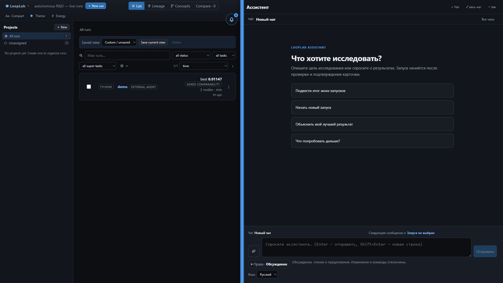

2. **Report + краткие итоги чата.** Верхний verdict правильно говорит
   `comparison not established`, `unconfirmed`, `flags found`; чат также объясняет
   разные условия. При этом ниже остаются `champion`, `Improvement waterfall`
   и строка `baseline` для первого пригодного узла. Ограничения прочитаны честно,
   но язык диаграмм и таблицы требует дополнительной интерпретации — **72.O5**.
   `Solution` отключён, раздел воспроизведения объясняет отсутствие `solution.py`:
   для repo-задачи это не даёт прямого пути к её реальным файлам — **72.O6**.

   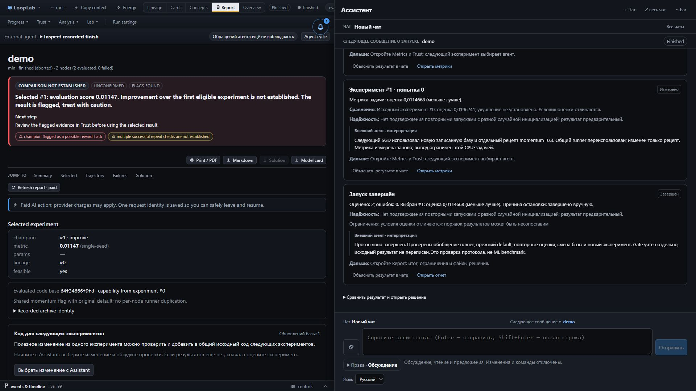

3. **Progress → Agent cycle.** Есть следующий шаг и ответственный, отдельно
   показано отсутствие наблюдаемых обращений агента. Но на русском рабочем месте
   большая часть цикла, журналов и названий действий остаётся английской;
   пользователь должен знать, что читать и кого подключать — **72.O4, 72.O9**.

   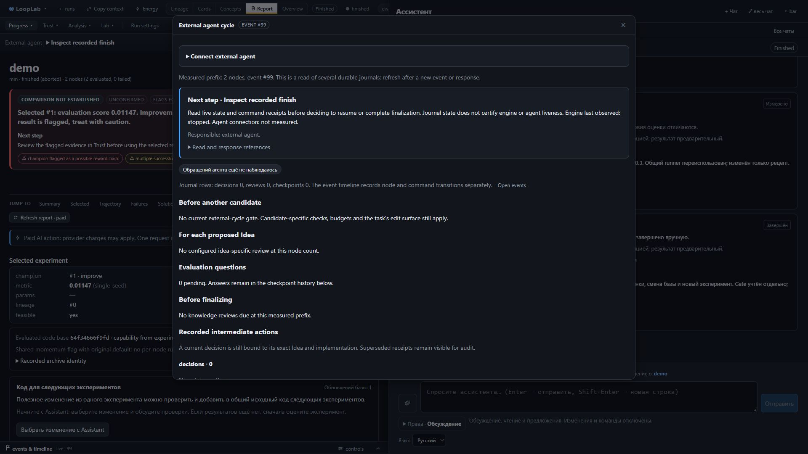

4. **Connect external agent.** Видны сервер, run root, конфигурация клиента,
   отдельная передача scoped credential и необходимость operator setup.
   Это хорошая диагностика, но всё ещё много ручных переходов между UI,
   терминалом и конфигурацией клиента. Сообщение «у сервера нет credential» в
   данном срезе ожидаемо: частный сервер ревью запущен без harness-токена.
   Оно не доказывает дефект рабочей конфигурации — **72.O3**.

   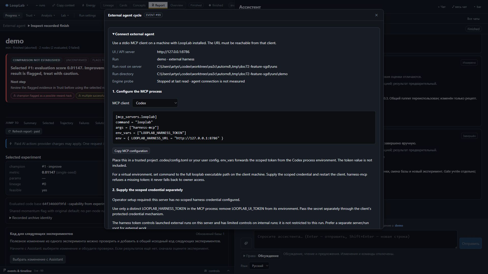

Визуальные риски доступности: мелкие вторичные ограничения, английские термины
среди русских инструкций и длинная прокручиваемая модальная инструкция усложняют
чтение. Это наблюдения по кадрам. Контраст численно, клавиатурный маршрут,
screen reader, масштабирование и весь UI при 2560×1440 здесь не проверены;
полная accessibility compliance не заявляется.

### 19.3 Git: три разных результата, которые нельзя смешивать

| Результат | Что доказывает | Чего ещё не доказывает |
|---|---|---|
| Gate passed + `base_advanced` | Проверенная run-owned база для следующих seeds | Изменения в рабочей копии владельца, PR, merge или push |
| Код интегрирован в ветку LoopLab | Изменения доступны в конкретном Git SHA | Проверенный и опубликованный master |
| Merge/push + проверка точного SHA | Доставка в указанную ветку с указанной приёмкой | Отсутствие потерь чужой незавершённой работы во всех worktrees |

Свежие Git-измерения этого ревью, **до его собственного коммита**:

- `git rev-list --left-right --count origin/master...HEAD` → `0 77`.
  Текущая ветка содержит весь опубликованный master и **77 дополнительных коммитов**.
  Утверждать, что вся текущая работа уже опубликована в master, нельзя.
- `master...origin/master` → `0 75`; `master...HEAD` → `0 152`.
  Локальный master в основной рабочей копии отстаёт от опубликованного на 75
  коммитов. Сравнение только с локальным master даёт неверный масштаб доставки.
- Зарегистрированы **99 worktrees**, существуют **98**, один отсутствующий помечен
  prunable. У **8** существующих каталогов есть tracked edits, у **6** — untracked
  entries; эти множества могут пересекаться. Статусы всех существующих прочитаны.
- Heads **37** worktrees являются предками `origin/master`, **38** — текущего HEAD.
  Остальные **62** не являются предками опубликованного master. Это не число
  потерянных фичей: cherry-pick/rebase могут перенести патч с другим SHA.
  Отдельной сверки patch equivalence и смысла изменений ещё нет — **72.O2**.

`tests/test_merge_history_integrity.py` полезен: ловит известный опасный случай,
когда merge повторяет дерево одного родителя и теряет изменения другого.
Он не доказывает сохранность каждого конфликтного hunk, всех cherry-picks или
незакоммиченных файлов. CI настроен на PR/master push, full-history Python,
UI test/build и packaging; strict docs имеет отдельный workflow. Результаты
GitHub CI и branch protection в этом проходе не проверялись.

Нужны обе проверки: **какие изменения дошли** и **работает ли доставленное дерево**.
Количество зелёных прошлых локальных тестов не заменяет эту пару.

### 19.4 OPEN backlog: следующие задачи и критерии закрытия

Все темы ниже **OPEN**. P0 — целостность и доставка текущей работы; P1 — основной
путь пользователя/агента; P2 — развитие после этого. Владелец означает сторону,
которая должна выполнить действие, а не уже назначенного человека. Каждый пункт
закрывается свежим свидетельством и ссылкой на точный код/проверку, а не отметкой
«есть кнопка» или историческим тестовым числом.

| ID | Приоритет | Открытая тема |
|---|---|---|
| 72.O1 | P0 | Проверенная доставка текущей ветки в опубликованный master |
| 72.O2 | P1 | Жизненный цикл run-owned Maintainer worktrees и сохранность предложений |
| 72.O3 | P1 | Первый работающий внешний клиент из Assistant |
| 72.O4 | P1 | Продолжение после остановки агента и потерянного ответа |
| 72.O5 | P1 | Одинаковый честный вывод о результате во всех видах |
| 72.O6 | P1 | Код, зависимости и воспроизведение repo-результата |
| 72.O7 | P1 | Перенос общей возможности через диалог с review и ценой |
| 72.O8 | P1 | Компактный цикл клиента и сохранение исходных запросов |
| 72.O9 | P1 | Короткий актуальный маршрут документации и русский UI |
| 72.O10 | P1 | Свежая сквозная приёмка; расширение сред — отдельно, P2 |
| 72.O11 | P1 | Понятный режим и ответственный за следующее действие |
| 72.O12 | P1 | Достоверная стоимость и границы действующих бюджетов |
| 72.O13 | P1 | Видимый рабочий контекст: сервер, клиент, код и Git |
| 72.O14 | P1 | Передача результата в owner repo относительно его настоящей базы |

#### Активная очередь: какой законченный результат делать следующим

Это действующий продуктовый план с актуализацией §19.16; очереди предыдущих
review-срезов — история. Каждая строка закрывается отдельно с evidence.
Наличие реализованного API не закрывает UX. O2 относится к worktrees LoopLab,
а O1 — к инженерному качеству выпуска самого LoopLab.

| Очередь | OPEN | Следующий законченный результат | Что блокирует закрытие |
|---|---|---|---|
| 1, P1 | O3/O9/O11/O13 | Один вход из Assistant: выбран режим, доступный серверу task repo, права, evaluator и первый CPU результат | Чистая установка и готовое окружение проверяются отдельно; клиент и сервер могут находиться на разных машинах |
| 2, P1 | O2/O4/O8/O11 | Продолжение того же run и предложения после смерти клиента, с сохранённым исходным запросом | Lost reply, незавершённый claim, два клиента и повреждённый source не запускают случайное повторное обучение; виден ответственный за recovery |
| 3, P1 | O2/O7/O12/O13 | Через чат переносится общая возможность: diff, default, checks, стоимость, новая база и затронутые эксперименты | Статусы предложения/worktree и конфликтов видны; два переноса накапливаются, устаревшее предложение требует новой проверки |
| 4, P1 | O5/O6/O9/O14 | Короткий итог → точный код выбранной попытки → reviewable изменение пользовательской ветки | Измеренная база и рецепт собраны вместе; нет подмены последней базой, удаления inherited файлов или overwrite dirty target |
| 5, P1 | O10 | Сквозная приёмка всего маршрута в UI Assistant и внешним агентом | Реальное обучение, два переноса, конфликт, повтор, потеря ответа и доставка в отдельный task repo; точные идентичности и проверки target |

Сквозные инженерные gates: O13 — strict config/source policy, O1 — CI и доставка
самого LoopLab. Они сохраняют свои критерии и не заменяют продуктовый путь.
Для уже измеренного run конкретные slices O5/O6 из §19.14 можно выполнить
независимо от первого входа: понятная база результата, файлы и честный diff.
По §19.15 у каждой строки есть пользовательский исход: первый объяснимый опыт,
сохранённое продолжение, проверенная общая возможность или доставленный код.
`finished`, gate pass, commit и merge не служат общим синонимом успеха.

Для каждой строки хранить: **реализация / контрактная проверка / пользовательская
приёмка / доставка**. «Частично проверено» сопровождается точным сценарием,
SHA и оставшимся случаем. Не держать сделанные slices неразличимыми внутри общего
OPEN и не закрывать весь O-пункт по одному slice. Этот проход обновляет анализ
и приёмку; выполненные slices перечислены в §20. Следующий ограниченный
recovery slice и связанная приёмка определены в §19.16; новые функции этим
review не реализованы.

#### 72.O1 — P0 / OPEN: доставка текущей ветки в опубликованный master

**Основание:** исторический недоставленный диапазон в §19.3; свежий срез — §19.9.
**Владелец:** интегратор репозитория. Доставка текущей ветки подтверждена на
`a2c9a08bd`: task HEAD, основной master и свежий remote master совпали. Старые
77 коммитов не являются текущим остатком. OPEN относится к полной интеграционной
приёмке: связать проверки итогового дерева с точным SHA и проверить CI этого SHA.
Для следующей правки сначала читать свежий диапазон, diff и зависимости;
публикация остаётся явным действием. Это служебный gate разработки LoopLab;
сохранность run-owned worktrees продукта рассматривает O2. Старые inventory
checkout разработки не являются его приёмкой после уточнения §19.13.
CI следующего опубликованного `5e9659451` прочитан в §19.10: docs/UI/package
успешны, общий Linux/Windows вердикт в зафиксированный момент ещё не завершён.
**Исторический отказ — §19.11:** Linux CI этого SHA завершился с failure.
Сначала разобрать и исправить названные интеграционные отказы, подтвердить
соответствующие guards и общий CI на исправленном дереве. Доставка не равна
прошедшей проверке; локальные выбранные наборы не заменяют этот отрицательный verdict.
На `7a69d94ec` шесть отказов из §19.11 воспроизведены локально (§19.4.1).
Первый repair batch имеет явную границу: folds, регистрации/владельцы контрактов,
optional task hook и degraded run row; dependency/platform/smoke/module-cap
кластеры сохраняются отдельными незакрытыми случаями общего O1.
Первый блок выполнен в §20.18: зарегистрированы реальные контракты и исправлен
runtime fold seam, актуализирован guard намеренно извлечённого протокола;
ограничения и ceilings не ослаблены. Это закрывает slice, не весь O1.
Остальные исходные кластеры разобраны в §20.19: все 18 прежних failing IDs
проходят выбранными локальными наборами, включая clean dev installation и
вложенную control-проверку alarm-tests. Полный CI итогового SHA остаётся отдельным gate.

**Актуальный остаток — §19.12:** `cb72620f2` прошёл Linux/Windows/docs;
`efde354cd` доставлен, Linux/docs прошли, Windows отказал bounded control search.
Восстановить воспроизводимость проверки pause при задержанном worker, сохранив
invariant, реальный submit/get/fold и отдельное покрытие deadline. Не закрывать
O1 по повторному локальному pass или зелёному CI предыдущего дерева.

**Приёмка:** указаны исходные SHA, итоговый SHA и способ интеграции; проверены
Python/UI/build/package/docs на итоговом дереве и новые upstream/recovery cases;
merge guard проходит. После разрешённой публикации свежий remote подтверждает
доставку, сохранены ссылки на CI точного SHA или явно назван отсутствующий CI.
До этого статус «реализовано в ветке» не превращается в «доставлено».

#### 72.O2 — P1 / OPEN: жизненный цикл worktrees LoopLab и сохранность предложений

**Уточнённая область по запросу пользователя — §19.13.** Историческая трактовка
через checkout разработки в §19.3–19.12 заменена продуктовой; их измерения
сохранены, но не являются основанием этого OPEN. Отказ doc 37 от Git worktree
каждого узла сохраняется. Здесь речь о run-owned Maintainer repo и worktrees
предложений (`looplab/engine/upstream_workspace.py::maintainer_worktree`).

**Владелец:** LoopLab upstream/recovery UX и хранение артефактов; прерванный claim
восстанавливает оператор. Уже есть private Git, архивы, durable claims, проверка
байтов checkout и явный abandon без pass/resume. Первый increment — компактная
карточка предложения в Assistant с состоянием, изменениями, проверками и следующим
действием. Полная история и технические пути раскрываются отдельно.

**Выполнено после исходного review:** §20.35 различает Git process failure и
content conflict; §20.36 называет повреждённый proposal manifest; §20.37 сохраняет
normalized proposal request до claim/Git. Это подтверждённые runtime increments.
§20.38 добавляет ограниченное identity-bound чтение original request через
HTTP/MCP/Assistant без прямого доступа к серверному файлу. Следующий slice —
карточка того же proposal и явное recovery. Политика хранения worktree,
manifest, request и измеренных архивов остаётся отдельным остатком O2.

**Приёмка:** read-only view связывает run/generation, proposal/action ID, source
node/attempt, исходную и полученную базу, commit, worktree и gate evidence.
Отличаются начатое авторство, сохранённое предложение, текущая проверка, pass/fail,
применённая база, abandoned claim и superseded proposal. Неизвестный источник
не становится пустым успешным состоянием. Retained WIP после сбоя не объявляется
проверенным кодом; pass проверки не означает advance или merge в task repo.

Новая сессия находит незавершённую работу без ручного поиска по каталогам;
сохранённые exact body/action ID обеспечивают безопасное чтение/повтор ACK.
Owner recovery не удаляет worktree и не возобновляет обучение. Отдельно определить
retention и восстановление: какие bytes нужны для измерений, новых proposals и
повторов, что экспортируется, что можно удалить после явного решения. Проверить
восстановление до очистки; reviewer bundle не является backup незаписанного WIP.
Проверки охватывают сбой инициализации, сохранённый failed gate, stale base,
повреждённый archive/ref, Windows Git limits и proposal после recovery.
Нужны UI-приёмка и политика хранения, поэтому проходящие runtime guards не
закрывают O2. P1 отражает продуктовую доработку; потери данных этим ревью не найдены.
По §19.14 карточка связывает каждый worktree с конкретным предложением и
проверками; «есть Git commit» не заменяет «обучение измерено» или «доставлено».
Открывается через Assistant, а не требует знакомства с внутренней структурой run.

#### 72.O3 — P1 / OPEN: от первого входа до работающего внешнего клиента

**Основание:** шаг 4, README/quickstart/external-harness guide.
**Владелец:** LoopLab onboarding; оператор обеспечивает сервер и credential,
внешний агент — клиент. Первый шаг — один пошаговый экран из Assistant:
где сервер/клиент, установлен ли executable, доступен ли URL, какой run и какие права.
Секрет передаётся отдельно, scoped token не заменяется owner token.

**Приёмка:** новый пользователь проходит путь для Codex и Claude Code без поиска
по нескольким документам; конкретная ошибка приводит к конкретному шагу исправления.
Настроенный stdio отделён от успешного `connection_check` и разрешения действовать.
Первое небольшое CPU-измерение показывается в чате, без повторного Start при
неизвестном ответе. Собственная стоимость модели внешнего клиента объяснена отдельно.
Необходимые клиентские approvals и доверие проекту не выдаются автоматически.
Приёмка различает первый вход в чистом checkout/venv и повторный вход в уже
настроенное окружение. Для `[ui]`, `[harness]` и совместной установки видны
необходимые extras, executable и Node/build предпосылки; MCP в текущем dev venv
не доказывает чистую remote установку. Измеренные шаги/ошибки и время первого
результата записываются; числовой onboarding target не выдаётся за уже измеренный.

#### 72.O4 — P1 / OPEN: понятное продолжение после остановки внешнего агента

**Основание:** шаг 3; `looplab/serve/agent_activity.py`, progress и checkpoint contract.
**Владелец:** LoopLab recovery UX и внешний клиент; operator recovery — оператор.
Первый шаг — краткая карточка в Assistant: что уже измерено, что сейчас выполняется,
кто должен ответить, какая квитанция неизвестна и что прочитать для продолжения.
Вход «продолжить этот run» доступен из чата отдельно от первичной установки MCP;
технический lookup сохранённой квитанции остаётся диагностикой, не всей recovery UX.
§20.37 уже сохраняет proposal body до побочных действий; не требовать повторной
реализации этой записи. Остаток §19.16 — получить его новым клиентом, различить
unresolved/settled/abandoned и показать разрешённый следующий шаг. Отсутствующая
старая запись не восстанавливается по request hash; она получает отдельную причину.

**Приёмка:** отдельно воспроизведены остановка клиента при работающей тренировке,
потерянный write reply, pending stage/live/deadline question и перезапуск UI.
Показаны текущие generation/receipt/question и возможное продолжение затрат:
у включённого `deadline_grace` без ответа команда может работать без автоматического
таймаута. `quiet` после 120 секунд и отсутствие наблюдения после рестарта не называются
«агент умер». Продолжение не повторяет training и не подменяет неизвестный outcome;
автоматический takeover, resume или abort из возраста наблюдения не добавляются.
Для повреждённого источника показаны конкретный файл, допустимое диагностическое
чтение и отдельный шаг оператора; ожидание восстановления не выглядит как
«агент сейчас тренирует». Успешное восстановление источника требует свежего
чтения и явного разрешённого решения, не снимает остальные обязательства.
При передаче работы новому клиенту «recent request» не считается подтверждением
того, что прежний writer остановлен: наблюдение не содержит client/session identity.
Два актуальных клиента — отдельный сценарий O8/O10, без автоматического takeover.

#### 72.O5 — P1 / OPEN: единый человеческий вывод о результате

**Основание:** шаги 1–2. **Владелец:** LoopLab results UI и краткие итоги Assistant.
Первый шаг — общий словарь и одинаковый порядок в списке, отчёте и чате:
что измерено → с чем можно сравнить → установлен ли выигрыш → надёжность → дальше.
Числовой selected/best не должен звучать как подтверждённый победитель.

**Приёмка:** first eligible явно отличается от baseline задачи; при mixed conditions
диаграмма, `Δ` и подписи не утверждают улучшение. Evaluation score и confirmation mean
различаются; оговорки видны рядом с числом. Проверены min/max, один узел, failed parent,
смена базы/цели, reward-hack flag, повторы и отсутствие сопоставимой оценки.
Бесплатный итог отвечает «что можно заключить и что делать дальше» на выбранном языке;
интерпретация агента и повторный платный вопрос остаются отдельными.
Recorded commentary сохраняет исходный текст: переключение языка UI не означает
её перевода или повторной публикации. При смене клиента уже существующая
интерпретация читается до write; exact retry не заменяется новым action ID.
Для длинного запуска пользователь может бесплатно прочитать старые текущие
итоги и интерпретации по страницам, сохраняя контекст чата. Проверены >200 итогов,
новое завершение во время чтения, изменившийся cursor и смена generation.
Current-evidence receipts не называются неизменяемой историей всех попыток;
Events не выдаются за хранилище отдельной commentary sidecar — см. §19.7.

**Выполненные increments:** пагинация текущих итогов и интерпретаций в чате — §20.2;
общие подписи типа измерения/повторов и eligibility отчёта — §20.3;
сопоставимые primary-score rollups и покрытие сравнений — §20.4;
нейтральные подписи графиков и общий вывод Overview/Report — §20.5;
сравнение и свежесть evidence в Inspector — §20.6;
границы сравнения в чатовых completion briefs — §20.7;
актуальность Trust-сигналов после reset — §20.8;
advisory Trust в чатовых итогах узла и сравнениях — §20.9;
предупреждение выбранной попытки в итогах всего run — §20.10;
основная оценка и разброс повторов в чатовых итогах — §20.11;
причины отказа сравнения и ссылки на исходные попытки — §20.12;
свежесть Metrics и проверка попытки в detail response — §20.13;
generation fence для графиков метрик — §20.14;
безопасное чтение серий и неизвестных repeat counts — §20.15;
длинные training curves и полный экспорт точных данных — §20.16;
масштаб маленьких метрик, одиночные точки и golden replay — §20.17.
Полная приёмка единого вывода во всех видах остаётся OPEN.
Остаток приёмки — пользователь различает: что изменили в коде, что измерили,
с чем результат допустимо сравнить, что ещё не подтверждено и какой следующий
шаг доступен. По умолчанию показывается короткий вывод; существенные Trust/source
flags остаются у числа, подробности и исходные receipts раскрываются отдельно.
Отсутствие node artifacts, commentary или подтверждения имеет названную причину;
оно не превращается в пустой успешный итог или автоматический платный вопрос.
Свежая §19.14 приёмка уточняет связь числового результата с кодом: рядом с
selected показываются его измеренная база и отличие от текущей общей базы.
Успешный перенос не считается новым измерением selected узла. Ещё не засеянный
pending узел отличается от отсутствующего/повреждённого provenance результата;
оба не получают выдуманный digest. Лейбл baseline не присваивается произвольному
первому кандидату как свидетельство baseline задачи.
По §19.15 итог сохраняет причину завершения и допустимый уровень вывода:
«измерено», «улучшение относительно указанного опыта подтверждено/не подтверждено»,
«допустимого результата нет». `finished` не означает достижение цели. Проверить
завершение по бюджету без улучшения, run без eligible узлов, неизвестное сравнение,
непройденное обобщение при сохранённом измерении и отказ доставки при сохранённом
итоге run. Краткий ответ на «получилось?» доступен без платного запроса и не
повышает силу доказательств; подробные повторы, Trust и provenance раскрываются рядом.
Свежий шаг 6 §19.16 показывает остаточную неоднозначность: граф помечает root как
baseline, тогда как чат прямо предупреждает, что first eligible не равен baseline
задачи. Уточнить человеческое название root без изменения eligibility/измерений.
Повторяющиеся ограничения в brief, Run result и Report свести к одному краткому
вердикту с раскрываемыми основаниями; существенные flags не прятать.

#### 72.O6 — P1 / OPEN: результат repo-задачи, который можно взять и воспроизвести

**Основание:** шаг 2, отключённый `Solution`; ограничение export в §18.4.
**Владелец:** LoopLab artifact/report UX; внешний агент объясняет рецепт.
Первый шаг — вместо ожидания `solution.py` показать реальные файлы/overlay,
использованную базу и команду воспроизведения выбранного terminal attempt.

**Приёмка:** пользователь открывает точный код, scorer boundary, конфигурацию и
команду; отдельно перечислены внешние данные, окружение и прочие необходимые
зависимости. Понятно, какая метрика primary, что подтвердили повторные проверки
и что проверил upstream gate. Отдельно видны состояние базы прогона и состояние
доставки в owner repo: готовый patch/commit/PR, merged или ещё не доставлено.
Export с зависимостями не называется автономным или переносимым без проверки.
По §19.13 ближайший increment — manifest выбранной попытки и материализация
её измеренной базы + overlay + удалений. Он перечисляет inherited возможности,
entrypoint, scorer, inputs/environment и unavailable зависимости. Проверка хешей
reviewer bundle не подменяет запуск этой программы после переноса.
**Конкретный UI slice — §19.14:** Code показывает файлы repo-задачи как её
основные правки, а не только «нет solution.py / Helper files». Diff явно называет
сравниваемую поверхность: основной код, files/deleted overlay или материализованные
программы с двумя базами. Проверяются recipe-only, helper change, addition/deletion,
different-base и отсутствующая исходная попытка. Пустое поле code не означает
отсутствия изменений в программе; missing source не заменяется текущим workdir.

**Выполненный increment — §20.24:** файлы и удаления видны в Code; сравнение
saved overlays включает recipe-only правки и не подменяет reset родителя.
**Выполненный increment — §20.25:** отдельно доступны файлы проверенного архива
базы до overlay и runtime inputs; можно прочитать inherited runner/scorer.
**Уточнение версий — §20.26:** архивный файл явно отличён от правки опыта и
от удаления; выбранный preview доступен перед ограниченным списком файлов.
**Уточнение Git export — §20.27:** сами коммиты называют saved-edit scope,
event-bound ссылку на базу или unavailable и отсутствие доставки в task repo.
**Границы файлов — §20.28:** экспорт исключает ancestor/descendant collisions
с task assets/adapter/entrypoint, сохраняя допустимые соседние пути.
**Удаления — §20.29:** portable delete alias исключает неоднозначную правку
и не оставляет в экспорте файл, удалённый на case-folding target.
Полная материализация inherited программы, её сравнение между базами и доставка
в target repo остаются OPEN.
По §19.16 следующий законченный результат — manifest исполненной попытки,
собирающий уже доступные edits и base вместе с entrypoint/stages/runtime inputs.
При недоступной базе показывать безопасную причину и owner remediation отдельно
от повторного read; ошибку источника не чинить автоматически новым training.

#### 72.O7 — P1 / OPEN: перенос общего улучшения через диалог без ручной сборки контракта

**Основание:** §18 и шаг 2, `UpstreamPanel`/Maintainer/external-harness guide.
**Владелец:** LoopLab Assistant flow; оператор задаёт политику при запуске,
автор готовит обобщение. Первый шаг — из выбранного измеренного узла объяснить
«рецепт этого опыта» и «общая возможность», недостающие входы и цену проверки.

**Приёмка:** через чат готовится reviewable proposal с точными source hunks,
recipe, прежним default, документацией и critic reason; видны поддерживаемая среда,
обязательные проверки, число повторов и известные/неизвестные затраты.
Нет обещания GPU-цены по короткому CPU smoke. Если immutable upstream/scorer policy
не задана на запуске, предлагается новый корректный run, а не обход resume policy.
Pause, остановка движка, check, свежий verdict, CAS advance и отдельный resume
остаются явными. Пройденный gate не называется научным улучшением метрики.
По §19.13 добавить приёмку двух последовательных общих улучшений: новый proposal
от текущей базы, прежние возможности сохранены, рецепты остаются независимыми.
При stale proposal объяснить необходимость нового review/check, при конфликте
узла — какую базу он сохранил и какие новые возможности не унаследовал.
Связь предложения/worktree/claim видна через O2, а не через каталоги Codex.
По §19.14 nominations остаются советом: файловая эвристика capability/recipe
не доказывает переносимость. Чат объясняет отсутствие допустимого источника,
старую базу и уже перенесённые hunks до покупки проверки. Видна область gate:
какие default/recipe/flag combinations проверены, какие остаются непроверенными.
Принятие A и B по отдельности не обещает все их сочетания; обязательные probes
задаются оператором, необъявленное покрытие не дописывается задним числом.

#### 72.O8 — P1 / OPEN: компактный маршрут внешнего агента и сохранение запросов

**Основание:** большой contract/guide, необходимость exact bodies и paged reads.
**Владелец:** LoopLab client API/примеры, внешний агент.
Первый шаг — небольшой пример цикла с компактным progress и запросом только нужной
phase; полный settings schema и журналы читаются по необходимости.

**Приёмка:** пример сохраняет исходные body/action IDs и evidence revision,
переподключается без повторных executions, обходит текущие страницы notices и
номинаций, обновляет изменившееся evidence. Missing/incomplete HTTP 200 остаётся
unavailable; повреждённый источник ведёт к диагностике и operator recovery.
Секреты не попадают в сохраняемый журнал запросов. Компактность измерена по
числу reads/размеру ответа и не достигается пропуском обязательств или silent retries.
Существующие `source_node_id`, candidate/history limits и `brief` используются
до создания нового orchestration layer. Узкий ответ сохраняет необходимые
инструкции и pagination metadata; выборка не объявляется полным обзором источников.
Приёмка учитывает ответ, реально передаваемый модели после общего result cap,
а не только полный `ToolResult.structured`. Даже на малом run стандартный read
должен оставлять видимыми правила Maintainer, source scope и путь следующей страницы.
Private recovery record переживает завершение процесса клиента и его новый
контекст: сохранение проверено до write, затем восстановлены точные body/key/action ID
и исходная evidence revision. Server receipt не считается резервной копией payload:
текущий read намеренно его не возвращает (§19.8). При потере и локальной записи
неизвестный запрос не пересоздаётся из памяти под новым ключом.
Минимальный пример такого клиента и состав его private record — ближайший
increment §19.10. Приёмка охватывает завершение процесса до получения ответа,
а также отказ восстановить запрос, принадлежащий другой run identity/generation.
Добавить передачу writer между двумя сессиями: исходный key/body не меняется от
смены процесса или модели. Разные ключи для одного неизвестного намерения — разные
command identities; generation fence не заменяет согласование этих намерений.
Осознанная параллельная группа кандидатов сохраняется как отдельный выбор агента.
**Актуализация §19.16:** original upstream proposal уже сохраняется сервером в
§20.37; receipt/history содержит проверяемый pointer, а не raw body. Новый клиент
без доступа к серверной FS ещё не может восстановить его этим pointer. Следующий
slice — ограниченное явное чтение с generation/proposal/request identity и строгим
typed response. Оно сохраняет исходный action ID и не разрешает повторять training,
пересоздавать неизвестное намерение или автоматически abandon claim. Остальные
command/check/advance bodies, выдача полного payload после model result cap и
передача writer остаются самостоятельными случаями приёмки O8.

#### 72.O9 — P1 / OPEN: короткая актуальная документация и последовательный русский UI

**Основание:** шаги 2–4; длинные исторические §1–18, doc 71 и руководства.
**Владелец:** LoopLab docs/i18n. Первый шаг — короткая карта «Assistant / внешний
агент / готовый результат / общий код / Git-доставка» со ссылками на один актуальный
источник каждого правила. Историческое расследование остаётся доступным отдельно.

**Приёмка:** из quickstart достижимы подключение, восстановление, объяснение итогов
и перенос кода; термины generation/gate/base/receipt объяснены при первом появлении.
Основной RU путь включает Agent cycle, Report и handoff; протокольные имена и JSON
не переводятся. Клавиатура, масштабирование и desktop FHD/2K проверены на этом
маршруте. Инструкции не расходятся по ролям, правам и способам продолжения.
Проверен весь выбранный RU маршрут: brief → Report/Trust → Agent cycle → handoff.
Язык ответа явно передаётся внешнему клиенту через проверяемый handoff/instruction,
а не угадывается по локальному storage другого браузера. Auto и смена языка не
меняют evidence и не запускают скрытый платный перевод старой commentary.

По §19.15 README и краткий маршрут согласуют обещание с режимом: Assistant
нужен доступный model endpoint; no-model toy CLI — отдельная демонстрация.
«Verified» сопровождается областью проверки, не обещает любое улучшение или
автономную воспроизводимость export. Термин merge при первом употреблении
различает новый эксперимент из родителей, обновление run-owned базы и Git merge
в task repo. Первый экран маршрута не требует изучения этих трёх механизмов.
Проверить понимание исхода и следующего действия человеком; наличие всех ссылок
или совпадение слов в документации эту приёмку не закрывает.

#### 72.O10 — P1 / OPEN: приёмка пользовательского пути; расширение сред — P2

**Основание:** §18.4 и границы §19.1. **Владелец:** LoopLab acceptance/оператор среды.
Первый шаг — короткая реальная CPU repo-задача: запуск → measured result → repair →
обобщение → gate → новая база → следующий узел → finish → понятный итог и воспроизведение.
Добавить контролируемую потерю клиента/ответа и проверку доставки кода.

**Приёмка:** один актуальный acceptance manifest связывает SHA, версии клиента/
сервера, команды, квитанции, времена, screenshots и измеренные артефакты;
человек впервые проходит маршрут без подсказок автора. Чистый checkout проверяет
необходимые зависимости. Docker, host scorer/setup, combined trainer/scorer и
GPU воспроизводимость остаются отдельными явно спроектированными расширениями:
сейчас их refusal сохраняется, исторический CPU smoke их не закрывает.
Дополнительные сценарии §19.11: два подключённых клиента, handoff незавершённого
write, уже опубликованная commentary и RU preference на отдельной машине.

#### 72.O11 — P1 / OPEN: режим работы и ответственный понятны из чата

**Основание:** quickstart описывает Assistant/internal loop; external-harness guide
различает external harness и delegated Developer. Launch card выделяет `backend`,
но техническое слово `toy` не объясняет пользователю, кто принимает решения.
**Владелец:** LoopLab launch/Assistant UX. Первый шаг — перед Start и в текущем
чате назвать режим человеческим языком: встроенный цикл / внешний агент /
встроенный цикл с внешним редактором, и объяснить, кто предложит следующий узел.

**Приёмка:** для каждого из трёх режимов проверен запуск, terminal узла и простой
поиск без кандидатов. UI объясняет ожидаемое отсутствие новой работы у внешнего
режима; живой сервер не обещает автоматическое продолжение. Assistant остаётся
точкой входа для обычного опыта без обязательного upstream/worktree onboarding.
Предложение включить reuse объясняет пользу и необходимые новые проверки; оно
не меняет policy уже запущенного run. Просьба «слить» уточняется по объекту:
кандидат, общая база или выбранная пользовательская ветка; reviewable план
называет ожидаемый эффект и затраты до исполняющего действия. Assistant остаётся
точкой обсуждения и разрешённых действий; его смена permissions не переключает
владельца поиска и не включает второго невидимого исследователя. Owner-only шаг
показан как шаг оператора. Handoff связывает режим с конкретным run/generation,
а изменение режима действующего run не маскируется настройкой developer backend.
Ответственный за диагностику отделён от обладателя права на следующий write:
«агент проверяет источник» и «оператор восстанавливает claim» могут относиться
к одному состоянию. Проверены current phase `write_access`, scoped отказ,
успех разрешённого чтения, последующее обновление и причины ожидания из §19.10;
подсказка не повышает права. UI использует текущий progress/phase контракт,
не копирует набор правил продолжения в независимую state machine.
Degraded/unreadable run row сохраняет форму общего списка и явно unknown для
недоступного режима. Пропущенный `external_harness` не трактуется как internal
search; конкретный локально воспроизведённый shape drift — §19.4.1.

#### 72.O12 — P1 / OPEN: стоимость и лимиты отображаются по фактическим настройкам

**Первый increment реализован — §20.1:** editable USD budget, authoritative
review двух лимитов, RU/EN и отдельные границы расходов. OPEN сохраняется для
связанной приёмки пользовательского запуска и доставки на проверенном SHA.

**Основание:** §19.6, cost disclosure в `LaunchCard.jsx`, quickstart, бюджетный
контракт `core/llm_budget.py` и отдельный upstream ledger.
**Владелец:** LoopLab launch/cost UX. Первый шаг — исправить отображение effective
денежного лимита и рядом назвать покрываемые расходы: run LLM, Assistant chat,
модель внешнего клиента и вычисления evaluator/gate.

**Приёмка:** проверены 0/неизвестный/положительный лимит, оба USD-поля и их более
строгий effective cap, неопределённые цены, toy + external harness, chat и gate.
«Лимит не задан» не показывается при установленном effective cap; toy описывает
отсутствие вызовов встроенного backend, а не бесплатность всей работы внешнего агента.
Оценка расходов не называется счётом провайдера или жёстким пределом GPU-затрат.
После validate видны текущие лимиты и их границы; изменение плана инвалидирует
предыдущую проверку. Тест проверяет поведение на настройках, не закрепляет одну
предупреждающую строку для всех запусков. Новый глобальный контроль чужого клиента
или compute billing не обещается без отдельного механизма.
По §19.14 видны расходы текущего proposal и суммарные записанные gate executions
прогона, включая failed/abandoned проверки. Последние 7 executions не называются
общими 14; счётчик операций не превращается в USD. До check показаны declared
repeats/probes и действующий evaluation ceiling; частичный отказ сохраняет уже
выполненную работу и затраты, но не даёт pass или automatic retry.

#### 72.O13 — P1 / OPEN: рабочий контекст не приходится угадывать по терминалам

**Основание:** отставание основного checkout в §19.3; `harness/handoff.py` уже
показывает server run/source paths, но не полный runtime/build/Git-контекст.
**Владелец:** LoopLab diagnostics/handoff и интегратор репозитория.
Первый шаг — компактное чтение «с чем мы работаем»: версия/источник сервера,
идентичность UI build, выбранный run root/run/generation, код задачи и recorded base;
клиент отдельно сообщает используемый executable и свою версию.

**Приёмка:** различимы checkout самого LoopLab, editable repo задачи, node workspace
и run-owned Maintainer worktree. Коммит репозитория отделён от незакоммиченных байтов
и реально запущенного процесса; смена ветки не объявляет старый сервер обновлённым.
Воспроизведены другой PATH/venv, несколько run roots, отставший checkout, старый
UI build и удалённый клиент. Недоступные поля явно unknown; пути на сервере не
выдаются за доступные клиенту. Секреты и полный environment не публикуются.
Диагностика ничего не перезапускает; перед изменением runtime есть явный план
остановки/продолжения с проверкой уже выполняющихся работ.
При unavailable источнике diagnostics отделяют сохранённые сведения от неизвестных
полей; прежний контекст или значение по умолчанию не утверждают текущую роль,
работающий движок, build или доступность кода.
Для Windows отдельно проверить длину run-owned cwd/worktree: исправление ref locks
в §20.18 не снимает внутренних пределов Git. Неподдерживаемый путь должен иметь
понятную диагностику и явный recovery, без автоматического повторения работы.
Частичный результат §20.20: известные Git/OS path-length отказы получают
`upstream_git_path_unavailable`, который сохраняется в history/failed receipt.
Native Windows cwd/worktree и exact HTTP/MCP recovery проверены; это диагностика
реального предела, не поддержка произвольной глубины и не закрытие runtime/build identity.
§20.21 добавил диагностику process start/timeout; §20.22 — strict config для
bootstrap. Свежая §19.12 проба показывает остаток: bootstrap отказывает неизвестному
setting, `selection.status` ещё читает его lenient. Проверить единый strict policy
для всех semantic reads/writes и exact recovery, отдельно от обычного config diagnostic.
В том же проходе unstamped локальный UI был заменён только в private preview
свежей сборкой: видимая версия runtime/build остаётся самостоятельным deliverable.

#### 72.O14 — P1 / OPEN: передача результата в owner repo относительно реальной базы

**Основание:** свежий экспорт в §19.7. **Владелец:** LoopLab delivery UX и внешний
агент/интегратор task repo. Это доставка ML-кода пользователю; 72.O1 относится
к публикации ветки самого LoopLab. Первый шаг — подготовить reviewable change set
для явно выбранного target checkout, связанный с measured node attempt, исходной
seed/base identity и нужными зависимостями общего улучшения.

**Приёмка:** различаются рецепт выбранного узла, одобренное общее изменение и
полная материализованная программа. Exported node edit tree не применяется как
обычный полный Git diff между исходными программами. Подготовленный patch имеет
явные добавления/изменения/удаления и исходные byte identities; unchanged inherited
runner/scorer не удаляется из-за отсутствия в overlay. Проверены advanced base,
recipe-only узел, удаление файла, dirty target, другой target HEAD и конфликт.
Stale target ведёт к повторному review и проверкам, а не force overwrite.
Есть понятный итог: подготовлено / применено в локальной ветке / проверено /
опубликовано / merged, с точным SHA и выбранным remote/ref, когда они доступны.
Создание PR, публикация и merge выполняются в рамках полномочий интегратора;
engine продолжает работать только с run-owned базой и не пишет owner checkout.
Gate в другом контексте не сертифицирует этот target и не заменяет его проверки.
В evidence доставки явно указана identity репозитория вместе с remote/ref и SHA;
совпадение названия `master` в LoopLab и task repo не считается общей доставкой.
По §19.13 «всё сливается» проверяется как накопление принятых общих возможностей
с зависимостями и отдельно выбранным научным рецептом. Взаимоисключающие рецепты
не сливаются автоматически. Доставка точного старого измеренного результата и
сборка нового результата на последней общей базе — разные действия; второе
требует новой оценки и не наследует метрику старого узла. Закрытие O14 требует
реального target diff и проверок выбранной пользовательской ветки.
По §19.14 приёмка включает два независимых run одного task repo: изменение A
доставлено первым, предложение B сохраняет A или явно показывает конфликт,
проходит проверки обновлённого target и связывается с новым SHA. Следующий run
явно получает архив выбранной интегрированной базы. Run-local base_advanced,
общая lesson или Git branch сами по себе не распространяют код между run.
По §19.15 статус доставки относится к выбранному change set и target identity:
подготовленный diff, локальный commit, проверенный target SHA и подтверждённый
remote merge различаются. Отказ publish/merge не перечёркивает измеренный результат
и не запускает повторное обучение. Новая capability может проверяться отдельно
от выбранного рецепта; перенос всех исследованных рецептов не является целью.
Приёмка «всё сливается» перечисляет принятые совместимые возможности, необходимые
зависимости и выбранный рецепт; исключённые/конфликтующие изменения имеют причину.
Проверки target и оценка ML на нём различаются: build/test pass не наследует старую
метрику, а публикация commit сама по себе не доказывает ни проверку, ни merge.

### 19.4.1 Контроль активного плана: локальная проверка отрицательных свидетельств

**Срез 2026-10-03 на `7a69d94ec1c11ffe0df94b490c61fa9a3de6fb85`.**
Это дополнение действующей очереди, не ещё один общий обзор. Проверки выполнены
на Windows/private pytest basetemp, без изменения production-кода и пользовательских
запусков. Replay first — **206 passed** (`test_events_replay`, `test_golden_replay`,
`test_replay_families`). Затем выбраны шесть конкретных отказов прошлого Linux CI;
**все шесть воспроизвелись локально**. Полные прежние 18 CI IDs не объявляются
воспроизведёнными этим набором. [Структурированный результат](assets/72-review-plan/local-contracts.json)
содержит точные selectors, SHA, окружение и исходы; это не ML-результаты и не WIP backup.

| Проверка | Локальный результат | Что исправлять / сохранять в приёмке |
|---|---|---|
| `test_engine_fold_seam` — engine не связывает replay fold напрямую | Failed: четыре upstream-модуля обходят общий seam | Установить корректного владельца fold, сохранить общий engine patch seam; проверить upstream через него |
| `test_memory_stores` — каждый JSONL literal зарегистрирован | Failed: `result_commentary.jsonl` не назван в registry | Записать реальную область run sidecar; не превращать commentary в shared lesson store |
| `test_package_layout` — каждый модуль отражён в layout | Failed: отсутствует `node_comparison` | Согласовать назначение и фактический package layout, подтвердить совместные imports/contracts |
| `test_serve_module_seams` — контрольные таблицы имеют одного владельца | Failed: текущее расположение не отвечает guard | Разобрать намеренное разделение и действительный единый источник; не дублировать таблицы ради теста |
| `test_task_adapter_contract` — task probes используют зарегистрированные hooks | Failed: `bind_run_directory` не зарегистрирован | Назвать контракт нового optional hook, проверить callable/отсутствующий hook и его роль при запуске |
| `test_refusal_vocabulary` — unreadable run остаётся в списке с согласованной формой | Failed: в stub отсутствует `external_harness` | Согласовать доступные/unknown поля и UI mode; не выдумывать score, mode или liveness при недоступном журнале |

Эти отказы не доказывают потерю научного результата или вызванную последними
изменениями runtime-ошибку каждого пути. Они доказывают, что текущий выбранный
integration guard набор не проходит даже в существующем окружении. Для исправления
нужно сверить задуманный контракт с кодом и тестом. Refusal-source/phase/engine
ограничения не снимаются ради одного зелёного assertion.

**Верхнеуровневые выводы по остаткам:**

- Внешний агент: базовые durable/fenced операции есть; завершённый маршрут новой
  сессии всё ещё требует private payload record и согласования исходного намерения.
- Удобство и вход: быстрый путь на подготовленном стенде не подтверждает чистую
  установку или самостоятельный первый запуск; эти два acceptance cases разделены в O3.
- Результаты: числовая корректность проверена существенно лучше, чем понятность
  решения человеком. O5 завершается проверкой вывода/следующего шага, не количеством графиков.
- Git: текущая доставка подтверждается refs; полная интеграция — ещё verdict
  тестов, сохранность WIP и disposition ranges. Срезы 99 worktrees/35 unmatched/26
  patch-equivalent из §19.9 здесь **не пересчитаны**, очистки или интеграции WIP не было.
- Работа над репой: сначала reviewable repair batch O1, затем scoped client/UX
  increments с общей O10 приёмкой. Остальные CI кластеры, owner-repo доставка и
  неподдерживаемые среды нельзя закрыть шестью исправленными assertions.

Границы прохода: новая UI/ML/двухклиентская приёмка не выполнялась. UI выводы
опираются на ранее сохранённые screenshots §19.9–19.11 и текущие contracts;
новых визуальных дефектов этот проход не утверждает. Производственный код и
зафиксированные отказы не исправлены документальной доработкой.

Проверка документа: documentation contracts, documented entry points и merge-history
integrity — **34 passed**; строгая сборка MkDocs и `git diff --check` прошли.
Эти результаты подтверждают документальную правку; шесть интеграционных отказов
остаются OPEN, общего зелёного verdict текущего дерева нет.

### 19.5 Историческая очерёдность и граница первого прохода

Очередь ниже относится к первому review и не задаёт следующий increment.
Текущие продуктовые приоритеты и область O2 находятся в §19.4 и §19.13–19.15.

1. **72.O1 + 72.O2:** собрать карту доставки и WIP, проверить интеграционное дерево.
2. **72.O5 + 72.O6 + 72.O12 + 72.O14:** дать понятный результат, воспроизведение,
   честные лимиты и reviewable передачу кода пользователю.
3. **72.O3 + 72.O4 + 72.O8 + 72.O11 + 72.O13:** сделать первый внешний запуск,
   его рабочий контекст и продолжение предсказуемыми.
4. **72.O7:** провести перенос общей возможности через Assistant с видимым review.
5. **72.O9 + 72.O10:** закрепить маршрут языком и свежей приёмкой;
   расширение неподдерживаемых сред планировать отдельно.

Этот проход обновляет анализ и OPEN backlog. Он не переключает настройки, не
расширяет права токена, не запускает платные модели и не публикует ветку в master.
Закрытые 72.1–72.7 сохраняют точный scope §18; новые темы закрываются отдельно.

Проверки этой документальной доработки: replay-first — **193 passed**;
documentation contracts + merge-history integrity — **30 passed**; строгая
сборка MkDocs и `git diff --check` прошли. Это проверка документации и защитных
контрактов, не полный product regression и не свидетельство публикации в master.

### 19.6 Повторное критическое ревью: недостающие различия и проверка патчей

Проход начинается от `b8721d736`. Свежий fetch по-прежнему показывает
`origin/master @ cdebb964c`, `origin/master...HEAD → 0 78`; один дополнительный
коммит относительно §19.3 — сам первый документальный аудит. Предыдущий срез
не переписан задним числом. Новое чтение кода и Git не является повторной UI-
приёмкой: кадры §19.2 относятся к явно обозначенному первому проходу.
На этом срезе remote master является предком текущей ветки: доставка её коммитов
допускает fast-forward и не требует искусственно создавать merge-конфликты.
Перед доставкой refs надо прочитать снова; сохранность остальных worktrees —
отдельная проверка. Forced push и автоматическое включение всех старых патчей
из этого вывода не следуют.

#### Git: ancestry уточнена содержимым, но полная сохранность ещё не доказана

Для **пяти именованных старых веток**, чьи heads не являются предками master,
выполнен `git cherry origin/master HEAD_ВЕТКИ`. Это сопоставление patch IDs
немерджевых коммитов. Результат сохраняется в
[снимке повторного Git-ревью](assets/72-review/git-followup.json).

| Ветка (без `refs/heads/`) | Patch-equivalent `-` | Без exact match `+` | Следующий вывод |
|---|---:|---:|---|
| `codex/audit-part-v-cross-run-20260721` | 2 | 0 | Патчи имеют эквиваленты в master; отсутствие ancestry не означает потерю |
| `codex/watchdog-nonfinite` | 1 | 0 | Патч имеет эквивалент; нужна проверка текущего поведения для окончательного disposition |
| `codex/ui-concept-corruption-docs-20260718` | 0 | 2 | Нужен смысловой review изменений и актуальных guarding tests |
| `codex/ui-concept-relations-a11y-20260718` | 0 | 1 | Нужен смысловой review; другое содержимое commit diff не доказывает утрату функции |
| `codex/part-iv-cross-runs-validation-20260715` | 0 | 1 | Нужна сверка исторического проекта документа с реализованным и текущим backlog |

У последней ветки unmatched commit — документация архитектуры, не исполняемый
новый поиск. В concept-corruption ветке среди unmatched есть реализация authored
concept deltas; название ветки не описывает весь её диапазон. В нынешнем дереве
присутствуют `ConceptView.jsx::classifyConceptCompleteness` и `aria-activedescendant`
с отдельными option IDs в `ConceptChipBar.jsx` — части старых исправлений уже
существуют в изменённой форме. Наличие этих символов не закрывает всю ветку:
нужны сравнение требований/эффектов и проверки, включая дальнейшие изменения.
Exact patch match тоже не доказывает, что позже никто не отменил поведение.
Остальные detached heads этой выборкой не классифицированы — **72.O2 остаётся OPEN**.

Снова прочитаны статусы восьми каталогов с tracked changes из первого inventory.
Семь имеют непустой diff: там есть UI, replay/concepts, strategy/model и dataset
изменения вместе с тестами; это не одни временные журналы. Некоторые heads уже
предки master, но их рабочие изменения ancestry вообще не учитывает.
Новый снимок сохраняет file names и staged/unstaged diff stats; сами исправления
не перенесены и не признаны нужными без review. Untracked helpers/tests тоже
нужно рассматривать вместе с соответствующим patch, а не отдельно терять при очистке.

В восьмом (`autornd-bundle-fix-20260720`, `ui/vite.config.js`) Git status показывает
`M`, но обычный diff пуст. Дополнительное чтение: index blob и hash с Git filters
оба `4e968ac9173e60268bd0ab2db2fa6332d8ee3047`, raw file hash
`8d71059be14406063ed3af0813af7dc0c49eb536`. Это различие сырых байтов при одинаковом
нормализованном Git содержимом, а не установленная потерянная UI-фича. Индекс и
файл не обновлялись. Поэтому inventory хранит статус, raw/filtered отличие и
смысловую классификацию отдельно; «8 dirty каталогов» не равно «8 потерянных фиксов».

#### Продукт: чего не хватало первым десяти OPEN-темам

- **Режим/ответственный (72.O11).** Объяснение двух видов coding-agent интеграции
  в guide уже есть. Но обзор launch card опирается на Backend/Model/Search:
  человеку нужно видеть, кто продолжит работу, а не выводить это из `toy`.
  Это вывод по коду и руководствам, не измеренное пользовательское исследование.
- **Бюджет (72.O12).** В `LaunchCard.jsx::costDisclosure` фраза
  `No monetary cap is configured` выбирается по backend/validated состоянию,
  без чтения `llm_budget_usd` и `llm_cost_limit`; RU-словарь сохраняет тот же смысл.
  Локальный бесплатный probe `_validate_settings_keys` принимает USD limits 2/3;
  `Settings` сохраняет их, `run_usd_ceiling(3, 2)` возвращает
  `(2.0, 'llm_budget_usd')`. Значит общий текст не отражает возможный effective cap.
  `ui/test/launchCardSemantics.test.js` закрепляет предупреждающую строку regex,
  не проверяя вариант с положительным лимитом. Это конкретный статический
  разрыв отображения; browser acceptance с таким планом ещё требуется.
- **Контекст (72.O13).** Инструкция с executable `looplab`, другой venv, отставший
  основной checkout и несколько roots — разные источники путаницы. Existing
  server paths и generation полезны, но не доказывают версию запущенного кода/UI
  или совпадение с только что протестированным Git деревом.
- **Client recovery (72.O8 → P1).** Хранить exact body/action ID только в памяти
  разговора недостаточно удобно для продолжения после потери клиента. Протокол
  умеет безопасно отказать, но без сохранённого исходного запроса агенту тяжелее
  восстановить намерение. Поэтому компактный пример с сохранением запросов
  относится к основному рабочему пути, а не только к поздней оптимизации токенов.

#### Что считать достаточной приёмкой следующего улучшения

| Сценарий | Что человек/агент должен суметь объяснить без чтения общего schema |
|---|---|
| Первый запуск через Assistant | Кто ведёт поиск, что измеряется, какие файлы разрешены, какие расходы ограничены |
| Первый внешний клиент | Какой сервер/run выбран, что подтвердил connection check, какие действия разрешены |
| Клиент исчез во время оценки | Что ещё работает/ждёт, какой ответ требуется, какие затраты могут продолжаться |
| Ответ на запись потерян | Как прочитать исходную квитанцию и сохранить/повторить exact request без второй работы |
| Узел завершён или упал | Что измерено или отсутствует, сопоставимо ли сравнение, какой следующий шаг обоснован |
| Общий код прошёл gate | Для каких будущих узлов сменена база и почему это ещё не merge в owner repo |
| Работу надо доставить | Какой patch/SHA принят, где он опубликован и какое WIP ещё не рассмотрено |

Следующий дизайн должен сокращать число мест, где надо искать ответ, и число
вручную собираемых полей. Исчезновение предупреждений или технических checks
не является снижением порога входа. Числа времени до первого результата,
количества ручных переходов и доли успешных reconnect пока не измерены: для
72.O3/O4/O10 надо зафиксировать исходную попытку нового пользователя и сравнить
с улучшенным маршрутом на одинаковой короткой CPU-задаче.

**Уточнённый вывод:** целостность текущего bounded protocol и удобство использования
имеют разные доказательства. «Все фичи есть» недостаточно: нужен понятный режим,
правильные бюджеты, восстанавливаемый клиентский запрос, получаемый repo-результат
и проверенная доставка. Увеличивать площадь функций до закрытия этих пробелов
не предлагается; OPEN-темы не являются разрешением обходить существующие gates.

Свежие проверки повторного документального прохода: replay-first — **193 passed**,
documentation contracts + merge-history integrity — **30 passed**, строгий MkDocs
и whitespace check прошли. Дополнительно выполнены read-only patch-ID выборка,
статусы/diff stats восьми каталогов и локальный USD-cap probe. Ни один из этих
результатов не является полным feature regression или runtime UI-проверкой бюджета.

### 19.7 Третий проход: полный рабочий путь и границы доставки

Срез начинается от `bd54ac852`; свежий fetch даёт прежний
`origin/master @ cdebb964c`, `origin/master...HEAD → 0 79`.
Рост на один — предыдущая документальная доработка, а не новая функциональная
приёмка или доставка. В этом проходе изучены export-git/export-bundle,
Assistant result feed, upstream tools, compact progress и их тестовые контракты.
Новых UI-скриншотов, тренировок и обращений к модели не было.

#### Проверка на настоящем записанном результате

На завершённом repo-прогоне `demo` из §18.23 выполнены **новые экспорты** в отдельные
каталоги. Это новые операции чтения старого измерения, не новые ML-измерения:

- `looplab export-git`: экспортированы два lifecycle-коммита; `node-0` содержит
  `recipe.env` и `train.py`, selected `node-1` — только `recipe.env`.
- `git diff --name-status node-0 node-1` показывает `M recipe.env`, **`D train.py`**.
  Но в реально материализованном `nodes/node_1` есть и `train.py`, и защищённый
  `score.py`: runner взят из новой recorded base, а узел написал только рецепт.
- `looplab export-bundle --out ...`: 17 описанных файлов, две seed archives,
  восемь exported receipts, ноль unavailable receipts; штатная проверка размеров
  и digest прошла. Hash `events.jsonl` до и после bundle совпал.
- Два read-only `UpstreamTools(mode="plan").execute("upstream_status", ...)`:
  default ответ — **9842** символа; `source_node_id=0`, history/candidate limits
  по одному — **2049**. На выходе provider оба содержат полный JSON и Maintainer
  instruction, не являются error и не исполняют gate; hash событий до и после reads совпал.
  Но shared `_cap_tool_result` с `RESULT_CAP=4000` сокращает default до **4000**:
  marker о truncation есть, ключ `maintainer_instruction` уже отсутствует.
  Узкий ответ остаётся **2049** без truncation и с инструкцией.
  Это уменьшение выбранного ответа, не lossless сжатие полного обзора и не
  измерение провайдерской цены/токенов.

[Машиночитаемый срез проверки](assets/72-review/delivery-probe.json) содержит
generation, SHA, деревья Git, реальные имена файлов узла, archive counts,
размеры ответов и hash событий. Полные экспортированные артефакты остаются
локальными проверочными материалами, не опубликованным owner repo.

**Проблема Assistant read (72.O8):** сохранённый полный structured result полезен
для trusted consumers/traces, но `agents/tool_loop.py` отправляет модели bounded
`content`. Поэтому успешный статус инструмента и полный JSON в trace не означают,
что Assistant получил все инструкции. Это воспроизведено вызовом настоящих
provider и cap-функции, без платного model turn. Следующий increment — помещать
критичные инструкции/область выборки/continuation в компактный model-facing read
и использовать доступные узкие запросы. Порог общего контекстного cap сохраняется.
У typed MCP отдельный response limit 256 KiB и ограничения клиентского контекста;
его поведение нельзя выводить из shared Assistant cap.

**Критический вывод:** обычный Git diff между exported node trees может выглядеть
как удаление рабочего runner, хотя исполняемый узел его наследовал. Экспорт не
сломался относительно своего контракта: `events/git_export.py` намеренно экспортирует
собственный edit set каждой lifecycle, не полную базу и не delta поверх родителя.
В нём нет восстановления archived seed базы. Поэтому такой diff не является
готовым patch для исходного репозитория и не доказывает воспроизводимость.
Исправлять надо путь передачи и его объяснение — **72.O14**, с зависимостью от
72.O6/O13. Менять смысл существующего экспорта молча нельзя.

| Операция/артефакт | Поддерживаемое использование | Чего ей не следует приписывать |
|---|---|---|
| Node files / export-git | Авторский edit set, lifecycle ancestry, code/evidence trailers | Полное исполняемое дерево или diff между двумя реально обученными программами |
| Recorded base + overlay + evaluator | Установление кода и условий конкретного измеренного attempt | Работа на произвольном другом checkout без сверки |
| Verified reviewer bundle | Передача описанных файлов, seed archives и доказательств reviewer | Автономная копия данных/окружения или успешный rerun |
| Gate + base advance | Принятое общее изменение для будущих seeds этого run | PR/merge/push в task repo или репозиторий LoopLab |
| Owner-repo delivery receipt | Изменения на выбранном target, проверки и Git-состояние доставки | Новый ML-результат без отдельной оценки |

#### Чат должен оставаться основным местом понимания результата

В `AssistantResults.jsx` запрос начинается с 50 последних текущих receipts,
раскрытие увеличивает limit до 200. Затем выводится «Полная история — в Events»;
`next_cursor` компонент не использует. Сервер и typed MCP уже умеют cursor paging.
`result_notices.py` хранит интерпретации отдельно в `result_commentary.jsonl`,
без записи в owner chat и event log. Значит Events полезны для переходов/метрик,
но не заменяют полную ленту интерпретаций в чате.

Это вывод по компоненту и действующим контрактам; нового browser-теста длинного
run здесь нет. В **72.O5** добавлена приёмка пагинации, а не новый отдельный пункт.
Для читателя важно видеть охват выборки и бесплатный переход к следующим старым
текущим итогам. Смена evidence должна обновлять или убирать неподдерживаемую
интерпретацию; старый текст не надо показывать как текущую истину ради «истории».

#### Четыре результата работы вместо четырнадцати независимых проектов

| Очередь | Темы | Проверяемый результат для пользователя |
|---|---|---|
| A. Сохранить и доставить текущее | O1, O2 | Для worktrees есть disposition; нужные изменения сохранены, проверенный SHA доставлен в выбранный master |
| B. Понять и получить результат | O5, O6, O12, O14 | В чате ясный вывод и ограничения; доступны точный код, зависимости, действующие лимиты и reviewable owner-repo change set |
| C. Запустить и продолжить агентом | O3, O4, O8, O11, O13 | Первый измеренный узел и восстановление без duplicate work; режим, runtime и ответственный понятны |
| D. Закрепить переиспользование | O7, O9, O10 | Общая возможность проходит явные gates через диалог; маршрут описан и повторён новым пользователем |

Первый increment каждой очереди должен закончиться работающим коротким сценарием,
а не внедрением нового слоя автоматизации. В B можно начать с честного результата
и явного export scope; в C — с существующего compact progress и узкого source read.
O1/O2 не должны задерживать все независимые UX-правки, но без их закрытия нельзя
говорить «всё слито и сохранено». Ограничения среды §18.4 продолжают действовать.

**Критерий остановки анализа:** на этом срезе есть 14 OPEN-тем с основаниями,
первым increment и приёмкой. Расширять список за счёт новых названий тех же проблем
не требуется. Далее полезнее исполнять очередь и измерять путь нового пользователя;
новый OPEN добавляется только с отдельным failure case или незакрытой потребностью.
Все темы остаются открытыми: свежие экспорты уточнили контракт, но не реализовали
доставку, paging UI или восстановление клиента.

Свежая проверка этого прохода: replay-first — **193 passed**; Git export,
result-notice paging, documentation contracts и merge-history integrity —
**127 passed, 1 skipped**; strict MkDocs и whitespace check прошли.
Операторская доставка, новый MCP-клиент, полный suite и платный Assistant turn
этими проверками не подтверждены.

### 19.8 Четвёртый проход: кто продолжает работу и что переживает потерю клиента

Срез начинается от `e2a32cb8a`. Свежий `git fetch origin master` показывает
`origin/master @ cdebb964c`, `origin/master...HEAD → 0 80`. Это состояние до
коммита этого прохода. Публикация текущей ветки и разбор всех остальных worktrees
по-прежнему не подтверждены; предыдущий inventory не превращается в новый
полный обход каталогов. Ни ancestry, ни пять проверенных branch ranges не
закрывают сохранность остальной незавершённой работы.

#### Свежая проба восстановления и критика результата

[HTTP evidence](assets/72-review/recovery-probe.json) снято через настоящий
`make_app`/TestClient на приватной синтетической fixture. Новых тренировок,
вызовов модели и восстановления пользовательского запуска не было. Два узла
fixture содержат тестовые значения; это проверка HTTP-пути, не ML-измерение.

| Наблюдение | Что из него следует | OPEN |
|---|---|---|
| При остановленном движке и без pending узлов progress даёт `inspect_lifecycle`; после повреждения fixture `events.jsonl` — `inspect_sources`, `complete=false` | Диагностика доступна; отсутствие pending не разрешает новый эксперимент | O4 |
| В обоих состояниях `next_step.owner=external_agent`; `HarnessNextStep.jsx` также фиксирует текст Responsible: external agent | Это ответственный за чтение/разбор. Отдельный write может требовать оператора; UI пока не показывает этих двух участников раздельно | O4, O11 |
| `phase_info` помечает recovery claim writes как operator; валидный `upstream/recover` и `resolve-activity-claims` для scoped token вернули 403 | Recovery нельзя обещать одним кликом внешнему клиенту без участия обладателя нужных прав | O11 |
| Saved receipt для accepted команды возвращает identity/status/sequence/error code/retryable, без исходного data, ключа или его digest | Статус восстанавливается по известной identity; точный повтор тела зависит от сохранённой private client record | O8 |
| Progress, saved-receipt reads и отклонённые scoped requests сохранили байты fixture файлов | В этой пробе чтение и отказ не запустили recovery и не починили журнал | O4, O8 |

`next_step` не нарушает границу полномочий: диагностику действительно начинает
агент. Неудобство возникает при переходе от диагностики к действию оператора.
Действующий source-health detail уже просит обратиться к оператору, но общей
подписи «Responsible: external agent» недостаточно для понятного handoff.
Это уточнение существующих O4/O11, отдельная O15 не нужна.

Private record нужна **до отправки**: её сохранение после получения ответа не
поможет при потере именно первого ответа. Не следует раскрывать исходные тела
в публичной квитанции ради восстановления; клиент должен сохранять необходимые
запросы без credential headers в контролируемом месте. Сохранность этого места,
перенос между сессиями и удаление секретных данных требуют явной приёмки O8.
Если запись утрачена, сначала устанавливается эффект по текущим событиям и
состоянию; реконструкция неизвестного write с новым ключом не является recovery.

#### Конкретный дефект проверки полномочий

Свежий набор дал **1 failed, 242 passed**. Упал
`test_agent_token_scope.py::test_the_phase_index_s_write_access_is_what_the_middleware_enforces`:
новая upstream phase была добавлена в общий каталог, а старый тест посылал `{}`
и признавал только отказ middleware. Typed recovery route сначала валидирует
body, поэтому получался 422 без проверки credential boundary.

Тест переименован в `test_the_phase_index_s_write_access_is_what_authorization_enforces`.
Для upstream recovery он передаёт валидный body и требует конкретный 403
`operator_required`. Тот же body с owner credential достигает task checks и
получает ожидаемый `upstream_source_unavailable` на fixture без repo task.
Это не принятие любого 403 за доказательство защиты. Остальные phase writes
сохраняют прежнюю проверку middleware. Производственный код и права не менялись.

#### Ближайшие рабочие результаты и порядок проверки

| Результат | Первая конкретная правка | Минимальный сценарий приёмки |
|---|---|---|
| Понятный итог (B) | Единый вывод рядом с primary score: сравнимость, уверенность, next decision; truthful USD cap и export scope | Один terminal узел, mixed base, неподтверждённые повторы; пользователь объясняет вывод своими словами и находит точный код |
| Понятное продолжение (C) | Карточка в Assistant связывает observed engine, pending question/receipt, диагностический шаг агента и необходимый шаг оператора | Клиент исчезает до/после write reply; новый процесс читает private record, исходную receipt и текущий progress; не создаёт второй узел |
| Сохранённая и доставленная работа (A) | Решение по каждому WIP/неясному range и проверяемый итоговый integration SHA | Проверки на итоговом дереве, точный remote/ref и свежая проверка доставки; отдельно проверен owner repo результата O14 |
| Повторяемый вход (D) | Короткий путь Assistant/external client и один acceptance manifest вместо дополнительных исторических инструкций | Новый пользователь проходит CPU repo-путь без подсказок автора; runtime, permissions, result и доставка совпадают с manifest |

Восстановление клиента, объяснение результата и интеграцию можно дорабатывать
параллельно как независимые изменения; их итоговая приёмка связывается одним
запуском на одном проверяемом SHA. Права оператора, protected scorer и явные
pause/check/advance/resume остаются частью маршрута. Чат должен показывать нужный
следующий шаг и результат, а не требовать чтения всей истории документа.
Все **14 OPEN остаются открытыми**: исправленный тест усиливает проверку одной
границы, но не реализует перечисленные UX-результаты.

Свежая проверка после исправления: replay-first — **193 passed**;
progress/receipt/phase/MCP-shape/token-scope/documentation/merge-history contracts —
**243 passed**; strict MkDocs и `git diff --check` прошли. Это выборочная проверка
названных контрактов. Полный product suite, новый пользовательский walkthrough
и доставка ветки в remote master этим проходом не подтверждены.

### 19.9 Свежий верхнеуровневый обзор: протокол, путь пользователя и доставка

**Дата: 2026-10-03. Исходное дерево: `a2c9a08bd5f7edd6ef5aa675f48563a4360786f2`.**
Этот проход обновляет приоритеты существующих O1–O14. Новых ID нет: подключение,
восстановление, результат и доставка уже имеют отдельные критерии. Исторические
срезы §19.1–19.8 сохранены; их Git-числа и уже исправленные UI-дефекты не описывают
сегодняшний остаток. Статус OPEN означает неполную приёмку пользовательского
результата, а не отсутствие выполненных increments §20.

#### Вывод по направлениям

| Направление | Что уже работает / чем подтверждено | Главный оставшийся разрыв | OPEN |
|---|---|---|---|
| Внешний агент | Typed MCP, generation fences, scoped permissions, durable receipts, checkpoints и компактный progress имеют явный контракт; код и прежние пробы §19.8 | Клиенту нужно самостоятельно собрать устойчивый цикл и сохранить запрос **до** write; UI не подтверждает весь путь клиента | O3, O4, O8 |
| Работа через Assistant | Чат занимает основную область; контекст run и permissions видны, итоги terminal узлов уже появляются | Следующее действие уходит в технический modal; диагностика агента и необходимое действие оператора разделены недостаточно ясно | O4, O7, O11 |
| Порог входа | README и guide различают external harness и внешний Developer; handoff даёт конфигурацию и не раскрывает секрет | Между первым намерением и measured result остаются executable/PATH, credential, trust/restart клиента, проверка соединения и выбор phase | O3, O9, O13 |
| Чтение результатов | Score, подтверждение, сравнимость, попытка и актуальность evidence исправлены в §20.2–20.17; свежий Report показывает ограничения | Повторяющиеся caveats занимают чат; краткий вывод и конкретное следующее решение читаются хуже числовой оценки | O5, O9 |
| Использование результата | Есть recorded base, upstream history, guard/check/CAS и export с оговорённой областью | Repo-результат ещё не даёт простой проверенный маршрут «точный код → воспроизвести → review change set → owner repo» | O6, O14 |
| Git разработки LoopLab | Текущая ветка, основной checkout и remote master совпали на исходном SHA | Совпадение этих трёх refs не доказывает сохранность работы в остальных 98 регистрациях | O1, O2 |

**Оценка:** защитные границы протокола проработаны сильнее, чем цельный пользовательский
маршрут. Следующий существенный результат — человек получает первый измеренный
узел, понимает вывод, продолжает после потери клиента и забирает код. Число кнопок,
длина инструкции и очередная отдельная правка графика не заменяют эту приёмку.
Сохранить явные вопросы, права и проверку evidence; упрощать подачу и сборку пути.

#### Свежая проверка UI: четыре шага с доказательствами

Production UI текущего исходного дерева открыт на приватном localhost-стенде,
**1920×1080**, язык Auto/EN. Использована копия recorded CPU repo fixture `demo`
из предыдущих проб: только events/task/config snapshots, без копирования node
workspaces. Это визуальная проверка чтения записанного результата, **не новый
ML-запуск, не проверка воспроизводимости export и не подключённый внешний клиент**.
Секреты не вводились, model/write действия не выполнялись. Все четыре сохранённых
PNG повторно просмотрены; технические пути на них относятся к приватному стенду.

1. **Runs → Assistant.** Основной чат хорошо заметен; контекст «No run attached»
   и режим Plan видны. Рядом уже показаны exploratory result и mixed comparability.
   Но стартовый вопрос «Explain my best result» не помогает различить числовой
   выбор и подтверждённый выигрыш. Saved views, super-tasks и фильтры появляются
   раньше первого простого результата. В O3/O9 нужен маршрут от задачи с одним
   текущим шагом; опытному пользователю остаются полные инструменты.

   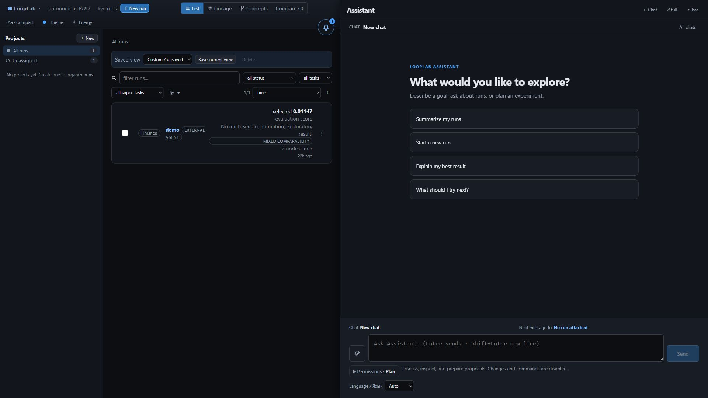

2. **Report → бесплатные итоги в чате.** Ограничения сравнения, Trust и отсутствие
   подтверждения явно показаны — это улучшение, а не старый дефект §19.2.
   Однако уже три итога повторяют длинные caveats и общий «Review Metrics and
   Trust». Run brief советует найти solution files, хотя repo Solution здесь
   недоступен. Это fixture без node-файлов, поэтому причина disabled export не
   проверена; сам разрыв формулировки и доступного действия виден. В O5/O6 нужны
   короткий verdict, одно обоснованное следующее решение и переход к реально
   доступному artifact scope. Замечены остаточное слово `champion` и склейка
   `differ.A parent`: небольшие copy-правки включить в этот increment.

   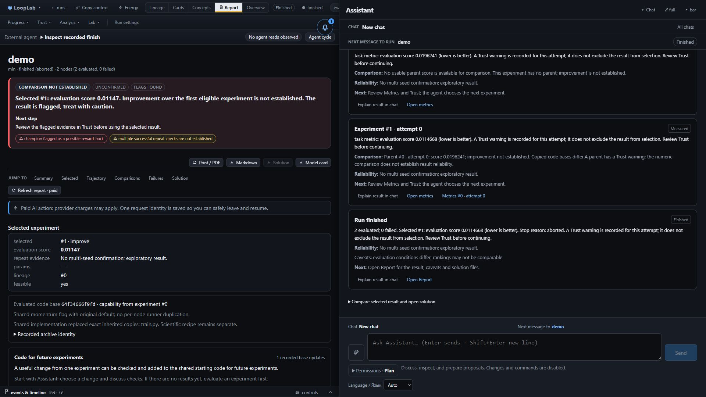

3. **Agent cycle → следующий шаг.** Панель честно отделяет последнее наблюдение
   движка от неизвестного соединения агента. «No agent reads observed» не выдаётся
   за смерть клиента. Но modal закрывает чат и предлагает технические references
   вместо короткого продолжения беседы. В O4/O11 вынести в Assistant текущее
   состояние, причину ожидания, диагностический read и требуемую роль для write;
   полные журналы оставить раскрываемыми. `Responsible: external agent` не должно
   скрывать отдельный owner-only шаг оператора.

   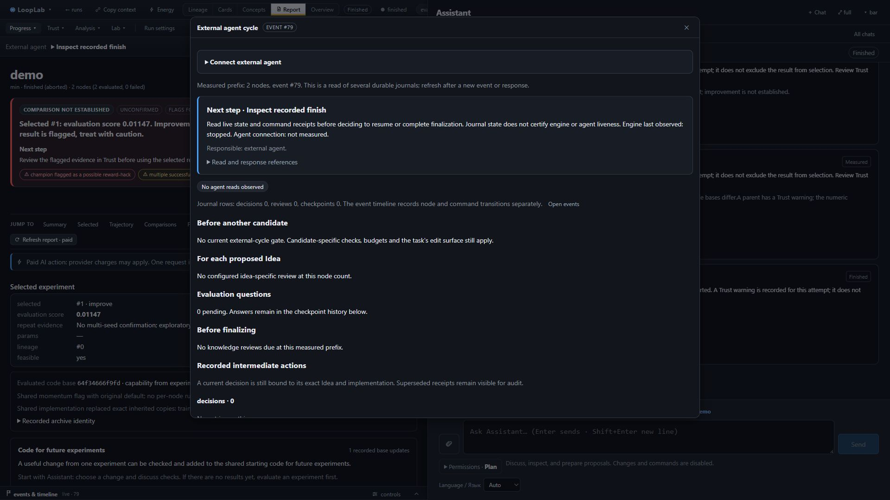

4. **Connect external agent.** Конфигурация stdio и отдельная передача scoped
   credential корректно разделены; scope всего server run root объяснён.
   На FHD подключение превращается в длинную инструкцию со скроллом, переходом
   в другой клиент, executable path, token environment и restart/trust. Нет
   завершённой пользовательской проверки connection в этом walkthrough.
   Отсутствующий credential намеренно задан стендом и не считается багом рабочего
   сервера. O3/O13 должны показывать результат каждого проверяемого шага и точное
   исправление ошибки, не автоматизируя выдачу прав или замену scoped token.

   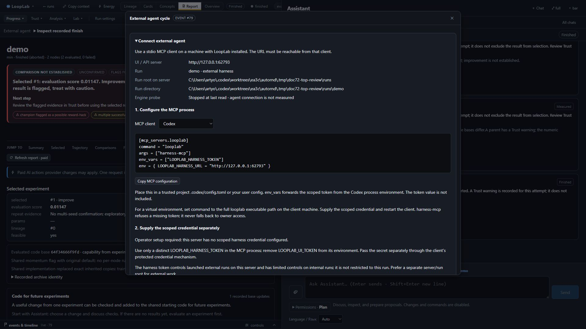

**Границы UX-проверки:** RU Agent cycle/handoff в исходниках ещё содержит EN-текст;
переключение языка в этой пробе не выполнялось. Мелкий вторичный текст требует
проверки контраста и масштабирования, но screenshot не измеряет contrast ratio.
Keyboard navigation, focus trap, screen reader, 2K и новый пользователь отдельно
не проверены. Это критерии O9/O10, не заявление о WCAG или полной usability-приёмке.

#### Git: текущая доставка подтверждена, общий disposition ещё отсутствует

Свежий `fetch` и `ls-remote` подтвердили исходный SHA одновременно для task HEAD,
основного `master` и `origin/master`. Выполнен read-only обход всех зарегистрированных
worktrees, `status` существующих каталогов, ancestry и `git cherry` уникальных HEAD.
Без удаления, сброса или переноса чужих изменений. Сводка и
[инвентаризация по каталогам](assets/72-review-19-9/worktree-inventory.csv)
зафиксированы **до изменения этой документации**:

| Показатель | Количество | Что это означает |
|---|---:|---|
| Зарегистрированные / существующие каталоги | 99 / 98 | Одна prunable регистрация с отсутствующим каталогом требует отдельного разбора |
| Каталоги с tracked edits / untracked entries | 8 / 6 | Числа относятся к каталогам; группы пересекаются, содержимое WIP не оценено |
| HEAD — предок master / не предок | 38 / 61 | Ancestry посчитана для регистраций, включая отсутствующий каталог |
| Уникальные HEAD | 96 | Совпадение SHA нескольких worktrees не объединяет их локальные изменения |
| Непредки с unmatched non-merge patches | 35 HEAD | Требуется review патчей; это не «35 потерянных фичей» |
| Непредки без unmatched non-merge patches | 26 HEAD | Патчи выглядят перенесёнными; `git cherry` не проверяет merge commits и сохранение смысла |
| Dirty tracked с предком master / непредком | 5 / 3 | Даже достигший master HEAD не доставляет незакоммиченные байты |

У inventory нет ошибок `status`; ignored artifacts, владельцы WIP и семантические
решения по каждому range этим обходом не установлены. CSV содержит counts и
identities, не содержимое файлов. Все решения пока `needs_review`, включая
patch-equivalent и отсутствующую регистрацию. В O2 сначала сохранить нужные
байты, затем назначить merged / superseded / integrate / WIP с обоснованием.
Существующая работа не удаляется по ancestry. Проверка CI исходного SHA в этом
проходе не выполнялась; O1 не закрывается утверждением о неизвестном CI.

Повторение среза: `git fetch origin master`, `git ls-remote origin refs/heads/master`,
`git worktree list --porcelain`; для каждого существующего каталога —
`git -C PATH status --porcelain=v1 --untracked-files=normal`, для каждого HEAD —
`git merge-base --is-ancestor HEAD MASTER_SHA` и, если это непредок,
`git cherry MASTER_SHA HEAD`. MASTER_SHA фиксируется один раз после fetch;
новое изменение remote или WIP означает новый срез, а не обновление старых чисел.

#### Уточнённые OPEN deliverables и порядок реализации

Следующие строки дополняют критерии §19.4; они не закрыты этим review.
O9 и сквозная CPU-приёмка O10 повышены до **P1**, поскольку без них нельзя
проверить снижение порога входа. Расширение GPU/Docker/host scorer остаётся P2.

| Очередь | OPEN / владелец | Конкретный результат | Свидетельство приёмки |
|---|---|---|---|
| 0 | O1/O2 — интегратор | Обоснованный disposition всех WIP и неясных ranges; проверки интеграционного SHA | Нужные изменения сохранены; итоговые refs и проверки связаны с SHA, спорные patches/merges рассмотрены |
| 1 | O3/O9/O13 — onboarding и docs | Один короткий путь из Assistant до первого CPU terminal result; диагностируемые executable, URL, права и runtime/build identity | Новые Codex и Claude Code клиенты проходят путь без поиска по длинному guide; `connection_check` и отказ приводят к конкретному шагу |
| 2 | O4/O8/O11 — recovery UX и клиент | В чате видно, кто и чего ждёт; private client record устойчиво сохранена до каждого write | Клиент остановлен до/после ответа и при pending checkpoint; новый процесс восстанавливает точное тело/ID/revision, не повторяет training |
| 3 | O5/O6/O9 — results UI | Краткий итог на RU/EN: измерение → допустимый вывод → следующий шаг; оговорки раскрываются, существенные flags видны рядом с числом | Человек своими словами объясняет mixed-base/unconfirmed/failed-parent исходы и находит доступный точный код; советы не ведут к недоступному Solution |
| 4 | O6/O7/O12/O14 — artifact UX и интегратор task repo | Materialized result manifest плюс reviewable owner-repo change set, отдельно от upstream base update | Чистый target воспроизводит выбранную попытку; overlay не удаляет inherited scorer/runner; dirty/stale target требует review; явны затраты, scope и доставка |
| На каждом этапе | O10 — acceptance | Три коротких сценария на одном текущем дереве: первый результат; потеря клиента/ответа; перенос результата | Manifest связывает code/UI/client/runtime identities, run generation, source/base, receipts, фактические команды и target SHA; скриншоты подтверждают доступные действия |

**Что упростить в документации:** в README и quickstart дать один актуальный
маршрут каждой роли и ожидаемый первый результат; сложные obligations показывать
по текущему contract/progress. Guide остаётся справочником протокола. Документ 72
остаётся планом и историей доказательств, не инструкцией первого запуска.
Формулировку «verified result» в README согласовать с точными границами: успешное
измерение, подтверждение повторов, сопоставимость, upstream gate и доставка кода —
разные свидетельства. Новые краткие инструкции не разрешают пропуск включённых
obligations. Сначала использовать существующие `brief`, phase_info, limits и
пагинацию; проверить именно model-visible content после общего tool result cap.

**Что упростить в результате:** один человеческий вывод и доступное действие
на текущем evidence. Подробности условий, исходные числа и квитанции остаются
достижимыми. Бесплатный recorded brief отделён от интерпретации агента и нового
платного вопроса. Архив выбранной попытки, её recipe, общая capability и patch в
owner repo имеют разные scope; экспорт не становится полной программой по имени
кнопки. До полной O5/O6/O14 приёмки не обещать «результат уже готов к использованию».

**Что сохранять явным:** смена policy, checkpoint verdict, finalization,
operator recovery, pause/check/advance/resume и публикация в owner repo.
Живой UI не означает живого клиента; возраст чтения не запускает takeover.
Снижение порога входа достигается понятным следующим шагом и устойчивой записью
запросов, сохраняя эти границы.

Проверка этой правки: documentation contracts, documented entry points и merge
history — **34 passed**; strict MkDocs и `git diff --check` прошли. Производственный
код не изменён. Этот набор проверяет документацию и историю интеграции, не заменяет
новый клиентский walkthrough, полный regression suite или CI точного SHA.

### 19.10 От критики к законченным результатам: уточнение OPEN и контроля доставки

**Срез 2026-10-03, исходный SHA `5e9659451721c353dc3fecd93c9b2bb307dcbfb7`.**
На входе task HEAD, основной master и свежий remote master совпадают.
В этом проходе повторно прочитаны README, external-harness guide, MCP/progress,
handoff/receipt UI, сохранённые command receipts и CI workflows. Устранена
неактуальная навигация в начале документа: она направляла к старой очереди и
оставляла публикацию текущей ветки только будущим шагом. Новых OPEN ID нет.

#### Критика плана и более точная граница готовности

Одна отметка OPEN скрывала четыре разных вопроса: есть ли реализация, проверен
ли контракт, прошёл ли человек весь путь, доставлен ли код. Например, O5 имеет
16 increments результатов (§20.2–20.17); объявлять его «не сделанным» неверно.
Но их тесты не подтверждают краткость чата или воспроизводимость owner-repo
результата. O1 уже имеет подтверждённую доставку; общий статус CI и WIP требуют
других доказательств. В каждой следующей доработке фиксировать эти четыре
состояния отдельно и закрывать конкретный проверенный остаток внутри O-пункта.
Повторное большое ревью без новой проверки или изменения приёмки не считается
реализацией. Исторические разделы не переписывать под новый SHA.

#### Путь пользователя: четыре намерения, одинаковые границы в обоих режимах

| Намерение | В Assistant UI | У внешнего агента | Что должно быть понятно без чтения всей документации |
|---|---|---|---|
| Начать | Задача → выбор владельца поиска → review/Validate → Start | Оператор запускает run → scoped MCP connection → current context/contract → готовый кандидат | Где код и оценка, кто предлагает следующий опыт, какие расходы и обязательства включены |
| Понять результат | Бесплатный recorded brief → конкретный вывод/ссылка на evidence | Current result-notices → измеренные данные → короткая интерпретация в языке пользователя | Измерение, подтверждение и установленный выигрыш различаются; `succeeded` admission не означает training success |
| Продолжить | В чате текущая причина ожидания, диагностический шаг и роль для действия | Private request record → saved receipt/current state/checkpoints → явное решение | Переподключение не возобновляет движок; неизвестный ответ не создаёт второй кандидат |
| Забрать код | Точный artifact scope → воспроизведение → review доставки | Материализация выбранной попытки → change set против реального target → проверки и явная доставка | Node overlay, run-owned base и owner checkout различаются; gate и изменение базы не означают merge |

Это целевая подача O3–O14, **не описание уже реализованного единого wizard**.
У внешнего агента и встроенного Assistant разные полномочия: scoped клиент не
вызывает owner model workflows. Беседа в UI не переключает владельца поиска.

#### Свежая точечная UX-проверка восстановления

Повторно открыт production UI на приватном стенде, FHD 1920×1080, Auto/EN, та же
копия recorded fixture без node-файлов, что в §19.9. Путь:

1. Runs → `demo` → Report → Agent cycle.
2. Connect external agent → прокрутка → Reconnect or recover a lost response.
3. Форма требует original Idempotency-Key или Command ID; без них предлагает Events.

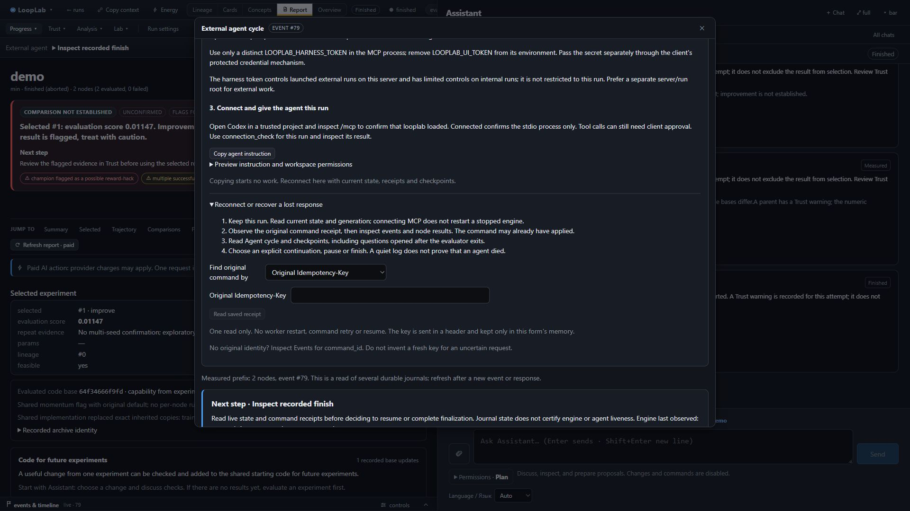

Saved PNG повторно просмотрен. Без ключа write/read receipt не выполнялся;
потеря живого клиента здесь не воспроизводилась. Keyboard, screen reader,
contrast, RU и 2K этой пробой не проверены. Наблюдаемый UX-разрыв: частая задача
«продолжить работу» вложена в первичное подключение и техническую форму, закрывает
чат и требует вручную восстановить identity. Сама форма корректно предупреждает
об отсутствии автоматического resume и возможности неизвестного эффекта.

**Уточнение O4/O8:** отделить вход «Продолжить этот run» от установки клиента,
связать его с сохранённой записью запроса и контекстом чата. До любого write
клиент устойчиво сохраняет сервер/run UID/generation, endpoint/control, точное
тело, исходный key/action ID и evidence revision, если она требуется. Auth headers
и credential в record не сохраняются. Новая сессия восстанавливает эту запись;
при её отсутствии показывает диагностический путь и неопределённость эффекта.
UI receipt lookup не становится хранилищем payload. `command-receipt` остаётся
наблюдением; обычный GET команды может возобновить nonterminal worker — эту
разницу подтверждает `looplab/serve/command_receipt.py`, её нельзя скрыть общей
кнопкой «обновить». Контекст запроса проверяется перед явным recovery действием.

#### Причина ожидания — обязательная часть O4/O11/O10

Проверить следующие состояния в связанной приёмке; эта таблица не доказывает,
что они уже пройдены новым пользователем:

| Состояние | Что показать человеку | Минимальная проверка |
|---|---|---|
| Есть submitted node, движок наблюдался живым | Выполняется или ожидает evaluation; возможны вопросы | Poll checkpoints/results, не посылать duplicate training |
| Evaluator закончил, но stage/live question открыт | Измерение ждёт явного verdict; это ещё не terminal узел | Включить быстрый command с первым monitor question после выхода evaluator |
| Deadline grace ждёт ответа | Команда может продолжать работу; нужен разрешённый extend/stop | Сверить allowed verdicts и runtime cap, не обещать автоматический timeout |
| Клиент молчит или UI перезапущен | Связь агента неизвестна; отдельно последнее наблюдение движка | Quiet/отсутствие reads не запускает takeover, abort или resume |
| Нет кандидатов, внешний режим | Следующий опыт или finish выбирает внешний агент | Встроенный Researcher не включается из беседы или ожидания |
| Источник повреждён | Конкретный источник, диагностика агента, recovery оператора | Scoped отказ остаётся отказом; восстановление не утверждает evidence и не снимает остальные gates |

Порядок выбора next step уже определяется `harness/progress_summary.py`; новый
UX читает этот контракт. Его технический owner обозначает диагностического
участника, но write_access текущей phase отдельно определяет, кто вправе действовать.
Не вводить второй независимый набор правил ожидания в UI.

#### Worktrees: проверять рабочие байты, содержательный diff и актуальность идеи

Повторно просмотрены `status` и `diff HEAD --stat` **в восьми tracked-dirty
каталогах предыдущего inventory**; это не новый полный обход 99 регистраций.
[Сохранённый срез](assets/72-review-19-10/wip-followup.json) не содержит исходных
байтов файлов и не служит резервной копией WIP. В семи каталогах есть текстовые
правки, включая replay/concepts, strategy, UI routes и тесты; в `autornd-bundle-fix`
Git показывает modified `ui/vite.config.js`, но normalised diff пустой и сообщает
о LF/CRLF. Причина и необходимость этой правки не установлены: отсутствие diff
не разрешает удалить байты. **В O2 уточнить disposition:** сохранить нужный WIP,
разделить substantive change, нормализацию/metadata и неизвестное состояние;
проверить, не заменён ли старый patch новой архитектурой. Review merge-коммитов
и ignored artifacts ещё требуется. Массовый cherry-pick или clean по имени
каталога не является проверкой «всё слито».

#### CI точного SHA и следующие законченные increments

[CI snapshot](assets/72-review-19-10/ci-snapshot.json) снят в **07:36:30 UTC** для
исходного `5e9659451`: [docs](https://github.com/ArtyomZemlyak/looplab/actions/runs/37106642674)
завершён успешно; jobs `ui` и `package` в
[tests](https://github.com/ArtyomZemlyak/looplab/actions/runs/37106642669) успешны;
четыре Linux pytest и четыре
[Windows pytest](https://github.com/ArtyomZemlyak/looplab/actions/runs/37106642702)
ещё выполняются. Это новый факт по сравнению с «CI не проверялся» в §19.9.
Пустая conclusion у выполняющегося job не означает success. Snapshot не
обновляется задним числом и не подтверждает CI будущего коммита этой документации.

**Ближайший product increment — O4/O8/O11:** понятный вход в продолжение из
Assistant плюс минимальный пример клиента с durable-before-write record.
Готовность — новый процесс после потерянного ответа находит оригинальный эффект,
не добавляет узел и показывает текущий обязательный checkpoint. Следующий —
O3/O9/O13: первый CPU результат с конкретной диагностикой соединения. Затем
O5/O6/O14: короткий итог и проверенная доставка точного кода. O2 сохраняет отдельный
приоритет P0 для сохранности WIP; его неизвестные ranges не должны бессрочно
блокировать независимые reviewable изменения текущей чистой ветки. Приёмка O10
идёт с каждым increment; важные flags и enabled obligations не прячутся ради
краткости. Расширение неподдерживаемых сред остаётся отдельной P2 работой.

Проверка этой доработки: documentation contracts, documented entry points и
merge-history integrity — **34 passed**; strict MkDocs и `git diff --check` прошли.
Производственный код не менялся; новый ML/client recovery run не выполнялся.

### 19.11 Новые свидетельства: красный CI, язык handoff и передача writer

**Исходный SHA `2555d5ffeb80246c2e7d4767d01c4bdc86a0f82e`, 2026-10-03.**
Свежий fetch подтверждает совпадение task HEAD, основного master и remote master.
Нового полного worktree inventory нет: сохранность всех каталогов всё ещё O2.
Этот проход уточняет действующие OPEN по новым фактам, не создаёт O15 и не
закрывает пользовательскую приёмку по наличию документа.

#### O1: интеграционная приёмка имеет отрицательный verdict

[Срез CI в 07:51:55 UTC](assets/72-review-19-11/ci-evidence.json) и failed logs
показывают: [Linux tests на `5e9659451`](https://github.com/ArtyomZemlyak/looplab/actions/runs/37106642669)
завершились с failure **на всех четырёх shards**. Выделены 18 уникальных failed
test IDs, включая параметризации; повтор одного отказа внутри alarm-теста не
считается новым ID. В §19.10 этот же run ещё выполнялся — исторический срез остаётся
верным, но уже не является актуальным verdict. Docs/UI/package того SHA успешны.
На текущем исходном `2555d5ffe` docs успешны, Linux/Windows выполняются; Windows
предыдущего SHA также ещё выполняется. Это не заключение о будущем исправленном SHA.

| Кластер из failed logs | Что проверено чтением | Конкретный остаток O1 |
|---|---|---|
| Remote MCP discovery: пять phases получают `No module named mcp` | CI ставит `[dev,ui]`; MCP SDK объявлен отдельным `[harness]`; тест вызывает `build_server` | Обеспечить зависимости реально проверяемой harness lane в чистой установке; не превращать её в незаметный skip |
| Engine fold seam | Guard называет четыре upstream-модуля с прямым импортом replay fold | Сохранить общий patchable engine fold seam и проверить upstream через него |
| Registry/layout/contracts | Не зарегистрирован `result_commentary.jsonl`; отсутствует `node_comparison` в layout; новый task hook не в optional-hooks; control tables не отвечают seam guard | Проверить фактических владельцев и единый источник каждого контракта; добавить корректные регистрации или исправить расхождение, не ослаблять guard вслепую |
| Event-reading smoke и alarm | Три external smoke фильтруют сырые строки по типу; alarm повторяет тот же отказ | Читать logical events через общее правило; проверить smoke и alarm вместе |
| Degraded result row | Refusal vocabulary guard видит drift unreadable-run stub относительно folded row | Согласовать форму недоступного результата, сохранив отсутствие измеренных чисел и диагностическую причину |
| Case-sensitive пути | Три case-helper сценария получают `outside_surface` вместо ожидаемого masking refusal | Разделить допустимый платформенный отказ и реальное masking; подтвердить неизменность источника и отсутствие gate executions при отказе |
| Module caps | `adapters/tasks.py` и `agents/state_brief.py` превышают свои guard caps | Проверить границы ответственности и выполнить необходимое разделение; увеличение cap требует отдельного обоснования |

Это **triage по журналам и коду**, не локальное воспроизведение всех отказов и
не доказательство, что последние UI-правки вызвали каждый из них. Ни разбор, ни
зелёный набор из 34 docs tests не снимают красный интеграционный verdict. В O1
зафиксировать по каждому отказу: причина → исправление → regression proof →
проверенный SHA. Защитный отказ в Linux не лечится расширением editable surface.
Этот repair batch идёт перед обещанием общей готовности.

#### O5/O9: язык чата ещё не язык полного пути и внешнего клиента

Свежий UI walkthrough на приватной recorded fixture, FHD 1920×1080:

1. Выбран RU в тестовом origin; открыт Report. Чатовые briefs и upstream panel
   русские, основной verdict/Report — английский.
2. Agent cycle → Connect → Preview instruction. Панель и инструкция английские,
   снизу остаётся выбранный RU. Сохранённые PNG повторно просмотрены.

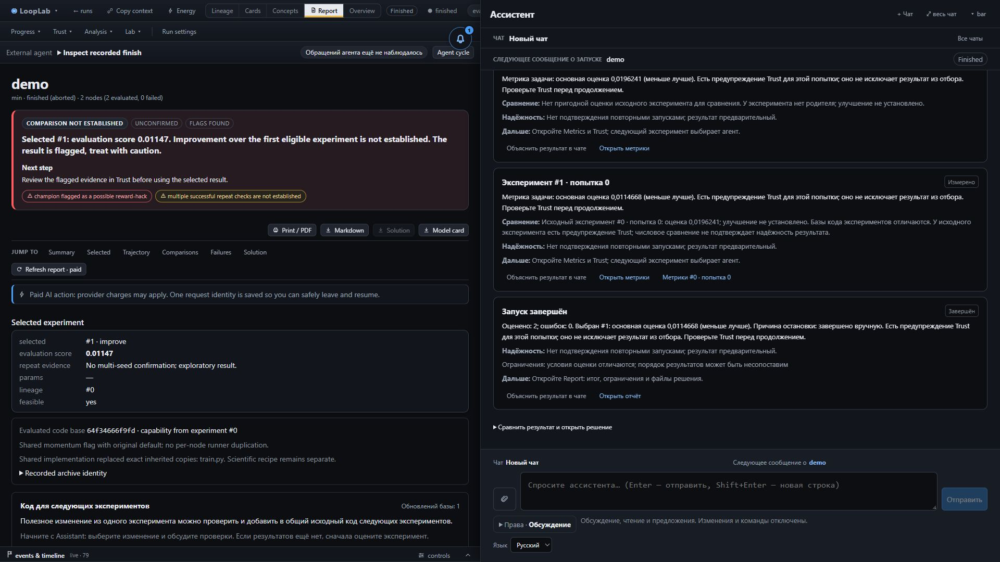

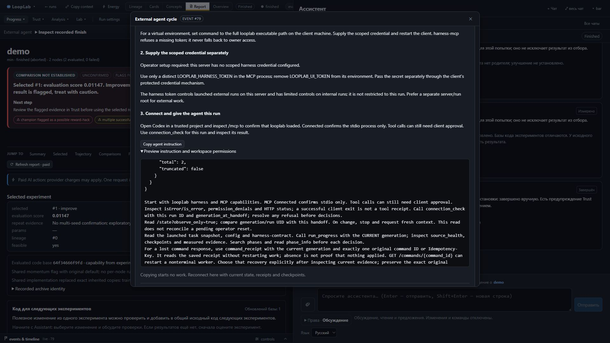

Источник preference — локальный `useAssistantLanguage.js`; `harnessAgentInstruction`
в `harnessHandoff.js` передаёт server/run/generation/workspace и общую фразу
«in the user's language», но не выбранное значение RU/EN/Auto. Английский язык
самой технической инструкции допустим; **отсутствует явная передача preference**
на другой клиент. Это конкретный остаток O9, а не требование перевести JSON или
получить доступ к owner settings через scoped token.

`AssistantResults.jsx` выводит сохранённую commentary как исходный текст.
`result_notices.publish` возвращает exact-retry ACK и отказывает другой publication
для того же receipt/evidence. Поэтому переключение RU не должно незаметно менять
старое тело, повторять write под новым ID или покупать перевод. В O5/O9 отдельно
проверить новый ответ на выбранном языке, сохранённую интерпретацию и Auto.
Новых моделей/тренировок/commentary writes здесь не было; два живых клиента,
keyboard/accessibility и 2K этой визуальной пробой не проверены.

#### O4/O8/O10: новая сессия и два клиента требуют согласования намерений

`AgentActivity` хранит одно последнее authenticated progress read для run/generation,
без client/session ID. Оно показывает наблюдение, не право единственного writer.
`command_identity` вычисляет identity по key; локальная чистая проба двух разных
ключей дала разные identities, **без отправки команд и executions**. Из этого
следует: exact retry дедуплицирует исходный запрос, но не два самостоятельно
заново сформулированных намерения. Это ограничение recovery-примера, не обнаруженный
здесь race или запрет намеренной параллельной оценки.

Добавить в O8 минимальный handoff record: какой клиент продолжает исходный write,
какие bodies/IDs сохранены и какие эффекты ещё неизвестны. До новой публикации
прочитать current receipt/state/results, включая уже существующую commentary.
Передача writer не выдаёт новые права и не запускается от quiet timeout. Если
работают два клиента, явно разделить независимую группу кандидатов и продолжение
одного запроса; свежая generation сама этого различия не обеспечивает.

#### Порядок доработок и границы обещания «всё слито»

1. **O1:** исправить подтверждённые CI отказы, получить общий verdict исправленного
   дерева; **O2:** отдельно сохранить WIP и разобрать неясные patches/merges.
2. **O4/O8/O11:** продолжение из чата + private record + передача между сессиями;
   два клиента и lost reply включены в приёмку, а не оставлены подразумеваемыми.
3. **O3/O9/O13:** короткое подключение, runtime identity и явный язык нового ответа.
4. **O5/O6/O7/O12/O14:** краткий вывод, точный код, проверки/затраты и доставка в
   owner repo. В delivery evidence обязательно явно назвать репозиторий, target
   remote/ref, исходный и итоговый SHA: слово `master` не связывает разные репозитории.

Опубликованный LoopLab commit, прошедший CI, сохранённый WIP, upstream base update
и merged task-result — пять разных утверждений. В чате и acceptance manifest
каждое получает своё доказательство или OPEN/unknown. Это основная оставшаяся
проблема понятности; дополнительных глобальных переключателей и новых O-ID для
неё не требуется.

Проверки документальной правки: **34 passed** (documentation, entry points,
merge-history), strict MkDocs и `git diff --check` прошли. Производственный код
не менялся; CI repair и приёмка двух живых клиентов остаются OPEN. Эти локальные
проверки документации не пересматривают перечисленные отказы интеграционного CI.

### 19.12 Сквозное ревью: от первого сообщения до принятого кода (2026-10-03)

**Уточнение области — §19.13:** inventory checkout разработки в этом историческом
срезе не оценивает Git worktrees продукта LoopLab. Он сохранён для обслуживания
репозитория; действующий O2 и продуктовая очередь уточнены по запросу пользователя.

**Исходный срез:** `efde354cdee677bae9d9bf65ea66d886cd2b36d2`; task HEAD,
основной master и fetched origin/master совпали, tracked changes в этих двух
checkout отсутствовали. Это новый review действующих O1–O14, без нового O15.
WP1–WP3 и 72.1–72.7 сохраняют ограниченную приёмку §18; ниже оценивается
завершённость пользовательского пути. Число исправленных guards не измеряет
понятность интерфейса, а отсутствие human acceptance не отменяет работающий протокол.

#### Проверенные поверхности и границы доказательства

Прочитаны README, quickstart, external-harness guide, актуальные handoff,
selection/config readers, result surfaces и Git/CI. Порт пользовательского UI
8775 отказал соединению. Визуальное ревью выполнено на отдельном loopback preview
8876 с private-копией прежнего завершённого CPU/MCP smoke, без engine, нового
training, модельных запросов, resume и новых commentary publications.
Это проверка отображения записанного результата, не повторная ML-приёмка.

У исходного `ui/dist` отсутствовал build stamp. Он не использован как свидетельство
текущего UI: Vite собрал исходники данного SHA в private `ui-dist`, preview явно
получил `LOOPLAB_UI_DIST`, страница загружена заново. Приняты только новые снимки
этой сборки; JPEG сохранены без правок и просмотрены с диска. Размеры — FHD
1920×1080 и 2K 2560×1440; горизонтального overflow страницы при этих просмотрах
не наблюдалось. Скриншот API без fullPage обрезал кадр: это дефект capture, не UI;
в доказательства включены полные кадры. Журнал preview byte-identical исходному.
Preview остановлен, временный viewport сброшен. [Метаданные и config probe](assets/72-review-19-12/review-evidence.json).

#### Пять шагов UI: что уже ясно, где пользователь ещё должен догадаться

**1. Найти основной вход — частично хорошо.** Assistant занимает видимое место;
контекст следующего сообщения, язык и Plan/«Обсуждение» показаны рядом с composer.
Карточка run уже пишет `selected`, `evaluation score` и отсутствие multi-seed
confirmation, поэтому прежний `best` не предлагается как новый баг этого дерева.
Однако четыре равноправных chat prompts и полный набор portfolio filters не
выделяют первый запуск и подключение своего агента. **O3/O9:** дать в Assistant
короткий вход «Запустить эксперимент / Подключить или продолжить своим агентом»;
advanced filters раскрывать по необходимости, сохранив доступ к portfolio.

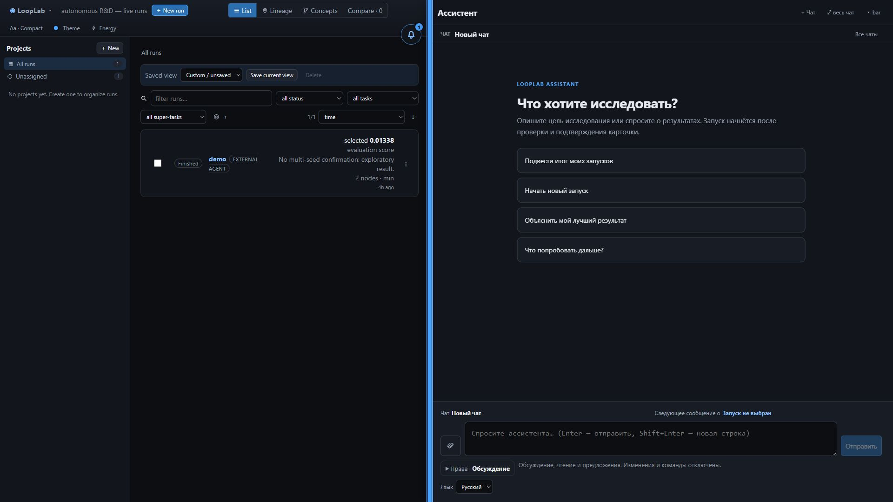

**2. Подготовить запуск — понятная подсказка, неполная сквозная приёмка.** Три
нужных факта, серверные пути, отдельный денежный бюджет и подготовка сообщения
уже объяснены. Start prompt не исполняет работу; обсуждение и launch review
различимы. Но здесь не виден законченный путь выбора internal/external роли и
готовности клиента. **O3/O9/O10/O13:** до первого write показать проверенные
setup steps и одного следующего ответственного; не объявлять отсутствие owner
model blocker для независимого внешнего клиента. Модельная карточка, её отказ,
Validate/Start и чистая установка в этом просмотре не выполнены.

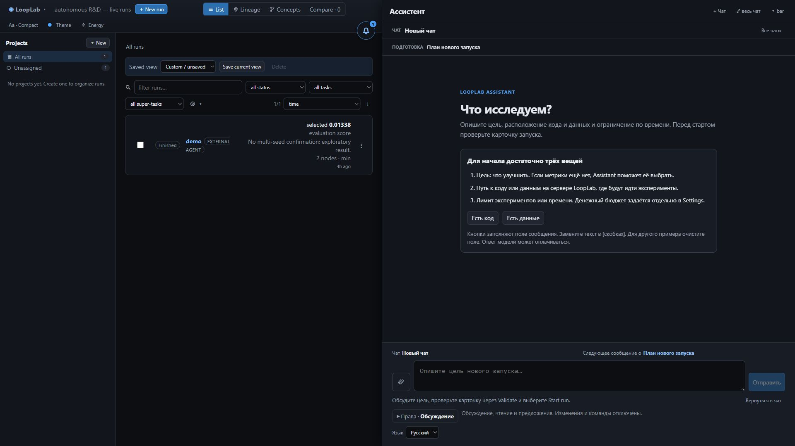

**3. Подключить внешнего агента — технически аккуратно, слишком много ручной
сборки.** Agent cycle доступен прямо из run status; handoff разделяет серверные
пути, MCP client, scoped credential и реальную проверку `connection_check`.
Отсутствующий scoped credential назван явно, значение секрета не копируется,
Copy не запускает работу. На RU экране handoff остаётся English; статус установки,
trust/restart клиента и runtime identity пользователь собирает сам. **O3/O9/O13:**
пошаговое подключение из Assistant с результатом каждого проверяемого шага,
явной границей operator/client и RU/EN. Серверный readiness не может подтвердить
executable/PATH удалённого клиента; unavailable остаётся unavailable.

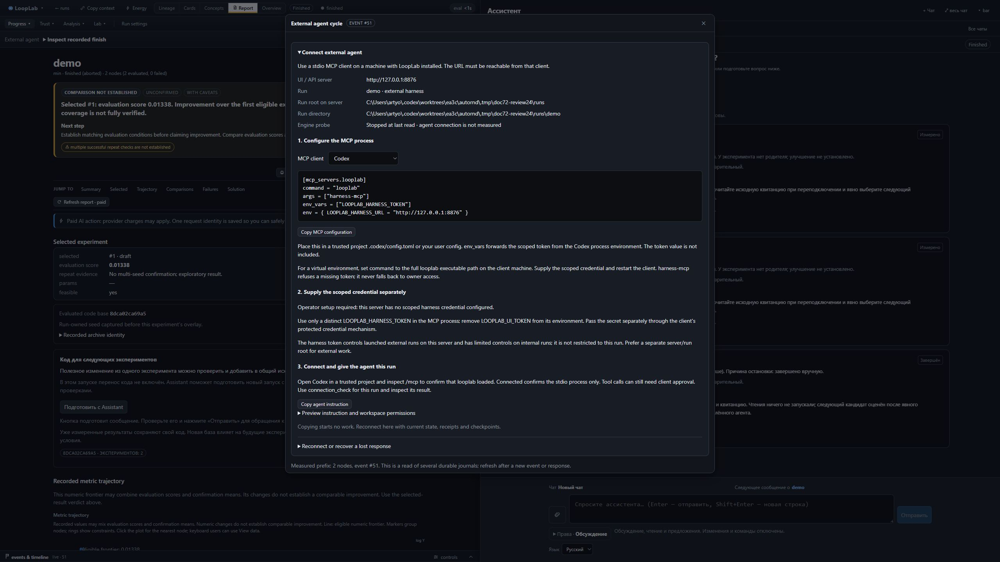

**4. Продолжить после потери агента — правила верны, память о запросе ручная.**
Recovery отдельно объясняет original identity, observation и явное продолжение;
engine probe, наблюдённые обращения и неизвестная живость клиента не смешиваются.
Форма предлагает read saved receipt, но key хранится только в памяти формы и
оператор должен принести его сам. **O4/O8/O11:** минимальный durable client плюс
один recovery entry из чата. До write сохранять original body/key/action ID,
generation и evidence revision; после нового процесса находить исходный запрос,
показывать known/unknown effects и следующую допустимую операцию. Два клиента
различают передачу одного намерения и независимые эксперименты. Quiet timeout
не выдаёт право takeover, retry, resume или обход checkpoint. Сбой клиента и
HTTP lost reply этим визуальным просмотром не воспроизводились.

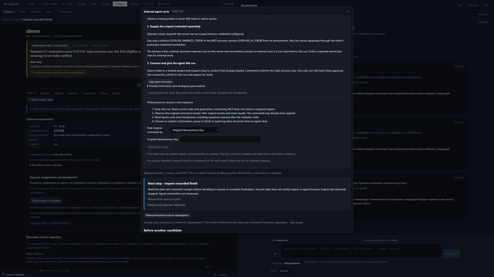

**5. Понять итог и получить код — evidence яснее, результат ещё растянут.**
Краткие итоги в Assistant появляются без модели, различают engine numbers и
сохранённую интерпретацию агента, объясняют отсутствие родителя и repeat evidence.
Report не объявляет числовую разницу доказанным улучшением. Ссылки ведут к
выбранному node #1 / attempt 0. Это сильная часть текущей реализации.
На FHD три completion cards занимают большую часть transcript; вывод и caveats
повторяются, Report рядом остаётся English. **O5/O9:** закрепить последний итог
с 2–3 строками «измерено / можно ли сравнить / что дальше», подробности и историю
раскрывать, сохранять точную квитанцию и исходную commentary. Не переписывать
старую публикацию при переключении языка и не скрывать обязательный checkpoint.

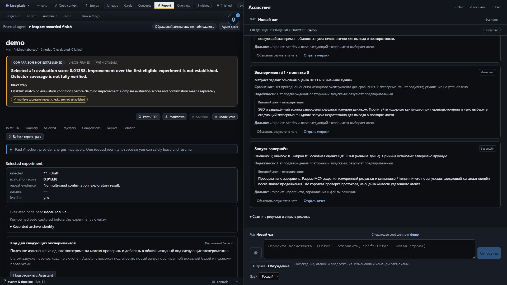

В этом fixture нет `solution.py`: Report объясняет отсутствие source, download
Solution disabled; Code показывает helper `config.json`. Это допустимая форма
cmd/repo задачи, не доказательство потери решения. Но переход к исходной базе,
overlay, зависимостям и owner-repo delivery требует отдельного законченного
маршрута **O6/O14**. Читатель должен получить точную materialization выбранной
попытки или конкретную причину невозможности, затем reviewable change set для
реального target. Upstream базы будущих экспериментов и merge в task repo
должны иметь разные состояния. Полная repo-задача и применение патча не проверены.

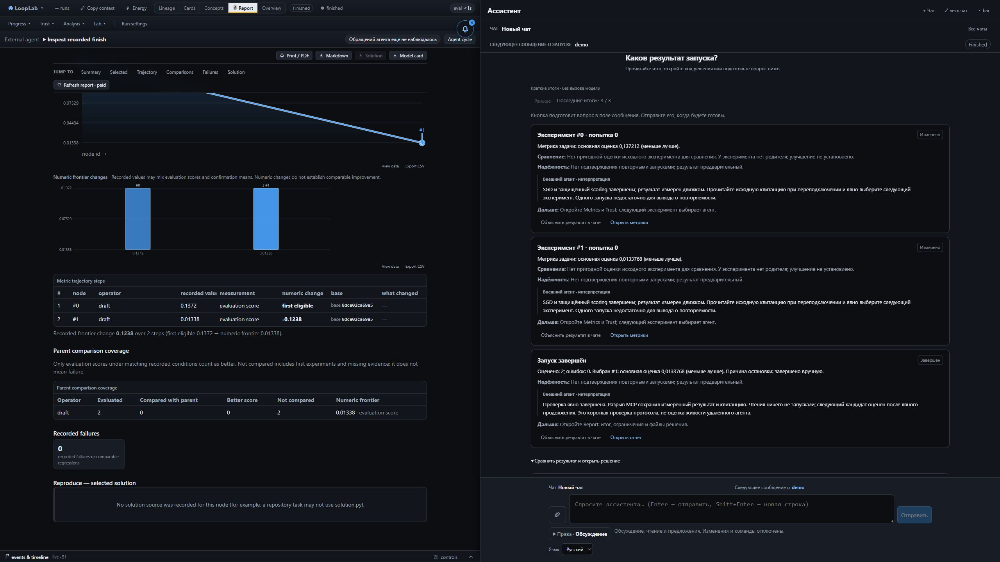

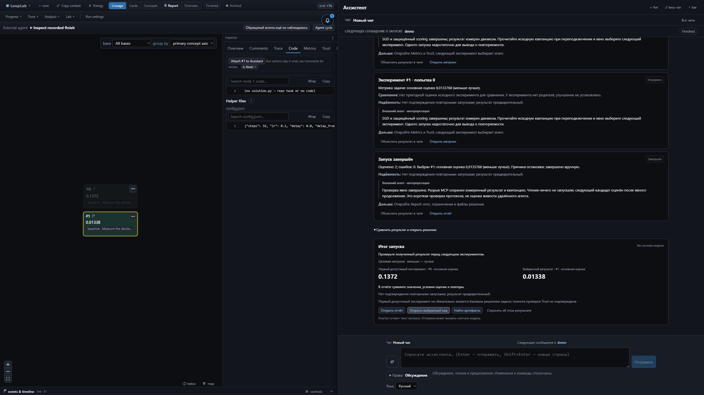

**Видимые риски доступности:** мелкие вторичные тексты/controls и длинные English
инструкции увеличивают нагрузку; граф/inspector при широком Assistant оставляют
мало ширины строкам кода. Нужны отдельная проверка читаемости при реальном zoom,
keyboard focus/порядка обхода и contrast measurement. Наличие AX labels и
keyboard альтернатив графика полезно, но не закрывает WCAG или screen-reader
приёмку. Мобильная компоновка не входит в этот план; desktop остаётся основным.

#### Протокол: следующий ремонт целостности, затем компактный клиент

**Config compatibility — измеренный частичный разрыв O13.** На копии terminal
event/config файлов добавлено одно неизвестное поле. Общий
`harness/snapshot_settings.py::read_harness_settings` правильно отказал `503
harness_config_incompatible` с источником `config.snapshot.json`; прямой
`harness/selection.py::status` вернул обычный объект, прочитав snapshot lenient.
`hypotheses`, `decisions`, `reviews`, `checkpoints` также ещё имеют прямые lenient
reads — это результат чтения кода, не исполненная проба каждого endpoint.
Bootstrap repairs §20.22 работают в своём scope; отказ bootstrap не доказывает
такой же отказ всех последующих semantic calls уже подключённого клиента.

Следующий slice: один strict policy для reads и publications, которые выводят
obligations/разрешение действовать, включая recovery/ACK. Обычный `/config`
остаётся diagnostic. Приёмка: unknown schema и повреждённый snapshot дают
источник и unavailable до semantic verdict; bytes/event history не меняются,
owner recovery не становится approval. Отдельно проверить exact retry после
смены сборки и journal damage. Здесь не воспроизведён live API bypass и не
менялись protection, event/schema contracts или production defaults.

**Durable client O8** должен быть runnable примером, а не ещё одним списком
MCP methods. Его private record сохраняется до network write, не содержит
credential, связывает request с run/generation/evidence и имеет явный исход
unknown ответа. Он использует существующие gates, не вводит автоматическое
ожидание commentary, нового автора кандидатов или скрытый resume. Acceptance
проверяет checkpoint после быстрого training, paged notices, потерянный ответ,
новый процесс и два клиента; simple CPU happy path один этого не доказывает.

#### Документация: чего сокращать, чего не прятать

В исходном срезе README — **317 строк**, quickstart — **167**, external-harness
guide — **1677**, сам doc72 до этого дополнения — **4377**. Это измерение размера,
не тест понятности. Quickstart уже разделяет chat draft/launch и experimental
score/confirmation, но шаг результата стал длинным справочником условий.
Новый пользователь должен знать следующий шаг раньше, чем весь протокол.

**O9 deliverable:** короткая стартовая страница с двумя маршрутами — Assistant
и внешний клиент — и тремя ролями (operator, agent, integrator). Для каждого:
что нужно сейчас, одно действие, ожидаемый проверяемый результат, один вход
в восстановление; protocol details — по ссылкам рядом. Не дублировать full
settings и фазовые требования в README. Формулировки «best verified» и
«merges best candidates» объяснять через наблюдённый evaluation/confirmation
и область merge: поиск внутри run не обещает научную надёжность или owner Git merge.
Doc72 остаётся журналом/планом; текущий backlog и очередь в §19.4 — единственная
активная очередь, исторические очереди не требуют повторной реализации.

#### Доставка LoopLab и сохранность worktrees: новый срез

| Проверка исходного SHA | Linux | Windows | Docs | Вывод |
|---|---|---|---|---|
| `cb72620f2` | [success](https://github.com/ArtyomZemlyak/looplab/actions/runs/37114998866) | [success](https://github.com/ArtyomZemlyak/looplab/actions/runs/37114998815) | [success](https://github.com/ArtyomZemlyak/looplab/actions/runs/37114998860) | Завершённый зелёный CI предыдущего дерева |
| `efde354cd` | [success](https://github.com/ArtyomZemlyak/looplab/actions/runs/37115885822) | [failure](https://github.com/ArtyomZemlyak/looplab/actions/runs/37115885845) | [success](https://github.com/ArtyomZemlyak/looplab/actions/runs/37115885881) | Текущий исходный master доставлен; O1 приёмка красная |

[CI snapshot](assets/72-review-19-12/ci-evidence.json). Windows shard 1:
**1 failed, 5587 passed, 214 skipped**; failing ID —
`tests/test_control_plane_liveness.py::test_no_reachable_control_state_is_absorbing`.
Путь `root0.engine_stalls.steer`, pause trail:
`timed_out/deadline_passed_before_intent → timed_out → healed:timed_out`.
§20.23 исправлял incident fixture, но bounded search оставил окна .12/.2s.
Лог доказывает отказ до intent; причина scheduling этого runner не установлена.
O1: воспроизвести именно этот путь при контролируемой задержке, отделить deadline
test от healthy liveness recovery и сохранить succeeded/non-vacuous invariants.
Не лечить skip/xfail, ослаблением assertion или изменением production timeout
без доказанного runtime бага. Затем нужен общий CI точного исправленного SHA.

Read-only [worktree inventory](assets/72-review-19-12/worktree-inventory.json):
**99 регистраций, 98 доступных каталогов, 1 отсутствующий**. Tracked status
прочитан во всех 98; **8 dirty**, включая **5 с HEAD-предком master**.
Из доступных HEAD **37 предки**, **61 непредки**: **26** имеют только
patch-equivalent nonmerge ranges, **35** имеют unmatched nonmerge commits.
Сумма unmatched по ranges — 88 с повторами; уникальных commit IDs — **58**,
это не число потерянных фичей и не число независимых патчей. Unreachable merge
commits в этих текущих ranges — **0**. `git cherry` не сравнивает WIP и не
доказывает семантическую эквивалентность переписанной интеграции.

Dirty каталоги: `autornd-bundle-fix-20260720`, `autornd-card-ui-lifecycle-20260721`,
`autornd-concept-cache-20260717`, `autornd-delta-missing-base-20260718`,
`autornd-empty-concept-delta-20260717`, `vigilant-saha-d21ba6`,
`.codex-review-sweep`, `.codex-ui-next`. Untracked/ignored байты в этом новом
проходе не инвентаризированы и не сохранены. Параллельные read-only наблюдения
не являются атомарным snapshot. **O2:** backup нужных байтов, владелец и решение
по каждому range/WIP, затем адресная интеграция/проверка. Ancestry не разрешает
очистку; unmatched не разрешает слепой cherry-pick. Этот review не удаляет,
не сбрасывает и не сливает чужую незавершённую работу.

#### Уточнённые законченные результаты в действующих OPEN

| Порядок | Тема / основной владелец | Следующий deliverable | Что должно закрыть slice |
|---|---|---|---|
| P0 | O1 — integrator | Устойчивый bounded liveness guard и общий verdict | Исходный CI path + worker delay, invariants сохранены, Linux/Windows/docs исправленного SHA |
| P0 | O2 — integrator/авторы WIP | Backup и disposition 8 WIP + 35 unmatched ranges | Восстановимые bytes, адресные решения и content/scenario evidence; equivalent ranges тоже имеют решение |
| P1, целостность | O13 — harness | Единый strict semantic config policy | Unknown schema/damage/recovery не выдают gates или ACK по отброшенным settings |
| P1, продолжение | O4/O8/O11/O13 — harness/client/chat | Durable client + одно recovery действие из Assistant | Lost reply, новый процесс, два клиента и pending checkpoint дают понятный исход без duplicate work |
| P1, вход | O3/O9/O10/O13 — onboarding/docs | Первый CPU результат через два коротких маршрута | Свежая установка отдельно от готовой среды; operator/client setup, RU/EN и runtime unknown ясны |
| P1, результат | O5/O6/O9/O14 — results/delivery | Последний краткий итог + точная попытка + target change set | Пользователь верно объясняет сравнимость/repeats, воспроизводит код и видит локальный/published/merged статус выбранного repo |
| P1, обобщение | O7/O12/O10 — Maintainer/chat | Reusable improvement через существующий review/gate | Recorded base изменена только после checks; цена/полномочия явны; owner repo отдельно |

Все 14 O-тем остаются OPEN; таблица уточняет slices, не добавляет новые роли
поиска, переключатели, фоновые takeover или implicit waits. Следующий проход
реализации берёт первый незавершённый результат очереди §19.4 и сохраняет четыре
состояния: реализация / contract check / human acceptance / delivery. Новый
общий review нужен при новом свидетельстве или изменении цели, а не вместо работы
по уже определённым критериям.

Проверки этого документального прохода: replay-first — **193 passed**;
documentation contracts, entry points и merge history — **34 passed**;
strict MkDocs, существование всех новых local links и `git diff --check` прошли.
Private UI build завершился. Production/tests не изменены; перечисленный красный
Windows CI остаётся отрицательным свидетельством до отдельного repair и общего
verdict. Проверки документации не закрывают human acceptance, WIP или O1–O14.

### 19.13 Продуктовое ревью: внешний агент, worktrees LoopLab и репозиторий задачи (2026-10-03)

**Область исправлена по прямому уточнению пользователя.** Git worktree означает
функциональность LoopLab, работа над репой — код ML-задачи и его принятие
пользовательской веткой. Inventory наших checkout не отвечает на эти вопросы.
O2 и действующая очередь §19.4 переопределены; O1 остаётся служебным gate
разработки LoopLab. Исторические свидетельства не удалены. Нового O15 нет:
остатки уточняют O2/O3–O14, закрытый opt-in протокол §18 не переоткрывается.

**Срез кода:** `cb08cd5c1e5d4be214db86b8ec154bde0d07f836`.
Прочитаны README, quickstart, external-harness guide, seed/archive, upstream,
Maintainer, HTTP/Assistant tools, bundle и UI-представление базы. Выполнены
выбранные существующие тесты на Windows с отдельными private basetemp.
CPU SGD реально исполняется, включая защищённый scorer; результаты не подставлены.
Новая чистая установка, живые модели Codex/Claude и enabled upstream UI-сценарий
в этом проходе не проверялись. Снимки §19.12 получены на upstream-disabled run
и не являются визуальной приёмкой полного переноса. UI-выводы ниже — из кода,
а не новая проверка человеком или сертификат accessibility.

#### Что работает и где пользовательский путь обрывается

| Область | Подтверждённая реализация | Критика и OPEN |
|---|---|---|
| Внешний агент | LoopLab принимает готовый кандидат, исполняет evaluator, хранит историю; exact retry возвращает исходный verdict. Обязательства и checkpoints явно читаются | Новый процесс клиента ещё должен сохранить и восстановить намерение. Серверная квитанция не заменяет исходный payload; нужен минимальный durable client и вход «продолжить» — O4/O8/O11 |
| Первый вход | README ведёт в Assistant; quickstart отделяет Plan, validation и Start. Внешний режим отделён от delegated Developer | Для внешнего режима нужны server/run, credential, executable, MCP setup и connection check. Пользователь должен увидеть их как один маршрут с конкретным следующим шагом — O3/O9/O13 |
| Результаты | Есть разделение primary score, repeat mean, сравнимости и Trust; измеренный узел сохраняет свой код | Числовой verdict ещё не отвечает, какой общий код использован, что можно забрать и что сделано с task repo. Нужен короткий итог со связью кода/базы/доставки — O5/O6/O14 |
| Git worktrees продукта | Private repo и отдельный worktree предложения создаются из проверенного архива, byte drift отказывает до authoring; сбой инициализации восстанавливается явно | История операций есть, но нет цельного view жизненного цикла предложения, WIP и хранения. Нужны карточка и проверяемая retention/recovery policy — O2 |
| Накопление общего кода | Два реальных base advance сохраняют предыдущие возможности; научные настройки не становятся общим default | CAS правильно отвергает proposal старой базы. Пользователю нужен маршрут повторного обобщения и проверки композиции, а не обещание автоматического merge любых branches — O7/O10/O13 |
| Передача в пользовательскую ветку | Архивы и reviewer bundle связываются с событиями и проверяются по байтам | Готовый материализованный repo-result и target-aware интеграция не завершены. Run-owned advance не пишет owner checkout — O6/O14 |

**Вывод:** нижний протокол защищён существенно лучше, чем собранный путь работы.
Приоритет — сделать существующие операции понятными и довести выбранный код до
проверенной пользовательской ветки. Добавление нового search режима или API
само по себе этот остаток не закрывает.

#### Worktree, база и merge: точные границы

1. **Workspace узла в этом opt-in режиме** — копия записанной базы с правками
   эксперимента. Это не Git
   worktree каждого узла; решение doc 37 сохраняется. Исходный owner repo не
   становится неявным источником новых bytes после запуска.
2. **Worktree Maintainer** — run-owned предложение общего изменения.
   `looplab/engine/upstream_workspace.py::maintainer_worktree` создаёт private Git
   и ветку предложения; архив, а не Git HEAD, определяет проверяемые bytes.
   `.gitignore`, фильтры или настройки перевода строк не должны менять их.
3. **Проверенный proposal** — сохранённые bytes, source/recipe и отдельный measured
   gate. `looplab/engine/upstream.py::UpstreamLane.check` записывает executions;
   `UpstreamLane.advance` повторно проверяет identity и текущую revision. Pass
   не применяет базу автоматически, advance не запускает resume.
4. **Новая общая база** — стартовый код дальнейших экспериментов. Два улучшения
   могут накапливаться последовательно. Два proposals одной старой базы не
   превращаются в готовую композицию: после первого advance второй stale,
   потребуется новое предложение с актуальным источником и новые checks.
5. **Измеренный результат** — его исходная база плюс конкретный рецепт.
   `looplab/engine/upstream_workspace.py::materialization_plan` сохраняет эту
   реализацию при повторной оценке terminal узла. При конфликте pending overlay
   остаётся **вся прежняя база**, без смеси файлов разных баз. Более поздний
   явный экспериментальный revert не поглощается старым переносом.
6. **Доставка в task repo** — отдельная интеграция выбранного результата с
   target identity/HEAD, reviewable diff и проверками. Она ещё OPEN. Новый код
   на последней базе нельзя выдавать за старый измеренный результат.

Пример приёмки: общая возможность A принята в B1, B обобщена из измеренного узла
B1 и принята в B2. Следующий recipe-only узел использует A+B и собственные
настройки. Старый результат повторяется на своей измеренной базе. Конфликтный
узел остаётся на прежней целой базе, и это показано явно. В task repo переносится
выбранный код с необходимыми общими зависимостями; разные рецепты не объявляются
обязательными частями одной программы. Этот смысл «всё сливается» принят для O14.

`looplab/engine/upstream.py::UpstreamLane.abandon` оставляет прерванные bytes
доступными для исследования и не даёт pass/resume. В прочитанных upstream
реализациях нет отдельного менеджера удаления worktrees; накопление хранения
и удобство восстановления требуют O2. Не следует вводить автоматическую очистку
до определения зависимостей истории/повторов и проверки restore. В текущем
проходе потеря работы не обнаружена; рост диска не измерялся.

#### Что упростить в чате и документации

- **Первое сообщение:** цель, task repo/данные, ограничения. Assistant формирует
  проверяемый launch plan с evaluator, editable/protected surface и выбранным
  режимом. Пути явно принадлежат серверу; полный JSON — в подробностях. Для
  внешнего режима отдельно видны полномочия оператора и готовность клиента.
- **Один текущий шаг:** «обучается», «ждёт решения агента», «нужен ответ на
  checkpoint», «неизвестен ответ на запрос», «нужен оператор». Это разные
  состояния. `looplab/serve/agent_activity.py::AgentActivity.snapshot` измеряет
  недавние запросы, не жизнь процесса; quiet не доказывает смерть агента.
  Idle внешнего run допустим, но причина ожидания должна быть видна в Assistant.
- **Работа с общим кодом:** компактная карточка source → diff → checks/цена →
  verdict → новая база. `ui/src/UpstreamPanel.jsx::UpstreamPanel` уже объясняет
  процесс и подготавливает сообщение, но не даёт полноценного proposal view.
  Maintainer — роль автора Assistant/внешнего агента, а не скрытая новая модель;
  `looplab/agents/maintainer.py::Maintainer.validate` проверяет декларацию critic,
  не доказывает независимый платный review. Реальные checks обязательны отдельно.
- **Краткий результат:** что изменили; что измерили и можно ли сравнить; какая
  база использована; ограничения; доступный следующий шаг. Для recipe-only
  результата показываются общий runner и настройки вместо ожидания solution.py.
  Статусы «выбрано», «проверено», «база обновлена» и «доставлено в вашу ветку»
  различаются. Подробные receipts остаются доступны у вывода.
- **Русский язык:** объяснения базы и конфликтов должны следовать языку чата.
  `ui/src/BaseRevision.jsx::BaseRevision` пока содержит английские сообщения.
  Нужны понятные слова «общий код», «настройки эксперимента», «код, который
  измерили», «изменения в вашей ветке»; IDs и точная диагностика не переводятся.
- **Короткое руководство:** быстрый маршрут Assistant и быстрый маршрут внешнего
  агента с общими шагами «прочитать результат / продолжить / забрать код».
  `docs/guide/quickstart.md` накопил подробные правила сравнимости и кривых прямо
  внутри первого запуска; вынести детали в linked result guide, сохранив короткие
  существенные ограничения рядом с числом. Doc 72 остаётся планом и историей,
  а не обязательным чтением перед первым запуском.

#### Материализация и передача результата: следующий законченный increment

O6 сначала даёт manifest выбранных run/generation/node/attempt, измеренной базы,
overlay/удалений, entrypoint и зависимостей. Он должен позволить собрать **полный
код**, а не принять overlay за дерево репозитория. Проверка bundle подтверждает
его bytes и связи, но не запуск программы в новом окружении.
`looplab/engine/bundle.py::export_bundle` пишет champion edits; отдельно
`looplab/engine/bundle_bases.py::export_seed_archives` упаковывает записанные
доступные базы и именует unavailable. Ни один из этих шагов не доставляет код
в пользовательскую ветку; staging и незаписанный WIP намеренно не являются
частью этого reviewer export.

После этого O14 готовит target diff с additions/changes/deletions и состояниями
«подготовлено / применено / проверено / опубликовано / merged». В target могут
быть собственные правки, другой HEAD или новые файлы: они не исчезают из-за того,
что отсутствуют в overlay. Изменившийся target требует повторного review/check.
Целевой SHA проверяется в контексте task repo; upstream gate не сертифицирует
чужую ветку. Интеграция выполняется уполномоченным клиентом с выбранным target,
при сохранении engine-контракта работы только с run-owned базой.

#### Свежие проверки и оставшаяся приёмка

[Запись проверки](assets/72-review-19-13/validation.json) содержит исходный SHA,
selectors, counts и границы. Production-код, пользовательские run и credentials
не изменялись. Это тестовая приёмка отдельных механизмов, не полная приёмка UX.

| Проверка | Результат | Что подтверждено |
|---|---|---|
| Replay first | 193 passed | Базовые event/replay contracts |
| Worktrees, реальные SGD transfers, multibase, process-loss recovery, stale materialization и явный revert | 35 passed | Два переноса, исходные повторные оценки, целая старая база при конфликте, exact ACK без новой работы и recovery после обрыва Git init |
| Reviewer bundle и seed archives | 24 passed, 4 skipped | Байты/связи архивов, unavailable sources, защита recorded run от export; skipped — symlink privilege и POSIX executable bits на Windows |

Документальные contracts/entry points/merge-history — **34 passed**; строгая
сборка MkDocs и `git diff --check` прошли. Эти gates проверяют документацию,
а не реализацию перечисленных OPEN функций.

Следующая O10 приёмка должна соединить эти механизмы в один свежий путь: первый
результат → обрыв клиента → продолжение → два переноса → recipe-only результат →
полный код → отдельный task repo с собственными изменениями → проверенная ветка.
Для UI Assistant и внешнего клиента фиксируются количество ручных шагов,
непонятных остановок, повторных executions и ошибки трактовки результата.
Они ещё не измерены как пользовательские показатели. Local pass выбранных
наборов не заменяет полный CI, чистую установку, GPU/remote либо human acceptance.

**Итог плана:** сначала вход и продолжение, затем видимый жизненный цикл
предложения и накопление общего кода, затем точный результат и target delivery.
O2/O6/O7/O14 остаются OPEN с конкретными продуктовыми критериями. Этот проход
исправляет план и проверяет существующие механизмы; новые продуктовые функции
им не реализованы.

### 19.14 Enabled upstream: свежий путь в UI и пробелы между кодом и результатом (2026-10-03)

Это продолжение продуктового ревью §19.13, с новыми снимками включённого upstream.
Git worktrees рассматриваются только как run-owned функциональность LoopLab.
Источник — `8baaf9c0e16a318b5a5336d50d99e7b6e34b9442`, production-код не изменён.
Действующая очередь §19.4 и критерии O2/O5/O6/O7/O12/O14 уточнены по находкам;
новых верхнеуровневых O-пунктов и второй конкурирующей очереди не добавлено.

**Цель пользователя:** через Assistant понять, что получилось, какие изменения
накоплены, что уже проверено и как получить этот код в своей репе. Внешний агент
должен пройти ту же цепочку с точными источниками и безопасным продолжением.

#### Свежий стенд и границы

В отдельном каталоге заново выполнен сценарий из
`tests/test_upstream_multibase.py::twice`: реальные CPU SGD, protected scorer,
два proposals/checks/advances, всего **14 gate executions**. Дополнительно
реально оценены узлы #2, #3 и #5. #2 использует новый общий runner и собственный
recipe; #3 из-за конфликта сохраняет старую целую базу; #4/#6 ещё pending.
Это fixture, составленная существующими тестовыми helpers и реальными engine
операциями, **не** полный живой запуск через Assistant или Codex/Claude.
У неё нет всех comparison-context stamps: вывод о научном выигрыше по этим кадрам
не делается. Записанные author summaries английские и не переведены автоматически.

Vite заново собрал текущие исходники в private dist. Отдельный loopback preview
8877 не имел пользовательских model credentials и работающего engine. В in-app
browser проверены 1920×1080 и 2560×1440, выбран русский язык Assistant. Каждый
принятый JPEG сохранён без правок и открыт с диска. Нажатий Send/Start/resume/check
не было; подготовлено только сообщение в composer. До и после UI байты
events.jsonl совпали. Preview остановлен, viewport восстановлен.
[Сценарий, идентичности и снимки](assets/72-review-19-14/evidence.json).

#### Шесть шагов визуального ревью

1. **Lineage + краткие итоги — работает, связь с кодом неполная.** Русские
   summaries различают основную оценку, отсутствие подтверждения и несопоставимость.
   Есть ссылки на точные attempt metrics. Однако текст не объясняет, какие общие
   возможности узел унаследовал и почему оставался на старой базе. На графе #0
   подписан baseline, хотя это momentum-кандидат, а не отдельно измеренный baseline
   задачи. O5: короткая связь результата с базой; нейтральная подпись первого опыта.

   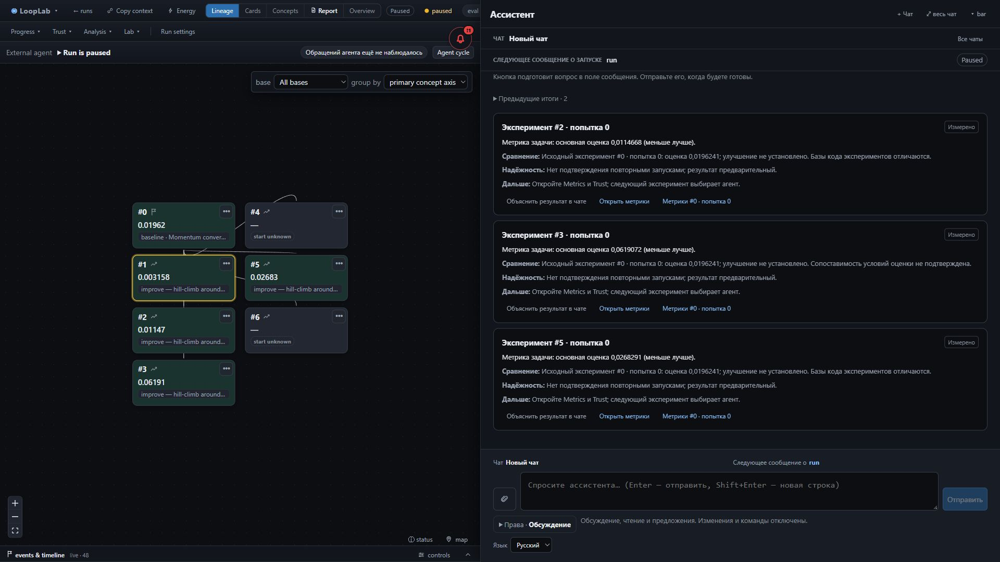

2. **Overview upstream — есть история, не хватает карты применения.** Показаны
   два обновления, их sources/defaults и последняя завершённая проверка: 7
   executions. Это корректный счёт последнего gate, а не всех 14. Базы представлены
   digest chips; pending #4/#6 попали в «База неизвестна». Selected #1 измерен на
   предыдущей базе, хотя рядом показана уже новая общая база. Нужна явная связь
   «результат / использованный код / текущая база будущих опытов» и причина unknown.
   O5/O7/O12/O13: применение, состояния до засева и понятный scope затрат.

   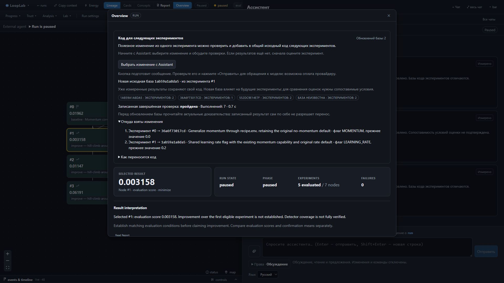

3. **Переход в Assistant — корректный безопасный draft, выполнение ещё не принято.**
   «Выбрать изменение с Assistant» закрывает Overview, сохраняет run-контекст и
   готовит русский текст. Модель не вызывается; checks/advance/resume не запускаются.
   Предлагается обсудить выбор, но нет связанной карточки конкретного proposal,
   его worktree и следующего gate. O2/O7: продолжение одного предложения через чат;
   текущий draft не считается готовым переносом.

   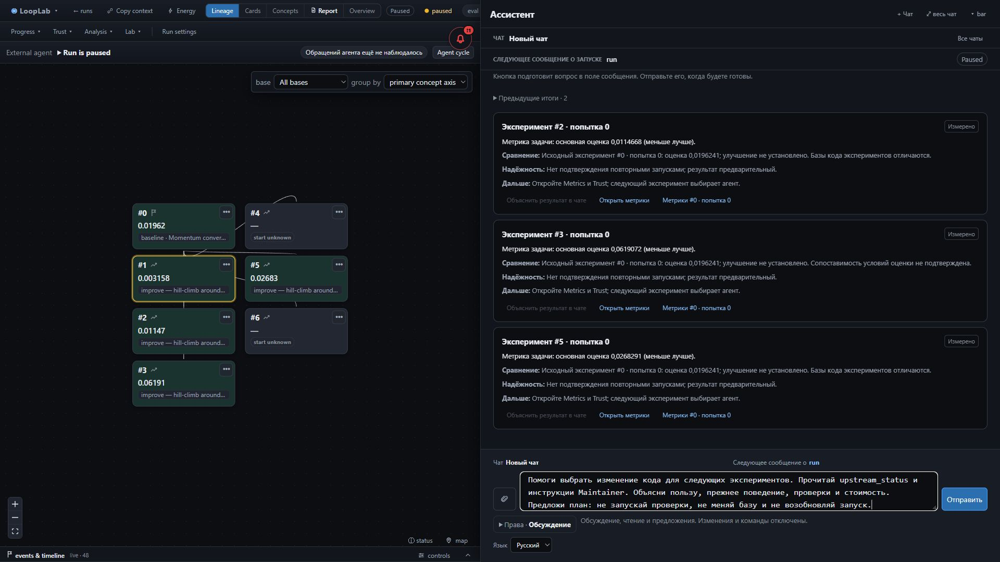

4. **Конфликтный узел — guard понятен технически, объяснение требует знания терминов.**
   Inspector показывает старую базу и предупреждение о конфликте train.py:
   whole experiment kept prior base. Ошибка не спрятана, метрика сохранена.
   Но объяснение на английском и не перечисляет неунаследованные возможности
   или доступный путь нового кандидата. На FHD одновременно открытые чат/Inspector
   ограничивают ширину evidence; отдельные области прокручиваются. O5/O9/O13:
   краткое русское объяснение и раскрываемые подробности, без потери предупреждения.

   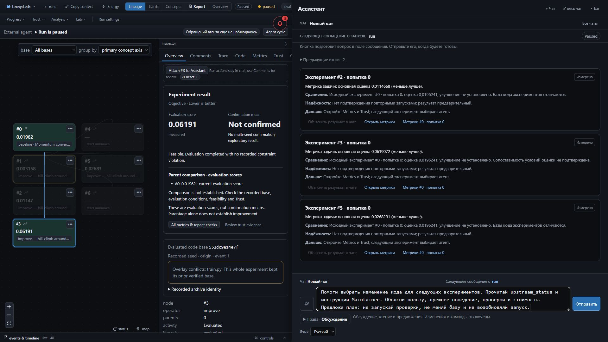

5. **Recipe-only Code — данные есть, полная программа не представлена.** У #2
   видно «no solution.py — repo task or no code», а recipe.env находится в Helper
   files. Унаследованный train.py реально участвовал в оценке и лежит в измеренной
   базе, но этот экран показывает только overlay. Пользователь может решить,
   что полезного кода нет. O6: основной список файлов/recipe, отдельная измеренная
   база и путь к полной программе; отсутствие solution.py не является ошибкой задачи.

   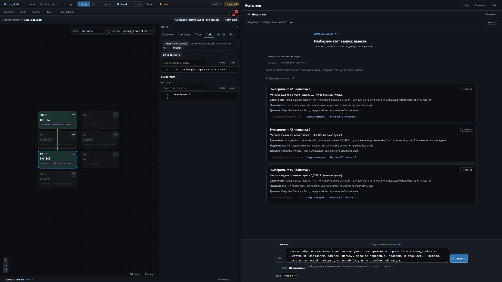

6. **Diff vs parent — подтверждённый пробел покрытия файлов.** Кнопка даёт пустой
   основной diff: у обоих узлов поле code пустое. При этом MOMENTUM изменился с
   0.2 на 0.3, а база runner тоже изменилась. Экран продолжает показывать текущее
   recipe.env без его сравнения. `ui/src/Inspector.jsx::Code` сравнивает только
   parent_code/code, files выводятся отдельно. O6: file-aware сравнение и явный
   scope; пустой solution diff не означает одинаковые программы. Разные базы
   требуют материализованного сравнения или явного ограничения этого режима.

   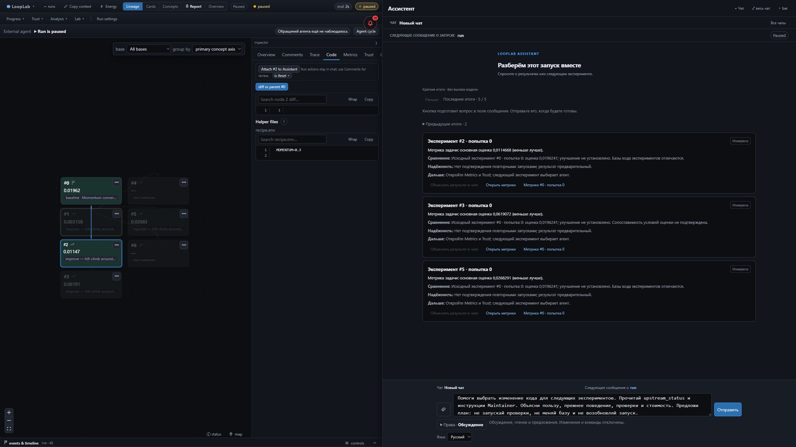

Снимки показывают читаемые основные числа, сохранённые warning blocks и явную
границу draft/Send. Риски доступности: вторичный серый текст, длинные mixed-language
объяснения и тесный Inspector рядом с чатом. Контраст численно, zoom, keyboard-only
маршрут и screen reader не проверены; полной accessibility приёмки нет. Для
последнего 2K состояния page horizontal overflow не обнаружен; это не результат
проверки всех внутренних панелей или всего приложения.

#### Выводы по внешнему агенту и входу

Существующий протокол правильно отделяет чтение, запись, execution, verdict и
advance. В свежих HTTP/MCP/Assistant tests потерянный ответ не повторяет measured
работу, а поздний pass после abandon не даёт нового CAS. Полезную основу следует
сохранить. Основное усложнение — пользователь и новый процесс клиента должны
восстановить не только состояние run, но **исходное намерение и его запрос**.
O4/O8: одна карточка продолжения со связыванием неизвестного запроса, сохранённого
body/action ID, текущего evidence и ответственного оператора. Параллельные клиенты
не должны маскировать разные намерения под безопасную идемпотентность одного ключа.
Живой многоклиентский сценарий этим UI-проходом не проверялся.

Для O3/O9 вход должен завершаться первым небольшим измерением и объяснимым итогом,
а не фактом добавления MCP в конфиг. Для O7 нужен ранний read-only readiness check:
initial seed, scorer boundary, tests/regressions, supported runtime, current measured
source и base revision. `looplab/engine/upstream.py::UpstreamLane.propose` требует
источник на текущей базе; старый удачный узел нельзя просто переименовать в новый
proposal. `looplab/engine/upstream_state.py::upstream_candidates` возвращает bounded
advice и пропускает недопустимые источники. Пустая страница не объясняет все причины
недоступности; UX должен различать no eligible source, recipe-only, already promoted,
stale base и unavailable bytes, сохраняя строгие границы допуска и pagination.

#### Что значит «всё сливается» после нескольких run

Внутри одного run новая база может накопить A+B, сохранив проверенный default и
отдельный рецепт. `looplab/engine/upstream_gate.py::execute_gate` измеряет только
объявленные old recipes/trigger probes/source repetitions. Из этого не следует
эквивалентность всех комбинаций флагов, всех данных или сред. O7/O10: показывать
матрицу **проверено / не проверено** для заявленных сочетаний, добавлять нужные
operator probes при следующем запуске. Не превращать два pass в сертификат всех
будущих композиций. O12: расходы по proposals и общий ledger, включая незавершённую
работу; секунды/число executions не являются GPU-счётом или USD.

Между run автоматическое накопление в owner repo не следует из base_advanced.
`looplab/adapters/repo_task.py::RepoTask.effective_seed_base` читает базу связанного
run; это не глобальная ветка task repo. Поэтому O14 расширен конкретной приёмкой:
два независимых run → доставка A → повторный review B относительно нового target →
проверка композиции и SHA → следующий run с архивом принятой базы. Этот случай
пока **[рассуждение/план]**, не выполненная интеграция. Нужны явные зависимости,
source run/node/attempt, выбранный target и его проверки; общая lesson не переносит
файлы и не подтверждает merged статус.

#### Следующие проверяемые slices существующего backlog

| OPEN | Конкретный результат реализации | Приёмка |
|---|---|---|
| O5/O13 | Selected base рядом с результатом; разные причины unknown | Terminal на старой базе, pending до seed и damaged receipt не смешиваются; нет fallback к latest digest |
| O6 | Repo files и осмысленный diff | Recipe-only, files/deleted, inherited runner, разные базы и точные попытки; пустой code не становится «изменений нет» |
| O2/O4/O8 | Proposal worktree и продолжение доступны из Assistant | Lost reply, unfinished gate, new client и operator abandon сохраняют исходное намерение и не покупают повторную работу без явного решения |
| O7/O10/O12 | Readiness, покрытие композиции и расходы предложения | Stale source объяснён до check; default/declared recipes проверены; непроверенные сочетания и partial costs видны |
| O14 | Доставка накопленного общего кода нескольких run | Новый target HEAD, conflict/dirty files, зависимости A+B, отдельный scientific recipe, target checks и новый initial archive |

Проверки текущего прохода: replay first — **193 passed**; source pagination,
gate claims и HTTP/MCP transactions — **15 passed**; live timeout/environment
fences — **4 passed**. Часть tests использует transport/fault bridges, обучение
и Git выполняются реально; это не проверка живых клиентских моделей.
[Точные selectors и границы](assets/72-review-19-14/validation.json).
Documentation contracts, entry points и merge-history — **34 passed**;
строгая сборка MkDocs и `git diff --check` прошли. Это проверка данного документа,
а не закрытие описанных продуктовых OPEN.
Существующие guards проходят, но описанные UX и target delivery slices остаются
OPEN. Производственной реализации и пользовательского merge этим ревью не было.

### 19.15 Понятное обещание и завершение работы пользователя (2026-10-03)

**Область и метод.** Повторное чтение README, quickstart, модели выбора результата,
финализации, repo merge и run-owned upstream на `06073885f`. Нового визуального
прохода нет: наблюдения интерфейса относятся к снимкам §19.14. Ни первый пользователь,
ни свежая установка, ни доставка двух run в task repo этим проходом не проверены.
Меняется план и критерии OPEN; производственные функции не меняются.

#### Критика: функции есть, значение успеха остаётся неоднозначным

1. **Обещание результата сильнее объяснения проверки.** README начинает с best
   *verified* result. Ниже перечислены разные проверки, но их наличие не означает,
   что каждый run подтвердил улучшение: выбор использует eligibility/fitness;
   дополнительные измерения и caveats зависят от текущего evidence.
   `looplab/core/fitness.py::counts_toward_best`,
   `looplab/engine/champion_caveats.py::champion_metric_caveats` и
   `looplab/serve/result_notices.py::_receipts` разделяют выбранный результат,
   повторы и ограничения. OPEN O5/O9: в обещании и финальном ответе указывать
   область проверки и возможность честного отрицательного исхода.

2. **Один глагол скрывает три разных эффекта.** README описывает merge кандидатов;
   repo Developer получает код родителей для нового опыта
   (`looplab/adapters/repo_developer.py::co_parent_block`).
   `looplab/engine/upstream.py::UpstreamLane.advance` меняет run-owned базу;
   `looplab/engine/upstream_workspace.py::maintainer_worktree` создаёт приватный
   worktree предложения. Ни это событие, ни commit предложения не доказывают
   Git merge результата в пользовательскую ветку. OPEN O2/O9/O11/O14: человеческие
   названия и карточка действия объясняют объект и эффект каждого перехода.

3. **Режим первого опыта нельзя угадывать по общему обещанию offline.** README
   уже даёт отдельную no-model CLI ссылку, quickstart явно требует модель для
   Assistant. Однако общее «fully offline» может читаться как свойство главного
   диалогового маршрута. Это риск формулировки, не воспроизведённый сбой запуска.
   OPEN O9/O11: описание рядом с входом называет нужный endpoint и смысл toy;
   пользователь проходит обычный опыт без предварительного изучения reuse gates.

4. **Окончание поиска не равно окончанию работы над репой.**
   `looplab/engine/finalize.py::finalize_run` завершает run и его projections;
   `looplab/serve/result_notices.py::_receipts` допускает finished без selected узла.
   `looplab/engine/bundle.py::export_bundle` упаковывает evidence, не подтверждает
   доставку или запуск кода на новом target. OPEN O5/O6/O14: отдельный статус
   измерения, материализации и доставки. Ошибка последнего шага не превращает
   предыдущее измерение в несуществующее и не требует автоматически повторять его.

#### Три пользовательские задачи и критерии результата

| Задача из Assistant | Что считать законченным | Что должно быть понятно при отрицательном исходе | OPEN |
|---|---|---|---|
| «Попробуй улучшить мой код» | Небольшой опыт измерен; указан результат, допустимое сравнение и причина остановки | Нет подтверждённого улучшения или допустимого результата; затраты и следующий разрешённый шаг | O5/O9/O10/O11 |
| «Пусть следующие опыты используют эту возможность» | Заданное общее изменение проверено и явно применено в run-owned базе; следующий опыт использует её | Gate fail, stale proposal или конфликт; прежний измеренный рецепт доступен | O2/O7/O12/O13 |
| «Забери нужные изменения в мой репозиторий» | Названы программа/рецепт, target, diff, проверки и достигнутый статус доставки | Dirty/stale target, конфликт или отказ публикации; нет заявления о merge по локальному commit | O6/O14 |

Это критерии будущей приёмки, а не новый универсальный success-флаг или отдельная
state machine. Виды UI читают действующие receipts и source health. Любой краткий
итог должен отвечать на четыре вопроса: что изменили, что проверили, где сейчас
код, что делать дальше. Подробности доступны без их обязательного чтения для
первого опыта. Внешний агент использует тот же смысл результата; его handoff
не меняет права или достигнутый статус доставки.

#### Вывод и следующий increment

Фундамент протокола сильнее собранного пользовательского пути. Находки уточняют
действующие O5/O9/O11/O14; отдельная O15 не нужна. Приоритеты §19.4 сохранены.
Старую очередь §19.5 явно пометили исторической; в начале документа появилось
короткое решение для реализации. Для готового измеренного run ближайший срез —
O5/O6 из §19.14: связь итога с точным кодом, файлами и честным diff. После него —
target-aware доставка O14, включая композицию двух независимых run. Новый
пользователь проверяет понимание результата и следующий шаг; контрактные тесты
не заменяют это наблюдение.

**Проверка текущего среза.** Replay-first — 193 passed. Repo merge, доступ к полным
co-parent files, caveats, finalization protocol и export bundle — 38 passed,
2 skipped: этому Windows host недоступно создание directory symlink. Документальные
контракты и merge history — 34 passed; строгая сборка MkDocs и diff check прошли.
Всего 265 passed, 2 skipped. Точные selectors и границы —
[validation.json](assets/72-review-19-15/validation.json). Реальное target merge,
платный Assistant, полный CI и human acceptance не выполнялись; OPEN остаются OPEN.

### 19.16 Верхнеуровневый срез: от надёжных операций к законченному пути (2026-10-04)

**Область.** Внешний агент, Assistant, порог входа, чтение результатов и работа
LoopLab над task repo. Worktree означает run-owned Maintainer worktree предложения.
Публикация исходников LoopLab относится только к O1. Исходное дерево review —
`d2cb55609b67fbf7492c4d4d30e1269a844c22a4`; последние §20.35–20.37 учтены как
сделанные increments, а не снова объявлены недостающими функциями.

**Метод и границы.** Replay-first; затем чтение README, quickstart, external-harness,
реализации upstream, export и UI. Свежий production UI собран из этого дерева;
отдельный loopback сервер читал существующий private fixture `demo`, записанный
2026-10-02: два terminal узла, одна общая capability, 79 событий. Это свежий просмотр
старых измерений, не новое обучение или первый вход из чистой установки. У fixture
недоступен recorded archive выбранной попытки. Этот отказ зафиксирован в DOM/API;
не выводить из него регрессию хранения без диагностики исходного fixture.
Точные снимки ниже сохранены и просмотрены без редактирования. Viewport — FullHD;
браузерный язык Auto дал English. Новая RU/2K, клавиатурная и human usability
приёмка этим проходом не заявлены. Модель, клиент MCP, Start, resume, check, advance
и доставка в owner repo не запускались. Сервер остановлен после чтений.

#### Шаги UI: сильные стороны и остатки

| Шаг / свежий снимок | Что реально работает | Критика и OPEN |
|---|---|---|
| 1. [Runs + Assistant](assets/72-review-19-16/01-entry.jpg) | Чат постоянно доступен; явно указан адресат следующего сообщения, Plan и язык; список не называет mixed score подтверждённым улучшением | Портфельные controls и четыре общие подсказки конкурируют с первым действием. Проверить, находит ли новичок путь «мой код → первый опыт» без изучения остальных видов: O3/O9/O11 |
| 2. [Начало плана](assets/72-review-19-16/02-start-draft.jpg) | Три понятных входных факта, пути именно на сервере, кнопки примеров; переключение в draft не отправляет запрос модели | Это хороший вход во внутренний режим. Отдельный первый внешний клиент всё ещё требует ручного setup; не считать этот draft его приёмкой: O3/O11/O13 |
| 3. [Report](assets/72-review-19-16/03-report.jpg) | Сразу видны отсутствие сравнимого улучшения, Trust flags и следующий шаг; paid refresh отделён от бесплатного чтения | `Solution` отключён для repo-задачи; Report не собирает выполненную программу и target delivery. Пользователь вынужден переходить между итогом, Code и артефактами: O5/O6/O14 |
| 4. [Подключение агента](assets/72-review-19-16/04-external-handoff-full.jpg) | URL/root, stopped engine и ненаблюдаемое соединение разделены; конфигурация не содержит секрет; отсутствие harness credential названо явно | Длинный setup начинается в отдельной панели. Нужен краткий текущий blocker и маршрут нового/продолжающего клиента в Assistant. Список инструкций не доказывает connection_check или первую evaluation: O3/O4/O8/O9 |
| 5. [Бесплатные итоги в чате](assets/72-review-19-16/05-chat-result.jpg) | Terminal attempts, score, caveats, stop reason и ссылки доступны без модели; старый score не превращается в confirmed win | Несколько карточек повторяют предупреждения и отправляют в Report/Trust. Не хватает одной предметной фразы «что изменили / что удалось заключить / где код / что дальше»: O5/O9 |
| 6. [Selected code и база](assets/72-review-19-16/06-code-and-base.jpg) | Recipe-only файл показан как experiment file; attempt/base identity и предел saved edits названы; есть отдельное чтение inherited archive | Это выполненный O6 slice, не «нет кода». Полная исполненная программа ещё не собрана. Граф пишет baseline для root, а чат предупреждает, что first eligible не обязательно baseline задачи: O5/O6/O14 |

При чтении базы получен `seed_archive_unavailable`: текущий checkout не подставляется.
Однако `ui/src/RecordedSeedFiles.jsx::RecordedSeedFiles` сводит разные отказы к
«archive or its evidence unavailable; refresh and retry». Для новичка это не объясняет,
что исправляет оператор и когда повторный read бесполезен. O6/O13: передать безопасный
code/remediation, identity попытки и следующий read, не raw file contents/host paths
из исключения; timeout, stale evidence и отсутствующий source должны различаться.
Это отказ чтения, не основание заново запускать training. Связанные источники:
`looplab/serve/seed_files.py::seed_files`,
`looplab/serve/routers/runs.py::node_seed_files`.

**Доступность.** В DOM есть подписи composer, splitter, dialog и вкладок; наличие
подписей не доказывает keyboard/focus/contrast приёмку. При O10 отдельно пройти
Tab/Enter/Escape, возврат фокуса из Agent cycle, загрузку/ошибку архива и переход
Report → selected attempt. Приоритет — читаемый desktop с открытым Assistant;
мобильная компоновка не является требованием этого review.

Дополнительный остаток O9/O11 по коду и DOM шага 4: handoff и next-step panel
имеют English строки вне общего language choice
(`ui/src/HarnessHandoff.jsx::HarnessHandoff`,
`ui/src/HarnessNextStep.jsx::HarnessNextStep`). Завершённый fixture получает
`Inspect recorded finish`, но detail всё ещё предлагает решить, resume или
завершить finalization (`looplab/harness/progress_summary.py::next_step`).
Различить объяснение finalized результата, pending finalization и продолжение
paused run; текущий статус должен вести к допустимому действию. Это критика
текста/маршрута, не доказательство разрешённого resume завершённого engine.

#### Критика по пяти направлениям

| Направление | Подтверждённый фундамент | Самый существенный остаток | Какой результат принимать |
|---|---|---|---|
| Внешний агент | Durable identities, gates, provenance; original proposal сохраняется до claim/Git и читается через типизированные страницы (§20.38) | Цельный чатовый recovery и согласование следующего writer всё ещё ручные | Новый процесс читает тот же request/receipt, решает текущие obligations и не оплачивает неизвестную операцию второй раз: O2/O4/O8 |
| Удобство и порог входа | Assistant draft, три входных факта, review/validation перед запуском; отдельная external guide | Первый external run распределён между операторским сервером, run CLI, token setup, клиентом и несколькими reads | Один короткий маршрут для каждого режима, с текущим blocker и явным ответственным; чистая установка и готовое окружение измерены отдельно: O3/O9/O11/O13 |
| Чтение результатов | Бесплатные briefs, matching-condition сравнения, Trust и repeat caveats; saved edits и archive reader | Подробности повторяются, а программа/воспроизведение/доставка не связаны одним итогом | Пользователь объясняет допустимый вывод и открывает именно выбранную попытку без платного вопроса: O5/O6 |
| Worktrees LoopLab | Private Git/archives, проверка bytes, сохранённый WIP и explicit recovery; процесс Git не считается content conflict | Нет цельной карточки proposal/worktree/request/check/base, lifecycle/retention остаётся техническим | Новая сессия видит retained, unresolved, failed, abandoned и superseded; cleanup не теряет необходимые bytes: O2/O4/O7/O13 |
| Работа над task repo | Накопление общей базы ограниченного run проверено ранее; export честно маркирован saved-node-edits | Export/advance не доставляют точную программу относительно реального target и не объединяют независимые run | A затем B сохраняют принятые возможности, называют конфликты/зависимости и проверенный target SHA; следующая задача берёт эту базу явно: O6/O14 |

Критика протокола: safeguards стали существенно сильнее, но агент всё ещё должен
сам собрать цикл contract → progress → checkpoint/review → candidate → receipt →
notices → interpretation → finalize. Сократить его следует исполнимым примером
и адресным чтением фаз, сохранив obligations и health. Общий автоповтор или новый
orchestrator не обоснованы этим review. Пауза на обязательном checkpoint должна
объяснять вопрос, ответственного и продолжающиеся расходы; наблюдение quiet не
сертифицирует смерть клиента. Не добавлять hidden wait ради чатовой суммаризации.

Критика Git: `looplab/engine/upstream.py::UpstreamLane.advance` применяет run-owned
базу, а `looplab/events/git_export.py::fast_import_stream` экспортирует saved edits.
Ни один эффект не подтверждает merge в owner repo. «Всё сливается» означает
накопление совместимых одобренных возможностей с зависимостями; альтернативные
научные recipes требуют выбора. Проверки двух run в одном target и dirty/stale
target остаются OPEN, даже если каждый локальный gate прошёл. Это самая крупная
незавершённая продуктовая часть O14, а не косметическая подпись кнопки.

Критика плана: §20 — полезный журнал фиксов, но его чтение не должно быть входным
условием для пользования продуктом или выбора следующей реализации. В начале
документа и O2/O4/O5/O6/O8 актуализированы выполненные slices; новые O15/O16 не
создаются. README/quickstart должны вести коротким пользовательским маршрутом,
а doc72 оставаться инженерным планом с точными границами evidence.

#### Что делать следующим: конкретные slices существующей очереди

1. **O2/O4/O8 — получить сохранённый proposal новым клиентом.** Read-only
   HTTP/MCP/Assistant increment реализован в §20.38; далее цельный чатовый recovery.
   Приёмка сохранённого чтения: bounded выдача normalized request,
   связанная с run generation, proposal/action ID и request hash. Typed response
   проверяет identity/health/полноту; legacy missing body — named unavailable,
   не пустой patch. Unclaimed retained file читается только как диагностика,
   без admission authority. Не выдавать raw body в каждом progress, не давать
   обходить доступ произвольным файловым путём. Сохранить исходный action ID.
   Приёмка: process loss до Git, lost reply после записи claim, старый ACK,
   abandoned claim, чужая generation, повреждённый request, unknown publication;
   чтение не увеличивает executions и не возобновляет engine. Model result cap
   не может превратить усечённый payload в пригодный exact retry.

2. **O3/O9/O11/O13 — короткий вход и продолжение из Assistant.** Опирается на
   существующий handoff/progress, показывает режим, серверный repo и текущий
   blocker с ответственным. Новый вход и продолжение этого run различаются.
   Цена модели/compute и клиентские approvals видны до действия. Первый CPU
   результат принимается целым маршрутом, без требования читать numbered docs.

3. **O5/O6 — итог → manifest исполненной попытки.** Saved edits/base reader
   уже сделаны; следующий результат перечисляет effective code/deletions,
   entrypoint/stages, protected evaluation, inputs/mounts/environment/deps
   и unavailable части. Не подменять его перечнем pre-overlay archive files.
   Упростить повторяющийся вердикт и root/baseline терминологию на тех же receipts.

4. **O2/O7/O12/O13 — карточка proposal и общей базы.** Человек видит diff,
   прежний default, recipe отдельно, текущий gate, цену, конфликт/устаревание
   и разрешённый следующий шаг. Retained worktree/request не считается pass.
   Политика очистки требует доказанного восстановления до удаления.

5. **O6/O10/O14 — target-aware доставка и сквозная приёмка.** После manifest
   подготовить change set относительно выбранной реальной базы owner repo;
   clean/dirty/stale проверки, A+B и конфликт, target tests, explicit publish/merge
   и новый seed следующего run. Ни локальный commit, ни название master не
   заменяют evidence доставки. UI и внешний клиент проходят один смысловой путь.

Остатки остаются **P1 / OPEN**; runtime loss нового proposal в текущем дереве
этим review не найден. O1/CI — отдельный engineering gate. Расширение сред и
полная combinatorial матрица остаются P2 после приёмки основного desktop пути.

**Свежая проверка.** Replay — 193 passed; request retention, manifest recovery
и upstream API — 22 passed. Последняя группа проверяет реальные private CPU
fixtures и повтор receipts, но не живую сессию Codex/Claude или owner-repo merge.
Документальные проверки и границы UI сведены в
[validation.json](assets/72-review-19-16/validation.json). Полный CI, новая
установка, новая оценка пользовательского task repo и human acceptance не выполнены.

### 19.17 Повторный desktop review и исправление пути восстановления (2026-10-04)

**Область и метод.** Проверен LoopLab, включая его run-owned worktree и перенос
общей базы. Исходное дерево — `96b73c8a0a6883e34a0aa7182416250bc9d03310`.
Replay-first, чтение реализации и руководства, затем свежие FullHD снимки
production UI с выбранным русским языком. Отдельный loopback сервер читал старый
private CPU fixture `demo`: два terminal эксперимента, одна общая capability,
79 событий. Это новая проверка интерфейса старых измерений, не новое обучение.
Открытие панелей и подготовка вопроса не отправляли запрос модели или команду
движку. Human acceptance, чистая установка, живой Codex/Claude MCP и owner-repo
merge этим проходом не проверены.

| Шаг | Наблюдение / оценка | Исправление или остаток |
|---|---|---|
| Выбрать RU и открыть Agent cycle → подключение | [До правки](assets/72-recovery-ui/01-handoff-before.jpg): инструкции, clipboard feedback и recovery form оставались английскими; путь требовал перевода технической инструкции пользователем | P2: RU/EN для этого пути, включая копируемый текст. [После правки](assets/72-recovery-ui/02-handoff-after.jpg). Серверный next-step и остальная панель пока английские: O9 OPEN |
| Открыть перенос кода в Report | Общий призыв выбрать изменение не различал завершённую передачу, потерю автора и неоконченные проверки | P2: карточка последнего proposal и адресный Assistant draft. [Карточка и черновик](assets/72-recovery-ui/03-proposal-after.jpg). Полная история, diff, old default и retention остаются O2/O4/O8 |
| Продолжить через Assistant | Исходное чтение уже реализовано в §20.38, но копируемая инструкция его не называла | Добавлен `upstream_request`, paging/hash checks и сохранение original generation. Это плановое чтение, не exact retry неизвестной записи |
| Прочитать результат / доставить код | Briefs объясняют несовпадающие bases и Trust; карточка показывает run-base update | O5/O6/O14: manifest исполненной программы и target-relative доставка по-прежнему не реализованы целиком. Run-base update не означает merge/push |

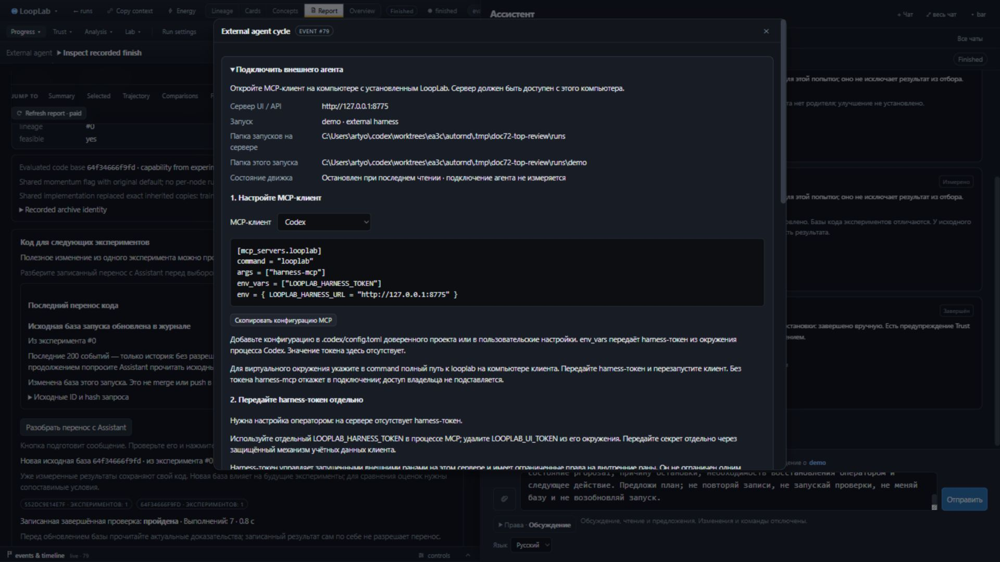

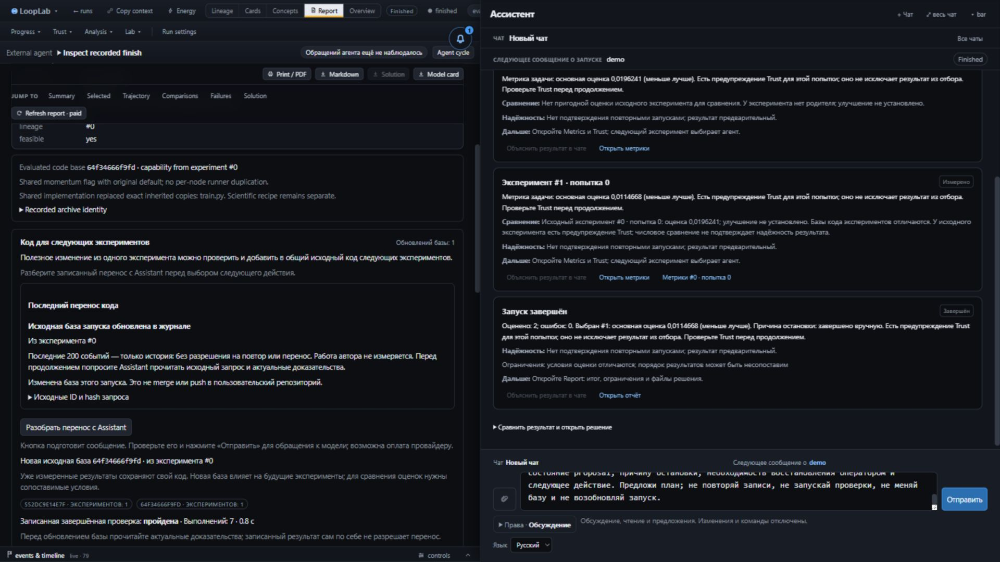

**Выводы по продукту.** Надёжность отдельных операций не снимает стоимость
сборки всего пути пользователем. Последняя карточка должна показывать записанное
состояние, а актуальную возможность продолжения получать с сервера. Нельзя
трактовать 200 событий как полную историю или превращать late finish в разрешение
после abandonment. Внешний агент остаётся ответственным за решения; UI готовит
контекст разговора и не добавляет ожидание команды или takeover.

**Существующая OPEN очередь после исправлений:**

1. **O3/O9/O11/O13 — цельный вход через Assistant.** Путь подключения теперь
   локализован; §20.40 добавляет RU/EN next-step и условия checkpoints из того
   же серверного решения. Полная панель требований/истории и схема владельцев
   получили RU/EN labels и защиту старого/повреждённого чтения в §20.41. Схема
   владельцев и весь onboarding ещё требуют упрощения. Приёмка: первый результат и восстановление на RU/EN, явные
   operator/client approvals, текущий blocker и расходы до действия.
2. **O2/O4/O8 — цельная worktree/recovery карточка.** Сводка latest proposal
   сделана; нужны полная paged history, request/check/advance recovery, diff,
   writer coordination и retention с доказанным восстановлением до cleanup.
3. **O5/O6 — понятный итог и воспроизводимая программа.** Связать terminal
   attempt с effective code, inputs, stages, environment и dependencies;
   неизвестные составляющие назвать явно. Saved edits не являются manifest.
4. **O6/O10/O14 — работа LoopLab над пользовательским repo.** Принимать
   совместимые capabilities A+B относительно реального target SHA, объяснять
   dirty/stale/conflict, выполнять target tests и отдельную явную доставку.
   Развитие git checkout самого Codex не является проверкой этой функции.
5. **O1 — размер production UI.** В исходной сборке было четыре нарушения
   bundle budgets. §20.42 снижает JS на 4719 B и CSS на 174 B: общая CSS,
   DAG CSS и review DAG JS теперь проходят прежние пределы. Осталось
   превышение total JS: 13317 B после §20.42, 13380 B после §20.43,
   12884 B после §20.46, 13121 B после §20.47, 13324 B после §20.48,
   13308 B после §20.49; 13734 B после §20.50; 13894 B после §20.51;
   9940 B после §20.53; 9964 B после §20.54;
   потолки не повышены. Нужны дальнейшее
   уменьшение исходного кода/повторов и полный CI. Один lazy import не снижает
   сумму всех assets; нельзя выдавать route budget за зелёный общий gate.

Проверки записаны в [validation.json](assets/72-recovery-ui/validation.json),
полные размеры и нарушения — в [bundles.json](assets/72-recovery-ui/bundles.json). Большие темы остаются
**OPEN**; исправлены конкретные обнаруженные пробелы восстановления.

## 20. Реализация OPEN: выполненные шаги

### 20.1 72.O12 — первый increment: честный бюджет в карточке запуска

Реализация начинается от `e325dcfbf`. `launchCostModel.js` читает только
проверенные effective settings; карточка использует ту же preflight-валидацию и
fingerprint, которые уже защищают Start. Добавлено поле **Run LLM budget (USD)**
в существующий JSON-backed набор настроек; остальные overrides сохраняются.

| Состояние | Что видит пользователь |
|---|---|
| План ещё не проверен или изменён | Нужна Validate для определения наследуемого лимита; старое число не показывается |
| Оба поля присутствуют и равны 0 | Денежный лимит модели в запуске не задан |
| Один/оба лимита положительны | Меньший положительный USD-лимит; маленькие дробные значения не округляются до нуля |
| Старый/неполный ответ или некорректные поля | Лимит недоступен; неизвестное не становится «без лимита» |
| Проверенный toy, включая external harness | Нет вызовов встроенного backend; расходы внешнего клиента, чата и compute остаются отдельно |
| Проверенный LLM | Возможны расходы провайдера; цены могут быть неизвестны, до завершения вызова возможен перерасход |

Новые копии переведены на русский. Бюджет действует на run LLM accounting;
UI не обещает счёт провайдера, лимит вычислений или управление бюджетом чужого
клиента. Операционные defaults, серверный budget contract и права не изменены.
Quickstart описывает поле и scope. Дефект «No monetary cap» при положительном
лимите устранён; старый source-pin, закреплявший эту ошибку для всех планов,
заменён проверками поведения.

**Проверено:** tighter budget/legacy cap, оба нуля, один ноль, одинаковые caps,
малый дробный USD, отсутствующие/некорректные поля и до-валидационное состояние.
Живой React mount проходит validate → inherited `$0.5` вместо draft `$2` → edit
`$0.25` → старый cap исчезает и Start блокируется → новая validate → RU/EN.
За весь сценарий отправлены только два бесплатных preflight POST, без Start.
Другой mount проверяет старый preview без одного из budget fields.
Реальный HTTP preflight сохраняет оба настроенных поля и ничего не запускает.

При проверке исправлены две fixture-проблемы в `test_launch_preflight.py`:
создание symlink без Windows privilege теперь использует существующий `_symlinks`
helper; для race-теста capability probe выполняется на test thread до ASGI worker.
Другие ошибки создания ссылок продолжают падать; production path guard не менялся.

**Свежие проверки:** replay-first — **193 passed**; launch/draft/guidance/cost,
Assistant mount/recovery/provenance и bundle contracts — **52 UI tests passed**;
preflight + run-budget — **59 passed, 4 skipped**. Два skip — недоступная Windows
symlink privilege, остальные — POSIX-only `O_NOFOLLOW` и `chown`.
Документационные contracts и merge guard — **30 passed**; strict MkDocs и
`git diff --check` прошли.

UI собран отдельно в staging directory. Bundle gate проходит с прежним target:
JS gzip **628 720 B** против **628 010 B** в приватной сборке исходного HEAD;
lazy route/reachability gates сохранены. Это измерение на текущей машине,
не подтверждение remote CI. Общий target имеет мало свободного места; следующие
UI additions требуют новой проверки размера, не автоматического роста ceiling.

Полная пользовательская приёмка O12 и остальные OPEN не закрыты этим increment.
Следующий рабочий шаг очереди B — O5: доступ к старым текущим итогам и commentary
внутри чата после 200 receipts, с обработкой смены evidence/generation.

### 20.2 72.O5: текущие итоги и интерпретации после 200 записей (2026-10-03)

**Сделано:** Assistant читает текущие result receipts страницами по 50, без
прежнего UI-потолка в 200 записей. «Раньше», «Новее» и «К последним итогам»
работают на выбранном языке. Старые записи на открытой странице развёрнуты;
чтение предыдущих страниц не запускает автопрокрутку чата к новым сообщениям.
В DOM и состоянии хранится одна текущая страница, отдельно — только trail cursors.
Чтение и навигация выполняют GET, без вызова модели, записи owner chat или команд.

Страница повторно читается каждые пять секунд. Поэтому смена evidence у записи,
которая не является cursor anchor, обновляет метрику и убирает прежнюю
интерпретацию. Если anchor изменился, UI скрывает записи, показывает причину
и предлагает явное возвращение к последним итогам. Смена run/generation
сбрасывает навигацию, отменяет запрос; поздний ответ не попадает в новый run.
Проверяются обязательный `next_cursor`, его scope, привязка к старейшему receipt
страницы, исключение входного anchor и согласованность latest total/has_more.
Неполный HTTP 200 и страница больше запрошенных 50 записей не становятся
«пустой историей» или текущим измерением; последняя успешная страница скрывается.

**Проверено:** живой React mount читает все 205 текущих записей с commentary,
пока сервер добавляет 206-ю; после перехода к последним новая запись видна.
Отдельно проверены изменение non-anchor evidence, cursor 409, явное восстановление,
смена generation с задержанным ответом, смена языка без потери страницы,
несогласованная пагинация и oversized HTTP 200. Серверные HTTP contracts
проверяют те же границы на настоящем read API, без обучения или внешних моделей.

**Свежие проверки:** replay-first — **193 passed**; result pages/model,
Assistant transcript/resource и bundle contracts — **46 UI tests passed**;
result-notice HTTP contracts — **15 passed**; documentation/merge contracts —
**30 passed**. Strict MkDocs, staging UI build, bundle gate и `git diff --check`
прошли. Это целевые проверки, не полный product regression и не пользовательская
приёмка в браузере.

Измеренный JS gzip вырос с **628 720 B** в сборке исходного HEAD до **629 289 B**
(**+569 B**). Общий target переизмерен до **615 KiB**, свободно **471 B**;
CSS и route/reachability ceilings сохранены. Initial shell — **83 029 B JS gzip**.
Измерения локальные; remote CI и доставка в master здесь не подтверждались.

Это current-evidence view: старые заменённые попытки и отозванные интерпретации
не превращаются в неизменяемый архив. Общий словарь, сравнимость и единый вывод
в списке/отчёте/чате остаются **OPEN O5**. Следующий шаг очереди B — согласовать
человеческий вывод рядом с primary score во всех трёх видах по приёмке §19.4.

### 20.3 72.O5: тип измерения, повторы и исключения Trust в отчёте (2026-10-03)

**Найдено и исправлено:** список подписывал `best_confirmed` просто как `best`,
а selected card отчёта называл отсутствие confirmation mean «single-seed» без
свидетельства о числе запусков. Теперь список, selected card, итог запуска
Assistant и result notices используют общий словарь **evaluation score /
confirmation mean** и одинаковую оговорку о повторах. Отчёт показывает исходную
evaluation score отдельно от среднего; отсутствующий разброс явно неизвестен.
В списке число повторов принимается только из result summary с корректной
идентичностью selected попытки, совпадающим mean и `confirmed=true`.
Отсутствующий, неверный или одноэлементный repeat count не подтверждает несколько
успешных повторов. Несколько повторов требуют проверки разброса и условий,
не сертификат обобщения или Trust. Колонка метрик списка ограничена 280 px,
чтобы оговорки переносились и оставляли место названию на desktop.

Русский текст Assistant больше не называет первый допустимый эксперимент
«пригодным для сравнения». Он может не быть baseline задачи; один результат
не устанавливает улучшение. Полнота детекторов явно не подтверждена.
RunList и Report сохраняют существующий английский язык этих видов;
Assistant/result notices используют выбранный RU/EN. Это не полная локализация UI.

**Ошибка логики:** verdict выбирал первый результат с `feasible !== false`,
игнорируя `breed_excluded`. Поэтому Trust-gated или неизвестно-допустимый узел
мог задавать baseline и ложный gain. Общий predicate внутри report analysis
теперь требует evaluated, active, finite robust metric, `feasible=true` и
отсутствие Trust gate исключения, как `counts_toward_best` сервера. Это правило
применяется к selected verdict, числовой frontier, operator/theme best и
importance population. Исключённый parent не поддерживает счётчик улучшений.
Число выполненных оценок по-прежнему включает такую оплаченную работу.
Аудитный Trust flag сам по себе не становится дополнительным запретом выбора.

**Проверки:** min/max с исключённым первым узлом и unknown feasibility;
исключённый selected не появляется в model card/Markdown как winner.
Проверены zero mean, неизвестный/неверный repeat count, несовпадающий summary,
отдельная основная оценка и неизвестный spread. Живой RunList mount показывает
score, подтверждённый mean и legacy mean без придуманного числа повторов;
Assistant mount сохраняет ссылки на точную попытку и RU-подписи. Report проверен
через реальный React render. Чтение/подготовка вопроса выполняют только GET.

**Свежие проверки:** replay-first — **193 passed**; trajectory/result-summary
серверные contracts — **10 passed**; UI, включая предыдущую пагинацию,
report/Trust/importance/directions, RunList resources и bundle contracts —
**85 passed**. Documentation/merge contracts — **30 passed**; strict MkDocs,
staging UI build, bundle gate и `git diff --check` прошли.
Новых обучений, model calls и проверки человеком в браузере здесь не было.

JS gzip — **629 716 B**, на **427 B** больше предыдущего HEAD; CSS gzip —
**59 598 B**, на **22 B** больше. Прежние ceilings сохранены: свободно **44 B**
JS и **50 B** CSS; initial shell — **83 044 B JS gzip**. Дубликаты текста
заменены общим helper, не повышением target. Remote CI/master не проверялись.

**O5 остаётся OPEN:** числовые rollups и направления ещё требуют отдельной
приёмки comparability, общий verdict нельзя подменить frontier gain; полная
проверка mixed base/retarget/repeats во всех видах и пользовательское объяснение
своими словами остаются по §19.4. Следующий шаг — исключить утверждения об
улучшении в сводных rollups при неподтверждённых условиях сравнения.

### 20.4 72.O5: покрытие сопоставимых сравнений в сводках (2026-10-03)

**Найдено и исправлено:** operator/theme rollups считали улучшение по смеси
confirmation mean и основной оценки родителя без проверки условий. Экспорт
называл направление с нулём улучшений «не окупившимся», даже когда сравнение
не установлено. Теперь сравнения используют только **evaluation scores**;
числовая frontier остаётся отдельной проекцией и подписывает тип измерения.
Наличие среднего повторов не меняет вывод о разнице основных оценок.

В **Report → Comparisons** добавлена таблица: выполнено оценок, сопоставлено
с родителем, улучшилась основная оценка, не сопоставлено, числовая frontier.
Первая оценка, недостающие данные и смена условий попадают в «Not compared»,
не в провалы. Markdown показывает те же счётчики и больше не заключает,
что направление провалилось по отсутствию улучшений. Регрессии обозначают
худшую основную оценку только при сопоставимых записанных условиях родителя.
Нулевой счётчик означает отсутствие **записанных** failures/comparable regressions,
не подтверждение успеха каждого эксперимента. Новая таблица, как остальной
Report, остаётся английской; полной локализации этих видов здесь нет.

Общий comparison helper требует известный min/max, текущие evaluated/feasible
узлы, конечные primary scores, совпадающие measured comparability keys,
отсутствие Trust gate исключения и оговорок objective source. Неполный event
source и retarget не поддерживают числовое улучшение. Если хотя бы одна сторона
имеет base receipt либо включён upstream, обе записанные базы должны быть
валидны и совпадать. Неизвестное, несколько родителей и переполнение разницы
не превращаются в положительный или отрицательный результат. Verdict выбранного
узла тоже проверяет базу; DAG delta использует тот же helper и не показывает
primary-score стрелку рядом с отображаемым confirmation mean.

**Интеграционная ошибка найдена до завершения:** `Node.parent_generations`
исключён из публичного JSON. Проверка этого внутреннего поля в UI дала бы
постоянно пустое покрытие, несмотря на успешные fixture-тесты. `/state` теперь
выдаёт компактный `parent_comparison` v1: id и записанную attempt единственного
родителя либо `null` для root/merge/неизвестной ссылки. Внутренняя карта остаётся
закрытой. UI проверяет ссылку против текущей attempt родителя; reset родителя
не перепривязывает ребёнка. HTTP, historical state и review используют одну
cached state projection, которую читает и SSE. Публичный DTO не является
разрешением действий или доказательством сопоставимости сам по себе.

`directionProfit` исправлен как совместимая экспортируемая проекция: разница
primary score отделена от лучшего robust значения, неизвестное направление
не становится min. У этой функции сейчас нет rendered consumer; подключение
нового интерфейса направлений этим increment не заявляется. Реальная сводка
concept axes в Markdown перестала выдавать отсутствие сравнений за провал.

**Проверено:** min/max, ложный выигрыш от среднего, primary-score improvement,
tie, неизвестные/изменённые keys, разные/недостающие базы, reset/неверная attempt,
merge, отсутствующий parent, Trust-исключения, failed/aborted parent, неизвестная
feasibility, retarget, incomplete source и переполнение. Report проверен через
реальный React render; дополнительных запросов, model calls и команд нет.
HTTP проверяет owner/review/historical чтение и reset на настоящем EventStore.
Python и UI используют один DTO fixture, чтобы несовпадение wire-полей не
скрывалось в независимых тестовых данных.

**Свежие проверки:** replay-first — **193 passed**; public parent/state cache/
withheld activity — **21 passed**; UI с result pagination, Trust, report,
directions, RunList и bundle contracts — **92 passed**; документационные/merge
contracts и state delta/SSE — **49 passed**. Strict MkDocs, staging UI build,
bundle gate и `git diff --check` прошли. Это целевые regressions, не полный
product suite, реальное ML-обучение или приёмка человеком в браузере.

В первой сборке общий helper создал static chunk cycle; включение его в
существующий `analysis-support` устранило цикл, без ослабления manifest gate.
JS gzip **629 716 → 630 264 B** (**+548 B**), review DAG **267 158 → 267 468 B**
(**+310 B**); CSS остался **59 598 B**, initial shell — **83 036 B JS gzip**.
Только два измеренных size targets обновлены: total **616 KiB** (запас 520 B),
review DAG **261.5 KiB** (запас 308 B). Остальные ceilings, owner exclusions,
lazy reachability и cycle checks сохранены. Remote CI и доставка в master
здесь не подтверждались.

**O5 остаётся OPEN:** проверка единого вывода во всех графиках/Overview,
полная mixed-base/retarget/repeat приёмка и объяснение результатов пользователем
по §19.4 ещё не завершены. Следующий шаг — проверить подписи и числовую
траекторию реальных rendered views по тем же границам сравнения.

### 20.5 72.O5: числовые графики и общий вывод Overview/Report (2026-10-03)

**Найдено и исправлено:** оговорка Report не меняла смысл самого waterfall:
он называл каждое движение frontier «improved/regressed», рисовал зелёные/красные
полосы и подписывал первую оценку baseline. Trajectory разрешал неизвестную
feasibility задавать best, игнорировал Trust gate исключение и принимал
оставшуюся метрику pending/failed узла. Overview тоже показывал любой
`best_node_id` как «Best metric», без eligibility и общего вывода Report.

Waterfall теперь называется **Numeric frontier changes** (для одной оценки —
**First eligible value**). Синие полосы и ↑/↓ обозначают только знак числового
изменения; «Later changes» меняет масштаб без вердикта об улучшении. Общая
оговорка явно отделяет numeric frontier от сопоставимого улучшения. Каждая
ступень Report, tooltip, View data и CSV указывает evaluation score либо
confirmation mean. Markdown сохраняет этот тип в отдельной колонке; первая
оценка называется first eligible, а не baseline задачи. Неизвестный тип
переданной legacy ступени не выдумывается. CSV waterfall теперь выгружается
как `numeric-frontier.csv`.

Trajectory показывает конечные recorded значения только evaluated/active
узлов. Infeasible, неизвестно-допустимые и Trust-исключённые оценки остаются
точками с оговоркой и отдельным selection status в таблице, но не двигают
numeric frontier. Tombstone/abort и оставшаяся метрика pending/failed узла
не попадают в текущую траекторию. Confirmation mean без основной оценки
остаётся отображаемым recorded mean. При неизвестном направлении нет frontier
или автоматически выбранного max. Выбор ближайшей точки, log/detail scales,
таблицы для клавиатуры и ограничение числа визуальных ступеней сохранены.
Даже линия допустимых результатов не доказывает сопоставимость или значимость.

Общий eligibility helper используется Report и Trajectory. Overview теперь
показывает **Selected result** из того же deterministic verdict, его тип
измерения, оговорки и следующий шаг. Непригодный selected не подменяется другим
числовым лидером. Счётчики относятся к текущим active узлам. **Read Report**
меняет workspace view и закрывает Overview одним route update; это не
неподдерживаемая overlay-панель с именем report. Discuss in Assistant сохранён.
UI не отправляет запрос модели или команду при интерпретации или навигации.
Эти виды остаются английскими; полная локализация не заявляется.

Колонки measurement/numeric change получили место в desktop таблице Report;
неиспользуемые стили «improved/regressed» удалены. Print-правила и существующая
horizontal overflow оболочка сохранены.

**Проверено:** живые React mounts min/max, неизвестное направление, mean/score,
неизвестная feasibility, Trust gate, pending/failed, tombstone/abort и нечисловые
значения. Матрица смешанных means/bases, retarget и неизвестных conditions
проходит через реальный Report render, waterfall mount, таблицу и скачивание
CSV с проверкой Blob. Overview при обновлении evidence сохраняет точный вывод
Report, включая отсутствие eligible selected и incomplete source. Полный
RunView mount проверяет переход Overview → Report и отсутствие POST. Dense
charts, двухмасштабный waterfall, keyboard data и ближайшая точка проходят
существующие interaction tests. Accessibility contracts также проходят;
jsdom не подтверждает реальный размер/контраст на мониторе.

**Свежие проверки:** replay-first — **193 passed**, UI — **130 passed**;
documentation/merge contracts — **30 passed**. Strict MkDocs, отдельная staging
сборка, bundle gate и `git diff --check` прошли. Это целевые проверки;
полный suite, живое ML-обучение, приёмка человеком и remote CI не запускались.

JS gzip **630 264 → 630 589 B** (**+325 B**), CSS **59 598 → 59 578 B**
(**−20 B**); initial shell — **83 044 B JS gzip**. Total ceiling **616 KiB**
сохранён (195 B свободно), CSS ceiling сохранён (70 B свободно). Review DAG
вырос **267 468 → 268 210 B** из-за общего helper/подписей; только его size
target переизмерен до **262.25 KiB** (334 B свободно). Остальные route ceilings,
owner exclusions, cycle checks и lazy reachability gates сохранены.
Доставка в master этим increment не выполнялась.

**O5 остаётся OPEN:** единый вывод в каждой result surface, полный сценарий
mixed-base/retarget/repeats и пользовательское объяснение своими словами по
§19.4 ещё требуют приёмки. Следующий шаг — сверить Experiment result в Inspector
с общим comparison helper, особенно после reset родителя и смены записанной базы.

### 20.6 72.O5: Inspector сравнивает текущие подтверждённые пары (2026-10-03)

**Найдено и исправлено:** Experiment result называл условия сравнения совпавшими
по comparability keys, не проверяя записанную attempt родителя, code base,
feasibility, Trust gate, incomplete source и известное направление. После reset
родителя он мог объявить новую оценку родителя подходящей для старого ребёнка.
Отдельная ветка отображала «Selected by the engine» даже для исключённого или
неизвестно-допустимого узла. Некорректный seed count мог стать текстом об успешных
повторах.

Inspector теперь использует общие `parentScoreDifference`/`scoreDifference` и
eligibility, как Report. Положительный вывод требует единственного записанного
родителя, его точной текущей attempt, подходящих базы/условий, текущих допустимых
узлов и основной конечной оценки. Текст объясняет better/worse/tie по **primary
score**; confirmation mean в эту разницу не подставляется. Для нескольких
родителей единственная baseline не выдумывается. Parent list явно показывает
**current evaluation scores**, которые сами по себе не поддерживают сравнение.
Устаревшая/неизвестная attempt, разные условия, retarget, неполный event source
и другие недостающие доказательства получают объяснение вместо «matching».

Детали могут отставать от state или опережать его. Отдельный Experiment result
не заимствует текущую ссылку родителя для отсутствующего detail receipt;
разные id/attempt/status/primary score/parent list не поддерживают selection
badge или сравнение. Для comparison нужны согласованные доказательства detail
и current state. В реальном Inspector, если attempt/status совпадают, результат
и соседняя Base revision берутся **целиком** из текущего state. Так обновляются
primary score, confirmation, provenance и база, пока terminal detail остаётся
закэшированным; полей разных попыток не склеиваем и новый detail polling не
добавляем. Если detail относится к другой lifecycle/status, его измерение
не превращается в доказанное сравнение с текущим state.

Trust-исключение явно подписано, неизвестная feasibility не получает winner
badge. Confirmation mean отделён от evaluation score и использует общий словарь
повторов; ноль, один, строка, дробный/отрицательный/неизвестный count не
подтверждают несколько успешных повторов. Неизвестные parent references не
становятся утверждением об отсутствии родителей. Metrics/Trust navigation
сохранена, команды и вызовы модели не добавлены. Вид остаётся английским.

**Wire integration:** owner и historical `/nodes/{nid}` теперь возвращают тот же
bounded `parent_comparison` v1, что `/state`; building — `null`. Evidence-scoped
review detail получает этот DTO после прежней проверки capability. Internal
`parent_generations` остаётся закрытым, summary-only review по-прежнему получает
403 на detail. HTTP historical read требует generation token; тест использует
существующий fence, не обходит его. Reset не освежает старую parent reference.

**Проверено:** min/max, primary tie, misleading mean, same/different/missing base,
reset и неверная версия/отсутствие ссылки, multi-parent, неизвестное направление,
retarget, incomplete source, failed/aborted/непригодный parent и Trust exclusions
обеих сторон. Live Inspector mount загружает detail один раз, затем parent reset
убирает сравнение, а state updates меняют score/mean/base и Trust badge без
дополнительного detail request. Все запросы GET. Owner/historical/review HTTP
проверяют общий DTO и неизменность reference после reset, включая сохранение
summary-only отказа. Python/UI используют общий fixture поля.

**Свежие проверки:** replay-first — **193 passed**; public parent и review security
contracts — **27 passed**; Inspector/resource/trace, Report, graph/result/chat
regressions, accessibility и bundle contracts — **174 UI tests passed**;
documentation/merge contracts — **30 passed**. Strict MkDocs, staging build,
bundle gate и `git diff --check` прошли. Полный product suite, живое обучение,
проверка человеком в браузере и remote CI не заявляются.

JS gzip **630 589 → 630 953 B** (**+364 B**); CSS **59 578 B** без изменения.
Initial shell — **83 045 B JS gzip**, review DAG — **268 219 B** (+9 B).
Только total JS size target переизмерен до **616.5 KiB** (запас 343 B);
route/reachability/cycle gates и CSS ceiling сохранены. Изменения локальные,
merge/push в master этим increment не выполнялся.

**O5 остаётся OPEN:** в `serve/result_notices.py` parent comparability пока строится
по input keys без отдельной проверки base и eligibility родителя. Chat model
смотрит constraints/Trust ребёнка; это не доказательство пригодности родителя.
Следующий шаг — проверить и согласовать node completion briefs с этими границами,
включая retarget и несколько родителей, из которых доступен лишь один. Полная
mixed-base/retarget/repeat приёмка и объяснение пользователем своими словами
по §19.4 также не завершены.

### 20.7 72.O5: чатовые итоги проверяют родителя и базу (2026-10-03)

**Найдено:** node result notice проверял input comparability и ограничения
ребёнка, но мог назвать улучшением результат относительно непригодного родителя,
другой/неизвестной базы или переназначенной цели. Из bounded списка `parents`
пропадали reset/недоступные родители; слияние с одним оставшимся родителем
выглядело как обычный single-parent эксперимент.

**Сделано:** каждый node receipt получает `score_comparison` v1 с реальным
`parent_count` и явным `status`. `same` требует одного записанного родителя той
же попытки, пригодных primary scores обеих сторон, matching evaluation keys,
общей eligibility через `counts_toward_best`, отсутствия salvage и retarget.
При upstream или наличии base stamp требуется полный receipt общей базы,
привязанный к node/attempt. Reader использует `seed_archive_digest` и проверяет
дополнительные lifecycle/complete поля; текущий checkout не подставляется вместо
исторической базы, архивы при каждом чтении не переоцениваются. Legacy пара без
base stamps допустима только при подтверждённых evaluation keys и выключенном
upstream. Неизвестные ключи остаются `unknown`, переполнение разницы не даёт
положительного вывода. Это числовое сравнение, не статистическое доказательство.

**Chat и MCP:** UI разрешает better/tie/worse только по явному single-parent
`same`; mean остаётся отдельно подписанным. RU/EN объясняют разные/неизвестные
базы, retarget и непригодность обеих сторон. Даже один доступный parent у
multi-parent узла не становится baseline. Typed MCP и UI отказывают при
отсутствии/повреждении нового comparison DTO, неверной arity, неизвестной версии
или противоречащем `same`. HTTP 200 с неполными данными остаётся unavailable;
нужно обновить старый сервер и явно перечитать страницу. Envelope остаётся v1,
прочие новые поля сохраняются. Команды, модельные вызовы и engine waits не добавлены.

**Свежесть:** DTO входит в evidence token. Изменение пригодности родителя
withdraws старую commentary и cursor при неизменном score ребёнка. Точный retry
сохранённого body/action ID возвращает прежнюю квитанцию, не оживляет старую
интерпретацию. Новый action ID со старым token получает конфликт.

**Проверено:** реальные HTTP reads из folded test events и тот же payload через
typed MCP; same/different/missing/partial базы, lifecycle mismatch, boolean и
небезопасные целые в receipt, upstream без stamp, ограничения и Trust exclusions
обеих сторон, salvage, отсутствие primary metric, retarget с реально доступной
declared extra metric, reset/abort родителя, частично доступное слияние.
RU/EN Assistant mount показывает причины без положительных утверждений и делает
только GET. Paging/reconnect, exact retry и старые result/resource views проверены.

**Свежие проверки:** replay-first — **193 passed**; result notice, typed MCP,
parent/base/comparability contracts — **191 passed, 3 skipped**; chat, language,
Inspector, Report/Overview, graphs, accessibility и bundle contracts — **99 UI
tests passed**; documentation/entry-point/API/merge contracts — **37 passed**.
Strict MkDocs, staging build, bundle gate и `git diff --check` прошли. Полный
product suite, живое обучение, human browser review и remote CI не заявляются.

JS gzip **630 953 → 631 337 B** (**+384 B**), CSS **59 578 B** без изменения.
Initial shell — **83 045 B JS gzip**, review DAG — **268 211 B**. Только total JS
target переизмерен до **616.75 KiB**, запас **215 B**; route, reachability, cycle
и CSS ceilings сохранены. Master merge/push в этом increment не выполняется.

**O5 остаётся OPEN:** общий пользовательский сценарий mixed-base/retarget/repeat
и объяснение результата человеком по §19.4 ещё не приняты. Следующий шаг —
проверить result surfaces как один сценарий и отделить оставшиеся несогласованные
подписи/выводы от уже подтверждённых сравнений. Публикация в master и полный
scope других OPEN тем остаются отдельными шагами.

### 20.8 72.O5: Trust-сигнал относится к попытке, не ко всем будущим результатам (2026-10-03)

**Найдено:** Report проверял reward-hack записи по node ID без generation.
После reset сигнал старой попытки делал новый выбранный результат suspect,
хотя engine и run completion receipt относили его к предыдущей попытке.
График, Overview и workspace badge тоже читали всю историю как текущие флаги;
повторные записи одного узла увеличивали число «подозрительных результатов».
В Trust строка старого сигнала позволяла карантинировать текущую попытку.
Отдельно отсутствие сигналов вместе с включённой сейчас настройкой детектора
выдавало утверждение, что все evaluations уже проверены; такого свидетельства
в этих данных нет.

**Сделано:** общий `nodeProjection.currentRewardHacks` связывает запись с
generation активного узла, используя прежний `nodeIsActive` для aborted/tombstone.
Report/verdict, Overview, график и live header используют эту проекцию;
`rewardHackNodeCount` считает разные узлы, а не записи журнала. Смена попытки
убирает старый сигнал из текущего вывода; новый сигнал на новой попытке снова
показывается. Legacy запись без generation применима только к attempt zero,
не подставляется к новому attempt после reset. Неизвестная/некорректная попытка
не разрешает текущее действие. Это display/read правило: engine trust gate,
отбор победителя, измеренные оценки и команды не переписаны.

**История и действия:** Trust сохраняет все строки и показывает отдельные
колонки attempt/scope. Historical/unavailable запись не может карантинировать
замещающую попытку; read-only по-прежнему не показывает mutation controls.
Переход из строки явно открывает текущий experiment, а не обещает код/логи
старой попытки. Текущий quarantine использует прежний `CONTROL.nodeAbort`
с generation fence записи; legacy warning без явного lifecycle не даёт
quarantine. Дополнительного выполнения или ожидания не добавлено.
Отсутствие текущих сигналов — unknown coverage, не completed detector pass.
Включённая настройка не превращает прошлые evaluations в проверенные.

**Проверено как связанный сценарий:** общий JSON fixture для Python/UI задаёт
старую попытку, reset, новую evaluation/confirmation, свежий сигнал и повторную
запись сигнала. Python сверяет fixture с реальным `/state` из folded synthetic
events и finalized result notice: старый сигнал остаётся в ledger, выбранная
попытка/score/mean точны, `trust_flagged` caveat зависит от текущего hard signal.
UI сравнивает headline и Trust status в Report, Overview, chart и обоих exports;
separately labelled score и mean не меняют семантику. Live SSE delta убирает
старый alarm после reset и считает два новых сигнала как один узел. Trust mount
сохраняет историю, блокирует старую кнопку и не отправляет POST при её нажатии.
При reset во время lifecycle-запроса quarantine сохраняет generation исходного
сигнала; сервер отказывает устаревшему действию, новая попытка не подставляется.
Missing node, aborted/tombstone, malformed generations, legacy и read-only
проверены отдельно. Читать состояние/результаты и открывать таблицу бесплатно;
модельных запросов эти действия не добавляют.

**Свежие проверки:** replay-first — **193 passed**; result/MCP, lifecycle,
champion caveats и trust-gate contracts — **150 passed**; UI result/language,
Report/Overview, chart, Inspector, live resources, accessibility и command
regressions — **170 passed** (`--test-concurrency=4`). Первый массово параллельный
UI прогон получил **168/169**: существующая проверка retry 5xx с deadline 100 ms
вернула accepted под нагрузкой. Она прошла **59/59** в isolated command suite,
затем весь выбранный набор прошёл с четырьмя worker processes. Production
timeouts и semantics не менялись, тестовые assertions не ослаблены. Полный
product suite, живое ML обучение и пользовательская browser приёмка не заявляются.

Первый staging build обнаружил лишний static import всей analysis группы в
Concepts через RunView. Чистые lifecycle readers перенесены в уже загружаемый
shared-support; финальный Concepts route — **257 907 B JS gzip**. JS gzip total
**631 337 → 631 618 B** (**+281 B**), CSS **59 578 B** без изменения; initial shell
**83 044 B**, review DAG **268 378 B**. Только total JS target переизмерен до
**617 KiB**, запас **190 B**. Route, reachability, cycle и CSS gates сохранены.
Staging build и bundle gate прошли; документационные/API/merge contracts —
**37 passed**, strict MkDocs и diff check прошли. Изменения сохранены локально.

**O5 остаётся OPEN:** общий mixed-base/retarget/repeat маршрут и объяснение
результата человеком по §19.4 не приняты. Следующий проход должен проверить
передачу advisory Trust-сигналов в node chat briefs: gate exclusions и audit
caveats имеют разный смысл и не должны смешиваться. Полный scope других OPEN
тем и доставка изменений в master остаются отдельными шагами.

### 20.9 72.O5: advisory Trust сопровождает чатовый итог и сравнение (2026-10-03)

**Найдено:** node completion receipt отдавал только `trust_flagged` — исключение
из отбора, а не все записанные сигналы. При `trust_gate=audit` чат показывал
числовое улучшение без предупреждения даже при текущем hard signal. Мягкие
сигналы при gate/block тоже терялись. Сигнал у родителя не сопровождал сравнение
чистого нового узла. Изменение advisory evidence не снимало старую интерпретацию,
если измеренные числа и eligibility не менялись.

**Сделано:** node receipts требуют отдельные booleans `trust_advisory` и
`parent_trust_advisory`; прежний `trust_flagged` сохраняет значение исключения
по политике Trust. Сервер выводит advisory из named signals текущих активных
попыток, отдельно от enforced exclusions. Старые, aborted/tombstone и пустые
сигналы не становятся предупреждением замещающей попытки. Родительское
предупреждение относится только к возвращённым comparison parents, без
подстановки reset-родителя. Signals не меняют score, confirmation или политику
отбора; `score_comparison=same` по-прежнему разрешает числовое сравнение.

В Assistant chat на RU/EN предупреждение своей попытки сопровождает измерение,
предупреждение родителя — сравнение. Формулировки отделяют advisory от исключения
из отбора; numeric gain и repeat seeds не снимают warning. Данные предупреждений
и текущий Trust mode входят в evidence token, в том числе изменение деталей
и audit version/code digest при прежних booleans. Такая смена снимает актуальность attached commentary и
cursor; exact retry подтверждает первоначальную публикацию и не освежает её.
MCP и UI отказывают missing/nonboolean/contradictory fields как unavailable;
отсутствие поля не становится чистым результатом. Guide описывает поля и
необходимость обновить старый сервер. Новых endpoints, polling, paid calls,
engine waits или mutation controls не добавлено.

**Проверено:** общий JSON fixture связывает real folded HTTP receipts, typed MCP
и UI: audit/gate/block, hard/soft, child/parent, reset и blank signal. Числа
evaluation/confirmation сохраняются отдельно. Дополнительные HTTP проверки
подтверждают отзыв commentary/cursor при новой advisory записи и новых деталях
того же сигнала, отказ fresh publication по старому token и точный retry.
Замена синтетического event source при том же числе записей, тексте предупреждения
и оценке подтверждает, что смена audit identity тоже снимает старую интерпретацию.
Mounted Assistant chat на обоих языках показывает эти предупреждения,
подготавливает вопрос без отправки и делает только GET.

Replay-first — **193 passed**; result/MCP, lifecycle, champion caveats и trust
contracts — **176 passed**; выбранные UI result/language, Report/Overview,
Inspector, live state, accessibility и command regressions — **173 passed**
(`--test-concurrency=4`). Staging build и bundle gate прошли. JS gzip total
**631 618 → 631 993 B** (**+375 B**); CSS **59 578 B** без изменения, initial shell
**83 037 B**, review DAG **268 389 B**, Concepts **257 927 B**. Total JS target
переизмерен до **617.5 KiB** с запасом **327 B**; route, CSS, reachability и cycle
ceilings сохранены. Документационные/API/merge и layer contracts — **96 passed**;
strict MkDocs и diff check прошли. Изменения сохраняются локальным коммитом.

**O5 остаётся OPEN:** mixed-base/retarget/repeat пользовательский маршрут и
объяснение результата человеком по §19.4 ещё не приняты. Run-wide caveats
сохраняют прежний contract: hard advisory у выбранного результата не означает
все мягкие предупреждения всего run. Следующий review должен проверить эту
границу в итоговой истории пользователя. Полный product suite, живое ML обучение,
browser приёмка и доставка в master этим проходом не заявляются.

### 20.10 72.O5: предупреждение выбранной попытки сохраняется в итоге run (2026-10-03)

**Найдено:** после §20.9 node brief показывал soft advisory, но finalized run
brief и Assistant Run result card его теряли: они читали только hard champion
caveats. Успешная confirmation могла визуально соседствовать с итогом без этого
предупреждения. Typed MCP проверял `kind/status` run receipt, но не его selected
identity, caveats и обязательные сведения об итоговом предупреждении.

**Сделано:** finalized run receipt требует `trust_advisory` выбранной попытки.
`run_result_summary` добавляет такое же поле к measured first/selected values
в cached `/api/runs` projection. Чистая общая функция `current_trust_signals`
перенесена из result notices в модуль result summary; оба читателя используют
одно правило current generation, active node и nonempty named signal. Отбор
не переписан: soft signal остаётся advisory при audit/gate/block, а прежний
`caveats=trust_flagged` сохраняет high-precision meaning. Сигнал другого узла
или старой попытки не приклеивается к выбранной. Без выбранного результата
receipt несёт null identity/attempt/measurement и false advisory.

Оба вида результата в Assistant используют общий RU/EN текст предупреждения
из `resultNoticeModel`, который уже используется node brief. Evaluation score
и confirmation mean остаются разными числами. Карточка не требует detail read,
а подготовка вопроса не отправляет его и не запускает работу. Старые summary
rows без нового metadata сохраняют existing unknown-coverage notice; отсутствие
поля не выдается за проведённый Trust pass. Typed run pages строже: отсутствующие,
неверно типизированные и contradictory selected/caveat/advisory fields дают
unavailable; неполный HTTP 200 не становится чистым завершённым результатом.

**Проверено как связанный сценарий:** тот же JSON fixture расширен ожидаемым
selected result для audit/gate/block, hard/soft, child/parent, reset и blank signal.
Реальные synthetic event folds проверяются через HTTP `/result-notices` и
`/api/runs`, затем через typed MCP: выбранные ID/attempt, score/mean, warning
и прежние hard caveats совпадают. Отдельно проверены no winner после abort,
отзыв run commentary и cursor после новой advisory записи, отказ fresh publication
по старому token и exact retry первоначального body. Mounted chat feed и Run
result card на RU/EN показывают одно предупреждение и снимают его при замене
результата; чтение делает только GET, кнопки готовят вопросы без запуска.

Replay-first — **193 passed**; result/MCP, lifecycle, champion caveats, trust gate
и trajectory contracts — **218 passed**; выбранные UI result/language,
Report/Overview, Inspector, live state, accessibility и command regressions —
**176 passed** (`--test-concurrency=4`). Staging build и bundle gate прошли с
прежними ceilings: JS gzip total **631 993 → 631 981 B** (**−12 B**) после общего
RU/EN reader text; CSS **59 578 B** без изменения, initial shell **83 045 B**,
review DAG **268 376 B**, Concepts **257 910 B**. Total JS target **617.5 KiB**
не повышен, запас **339 B**; route/CSS/reachability/cycle gates не изменены.
Документационные/API/merge и layer contracts — **96 passed**;
strict MkDocs и diff check прошли. Изменения сохраняются локальным коммитом.

**O5 остаётся OPEN:** mixed-base/retarget/repeat пользовательский маршрут и
объяснение результата человеком по §19.4 ещё не приняты. Завершённый run brief
описывает выбранную попытку, а не все предупреждения в истории или полноту
проверок. Следующий review должен проверять это различие вместе с причинами
несопоставимости результатов. Полный product suite, живое ML обучение, browser
приёмка и доставка в master этим проходом не заявляются.

### 20.11 72.O5: основная оценка не скрывается за средним повторов (2026-10-03)

**Найдено:** Assistant Run result card подписывала confirmation mean корректно,
но её value-only receipt скрывал evaluation score и recorded spread. При среднем
лучше первого результата и primary score хуже родителя нельзя было увидеть
расхождение без перехода в Report. Node/run completion briefs тоже отправляли
пользователя проверять разброс, не показывая записанный std. Проверка общего
comparison wording не выявила необоснованного improvement claim: карточка уже
просит проверить условия в Report. Исправляется конкретная потеря чисел.

**Сделано:** cached `run_result_summary` сохраняет `score` и `confirmed_std`
отдельно от displayed `value`. Card показывает primary score под confirmation
mean для первого и выбранного результата, а для выбранного — recorded spread.
Node/run receipts также несут nullable `confirmed_std`; общий RU/EN
`resultSpreadText` даёт одну подпись в карточке и completion briefs. Zero spread
отображается как 0; missing/nonfinite/negative/string/boolean не становятся
нулём. Legacy summary без metadata явно показывает missing score/spread,
сохраняя измеренное displayed value и прежнюю unknown-coverage оговорку.

Typed MCP/UI completion pages требуют явное поле std, finite nonnegative scalar
или null и связь с confirmation mean. Missing/inconsistent HTTP 200 даёт
unavailable. Failed/aborted не могут нести completed confirmation spread. Нет
нового способа mint confirmation: прежний fold по-прежнему атомарно отказывает
partial/stale certificates. Scores, selection, comparison gates, Trust,
checkpoints, команды и частота чтения не меняются. Std не называется confidence
interval, повторные проверки не становятся доказанной статистической значимостью.

**Проверено как связанный сценарий:** общий JSON fixture связан с реальными
synthetic event folds, HTTP `/api/runs` и `/result-notices`, typed MCP и mounted
RU/EN card/chat. Сценарии: mean лучше, primary score хуже; std=0; один repeat;
partial certificate; stale confirmation после reset; разные copied code bases;
retargeted objective. Score/mean/std/attempt согласованы, выбранный узел остаётся
engine winner. Numeric comparison использует primary scores; разные базы и
retarget не превращаются в улучшение, mean не заменяет score. Legacy UI inputs
проверены отдельно: bool/string/missing/nonfinite metadata не печатает ложные
score или zero spread; чтение не вызывает модель или detail fetch.

Replay-first — **193 passed**; result/MCP, lifecycle, champion caveats, Trust и
trajectory contracts — **239 passed**; выбранные UI result/language,
Report/Overview, Inspector, live state, accessibility и command regressions —
**180 passed** (`--test-concurrency=4`). Первые четыре negative-wire теста
упёрлись в strict JSON encoder самого test transport, до reader; транспорт
исправлен на raw response bytes, assertions не ослаблены, MCP suite — **138 passed**.
Staging build и bundle gate прошли. Первый build был выше total target на 20 B;
устранены два лишних type checks перед `Number.isFinite`, который не делает
coercion. Invalid-type проверки сохранены и прошли. Финальный JS gzip total
**631 981 → 632 283 B** (**+302 B**), CSS **59 578 B** без изменения; initial shell
**83 038 B**, review DAG **268 490 B**, Concepts **257 902 B**. Прежний total
target **617.5 KiB**, запас **37 B**; route/CSS/reachability/cycle ceilings
не повышены. Документационные/API/merge и layer contracts — **96 passed**;
strict MkDocs и `git diff --check` прошли перед локальным коммитом.

**O5 остаётся OPEN:** mixed-base/retarget/repeat пользовательский маршрут и
объяснение результата человеком по §19.4 ещё не приняты. Этот fixture доказывает
связность измеренных чисел и отказов сравнения, а не человеческую понятность
всего маршрута. Следующий review должен проверять причины отказа сравнения и
доступность исходных измерений в общей истории пользователя. Полный product
suite, живое ML обучение, browser приёмка и доставка в master не заявляются.

### 20.12 72.O5: причины отказа сравнения и исходные попытки в чате (2026-10-03)

**Найдено:** completion brief терял `ineligible` reason, когда у записанного
родителя отсутствовала метрика: общий fallback сообщал только, что нет пригодной
оценки. Root и недоступная попытка родителя также имели одинаковую подпись.
Число родителя показывалось без attempt и прямой ссылки на исходные измерения.
Отдельная функция prose comparison могла объявить gain для self-parent input,
хотя валидаторы страниц UI/MCP уже отвергали self/duplicate parents. Это дефект
защиты formatter, а не доказанный обход проверки HTTP страницы.

**Сделано:** RU/EN completion brief явно отличает root и недоступную записанную
попытку, сохраняет причину `ineligible` при отсутствующей метрике. Сравнение с
доступным единственным родителем подписывает его attempt. В Assistant доступны
Metrics ссылки на записанные parent IDs/attempts с generation запуска, включая
каждого доступного родителя merge. Они не создают общий baseline merge.
Сброшенная, failed или aborted попытка не получает ссылку на новый результат:
используется прежний server receipt, который уже фильтровал эти случаи.
Parent shape/identity checks перенесены в общий `validComparison`: и page
validation, и prose guard отвергают self/duplicate references. API, DTO,
engine selection и события не изменены; чтение делает только GET, ссылки
навигационные, вопрос готовится без запуска эксперимента.

**Проверено:** общий `parent_result_cases_v1.json` проходит реальные synthetic
event folds → HTTP `/result-notices` → typed MCP и mounted RU/EN Assistant.
Десять случаев: root, сравнимый родитель, отсутствующая метрика, failed parent,
reset с новым score, abort, разные code bases, разные evaluation conditions,
merge и merge с reset одного родителя. Проверяются первичные числа, сравнение,
точные IDs/attempts/generation вкладки Metrics, callback открытия и подготовка
вопроса без POST. Отдельно проверены self/duplicate input; при refresh после
reset прежняя parent link снимается, invalid page убирает весь устаревший brief,
explicit Retry восстанавливает только current evidence.

Replay-first — **193 passed**; result comparison/receipt/paging/repeat и MCP —
**197 passed**; UI result/language/Trust/lifecycle, route, Report/Overview,
Inspector, accessibility, resource/command и bundle regressions — **157 passed**
(`--test-concurrency=4`). Staging build прошёл. Первый bundle gate выявил только
total JS excess **266 B**; весь JS gzip **632 283 → 632 586 B** (**+303 B**),
CSS **59 578 B** без изменения. Числа купили ссылки на исходные попытки и
различимые причины отказа; shared guard убрал дублирование parent validation.
Общий target перемерен с **617.5 → 618 KiB**, запас **246 B**. Initial shell
**83 043 B**, review DAG **268 501 B**, Concepts **257 912 B**; все прежние route,
CSS, reachability и cycle ceilings сохранены. Повторный bundle gate прошёл.
Документационные/API/merge и layer contracts — **96 passed**; strict MkDocs
и `git diff --check` прошли перед локальным коммитом.

**O5 остаётся OPEN:** автоматические сценарии подтверждают связь текста и
исходных попыток, но не заменяют пользовательскую приёмку всего маршрута по
§19.4. Следующий review — переход из чата в Metrics/Report с объяснением причины
несопоставимости и сохранением контекста после возврата. Полный product suite,
живое ML обучение, browser приёмка и доставка в master не заявляются.

### 20.13 72.O5: Metrics читает текущий результат и сохраняет attempt ссылки (2026-10-03)

**Найдено:** Overview уже выбирал обновлённый целый result record из run state,
но Metrics продолжал читать cached terminal detail. Новые confirmation mean/std,
primary score после retarget и source могли расходиться с чатовым receipt.
Таблица ★ печатала mean вместо primary score без measurement label; per-seed
таблица могла остаться от предыдущего confirmation результата.

При проверке ссылки выявлен отдельный race: RunView проверял attempt по state,
но Inspector разрешал более свежую detail attempt (`>=`), нужную для обычного
live repair. Если state ещё на attempt 0, exact link на 0 открывал detail 1.
Запрошенная identity проверялась только в одном из двух чтений.

**Сделано:** pure `resultEvidence` выбирает целую запись той же id/attempt/status
для Overview и Metrics, не смешивая поля разных попыток. Metrics показывает
существующие ExperimentResult и BaseRevision: primary score, confirmation
mean/std и границы сравнения доступны сразу после перехода из чата. Обе ★ cells
подписывают свой measurement type отдельно, включая champion с другим типом.
Per-seed values берутся из текущего run store либо matching detail result;
устаревшие detail values не дополняют новый aggregate. Нечисловые seed metrics
и нецелые seed IDs не попадают в таблицу.

RunView передаёт `routeState.nodeGeneration` как `expectedAttempt`. Detail scope
учитывает exact/live target, а validator требует exact attempt при наличии
ссылки. Unpinned selection сохраняет приём более свежей detail attempt; historical
reads сохраняют свой exact rule. Новых запросов, таймеров, команд или server/API
изменений нет. Metrics не получает новый polling loop ради terminal confirmation.

**Проверено:** mounted Inspector с одним cached detail read принимает новые
confirmation aggregates и recorded seed values из state; stale seeds скрываются.
Затем retarget меняет score/source и снимает старую confirmation таблицу без
повторного detail GET. Pure tests проверяют whole-record selection при другой
attempt/status/id, legacy missing attempt и запрет seeds нового lifecycle для
старого. Mounted exact/unpinned переключение отвергает detail 1 для target 0 и
затем принимает 1 в unpinned режиме, не утверждая engine selection на старом
state. Реальный mounted RunView по `gen/node/attempt/tab=metrics` передаёт fence:
newer detail не открывается. Все наблюдаемые запросы — GET.

Replay-first — **193 passed**; Python HTTP/MCP parent/repeat fixtures, trajectory,
confirm integration и CV confirmation — **50 passed**. Широкий UI прогон из
289 проверок дал **288 passed**, один test expectation требовал прежний голый
`0.45`. После добавления подписи `evaluation score` обновлён точный ожидаемый
текст; source-caveat assertion не ослаблен. Повторный metric-retarget suite —
**13 passed**. В прогоне проверены Inspector detail/activity/node switching,
result/Trust/language, Metrics sources, Report/Overview, route, comments,
accessibility и resource/command regressions.

Staging build и bundle gate прошли с прежними ceilings: JS gzip total
**632 586 → 632 791 B** (**+205 B**), CSS **59 578 B** без изменения; initial
shell **83 039 B**, review DAG **268 495 B**, Concepts **257 909 B**. Прежний
total target **618 KiB**, запас **41 B**; route/CSS/reachability/cycle targets
не повышены. Документационные/API/merge и layer contracts — **96 passed**;
strict MkDocs и `git diff --check` прошли перед локальным коммитом.

**O5 остаётся OPEN:** воспроизводимые UI тесты не заменяют пользовательскую
приёмку общего mixed-base/retarget/repeat маршрута по §19.4. Проверены конкретные
переходы и freshness; сохранение пользовательского контекста при возврате в чат
и объяснение результата человеком ещё требуют приёмки. Полный product suite,
живое ML обучение, browser приёмка и доставка в master не заявляются.

### 20.14 72.O5: графики метрик принадлежат поколению запуска (2026-10-03)

**Найдено:** node detail уже проверял generation, но online metric curves
передавали и проверяли только node ID/attempt. Замена всего run могла сохранить
эти номера. Metrics endpoint не проверял generation до/после sidecar read, а UI
сохранял уже загруженные графики при смене поколения без перемонтирования родителя.
Поэтому правильная ссылка на результат могла сопровождаться чужими графиками.

**Сделано:** owner metrics endpoint принимает optional `expected_generation`,
использует существующий before/after generation CAS и reset-marker guard,
возвращает `run_generation`. Даже legacy read без client fence отказывает при
замене run внутри чтения. Attempt CAS сохранён. Inspector передаёт generation
через Metrics в MetricCurves; ответ принимается только для запрошенных generation,
node ID и attempt с object series map. Identity ключ самого curve resource
сбрасывает settled данные при смене run/generation/node/attempt. Уже существующий
`usePoll` сохраняет сериализацию, очередь, abort и stale/retry поведение внутри
одного scope; его `alive` fence заменяет избыточный request counter. Графики
завершённого узла читаются однократно; ошибка требует явного Retry. Никаких
новых engine waits, команд, событий, моделей или расширения reviewer scope.

**Проверено:** до исправления два mounted UI сценария воспроизводили принятие
чужого поколения и сохранение старых графиков. После исправления проверены
missing/wrong generation, чужие node/attempt, string/array вместо series map,
Retry, смена поколения с теми же номерами и late response. Реальный mounted
Inspector передаёт generation в metric query и не добавляет terminal polling.
Synthetic HTTP tests проверяют generation echo, отказ до sidecar read, замену
внутри чтения с client fence и без него, invalid generation и node reset.

Replay-first — **193 passed**. Server/metrics adapters/reviewer contracts —
**195 passed, 3 skipped, 3 failed**: все три failure происходят при создании
symlink в прежних unrelated server fixtures, `WinError 1314` (нет Windows права),
до проверки поведения. Assertions и platform gates не ослаблены. Проверки
нового generation fence и прежнего attempt endpoint отдельно — **8 passed**.
Связанные UI Metrics/Inspector, node switching, route/live state, source/retarget,
parent/result contracts — **53 passed**. Это не полностью зелёный server suite.

Staging build и bundle gate прошли с прежними ceilings. JS gzip total
**632 791 → 632 808 B** (**+17 B**), CSS **59 578 B** без изменения; initial shell
**83 043 B**, review DAG **268 506 B**, Concepts **257 920 B**. Запас до прежнего
total target **618 KiB** — **24 B**. Первые builds превышали total на 38 и 4 B;
убраны redundant counter и effect dependencies, уже покрытые full identity key
и scope-owned scheduler. Source validation, serialization и late-response tests
сохранены. Quickstart и external guide обновлены в той же доработке.
Документационные/API/entry-point/merge, layer и doc-surface contracts —
**54 passed**; strict MkDocs прошёл. Финальный curve/resource/Inspector прогон
после удаления избыточных effect dependencies — **7 passed**.

**O5 остаётся OPEN:** это проверка identity и freshness графиков, а не человеческая
приёмка общего mixed-base/retarget/repeat маршрута по §19.4. Browser приёмка,
живое ML обучение и полностью зелёный product suite этим increment не заявляются.

### 20.15 72.O5: неизвестные повторы и повреждённые графики не становятся результатом (2026-10-03)

**Найдено:** отдельный блок Metrics `mean ± std over N seeds` подставлял число
per-seed строк, если aggregate не содержал recorded count. Верхний ExperimentResult
при этом правильно сообщал, что несколько успешных повторов не установлены.
Получались два противоречащих вывода на одной вкладке; malformed count также
мог печататься как число повторов.

Curve reader проверял только object envelope, но принимал string/null/object
вместо point array и нечисловые points. Открытие группы могло вызвать render error
или получить ложные координаты из JS coercion. Даже корректная серия с prefix
`constructor`/`__proto__`/`toString`/`hasOwnProperty` ломала группировку: ordinary
object dictionary находил inherited property вместо массива и вызывал `.push`.

**Сделано:** убран дублирующий aggregate block; общий ExperimentResult уже
показывает mean, recorded count/reliability и recorded spread с явным unknown.
Индивидуальные измерения остаются доступными, но не восстанавливают успешный
count. Reader принимает только arrays с finite numeric step/value в каждой
точке. Invalid response становится unavailable; прежние curves сохраняются
только как явно stale в том же identity scope. Terminal Retry остаётся явным.
Группы используют dictionary без prototype, сохраняя реальные имена метрик.
Evaluation scores, engine selection, confirmation fold, API и cadence не меняются.

**Проверено:** три новых mounted сценария были красными до исправления:
`over 2 seeds` при missing count, `.push is not a function` на корректном имени
метрики, принятие string series. После исправления они прошли. Checked missing,
string, boolean, negative, fractional и nonfinite counts; один repeat с std=0;
recorded count=3/std=0.1; доступность индивидуальных seed rows. Для графиков
проверены null/object/string series, null point и нечисловые step/value, explicit
Retry и восстановление на zero/negative finite values. Все пять групп с именами,
включая prototype property names, раскрываются с правильными SVG. Прежний
resource regression теперь дополнительно проверяет stale last-good на malformed
HTTP 200; транспортный отказ, очередь, late replies и attempt/generation fences
сохраняют отдельные проверки.

Replay-first — **193 passed**; selected Python result/parent/repeat, confirmation,
metrics attempt/generation и shared read contracts — **59 passed, 1 skipped**;
optional TensorBoard fixture skipped, потому что в этой venv не установлен torch.
UI result/source/retarget, Inspector, live route, chat repeats/parents, chart
accessibility и resource contracts — **76 passed**. Staging build и bundle gate
прошли с прежними ceilings: JS gzip **632 808 → 632 785 B** (**−23 B**), CSS
**59 578 B** без изменения; initial shell **83 041 B**, review DAG **268 515 B**,
Concepts **257 924 B**, total headroom **47 B**. Quickstart и external guide
обновлены в той же доработке.
Документационные/API/entry-point/merge, layer и doc-surface contracts —
**54 passed**; strict MkDocs и `git diff --check` прошли.

**O5 остаётся OPEN:** воспроизведение этих багов и автоматические регрессии не
заменяют human acceptance общего mixed-base/retarget/repeat пути по §19.4.
Реальное ML обучение и browser приёмка этим increment не заявляются.

### 20.16 72.O5: длинные training curves не ломают Metrics (2026-10-03)

**Найдено:** TensorBoard reader сохраняет до 100 000 scalar points на event
folder и объединяет несколько folders. MiniLine передавал весь массив в
`Math.min/max(...values)` и строил SVG/hover по всем точкам. На 250 001
корректной точке воспроизведён `RangeError: Maximum call stack size exceeded`.
View data создавал строку на каждое измерение; на 251 точке регрессия ожидала
100 строк и получила 251. На длинном логе это создаёт неограниченный DOM.

**Сделано:** bounds вычисляются итеративно по полной серии. Чистая visual
projection оставляет максимум 1024 исходных points: начало, конец и min/max
каждого bucket в recorded order. Значения не усредняются; latest и диапазон
берутся из полной серии. Caption явно сообщает сокращение графика. Hover
работает по показанным points и сбрасывается при смене projection, чтобы
старый индекс не становился подсказкой нового измерения.

Таблица показывает по 100 точных строк с First/Previous/Next/Last и диапазоном;
при укорочении серии текущая страница ограничивается доступным диапазоном.
CSV получает всю исходную серию независимо от страницы. Pager локальный,
без новых GET, commands или ожиданий engine. Другие charts сохраняют прежние
таблицы. MetricLines вынесен из общего charts module: review DAG не получает
код графиков online training через общий static dependency.

**Проверено:** оба red-before сценария прошли после исправления. Проверены
сохранение исходных endpoints, положительного/отрицательного spike и порядка,
неизменность данных, constant series, пустая и single-point серия; устаревший
hover при refresh. Mounted таблица проходит first/next/last, отключённые границы
и сокращение серии. Нажатие настоящего Export CSV на последней странице
сохраняет все 251 rows, включая первую и последнюю.

Replay-first — **193 passed**. UI dense curves, result/parent/repeat,
Inspector resource/fences, live routes, retarget, accessibility и bundle checker —
**94 passed**. Documentation/entry-point/merge, layer и doc-surface contracts —
**55 passed**; strict MkDocs и `git diff --check` прошли.

Staging build и bundle gate прошли: JS gzip **632 785 → 633 746 B** (+961 B),
CSS **59 578 B** без изменения. Total target переизмерен с 618 до **619.125 KiB**
(238 B свободно) для bounded plot/pager и отделения metric charts. Initial shell
**83 041 → 83 280 B**; review DAG **268 515 → 267 805 B** (−710 B); Concepts
**257 924 → 258 169 B**. Route ceilings, forbidden reachability и cycle gates
сохранены. Live `ui/dist` не заменялся; API, evaluator и measured scores не менялись.
Quickstart и external guide описывают visual reduction, точную таблицу и полный CSV.

**O5 остаётся OPEN:** автоматические сценарии на синтетических series не
заменяют human acceptance mixed-base/retarget/repeat пути по §19.4.
Реальное ML обучение и browser приёмка этим increment не заявляются.

### 20.17 72.O5: корректный масштаб curves и актуальный golden replay (2026-10-03)

**Найдено:** MiniLine подменял любой диапазон меньше `1e-9` этим floor.
Изменение loss/lr на `1e-12` становилось почти горизонтальной линией;
маленький step range также сжимался. Допустимые finite values противоположных
знаков возле `Number.MAX_VALUE` переполняли разность, давая `NaN` в SVG.
Единственный point создавал только move-команду path без видимого рисунка.

**Сделано:** координаты нормализуются по реальному ненулевому range, без
искусственного epsilon. Только при overflow разности finite bounds операнды
делятся пополам до вычитания. Constant axis центрируется; одиночное измерение
рисуется отдельным marker и остаётся доступным без hover. Bounds, latest,
точные table/CSV values и ограниченная visual projection не меняются.

Replay-first дополнительно включил golden suite и обнаружил прежний stale
snapshot: отсутствовали `upstream_base=null`, `upstream_enabled=false`,
`upstream_history=[]`, добавленные по doc 72. Перед обновлением сравнены все
146 старых root entries со всеми nested values: изменений нет. Snapshot
получил ровно три строки, без удалений; история regeneration записана возле
самого golden test. Runtime fold и формат событий не менялись.

**Проверено:** до исправления tiny/subnormal ranges сжимались, extreme range
создавал `LNaN NaN`, single point не имел marker; ordinary negative control
проходил. После исправления проверены tiny positive/negative и nonzero ranges,
subnormal, extreme endpoints и midpoint, constant series, empty/single-point,
dense curves, exact CSV/paging и очистка stale hover.

Replay including golden после обновления snapshot — **206 passed**.
UI scale/dense/resource/generation/accessibility regressions — **42 passed**.
Documentation/entry-point/merge, layer и doc-surface contracts — **55 passed**;
strict MkDocs и `git diff --check` прошли. Staging build и bundle gate прошли
без изменения ceilings: JS gzip **633 746 → 633 806 B** (+60 B; 178 B свободно),
CSS **59 578 B**, initial shell **83 280 B** и review DAG **267 805 B** без изменения.
Live `ui/dist` не заменялся; API, measured scores и engine waits не менялись.

**O5 остаётся OPEN:** синтетические curve fixtures и актуализация golden не
заменяют human acceptance mixed-base/retarget/repeat пути по §19.4.
Реальное ML обучение и browser приёмка этим increment не заявляются.

### 20.18 72.O1: первый блок интеграционных исправлений (2026-10-03)

Исходное дерево — `ba946a671`; локальные отрицательные свидетельства — §19.4.1.
Здесь выполнена реализация, а прежний срез шести отказов сохранён как история.

**Причины и исправления:**

- Четыре live upstream-модуля обходили общий `orchestrator.fold` seam. Они теперь
  используют `engine/shared.py::engine_fold`; replay остаётся чистым и неизменным.
  К существующей CPU SGD-транзакции добавлена проверка, что proposal, protected
  gate, active-base read и workspace rebase наблюдают один patched fold.
- `bind_run_directory` зарегистрирован и описан как optional TaskAdapter hook.
  Проверка запуска различает отсутствующий, callable и noncallable hook и
  подтверждает binding до `repo_spec`. Третьим адаптерам hook не навязывается.
- `result_commentary.jsonl` объявлен в двухстороннем census как run sidecar,
  не cross-run memory. `serve/node_comparison.py` добавлен в реальный layout;
  проверки canonical/legacy imports сохраняют одинаковые module objects.
- У нечитаемого запуска восстановлено поле `external_harness=null`. Unknown
  не выдаётся за internal mode; source receipt и остальные unavailable поля
  сохраняются. Проверка сверяет форму строки и восстановление после исчезновения EIO.
- `CONTROL_DATA_FIELDS` уже намеренно принадлежал UI-free `serve/protocol.py`.
  Старый guard требовал прежнего местоположения. Он теперь проверяет одного
  владельца каждой таблицы и identity импортированного объекта; mutation/completeness
  tests общего control registry сохранены. Вторая копия таблицы не создаётся.
- Размер `adapters/tasks.py` снова отвечает прежнему ceiling: advisory
  `submit_warnings` извлечён в `adapters/task_warnings.py` с неизменными телом,
  why-комментариями и прежним re-export. CLI/server используют ту же функцию;
  поведение предупреждений проверяется через оба входа. Ceiling не повышен.

**Дополнительно найдено при широкой Windows-проверке:** глубина run-owned
worktree вместе с 64-символьным digest ref превышает MAX_PATH. Git отказывал
на `update-ref` с `Filename too long`. На том же private repository обычный вызов
дал exit 128, вызов с `core.longpaths=true` — exit 0. Флаг применяется только
в `git_at` к отдельному вызову; owner/global config не меняется. Добавлена
проверка длинного digest ref/lock без сохранения флага в private config.
Существующие sibling worktree проверки сохраняют точные архивные байты.
Отдельные пробы более глубокого worktree и cwd отказали с `$GIT_DIR too big`
и `Filename too long` даже с флагом. Регрессия проверяет конкретный ref/lock,
не обещает произвольную глубину cwd/worktree; понятная диагностика этих пределов
сохраняется отдельным остатком O13.

**Проверено:** replay-first — **193 passed**; golden/families вместе с layering,
private seams и containment — **104 passed**. Финальный набор contract/registry,
layout, launch и Git worktree guards — **1004 passed, 1 skipped**.
Широкий Windows-прогон дал **209 passed** существующих upstream/result cases,
включая реальный CPU SGD, protected gate, exact retry, advance и overlay rebase.
Единственный отказ того прогона — добавленная проба чрезмерной глубины worktree;
она выявила отдельный предел Git, а не подтверждение полной поддержки длинных
путей. В итоговом regression проверяется исправленный ref/lock и отсутствие
сохранённого флага; оставшийся предел не скрыт и остаётся в O13.
Документация/entry points/merge history и схема — **45 passed**;
строгая сборка MkDocs и `git diff --check` прошли.
[Selectors, окружение и границы проверок](assets/72-repair-20-18/validation.json).

**Граница:** O1 остаётся OPEN до общего CI исправленного SHA, включая остальные
dependency/platform/smoke/role-size кластеры. O2 и пользовательские приёмки
O3–O14 этим блоком не закрываются. UI/browser acceptance, платная модель,
автоматическое восстановление внешнего клиента и интеграция чужого WIP не выполнялись.

### 20.19 72.O1: оставшиеся исходные CI-кластеры и реальная MCP-проверка (2026-10-03)

Исходное дерево — `912798d52`. Локально до правки воспроизведены guard отказ
smoke readers и переполнение `state_brief`: **2 failed, 3 passed, 1 skipped**.
Пять remote MCP tests в подготовленном venv не могли доказать прежний чистый
CI install: SDK там уже был. Поэтому установка проверена в новом private venv.
Завершившийся Linux CI этого исходного SHA (`37110534322`) подтвердил 11
оставшихся failing IDs из тех же MCP/smoke/case-helper/role-size групп, включая
nested alarm control. Новых групп в его failed logs нет; docs CI зелёный,
Windows CI ещё выполнялся на момент чтения. Все 11 входят в выбранные проверки ниже.

**Причины и исправления:**

1. `[dev]` не объявлял MCP SDK, хотя offline suite безусловно запускает remote
   phase discovery. SDK добавлен в dev dependencies; core/UI пользовательские
   профили не расширены. Свежий `pip install -e ".[dev]"` прошёл, installed
   `looplab harness` работает. Пять discovery tests прошли при запрете импортов
   FastAPI/Uvicorn. Это dev/CI install, не закрытие UI-first onboarding O3.
2. Три smoke scripts уже читали лог через канонический `EventStore.read_all()`.
   Старый guard соединял `events.jsonl` с любым dict `type` во всём файле,
   включая отдельный checkpoint sidecar, и выдавал ложный отказ. Добавлено узкое
   AST-разрешение прямого canonical reader: каждый literal event path должен
   находиться в реальном `EventStore(...).read_all()`. Дополнительный сырой reader,
   потеря canonical import или замена read method снимают разрешение; проверено
   на изменённых строках всех трёх реальных scripts без изменения рабочего дерева.
   Общая проверка не выключена, file-name allowlist не создан.
3. Case-variant helper fixtures на Linux останавливались на `outside_surface`
   до anti-masking guard. Fixture теперь явно разрешает обе case-формы пути,
   чтобы исходная проверка проверяла именно masking. Production edit surface
   не расширен; отдельная негативная проверка запрещённого helper подтверждает
   отказ до claim/worktree. Exact retries и historical masked proposals проверены.
4. Из `state_brief.py` извлечены concept-authoring constants и schema-aware
   filter в `agents/concept_brief.py`. Весь перенесённый block byte-identical
   (`sha256` в evidence); state_brief/roles возвращают те же objects. Prompt
   contracts и judge-schema проверки проходят. Размер **654 → 622** при прежнем
   ceiling **646**; лимит не повышен и why-комментарии сохранены.

**Проверено:** выбранные guard/prompt/import/layer/MCP/upstream наборы —
**950 passed, 1 skipped**. Все **18 исходных failing CI IDs** прошли локально:
**17 passed** прямыми selectors и **1 passed** control arm nested alarm-tests
в throwaway tree. Это полный разбор исходного списка, не весь тестовый suite.
Replay-first — **193 passed**. В чистом dev venv remote discovery — **5 passed**;
версия SDK записана отдельно от SDK основного тестового окружения.
Документация, entry points, merge history, архитектурная схема, golden/family
replay и pin budgets — **63 passed**.
Строгая сборка MkDocs и `git diff --check` прошли.

Дополнительно выполнены **12 реальных private CPU/MCP scenarios**, без модели:

- ASHA — `same_resource_stop`, `missing_resource`, `unmatched_rung`, `retarget`,
  `retarget_open`; сохранена pending question при MCP/UI restart.
- Deadline — `completed_extend`, `stop`, `capped_extend`, `disabled`.
- Live monitor — `improving`, `frozen_stop`, `checkpoint_validation`.

Все три smoke commands завершились с exit 0; scorer/protected sources остались
неизменными, `inspect` и replay прошли во всех 12 случаях. Это scripted external
clients и реальные команды/evidence на синтетической CPU-задаче; не model judgment,
не human UX acceptance и не гарантия работы всех live ML задач.
[Selectors, clean install, block hash и краткие smoke receipts](assets/72-repair-20-19/validation.json).

**Граница:** O1 остаётся OPEN до полного Linux/Windows CI опубликованного SHA.
Новые отказы общего прогона должны быть разобраны отдельно. Ограничения глубоких
Windows cwd/worktree из §20.18, WIP disposition O2 и UX-приёмки O3–O14 остаются.
Defaults, settings, domain events, engine waits и ownership модели не менялись.

### 20.20 72.O13: явная причина Git path limit и безопасное чтение отказа (2026-10-03)

Исходное дерево — опубликованный `74ae1a600`. На начало прохода его Linux/Windows
CI выполнялся; docs CI уже завершился успешно. O1 не закрывается по локальной проверке.

**Воспроизведённый дефект:** на native Windows Git два private cwd длиной 282 и
328 символов отказали с `Filename too long`, несмотря на per-call
`core.longpaths=true`. Создание отдельного private worktree на глубоком пути
отказало с `fatal: '$GIT_DIR' too big`. До правки LoopLab возвращал только
`upstream_git_unavailable` и совет inspect worktree, не объясняя предел и recovery.
Первый local regression выявил также quoted spelling `$GIT_DIR`; проверяются обе
известные формы. Сам предел Git не устраняется и числовой cutoff не вводится.

**Исправление:** `engine/upstream_workspace.py::git_at` различает явные
`ENAMETOOLONG` / WinError 206 и известные Git path-limit stderr verdicts.
Они получают `upstream_git_path_unavailable` с конкретным советом сохранить run,
archives и историю, выбрать более короткий absolute server run root для нового
запуска. Raw stderr, host path и submitted text в ответ не отражаются. Остальные
Git failures сохраняют прежний код; missing Git/permissions не выдаются за длину пути.
Per-call config isolation и byte-preserving attributes сохраняются.

При неуспешной публикации штатный `upstream_proposal_failed` сохраняет новый код.
Первая HTTP/MCP запись отвечает 503; exact body/action recovery возвращает исходный
failed receipt с HTTP 200. Это восстановление отказа, не успешная proposal/gate.
History показывает тот же код после lost reply. Повтор не запускает Git, scoring,
resume или advancement. Changed body под прежним action ID остаётся конфликтом.
Новый claim после явного исправления окружения требует нового action ID;
неразрешённый interrupted claim по-прежнему требует operator recovery.

**Проверено:** 12 новых tests включают native cwd/worktree probe, OS/spawn и stderr
classification, отрицательные missing Git/permission cases, HTTP/typed MCP lost
reply и real CPU SGD gate после явного исправления тестового окружения. Этот gate
выполняет 7 измеренных legs; старый failed receipt остаётся failed, owner/scorer
bytes неизменны, `base_advanced`/resume без отдельного запроса не появляются.
Все upstream test files вместе с layout/layering, private seams, единым engine
fold и containment — **1116 passed**. Replay-first — **193 passed**;
документация/entry points/merge history, архитектурная схема, golden/family replay
и pin budgets — **63 passed**. Строгая сборка MkDocs и `git diff --check` прошли.
[Окружение, selectors и безопасные native receipts](assets/72-repair-20-20/validation.json).

**Граница:** O13 остаётся OPEN для полного runtime/build/server/client/source
контекста. Это диагностика известных path verdicts, не гарантия всех long paths
или всех локализованных Git errors. Автоматический перенос run, переписывание
recorded absolute selectors, повтор обучения и интеграция чужого WIP не выполнялись.
Полный CI итогового SHA и остальные O1–O14 сохраняют отдельные критерии приёмки.

### 20.21 72.O4/O13: Git timeout/startup refusal вместо fault и неверного recovery (2026-10-03)

Исходное дерево — опубликованный `62f0d4d0a`. Linux CI предыдущего `74ae1a600`
завершился успешно (`37112078750`), его docs CI также зелёный. Это подтверждение
общего Linux прогона исходных repairs, не Windows/current-SHA verdict и не закрытие O1.

**Анализ и baseline:** девять новых selectors отказали до исправления. Git deadline
поднимал необработанный `TimeoutExpired` через HTTP и Assistant; отсутствие или
запрет executable выдавались за недоступные task/config/events. Между тем штатный
proposal transaction уже записывал failed claim, но с общим `upstream_proposal_failed`.
Потерянный первый reply не давал агенту сохранённой конкретной причины.

**Исправление:** `engine/upstream_workspace.py::git_at` переводит timeout в
`upstream_git_timeout_unavailable`, а `FileNotFoundError`/`PermissionError` запуска
процесса — в `upstream_git_process_unavailable`. Сообщение направляет оператора
проверять установку/права Git именно в UI/engine process environment. Клиентский
PATH не объявляется серверным. Deadline и per-call Git isolation не меняются.
Exception argv/output/stderr не отражаются; произвольные ошибки I/O и ошибки
программы не содержатся этим boundary. Path-length остаётся отдельным refusal.

Штатный failed proposal сохраняет конкретный код. Первая запись через HTTP даёт
503 с диагностикой; typed MCP сохраняет `outcome=unknown` до чтения original
receipt. Assistant получает operator diagnostic. Exact body/action recovery
возвращает failed receipt с тем же кодом; HTTP 200 не означает успешную proposal.
Оба клиента читают одинаковый результат и history без повторного Git/scoring.
Partial staging/worktree остаётся для inspection; отказ не даёт pass, advancement
или resume. Новое действие после явного environment repair требует нового ID.

**Проверено:** **25 passed** diagnostics/recovery tests. Три вида отказа воспроизведены
с первым запросом через HTTP и через Assistant; повтор/чтение через оба клиента
не добавляют событий и новых вызовов Git. Owner/scorer bytes неизменны, retained
staging существует. Отдельно проверены настоящий executable lookup с пустым
private PATH и настоящий `subprocess.run` timeout приватного sleeping CPU child.
В последней пробе тестовый deadline 0.05s, production Git deadline остаётся 30s;
это process-timeout mechanism, не утверждение о реальном Git, зависшем на 30s.
Ошибки кода и посторонний EIO остаются видимыми ошибками.
Все upstream test files, MCP transport recovery, единый engine fold, private seams,
containment и golden/family replay — **329 passed**. Replay-first — **193 passed**.
Документация/entry points/merge history, схема и pin budgets — **50 passed**;
строгая сборка MkDocs и `git diff --check` прошли.
[Selectors, среда и границы доказательств](assets/72-repair-20-21/validation.json).

**Граница:** это process/refusal recovery, не цельный UI путь продолжения внешнего
агента и не автоматическое исправление server PATH/permissions. O4/O13 остаются
OPEN; source/runtime/build identity, unknown snapshot schema, остановка клиента
при живой тренировке и UI first-entry имеют собственные критерии приёмки.
Нет переноса run, повторного обучения, takeover, платной модели или интеграции WIP.

### 20.22 72.O13: совместимость bootstrap config и явное восстановление (2026-10-03)

Исходное дерево — опубликованный `d5f91e106`. Полный Linux/Windows/docs CI
`74ae1a600` завершился успешно; Linux/docs `62f0d4d0a` также зелёные.
На последнем чтении Linux/docs исходного дерева зелёные, Windows ещё выполняется.
Это подтверждение исходных интеграционных repairs, не закрытие O1 для нового SHA.

**Анализ и baseline:** новые проверки дали **16 failed, 2 passed**. Повреждённый
или отсутствующий config возвращал 500 либо общий отказ без причины. Неизвестный
ключ snapshot от более новой сборки молча отбрасывался: progress мог вернуть 200
и объявить обязательства по неполным settings. Диагностическое чтение config
и эффективные gates требуют разных правил совместимости.

**Исправление:** `harness/snapshot_settings.py::read_harness_settings` читает
snapshot с `refuse_unknown=True`; общий reader используют contract, handoff и
progress. Отсутствие/повреждение config даёт 503 `harness_config_unavailable`,
неподдерживаемый формат или неизвестный ключ — 503 `harness_config_incompatible`.
Оба ответа называют `config.snapshot.json` и действие оператора. Исключение,
значения и неизвестные ключи не отражаются: они могут содержать секреты.
Нельзя удалить новые настройки ради обхода обязательств; нужна совместимая
сборка и сохранение исходного snapshot/archives. Обычный config GET остаётся
диагностическим чтением и не разрешает действия.

Legacy snapshot без schema marker, текущая схема и известные retired settings
остаются поддержанными. После явного восстановления оригинального snapshot
оператором нужны свежие bootstrap reads. Старый отказ не превращается в разрешение.
Reader не меняет config, events или sidecars, не повторяет команды, не запускает
обучение и не добавляет ожидание. Контракт успешного ответа не изменён.

**Проверено:** **39 passed** в snapshot/handoff/progress/idle наборе. Матрица
проверяет три bootstrap endpoint на invalid JSON, неверном типе, отсутствии,
будущем формате и неизвестном ключе; сравнивает все run source bytes. Typed MCP
через HTTP подтверждает отказ connection/progress, диагностический config 200
и явное восстановление со свежим чтением. В fixture используются различные
operator/scoped credentials; production границы полномочий не расширены.
Harness/MCP/config/import/layer/private-seam/containment guards — **1522 passed**;
replay-first — **193 passed**. Собственная попытка добавить legacy alias нового
модуля была поймана layout guard и удалена: canonical harness package не требует
новой flat alias. Guard и namespace compatibility не ослаблены.

Два реальных private CPU/stdio MCP сценария завершились успешно: потерянный ответ
принятой команды с invalid JSON и неполным progress; остановка engine и restart UI.
В обоих scorer неизменён, score executions ровно два, `inspect` и replay прошли;
exact recovery/reconnect не запустили повторную оценку. Это проверка живого клиента
на поддерживаемом snapshot. Повреждённый config проверялся HTTP/typed tests выше,
а не отдельным live smoke. `quiet_hold_seconds=0`: длительная тишина здесь не
доказывается. Model judgment и human UX acceptance не выполнялись.
Документация/entry points/merge history, архитектурная схема, golden/family replay
и pin budgets — **63 passed**. Строгая сборка MkDocs прошла.
[Selectors, среда, CI срез и краткие CPU/MCP receipts](assets/72-repair-20-22/validation.json).

**Граница:** O13 остаётся OPEN для целого runtime/build/server/client контекста.
Этот блок охватывает три bootstrap reads; остальные semantic reads/writes не
объявляются мигрированными на новый reader. Остальные O1–O14, WIP disposition,
UI first-entry и доставка результата в owner repo сохраняют критерии приёмки.
Defaults, prompt bytes, schema version и ownership модели не менялись.

### 20.23 72.O1: свежие Windows CI отказы без ослабления verdicts (2026-10-03)

Исходное дерево — опубликованный `cb72620f2`. Его docs CI зелёный, общий Linux/
Windows ещё выполняется. Завершившийся Windows CI `62f0d4d0a` (`37112951276`)
дал два новых failing IDs: `test_the_recorded_incident_now_has_a_way_out` и
`test_a_retry_that_fails_otherwise_takes_the_ordinary_crash_path`. Полный зелёный
CI более раннего `74ae1a600` не отменяет эти отказы; O1 остаётся OPEN.

**Анализ и воспроизведение:** оба IDs локально прошли до правки (**2 passed**).
Pause incident использовал deadline 0.12s и absolute window 0.2s, хотя его предмет —
живой engine и повторная pause после spent intent. Управляемая задержка запуска
command worker на 0.35s воспроизвела отказ `timed_out` с
`deadline_passed_before_intent`. Это корректное соблюдение engine deadline;
крошечный deadline fixture делал проверку incident зависимой от скорости runner.

Canary CI ожидал clock expiry и crash на повторе, но получил crash уже в первом
finished row. Исходная cold fixture после конечного `sleep(30)` сама переходила
к `KeyError`: запоздалый observer мог увидеть этот выход до своего timeout verdict.
Это выявленная гонка fixture, а причина конкретного CI exit по трём booleans
не доказана. В отдельной настоящей subprocess-пробе с сокращённым только
fixture sleep до 0.05s первая cold-raise программа сама выходит 1. Эта проба
проверяет семантику fixture, не воспроизводит scheduling того runner.

**Правки:** только incident fixture получает command timeout 10s; обе реальные
pause intents, live engine, spent intent, submit/get/fold и строгие succeeded
assertions сохранены. Бounded search и отдельные deadline/legacy tests сохраняют
собственные короткие границы. С той же worker delay 0.35s incident теперь проходит.
Cold и sleep программы ждут `threading.Event().wait()` до реального timeout/cancel;
первый процесс не может сам перейти к pass/crash. Warm marker остаётся снаружи
scratch, поэтому второй процесс проверяет исходный pass либо crash. Engine caps
и retry count не меняются. Standalone repaired cold process пишет warm marker и
останавливается probe deadline; отдельно real Engine tests проверяют clock/retry.
Неожиданный retry verdict теперь выводит finished rows, warm state и terminal
error приватной fixture, чтобы следующий CI отказ можно было диагностировать.

**Проверено:** весь canary/control-plane набор — **68 passed**. После добавления
failure diagnostics два исходных failing IDs — **2 passed**. Связанные canary
accounts, command intent/service/monitor, snapshot/idle recovery и
layout/layer/private-seam/containment guards — **1126 passed, 4 skipped**.
Replay-first — **193 passed**. Production код, defaults, prompts и API не менялись;
тесты не skipped/xfail и verdict assertions не ослаблены.
Документация/entry points/merge history, архитектурная схема, golden/family replay
и pin budgets — **63 passed**; строгая сборка MkDocs прошла.
[Selectors, CI срез и управляемые process probes](assets/72-repair-20-23/validation.json).

**Граница:** окончательное подтверждение — общий Linux/Windows CI нового SHA.
Случай конкретного canary CI exit остаётся ограничен доступной диагностикой;
если он повторится, нужен разбор нового terminal error, а не ещё больший cap.
Это ремонт воспроизводимости проверок, не новая функциональность внешнего агента.
O1–O14, source/runtime identity, human UI acceptance и WIP disposition остаются OPEN.

### 20.24 72.O6: читаемые repo-файлы и сравнение сохранённых правок (2026-10-03)

**Воспроизведённая проблема — §19.14.** Code сравнивал только `parent_code` и
`code`. У recipe-only опыта оба поля пустые, поэтому изменённый `recipe.env`
оставался за пределами diff. Файлы repo-задачи подписывались Helper files рядом
с «no solution.py». Кроме того, legacy parent_code брал текущий код родителя
без проверки его исходной попытки.

**Изменение.** Code использует `ui/src/NodeCode.jsx::NodeCode` и
`ui/src/nodeCodeModel.js::nodeCodeModel`: текст основных правок, файлы и explicit
deletions. Diff включает main code и files/deleted overlay. Снятая правка —
«возврат к файлу базы»; она не объявляется удалением inherited файла. Пустой
main code не создаёт фиктивный solution.py или пустое успешное сравнение.
При известных receipt identities видны базы опыта и родителя; различающиеся
или неизвестные базы сопровождаются объяснением scope.

Owner и opt-in evidence review возвращают одинаковый version-1 `parent_edit`
со scope `node_edit_overlay`, ID/attempt, code/files/deleted и base receipt.
`looplab/serve/node_comparison.py::public_parent_edit` разрешает его только для
первого родителя с creation-bound attempt из `parent_generations`. Reset,
tombstone или недоступная попытка дают unavailable; исторический запрос берёт
свой prefix fold. UI также проверяет попытку текущего state, чтобы кешированные
детали не показывали прежний diff после reset. Legacy parent_code сохранён
для совместимости, но новое сравнение его не использует. Review evidence
проходит прежний secret scrub; summary bearer не получает source evidence.

Поиск, перенос строк и копирование Code следуют RU/EN выбору. У снятой/удалённой
правки нет кнопки копирования пустого replacement. Эти чтения не отправляют
команду, не вызывают модель и не меняют событие или score.

**Проверка в браузере.** Свежая production-сборка на частном loopback-сервере,
1920×1080, русский Assistant. Открыт уже измеренный CPU SGD опыт #2 из §19.14:
видны `MOMENTUM=0.2 → 0.3`, снятый overlay `train.py` и разные записанные базы.
Это свежая проверка представления существующего реального результата; обучение
повторно не запускалось. Журнал events до/после одинаков; browser console errors
не обнаружены. Частный сервер остановлен, созданная вкладка закрыта и viewport
восстановлен.

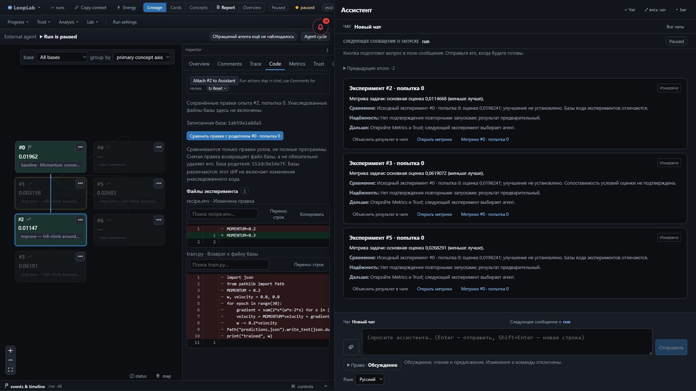

Replay-first — **193 passed**. Owner/history/review overlay, parent comparison
и review capabilities — **29 passed**. UI model/real Inspector, node switch,
retained drafts, review route, line diff и compilation/control-byte checks —
**42 passed**. API reference/module seams — **47 passed**. Документальные
контракты/entry points/merge history — **34 passed**, строгая сборка MkDocs и
diff check прошли. Итого **345 passed**, без skips. Selectors и границы —
[validation.json](assets/72-code-overlay-fix/validation.json).

**Остаток O6/O14:** сохранённые edits не являются полным materialized repo.
Inherited runner/scorer, зависимости и target-aware Git change set всё ещё
нуждаются в отдельной реализации и приёмке. Этот increment не закрывает весь
O6 и не сертифицирует пользовательский merge или scientific improvement.

### 20.25 72.O6: чтение унаследованного кода из записанной базы (2026-10-03)

**Проблема.** После §20.24 recipe-only опыт показывает свои edits, но его
унаследованный `train.py` нельзя открыть в Code. Человек видит рецепт без
программы, которая его использовала. Простое объединение base и edits также
нельзя назвать точной runnable программой: materialization подключает task
assets и данные отдельно, а окружение не входит в seed archive.

**Реализация.** `looplab/serve/seed_files.py::seed_files` возвращает version-1
inventory и выбранный файл из проверенного run-owned архива. Scope явно задан:
`recorded_seed_before_mounts_and_overlay`. Список отсортирован и разбит на страницы
по 100 файлов (API максимум 200); рядом размер, SHA-256 и executable flag.
UTF-8 preview ограничен 256 КиБ; binary/large получают явный статус без
подстановки текста. Verifier отдаёт те же байты, которые хеширует, и проверяет
весь архив перед публикацией ответа. Неполный/испорченный архив не даёт частичный
успешный список и не заменяется текущим checkout/workdir.

GET `/api/runs/{run_id}/nodes/{nid}/seed-files` требует run generation и attempt.
Base receipt связан с предшествующим `workspace_seeded` и terminal событием
именно этого узла/попытки. Generation, current attempt и base evidence проверяются
повторно после чтения. Полный events.jsonl читается через существующий bounded
strict reader `looplab/engine/upstream_state.py::events_for` до и после проверки
архива; повреждённый хвост или превышение 32 МиБ дают unavailable, а не успешный
восстановимый prefix. Чтение не берёт command sequencer, не пишет событие и
не меняет состояние Maintainer или task repo.

`ui/src/RecordedSeedFiles.jsx::RecordedSeedFiles` открывает базу только по явному
нажатию. Обязательные поля, pagination, identities, byte length и текстовый
SHA-256 проверяются в браузере. Смена node/attempt/base/run generation убирает
прежний просмотр и отменяет незавершённый запрос. Ошибка очищает старый preview;
повторное чтение явное. Owner Code показывает archive отдельно от edits;
historical/review UI не получает нового archive доступа. RU/EN, поиск и перенос
строк сохраняют принятый язык. Нет вызова модели, запуска программы или нового
скрытого ожидания движка.

**Desktop-проверка.** Свежая production UI-сборка, requested viewport 1920×1080,
русский Assistant. На уже измеренном CPU SGD опыте #2 из §19.14 открыты четыре
файла базы и унаследованный `train.py` с поддержкой `LEARNING_RATE`. Рецепт
`MOMENTUM=0.3` остаётся отдельной правкой; это не объявляется полным экспортом.
Журнал events до/после одинаков. Новое обучение и model requests отсутствуют;
browser console errors не обнаружены. Screenshot сохранён из текущего viewport:
full-page capture менял layout и сбрасывал непостоянный просмотр. Поэтому он
не использован как доказательство открытого файла.

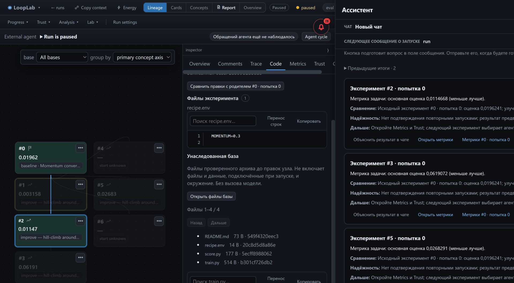

Проверки: replay-first, archive/source binding, повреждение журнала до/во время
чтения, reset race, replacement receipt, binary/large/path refusal, owner overlay,
API reference/module seams, UI identity/hash/refetch/reset/review separation,
node switch/result cache, compilation и документальные контракты. Точные selectors,
итоги, ограничения и hash screenshot —
[validation.json](assets/72-recorded-seed-files/validation.json).

**O6/O14 остаются OPEN.** Архив + сохранённые edits теперь читаемы, но полный
materialized result с runtime inputs/dependencies, сравнение двух таких программ
и target-aware доставка в пользовательский repo ещё требуют реализации и приёмки.
Наличие архива не подтверждает научное улучшение, повторяемость на новом target
или merge в пользовательскую ветку.

### 20.26 72.O6: различимые версии базы и правки опыта (2026-10-03)

**Находка после §20.25.** Code показывал сохранённый recipe опыта и архивный
recipe базы с одинаковым названием просмотра. В CPU SGD опыте #2 это разные
тексты; открыть архив ещё не значит открыть итоговый файл программы. Список
до 100 файлов также отодвигал выбранный preview ниже видимой области.

**Исправлено.** `ui/src/nodeCodeModel.js::recordedFileOverlay` различает отсутствие
отдельной правки, override (включая пустой текст), явное deletion и неизвестные
правки. Это классификация сохранённого overlay, не доказательство применения
его к защищённому/task-owned файлу. `ui/src/RecordedSeedFiles.jsx::RecordedSeedFiles`
показывает этот контекст в списке и рядом с выбранным файлом. Base preview
подписан «База: имя» и связан с ID/attempt/digest; saved preview — «Правка #ID: имя».
Переключатели «Версия базы / Правка опыта» меняют уже прочитанные тексты без
HTTP или model request. Archive deletion не предлагает фиктивную восстановленную
правку; missing overlay не объявляется unchanged. Оговорка о protected files и
task assets остаётся видна.

Preview теперь стоит перед списком. Список имеет ограниченную высоту и отдельную
прокрутку; текущий файл отмечен `aria-pressed`. После явного чтения heading файла
получает фокус и раскрывается в области Inspector. Если человек за время чтения
перешёл в другой input, ответ не забирает у него фокус. Reset, generation/base
change и ошибка чтения сохраняют прежнее очищение preview и отмену запроса.
Wire validator теперь всегда возвращает boolean и отвергает UTF-8 с NUL,
необоснованный too-large status и selected file вне возвращённого inventory.

**Проверка.** Replay-first. Component Inspector drive читает base `MOMENTUM=0.2`,
переключается на saved `MOMENTUM=0.3`, возвращается без нового запроса, читает
явно удалённый архивный файл, проверяет hash refusal и reset. Отдельный delayed
read сохраняет фокус стороннего input и неизвестный overlay. Свежий production
UI проверен на сохранённом реальном CPU SGD опыте #2: base `MOMENTUM=0.0`,
saved `MOMENTUM=0.3`, RU, desktop viewport 1920×1080.
Это проверка представления существующих измерений; обучение не повторялось.
Selectors, итоги и screenshot —
[validation.json](assets/72-file-version-context/validation.json).

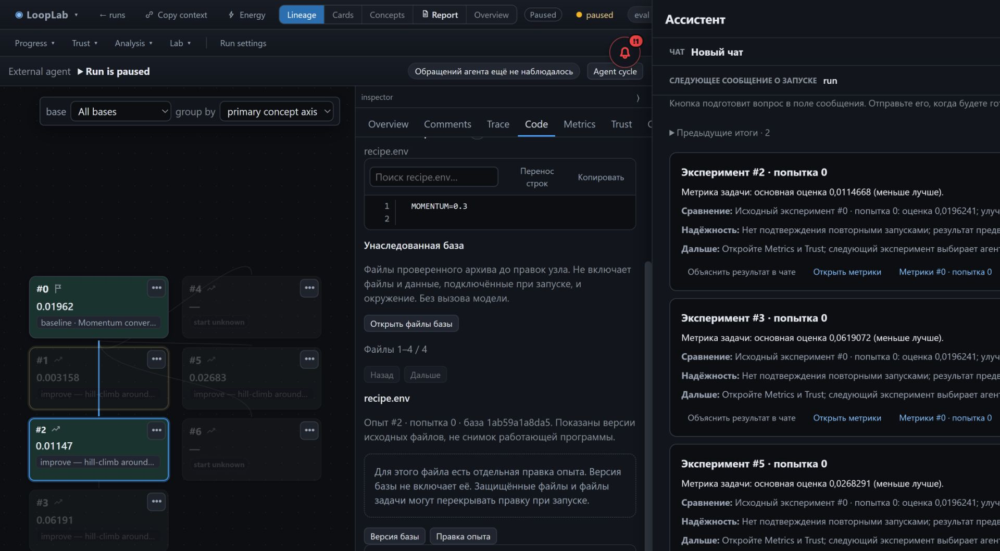

**Вывод по материализации.** `looplab/engine/workspace.py::WorkspaceSeeder.materialize`
после seed применяет node files и затем task assets; protected names и runtime
inputs имеют собственные правила. Поэтому простая сумма base archive + raw
files/deleted не принимается за точную runnable программу. Полный materialized
manifest, сохранённые runtime inputs/dependencies и target-aware доставка остаются
OPEN O6/O14. Этот фикс снижает риск перепутать версии при чтении существующего
результата и не закрывает весь экспорт/интеграцию task repo.

### 20.27 72.O6/O14: Git export не маскирует правки под полную программу (2026-10-03)

**Находка.** `looplab export-git` объяснял ограничения в документации, но получатель
отдельного Git repo видел checkout champion и метрику без явного tree scope.
Два recipe-only опыта с одинаковым overlay и разными inherited базами дают пустой
Git diff. Это не доказывает равенство программ; создание экспортного repo не
доставляет изменения в пользовательскую ветку.

**Исправлено.** `looplab/events/git_export.py::_message` добавляет к каждому
commit `Looplab-Tree-Scope: saved-node-edits`, `Looplab-Delivery: not-performed-by-export`
и `Looplab-Base-Reference`. `looplab/events/git_export.py::_recorded_base_reference`
публикует только ссылку из текущего evaluated attempt: полный version-1 receipt,
строгие числовые identity/count fields, SHA-256, matching workspace_seeded до
terminal event той же попытки. Ссылка явно говорит content-not-exported; архив
не открывается, его доступность и хеширование байтов не утверждаются. Missing,
malformed, unbound, superseded и incomplete-prefix evidence дают unavailable.
Старая попытка не заимствует базу новой.

**Дополнительный баг.** Пропущенный task asset не резервировал свой checkout slot:
`Grader.py` экспортировался рядом с исключённым `grader.py`, хотя Windows считает
это одним именем. `looplab/events/git_export.py::lifecycle_tree` теперь отсекает
case/Unicode-normalization aliases task assets и entrypoint и считает их portable
checkout collisions. Это консервативный экспорт, поэтому Linux case variant не
объявляется «never materialized»; исходный журнал сохраняет все правки.

`looplab/cli/export_cmds.py::export_git` сообщает об исключённых base files,
runtime inputs/environment и отсутствии доставки. Parents, tags, selection и
метрики сохраняют прежнюю логику. Новые trailers намеренно меняют commit IDs;
format golden обновлён явно. Новый формат остаётся детерминированным.

**Проверка.** Replay-first; реальные Git repositories, recipe-only/different-base
сценарий, reset и damaged-prefix, malformed/bool/stale receipt variants, fsck,
hermetic environment и golden. Отдельный read-only smoke экспортирует сохранённый
реальный CPU SGD run; это не повтор обучения и не merge в task repo.
Точные selectors и результаты —
[validation.json](assets/72-git-export-scope/validation.json).

**Граница.** O6/O14 остаются OPEN: полного materialized manifest, переносимого
окружения и target-aware доставки этот шаг не реализует. Теперь ограничение
остаётся с Git repo, даже если получатель не видел UI или CLI.

### 20.28 72.O6: omitted assets сохраняют границы файл/каталог при Git export (2026-10-04)

**Воспроизведено.** После §20.27 равные portable имена исключались, но отсутствующий
в edit tree asset не резервировал родительские каталоги и собственную file boundary.
`grader.py/helper.py` экспортировался под asset-файлом `grader.py`; файл `checks`
экспортировался вместо каталога с task-owned `checks/grader.py`. Получатель edit
repo получал конфликтующую файловую структуру. Такие же коллизии были у ratified
adapter и у `solution.py` без основного code.

**Исправлено.** `looplab/events/git_export.py::lifecycle_tree` строит portable keys
исключённых файлов и множество их ancestor directories. Candidate path сверяется
по компонентам: equal/ancestor/descendant collisions считаются в существующем
`Looplab-Skipped-Paths`. Case/Unicode aliases проходят ту же проверку. Соседние
`checks/user.py`, `adapter/user.py` и `grader.py_extra/user.py` остаются в tree;
общий текстовый prefix не считается родством путей. Canonical `solution.py` из
`node.code` сохраняется. Порядок обхода, node/attempt identity, метрики и текущий
format golden не меняются.

**Проверка.** Replay-first; реальные Git repositories и fsck, task assets,
ratified adapter, empty/nonempty main code, nested case/Unicode aliases, siblings
и неизменность исходного events.jsonl. Полная экспортная регрессия проверяет
parents/reset, receipts, damaged-prefix и hermetic/deterministic export. Точные
selectors, результаты и ограничения —
[validation.json](assets/72-git-export-boundaries/validation.json).

**Граница.** Фильтр экспортного edit tree не выполняет candidate admission,
training или task-repo merge и не проверяет runtime dependencies. O6/O14 сохраняют
OPEN для materialized program и target-aware доставки.

### 20.29 72.O6: delete aliases не оставляют ложный файл в Git export (2026-10-04)

**Воспроизведено на Windows.** `WorkspaceSeeder.write_node_files` с
`files={"Readme.md": ...}` и `deleted=["README.md"]` оставляет пустой workdir,
а прежний Git export оставлял `Readme.md`. Exact-string lookup в deletion pass
расходился с portable-name comparison, который применялся при добавлении файлов.
Из export можно было взять текст файла, отсутствующего после реальной материализации.

**Исправлено.** `looplab/events/git_export.py::lifecycle_tree` сохраняет mapping
portable key → exact kept spelling и использует его при удалениях. Exact match
считается explicit deletion. Case/Unicode alias исключает неоднозначную правку
как portable checkout collision: Linux мог оставить этот файл, поэтому удаление
на каждой исходной платформе не утверждается. Protected names и их aliases
проверяются до удаления: canonical `solution.py` из `node.code` сохраняется.
Missing/duplicate deletion не создаёт лишнего skipped count; обычные соседние
пути остаются. Lookup не перебирает все файлы для каждого deletion.

**Проверка.** Replay-first. Реальный Windows materializer и реальный Git export
дают пустую файловую проекцию для case-delete; отдельные real-Git сценарии
проверяют Unicode alias, nested Windows separator, exact deletion, duplicate и
missing deletion, protected entrypoint и siblings. Linux запускает portable
regressions; Windows-only materializer scenario там явно skip. Полная экспортная
регрессия сохраняет format golden, parents/reset/receipts и fsck.
Точные selectors и результаты —
[validation.json](assets/72-git-export-deletions/validation.json).

**Граница.** Это консервативная файловая проекция saved edits. Фильтр не восстанавливает
полную программу или runtime dependencies и не доставляет изменения в task repo.
O6/O14 остаются OPEN для этих функций.

### 20.30 72.O6: hash не подтверждает текст после молчаливой Unicode-подмены (2026-10-04)

**Воспроизведено.** JSON может содержать одиночный UTF-16 surrogate. Browser
`TextEncoder` заменяет его на U+FFFD перед вычислением размера и SHA-256.
Прежний `ui/src/RecordedSeedFiles.jsx::validSeedFilesPage` принимал такую строку,
если receipt соответствовал replacement bytes: совпадение hash не подтверждало
точный полученный текст. Отдельный regression сначала упал на этом принятии.
Это дефект проверки повреждённого ответа; корректный server UTF-8 decoder
такие строки не создаёт.

**Исправлено.** Validator отказывает при unpaired surrogate до кодирования.
Unicode-mode проверка сохраняет правильные surrogate pairs, включая emoji.
Размер объявленного файла и длина текста ограничиваются до выделения encoded
buffer; прежние byte-count, SHA-256 и identity проверки остаются обязательными.
Никакой replacement-текст не выдаётся за проверенный source. Error очищает
preview; восстановление требует явного чтения существующего архива.

**Проверка.** Replay-first. Live component drive проходит повреждённый JSON с
совпадающими replacement length/hash, отказ без preview и явное восстановление.
Кириллица, emoji, настоящий U+FFFD, BOM/CRLF и пустой файл читаются; Copy сохраняет
точный текст. Это тест настоящего React-компонента с подставными HTTP ответами,
не screenshot или human acceptance. Отдельные HTTP integration cases читают
реальный архив после изменения owner file: допустимый UTF-8 возвращается byte-exact,
invalid UTF-8, encoded surrogate и NUL явно помечаются binary без придуманного
текста. Selectors и результаты —
[validation.json](assets/72-archive-unicode/validation.json).

**Граница.** Source-read fix не подтверждает полноту runnable программы, её runtime
dependencies или доставку в task repo. O6/O14 остаются OPEN.

### 20.31 72.O6: основной код не теряется в контексте архивного solution.py (2026-10-04)

**Воспроизведено.** `ui/src/nodeCodeModel.js::recordedFileOverlay` смотрел только
`files/deleted`. При непустом отдельно сохранённом `node.code` и пустом `files`
архивный `solution.py` получал подпись «Отдельной правки нет» и не предлагал
основной код опыта. Regression сначала упал: классификация была inherited.
На solution-tier пути это особенно вводит в заблуждение:
`looplab/runtime/sandbox.py::SubprocessSandbox.run` записывает именно `node.code`
поверх `solution.py` перед выполнением.

**Исправлено.** Для точного root path `solution.py` непустой основной код получает
отдельный source kind main_code. Он не заимствуется из helper files и не теряется
из-за противоречащей helper deletion. Неизвестная структура overlay сохраняет
unknown; пустой/отсутствующий основной код не выдумывает правку. Вложенный
`pkg/solution.py` остаётся обычным helper path.
`ui/src/RecordedSeedFiles.jsx::RecordedSeedFiles` показывает «Есть основной код
опыта», переключатель и отдельное название preview на RU/EN. Base и main source
переключаются без HTTP/model request. Явная оговорка сохраняет границу: записанный
основной код не доказывает, что команда оценивания repo-задачи его запускала.
Это чтение двух сохранённых источников, не определение итоговой runnable программы.

**Проверка.** Replay-first. Pure model cases проверяют отдельный main code,
conflicting helper/deletion, nested path, empty/null code и incomplete overlay.
Live React component drive открывает архивный entrypoint, переключает версии,
меняет RU на EN и возвращается к базе без дополнительных запросов.
HTTP integration case выполняет 100 шагов минимизации quadratic objective через
настоящий локальный subprocess sandbox. Terminal metric взят из его результата;
рабочий `solution.py` содержит новый основной код, archive read — прежний source,
node detail — новый code и пустой files. Чтение не меняет events.jsonl.
Это короткий CPU execution check, не MNIST training или полный engine/agent cycle.
Selectors и результаты —
[validation.json](assets/72-archive-main-code/validation.json).

**Граница.** Case/Unicode path aliases, полная materialized программа, runtime
dependencies и target-aware доставка не закрываются этим source-view фиксом.
O6/O14 остаются OPEN.

### 20.32 72.O6: другое написание пути не выдаётся за отсутствие правки (2026-10-04)

**Воспроизведено.** Архивный `Readme.md` получал «Отдельной правки нет», когда
node files содержал `README.md` или deletion ссылался на это другое написание.
Regression сначала упал на inherited вместо предупреждения. На Windows реальный
`looplab/engine/workspace.py::WorkspaceSeeder.write_node_files` перезаписывает
или удаляет исходный файл через case alias; nested backslash spelling также
меняет файл с forward-slash именем в архиве. Архив остаётся проверенным старым
source, но его текст не определяет текущий materialized файл.

**Исправлено.** `ui/src/nodeCodeModel.js::recordedFileOverlay` проверяет риск
другого написания до выбора exact helper edit/deletion. Сравнение нормализует
разделитель, canonical Unicode form и uppercase/lowercase expansion; это
консервативная диагностика, не filesystem identity и не materializer.
Она не переименовывает пути и не выбирает один из конфликтующих текстов.
Случай exact edit плюс alias тоже остаётся неоднозначным; наличие отдельно
сохранённого root main code сохраняет прежнюю самостоятельную версию.
Обычные exact edit/deletion и unrelated sibling paths не меняют поведения.

`ui/src/RecordedSeedFiles.jsx::RecordedSeedFiles` показывает в списке «Написание
пути различается» и объясняет неопределённость рядом с base preview на RU/EN.
Версия базы читается с прежними hash/identity checks; edit switch не предлагается
для неоднозначного пути. Исходные имена и тексты остаются в saved edits выше.
После обновления к единственной exact правке переключение снова доступно без
дополнительного archive/model request.

**Проверка.** Replay-first; case write/delete, exact плюс alias, nested separator,
canonical Unicode и case-expansion scenarios, main-code и sibling regressions.
Live component drive проверяет RU/EN warning, отсутствие произвольного edit
preview и возвращение к exact edit. Native Windows cases применяют настоящие
write/delete/separator edits и повторно проверяют неизменный архив; на другой
платформе эти три materializer cases явно skip. Старые archive corruption/reset,
Unicode и реальное короткое CPU execution checks также пройдены.
Selectors и результаты —
[validation.json](assets/72-archive-path-context/validation.json).

**Граница.** Heuristic может предупредить о написаниях, которые конкретная исходная
filesystem различает, и не является полным каталогом её path aliases или symlink
правил. Точный materialized manifest и target-aware доставка остаются OPEN O6/O14.

### 20.33 72.O6: «Скопировано» относится к выбранному источнику и последнему запросу (2026-10-04)

**Воспроизведено.** После Copy базы переключение на правку оставляло «Скопировано»
на её кнопке, хотя новый текст не копировали. `ui/src/CodeViewer.jsx::CodeViewer`
хранил общий boolean и безусловно принимал любой clipboard completion. Старый
отказ мог убрать новое подтверждение; старый success мог подтвердить более поздний
failed request. Таймер от прежнего Copy мог преждевременно снять новую отметку.
Live archive regression сначала упал при переключении base → edit.

**Исправлено.** Подтверждение привязано к source scope, label и точному copy payload.
Смена источника или доступности Copy очищает feedback и инвалидирует предыдущие
запросы. Только последний запрос текущего источника может установить или снять
подтверждение. Его timer заменяет прежний; cleanup инвалидирует запросы и снимает
timer при unmount. Render также сверяет source identity, чтобы старая отметка
не появлялась на новом тексте до effect cleanup. Search и wrap не меняют copy payload.

**Проверка.** Replay-first. Настоящий React archive browser копирует базу,
переключает edit, получает задержанный clipboard reply после возврата к базе
и подтверждает только новое явное Copy. Отдельные component cases проверяют
смену code/label/scope/copyText, diff full-file payload, empty copyText и disable/
re-enable. Управляемые promises проверяют обе последовательности success/failure
без real-time гонки. Production 1400 ms timeout проверяется mock clock на границе;
таймер первого Copy не снимает подтверждение второго. Существующие file/version,
path-ambiguity, Unicode, Inspector и ordered diff regressions также пройдены.
API/source checks сохраняют Windows materializer и короткий реальный CPU execution
сценарии. Selectors и результаты —
[validation.json](assets/72-copy-source-feedback/validation.json).

**Граница.** Clipboard writes не отменяются: фикс отсекает устаревший UI feedback,
а не обещает отменить уже начатую запись или проверить содержимое clipboard после
действий других приложений. Это не delivery receipt в task repo. Materialized
manifest, runtime dependencies и target-aware доставка сохраняют OPEN O6/O14.

### 20.34 72.O6: Unicode-поиск подсвечивает реальные позиции исходного кода (2026-10-04)

**Воспроизведено.** `ui/src/CodeViewer.jsx::highlighted` искал в lowercase копии,
но применял её индексы к исходной строке. Unicode lowercase expansion меняет
длину: поиск x в `İx` создавал пустой mark вместо выделения x. Поиск combining
dot находил символ, появившийся только после преобразования `İ`, а не в исходнике.
Счётчик строк использовал отдельный lowercase predicate и мог подтверждать это
ложное совпадение. Live component regression сначала упал на неверном mark.

**Исправлено.** `ui/src/codeSearch.js::codeSearchRows` строит единственный набор
диапазонов по исходному тексту. Запрос экранируется как literal pattern и ищется
с Unicode case-insensitive flags; regex metacharacters остаются обычным текстом
запроса. Индексы и длина берутся из самого match. Search projection сохраняет
исходные diff rows и line identities; `ui/src/CodeViewer.jsx::highlighted` получает
эти диапазоны, а count берётся из той же projection. Строка с несколькими
совпадениями считается один раз. Подпись теперь явно говорит «Строк с совпадением»
или «Matching lines», включая выбранный RU/EN язык.

**Проверка.** Replay-first. Pure cases проверяют позиции после `İ` и emoji,
невозможность split surrogate pair, отсутствие созданного lowercase dot,
кириллицу, греческий sigma, все regex metacharacters, literal backslash,
повторные/non-overlapping matches и blank scaffolding. Live React cases задают
query через настоящий Inspector draft store, проверяют source marks и count,
смену языка/wrap, diff line numbers и очистку запроса. Видимый исходный текст
сохраняется; явный Copy возвращает его без search markup. Query changes не делают
HTTP/model request или clipboard write. Существующие copy-race, archive, source
version, path-ambiguity и native Windows/API regressions пройдены.
Selectors и результаты —
[validation.json](assets/72-code-search-unicode/validation.json).

**Граница.** Это literal Unicode case-insensitive search по отображаемым source
rows, без locale-specific casing или Unicode normalization. Он не подтверждает
семантическое равенство программ, materialization или доставку в task repo.
O6/O14 сохраняют OPEN для полного manifest, runtime dependencies и target-aware
доставки.

### 20.35. Git merge при переносе pending overlay: сбой не является конфликтом — 2026-10-04

**Проблема O2/O4/O6.** `looplab/engine/upstream_workspace.py::merge_text`
запускал `git merge-file` напрямую: с окружением сервера, global Git config и
repository context вызывающего процесса. Любой ненулевой exit трактовался как
конфликт научных правок. При ошибке Git это позволяло materialization выбрать
старую базу как при настоящем конфликте; missing executable и timeout, наоборот,
выходили нетипизированными исключениями. Это функционал LoopLab при миграции
экспериментов после `base_advanced`, а не checkout разработки продукта.

**Воспроизведение до правки.** Новый набор дал **9 failed, 2 passed**. Реальный
Git с повреждённым global config вернул `None` для независимых правок вместо
объединённых bytes. Exit 128/255 и отрицательный process return тоже давали
`None`. Отдельный сценарий с двумя измеренными CPU SGD переносами и pending
node подтвердил, что materialization не отказывала при Git exit 128.

**Исправление.** `looplab/engine/upstream_workspace.py::_run_git` — общий
запуск для `git_at` и `merge_text`: credential-scrubbed environment, без
global/system/environment Git config, с прежними per-command параметрами.
Merge выполняется из своего временного каталога, возвращает исходные bytes
без `strip`/decode и сохраняет прежний deadline 10 секунд. Только exit 1..127
считаются конфликтами; остальные ошибки получают существующий typed Git
refusal. Граница exit codes соответствует
[официальному контракту Git](https://git-scm.com/docs/git-merge-file).
Настоящий конфликт по-прежнему сохраняет исходную базу и overlay для review.

**Проверка сохранности.** Новый regression на двух реальных переносах и
измеренном CPU SGD проверяет, что при сбое merge остаются прежними event bytes,
pending lifecycle и все обычные файлы существующего workdir. Отказ происходит
до удаления workdir и `node_overlay_rebased`. После явного восстановления
materialization объединяет shared learning-rate capability, независимую
длительность обучения и прежний momentum recipe. Число gate executions остаётся
14: сам merge/retry не обучает и не запускает третий gate. Native Git отдельно
проверяет повреждённые global/env/caller-repo configs, реальные конфликты,
UTF-8/emoji, CRLF и конечные пустые строки; процессные tests — scrubbed child
environment, startup/deadline refusals и границы conflict counts.
Результаты — [validation.json](assets/72-upstream-merge-process/validation.json).

**Граница.** Это проверка materialization и двух последовательных measured gates,
не полная приёмка engine resume/Assistant или target repo delivery. O2 сохраняет
OPEN для полного lifecycle/status/conflict UX, O6/O14 — для полного manifest,
runtime dependencies и доставки в owner repo. Изоляция host config не исключает
внешние изменения установленного Git executable или источников на сервере.

### 20.36. Восстановление сохранённого предложения: названный manifest вместо общей ошибки — 2026-10-04

**Проблема O2/O4/O8/O9.** `looplab/engine/upstream.py::UpstreamLane._proposal`
не классифицировал ошибки декодирования/хеширования сохранённого manifest.
При повреждении JSON или Unicode HTTP/Assistant направляли проверять
task/config/events; слишком глубокая JSON-структура давала нетипизированный
`RecursionError`. Уже распознанные missing/oversized/changed refusals не называли
точный источник. Новая сессия получала неправильный маршрут восстановления.

**Воспроизведение до правки.** Новый набор дал **8 failed**: обрыв JSON,
невалидная encoding, lone surrogate, nonfinite value, чрезмерная глубина,
отсутствующий/oversized файл и изменённое читаемое предложение. Для каждого
первоначально создано настоящее предложение и passing CPU SGD gate; затем
повреждался только его сохранённый manifest, без изменения измерений.

**Исправление.** Ошибки JSON/Unicode/nonfinite/depth классифицируются в узкой
границе decode/hash как `upstream_manifest_unavailable`. Все manifest refusals
называют run-relative `upstream/proposals/PROPOSAL_ID/manifest.json`.
Изменённый читаемый body сохраняет отдельный `upstream_manifest_changed`.
Сообщение не отражает parser output или содержимое файла. Лимит 2 MiB,
regular-file reader и сверка recorded manifest hash сохранены.

**Проверка.** Восемь случаев проходят через engine lane, HTTP/typed MCP и
Assistant. Отказ новых check/advance происходит до нового claim: event bytes
не меняются, число execution остаётся 7, нет advance/resume. Exact proposal/check
ACK через MCP возвращает первоначальную квитанцию, не перезапускает evaluation
и не объявляет повреждённый manifest исправным. Восстановление original bytes
само ничего не запускает; затем явно отправленный CAS использует прежний
current passing gate и не повторяет обучение. Существующие API, operator
recovery, authority/dispatch и candidate-binding проверки также пройдены.
Результаты — [validation.json](assets/72-upstream-manifest-recovery/validation.json).

**Граница.** Это источник и маршрут его отказа, не автоматический repair или
новый recovery UI. При повреждённом events источнике старые ACK по-прежнему
недоступны; stale base/source/environment всё ещё требует отдельной проверки.
O2/O4/O8 сохраняют OPEN для полного продолжения работы через чат, retention
и восстановления original requests после потери клиента до сохранения manifest.

### 20.37. Original request сохраняется до proposal claim и Git — 2026-10-04

**Проблема O2/O4/O8.** Раньше `upstream_proposal_started` содержал только
request hash; полный normalized body попадал в manifest после Git commit и
snapshot. Потеря процесса до этого момента оставляла claim/WIP без серверной
копии исходных patch/recipe/critic/flag. История не позволяла восстановить body
по одному хешу. Это оставшийся случай, явно отмеченный в разделе 20.36 этого документа.

**Воспроизведение.** Новый набор до реализации дал **10 failed**: ранний process
loss не оставлял request file; не существовало барьера его durable publication
перед Git; unclaimed body не сохранялся после отказа claim publication. Новый
optional request path также требовал отдельной проверки typed readers.

**Изменение.** `looplab/engine/upstream.py::UpstreamLane._retain_proposal_request`
сохраняет approved normalized body в
`upstream/requests/PROPOSAL_ID/request.json` до `upstream_proposal_started`.
Ссылка `request_path` добавлена как optional поле старого event contract; старые
claims остаются читаемыми. Она видна через paged upstream history в API/MCP и
Assistant, без повторения raw patch в каждом status. Typed reader допускает
только ожидаемый run-relative путь для данного proposal ID.

**Publication/retry.** Запись должна получить strict durable receipt до claim.
Ошибка до или после видимой публикации отказывает как
`upstream_request_unavailable`, не вызывает Git и не добавляет claim. На явном
exact retry существующие values сверяются с body hash и заново durably публикуются:
`exists()` не подтверждает parent sync после interrupted write. Другой или
повреждённый unclaimed body не затирается. Old ACK/claim recovery возвращается
раньше и не переписывает request. Claim publication может отказать после записи:
retained request в этом случае не является доказательством admission.

**Проверка.** Ранний process loss, pre/post-write failure, claim failure и
changed/truncated/surrogate/oversized orphan request проверены на private runs
с реальным CPU source. После operator abandonment original request сохраняется;
fresh proposal получает отдельный request, passing gate выполняет ровно семь
реальных checks/evaluations. Нет автоматических advance/resume. Шесть прежних
cut points Git initialization и manifest/API/recovery regressions также проходят.
Результаты — [validation.json](assets/72-upstream-request-retention/validation.json).

**Граница.** Это server-side сохранность и диагностический pointer. Raw body
пока читается на сервере; безопасная ограниченная HTTP/MCP выдача и recovery
карточка в чате остаются OPEN. Исторический unsaved body не реконструируется;
retention/cleanup policy, checks/advance request recovery и полный multi-client
handoff также остаются O2/O4/O8. Ни файл, ни его путь не дают gate/advance authority.

### 20.38. Новый клиент получает original proposal; честные lifecycle и base-read подсказки — 2026-10-04

**Исправлено O2/O4/O8.** `looplab/engine/upstream_requests.py::request_page`
выдаёт исходные normalized proposal bytes через отдельный read-only HTTP route,
типизированный MCP `upstream_request` и одноимённое чтение Assistant в Plan mode.
Произвольный файловый путь не принимается: источник вычисляется по proposal ID.
Generation проверяется до и после чтения без ожидания эксклюзивного sequencer.
Request hash сверяется с исходным body и claim; action ID связывает proposal ID.
Повреждённый, отсутствующий, oversized или нерегулярный источник даёт named
`upstream_request_unavailable`; изменённая identity/страницы — отдельный отказ.
Legacy missing source не становится пустым patch.

**Полнота без увеличения model cap.** Источник ограничен 2 MiB, HTTP/MCP page —
4096 bytes. Base64 сохраняет UTF-8 при границах внутри символа. Страница содержит
общий и chunk SHA-256, total bytes, offset/next_offset, original request generation,
claim/settlement seq и source health. Следующие страницы требуют исходный content
hash. `looplab/harness/upstream_requests.py::valid_page` проверяет весь typed
контракт; неконсистентный HTTP 200 — unavailable без body. Клиент явно собирает
все страницы и сверяет canonical request hash перед решением об exact recovery.
Assistant по умолчанию читает 1024 bytes; maximum вычислен из общего `RESULT_CAP`.
Большая страница отказывается явно, а не обрезает chunk или continuation pointer.

**Граница полномочий.** Все страницы — `diagnostic_only`, включая unclaimed file
после неясной claim publication, unresolved, completed и abandoned proposal.
Completed означает окончание авторства, не passing gate. Чтение не покупает checks,
не создаёт worktree, не повторяет неизвестный write и не делает advance/resume.
Scoped credential читает источник; operator recovery остаётся operator-only.
Старая request generation не заменяется текущей внутри исходного body.

**Исправлено O5/O9/O13.** `looplab/harness/progress_summary.py::_next_step`
различает paused, stop requested и finished: finished ведёт к result notices и
final report, не предлагает новое завершение или resume. Root/draft caption
`ui/src/report.js::nodeChip` теперь «initial experiment», не утверждение task
baseline. `ui/src/seedReadError.js::seedReadError` разделяет timeout, изменённую
attempt/generation, недоступный архив, integrity/context mismatch и transport
failure. Сообщения есть на RU/EN, не отражают произвольный parser/server text;
настоящий Inspector сохраняет hash-проверку, отказ и explicit read recovery.

**Проверка.** Реальный CPU protected SGD source, потеря writer до Git, большой
proposal > MCP response cap: все страницы HTTP/MCP восстанавливают точные bytes
и request hash, события не меняются. Проверены 15 malformed 200 вариантов без
автоповтора, Plan tool с общей модельной границей, отсутствие original file,
unclaimed/abandoned/completed reads, scoped auth, generation reset внутри чтения,
изменение bytes между страницами, повреждённый request и events. Регрессии включают
полный measured transaction, worktree, последовательные bases, overlay intent,
manifest/Git recovery, gate claims и typed receipts. Новое чтение и ранее
не записанный seed-files route добавлены в recorded route coverage через реальные
HTTP dispatches. Проверки и команды —
[validation.json](assets/72-upstream-request-read/validation.json).

**Остаток.** O2/O4/O8 сохраняют OPEN для цельной proposal/recovery карточки,
согласования writer и retention. O3/O9/O11/O13 — для короткого целого Assistant
onboarding, включая локализацию handoff/next-step. O5/O6 — для manifest исполненной
программы с inputs/stages/env/deps. O6/O10/O14 — для target-relative передачи
совместимых возможностей в пользовательский repo с dirty/stale/conflict приёмкой.
Run-owned base advance всё ещё не означает merge или push в этот repo.

### 20.39. Карточка переноса, адресный Assistant draft и русский handoff — 2026-10-04

**O2/O4/O8.** `ui/src/upstreamProposalModel.js::upstreamProposalSummary`
выводит записанное состояние последнего authoring claim из bounded fold.
Проверяет порядок seq, identity и единственную settlement; orphan, duplicate
и mismatched записи дают unavailable. Новый незавершённый proposal не наследует
passing gate предшественника. Abandoned authoring/check остаётся отменённым
после late completion. Для recorded advance нужна его passing gate в этой
истории. Эти состояния не дают CAS authority и не измеряют жизнь автора.

`ui/src/UpstreamRecovery.jsx` показывает источник и technical identity отдельно.
`ui/src/UpstreamPanel.jsx` готовит адресный вопрос с proposal ID / request hash,
требованием current state/status и полного исходного чтения. При unavailable
identity требуется полная история; ключ и body не придумываются. Кнопка только
подготавливает текст. Права следующего сообщения остаются выбранными пользователем;
draft не выполняет checks/advance/resume и не отправляется модели автоматически.

**O3/O9/O11/O13.** `ui/src/HarnessHandoff.jsx` и
`ui/src/HarnessReceipt.jsx` используют общий выбор языка. RU переводит помощь,
ошибки чтения, client approval, clipboard feedback и receipt recovery; смена языка
сохраняет набранный ключ. `ui/src/harnessHandoff.js::harnessAgentInstruction`
готовит RU/EN инструкцию с `upstream_request` и исходной generation. Известные
серверные credential/scope/recovery clauses переведены точно; новые неизвестные
restrictions остаются verbatim. Secret не попадает в config/instruction.
`ui/src/HarnessConnection.jsx` загружает код помощи только после открытия;
ошибка загрузки имеет явное повторное чтение. Без клика нет handoff HTTP read.

**Проверка.** Replay — 193 passed. Серверные request-read/retention,
manifest/API recovery, handoff и документальные contracts — 51 passed.
UI recovery/language/progress/result regressions — 41 passed. Проверены настоящий
mount и переключение языка, original identity в draft, отсутствие writes,
stale/failed reads, clipped/duplicate/reordered history, newer unfinished claim,
late abandoned completion и gate-bound advancement. Production build прошёл;
снимки текущего интерфейса просмотрены с диска. Строгая сборка docs и окончательные
контракты записаны в [validation.json](assets/72-recovery-ui/validation.json).

**Граница.** Это UI recovery increment, не новая система retry, не полная
локализация Agent cycle, не lifecycle/retention worktree и не target-repo delivery.
Bundle budget проверка остаётся red; исходные и новые измерения указаны в §19.17.
Полный CI и платная модельная сессия не запускались.

### 20.40. Русский следующий шаг из того же серверного решения — 2026-10-04

**Проблема O3/O9/O11/O13.** После русского handoff пользователь всё ещё переводил
английские условия checkpoint, остановленного движка и завершения. Исходное дерево
— `c5b59edb7506630732e986cbafd184bcf0babfed`. Нельзя решать это вторым деревом
разрешений в UI: ранняя остановка, незавершённая оценка и восстановление должны
следовать актуальным серверным требованиям.

**Реализация.** `looplab/harness/progress_summary.py::next_step` выбирает EN/RU
текст внутри прежних веток. GET `harness-progress` (full/brief) принимает
`language=en|ru`, по умолчанию EN; новые ответы содержат `next_step.language`.
`looplab/harness/mcp_server.py::HarnessAPI.run_progress` и одноимённый MCP tool
передают RU одним GET; tool schema объявляет enum/default. Неверный или не совпадающий
stamp делает HTTP 200 unavailable без body. Отсутствующий stamp старого сервера
остаётся совместимым, UI явно называет исходный язык. Смена языка в
`ui/src/HarnessProgressPanel.jsx` меняет scope чтения, сразу убирает прежнюю
подсказку и не допускает запоздавший ответ другого языка.

Переведены неполные источники, paused/finished/stop-requested, running/stopped/unknown
engine, незавершённые эксперименты и все виды вопросов оценки. Deadline подсказка
сохраняет явное ожидание ответа без автоматического таймаута; команда может работать,
одно продление ограничено runtime. Для остановленного движка перечислены original
receipts и обновление вопроса после resume. `abort` не появляется без полномочия
конкретного checkpoint. Поля code/owner/phase, reads/action, generation и все
требования одинаковы для обоих языков. Новая локализация не добавляет engine wait,
automatic retry, takeover или команду.

**Проверка.** Replay-first — 193 passed; сервер/HTTP/MCP — 208 passed; живые UI
mounts и языковые регрессии — 14 passed. Матрица включает источники с повреждением,
все lifecycle/engine состояния, queued/building/evaluating/pending, stage/monitor/
ASHA/deadline, смену языка с поздним ответом и неверным stamp, legacy fallback,
один GET и неизменные events. Production build прошёл. В браузере проверены
RU → EN → RU для прежнего private fixture `demo` (79 событий, два terminal nodes),
без вызовов модели и engine writes. DOM-проверка при 1920×1080: reading dialog
1100px, без горизонтального overflow. Снимки сохранены при штатном размере браузера:
инструмент захвата кадрировал увеличенный viewport; это не human acceptance и
не новое обучение. [Русская карточка](assets/72-next-step-ru/02-agent-cycle-ru.jpg),
[английская карточка](assets/72-next-step-ru/03-agent-cycle-en.jpg).

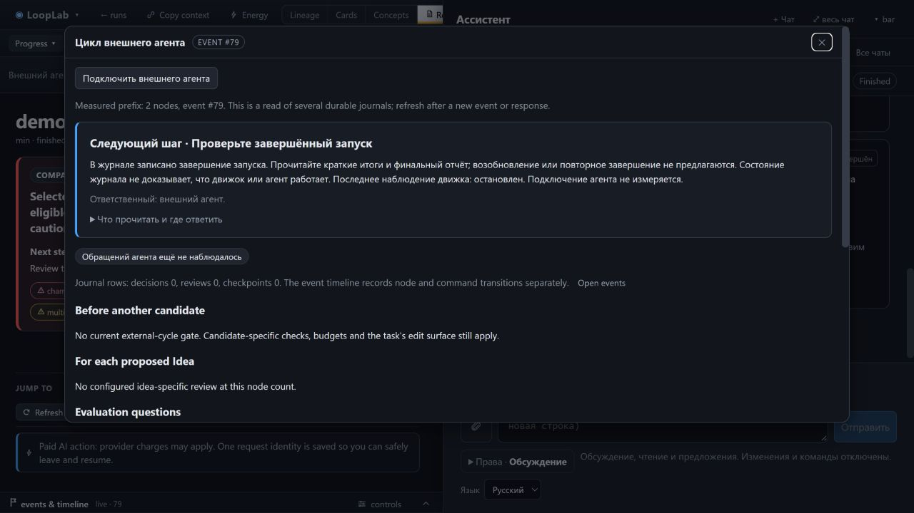

Проверки и границы — [validation.json](assets/72-next-step-ru/validation.json),
размеры — [bundles.json](assets/72-next-step-ru/bundles.json). JS gzip вырос
647650 → 648036 B (+386), CSS остался 59809 B. Сохраняются прежние четыре
bundle-budget нарушения; пределы не повышены. Это не зелёный общий CI.

**Остаток.** O3/O9/O11/O13 остаются OPEN для полного Assistant onboarding,
локализации таблиц требований/истории/диагностики, approvals и проверки нового
пользователя с живым внешним клиентом. O2/O4/O8 — lifecycle/retention worktree
LoopLab, O5/O6 — effective program manifest, O6/O10/O14 — target-relative
доставка в пользовательский repo. Изменение run-owned базы по-прежнему не равно
merge/push в него. O1 сохраняет отдельную работу по размеру UI и полному CI.

### 20.41. Требования и история Agent cycle: RU/EN и отказ от старых указаний — 2026-10-04

**Ревью.** Исходное дерево — `71711a14f5602abecfa16f3b79a36defde91074f`.
Полная панель оставалась английской после русского next-step. Кроме этого,
валидатор не проверял `finish_reviews_due`, поля требований, вопросы и metadata
страниц: неполный HTTP 200 мог вызвать ошибку React или показать пустые требования.
После отказа refresh старые требования продолжали стоять под заголовками будущих
действий. Общая подсказка `abort pending nodes` не различала явную отмену и
разрешённый ответ конкретного монитора.

**Исправлено.** `ui/src/harnessProgressModel.js::validHarnessProgress` проверяет
render-critical envelope: explicit health/aggregate complete, обязательные поля
продолжения и завершения, вопрос/число/truncation, limit/offset/total/has_more,
поля отображаемых квитанций. Не додумывает разрешения или содержимое отсутствующих
обязательств. Полный ответ с неполными источниками остаётся диагностикой; старое
чтение сохраняет историю, но текущие candidate/finish требования скрыты до fresh
complete read. Старый статус `current` назван актуальным **при последнем чтении**.

`ui/src/HarnessCycleBody.jsx` переводит статические подписи требований, вопросов,
истории, известные status chips, paging и source warning. Phase IDs, verdicts,
ключи, reasons/expectations/logs и JSON diagnostics сохраняются verbatim.
`ui/src/PanelResourceNotice.jsx` принимает opt-in язык для ошибок/повтора чтения;
остальные панели сохраняют EN default. Подсказка о незавершённых экспериментах
ведёт к state/checkpoints/original receipts и allowed answers монитора, без общего
разрешения `abort`. Новых команд, вопросов или ожиданий движка нет.

Body загружается динамически при чтении полной панели, компактный status его
не импортирует статически. Это граница загрузки, не обещание уменьшения bundle:
total JS gzip вырос 648036 → 652020 B (+3984), static compact closure —
121931 → 121999 B (+68), CSS не изменился. Прежние четыре bundle-budget нарушения
сохраняются, потолки не повышены: O1 OPEN.

**Проверено.** Replay-first — 193 passed; сервер progress/locale — 41 passed;
UI — 18 passed. RU → EN с сохранёнными original IDs/текстом, damaged source,
stale refresh, явный повтор чтения, отсутствующие finish fields, malformed answer,
несовпадающие question counts и page metadata. Проверены допустимые offset=20
и 100/101 truncated questions. Общие resource notices и handoff не сломаны.
Production build прошёл. Прочитан прежний private `demo` с настоящим серверным
ответом: 79 events, два terminal nodes, без нового обучения, model calls или
engine writes. DOM при FullHD: dialog 1100px, client/scroll width 1088px;
viewport возвращён, собственная вкладка закрыта. Снимки — штатный 1280×720
capture, не human acceptance: [требования RU](assets/72-cycle-requirements/01-cycle-ru.jpg),
[история RU](assets/72-cycle-requirements/02-history-ru.jpg),
[EN](assets/72-cycle-requirements/03-cycle-en.jpg).

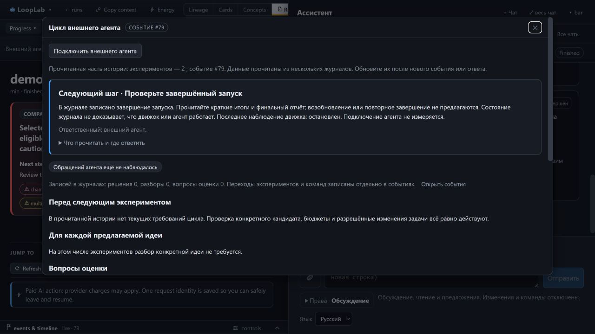

Команды, ограничения и размеры — [validation.json](assets/72-cycle-requirements/validation.json)
и [bundles.json](assets/72-cycle-requirements/bundles.json).
O3/O9/O11/O13 сохраняют OPEN для цельного Assistant onboarding, схемы владельцев,
approvals, технических diagnostics и реального нового пользователя с live MCP.
O2/O4/O8 — lifecycle/retention worktree LoopLab; O5/O6 — effective manifest;
O6/O10/O14 — проверенная target-relative доставка в пользовательский repo.
Этот UI read не выполняет merge/push в него и не закрывает весь doc72.

### 20.42. Уменьшение UI без повышения бюджетов — 2026-10-04

**Ревью.** Исходное дерево — `b5ee480e001e59ccd99ce465abc514d040fa3988`.
Четыре красных size gate нельзя считать «всё работает» только потому, что
production build проходит. Общий JS уже превышал потолок на 18036 B; CSS —
на 161 B, DAG CSS — на 43 B, review DAG JS — на 770 B. Защита lazy/public/review
границ оставалась зелёной. Перенос в lazy chunk меняет загрузку страницы,
но сам по себе не уменьшает сумму всех shipped assets.

**Изменено.** `ui/vite.config.js` использует поддерживаемый React 18 classic
JSX runtime: меньше element/children wrappers. Добавлены недостающие imports
React в `ConceptView.jsx` и `icons.jsx`. `runStateModel` и `panelPrimitives`
группируются с чистыми run helpers: два маленьких отдельных compression streams
больше не нужны. Роли, runtime policy, измеренные результаты и full-cycle lazy
boundary не изменены. Опасные `unsafe_comps` и `booleans_as_integers` остаются
выключены; бюджеты и forbidden reachability checks не ослаблены.

Из `styles.css` убраны десять правил старого command type-ahead, на которые
нет ссылок в исходном дереве. Живые подсказки Assistant используют `cmdbar-pop`
и `cmdbar-pop-item`; они проверены в браузере с клавиатурой. Глобальное объединение
focus selectors было отвергнуто: raw CSS уменьшался, но gzip рос. Другие пробы
с группировкой/форматированием не вошли в изменение, включая вариант с static
cycle. Никакая новая зависимость не установлена.

| Метрика gzip, B | До | После | Прежний предел | Результат |
|---|---:|---:|---:|---|
| Total JS | 652020 | 647301 | 633984 | RED, ещё 13317 B |
| Total CSS | 59809 | 59635 | 59648 | проходит |
| Owner DAG CSS | 47147 | 46973 | 47104 | проходит |
| Review DAG JS | 269314 | 268268 | 268544 | проходит |

Static compact Agent cycle JS: 121999 → 121506 B. Full body остаётся dynamic
import и отсутствует в этом static closure. Циклы manifest, forbidden owner/public
reachability и остальные route/individual ceilings проходят. **Общий bundle gate
всё ещё красный**: O1 OPEN. Изменение экономит 4719 B JS / 174 B CSS, не закрывает
полный doc72 или общий CI.

**Проверка.** Replay-first — 193 passed. Полный UI suite — 1944 passed, без
skip/cancel/fail, включая 10 minifier/production JSX checks (это часть suite,
не дополнительный счёт). Новая `productionJsxRuntime.test.js` выполняет реальные
minified SSR bundles обоих JSX runtime: меню, SVG icons, Concepts, result reader
с undefined/null/NaN/числом/строкой, RU/EN resource states, falsy children и
приоритет explicit/spread keys. Выводы совпали; закрытые меню не рисуют `0`,
ARIA сохраняет `false`. Это проверка названной матрицы, не доказательство всех
возможных пользовательских состояний production UI.

В браузере прочитан прежний private `demo`: 79 events, два terminal nodes,
один run-base advance. Проверены Report, пустая Concepts projection, Lineage,
полный RU Agent cycle и шесть подсказок Assistant; ArrowDown/Escape, очистка
черновика. При FullHD dialog 1100px, client/scroll width 1088px. Ошибок/warnings
в console не получено. Сообщение модели не отправлялось, engine commands и
новое обучение не запускались. Browser viewport возвращён, собственная вкладка
закрыта. Снимки сохранены при штатном 1280×720; FullHD DOM проверен отдельно:
[Assistant commands](assets/72-ui-budget/01-assistant-commands.jpg),
[Agent cycle](assets/72-ui-budget/02-agent-cycle.jpg).

Проверки и ограничения — [validation.json](assets/72-ui-budget/validation.json),
размеры — [bundles.json](assets/72-ui-budget/bundles.json). Документальные проверки — 28 passed; strict MkDocs и diff-check проходят.
Все большие темы §19.17 остаются OPEN, включая lifecycle/retention worktree **LoopLab**,
effective program manifest, живой внешний клиент, human acceptance и
проверенную target-relative доставку в пользовательский repo. Этот проход
не является проверкой repo delivery LoopLab.

### 20.43. Скрытый итог Assistant загружается при раскрытии — 2026-10-04

**Ревью.** Исходное дерево — `669495f5a9df84290bc7914d4b2df46b4aacfe43`.
Продолжение O1 выявило отдельный дефект чтения результата: native `details`
скрывал карточку, но React всё равно монтировал `AssistantRunResult` внутри неё.
Lazy import выполнялся до раскрытия, а ready effect мог инициировать прокрутку
чата ради скрытого результата. Сам читатель не вызывает модель или дополнительный
detail API; проблема касалась загрузки JS и жизненного цикла компонента.

**Исправлено.** `AssistantBar.jsx::RunResultDisclosure` монтирует children только
в открытом блоке сравнения. Ключ run ID + generation закрывает блок при смене
идентичности. Обычное обновление данных того же поколения сохраняет раскрытие
и показывает текущую квитанцию. Закрытие удаляет читатель; чтение истории
не удерживает живой итог. При загрузке показывается RU/EN status вместо пустого
fallback. Краткие completion notices остаются отдельным читателем в чате.
Кнопка вопроса сохраняет прежние guards и только готовит черновик.

**Проверено.** Replay-first — 193 passed. Полный UI suite — 1945 passed,
без fail/skip/cancel. Четыре проверки `assistantRunResult.test.js` входят
в это число: закрыто/открыто/снова закрыто, новый run/generation, обновление
текущего receipt, история → live, точные ссылки попытки, ограничения сравнения,
RU/EN, отказ перезаписать черновик, отсутствие POST при подготовке вопроса.
Production build проходит.

В production-браузере прочитан прежний private `demo` (79 events, два terminal
nodes). До раскрытия: ноль result readers, три completion notices, нет
modulepreload link для `AssistantRunResult`. После раскрытия итог виден; вопрос
подготовлен без отправки. Закрытие удаляет reader и сохраняет вопрос. FullHD DOM:
reader width 939px, client/scroll 937px — горизонтального переполнения нет.
Console warnings/errors — ноль. Проверка modulepreload DOM не является полной
сетевой трассировкой. Черновик очищен, viewport возвращён, собственная вкладка
закрыта, private server остановлен. Снимки при штатном 1280×720:
[свёрнутый блок](assets/72-result-disclosure/01-closed.jpg),
[раскрытый итог и черновик](assets/72-result-disclosure/02-open-draft.jpg).

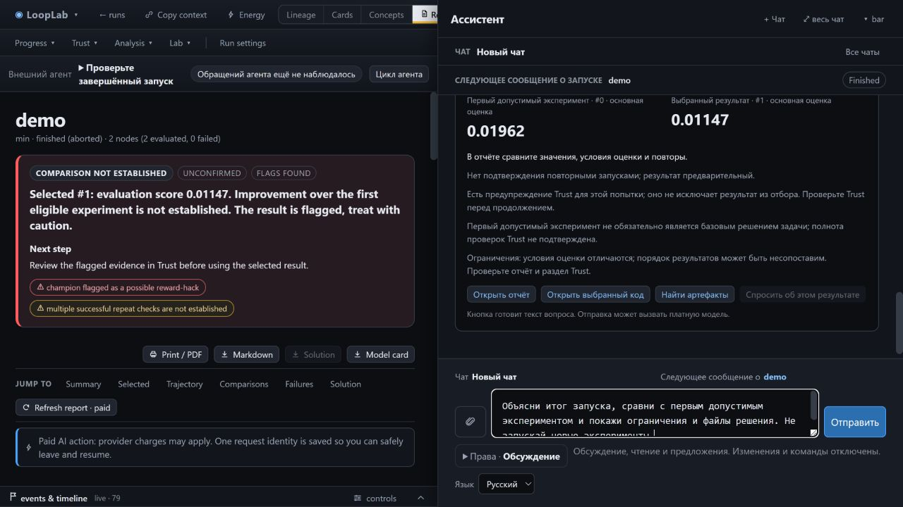

**Размеры и граница.** Это исправление загрузки, не экономия суммы assets:
JS gzip 647301 → 647364 B (+63), CSS неизменен — 59635 B. Total JS превышает
прежний предел 633984 B на **13380 B**. Остальные size/reachability/cycle и
boolean guards проходят; full Agent cycle сохраняет dynamic boundary. O1 OPEN,
бюджеты не повышены. Пробы другого JSX factory и minSize групп не дали уменьшения
и не вошли в приложение. Ограничения и команды —
[validation.json](assets/72-result-disclosure/validation.json), размеры —
[bundles.json](assets/72-result-disclosure/bundles.json).

Документальные проверки — 28 passed; strict MkDocs и diff-check проходят.
Всего 2166 уникальных локальных тестов: 193 replay + 1945 UI + 28 docs.

Все большие OPEN §19.17 сохраняются, включая lifecycle/retention worktree
**LoopLab**, effective manifest, live MCP, приёмку нового пользователя и
target-relative доставку в пользовательский repo. Нового обучения и проверки
repo delivery LoopLab в этом проходе нет; весь doc72 не закрыт.

### 20.44. Общий compression stream для начального UI — 2026-10-04

**Ревью.** Исходное дерево — `21039d8b80f6203e86a882694110e410c76af50f`.
Начальный shell уже статически загружал API/recovery, React/primitives и
App/auth/resource helpers, но их код сжимался раздельно. Объединение только
API и primitives экономило 519 B. Вариант с bootstrap внутри группы убирал
manifest entry: проверки путей становились недоступны, поэтому он отвергнут.

**Изменено.** `ui/vite.config.js` объединяет уже совместно загружаемые модули
в `app-core`. `main.jsx` и его styles остаются отдельным entry. Зависимости
не захватываются рекурсивно; owner, graph, settings, launch/result и full Agent
cycle entrances сохраняются. Прямое сравнение двух полных production builds
показало одинаковый начальный набор **48 source/runtime modules**, четыре
начальных JS chunk в обоих вариантах. Это проверка состава загрузки, а не
доказательство всех возможных runtime состояний или equivalence exports.

| gzip, B | До | После | Изменение |
|---|---:|---:|---:|
| Total JS | 647364 | 646143 | -1221 |
| Initial shell JS | 83202 | 82513 | -689 |
| Owner DAG JS | 401846 | 401025 | -821 |
| Review DAG JS | 268262 | 267469 | -793 |
| Compact Agent cycle JS | 121497 | 120612 | -885 |
| Total CSS | 59635 | 59635 | 0 |

Остаток total JS — **12159 B** выше прежнего предела 633984 B. Остальные
size/reachability/cycle и boolean guards проходят, ceilings не повышены.
Full Agent cycle body отсутствует в static compact closure. O1 остаётся OPEN.
Никакая функция продукта или проверка протокола не удалена ради размеров.

**Проверено.** Replay-first — 193 passed; полный UI suite — 1945 passed,
без fail/skip/cancel. Проверены production compilation, transport/credential
boundaries и JSX/minifier semantics, входящие в этот suite. В production-браузере
прочитан прежний private CPU `demo`: 79 событий, два terminal nodes.
При FullHD работают переход List → run, Report и раскрытие selected result
(один reader, три completion notices). Полная RU Agent cycle получила текущие
требования и записи: событие #79. Dialog width 1100px, client/scroll 1088px.
На недействительной review-ссылке и отсутствующем shared chat нет owner
Assistant, composer или управляющих кнопок. Valid public capability в браузере
не создавалась и не проверялась. Console warnings/errors не получено.

На штатном 1280px capture клик run link не прошёл; после перехода на целевой
FullHD он прошёл. 1280px usability не заявляется, основной desktop размер
проверен отдельно. Viewport возвращён, собственная вкладка закрыта, private
server остановлен. Снимки при штатном 1280×720:
[Agent cycle](assets/72-core-stream/01-cycle.jpg),
[Report](assets/72-core-stream/02-report.jpg),
[invalid review](assets/72-core-stream/03-invalid-review.jpg).

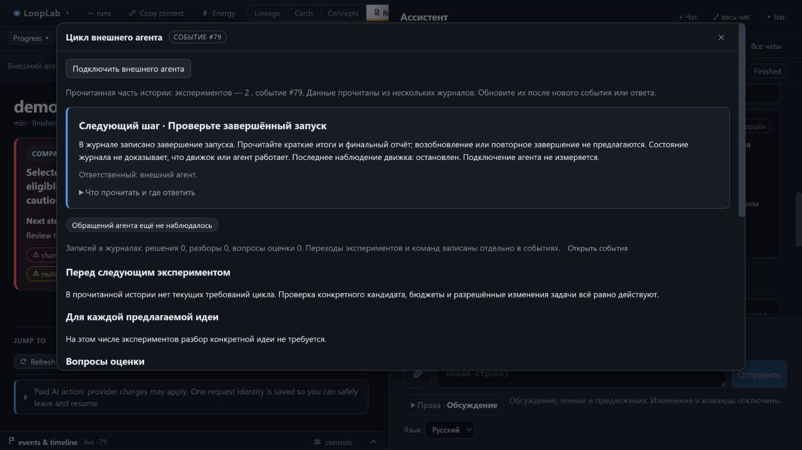

Измерения — [bundles.json](assets/72-core-stream/bundles.json), сравнение
начальных модулей — [initial-module-sets.json](assets/72-core-stream/initial-module-sets.json),
команды и ограничения — [validation.json](assets/72-core-stream/validation.json).
Большие OPEN §19.17 сохраняются, включая live MCP, onboarding acceptance,
manifest и lifecycle/delivery **worktree LoopLab**. Новых тренировок, model
calls, engine writes или owner-repo delivery в этом проходе не было. Публикация
этого изменения в master не является доставкой capabilities из LoopLab в
пользовательский task repo.

Документальные проверки — 28 passed; strict MkDocs и diff-check проходят.
Всего 2166 уникальных локальных тестов: 193 replay + 1945 UI + 28 docs.

### 20.45. Сбой читателя результатов сохраняет Assistant — 2026-10-04

**Ревью и воспроизведение.** Исходное дерево —
`7a5e943a66bcf8ce1eaa57c53e46f1e117b7e919`. Общий error boundary Assistant
ловил ошибки ленивых `AssistantResults` и `AssistantRunResult`, убирая весь чат
вместе с composer. Две проверки с реальным отклонённым dynamic import и настоящим
`OwnerWorkspace` до исправления падали на сохранении поля сообщения.

**Исправлено.** Лента completion notices и раскрываемое сравнение получили
отдельные `LazyBoundary`. Они показывают RU/EN loading/error и явную кнопку
перезагрузки приложения. Отложенный сбой этих блоков не переводит фокус из
composer. Черновик, соседний читатель и рабочая область сохраняются; закрытие
сравнения удаляет его локальную ошибку. Run/generation меняет identity boundary;
смена языка сохраняет зарегистрированную ошибку и не запускает скрытый retry.
Стандартный focus recovery остальных boundary сохраняется. Новых engine waits,
команд или автоматической отправки сообщения нет.

**Проверено.** Replay-first — 193 passed; полный UI suite — 1948 passed,
без fail/skip/cancel. Три новые проверки входят в этот suite: два отказа
реальных imports и default recovery при render failure. Проверены сохранение
draft/focus, независимость читателей, RU/EN, отсутствие POST, явный reload
callback, отсутствие retry при смене языка и восстановление на новой identity.
Прежние четыре теста disclosure/точных попыток также проходят. В полном suite
есть прежние Inspector/Conversation act warnings и deprecated test-utils act,
наблюдаемые и в логе исходного дерева; новые targeted tests этих warnings не дают.
Production build проходит.

В production-браузере private server отдавал **HTTP 503 только для JS asset
`AssistantRunResult`**, остальные assets и API обслуживались нормально.
У прежнего CPU `demo` осталось 79 событий и два terminal nodes. На FullHD после
отказа видны три completion notices, Report, поле сообщения с черновиком и
локальная RU ошибка сравнения. Client/scroll width блока — 939/939px.
Закрытие убрало alert и сохранило draft. После восстановления сервера и явной
перезагрузки появился reader с результатом; notices — три, alerts — ноль.
Журнал private server содержит только GET: model calls и engine writes не
выполнялись. Ожидаемая console error — failed dynamic import намеренно
отклонённого asset; безошибочная console для fault-сценария не заявляется.

Снимки при штатном 1280×720: [локальная ошибка и черновик](assets/72-result-failure/01-local-failure.jpg),
[восстановленный читатель](assets/72-result-failure/02-recovered.jpg).
Для снимка ошибки область прокручена явным клавиатурным переходом к reload;
это не автоматический focus/scroll приложения. Черновик очищен без отправки,
viewport возвращён, собственные вкладки закрыты, private server остановлен.

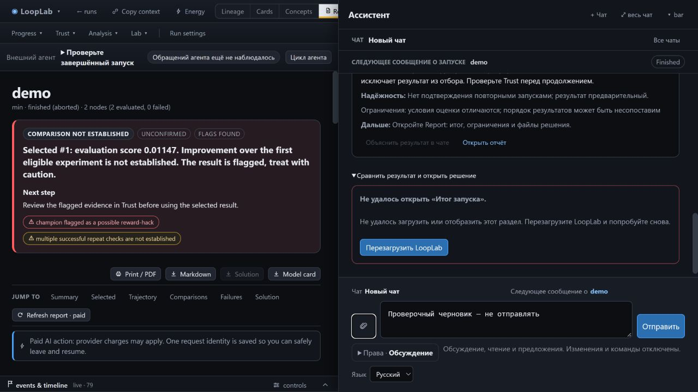

**Размеры и граница.** JS gzip 646143 → 646825 B (+682 B); initial shell
82513 → 82989 B; review DAG 267469 → 267981 B. CSS неизменен — 59635 B.
Total JS остаётся **12841 B** выше прежнего предела 633984 B. Все остальные
size/reachability/cycle и integer-boolean guards проходят; ceilings не повышены.
Full Agent cycle body остаётся вне static compact closure. O1 сохраняется OPEN.
Измерения — [bundles.json](assets/72-result-failure/bundles.json), команды,
сценарии и ограничения — [validation.json](assets/72-result-failure/validation.json).

Эта проверка покрывает два читателя результатов; все optional cards Assistant
и отказы их общих dependencies не объявляются полностью изолированными.
Большие OPEN §19.17 сохраняются: live MCP, onboarding acceptance, effective
manifest, lifecycle и доставка **worktree LoopLab** в пользовательский repo.
Нового обучения или приёмки repo delivery LoopLab здесь нет; весь doc72 не закрыт.

Документальные проверки — 28 passed; strict MkDocs и diff-check проходят.
Всего 2169 уникальных локальных тестов: 193 replay + 1948 UI + 28 docs.

### 20.46. Отказы первого запуска и вложенных подсказок — 2026-10-04

**Ревью и воспроизведение.** Исходное дерево —
`992f70d3b804235e6726ba6d8c3dce3ed366cb62`. После изоляции результатов оставались
пять lazy entrances первого запуска: `FirstRunModelStatus`, `NewRunStarter`,
`AssistantModelCheck`, `LaunchCard`, `LaunchGuidance`. Все пять real rejected
imports в настоящем `OwnerWorkspace` до исправления удаляли composer.
Особенно опасен отказ guidance после проверки плана: исчезала сама карточка
с validation receipt и действиями startup recovery.

**Исправлено.** Все пять entrances получили локальные `LazyBoundary` с RU/EN
loading/error, явной перезагрузкой и сохранением фокуса composer при позднем
сбое. Карточка предложения изолирована по прежнему session/message/proposal
draft key; текст сообщения остаётся доступен. Вложенная проверка связи сохраняет
статус модели и кнопку Settings. Вложенная guidance сохраняет карточку,
validation и startup recovery, показывая текущий technical notice при загрузке
и отказе. Изменение phase/notice или языка не является скрытым retry.
`loadingFallback` и `failureContent` позволяют сохранить этот актуальный статус;
default route/overlay recovery остаётся прежним. При явном reload сам validation
receipt не сохраняется: перед стартом нужна новая проверка плана.

**Проверено.** Replay-first — 193 passed; полный UI suite — 1954 passed,
без fail/skip/cancel. Пять новых import-fault tests проверяют draft/focus,
RU/EN, сохранение workspace/transcript и отсутствие неожиданных writes.
При guidance failure после preflight сохраняются тот же form и enabled Start.
Потерянный ответ о старте в protocol stub оставляет Check startup; GET использует
исходный idempotency key, POST start ровно один, повторный старт недоступен.
Текущий recovery notice продолжает отображаться внутри уже ошибочного блока.
Это проверка UI/protocol stub, не фактический запуск engine.

Добавлена поведенческая проверка pending overlay: Close и Escape закрывают
окно и возвращают фокус к opener. Сначала full suite поймал устаревший source
pin формы fallback; pin обновлён под условный fallback, затем полный suite
повторно прошёл. Прежние result, draft, launch, provider-operation, recovery
и permission tests входят в полный suite. Production build проходит.

**Production browser.** Создан private `SessionStore` с двумя явно написанными
offline fixture messages и quadratic toy proposal; это не ответ модели и не
ML run. Private server отдавал HTTP 503 только для manifest asset guidance.
Черновик и карточка сохранились. Реальный бесплатный preflight вернул 200:
checked preview, итоговые настройки и enabled Start видны; technical notice
сменился с review на validated. FullHD form client/scroll — 778/778px.
После нормального сервера и явного reload подсказка появилась, ошибок нет;
Start снова требует validation. Затем 503 для `FirstRunModelStatus` сохранил
NewRunStarter; «Есть код» подготовила редактируемый вопрос и сфокусировала
composer. В browser request log ровно один non-GET — `/api/start/preflight`.
Provider/model calls, POST start, engine writes и обучение не выполнялись.
Ожидаемые failed-import console errors не считаются чистой console.

Снимки при штатном 1280×720:
[checked plan при отказе guidance](assets/72-launch-failure/01-checked-plan.jpg),
[рабочие примеры и черновик при отказе setup](assets/72-launch-failure/02-model-setup-failure.jpg).
Ошибка guidance показана после явного клавиатурного перехода к кнопке; автоматическая
прокрутка не заявляется. Черновики очищены без отправки, выполнен возврат в чат,
viewport возвращён, собственная вкладка закрыта, private server остановлен.

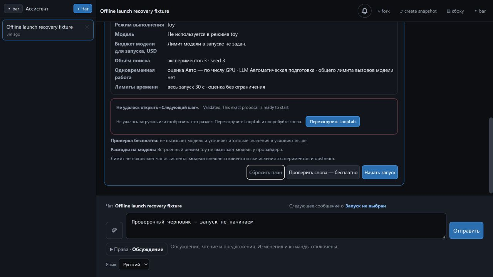

**Размеры и ограничения.** JS gzip 646825 → 646868 B (+43 B), initial shell
82989 → 83023 B, review DAG 267981 → 267979 B; CSS неизменен — 59635 B.
Total JS выше прежнего предела 633984 B на **12884 B**. Остальные size,
reachability/cycle и integer-boolean guards проходят; бюджеты не повышены,
full Agent cycle body остаётся dynamic. O1 остаётся OPEN. Измерения —
[bundles.json](assets/72-launch-failure/bundles.json), команды и ограничения —
[validation.json](assets/72-launch-failure/validation.json).

Это изоляция optional lazy entrances, не полное покрытие shared critical
dependency outages и любых render errors самого Assistant. Большие OPEN §19.17
сохраняются, включая live MCP, onboarding acceptance, effective manifest,
lifecycle и доставку **worktree LoopLab** в пользовательский repo. Browser
приёмка ambiguous real startup, новые тренировки и repo delivery здесь не проведены.

Документальные проверки — 28 passed; strict MkDocs и diff-check проходят.
Всего 2175 уникальных локальных тестов: 193 replay + 1954 UI + 28 docs.

### 20.47. Отказ содержимого Agent cycle сохраняет подключение — 2026-10-05

**Воспроизведение.** Исходный commit —
`0dbfb23b408d4c26617cce9e2ca0ed84b30cc97a`. У полного диалога внешний
overlay boundary уже был, но вложенный `HarnessCycleBody` имел только Suspense.
Ошибка импорта или отрисовки заменяла весь диалог общим load-failure overlay:
терялись заголовок запуска и инструкция подключения. Два live React теста с
настоящим Vite import/render fault до исправления подтверждают потерю исходного
dialog DOM node. Это не падение всего RunView.

**Исправлено.** Требования и история получили локальный `LazyBoundary` с RU/EN
ошибкой и явной перезагрузкой. Сохраняются оболочка, событие, отдельный вход в
подключение, Close/Escape и фокус оставшихся контролов. Ошибка прямо говорит,
что требования не показаны и перед решением нужен актуальный `harness-progress`.
Она не означает отсутствие обязательств или разрешение на следующий кандидат.
Boundary остаётся смонтированным при временном отсутствии progress во время
смены языка; reset identity — run/generation, без locale, seq и offset. Первый
вариант исправления допускал повторный render при locale refresh; тест поймал
это, окончательный вариант сохраняет состояние ошибки. Новые engine waits,
команды и изменения admission/finish semantics не добавлены.

**Проверено.** Replay-first — 193 passed. Полный UI suite — 1956 passed,
без fail/skip/cancel; он включает два новых fault tests. Они проверяют тот же
dialog DOM node, фокус, сохранённый черновик, RU/EN, отсутствие скрытого retry
при смене языка и обновлении progress, независимое чтение инструкции,
Close/Escape с возвратом фокуса к opener. Запросы теста — только GET.
Прежние stale/damaged/incomplete progress, checkpoint, handoff и result tests
входят в полный suite. Production build проходит.

**Production browser.** Private API обслуживал ранее измеренный demo из §19.17;
нового обучения не было. HTTP 503 введён только для manifest asset
`HarnessCycleBody`. Диалог, событие #79, кнопка подключения и черновик сохранились.
Настоящий `/harness-handoff` успешно открыл инструкцию с предупреждением об
отсутствующем scoped credential. Credential не создавался, MCP-клиент не
подключался. Escape закрыл диалог и вернул фокус к «Цикл агента», черновик остался.
После возвращения asset и явного reload требования/история открылись без alert.
Сохранение несохранённого черновика через полный reload не заявляется.

FullHD: dialog client/scroll 1098/1098px. Снимок — штатные 1280×720 после
возврата viewport. Оба browser request log содержат только GET; fault asset
прочитан с 503 ровно один раз. Временная вкладка закрыта, private servers
остановлены; команд, model calls и repo delivery не выполнялось.

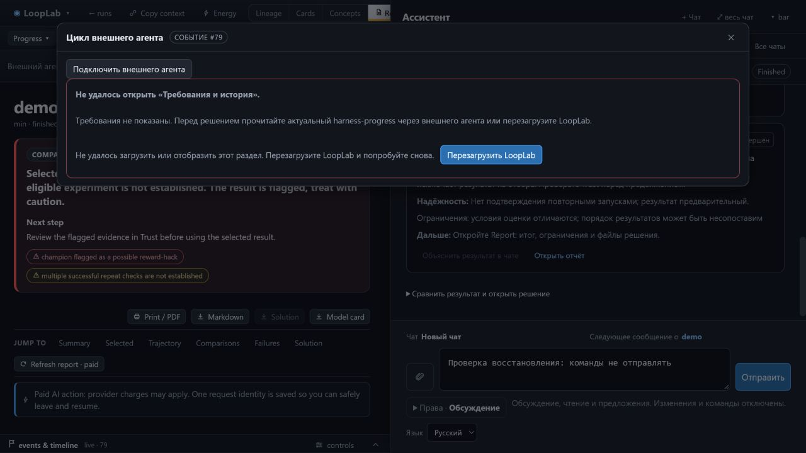

**Размеры и ограничения.** JS gzip 646868 → 647105 B (+237 B); compact panel
static closure 121123 → 121329 B, full body по-прежнему dynamic. CSS остаётся
59635 B. Общий JS превышает прежний предел 633984 B на **13121 B**; этот gate
остаётся red. Остальные size/reachability/cycle/integer-boolean guards проходят,
потолки не изменены. Измерения — [bundles.json](assets/72-cycle-failure/bundles.json),
команды и границы проверки — [validation.json](assets/72-cycle-failure/validation.json).

Изоляция относится к body полного Agent cycle. Ошибки самой оболочки, render
ошибки connection help и shared critical dependency outages здесь не покрыты.
Большие OPEN §19.17 сохраняются: live MCP, onboarding acceptance, effective
manifest, lifecycle/retention и доставка **worktree LoopLab** в пользовательский
репозиторий. Merge кода этого исправления не доказывает такую доставку.

Документальные проверки — 28 passed; strict MkDocs и diff-check проходят.
Всего 2177 уникальных тестов: 193 replay + 1956 UI + 28 docs.

### 20.48. Локальные отказы подключения и формы квитанции — 2026-10-05

**Ревью и воспроизведение.** Исходный commit —
`ed816b15e1f6f7bb9082df88e3ba03df879a1d25`. В §20.47 оставались render errors
`HarnessHandoff` и вложенного `HarnessReceipt`: обе ошибки доходили до внешнего
overlay boundary и заменяли весь Agent cycle. Два новых live React/Vite fault
сценария подтвердили исчезновение исходного dialog DOM node до исправления.
Обработка ошибки самого import в `HarnessConnection` уже была: она предлагает
явно повторить загрузку. Этот путь и его request/resource fencing сохраняются.

**Исправлено.** Готовый connection component получил отдельный `LazyBoundary`;
вложенная форма квитанции — свою границу. При ошибке handoff остаются оболочка,
требования, next step, журналы и вход в Events. При ошибке формы остаются также
проверенные инструкции и выбранный MCP-клиент. Ошибки RU/EN; identity run/generation
не включает locale или seq, поэтому refresh не является скрытым повтором reader.
Обычные `false`/`true` focus modes и default route/overlay recovery не изменены.

**Фокус.** Production browser дополнительно выявил потерю фокуса при первом
клике: кнопка подключения исчезала при замене готовым компонентом, а мгновенный
render failure оставлял `document.activeElement` на body. Новый opt-in
`focusOnFailure="if-lost"` возвращает фокус к recovery только если к моменту
animation frame он всё ещё потерян. Если оператор уже на другом контроле,
фокус сохраняется. Отдельный live тест до этой правки был red, после — green.
В браузере фокус при таком отказе теперь на «Перезагрузить LoopLab».

**Проверено.** Replay-first — 193 passed. Final полный UI suite — 1959 passed,
без fail/skip/cancel. Расширенный `harnessCycleFailure.test.js` содержит пять
сценариев: прежние body import/render, новые handoff/receipt render и начальный
отказ с исчезнувшим trigger. Проверены сохранность диалога и черновика, требования,
инструкции/client choice, поздний фокус на surviving control, RU/EN без скрытого
retry, Close/Escape с возвратом к opener. В начальном отказе запросов вообще нет;
остальные тестовые запросы — только GET. Существующие handoff stale fencing,
lookup original identity/header, provider recovery, result и launch tests входят
в полный suite. Целевые 16 tests — его подмножество, не дополнительный счётчик.

**Production browser.** В private build plugin внедрены условные render throws
в настоящие `HarnessHandoff`/`HarnessReceipt`; параметр private test URL выбирает
сценарий. Это инструментированная production сборка, а не HTTP 503 и не fault
код продукта. Private server и API читали прежний измеренный demo, event #79.
Отказ handoff сохранил next step/историю и черновик. Отказ receipt сохранил
инструкцию; выбор Claude Code поменял конфигурацию и показал client approval
guidance. Escape в обоих случаях вернул фокус к «Цикл агента» и сохранил черновик.
FullHD dialog client/scroll — 1088/1088px.

Затем server переведён на final сборку **без instrumentation**, выполнено новое
открытие: handoff, history и форма доступны, alerts — 0, Read saved receipt
disabled без исходного ID. Ничего не отправлялось. Оба browser request log
содержат только GET; provider calls, commands, engine work, scoped credential
setup и подключение MCP-клиента не выполнялись. Снимки — штатные 1280×720 после
возврата viewport; второй сделан после явного клавиатурного перехода к ошибке.
Временная вкладка закрыта, private servers остановлены.

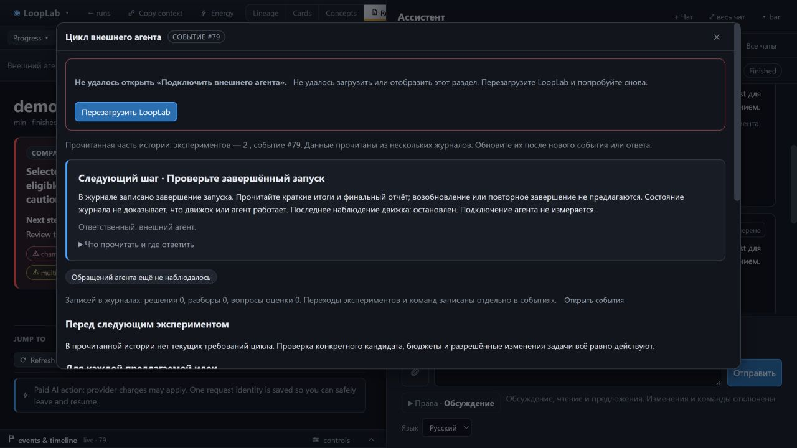

[Отказ формы при рабочей инструкции Claude](assets/72-connection-failure/02-receipt-render-failure.jpg).

**Размеры и ограничения.** Final JS gzip 647105 → 647308 B (+203 B), compact
panel closure 121329 → 121376 B. CSS — прежние 59635 B. Full body остаётся
dynamic. Total JS превышает прежний предел 633984 B на **13324 B**; gate
остаётся red. Остальные size/reachability/cycle/integer-boolean guards проходят,
потолки не изменены. [bundles.json](assets/72-connection-failure/bundles.json)
сравнивает только штатные baseline/final, исключая private fault build;
[validation.json](assets/72-connection-failure/validation.json) фиксирует команды
и границы проверки.

Это containment render errors, а не восстановление внутреннего состояния
упавшей формы: исходный ключ из неё и несохранённый черновик через reload не
объявляются сохранёнными. Импорт критических зависимостей/ошибка всей оболочки,
полный onboarding acceptance, live MCP, effective manifest и lifecycle/retention/
доставка **worktree LoopLab** в пользовательский repo остаются OPEN.

Документальные проверки — 28 passed; strict MkDocs и diff-check проходят.
Всего 2180 уникальных тестов: 193 replay + 1959 UI + 28 docs.

### 20.49. Успешное подключение инструкции сохраняет фокус — 2026-10-05

**Ревью и воспроизведение.** Исходный commit —
`1bde21ec7fe8e89f827848553a450486f259b991`. После защиты ошибок оставался дефект
нормального открытия: `HarnessConnection` заменял кнопку готовым handoff,
а фокус уходил на body. Это уже наблюдалось при normal-build проверке §20.48.
Существующий live тест открытия усилен проверкой реального фокуса: до правки
он red. Добавлен gated Vite import сценарий, в котором пользователь успевает
перейти к другому полю, пока модуль ещё загружается.

**Исправлено.** Явный click сохраняет origin DOM element вместе с run/generation
scope. Готовый `HarnessHandoff` получает origin только для того же scope и
передаёт фокус своему summary, если он ещё на trigger или потерян при его
удалении. Если другой контрол уже получил фокус, handoff его сохраняет.
Standalone handoff без явного origin не получает autofocusing. Обычные обновления
контекста и языка не создают новый focus intent. Перенос использует
`preventScroll`; существующие error boundaries и recovery defaults сохранены.
Это focus handoff, не подключение процесса MCP или измерение agent liveness.

**Проверено.** Replay-first — 193 passed; полный UI suite — 1960 passed,
без fail/skip/cancel. Целевые handoff, cycle failures, receipt и damaged/stale
requirements tests — 15 passed, подмножество полного набора. Проверка нормального
открытия подтверждает default-open summary focus и один generation-fenced GET.
При удержанном module import запросов к API нет; после перехода к другому input
загрузка сохраняет его фокус и текст, затем выполняет один GET handoff. Прежние
ошибки импорта/отрисовки, local focus recovery и original receipt lookup проходят.
Production build проходит.

**Production browser.** Штатная final сборка без instrumentation обслуживалась
private server с прежним demo, event #79. Enter открыл Agent cycle, затем
инструкцию. Фокус после замены trigger был на открытом summary даже пока API
ещё читался; появление инструкции само по себе не объявляется успешным MCP
подключением. После готового handoff Tab перевёл фокус к MCP client select.
Escape закрыл диалог и вернул его к «Цикл агента»; черновик остался.
FullHD client/scroll диалога — 1088/1088px; alerts — 0.

Browser log содержит только GET. Scope credential не настраивался, клиент MCP
не подключался, provider calls, commands, engine work, новые тренировки и repo
delivery не выполнялись. Временный черновик очищен без отправки, viewport
возвращён, собственная вкладка закрыта и private server остановлен.
Снимок при штатных 1280×720 показывает фокус на summary после открытия:

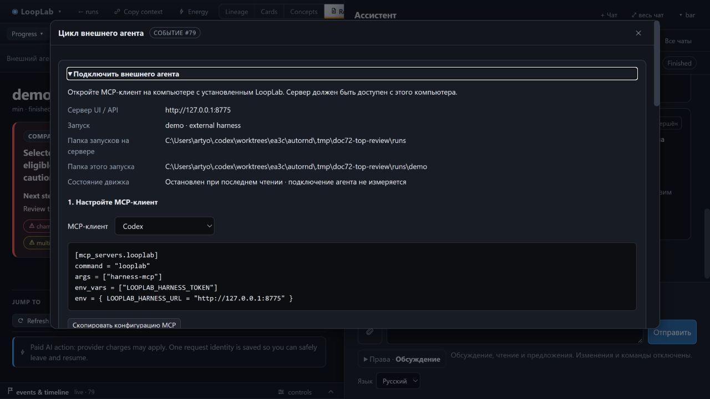

**Размеры и ограничения.** JS gzip 647308 → 647292 B (−16 B), compact panel
closure 121376 → 121411 B; CSS прежние 59635 B. Разница gzip всей сборки не
означает сокращение raw кода: raw JS вырос на 305 B. Full cycle body остаётся
dynamic. Total JS всё ещё превышает предел 633984 B на **13308 B**; этот gate
red. Остальные size/reachability/cycle/integer-boolean guards проходят, потолки
не изменены. [bundles.json](assets/72-connection-focus/bundles.json) и
[validation.json](assets/72-connection-focus/validation.json) фиксируют измерения.

Это исправление клавиатурного пути загрузки. Приёмка полного RU/EN onboarding,
live MCP, effective manifest, критические dependency outages и lifecycle/retention/
доставка **worktree LoopLab** в пользовательский repo остаются OPEN.
Задержка import проверена в live React/Vite; искусственный сетевой delay в
production browser здесь не вводился. Сохранение draft или original key через
полный reload не заявляется.

Документальные проверки — 28 passed; strict MkDocs и diff-check проходят.
Всего 2181 уникальный тест: 193 replay + 1960 UI + 28 docs.

### 20.50. Повреждённая квитанция HTTP 200 не становится verdict — 2026-10-05

**Ревью и воспроизведение.** Исходный commit —
`49299f114bce47925f69c91bed9754667e226fd6`. UI `HarnessReceipt.validReceipt`
проверял только тип и длину `event_type`: пустая строка, неизвестное событие
или engine outcome `node_evaluated` проходили как сохранённая команда. При
отсутствующих expected/returned generation равенство `undefined === undefined`
также проходило. Штатный server snapshot такие повреждённые записи отказывает,
а typed MCP проверяет control vocabulary; дефект был в браузерной проверке
неполного/искажённого HTTP 200. Усиленный live test до правки red на пустом событии.

**Исправлено.** Чистая модель `harnessReceiptModel.js` проверяет синтаксис
ожидаемой generation и точное членство в 34 control events. Сохранены v1,
command ID, известный status, строгое соответствие terminal, безопасный integer/null
sequence, error code до 256 символов и strict boolean retryable. Дополнительные
поля совместимы. Python guard сверяет UI events с `serve/protocol.py::CONTROL_EVENTS`;
новый server control потребует явного обновления клиента.

Неполный HTTP 200 не показывает verdict и снимает прежнюю сохранённую квитанцию.
Исходный ключ остаётся в форме, чтение повторяется только явно. Семантика
snapshot, retry, checkpoint, admission и finish не изменена; новый engine wait,
команда и worker restart не добавлены. Terminal `succeeded` для inject по-прежнему
доказывает admission, не обучение. Original key-to-ID derivation здесь остаётся
проверкой server; полная независимая идентификация браузером по ключу не заявляется.

**Проверено.** Replay-first — 193 passed. Final полный UI suite — 1963 passed,
без fail/skip/cancel. Три новых pure-model теста покрывают все control/status
partitions, null sequence, extra fields, отсутствующие/неверные поля, domain/unknown
event, неподходящие generation и requested command ID. Live React/Vite форма
получает HTTP 200 с `node_evaluated`: квитанция исчезает, input сохраняется,
выполняется один GET без скрытого повторения. Прежние явные reads, 409 refresh,
key в header, отсутствие storage записи и terminal caveats проходят.

Первый полный suite выявил прямой import `commandModel.js` вне разрешённого
API barrel. Финальная модель использует публичный `api.js`; исключение в
reachability allowlist не добавлялось. Suite повторён после изменения import.
Целевые 16 UI tests — подмножество полного счётчика.

Server snapshot/MCP shape/общий protocol vocabulary — 61 passed, включая новый
cross-language guard; отдельные 10 vocabulary tests не считаются повторно.
Документальные проверки — 28 passed. Production build, strict MkDocs и diff-check
проходят. Всего **2245 уникальных тестов**: 193 replay + 1963 UI + 61 receipt + 28 docs.

**Размеры и ограничения.** Штатная baseline/final сборка: JS gzip
647292 → 647718 B (+426 B), raw JS +512 B; CSS остаётся 59635 B. Compact
panel closure — 121411 → 121429 B; full body по-прежнему dynamic и отсутствует
в compact static closure. Total JS превышает прежний предел 633984 B на
**13734 B**. Только этот bundle gate red; остальные size/reachability/cycle/
integer-boolean guards проходят, потолки не менялись.
[bundles.json](assets/72-receipt-validation/bundles.json) и
[validation.json](assets/72-receipt-validation/validation.json) фиксируют измерения.

Новой production browser сессии, MCP connection, provider calls, обучения,
публикации команд и доставки из **worktree LoopLab** в пользовательский task repo
не было. Это исправление достоверности чтения формы. Общие OPEN §19.17 —
полная пользовательская приёмка recovery/onboarding, effective manifest,
lifecycle/retention и target-relative delivery — сохраняются.

### 20.51. Восстановление привязано к исходному ключу и контексту — 2026-10-05

**Ревью и воспроизведение.** Исходный commit —
`f3f4076b06a7a84fc01640daf6be9dec010ca32a`. §20.50 оставил браузерный поиск по
original key зависимым от server identity check. Если HTTP 200 содержал корректно
оформленную квитанцию другой команды, UI принимал её: ID проверялся только в
режиме поиска по ID. Также сам `HarnessReceipt` не сбрасывал hooks при смене
run/generation: старые input/lookup могли перейти в новый контекст и вызвать
неявный GET. Нормальный handoff уже передавал scope key; новый guard защищает
саму форму независимо от caller. Два live React теста до правки red — чужой
receipt ID показывался, исходный ключ сохранялся после смены run.

**Исправлено.** Перед key lookup браузер получает ожидаемый `cmd_` ID: первые
128 бит SHA-256 от исходных UTF-8 bytes, как `serve/command_identity.py`.
Пробелы и Unicode не нормализуются; повторно используется существующий bounded
UTF-8 hash helper `authoringTextRevision`. Ответ должен соответствовать этому ID
и generation вместе со всеми field guards §20.50. Hash и GET входят в один
resource deadline. После hash проверяется AbortSignal: поздний hash не отправляет
ключ уже отменённого чтения.

Без доступного secure hash браузер не делает key GET и показывает RU/EN путь:
найти исходный Command ID в Events и явно прочитать по нему. Key остаётся в форме
до выбора режима; автоматического fallback, свежего ключа, worker restart,
retry/resume нет. Поиск по ID доступен без Web Crypto. Ошибка чтения снимает старый
verdict. Terminal/admission/training и engine waits не изменены.

Внутренняя форма имеет run/generation identity: при смене контекста old read
отменяется, input, lookup и режим сбрасываются. Поздний HTTP response не показывает
старую квитанцию и не создаёт новый GET. Смена языка в том же контексте сохраняет
input и меняет подсказку без чтения. Сохранение ключа через полный reload не добавлено.

**Проверено.** Replay-first — 193 passed. Полный UI suite — 1967 passed,
без fail/skip/cancel. Live tests проверяют чужой ID в HTTP 200, one-shot GET без
key в URL/storage, explicit recovery, отсутствие Web Crypto с RU/EN и рабочим
ID lookup, смену run/generation при позднем HTTP и hash. Последний сценарий
подтверждает ноль GET после отменённого hash. Существующие language/focus/render
failure и saved receipt shape сценарии входят в полный набор.

Общий synthetic fixture `tests/data/command_identity_vectors.json`
не содержит реальных ключей. Он покрывает ASCII, неизменённые пробелы, Unicode,
composed/decomposed text и 512-character key. Python проверяет значения через
реальный server `command_identity`, JS — через real Web Crypto и production
helper; unpaired surrogate и missing crypto отвергаются. Server snapshot/MCP
shape/vocabulary набор — 62 passed. Документальные проверки — 28 passed;
production build, strict MkDocs и diff-check проходят.
Всего **2250 уникальных тестов**: 193 replay + 1967 UI + 62 receipts + 28 docs.

**Размеры и границы.** JS gzip 647718 → 647878 B (+160 B), raw JS +861 B;
CSS прежние 59635 B. Compact panel closure 121429 → 121425 B; full body остаётся
dynamic и отсутствует в compact static closure. Total JS превышает прежний
предел 633984 B на **13894 B**; только этот bundle gate red. Остальные size/
reachability/cycle/integer-boolean guards проходят, ceilings не менялись.
[bundles.json](assets/72-receipt-identity/bundles.json) и
[validation.json](assets/72-receipt-identity/validation.json) фиксируют проверки.

Новой production browser сессии, MCP connection, provider call, обучения или
команд не было. Unicode vectors проверяют алгоритм; они не расширяют допустимые
HTTP header characters. OPEN §19.17 сохраняются для полной приёмки onboarding/
recovery, effective manifest, lifecycle/retention и доставки **worktree LoopLab**
в пользовательский task repo. Merge кода этого исправления не доказывает такую доставку.

### 20.52. Повторное чтение сразу снимает прежнюю квитанцию — 2026-10-05

**Ревью и воспроизведение.** Исходный commit —
`00e5e2c805de4e883d56b5f2d56c0e4edf3a9772`. После успешного lookup повторное
явное чтение той же identity сохраняло old resource data. Во время pending
показывались одновременно «Reading saved receipt» и прежняя квитанция, включая
её retryable guidance. При AbortError shared resource cancellation могла снова
показать старый verdict. Это UI freshness defect; нового разрешения на command
retry в engine не возникало. Новый live React тест до правки red на сохранённой
квитанции после начала reread.

**Исправлено.** Explicit reread использует существующий
`resource.retry({ mapLastGood: () => null })`: старая квитанция снимается при
начале наблюдения. Timeout, abort и поздний ответ не восстанавливают её. Новая
квитанция появится только после успешного явного чтения с прежними identity/field
guards. Form input, focus, оригинальный ID/key, one-shot GET и deadline остаются;
нет автоматического worker restart, command retry, resume или engine wait.
Shared resource model и поведение других readers не менялись.

**Проверено.** Replay-first — 193 passed. Final полный UI suite — 1968 passed,
без fail/skip/cancel. Новый live scenario начинает с terminal failed/retryable
квитанции, затем держит настоящий fetch stub. При reread исчезают verdict и
guidance, input/focus сохраняются. Node mock timers двигают существующий
15-second deadline: за 1 ms до него остаётся pending, на границе показана
недоступность и кнопка чтения снова доступна. Late succeeded reply после timeout
не показывает verdict и не повторяет GET. Explicit fresh read восстанавливает
правильную квитанцию; следующий AbortError не возвращает предыдущую. Запросы —
только GET. Clock не заменён коротким реальным timeout. Целевые 24 UI tests —
подмножество полного счётчика.

Документальные/API/diagram проверки — 28 passed; production build, strict MkDocs
и diff-check проходят. Всего **2189 уникальных тестов**: 193 replay + 1968 UI + 28 docs.
Server/MCP protocol suites из §20.51 повторно не заявляются: transport, schema,
server validation и key derivation здесь не менялись.

**Размеры и ограничения.** JS gzip 647878 → 647793 B (−85 B), raw JS +22 B;
малая разница gzip не означает сокращения исходного кода. CSS прежние 59635 B.
Compact panel closure 121425 → 121421 B; full body по-прежнему dynamic и
отсутствует в compact static closure. Total JS превышает прежний предел
633984 B на **13809 B**. Только этот bundle gate red; остальные size/reachability/
cycle/integer-boolean guards проходят, ceilings не менялись.
[bundles.json](assets/72-receipt-freshness/bundles.json) и
[validation.json](assets/72-receipt-freshness/validation.json) фиксируют проверки.

Новой production browser сессии, MCP connection, provider call, обучения,
команд или доставки из **worktree LoopLab** в пользовательский task repo не было.
Это проверка freshness формы через live React/Vite, не полная приёмка пользователя.
OPEN §19.17 сохраняются для полного onboarding/recovery, effective manifest,
lifecycle/retention и target-relative delivery.

### 20.53. Общие pure models в production split — 2026-10-05

**Ревью.** Исходный commit — `c7b53028f0c69b67bf42f0b52b18ea9b6bdb2d4c`.
O1 из §19.17 оставался открыт: total JS gzip превышал лимит на 13809 B.
Инвентаризация production modules не обнаружила второй копии React/graph library.
Пробы формата minifier не дали экономии: ascii-only увеличивал gzip, single quotes
и переносы строк его не уменьшали. Unsafe minification, зависимости и ceilings
не менялись. Вместо этого измерены последовательные группы общих pure helpers.

**Изменено.** 17 моделей/hooks для языка, provenance, восстановления, черновиков,
метрик и поиска объединены с уже существующим `run-support`. Capture dependencies
остаётся нерекурсивным. Панели, owner workflows, graph и полный Agent cycle не
включены в эту группу. Новая проверка строит настоящий minified client и нативно
импортирует все non-bootstrap JS chunks: SSR/dev module runner не воспроизводит
порядок их клиентской инициализации. Разрешено только чтение built SVG icon sprite;
любой API/другой network request проваливает тест. Main bootstrap отдельно проверен
настоящим production браузером, поскольку его импорт запускает приложение.

**Измерение и компромисс.** Total JS gzip **647793 → 643924 B (−3869 B)**,
raw JS 2019687 → 2017309 B (−2378 B). CSS gzip прежние 59635 B. Initial shell
83077 → 82948 B, owner DAG 401627 → 399451 B. Общий helper chunk означает более
широкие static closures некоторых экранов: owner List 211076 → 216865 B,
Claims & Curation 189182 → 195718 B, Concepts 256761 → 258130 B; compact Agent
panel 121421 → 129470 B (+8049 B). Это экономия общего gzip и числа compression
streams, не обещание ускорить каждый экран. Full cycle body остаётся dynamic и
не входит в compact closure. Все отдельные route/size/forbidden reachability/
static-cycle/integer-boolean guards проходят. Total JS gate по-прежнему **red**:
**9940 B** сверх прежнего лимита 633984 B. O1 не закрыт, бюджет не повышен.
Все route closures сохранены в [bundles.json](assets/72-bundle-shared/bundles.json).

**Проверено.** Replay-first 193 passed; полный UI suite 1969 passed без fail,
skip или cancel; docs/API/surface/diagram 28 passed. Всего **2190 уникальных
тестов**. Production build, strict MkDocs и diff-check проходят. Новая native
client проверка входит в UI счётчик, не прибавляется повторно.

Production browser на частном localhost API и сохранённой measured fixture
§19.17: 79 событий, два оценённых эксперимента и один recorded run-base advance.
FullHD 1920×1080: Report с score/caveats/base evidence, Lineage с двумя nodes,
Concepts с честным empty projection, RU Agent cycle с requirements/history и
явно открываемыми connection/recovery instructions. Пустой receipt input не
разрешает GET lookup. Escape закрывает диалог и возвращает фокус к trigger;
черновик Assistant сохраняется, горизонтального overflow нет. Console warn/error
пуст, 121 HTTP request — только GET, все успешны. Default viewport восстановлен,
частная вкладка и сервер закрыты. [Снимок production UI](assets/72-bundle-shared/production-report.png)
и [validation.json](assets/72-bundle-shared/validation.json) сохраняют границы проверки.

Новое обучение, MCP connection, provider call, command submission или доставка
из **worktree LoopLab** в пользовательский task repo не выполнялись. Это проверка
split/runtime и сохранённых результатов, не полный onboarding/recovery acceptance.
OPEN effective manifest, lifecycle/retention и target-relative delivery из §19.17
сохраняются. Merge этой правки в master продукта не является такой доставкой.

### 20.54. Карточка проверки не выбирает старый pass из перепутанной истории — 2026-10-05

**Воспроизведение.** Исходный commit — `6c12b47655d05f1a8e44c76f11cbc30a34b0176f`.
`upstreamCheckSummary` выбирал последний start по позиции в массиве, проверяя
seq лишь выбранного claim и его finish. История `[новый start #20, старый start
#10, старый passed #12]` снова показывала старый `passed`, executions и cost.
Proposal summary уже отказывал при нарушении порядка, но независимая сводка
проверки в общей карточке этой защитой не пользовалась. Ещё один дефект: поздний
finish старого claim после нового start признавался связанным по одному action ID,
хотя proposal/request hash/input identity могли не совпадать. Это ошибочное
чтение диагностики UI; сервер не выдавал нового разрешения на advance.

**Исправлено.** Перед выбором последнего claim проверяются seq всех строк:
неотрицательные safe integers, строго возрастающие. Пропуски seq разрешены —
upstream projection содержит лишь часть типов событий. Reorder, duplicate,
missing/string/NaN/negative seq дают `unknown`, старый pass/cost не выводятся.
Позднее завершение после latest start должно совпасть с собственным исходным
claim по action, proposal, request hash и result input identity. Нормальное
позднее завершение старого claim не вытесняет новый unfinished. Поведение
abandonment, original recovery identity и явных read-before-write не ослаблено.

**Проверено.** Три новые регрессии red до исправления, green после: bad sequence
matrix, mismatched older settlements и live RU rerender passing → unavailable.
Live React карточка сохраняет фокус кнопки Assistant; запросов нет. Целевые
17 tests входят в полный UI suite, не прибавляются отдельно. Replay-first —
193 passed; полный UI — 1972 passed, без fail/skip/cancel; docs/API/surface/diagram
— 28 passed. Всего **2193 уникальных теста**. Production build, native minified
chunk initialization test, strict MkDocs и diff-check проходят.

JS gzip **643924 → 643948 B (+24 B)**; raw +176 B. CSS прежние 59635 B.
Total JS остаётся единственным red bundle gate: **9964 B** сверх неизменённого
лимита 633984 B. Все остальные size/reachability/cycle/integer-boolean guards
проходят; compact full-cycle body по-прежнему dynamic. Размеры —
[bundles.json](assets/72-check-history/bundles.json), границы проверки —
[validation.json](assets/72-check-history/validation.json).

Это проверка повреждённой UI projection, не воспроизведение повреждения
серверного event log. Свежего browser прохода, MCP connection, provider call,
обучения, command submission или доставки из **worktree LoopLab** в task repo
в этом increment нет. Production browser из §20.53 не заявляется повторно.
OPEN §19.17 по цельному onboarding/recovery, effective manifest, retention,
target-relative delivery и полному CI сохраняются.
