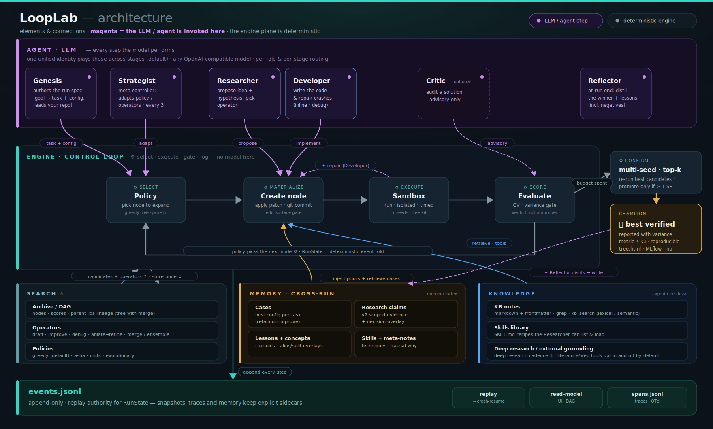

---
hide:
  - toc
---

# Architecture at a glance

Two views of the **whole agent**: a **single-schema one-pager** for the mental model, and a
**full interactive infographic** for the deep dive — both grounded in the configuration that ships
**enabled by default**.

## The one-pager

Three planes and their connections. **Magenta = where the LLM / agent is invoked** (Genesis,
Strategist, Researcher, Developer, Critic, Reflector); the **engine** plane is deterministic
(select · execute · gate · log); and the **stores** — Search, Memory, Knowledge — feed the loop,
all over the append-only `events.jsonl` spine.

## The interactive infographic

The lifecycle, one loop iteration keyed to the real event kinds, every subsystem, the four cross-run
memory types, and an honest board of what is **on**, **off**, or **dormant until `backend=llm`**.

[:material-open-in-new: Open the infographic full-screen](../infographic/agent-architecture.html){ .md-button .md-button--primary .ll-open target="_blank" }

  <iframe src="../../infographic/agent-architecture.html"
          title="LoopLab agent architecture and workflow infographic"
          loading="lazy"></iframe>

!!! note "How to read it"

    The color advances with a candidate as it moves through the four roles. Two edges break the
    circle: a **repair ↺** loop (a crash or timeout is fed back with its stderr) and a **merge**
    branch (two strong lineages fused into one multi-parent child). The central **Policy** hub selects
    which node to expand next; the optional **Strategist** re-tunes policy, operators and fidelity
    every few nodes.

## Where each piece lives in the code

| Concept | Module |
|---|---|
| Control loop + crash-resume | `engine/orchestrator.py` |
| Append-only log · pure fold · SQLite read-model | `events/eventstore.py`, `events/replay.py`, `events/readmodel.py` |
| Researcher / Developer / unified agent | `agents/roles.py`, `agents/unified_agent.py` |
| Search policies · operators | `search/policy.py`, `search/operators.py` |
| Sandbox seam (subprocess / Docker) | `runtime/sandbox.py` |
| Variance gate · multi-seed confirmation · CV · leakage | `trust/gate.py`, `trust/confirm.py`, `trust/cv.py`, `trust/leakage.py` |
| Cross-run memory · retrieval · harmonic index | `engine/memory.py`, `tools/retrieval.py`, `tools/memora.py` |
| Trace span exporter | `core/tracing.py` |

For the narrative behind each box, read **[Concepts](concepts.md)**; for the full design rationale and
decision records, see the **[Architecture spec](../02-architecture.md)** and the
**[Design records index](../00-INDEX.md)**.
