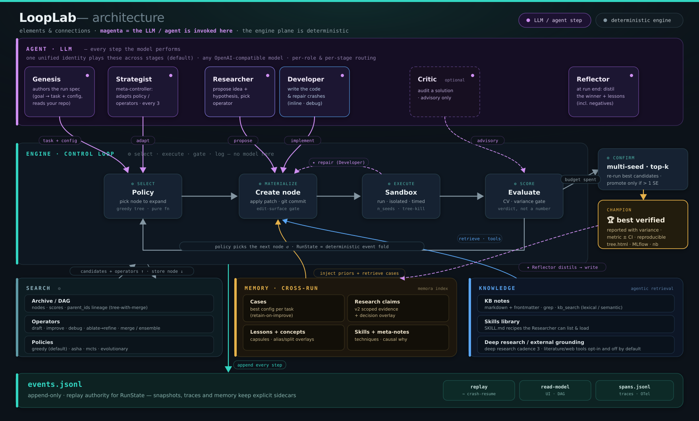

---
hide:
  - toc
---

# Architecture at a glance

Two **capability maps** of the engine: a **high-level one-pager** for the mental model, and a
**detailed process diagram** covering the main stages, agents, memory tiers and trust controls.
They are navigation aids, not an exhaustive executable specification. Where shown, status labels
distinguish shipped defaults from opt-in and off-by-default capabilities; the configuration and
event contracts remain the authority for a particular run.

## The one-pager

Three planes and their connections. **Magenta = where the LLM / agent is invoked** (Genesis,
Strategist, Researcher, Developer, Critic, Reflector); the **engine** plane owns deterministic
selection/folding around the append-only `events.jsonl` spine; and the **stores** — Search, Memory,
Knowledge — feed the loop through explicit event, snapshot and sidecar contracts. The event log is
authoritative for replayable `RunState`, not for every value shown in the product.

## The full process diagram

A boxes-and-arrows flowchart of one turn of the engine and its main adjacent systems. Read the top row
left→right: **Propose → Novelty stage → Implement → Evaluate → Score · Trust → Refine**, then loop.
Under each stage sit its detail boxes (the memory funnel under Propose, the trust/confirm stack under
Score, …); the **Card lifecycle board** (1 card = 1 hypothesis), **cross-run memory**
(write → hygiene → the five tiers) and the
**event spine** hang below. Colour = which agent acts.

[:material-open-in-new: Open the diagram full-screen](../infographic/agent-architecture.html){ .md-button .md-button--primary .ll-open target="_blank" }

  <iframe src="../../infographic/agent-architecture.html"
          title="LoopLab full process diagram"
          loading="lazy"></iframe>

!!! note "How to read it"

    **Solid teal arrows** are the main loop; **thin dashed arrows** are feedback / memory reads &
    writes. Two edges break the circle: a **repair ↺** loop (a crash/timeout is fed back with its
    stderr, fixed in place) and a **merge** branch (two strong lineages fused into one multi-parent
    child). The **research board** (cards; 1 card = 1 hypothesis) is *derived on every fold* — beliefs
    are deduped (exact hash + an agentic paraphrase merge), prioritized (foresight), and tracked to a
    verdict. The base
    cross-run memory paths and reflection priors are **on by default** (`~/.looplab/memory` +
    `~/.looplab/knowledge`). Product `Settings` also enable the Part-IV concept, advisory and
    structured-claim reads by default; only callers that construct bare `EngineOptions` directly
    retain the lower-level opt-in defaults.
    A run with an eligible best result can write a case and reflection artifacts, while only a
    supported improving hypothesis can seed an auto-skill. Later matching runs may retrieve the
    applicable records. A model-authored meta-note is an explanatory hypothesis over recorded
    observations, not causal proof.

    Parallel work has two canonical axes: `eval_parallel` admits experiments, while a **positive
    canonical** `llm_parallel` activates a shared provider-call total. Only that positive canonical
    value turns the ceiling on — unset, legacy-only, or a launch-time `0` bounds build fan-out
    *without* a shared provider-call total, so research overlap is not counted against one budget.
    When active, a run-local broker divides the LLM total among `build`, `deep_research`,
    `novelty_dedup`, `enrichment`, and the fail-safe `engine` lane. The Strategist can durably
    reallocate both totals and that lane map; operator pins win. Three of those lanes
    (`deep_research`, `novelty_dedup`, `enrichment`) are capped at one concurrent request with or
    without a total — a cap that describes the PRODUCER, so a lane earns it only when everything in
    it runs beside the main task with nothing blocked on its latency. Foreground engine work that is
    not a build (the per-eval repair loop, the per-eval inter-stage check) belongs in the uncapped
    `engine` lane, and `core/llm_broker.py::BACKGROUND_LANE_PRODUCERS` enforces the split.

    GPU packing is concurrent inside one Run. Separate local Engine processes that share an OS-user
    filesystem namespace conservatively serialize GPU ownership through one crash-released pool lease;
    this avoids treating ordinal, GPU-UUID, and MIG aliases as different hardware. Different OS users,
    containers, or hosts do not share that lease and require an external scheduler. Because that lease
    is pool-wide, a blocked wait is announced — the lease file and the holding process id — rather than
    looking like a stalled Run.

    An **undeclared** footprint resolves against the task as well as the box. A task adapter may
    declare itself CPU-locked (`gpu_capable() -> False`; the shipped toy, regression, classification,
    timeseries and offline MLE-bench adapters do, because their solution code is a numpy/stdlib
    template or their brief forbids anything else); an undeclared footprint on such a task reserves
    nothing and never touches the pool lease, so an offline quadratic run cannot queue behind a
    neighbour's training job. Absent that declaration the task is assumed GPU-capable and the
    historical rule stands, and an explicit `footprint.gpus` always outranks the adapter's answer.

    Admission scans the queue for the first experiment whose complete footprint fits *now*, so an
    explicit CPU-only node behind a GPU-heavy one still starts. That is work-conserving but not fair
    on its own: a steady stream of one-GPU jobs consumes every partial release, and a wide request can
    wait for all of its GPUs to be free at the same instant forever. After **3** consecutive bypasses
    the queue head therefore takes exclusive claim on releases until it is admitted — or until the
    pool has drained completely and it still does not fit, which proves it wants more than the box
    has and hands the queue back to the jobs behind it rather than wedging the batch.

    An evaluation's resources are released when its process group is empty, not merely when the
    command exited: a metric-producing parent that leaves a descendant running would otherwise keep
    the GPU while the scheduler hands it to the next node. The sweep runs while the child is still an
    un-reaped zombie, so its process group id cannot have been recycled onto an unrelated process.
    A child that ended up in the *engine's own* process group (no new session) is swept per-PID
    instead, so the group syscall that would take the engine down with it is never issued — the tree
    still dies, just by a route that cannot overshoot.

## Where each piece lives in the code

| Concept | Module |
|---|---|
| Control loop + crash-resume | `engine/orchestrator.py` |
| Append-only log · pure fold · SQLite read-model | `events/eventstore.py`, `events/replay.py`, `events/readmodel.py` |
| Researcher / Developer / unified agent | `agents/roles.py`, `agents/unified_agent.py` |
| Canonical eval/LLM concurrency + named-lane broker | `engine/orchestrator.py`, `core/llm_broker.py`, `engine/strategy.py` |
| Card model · identity digests/receipts · replay/public projection · selection | `core/cards.py`, `events/card_ledger.py`, `serve/public_cards.py`, `search/card_selection.py` |
| Resource admission · GPU lifecycle reservations | `engine/resources.py`, `core/hardware.py` |
| Speculative Card producer/consumer · freshness/quality gates | `engine/speculation.py`, `search/speculation_quality.py`, `search/speculation_calibration.py` |
| Foresight (belief-card prioritization, predict-before-execute) | `search/foresight.py` |
| Hybrid retrieval + agent-decided merge (lessons & Card belief board) | `search/hybrid_merge.py` |
| Search policies · operators | `search/policy.py`, `search/operators.py` |
| Part IV/V concept materialization · graph · bounded frame | `core/concepts.py`, `search/concept_projection.py`, `search/concept_graph.py`, `serve/concept_frame.py` |
| Repo Developer: env-inspector + auto-validate | `tools/env_inspect.py`, `adapters/repo_write_tools.py` (re-exported via `repo_developer.py`) |
| Sandbox seam (subprocess / Docker) · built-in eval watchdogs (loss/grad divergence · stall) | `runtime/sandbox.py` |
| Training-log monitor (product `Settings`: watcher on **and** early-kill on — `train_monitor_kill=True`; bare `EngineOptions`: both off; the verdict is advisory until the kill switch is on, and then only a `broken` verdict at ≥ `train_monitor_kill_confidence`, about a log the eval plan can PROVE is the run's own training — the single-command `eval.log` or a one-stage pipeline, never a stage of a multi-stage pipeline — CONFIRMED by a second consecutive parseable tick, acts) | `engine/train_monitor.py` |
| ASHA live-curve watchdog: deterministic same-resource rank as EVIDENCE, LLM judge as the stop DECISION (consulted only inside the rank gate, so it can only narrow the stop set) | `engine/asha_monitor.py` |
| Variance gate · multi-seed confirmation · CV · leakage · reward-hack | `trust/gate.py`, `trust/confirm.py`, `trust/cv.py`, `trust/leakage.py`, `trust/reward_hack.py` |
| Cross-run memory · retrieval · harmonic index | `engine/memory.py`, `engine/lessons.py`, `tools/memora.py` |
| Cross-run index · claims · taxonomy/claim governance | `engine/cross_run_index.py`, `engine/claims.py`, `engine/concept_registry.py`, `engine/governance_health.py` |
| Paid proposal steward lifecycle — two at-most-once transactions over the same three ledgers: `curation_protocol.py` is the unattended FINALIZE one (semantic content-digest key, side-file claim), `steward_invocation.py` the on-demand HTTP/CLI one (operator `action_id`, in-ledger `begun` claim) | `engine/curation_protocol.py`, `engine/steward_invocation.py`, `engine/concept_steward.py`, `engine/claim_steward.py`, `engine/task_facets.py` |
| Research Atlas / owner governance API · UI | `serve/routers/cross_run.py`, `ui/src/ResearchAtlas.jsx`, `ui/src/researchAtlasModel.js` |
| Trace span exporter | `core/tracing.py` |

For the narrative behind each box, read **[Concepts](concepts.md)**; for the full design rationale and
decision records, see the **[Architecture spec](../02-architecture.md)** and the
**[Design records index](../00-INDEX.md)**.
