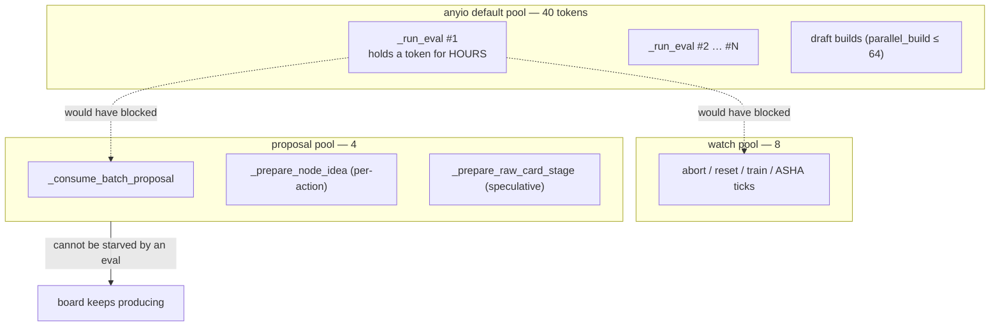
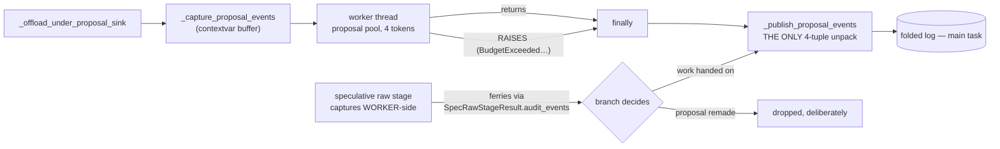
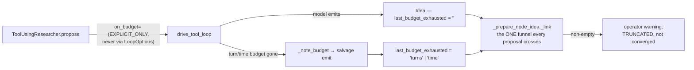
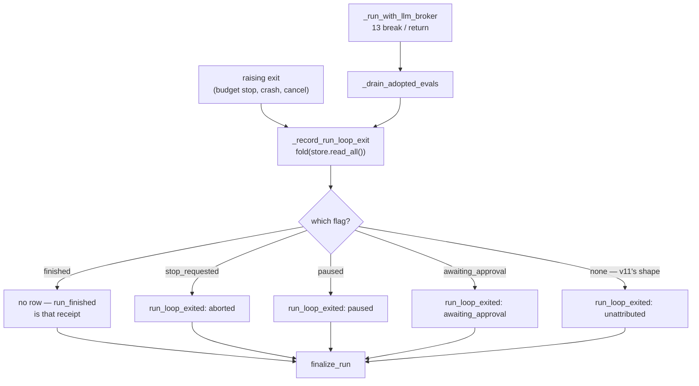
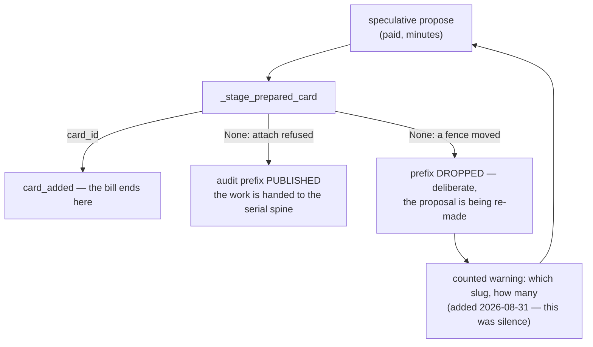
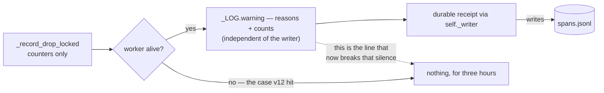

---
hide:
  - toc
---

# Architecture at a glance

Two **capability maps** of the engine: a **high-level one-pager** for the mental model, and a
**detailed process diagram** covering the main stages, agents, memory tiers and trust controls.
They are navigation aids, not an exhaustive executable specification. Where shown, status labels
distinguish shipped defaults from opt-in and off-by-default capabilities; the configuration and
event contracts remain the authority for a particular run.

## The one-pager

Three planes and their connections. **Magenta = where the LLM / agent is invoked** (Genesis,
Strategist, Researcher, Developer, Critic, Reflector); the **engine** plane owns deterministic
selection/folding around the append-only `events.jsonl` spine; and the **stores** — Search, Memory,
Knowledge — feed the loop through explicit event, snapshot and sidecar contracts. The event log is
authoritative for replayable `RunState`, not for every value shown in the product.

## The full process diagram

A boxes-and-arrows flowchart of one turn of the engine and its main adjacent systems. Read the top row
left→right: **Propose → Novelty stage → Implement → Evaluate → Score · Trust → Refine**, then loop.
Under each stage sit its detail boxes (the memory funnel under Propose, the trust/confirm stack under
Score, …); the **Card lifecycle board** (one Card per work item, with `belief_id` grouping retries or
other work items that test the same hypothesis), **cross-run memory**
(write → hygiene → the five tiers) and the
**event spine** hang below. Colour = which agent acts.

[:material-open-in-new: Open the diagram full-screen](../infographic/agent-architecture.html){ .md-button .md-button--primary .ll-open target="_blank" }

  <iframe src="../../infographic/agent-architecture.html"
          title="LoopLab full process diagram"
          loading="lazy"></iframe>

!!! note "How to read it"

    **Solid teal arrows** are the main loop; **thin dashed arrows** are feedback / memory reads &
    writes. Two edges break the circle: a **repair ↺** loop (a crash/timeout is fed back with its
    stderr, fixed in place) and a **merge** branch (two strong lineages fused into one multi-parent
    child). The **research board** (Card work items plus an explicit belief grouping) is *derived on every
    fold* — beliefs
    are deduped (exact hash + an agentic paraphrase merge), prioritized (foresight), and tracked to a
    verdict. The base
    cross-run memory paths and reflection priors are **on by default** (`~/.looplab/memory` +
    `~/.looplab/knowledge`). Product `Settings` also enable the Part-IV concept, advisory and
    structured-claim reads by default; only callers that construct bare `EngineOptions` directly
    retain the lower-level opt-in defaults.
    A run with an eligible best result can write a case and reflection artifacts, while only a
    supported improving hypothesis can seed an auto-skill. Later matching runs may retrieve the
    applicable records. A model-authored meta-note is an explanatory hypothesis over recorded
    observations, not causal proof.

    Parallel work has two canonical axes: `eval_parallel` admits experiments, while a **positive
    canonical** `llm_parallel` activates a shared provider-call total. Only that positive canonical
    value turns the ceiling on — unset, legacy-only, or a launch-time `0` bounds build fan-out
    *without* a shared provider-call total, so research overlap is not counted against one budget.
    When active, a run-local broker divides the LLM total among `build`, `deep_research`,
    `novelty_dedup`, `enrichment`, and the fail-safe `engine` lane. The Strategist can durably
    reallocate both totals and that lane map; operator pins win. Three of those lanes
    (`deep_research`, `novelty_dedup`, `enrichment`) are capped at one concurrent request with or
    without a total — a cap that describes the PRODUCER, so a lane earns it only when everything in
    it runs beside the main task with nothing blocked on its latency. Foreground engine work that is
    not a build (the per-eval repair loop, the per-eval inter-stage check) belongs in the uncapped
    `engine` lane, and `core/llm_broker.py::BACKGROUND_LANE_PRODUCERS` enforces the split.

    An evaluation outlives the turn that admitted it. The eval task group belongs to the Run, not to
    the Card session, so a session hands back to the outer loop as soon as a decision is owed — an
    eval terminal, or a producer that needs a fresh authority snapshot — and the next session adopts
    whatever is still training. A freed slot is therefore refilled by the same turn that observed the
    terminal, instead of waiting for the slowest sibling. What that widens is a LIFETIME, not a
    writer: node terminals are still appended under the engine's write lock, node creation still
    commits from the main task, and the durable eval-start boundary is still written at the dispatch
    decision. The cost is paid on the way out — finishing the run is refused while an evaluation is
    still running, and the loop drains before it finalizes, so a champion, a budget summary and a
    paid report are never computed over a metric that does not exist yet.

    GPU packing is concurrent inside one Run. Separate local Engine processes that share an OS-user
    filesystem namespace conservatively serialize GPU ownership through one crash-released pool lease;
    this avoids treating ordinal, GPU-UUID, and MIG aliases as different hardware. Different OS users,
    containers, or hosts do not share that lease and require an external scheduler. Because that lease
    is pool-wide, a blocked wait is announced — the lease file and the holding process id — rather than
    looking like a stalled Run.

    An **undeclared** footprint resolves against the task as well as the box. A task adapter may
    declare itself CPU-locked (`gpu_capable() -> False`; the shipped toy, regression, classification,
    timeseries and offline MLE-bench adapters do, because their solution code is a numpy/stdlib
    template or their brief forbids anything else); an undeclared footprint on such a task reserves
    nothing and never touches the pool lease, so an offline quadratic run cannot queue behind a
    neighbour's training job. Absent that declaration the task is assumed GPU-capable and the
    historical rule stands, and an explicit `footprint.gpus` always outranks the adapter's answer.

    Admission scans the queue for the first experiment whose complete footprint fits *now*, so an
    explicit CPU-only node behind a GPU-heavy one still starts. That is work-conserving but not fair
    on its own: a steady stream of one-GPU jobs consumes every partial release, and a wide request can
    wait for all of its GPUs to be free at the same instant forever. After **3** consecutive bypasses
    the queue head therefore takes exclusive claim on releases until it is admitted — or until the
    pool has drained completely and it still does not fit, which proves it wants more than the box
    has and hands the queue back to the jobs behind it rather than wedging the batch.

    An evaluation's resources are released when its process group is empty, not merely when the
    command exited: a metric-producing parent that leaves a descendant running would otherwise keep
    the GPU while the scheduler hands it to the next node. The sweep runs while the child is still an
    un-reaped zombie, so its process group id cannot have been recycled onto an unrelated process.
    A child that ended up in the *engine's own* process group (no new session) is swept per-PID
    instead, so the group syscall that would take the engine down with it is never issued — the tree
    still dies, just by a route that cannot overshoot.

### Thread pools: which work can starve which

Every bare `anyio.to_thread.run_sync` draws on anyio's **shared 40-token default** pool.
`engine/evaluate.py::_evaluate` offloads `_run_eval` onto it with no limiter and holds one token for
that eval's entire multi-hour duration, and `eval_parallel` is admitted to 1024 by
`core/config.py` (`parallel_build` to 64). So at a raised width the evals pin the default pool and
anything else that offloads queues behind them **before its call begins** — a wait no span records,
because the span opens inside the offloaded function.

Two kinds of work are therefore given their own pool rather than the default:

| Pool | Size | Who rides it | Why it must not queue behind an eval |
|---|---|---|---|
| `evaluate.py::_watch_limiter` | 8 | watchdog / ASHA / train-monitor ticks | a liveness poll that queues goes blind exactly when a kill matters |
| `novelty.py::proposal_limiter` | 4 | the three proposal lanes; since 2026-09-06 also every BUILD (`orchestrator.py::_offload_build` — the serial lane, the fork, the node-reset rebuild) and the repair path's three paid calls (`evaluate.py`, through the proposal sink) | a paid proposal that queues starves the board while the GPUs idle; a build or a repair that ran ON the loop held it for a 116–276 s median (doc 52 row 12) |

The proposal size is **derived**: the batch lane (`orchestrator.py::_await_batch_proposal`) and the
per-action lane (`card_reservation.py`) are the two arms of one `if` on the loop task, and
`speculation.py::_produce_raw_card_stage` is gated by the `_spec_raw_stage_inflight` boolean — at
most two coexist, doubled for headroom.

```mermaid
flowchart TB
  subgraph D["anyio default pool — 40 tokens"]
    E1["_run_eval #1<br/>holds a token for HOURS"]
    E2["_run_eval #2 … #N"]
    B["draft builds (parallel_build ≤ 64)"]
  end
  subgraph W["watch pool — 8"]
    T["abort / reset / train / ASHA ticks"]
  end
  subgraph P["proposal pool — 4"]
    P1["_consume_batch_proposal"]
    P2["_prepare_node_idea (per-action)"]
    P3["_prepare_raw_card_stage (speculative)"]
  end
  E1 -.->|"would have blocked"| P1
  E1 -.->|"would have blocked"| T
  P -->|"cannot be starved by an eval"| OK["board keeps producing"]
```

### The proposal sink: one helper, policy at the call sites

A paid proposal runs on a worker thread, and invariant #1 makes the engine the sole writer of folded
domain events — so `novelty.py::_capture_proposal_events` buffers a lane's audit rows into a
contextvar and the MAIN TASK appends them. Those rows are authority-bearing for
`speculation.py::_proposal_authority_seq`, so a worker-thread append can cost a proposal the run
already paid for.

The **mechanics** are hoisted (`_offload_under_proposal_sink`, `_publish_proposal_events`); the
**election** is not. Publishing a prefix is a different decision in each lane, and both answers are
deliberate:

| Lane | Publishes | Why |
|---|---|---|
| batch (`orchestrator`) | always | a refused proposal is when the receipt matters most (`bd182357`) |
| per-action (`card_reservation`) | always | same rule; this lane never abandons and re-makes |
| speculative raw stage | on the branch that hands the work on | an attach refusal COMMITS the prefix (the paid call happened); a stale-fence refusal DROPS it (the proposal is being remade) |

```mermaid
flowchart LR
  C["_offload_under_proposal_sink"] --> S["_capture_proposal_events<br/>(contextvar buffer)"]
  S --> T["worker thread<br/>proposal pool, 4 tokens"]
  T -->|"returns"| F["finally"]
  T -->|"RAISES (BudgetExceeded…)"| F
  F --> P["_publish_proposal_events<br/>THE ONLY 4-tuple unpack"]
  P --> L[("folded log — main task")]
  R["speculative raw stage<br/>captures WORKER-side"] -->|"ferries via<br/>SpecRawStageResult.audit_events"| POL{"branch decides"}
  POL -->|"work handed on"| P
  POL -->|"proposal remade"| X["dropped, deliberately"]
```

### The paid propose loop, and what bounds it

A card's proposal is an agentic tool loop: the Researcher reads the repo, siblings and the board
before emitting one Idea. It is the most expensive per-card operation in the engine and its cost has
been measured across three runs of the same task:

| run | LLM turns per card | tool calls per card | median wall | median prompt tokens/call |
|---|---|---|---|---|
| v4 | 28.6 | 45.7 | 5.2 min | 27 011 |
| v11 | 93.2 | 135.6 | 11.4 min | 50 177 |
| v12 | 107.0 | 189.0 | 33.3 min | 52 231 |

Nothing bounds it. `agent_max_turns`, `agent_time_budget_s` and `agent_context_budget_chars` all
ship at "no cap", so a proposal runs until the model emits. On v11's nineteen proposals the turn
counts were 24 … 319 (median 62) and **two proposals were 35% of the run's entire propose budget**.

Because there is no cap today, a proposal's turn count *is* where it converged — which is what makes
that distribution trustworthy. The moment a cap exists the two become indistinguishable, so the
**receipt ships before the cap**: `roles.RESEARCHER_OUTPUT_ATTRS.last_budget_exhausted` names which
bound ended a propose ("turns"/"time"), `""` when the model emitted on its own terms.

```mermaid
flowchart LR
  P["ToolUsingResearcher.propose"] -->|"on_budget= (EXPLICIT_ONLY,<br/>never via LoopOptions)"| L["drive_tool_loop"]
  L -->|"model emits"| E["Idea — last_budget_exhausted = ''"]
  L -->|"turn/time budget gone"| N["_note_budget → salvage emit"]
  N --> C["last_budget_exhausted = 'turns' | 'time'"]
  E --> F["_prepare_node_idea._link<br/>the ONE funnel every proposal crosses"]
  C --> F
  F -->|"non-empty"| W["operator warning:<br/>TRUNCATED, not converged"]
```

### A run that stops says why

`_run_with_llm_broker` has **thirteen** `break`/`return` statements. Several route through
`_settle_terminal_gate` or `_finish_run`, which write a reason; nothing required the others to.
Measured over every run on this box on 2026-08-31: five carry a `pause` or a `run_finished` row and
**three do not** — and `e5small-dr-unified-v11`, the one that died on provider 503s, has neither.
Its last durable event is a `trust_scan`, so anyone folding its log sees a run still in flight.

Trying to answer "why did it stop" from that record ruled out a crash, a budget stop, `max_nodes`,
an operator stop, a pause and the approval exit — and then ran out of evidence.

So the loop records one exit receipt on its way out (`Engine._record_run_loop_exit`), and the
reason is **derived from the final fold** rather than set at thirteen call sites:

| fold says | receipt |
|---|---|
| `finished` | **no row** — `run_finished` already names that exit, and it sits at the head of `QUIET_FINALIZATION_SUFFIX`, whose readers (`speculation_quality._validate_calibration_terminal`, `test_finalize_protocol`) demand the exact contiguous terminal shape a spliced row breaks |
| `stop_requested` | `run_loop_exited: aborted` — more specific than the pause an abort also latches |
| `paused` | `run_loop_exited: paused` |
| `awaiting_approval` | `run_loop_exited: awaiting_approval` — resumable, and neither a pause nor a stop |
| none of them | **`run_loop_exited: unattributed`** — the case this exists for |

The receipt covers **both exit kinds**: the fall-through after the thirteen `break`s, and — via
the same latched helper called from `Engine.run`'s `finally` — the raising exits (the
`BudgetExceeded` hard stop, a provider/store error, cancellation), which are exactly the classes
the v11 chase had to rule out by hand. The latch arms only after `_enter_run` returns, so a
refused re-entry still appends nothing, and the append is contained: a receipt must never mask
the exception already unwinding.

Deriving keeps the receipt complete by construction, adds no control flow to the hottest loop, and
cannot disagree with the state a reader reconstructs. Finer per-exit reasons are a second rung:
name them at the exits, then extend `RUN_EXIT_REASONS` in the same change — the guard refuses a
word the deriver cannot produce.

```mermaid
flowchart TB
  L["_run_with_llm_broker<br/>13 break / return"] --> D["_drain_adopted_evals"]
  X["raising exit<br/>(budget stop, crash, cancel)"] --> R
  D --> R["_record_run_loop_exit<br/>fold(store.read_all())"]
  R --> Q{"which flag?"}
  Q -->|"finished"| F["no row — run_finished<br/>is that receipt"]
  Q -->|stop_requested| A2["run_loop_exited: aborted"]
  Q -->|paused| P["run_loop_exited: paused"]
  Q -->|awaiting_approval| W["run_loop_exited: awaiting_approval"]
  Q -->|"none — v11's shape"| U["run_loop_exited: unattributed"]
  F --> FIN["finalize_run"]
  A2 --> FIN
  P --> FIN
  W --> FIN
  U --> FIN
```

### What a card actually costs to propose

A card is not proposed once. Measured on `runs/e5small-dr-unified-v12`, node 2's `card-2` took
**five** propose phases:

| phase | seconds | lane | outcome |
|---|---|---|---|
| seq 1997 | 604.8 | speculative | abandoned |
| seq 2074 | 317.7 | speculative | abandoned |
| seq 2124 | 139.8 | speculative | abandoned |
| seq 2202 | 524.5 | speculative | abandoned |
| seq 2303 | 1092.8 | create | `card_added card-2` |
| **total** | **≈2679 s = 44.6 min** | | for ONE card |

The four abandoned ones are 26.5 of those 44.6 minutes, and until 2026-08-31 they left **no trace
of any kind** — the run has zero `novelty_rejected` / `card_auto_dropped` rows and its console log
had zero `refused` lines.

**The receipt drop is deliberate and stays.** `_consume_prepared_raw_stage` republishes a proposal's
audit prefix on an ATTACH refusal only: on a stale-fence refusal "the whole proposal is being
abandoned and re-made, so dropping them keeps the log honest" — republishing novelty rows for work
about to be repeated would double-count it. What was missing is the ACCOUNTING, which carries no
novelty rows and cannot double-count: one counted warning per abandonment, with the reason from
the path that knows — the staging fence's own `CARD_STAGE_REFUSALS` slug when the stager refused,
`producer_failed`/`proposal_refused` (`RAW_STAGE_PRE_STAGING_REASONS`) when the paid propose never
reached the stager, and no warning at all for the attach handoff, which is handed to the serial
boundary and built rather than abandoned.

The seconds are deliberately not repeated in that line — they are already on the phase's own
`phase_progress` row, and one number in two places is how they drift.

```mermaid
flowchart TB
  P["speculative propose<br/>(paid, minutes)"] --> S["_stage_prepared_card"]
  S -->|"card_id"| C["card_added — the bill ends here"]
  S -->|"None: attach refused"| A["audit prefix PUBLISHED<br/>the work is handed to the serial spine"]
  S -->|"None: a fence moved"| D["prefix DROPPED — deliberate,<br/>the proposal is being re-made"]
  D --> W["counted warning: which slug, how many<br/>(added 2026-08-31 — this was silence)"]
  W --> P
```

### An exporter that dies must not take its own alarm with it

MEASURED on `runs/e5small-dr-unified-v12` (2026-08-31):

| file | mtime |
|---|---|
| `events.jsonl` | 21:25 — live |
| `.llm-usage-outbox/` | 21:25 — live |
| `nodes/` | 21:24 — live |
| `.spans-append.jsonl` | **18:20 — frozen** |
| `spans.jsonl` | **18:20 — frozen** |

Three hours and ~1760 events — a whole node's training, a build, three deep-research passes —
with no span record and **not one console line**. A `py-spy dump` of the live pid showed seven
threads and no exporter among them.

`core/tracing.py` already had the vocabulary to explain it: six drop reasons, per-reason counters,
and a loss receipt whose comment promises "First loss is reported promptly". But
`_record_drop_locked` only increments counters, and the receipt is written by the worker **through
`self._writer._export_line`, into the file that stopped**. `_LOG` was never involved:

> the exporter stops → the receipt that would say so is written by the exporter → silence

So the loss now goes to `_LOG.warning` **before** the durable attempt — the attempt is what may
fail — naming the per-reason counts. The logger is independent of the writer, so the line survives
whatever stopped it.

Two hypotheses were refuted on the way, both by reading rather than guessing: the 60-second idle
worker is self-healing (`export()` calls `_start_worker_locked()` on every enqueue, including the
`queue_full` and `queue_bytes` branches), and nothing in the tree calls `close()`/`shutdown()` on
the exporter outside `Engine.run`'s `finally`. The trigger is still open.

```mermaid
flowchart LR
  D["_record_drop_locked<br/>counters only"] --> W{"worker alive?"}
  W -->|yes| L["_LOG.warning — reasons + counts<br/>(independent of the writer)"]
  L --> R["durable receipt via self._writer"]
  R -->|"writes"| F[("spans.jsonl")]
  W -->|"no — the case v12 hit"| X["nothing, for three hours"]
  L -.->|"this is the line that<br/>now breaks that silence"| X
```

## Where each piece lives in the code

| Concept | Module |
|---|---|
| Control loop + crash-resume | `engine/orchestrator.py` |
| The two pacing clocks: the node-count window (`cadence_due`, behind lessons/deep-research/report/Strategist/concept cadences) and the occupancy pace (`occupancy_due` — produce while an eval is running and the board behind it does not cover the width; records no `at_node`, has no setting of its own) | `engine/cadence.py`, `engine/orchestrator.py::_occupancy_paced_creates` |
| Standing watches + continuous work: one durable assistant record (`<runs>/assistant/.watches/`) and lazy scheduler for typed run/experiment/stage waits, every-N monitoring, and bounded resumable goal/TODO/checkpoint cycles — server-evaluated conditions, pinned target identity and permission mode | `serve/assistant_watch.py`, `serve/routers/assistant.py`, `ui/src/assistantWatchModel.js` |
| Append-only log · pure fold · SQLite read-model | `events/eventstore.py`, `events/replay.py`, `events/readmodel.py` |
| Researcher / Developer / unified agent | `agents/roles.py`, `agents/unified_agent.py` |
| Canonical eval/LLM concurrency + named-lane broker | `engine/orchestrator.py`, `core/llm_broker.py`, `engine/strategy.py` |
| Card model · identity digests/receipts · replay/public projection · selection | `core/cards.py`, `events/card_ledger.py`, `serve/public_cards.py`, `search/card_selection.py` |
| Resource admission · GPU lifecycle reservations | `engine/resources.py`, `core/hardware.py` |
| Speculative Card producer/consumer · freshness/quality gates | `engine/speculation.py`, `search/speculation_quality.py`, `search/speculation_calibration.py` |
| Foresight (belief-card prioritization, predict-before-execute) | `search/foresight.py` |
| Hybrid retrieval + agent-decided merge (lessons & Card belief board) | `search/hybrid_merge.py` |
| Search policies · operators | `search/policy.py`, `search/operators.py` |
| Part IV/V concept materialization · graph · bounded frame | `core/concepts.py`, `search/concept_projection.py`, the five-module concept cluster `search/concept_graph.py` (structure) → `search/concept_tagging.py` / `search/concept_lens.py` → `search/concept_analytics.py` → `search/concept_map.py`, `serve/concept_frame.py` |
| Repo Developer: env-inspector + auto-validate | `tools/env_inspect.py`, `adapters/repo_write_tools.py` (re-exported via `repo_developer.py`) |
| Typed tool contract: immutable capability/effect/approval metadata, structured result/error/provenance/receipt, canonical manifest digest, legacy-string compatibility and cancellation propagation. Undeclared legacy tools remain `unknown` (names never imply safety); MCP preserves `structuredContent`/`isError` and cancels an in-flight future | `tools/_base.py`, `agents/tool_loop.py`, `tools/mcp_tools.py`, `tools/_mcp_transport.py` |
| Developer preflight commands: exact operator-pinned argv selected only by name, disposable candidate workspace, typed SHA-256 receipts, same trust-tier Docker hardening as eval; candidate seeding primitives AND the order they run in are shared with eval (`seed_candidate_workspace`) rather than re-derived | `tools/dev_commands.py`, `engine/workspace_seed.py`, `engine/workspace.py`, `adapters/repo_task.py`, `adapters/repo_developer.py` |
| Sandbox seam (subprocess / Docker) · built-in eval watchdogs (loss/grad divergence · stall) | `runtime/sandbox.py` |
| Training-log monitor (product `Settings`: watcher on **and** early-kill on — `train_monitor_kill=True`; bare `EngineOptions`: both off; the verdict is advisory until the kill switch is on, and then only a `broken` verdict at ≥ `train_monitor_kill_confidence`, about a log the eval plan can PROVE is the run's own training — the single-command `eval.log` or a one-stage pipeline, never a stage of a multi-stage pipeline — CONFIRMED by a second consecutive parseable tick, and NOT contradicted by the engine's own deterministic measurement of the loss trajectory across the whole eval, acts; the model is asked what a tail can answer, the engine owns "is it still descending") | `engine/train_monitor.py` |
| ASHA live-curve watchdog: deterministic same-resource rank as EVIDENCE, LLM judge as the stop DECISION (consulted only inside the rank gate, so it can only narrow the stop set) | `engine/asha_monitor.py` |
| Both watchdog judges may LOOK rather than be handed a slice (`train_monitor_tools`, on): `read_log` reads a named stage log like a file — tail/head read a bounded WINDOW, range and search SEEK from the run's start, the search reporting an exact match TOTAL with the first matches and the last ones and the elided middle counted, and stopping only at its own byte ceiling or a wall-clock deadline (the pattern is a MODEL's and `re` cannot be interrupted mid-match), each naming the `from_byte` that continues it; records split on newline OR carriage return — and `metric_series` answers the log's numeric series over a time window at a granularity the judge picks, aggregating per bucket and never dropping a sample. It exists because the slice was measured at ~10 loss values ≈ 30 s of a five-hour run. A log is chosen by NAME from the eval plan's own map, never by path; what is read is candidate-authored text, so it informs the verdict and never the record | `tools/log_tools.py` |
| The crash/timeout TRIAGE judge may LOOK too (`repair_log_tools`, on): the same two tools over the same source map (`train_monitor.repair_log_tools` delegates to the watchdogs' own `_log_query_tools`, so there is one derivation of what is lookable and one reading of the attempt byte floor), for the role that had the SMALLEST slice in the engine — `res.stderr[-500:]`. Measured: v8 node 3 completed all 15 epochs and was killed 20 minutes into a second progress bar on a different total; the 522-char tail held only that second bar, the verdict read its elapsed field as training progress ("still in epoch 1 at 31:20") and prescribed a fix for a problem the node did not have — whose `n_epochs` 15→8 then never landed (`repair_verify`: `unmet`), so attempt 6 re-ran the same 10,590 steps into the same ceiling. Same trust line: it widens what the judge SEES, never what any record rests on — the verdict vocabulary, the authenticated failure `reason` and every selection rule are untouched | `engine/train_monitor.py`, `engine/crash_repair.py` |
| Variance gate · multi-seed confirmation · CV · leakage · reward-hack | `trust/gate.py`, `trust/confirm.py`, `trust/cv.py`, `trust/leakage.py`, `trust/reward_hack.py` |
| Metric salvage: recover a metric the eval already produced from a node that failed for something else, through DETERMINISTIC rungs only (the operator's declared reader, re-asked — never a model, because the agent writes the script an extractor would read). Selection-affecting: under the `audit` default the node is evaluated and counted but carries a `metric_salvaged` violation that keeps it out of `feasible_nodes` — and, since 2026-08-13, out of every CROSS-RUN claim about its metric (comparative pair lessons, the ranked reflection table, skill-card evidence — `engine/memory.py::unreliable_metric_ids`, which covers the trust gate's flagged nodes too), while what it OBSERVED is still recorded | `engine/metric_salvage.py` |
| Champion caveats: WHAT KIND OF NUMBER a run's `best_metric` is, for the portfolio row that publishes it and nothing else about it. The complementary half of `unreliable_metric_ids` — whose intersection with the champion is empty by construction, since both its members are populations the SELECTOR already refuses — so it states the two caveats that SURVIVE selection: salvaged and ADMITTED (`metric_salvage: select`) and hard-flagged and NOT ENFORCED (`trust_gate: audit`, the default). Spelled as calls to those same two predicates, so it cannot drift from the rung that decides it; read into `/api/runs` as `best_metric_caveats` and rendered by the run list and the same-task leaderboard. Since 2026-08-15 a THIRD member says something the join cannot: `params_overridden`, the champion's own committed `.py` code assigning a different value to a parameter its `Idea` DECLARES — not a caveat about how the number was measured but about what it is a number for, since `idea.params` is the coordinate every `numeric_params` reader places the result at and the one `merge_idea` breeds from. Derived from the declaration and the committed bytes, never from model-authored text; measured over the 46 preserved logs it is the one member that is NON-empty (v8 node 3, the champion, `batch_size` 8192 declared / 4096 in code). Since 2026-08-20 it has TWO witnesses and still one slug: the byte comparison above, now extended to the config CARRIER that actually decides the value (which is what makes `e5small-dr-unified-v2` node 1 the second caveated champion on this box), and `metric_provenance.applied_params` — the APPLIED configuration bound at the metric read by `runtime/applied_params.py`, which is the only thing that can see a value the eval process resolved for itself (v8 node 8 declares 8192/15, its committed carrier AGREES, the resolved config says 4096/8). That record reads BOTH carrier families and refuses to settle a disagreement between them: measured over `runs/`, 14 declared coordinates have a Python carrier and a document carrier stating different numbers, **9 on nodes that recorded a metric** and one of them v8's champion, and where a unique resolved config settles it is the PYTHON carrier that ran — so picking the config file would publish a champion's number at coordinates it never occupied. A conflict rides with every reading and raises the same caveat; declaring one `applied_config_glob` takes the corpus from 7 conflicted records to 0. **Since 2026-08-29 the record NAMES THE PIPELINE its coordinates are claimed about, because in the case where it is most confidently wrong nothing said what the pipeline was.** Of the TWELVE `node_evaluated` rows carrying an `applied_params` record on this box, FOUR ran no training stage at all — `e5small-dr-unified-v4` nodes 7, 11 and 13 and `e5small-dr-unified-v10` node 3, each a `merge` + `score` pipeline that averages two parents' weights and scores the average. Their declared params are `merge_idea`'s ARITHMETIC MEAN of the parents' declarations, their workdir still carries the committed `config.yaml`, and the rung dutifully reports `batch_size` / `learning_rate` / `n_epochs` divergences for a node that ran zero epochs at no batch size. **And it reaches a champion**: v4 node 13 is 0.793411, the second-best number here, and this caveat fires on it citing `config.yaml:265`'s 2048 against a declared 4096. The conclusion is arguably right for a merge node — an averaged model occupies no training coordinates at all — and the EVIDENCE is spurious, which is worse than either. `applied_params.stages` records the pipeline and NOTHING ELSE MOVES: no caveat changes, nothing is gated. Whether `params_overridden` should fire for a pipeline that could not apply its coordinates is a SELECTION question and needs its own measurement; what this buys is that the question is answerable from the record instead of by re-deriving `stage_finished` rows from the log, which is how those four were found. **A FIFTH member landed 2026-08-29 and it REPLACES `params_overridden` rather than joining it, for a population the fourth could only describe wrongly.** `search/operators.py::merge_idea` returns `Idea(operator="merge")` carrying the ARITHMETIC MEAN of its two parents' params, and the node trains nothing of its own — it averages their weights and scores the average. So `params_overridden`'s sentence, *the champion's own code assigns a different value to a parameter its `Idea` DECLARES*, is false in both halves: nobody declared those numbers and no code assigned anything. The real problem is sharper — a mean-merge is published at coordinates **no configuration ever occupied** — and that is what `merged_coordinates` says. Measured by replaying `champion_metric_caveats` over every log on this box: 9 logs, 0 unreadable, 7 with a champion, 4 caveated, and exactly ONE is a merge — `e5small-dr-unified-v4` node 13, 0.793411, the second-best number here, whose `merge` + `score` pipeline ran zero epochs and which nonetheless carried a `params_overridden` cited to `config.yaml:265`. **The swap re-labels one champion and newly caveats none**, which is why it is safe: no number moves from caveated to clean or the reverse. Simply suppressing was refused on the family's own ground — it would make the box's second-best number read clean when it is the least well-located result in the corpus. Keyed on `idea.operator`, the structured marker `merge_idea` writes, never on the `mean-merge of nodes …` rationale text beside it. Old records carry no such key and default to silence | `engine/champion_caveats.py`, `engine/repair_verify.py`, `runtime/applied_params.py` |
| Repair verification: did a repair DO what its rationale said? The same deterministic-only rule and the same visible-but-not-trusted tiering — an EMPTY change set (bytes, never the rationale) is the only verdict allowed to stop the loop, and it does so after two in a row; an unmet named claim is evidence handed to the stop judge. Since 2026-08-15 that advisory half is narrower in the two ways the live evidence demanded (it was right ONCE in its first four verdicts): a token used only to cite ANOTHER node is evidence and not a promise, so it demotes to `unstated` rather than convicting, and a claim written as an abbreviation of the identifier the diff actually contains (`grad_accum` / `gradient_accumulation_steps`) counts as met. Both move a verdict away from an accusation only; replayed over all 2,480 preserved repairs, three rows move and no `inert` verdict moves, so no stop changes. A THIRD rung beside them asks a different question of different inputs and never reads a rationale at all: `declared_param_overrides` compares the RECORD's declared `idea.params` against the `.py` bytes the engine committed, so it sits in `inert`'s trust tier. It stamps `node_repaired.param_overrides` (additive, fold-ignored, the attribution half — only what THIS repair introduced) and backs the `params_overridden` champion caveat (the whole-node half, asked of the fold). It stops nothing; bounded to declarations of ≥2 dotted parts against numeric literals, because a bare `lr` would be met by any local of that name. **It read only `.py` files until 2026-08-20 and that was a FALSE CLEAN on the task family this box runs**: `params_style: "none"` means the engine applies nothing, so the file that DECIDES a value is `vectorsearch/configs/config.yaml`, and over every event log on disk 41 of 529 comparable declarations (7.8 %) diverge from it — 18 of them on nodes that produced a metric, including the box's best number (`e5small-dr-unified-v2` node 1, RECALL@100 0.793426, recorded at batch 8192 / accum 2 / 15 epochs against a committed config of 512 / 32 / 3). The rule is now that the guard reads what DECIDES the value: a CARRIER is any committed file readable deterministically, without executing anything, as `dotted path -> numeric literal` (`core/param_carriers.py`), with `ast` the extractor for Python and a composed document tree the extractor for YAML/JSON. The two families keep different matching rules because a document is a COMPLETE rooted tree — so an ambiguous declaration is decidable and is REFUSED — while Python source is not | `engine/repair_verify.py`, `core/param_carriers.py` |
| Cross-run memory · retrieval · harmonic index | `engine/memory.py`, `engine/lessons.py`, `tools/memora.py` |
| Cross-run memory CASCADE: what a run's deletion may remove from the five shared stores — one attribution predicate per store, and an irreversible purge keyed on `run_uid` (never the reused directory NAME) | `serve/memory_cascade.py` |
| Cross-run index · claims · taxonomy/claim governance | `engine/cross_run_index.py`, `engine/claims.py`, `engine/concept_registry.py`, `engine/governance_health.py` |
| Paid proposal steward lifecycle — two at-most-once transactions over the same three ledgers: `curation_protocol.py` is the unattended FINALIZE one (semantic content-digest key, side-file claim), `steward_invocation.py` the on-demand HTTP/CLI one (operator `action_id`, in-ledger `begun` claim) | `engine/curation_protocol.py`, `engine/steward_invocation.py`, `engine/concept_steward.py`, `engine/claim_steward.py`, `engine/task_facets.py` |
| Claims & Curation (ex-Research Atlas) / owner governance API · UI | `serve/routers/cross_run.py`, `ui/src/ClaimsCuration.jsx`, `ui/src/claimsCurationModel.js` |
| Trace span exporter | `core/tracing.py` |

For the narrative behind each box, read **[Concepts](concepts.md)**; for the full design rationale and
decision records, see the **[Architecture spec](../02-architecture.md)** and the
**[Design records index](../00-INDEX.md)**.
