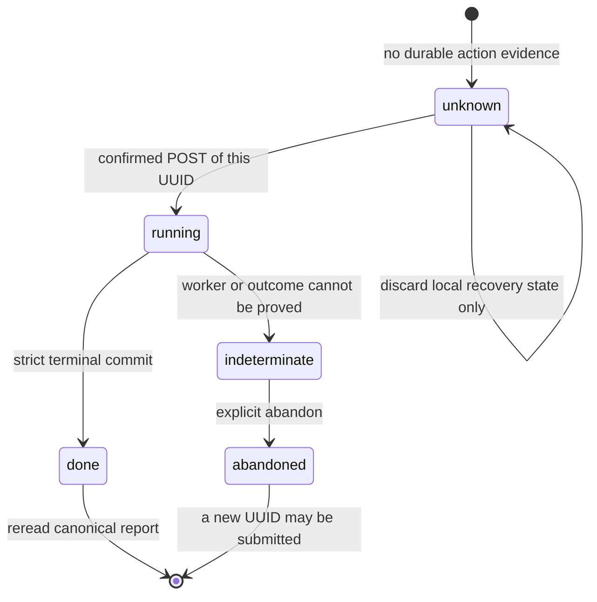

# Web UI

LoopLab ships a live React control plane. It's a **separate read/control process** — it tails each
run's `events.jsonl`, folds it with `replay.fold`, streams the state to the browser over SSE, serves
the built React app, and submits interactive controls through the server-owned durable command
lifecycle. It never changes the engine in-process and is never imported by it (ADR-18).

> **No browser? Use the terminal.** `looplab tui` is a chat-first **terminal control plane** over the
> same server — a run dashboard, the "describe a goal → boss proposes → operator launches" genesis
> flow, and a per-run boss chat that steers the live run. It auto-launches an API-only server when none is found,
> so `looplab tui` works on its own. See the [CLI reference](cli-reference.md#tui). It's the *control*
> slice; come back to this web UI to explore the search DAG, traces and per-node detail.

## Install & launch

The UI needs the `[ui]` extra:

```bash
pip install -e ".[ui]"
looplab ui                      # serves http://127.0.0.1:8765 over ./runs
```

On launch `looplab ui` checks a SHA-256 freshness stamp over the UI source/configuration and **builds the React
bundle automatically** when the default bundle is missing, unstamped or stale and Node/npm are on your `PATH`.
It also reinstalls dependencies when `package.json`/the lockfile no longer match the installed dependency stamp.
A stable source-root interprocess lock serializes dependency installation and the staged build across
concurrent `looplab ui` / `build-ui` processes. A waiter rechecks freshness after acquiring the lock, so it does
not rebuild output another process just certified. A lock/open/build/stamp failure fails closed for a requested
refresh. With a lockfile the installer uses `npm ci` first and falls back to `npm install` only after a visible
failure; adding, removing, or changing either dependency manifest invalidates the dependency stamp.

**A build never writes into the bundle you are currently serving.** It emits into a sibling staging directory,
and that is published over `ui/dist` only once the staged output has a valid `index.html` — by a single atomic
directory exchange where the filesystem supports one, otherwise by a retire-then-publish rename pair. A failed
rebuild therefore leaves the previous bundle byte-identical, whatever stage of the build it died in.

**A publish that is *killed* mid-swap is repaired on the next `looplab ui` or `build-ui`, whether or not a build
is possible there.** That distinction is the whole point: a kill (Ctrl-C, OOM, pod cull) and a toolchain that
cannot build are usually the same incident, so a repair only a build could perform would be unreachable exactly
when it is needed. Every `looplab ui` therefore heals an interrupted publish before anything else — **`--no-build`
included**, because skipping the build is not skipping the repair — and the last good bundle returns to `ui/dist`
even on a box where `npm run build` cannot run at all. It returns as the same files, not a copy: recovery is a
rename. Detail worth knowing:

- If the **first** publish was the one killed there is no previous bundle to put back, so the *staged* one is
  published instead — but only when the interrupted build had already verified and freshness-stamped it.
  Unstamped staged output is never published; it is mid-build or abandoned output, and the next build clears it.
- Recovery holds the same source-root interprocess lock a build does, so it cannot race a concurrent build. When
  there is nothing to repair it takes no lock at all, and a healthy bundle still launches instantly. When another
  build already holds that lock it steps aside after a few seconds instead of waiting the build out — the holder
  performs the identical repair as its own first act, so `--no-build` never stalls behind someone else's build.
- It never touches a bundle LoopLab did not publish: a `LOOPLAB_UI_DIST` or wheel-packaged bundle is never staged
  over, and a `ui/dist` holding files no LoopLab build put there is left exactly as it is. Recovery clears that
  name only when it is empty (an `rmdir`, so the kernel — not a check that could race — is what refuses to delete
  anything else); otherwise it prints both paths, the blocked `ui/dist` and the intact bundle beside it, and stops.

A failed requested refresh still never silently serves an older bundle: the command exits and tells you how
to repair it, and `looplab ui --no-build` serves the last good bundle explicitly. If Node isn't installed and no
previous bundle exists, the command prints manual build guidance and still starts the API with the not-built
placeholder.

| Option | Default | Description |
|---|---|---|
| `--run-root DIR` | `$LOOPLAB_RUN_ROOT` or `runs` | Directory containing run subdirectories |
| `--host HOST` | `127.0.0.1` | Bind host |
| `--port PORT` | `8765` | Bind port |
| `--root-path PATH` | `""` | ASGI prefix for a non-prefix-stripping proxy; auto-derived from `JUPYTERHUB_SERVICE_PREFIX` when unset |
| `--build / --no-build` | `--build` | Verify/rebuild a missing, unstamped or stale default bundle (`--no-build` explicitly skips the freshness check — but not the repair of an interrupted publish) |
| `--rebuild` | off | Force a fresh `npm run build` even if a bundle already exists |

```bash
looplab ui --run-root runs --host 127.0.0.1 --port 8765
```

Then open the printed URL. The server serves the **built** React bundle from `ui/dist/`.

## What it does

- **Live runs** — watch a run unfold in real time over SSE: the lineage graph, per-node metrics,
  status, tokens, and returned provider-reported paid cost. Per-call numeric usage is append-only, so the total
  already written to `events.jsonl` survives resume/new engine processes. Same-ID ledger retries do
  not double-count. Before append, the ledger first attempts to atomically retain a numeric-only
  delta in the run-local `.llm-usage-outbox`; a successful outbox rename or event append is the first
  durable boundary, and a later reconciliation in a fresh Engine/server process can finish the same-ID append. Reset/delete
  drain it fail-closed and reset archives it with the old generation. This is observed
  run-attributable usage, not invoice reconciliation: a process kill before either first durable
  persistence completes or an ambiguous paid timeout/reset/empty-response retry can leave an unknown
  charge, and missing final usage cannot be invented. The overall command/activity service is
  validated for the supported single UI server process, not a multi-worker deployment. Genesis, `/api/research`, global
  Assistant, cross-run scope reports, health probes, and other non-run-scoped calls are excluded.
  Reopening a finished run still
  streams (runs are self-describing via `task.snapshot.json`).
- **Create a run by describing it** — the main-menu chat ("New run") turns a plain-text goal into a
  proposed run spec: the owner Assistant invents a name, picks or authors the task, and sets the
  knobs (model,
  node budget, seeds, policy). It also authors **repo runs** — point it at a repo to optimize and it
  fills the repo path, the run/eval command, the metric key, and the edit surface, plus an
  **adaptation checklist** (how to make the repo LoopLab-ready: expose a JSON metric, pin deps, choose
  the edit surface, protect the grader). For a repo it is a real **agent** with read-only scout tools
  and instructions to inspect the README, eval/entry script, requirements and result files. Tool use
  is model-directed rather than a hard gate, so verify the proposed command, metric and paths. When the task
  needs a code-writing agent (repo / dataset / Kaggle — the generative kinds), the **launch itself**
  defaults `backend=llm` — the rule lives in `/api/start`, the funnel every launch goes through
  (genesis cards, assistant-proposed runs, direct API calls), matching `looplab run --goal` — so a
  UI-launched run never silently falls back to the offline toy developer; after **Validate**, the
  authoritative preview shows the effective backend before Start. The launch card is an inline editor for its surfaced run,
  task, budget, seed, policy, and backend fields. Editing invalidates the prior validation receipt;
  validate the revised card before Start is enabled. Ask the Assistant for a new proposal when the
  needed field is not surfaced by the card. A backend set explicitly in Settings or `LOOPLAB_BACKEND`
  still wins. See **[Generating train & test code](generating-code.md)** for the full
  Genesis flow
  and every "let the agent write the code" case (from-scratch, repo edit, test-without-train,
  onboarding) plus how to point at your data.
- **Drive a run** — start, resume, fork, branch, or inject nodes from the browser; the server spawns
  the engine as a subprocess. New-run start uses its dedicated launch route and the shared spawn
  lease. A finished run can be extended with a new batch. Existing-run interactive controls use one
  idempotent, observable [command lifecycle](concepts.md#authoritative-command-lifecycle),
  shared with the boss and TUI, so pending work is not presented as completed. `accepted` and
  `executing` remain pending; an engine acknowledgement means the engine observed that exact intent,
  not that all resulting domain work is done. While finalization or terminal write-out is active, the
  run list/header/Dock show it and hide conflicting Resume/Replay controls. If the Web response is
  lost or temporarily unreadable, Dock and Assistant preserve the same command identity and offer
  **Check same command** or, for an eligible terminal failure, **Retry same command** instead of
  silently submitting a fresh action. Both surfaces persist a sanitized allowlisted envelope and one
  exact per-run tab lock before POST; if session storage cannot be written, the command is not sent.
  Corrupt, tampered, mismatched, or unsafe stored state is quarantined and never replayed. The shared
  lock makes an Assistant command visible in Dock and blocks a competing same-run action on either
  surface, while commands for other runs remain independent. Assistant keeps failures across reload,
  attributes an in-flight result only to the run that originated it, and uses focused live status/error
  regions plus touch-sized wrapping recovery controls on narrow screens. Structured conflicts explain
  whether an identical command can be reattached or a different active command must finish first.
  Model-driven command-backed run mutations are staged in a durable per-turn journal before
  execution; recovering an unanswered turn may replay only its exact command-backed intents, while
  changed/new or uncertain direct-storage mutations are blocked. Recovery pins the persisted raw
  instruction and mode, rejects
  either mismatch, and exposes only read/Todo tools plus journal-backed run control — no file, shell,
  git, knowledge, MCP, proposal, or subagent mutators. A different message cannot overtake a dangling
  or still-cancelling turn. The TUI likewise stages the exact key and deep-copied payload before POST
  and uses same-key recovery when an early 404 races a delayed original request.
  On Web reload/session re-open, a dangling `turn_id` is re-read and recovered with its persisted
  `raw || content`, clean display, and exact mode; the UI polls that same turn without adding a second
  user bubble. A changed/corrupt identity is blocked instead of retried with rebuilt context. Retry of
  a completed persisted turn is a new turn, but it also reuses that durable raw/display/mode exactly.
  Reset preserves terminal command records and run-scoped background LLM/report work holds a
  generation lease. State/SSE supplies a stable generation token that Web, Assistant, and TUI persist
  with each fresh command before POST. If a request formed on generation A first arrives after Replay
  created B, the server returns `409 run_generation_changed` before any command record, event, or
  process side effect. Same-key recovery of an already-accepted A command remains observational.
  Natural finish reports use a durable planned/attempt/result boundary. A restart safely performs a
  report only when no attempt marker exists, reuses a scoped durable report, and records an ambiguous
  paid attempt as incomplete instead of starting another outer logical report operation; provider-client
  transport retries and billing ambiguity remain outside that guarantee.
  Standalone legacy CLI `stop`/`finalize`/`resume`/`approve` commands are still outside this server
  sequencer and should not be run concurrently with an active server-owned command.
- **Review Assistant actions before they run** — permission cards show the server-derived risk,
  exact scope, consequence, active mode, and request expiry. The newest card opens the Assistant and
  focuses **Reject**; resolve buttons remain locked until the server answers. A short remembered grant
  applies only to the same session, mode, current turn, action, and scope. It is never offered for
  high-risk or unclassified actions, and `Auto` still asks before arbitrary shell/test execution,
  destructive operations, external MCP calls, and unknown capabilities. Plan remains read-only and
  does not expose shared-memory writes. Direct mutation APIs and non-Assistant browser confirms are
  not yet all unified under this card contract; keep the UI on a private/authenticated control plane.
- **Reset a node in place** — the node inspector's **↻ Reset** button (or `reset(node_id, stage)` in
  chat) re-runs an EXISTING node from a chosen stage instead of spawning a new one: `eval` re-scores it
  (keep the idea + code — for an infra/API-key blip), `implement` re-runs only the Developer (keep the
  Researcher's idea — for crashed code), `propose` is a full redo. Any eval-**pipeline** stage name
  (`train`, `data_prep`, …) is also accepted — it restarts the node's pipeline from that stage,
  reusing earlier stages' artifacts. Same node id, no proliferation. The command service wakes or
  attaches the driver automatically. Its exact `command_ack` means the engine accepted that reset
  intent; re-development/re-evaluation may still be running and remains visible as normal run work.
- **Chat / boss** — an agentic run chat turns one message into a plan of ordered actions, with each
  action narrated in a durable feed (`chat.jsonl`). That feed is capped at **32 MiB** per run; past the
  cap further turns are refused with HTTP 413 so one long-lived conversation cannot fill the disk or
  make every `GET /chat-log` re-read a huge file. The transcript stays fully readable — only appends
  stop. **The documented recovery is `chat-compact`, not a reset:** the 413 body says so, and a **1 MiB
  grace** above the cap is reserved specifically for `summary` turns so the compaction recap can still be
  appended once the cap is reached (`serve/routers/boss.py`: `_CHAT_LOG_MAX_BYTES` :72,
  `_CHAT_SUMMARY_GRACE_BYTES` :76, and the 413 branch at :560-570). Compact, append the returned
  recap as a `summary` turn, and carry on. Resetting the run also archives the transcript and starts a
  fresh one, but it is the destructive option, not the first one.
- **Deep Research** — every run surface uses the same conclusion-first memo card. The newest memo is
  open and older memos are collapsed; the takeaway, provenance, evidence/claim counts and trust state
  remain visible in the header. Findings and next actions stay primary, while verified evidence,
  source/tool activity and technical reasoning use nested disclosures. Unsupported or incomplete
  evidence opens automatically. Claim citations link to safe source URLs, experiment references jump
  to the cited node, and malformed legacy memo arrays degrade to empty sections instead of crashing a
  historical timeline. Assistant tool activity follows the same progressive-disclosure rule: short
  traces stay compact and longer traces are bounded and collapsed by default, without rendering raw
  arguments or results.
- **Reports** — an agent-authored, conclusion-first run report plus deterministic metric-improvement
  charts. The same Deep Research card is reused here, including print-safe expanded content.
- **Read-only review links** — with `LOOPLAB_UI_TOKEN` configured, **Lab → Comments & sharing** creates a
  revocable, expiring capability for one run. Summary links expose the DAG/report and derived metrics;
  an explicit evidence option adds redacted node source/results. Assistant, actions, raw
  logs/prompts/traces, artifacts, and owner settings are never available to the recipient. A review
  link is a capability over **one** run, so nothing describing sibling runs travels with it: the
  run's `cross_run_priors`, the per-Card `cross_run_prior`, and an imported node's `origin` (all of
  which name other runs and their metrics) are dropped, and the Card completeness receipt reports
  them as omitted rather than certifying data the response no longer carries. Within-run provenance
  such as `research_origin` is unaffected, so a reviewer still sees an imported experiment — just not
  which run it came from.
- **Standing watches (always-on assistant)** — ask the chat to *"tell me when run X finishes"* or
  *"check the run every 10 minutes"* and it arms a **watch**: a durable record under
  `<runs>/assistant/.watches/` holding your own instruction, its condition, its mode and its budget.
  It survives a page reload, a closed tab and a server restart, because the wake-up carries
  everything the servicing process needs — which is exactly what a longer request timeout cannot do.
  Two conditions: **wait for a run state** (`finished`, `paused`, `finalizing`, `engine_stopped`, …)
  and **every N seconds**. The server evaluates the condition itself, over the same folded run
  projection the dashboard reads, backing off toward a **60 s** ceiling; an unmet condition costs no
  model call at all, so a run that finishes overnight is a `stat` a minute rather than a bill.
  Each wake-up appends a normal assistant turn to the same chat, tagged with what it was waiting for
  and what the server observed, so the monitoring shows up where you already are. A watch runs at the
  mode the chat was in when you armed it — never a wider one — and it always yields to you: if you
  are mid-turn it waits rather than interleaving. Every watch carries a wake-up budget and a lifetime
  (defaults 24 wake-ups / 24 h, 8 active watches per chat), and both are visible on the record.
  Routes: `GET/POST /api/assistant/watches`, `DELETE /api/assistant/watches/{id}`; the agent's own
  verbs are `watch_run` / `watch_every` / `list_watches` / `stop_watch`. After a server restart a
  read-only watch is re-armed automatically; one that could have MUTATED is left `interrupted` with
  the reason, because its turn may have applied half a change and re-entering it would apply the
  other half twice.

    **What you actually do.** You arm a watch by *typing* — there is no "new watch" button, and the
    UI has no client binding for the POST route; your sentence becomes a `watch_run` / `watch_every`
    tool call. What you get back is a **strip above the thread** listing every standing watch: what
    it is waiting for, its status, when it next checks, its wake-up count against its budget, the
    standing instruction, and a **Stop** button. It hides itself when nothing is standing, polls
    every 5 s while anything is active and every 30 s otherwise, and keeps the last known list rather
    than blanking if a poll fails. A settled watch ages out of the strip after ten minutes — except
    an `interrupted` one, which never does, because that is the single status that asks you for
    something: check what its half-applied turn did, then re-arm it.

    **The two conditions behave differently on purpose.** A **run-state** watch is *one-shot*: it
    fires when the server first observes one of the states you named and then retires as `done` —
    "watch it again" is a new watch. A **schedule** repeats every N seconds (15 s to 24 h; 300 s if
    you do not say) until it exhausts its wake-up budget or its lifetime, and only a schedule shows a
    budget in the strip. The other statuses are `armed`, `waking`, `cancelled`, `expired` (budget or
    lifetime reached) and `failed` (the run vanished, or the wake-up turn raised). Every bound is
    **refused rather than clamped** — a 2-second interval, a ninth active watch on one chat, an
    unknown run state — and the refusal is one sentence naming the fix, both in chat and as an HTTP
    `400 {"code": "watch_refused"}`. A wake-up may not arm further watches, so a watch population
    cannot grow itself.

    The implementation is `looplab/serve/assistant_watch.py`, and it deliberately holds no domain
    authority: it appends no event and names no control intent, its only import above `core` is the
    run-phase vocabulary its trigger waits on, and the *server* — not the agent — evaluates the
    trigger, so an agent can never be woken because it declared its own wake condition met.
- **A cut-short turn says so** — a long turn can end for five reasons that are not "the model
  finished": the wall clock, the turn budget, stuck-detection, a model that will not emit, and the
  convergence ceiling. All five now append a notice naming which one and how far it got, and set
  `budget_exhausted` on the reply (persisted, and on the SSE `done` event). The chat's own wall clock
  is `assistant_time_budget_s` — blank = 300 s, `0` = no cap. Pair `0` with a watch rather than with
  hope: an unbounded turn still dies with its browser, and a watch does not.
- **Read-only chat share links** — the Assistant's **⤴ create snapshot** button mints a link with its own secret (not
  the chat's id), an expiry, and a **⤫ unshare** that revokes every link for that chat while keeping
  the conversation. A link is **frozen** at the messages that existed when it was created, so
  continuing the chat never retroactively publishes what you say next; pass `live: true` to the share
  API for a link that follows the conversation instead.
- **Comment threads** — event-sourced operator discussion pinned to a run or a specific node, with an
  edit history and a resolve/reopen state. The view is served as authenticated current + history
  projections (`GET /api/runs/{run_id}/comments`, `…/comments/{id}/history`); the operator writes the
  `comment_created` / `comment_edited` / `comment_resolution_changed` control intents and the projection
  (`events/comment_projection.py`) derives the threaded state — the engine stays the sole writer of
  domain events (distinct from the legacy single `annotation` event).
- **Trust panel** — surfaces the safety monitors (reward-hack, code-leakage, critic flags); set
  `trust_gate` to `gate`/`block` (or pick the `thorough` profile) to make a **high-precision** flag
  ineligible to win or seed breeding/confirmation. Broad critic/perfect-score warnings remain advisory;
  `critic:hardcoded_metric` is the narrow high-precision critic exception.
- **Cards board** — the run's bounded work-item projection, grouped into the replay-derived lifecycle
  lanes (proposed / building / running / evaluated / gated / dropped) — *except while a build is in
  flight*, where the derived, never-folded `state.card_authoring` overlay replaces the folded status
  with the live authoring phase and the row keeps `authoring.folded_status` alongside it. The fold
  cannot express that head at all: folding the build *request* would make the servicer of that head
  unable to claim it, which is why the board once called a 2,128-second build "not started" for all
  but 0.3 s of it. A **speculative pre-build is not a separate lane** — it rides those same six. `coded` is the one reserved lane the fold still never
  produces: the log now *does* carry a durable eval-start boundary (`node_eval_started`, appended for
  speculative prefetch nodes at the dispatch decision), but the card projection collapses every pending
  node straight to `running`, so nothing distinguishes coded-but-not-started from running. Unknown future
  statuses remain visible rather than being hidden. Cards expose receipt
  completeness, selection readiness/blockers, lineage and evidence-node links. Operator controls can
  edit display text, pin the 1-based visible priority, pin a configured GPU request, or deliberately
  drop a Card. All four actions use the same generation-fenced command lifecycle as the rest of the
  workspace; accepted/executing actions remain visibly pending across SSE lag, while a definite
  failure rolls back only that optimistic field. Browser state is scoped to run + event-log generation,
  so a late response from a replaced run cannot mutate the new board. Resource display keeps the
  receipt-owned declared `footprint` separate from the configured `resource_pin`; the browser sends
  only quantitative values and the server stamps operator provenance and validates the current GPU
  envelope. The eventual scheduler allocation may still be smaller or re-clamped, and a local
  GPU-owning Run may wait behind the conservative pool-wide host lease. The UI shows the configured
  request, not a live allocation or queue position. Dropping a Card is
  the explicit stop-now affordance for its matching in-flight eval; engine/freshness drops still burn
  to a valid terminal result. The Card board stores work items; `belief_id` groups retries or other cards
  that test the same hypothesis, while the distinct-belief projection avoids duplicate prompt/ranking rows. The
  operator **+ Add** / **abandon** affordances write `hypothesis_added` / `hypothesis_updated` control
  events that seed and update cards.
  Note the board renders **one row per work item**. That used to mean a hypothesis could appear
  twice: a `debug` RETRY of a failed card was its own work item with its own action digest —
  correctly, since a repair build was a different executable action — so a draft card and its debug
  retry sat side by side, byte-identical but for `idea.operator` (measured live in
  `runs/rubert-dr-0807`). **The Debug node was removed on 2026-08-13**, and nothing mints a `debug`
  idea any more, so no new run produces that pair; runs from before it still show one, and the
  mint-side attach gate is kept fail-closed for a retry operator reintroduced under another name.
  The join the board needs is derived by the fold and **is** published: `Card.belief_id` (the
  seed-statement digest two work items share) and `Card.retry_of` (the card a retry repairs — `None`
  on every card a current run produces) are both in `serve/public_cards.py::_FIELDS`, the explicit
  wire allow-list.
- **Inspector context** — the Inspector is one component mounted from three hosts (the Lineage
  workspace, the Cards board's detail pane and the Concepts tree's), and it takes its host awareness
  as callbacks rather than a view name. **Show in Lineage** appears only when that jump goes
  somewhere, i.e. never inside the Lineage view itself. Its Overview names the **work item
  (hypothesis)** the experiment tested — a Card *is* the hypothesis, so the section leads with the
  count of *other* attempts at the same question rather than presenting one node as one hypothesis,
  and it distinguishes a node with no card stamp (legitimate — `Idea.card_id` is optional) from one
  naming a Card the displayed frame does not publish. When an operator paraphrase overlays the
  display statement, the immutable `seed_statement` is shown beside it. Concepts the *Card* carries
  but this attempt does not are a separate lane, never folded into the node's own memberships.
  **What this experiment taught** lists the lessons the run's own append-only event log credits to
  this exact `(node, attempt)`; each row's standing in cross-run memory is read live, because that
  store merges and consolidates. A statement no longer present reads *no longer in memory as
  written* — consolidation keeps no redirect to a descendant — and a truncated read window degrades
  to *standing unknown* rather than claiming absence. Run-end reflection lessons carry no
  per-experiment evidence and are named as out of scope instead of being silently omitted.
- **A research memo reads as a memo, not a wall** — the collapsed header carries a scannable LEAD
  (its first sentence, bounded), and the full conclusion lives in the body's Conclusion section where
  a paragraph belongs. A real memo's summary is ~1,600 characters, so rendering it verbatim in the
  header made a list of memos a stack of paragraphs with no scannable line — while everything else on
  the card was already structured. The header says "full conclusion below" whenever it shortened
  anything, so a truncation never reads as the whole answer, and the untouched text stays in the
  element's title.
- **From a concept into what the lab learned** — picking a concept in the global Concepts view now
  shows the lessons, cases and notes that carry it, beside the runs that are evidence for it. Subtree
  matching is shared with the Memory panel's own filter, so selecting `loss` answers with everything
  under `loss/contrastive/…` — two definitions of "about this concept" would give the operator
  different answers to one question from two screens. The section always states how many memory rows
  carry **no** concept at all: "2 lessons" without "and 147 carry no concept" invites the reader to
  conclude the lab has learned almost nothing about everything else. `Knowledge` is never a group
  there — it is human-authored and carries no run concepts, so an empty group would imply it could.
- **Which kind of memory is which** — the Memory panel's four tabs each say what they ARE, because
  the tiers have different writers and different readers and four counts alone did not convey that.
  **Lessons** are what a run CONCLUDED (one transferable claim per row, with its evidence);
  **Cases** are the best known SOLUTION for a task — one row per *task*, not per experiment, which
  is why there are so few; **Notes** are a run's own closing summary, context for reading the
  lessons rather than a claim; **Knowledge** is what a HUMAN authored (prompts, skills, notes) and
  is the one tab nothing written by a run ever reaches. That last line is the answer to "how is
  authoring different from memory": who wrote it.
- **A Card's whole story** — a Card is one hypothesis; the Researcher proposes it and the Developer
  builds one or more experiments (nodes) under it. The card's **Trace** section reads that story in
  order: the proposal(s) that produced the card, then a section per node. Sections name their traces
  rather than inlining them, so you open only what you want
  (`GET /api/runs/{id}/cards/{card_id}/trace`). Research is matched to a card by the `card_id` the
  engine stamps on the `propose` span, or — for the re-proposal a node reset performs, where the
  replacement card is minted after the span closes — by the trace it shares with that node's
  `node_created`. Each row says which rule matched it, and a card whose research cannot be
  identified shows none rather than a guess: a mis-attributed hypothesis is worse than an empty
  section.
- **Earlier attempts of a reset node** — the node trace carries an `attempt` picker whenever the
  node has more than one generation. `Node.attempt` is the lifecycle generation and it is bumped by
  `node_reset` (and by a holdout rotation), so each reset keeps its own trace and the attempt that
  actually CRASHED — usually the one worth reading — is selectable instead of only the last. The
  routes have always taken `?attempt=`; until 2026-08-12 the UI sent the current generation and
  rejected any older response as stale. Selecting an earlier attempt is a read: the destructive
  **clear trace** stays bound to the CURRENT generation, so browsing history can never erase it, and
  a historical selection never falls back to the node-detail payload (which always describes the
  current attempt) — showing the newest trace under an older label would be worse than showing
  nothing.
- **Earlier steps INSIDE one attempt** — the `steps` control beside the attempt picker, and the
  separate thing it is for. An *inline repair* does **not** open a lifecycle generation, so the
  attempt picker cannot reach one: measured 2026-08-13 on `runs/rubert-dr-0804` node 1, all 14,507
  spans of its 2,345 repairs are generation 0 and that picker does not render at all. Nor could
  widening reach them — the trace window is a TAIL, so a bigger `limit` is the same tail extended,
  and its 4,096-span ceiling is real (the conversation costs ~3.4 ms per span, on the request
  thread). On that node the 512-span default window covers the last 7.6 minutes of a 3 h 50 m
  experiment and the ceiling the last 59.3, leaving 74 % of it — every early repair — unreachable.
  So `GET /nodes/{n}/episodes` publishes the node's own episodes (every band its conversation reads,
  with none of their contents, each carrying the span id to seek to), and `?before=<span_id>` on
  `/nodes/{n}/trace` and `/nodes/{n}/conversation` puts the SAME window on a chosen one. The map is
  derived from the in-memory light span index and reads no `spans.jsonl` bytes (7,048 episodes in
  82 ms on that node); it loads when the control is opened. The control is visible whenever the
  node's trace projection reports omitted spans, and it steps by ordinal (« ‹ 17 › ») rather than
  listing 2,345 rows. An anchor the run's index cannot place is refused with HTTP 409
  `trace_anchor_unknown` rather than answered with the tail — the newest steps under an older
  episode's label is the one failure worse than an empty panel.
- **Per-node trace** — when `trace_llm_io` is on, inspect the bounded, canonicalized and heuristically
  redacted diagnostic representation recorded for each call. It is not byte-exact provider I/O. Complete
  object rows with an invalid span shape are quarantined one by one; invalid required IDs are skipped and
  recoverable timing/token/attribute values degrade to bounded defaults. A torn or invalid-JSON tail remains
  a durability boundary rather than being guessed past, and pathological parent chains are traversed iteratively.
  Every trace/detail/tail/conversation response is an allowlisted, redacted and count/byte/depth-bounded
  projection with route-specific omission metadata. Run/node/conversation views, operation trees, single-span
  details and the live tail do not expose the same counters. On a read failure the server preserves the route's
  empty collection shape but marks `projection.unavailable=true` and omits unknown totals; exact zero counts
  mean a successful empty read. Collection routes treat a missing span sidecar as known empty; a lookup for an
  absent individual span is unavailable. The Inspector and live Dock render unavailable, partial and honestly
  empty states separately. Full recorded span dictionaries remain only in `spans.jsonl` and are not downloadable
  through these routes. While a node is working, the conversation poll retains one last-good response only in
  memory and conditionally revalidates its opaque cursor for that exact run generation, node attempt, span
  window and window ANCHOR. An unchanged poll is an empty HTTP 304, avoiding full-row reads, projection CPU
  and repeated JSON; selected appends, rewrites, resets, a wider window and a MOVED one invalidate it, while
  a receipt-proven append for another node does not. After a process cold-loads its persisted accelerator, one verifying 200 source-row
  read is required before that exact window can return a 304. A platform/filesystem that cannot provide the required descriptor mutation proof
  conservatively rebuilds and may false-invalidate instead of risking a stale 304.
  These private diagnostics remain `Cache-Control: no-store`; the UI performs the revalidation itself and uses
  the existing abort/deadline and visibly-stale last-good behavior when a refresh cannot be confirmed.
- **Per-run settings** — edit a run's settings; `PUT /api/runs/{id}/config` rewrites that run's
  launch snapshot for the next restart (not the global UI defaults). Seven run-start selection fields are
  read-only after `run_started` and come from the folded event log; the API overlays/repairs those values.
  `trust_gate` is changed through a durable event as well as the snapshot, so its effective state is replayable.
  The GET returns a 64-character `config_revision`; the current editor sends it as `expected_revision`.
  Read/compare/merge/write is covered by its own equivalent local/interprocess locking contract (separate from
  global Settings), and a stale editor receives a
  structured `run_config_revision_conflict` instead of overwriting a newer snapshot.
- **Settings page** — a versioned, server-owned editor catalogue with 168 of the 199 direct
  `Settings` fields in 10 groups (the live counts are
  `serve/settings_ui_schema.py::SETTINGS_UI_SCHEMA_CATALOGUE_FIELD_COUNT` /
  `…_SETTINGS_FIELD_COUNT`; note the docs↔code parity test `tests/test_config_docs_sync.py` pins
  [configuration.md](configuration.md), **not** this page, so re-read those constants before quoting
  them). The default **Essential** view contains 18 high-frequency keys, while
  search spans the complete catalogue. It is intentionally curated, not an exhaustive mirror: fields outside
  the catalogue remain configurable through environment/config inputs and are preserved by sparse writes —
  but which ones those are is reconciled against the live model at load, with a written reason per omission
  (`SETTINGS_UI_SCHEMA_UNCURATED_FIELDS`), and each row pins the default its help text was reviewed against
  so a flipped default cannot leave the copy behind.
  The packaged catalogue is v1 and its HTTP/editor contract is v2; the schema's weak ETag is a semantic cache
  revision, not a settings mutation token.
  The **API key**
  field (LLM tab) is written to a separate `secrets.json`, never to `ui_settings.json` or a run
  snapshot, and the API only ever echoes a masked `***`. The store requests mode `0600` on POSIX;
  Windows ACLs, network filesystems and bind-mount permissions remain the deployer's responsibility.
  Set it here or
  via `LOOPLAB_LLM_API_KEY` (env / `.env`) — either way spawned runs inherit it. Global Save sends only
  schema-owned edits since this tab's last successful load/save; blank edited fields explicitly clear an
  override, and agent-governance roles are a nested sparse patch. The server validates and merges the whole
  read/modify/write under local + required interprocess locking. Ordinary settings and the write-only secret
  store have separate opaque `settings_revision` and `secret_revision` CAS tokens. The current browser
  submits the observed token, keeps the draft on a structured 409 conflict or unknown transport outcome,
  refreshes authoritative state, and never replays the mutation automatically. Omitting a token remains a
  legacy API compatibility path, not the browser's save contract.

## Two menus: this run, and LoopLab

There are exactly two navigation scopes, and every screen belongs to one of them.

**The run menu** is the hub bar inside a run workspace (`#/run/<id>`). Everything in it is a question
about *that run's event log*, and every panel behind it reads `/api/runs/<id>/…`:

| Hub | Panels |
|---|---|
| **Progress** | Queue · Research · Failures |
| **Trust** | Trust · Pareto / diversity · Data quality |
| **Analysis** | Compare · Sensitivity · Importance · Cross-run |
| **Lab** | Files · Registry · Comments & sharing · Events |
| **Run settings** | budgets and knobs for **this run only** |

**The LoopLab menu** is the ◉ LoopLab mark itself, top-left, carrying a `▾`: click the mark and the
menu opens. It is the same on every owner screen — including
inside a run, so you never leave a run to ask an installation-wide question. Everything in it is true
for the whole installation no matter which run is open, and every surface behind it reads a bare
`/api/…` with no run id:

| Destination | Route | What it is |
|---|---|---|
| **Runs** | `#/` | Every run: list, map, portfolio comparison, projects |
| **Claims & Curation** | `#/claims` | Experimental cross-run claim ledger + the paid stewards' proposals and outcomes. Renamed from *Research Atlas* (doc 29 F7), whose concepts section was dropped in favour of Runs → **Concepts**; `#/atlas` and `#/research-atlas` are canonicalized aliases |
| **Concepts** | `#/concepts` | The run list opened on its **Concepts** view — the cross-run concept map (`is_a` forest, co-occurrence, per-concept detail). Not a separate screen: it is the run list's third representation, given a hash so other surfaces can link to it |
| **Cross-run memory** | `#/memory` | Lessons, solved-task cases and meta-notes carried *between* runs (`/api/memory`) |
| **Knowledge & prompts** | `#/knowledge` | The authored prompts / skills / knowledge every run shares (`/api/{kind}`) |
| **Host & GPU** | `#/gpu` | Live `nvidia-smi` for the machine the server runs on (`/api/gpu`) |
| **Settings** | `#/settings` | Engine **defaults for every new run** — not this run's config |

The dividing rule is the run id: a surface is run-scoped when its content is a function of one run's
event log, and installation-scoped when the same screen is true whichever run — or no run — is open.
The last three LoopLab destinations used to be reachable *only* from inside a run's `Lab` hub even
though none of them takes a run id, and the run's own config editor was labelled `Settings` one
screen away from the engine-defaults `Settings`. Both are fixed above.

**Deep links still work.** `#/run/<id>?panel=memory`, `?panel=authoring` and `?panel=gpu` continue to
open those panels inside the run workspace exactly as before; they are simply no longer *offered*
there, and the panel subtitles now name their real scope (`every run`, `this host`). Nothing about
the run-route query grammar changed, and everything remains a URL **fragment**, so all of it survives
a path-mounting proxy (see [Behind a path-mounting proxy](#behind-a-path-mounting-proxy-jupyterhub-reverse-proxy-subpath)).

A **read-only review link** never renders the LoopLab menu: that route is public, and installation
surfaces are owner-only. The mark is still there — it is simply an inert mark on that route, with no
arrow and nothing to open, rather than a disabled control that would advertise what it withholds.

The mark opens the menu and does **not** also navigate. `Runs` (`#/`) is the first item in the menu,
which is where the old "click the logo to go home" behaviour lives now; one click, one meaning.

## Which graph am I looking at?

LoopLab has three graph surfaces and one separate experimental portfolio summary. They answer different
questions; **Claims & Curation** is deliberately **not** another force/DAG graph — and since doc 29 F7 it
holds no concepts at all, which is why **Runs → Concepts** below is the only cross-run concept map:

| Surface | What its nodes/regions mean | What it does **not** mean |
|---|---|---|
| **Runs → Lineage** | Run cards packed inside operator-created **Project** folders; `seeded_from` links show when one run was seeded from another. The current filters and project scope are shared with List view. Labelled **Lineage** because it draws ancestry — which run came from which, inside which folder. Its internal view key is still `map`, which is what saved views and shared links carry. | It is not a theme, concept, evidence, or claim graph. A card may summarize up to four run themes, but themes do not determine the lineage topology. |
| **Runs → Concepts** | The concept tree across the runs the list is currently showing, folded from each run's `concepts` rollup — the same array Lineage draws, so the project folder and every list filter apply unchanged, and an extra scope button narrows to the runs checked for Compare. Ids are `/`-paths, so each row's ancestors are materialized from the id itself and marked `grouping` when no run named them. A node reports the DISTINCT runs at or below it, the experiments tagged with exactly that id, and a best metric **only** where the contributing runs share one task and one objective direction. Above the tree: how many runs in scope carry any tag at all. Below it: an always-present **Untagged** bucket, then **Studied together** — the co-occurrence pairs, an unordered pair of concepts one run was tagged with, weighted by the number of DISTINCT runs that named both, with an operator-visible floor (default 2 runs). Selecting a concept adds its partners to the detail pane. | It is not a taxonomy. Runs that disagree about the hierarchy stay separate roots; ids differing only in `-` versus `_` are reported side by side and never merged, because merging them would be LoopLab asserting a taxonomy nobody authored — renaming a concept across runs is a governed cross-run action, not a render-time guess. No subtree experiment TOTAL is shown: one experiment carries several tags, so summing a subtree would count it more than once. A concept absent from the tree means untagged, not unstudied. Co-occurrence is folded from the same rows as the tree, never fetched: the server's cross-run corpus is the run-end capsule ledger, whose membership is not this list's (measured 2026-08-06 on the shipped corpus: 3 capsules against 15 tagged runs), and rendering that inside a filtered view would misstate the population. A pair below the floor is COUNTED and named, so an empty panel reads as "nothing repeats yet" rather than "nothing co-occurs"; a pair is evidence one run named both ids, so a `grouping` row never has partners. |
| **Run → Lineage** | The experiment DAG for one run. `group by` can project current nodes into **primary concept axis**, operator, metric-tercile or parameter-`niche` regions. The concept chip bar is breadcrumb-navigable and multi-select (OR); chips stay in canonical-ID order while counts change, and a drilled exact-level membership remains a trailing “· here” target. Lineage previews and then pins the same subtree selection. Filters and collapsed cards use active-lifecycle members only: tombstoned/aborted attempts remain in audit history but not current counts; filtered aggregates show matched/total, dim zero matches and compute best/status only over the matched eligible subset. An experiment whose membership could not be materialized is withheld from the chips ROW-WISE and disclosed as `PARTIAL · N withheld` — its siblings stay filterable and the counts become a lower bound; only a run-scoped integrity failure (degraded run base, malformed receipt store) refuses the whole bar as `UNAVAILABLE`. The separate **Concepts** view is a bounded generation/sequence-fenced tree/table with exact attempt refs, descriptive rollups and a **Projection lens**. Its dynamic relationship copy persists across loading/recoverable error, counts **displayed concept nodes**, exposes additional projected parents through expandable `+N links`, and labels bulk controls **Expand/Collapse concept rows**; `co_occurs` is identified as membership-derived rather than a recorded edge claim. It also states objective orientation, missing metric name/unit and normalized Δ semantics. Both quick-searches are client-side over validated loaded state. | The primary concept axis is a lossy compatibility slot, not a Direction entity. A folded `node_concepts` row wins: memberships are alias-canonicalized and the lexicographically first top-level axis is chosen; an explicit empty row stays untagged. Only a genuinely missing folded row may fall back to legacy `idea.theme`, then the first authored concept axis. On mixed-era data that fallback may still group Lineage while Concepts remains honestly empty until folded membership exists. Additional memberships/deeper paths are omitted. The Concepts view is not the complete Research Space, a primary-axis×Concept matrix, release-pinned taxonomy/assignment graph or portfolio-wide research index. |

The run workspace's legacy **Analysis → Cross-run** panel is likewise not a scientific comparison surface.
It retains bounded same-task-ID navigation and per-run objective observations, but does not rank, crown, draw
relative bars, or overlay values on one axis. A shared `task_id` does not bind metric name/unit, dataset and
evaluation identity, or a comparison protocol; those operations remain unavailable until a validated
`ComparisonContract` exists. If the displayed run has no non-blank `task_id`, the panel fails closed with no
observations: multiple legacy rows with a missing identity are not members of one task.

## Which memory panel am I looking at?

Three panels hold durable knowledge, and what separates them is **who writes**, not what the content
is about. Each panel now says so in its own header; the full per-kind reference is
[Memory & knowledge](memory.md#which-surface-am-i-looking-at).

| Surface | Holds | Written by | Editable there |
|---|---|---|---|
| **Lab → Authoring** | `prompts` (role system-prompt overrides), `skills` (techniques the Researcher can load), `knowledge` (free-form notes) | **you** — plus the assistant's `remember` tool for `knowledge` | root Markdown uses a CAS/receipt editor; nested skill packages are review-only |
| **Lab → Memory** | Lessons, Cases, Notes, and a read-only view of the same `knowledge` notes | the **runs**, at run end | no |
| **Lab → Claims & Curation** | Claims across every run in the shared memory dir, plus the steward proposals and their outcomes | derived at read time from what the runs wrote, plus your governance decisions | no — governance is CLI/HTTP only |

Consequences that have repeatedly been reported as bugs and are not:

- **Skills and prompts are not missing from Memory.** They live on Authoring because a human writes
  them. `skills_dir` and `prompt_dir` both default to unset, so both tabs are empty until you point
  them somewhere; `memory_dir` and `knowledge_dir` do have defaults.
- **`knowledge` deliberately appears twice** — writable in Authoring, read-only in Memory. One
  directory, one set of files.
- **A Claims & Curation claim will not appear in the Memory panel under that name.** Claims are a projection over
  the same `lessons.jsonl` rows plus the deep-research memo claims, not a fourth store.
- **Configured skill packages are visible without becoming writable paths.** Root `*.md` skills keep
  the flat CAS/receipt editor. Nested `**/SKILL.md` packages appear under safe relative display names
  and are read-only; bounded traversal skips symlinks and path escapes, and a capped scan is disclosed
  separately from the known lower bound of omitted files. Save and recovery identities remain flat
  basenames and cannot contain `/`. Run-distilled skills under `<memory_dir>/skills/` are a different,
  memory-owned store outside configured Authoring: candidates are hidden from production agents until
  cross-task promotion, and neither panel yet provides a first-party candidate review workflow.

**Deleting a run leaves all three panels untouched by default.** The Delete dialog offers an opt-in
*“Also delete this run’s own cross-run memory”* that removes only what is attributable to that run
alone — a consolidated lesson, a claim pool another run has curated, or a capsule whose concepts were
merged into a shared family all stay, and the dialog says how many stayed and why before you confirm.
Skills and the curation logs are never cascaded. See
[Memory & knowledge](memory.md#deleting-a-run-does-not-delete-what-it-taught-the-lab).

**A selection of runs can be deleted in one gesture**, and it is a *queue* over the same per-run
transaction rather than a bulk endpoint — each deletion keeps its own idempotency key, generation+seq
fence and durable receipt. That shapes what you see: it runs strictly **sequentially** (each receipt
is validated against a refreshed run list, which concurrent deletions would race), it **stops at the
first refusal** and leaves the remainder untouched, and it reports what actually happened.
The confirm dialog lists every run by name rather than counting them, and names the ones it cannot
delete and why. Selection is bounded by `SELECTION_MAX` (500) only because the set round-trips
through the saved view and the URL. The memory cascade rides along per run; if a store was locked,
the notice carries a retry that finishes just that run's purge.

**Stopping and deleting nothing are different facts, and the batch notice keeps them apart.** There
are four sentences and each one is a claim it can support:

| What happened | What it says |
|---|---|
| every run went | *"2 runs permanently deleted: “a”, “b”."* — it names them (bounded at five, then a count) |
| some went, then it stopped | *"8 runs deleted (…), then the batch stopped at “run-9”: `<reason>`. The remaining 3 were not touched."* |
| it stopped on the first run, and that run's outcome is **settled** | *"Nothing was deleted. “r1” stopped the batch: `<reason>`."* |
| it stopped, and that run's own outcome is **not established** | *"No deletion is confirmed. … Its own outcome is not established — check that run before assuming it still exists."* |

The last row is not pedantry. A deletion whose receipt says `succeeded` while the tab could not
re-read the run list, or could not clear its recovery record, is reported as `unknown`: the run may
well be gone. Until 2026-08-14 the batch printed *"Nothing was deleted"* for **every** stop,
including one that followed a completed deletion, because the single-run transaction computed its
verdict and never returned it — so no run ever entered the deleted tally. A destructive operation
that under-reports what it did is worse than one that fails loudly, and this is the surface the
operator's next move is decided from.

Old run links may still contain a `focus` query from the retired Direction surface. The router does not
silently apply it: the value is ignored and the UI announces **“Legacy Direction focus is no longer
supported; use the Concepts filter instead.”** New links must encode the Concepts selection when that
shareable contract lands; they must not revive the old single-slot filter.

Ordinary concept reads and shipped lens switches are free/read-only. **Create lens · paid** is the explicit
provider action. The browser persists one run-, generation- and prompt-bound identity before dispatch; the
server durably records `concept_lens_started` before one logical `tool_call_once` worker operation and then
records a completed, failed or declined terminal. Same-identity Resume rejoins/replays that logical work;
parser repair and outer same-identity redispatch are suppressed. The core client may still make bounded
transport retries, so one HTTP/provider attempt or invoice charge is not guaranteed. Cap-only partial
ConceptFrames may be used and remain labelled partial; corruption-class reasons block provider construction.

After a lost tab, owner-plane recovery is GET-only and returns no prompt, digest, paid idempotency key or
resolution key. It can poll the exact surviving job, restore its terminal, or expose an orphan/conflict.
Resolving an orphan requires a separate resolution idempotency key plus the exact recovered request ID and
started sequence; it sends no provider retry and cannot claim that provider completion or billing is known.
Review links and historical snapshots cannot create paid lenses.

The project/task/super-task **Cross-run report** is a separate on-demand narrative over a deterministic
bounded projection of at most 64 runs (the prompt-size cap can include fewer). The panel reports **narrative
evidence X/Y runs** from the exact prompt receipt and visibly marks an incomplete projection; it does not
claim that omitted runs were synthesized. Scope labels stay inside the explicitly untrusted evidence JSON.
Model input and drill results are redacted and character/item bounded, and node drill never sends source
code, files, stdout or stderr. Metric values without an explicit schema-1 `comparison_contract` and an
atomic phase/source/uncertainty measurement receipt are shown as **Unranked metric observations**. Contract
cohorts are explicitly labelled `declared`: equality reflects adapter-declared semantics, not an independent
fingerprint proving that the actual data, evaluator and achieved budget were unchanged. Schema-1 contracts
are **observational only**: they do not declare a minimum meaningful effect or a machine-evaluable
significance decision, so the server never publishes a winner from them. Rows stay in identity order rather
than being implicitly ranked by a point estimate. This applies to search/holdout points and to confirmed
means with standard deviations alike; a future outcome-authority schema must bind both effect size and the
decision rule before the word “winner” is available. Missing measurements, live/finalizing runs and
incomplete evidence remain explicit stronger indeterminate states. The visible no-winner verdict is
server-derived; narrative sections are separately labelled model-authored advisory synthesis. Reports stored
before schema 5 / verdict authority v3 are quarantined and show neither legacy outcome-bearing narrative nor
comparison rows until regeneration. Old stored `best_runs` remain unverified and are not rendered.

Cross-run generation is a paid, explicitly idempotent action. `POST
/api/scope-report/{type}/{scope-id}/generate` requires one caller-persisted UUIDv4 in
`Idempotency-Key`; a retry for the same user action must reuse that UUID. The server strictly persists the
claim before starting provider work and fences each scope to one unresolved action, so a second UUID cannot
race the first publication. Clients reconcile through `GET /api/scope-report-actions/{action-id}` with the
expected `scope_type` and `scope_id` query values; status reconciliation never starts paid work.

The two other paid one-click routes — `POST /api/runs/{run_id}/command` (the boss action router) and
`POST /api/genesis` (the run planner) — accept an **optional** `Idempotency-Key`. When one is sent, a
retry of the same user action rejoins the in-flight job instead of starting a second paid provider
loop; the boss key is additionally scoped by run generation, so a reset can never rejoin the previous
generation's answer. Sending no key preserves the historical behaviour exactly. This is a
**process-local** guarantee: it covers the ordinary lost-response retry, not a server restart. Neither
route appends a domain event, so unlike `report_refresh` (whose outcome *is* an event on the run's
log, and which therefore requires a key and replays a durable terminal) they have no receipt to
replay across processes; closing that would need a store of their own.



`unknown` means the server found no durable action claim. Discarding that recovery entry is local-only: the
server does not create a receipt or tombstone for an unknown UUID. A separately confirmed retry may reuse
that same UUID, but the client must not silently mint a replacement action. `running` is protected by
cross-process action and scope OS leases. `done` is a durably committed bounded terminal; after observing it,
the UI rereads the canonical scope report so an older action cannot replace a newer publication on screen.
`indeterminate` means paid work may have happened but its exact outcome cannot be proved; that UUID is never
executed again. The warned **Abandon recovery lock** transition strictly writes a bounded `abandoned`
terminal and then clears the matching scope fence before a new UUID is allowed.

Paid-action authority is stored as hidden regular files directly in the run root, outside the replaceable
`reports/` directory:

- `.scope-action-<sha256(uuid)>.receipt` stores the bounded action state and terminal result.
- `.scope-action-<sha256(uuid)>.live.lock` is the immutable action marker and advisory byte-lock target.
- `.scope-action-scope-<sha256(scope identity)>.live.lock` is the per-scope lease marker and byte-lock target.
- `.scope-action-scope-<sha256(scope identity)>.fence` records the scope's exact active or cleared action.
- `reports/` separately contains the canonical report JSON; an action terminal never substitutes for it.

There is no fixed-capacity global action manifest. Recovery is based only on the authority files that remain,
and deletion is not a supported lifecycle operation. In particular, deleting both an action receipt and its
action `.live.lock` marker removes the two per-action evidence files and is outside the idempotency guarantee;
depending on the surviving scope evidence, the server may return `unknown` or fail closed. Do not expect
automatic recovery after deleting any authority file, and never manually remove or repair these files.

Back up or migrate a run root only while every LoopLab UI/server/worker process that can use it is stopped.
Use a metadata-preserving copy of the complete root, including hidden dotfiles; never copy a live root and
never copy only `reports/`. The destination filesystem must support strict file and parent-directory rename
durability plus cross-process advisory byte locks. Object-store and FUSE mounts may not provide those
semantics, so paid scope actions can fail closed there even when ordinary file reads and writes appear to
work.

The preview reads `GET /api/cross-run/atlas`, `GET /api/cross-run/claims`,
`GET /api/cross-run/curation-log`, `GET /api/cross-run/claim-curation-log`, and
`GET /api/cross-run/concept-policy` (the canonicalization table the global concept map applies,
plus which runs durable memory actually holds); the CLI equivalents are `looplab atlas`, `looplab claims`, and
`looplab cross-run-search`. See the [CLI reference](cli-reference.md#atlas) for their scope and evidence
limitations. The owner HTTP OpenAPI contract types the nested concept, research and combined-claim source
receipts, governance revisions, visible claim rows and bounded context pack; consumers may accept additive
fields but must not replace those authority-bearing shapes with arbitrary JSON. The owner React route does
not turn those bounded whole-store summaries into the complete
Part-IV Research Space contract. A bounded per-run Concepts tree/table is shipped, but the canonical
Research Space, focused multi-relation concept map and cross-run interactive concept graph are not. Do not
interpret the home Lineage view, primary concept axis grouping, per-run Concepts table, or the cross-run
Concepts view as the complete concept/evidence UI specified in
[the UI/UX review](../18-ui-ux-review-2026-07-11.md).

The preview's D8 producer details are consumed through
the current combined v1 `claim_source`; legacy or malformed source shapes fail closed. Durable row totals,
retained/quarantined counts, malformed/invalid counts and the lowercase snapshot digest must agree. A D8
producer receipt describes only explicitly processed and persisted D8 rows; it does **not** prove that every
run in the portfolio executed D8.

One-sided claim authority comes from the separate v1 `claim_source`, not from D8 alone. It joins durable
lesson/research read health with D8 producer completeness. The endpoint envelope and every visible row must
carry the same valid receipt, and the independently refreshed mixed-evidence/claims slices must share its non-empty
`snapshot_digest`. A missing/legacy/malformed receipt, a quarantined lesson or research row, an incomplete D8
producer, or a cross-endpoint digest mismatch produces a visible **Combined claim source partial/unknown**
notice. The client then withholds reconstructed support-only/refutation-only states and exact absence;
retained references and genuinely mixed evidence remain visible as lower bounds.

Those two curation endpoints can contain legacy finalize v1 rows, action-ID-keyed on-demand HTTP v1 rows,
source-keyed diagnostic v2 rows without an input digest, and semantic finalize v2 rows. The preview normalizes
only recent concept/claim proposal counts and a small outcome allowlist; unrecognized/legacy outcomes collapse
to generic proposal copy. It does not fetch the task-facets ledger or display `curation_key`, `input_digest`,
`input_schema`, `source_key`, model or parser provenance. Use the ledger itself, not the preview, to audit
paid-work identity.

The preview intentionally exposes **no mutation controls**. Separately, authenticated owner API clients can
use typed claim/concept governance POSTs: they require the opaque `portfolio_id` the operator observed, the
ledger revision and an idempotent action ID; concept actions also require the shared governance revision so
alias and split ledgers cannot race. A settings/symlink/directory replacement returns
`409 portfolio_identity_conflict` before any target ledger write, even when its revision happens to match.
An observed but not-yet-created memory directory is read-only: governance/steward POSTs return
`409 portfolio_not_initialized` without creating storage or a provider client; initialize it and refresh
every slice before forming a new action.
The server derives actor/time, returns 409 on stale/colliding actions, and provides explicit clear
operations. A claim decision must also name a currently projected structured claim and its observed evidence
digest. Structured decisions resolve exact scope+metric, scope-only, global metric, then global, so an unscoped
decision is intentionally portfolio-wide while a scoped decision stays task-specific. Paid steward POSTs are
proposal-only and require the same `expected_portfolio_id` query precondition before client creation. This
closes blind cross-portfolio, last-write and stale-claim-evidence semantics;
merge/purge sources and merge targets must exist as live canonical concepts; split sources are likewise live,
while split children may be newly introduced provisional entities. Validation and CAS run inside the shared
lock and receipts carry the observed concept projection digest. It does not provide release-pinned semantic
concept identity, migration/backfill, taxonomy/assignment or evidence-family releases,
impact preview, ACL/RBAC or a complete history workbench, so those writes are not surfaced in the preview.

## Exposure & auth

Bind to `127.0.0.1` (the default) for local use. The control plane is **unauthenticated** unless you
set a token, so it is not placed on the LAN implicitly. To serve beyond localhost, set
`LOOPLAB_UI_TOKEN`, bind to `0.0.0.0`, and add the public hostname to the comma-separated
`LOOPLAB_UI_HOSTS` allow-list. Requests with any other Host are rejected, closing DNS-rebinding
attacks against the local API.

The token is never embedded in HTML. The owner enters it at **Unlock LoopLab controls** and it remains
in that tab's `sessionStorage`. True review links cannot be created in anonymous mode; the reviewer
uses a separate tokenless `/review` shell and a server-enforced GET-only capability.

`LOOPLAB_UI_TOKEN` is a static deployment-owner credential, not per-user identity or RBAC. On a
shared origin — notably a JupyterHub `…/user/<name>/proxy/<port>/` path — other applications still
share one browser security principal. Use a private origin or authenticated reverse proxy for hostile
multi-user isolation. See the [deployment guide](deployment.md#shared-jupyterhub-origin-important).

### Behind a path-mounting proxy (JupyterHub, reverse-proxy subpath)

The UI works when it's served under a path prefix — e.g. JupyterHub's
`/user/<name>/proxy/8765/` (`jupyter-server-proxy`). The build references its assets relatively and
joins the served prefix on every API/SSE call, so no extra config is needed for the common
prefix-**stripping** proxy (`/proxy/<port>/`): keep the default `--host 127.0.0.1` (the proxy reaches
it on localhost) and open the proxy URL. If your proxy does **not** strip the prefix before
forwarding, start uvicorn with a matching `root_path` (set `--host`/port as usual and run behind
`uvicorn ... --root-path /user/<name>/proxy/8765`).

## Developing the UI

The frontend lives in `ui/` (Vite + React). The server serves the built bundle, not the source. A normal
`looplab ui` launch verifies the default bundle's source stamp and rebuilds after JSX/CSS/config/public/script or
dependency-manifest changes. Easiest for an explicit CI/warm-up build is:

```bash
looplab build-ui --force   # npm ci (first time) + npm run build into ui/dist
# or run vite directly:
cd ui && npm install && npm run build
```

`looplab ui --rebuild` forces the same checks/build and then serves. `LOOPLAB_UI_DIST` means “use this exact
prebuilt bundle” and is never rebuilt. For live HMR while hacking on the UI, run the Vite dev server
(`cd ui && npm run dev`) against the API.

Production HTML and non-versioned assets revalidate. Only content-hashed files listed by Vite's build manifest
receive long-lived immutable caching. Eligible ordinary responses can use gzip when the client accepts it;
server-sent event streams are always excluded so live updates are not buffered by compression.

A preview launcher (`tools/ui_preview.py`) serves the built UI with the dev `.env.dev` on a dedicated port
(`:8771`) so a review session can run alongside the main instance.

## Troubleshooting

**`EACCES` executing a file under `node_modules` (e.g. esbuild), or `vite: not found`.** Vite's
`esbuild` runs a **native binary** during install/build. `EACCES` when *executing* it means the
volume holding `node_modules` won't run binaries. Two common causes:

- a **`noexec`** mount (NFS / mounted data volumes), or
- an **object-store FUSE mount** — `fuse.geesefs`, `s3fs`, `goofys` (common on JupyterHub `~/data`).
  S3-backed filesystems don't preserve the Unix executable bit and lack atomic renames/hardlinks, so
  the install can't run the binary *and* often aborts half-way — which then shows up as
  `vite: not found` (the `.bin` shims were never created). `chmod +x` can't fix either case.

Confirm the mount, then build on the pod's **local** disk and copy only the built static bundle back
(serving `dist/` is read-only, so an S3 mount handles it fine):

```bash
findmnt -T . -o TARGET,FSTYPE,OPTIONS        # fuse.geesefs / s3fs / a `noexec` option => build elsewhere

# build on local exec disk (/tmp), then copy the bundle to the repo's DEFAULT ui/dist
rm -rf /tmp/ll-ui && cp -r ./ui /tmp/ll-ui && rm -rf /tmp/ll-ui/node_modules
cd /tmp/ll-ui && npm ci && npm run build
rm -rf "$OLDPWD/ui/dist" && cp -r dist "$OLDPWD/ui/dist"   # back to the default path
cd "$OLDPWD" && looplab ui                                  # finds ui/dist, no rebuild, no env var
```

Putting the bundle at the default `ui/dist` means no env var and it persists across pod restarts.
Alternatively keep it on local disk and pin `export LOOPLAB_UI_DIST=/tmp/ll-ui/dist` (= "use this
prebuilt bundle, never rebuild" — also how the Docker image ships its bundle).

**`ui/dist` is gone and there is a `ui/.dist.looplab-previous` next to it.** A publish was killed
between its two renames; that directory is the bundle you were serving, whole. Run `looplab ui`
(or `looplab ui --no-build` on a box where the build cannot run) and it is renamed back into place
before the server starts — no toolchain needed. The one case the command will not resolve by itself
is a `ui/dist` that already holds files no LoopLab build put there: it refuses to delete them, says
so, and names both paths, so move `ui/dist` aside and rename `ui/.dist.looplab-previous` onto it.
`ui/.dist.looplab-stage` is a build's scratch output; the next build clears it.

For the containerized UI + model + engine, see [Deployment](deployment.md).
